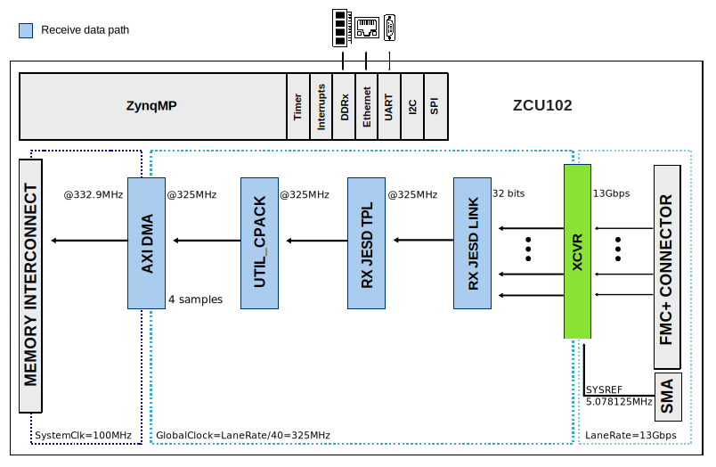
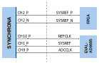
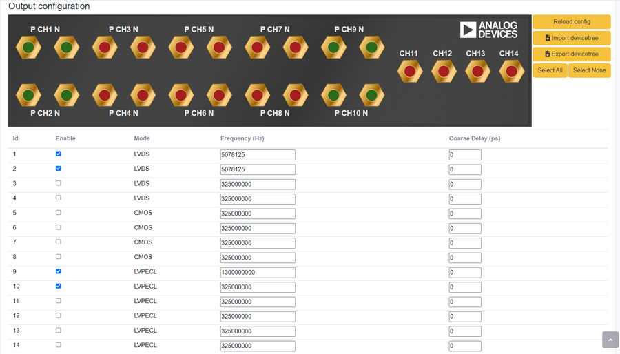

.. _ad9695_fmc:

AD9695-FMC HDL project
===============================================================================

Overview
-------------------------------------------------------------------------------

The :adi:`EVAL-AD9695` is a fully-featured evaluation board for the
:adi:`AD9695`, a dual 14-bit, 1300/625MSPS analog-to-digital converter (ADC)
featuring an on-chip buffer and a sample-and-hold circuit designed for
low power, small size, and ease of use. The dual ADC cores feature a
multistage, differential pipelined architecture with integrated output
error correction logic. Each ADC features wide bandwidth inputs supporting
a variety of user-selectable input ranges. The JESD204B links operate in
subclass 1, with lane rates up to 16 Gbps.

The :git-hdl:`AD9695-FMC <projects/ad9695_fmc>` reference design is a
processor-based embedded system. The design consists of a receive chain that
transports the captured samples from the ADC to the system memory (DDR).

All cores from the receive chain are programmable through an AXI-Lite interface.

Supported boards
-------------------------------------------------------------------------------

- :adi:`EVAL-AD9695` with 1300MSPS

For the 625MSPS variant, additional changes need to be done, which currently
**are not supported by our reference design**.

Supported devices
-------------------------------------------------------------------------------

- :adi:`AD9695` with 1300MSPS

Supported carriers
-------------------------------------------------------------------------------

- :xilinx:`ZCU102` on FMC HPC1

Other required hardware
-------------------------------------------------------------------------------

- :adi:`AD-SYNCHRONA14-EBZ` as an external clock source

Block design
-------------------------------------------------------------------------------

Block diagram
~~~~~~~~~~~~~~~~~~~~~~~~~~~~~~~~~~~~~~~~~~~~~~~~~~~~~~~~~~~~~~~~~~~~~~~~~~~~~~~

The data path and clock domains are depicted in the below diagram:

Clock scheme
~~~~~~~~~~~~~~~~~~~~~~~~~~~~~~~~~~~~~~~~~~~~~~~~~~~~~~~~~~~~~~~~~~~~~~~~~~~~~~~

- Uses an external clock source: :adi:`AD-SYNCHRONA14-EBZ`
- SYSREF clocks are LVDS
- ADCCLK and REFCLK are LVPECL

Configuration modes
~~~~~~~~~~~~~~~~~~~~~~~~~~~~~~~~~~~~~~~~~~~~~~~~~~~~~~~~~~~~~~~~~~~~~~~~~~~~~~~

.. note::

   :adi:`AD9695` supports only JESD204B.

The following are the parameters of this project that can be configured:

- RX_JESD_M: number of converters per link - by default set to 2
- RX_JESD_L: number of lanes per link - by default set to 4
- RX_JESD_S: number of samples per frame - by default set to 1

For more ways to configure this project, check
:adi:`Table 35 from the AD9695 data sheet <media/en/technical-documentation/data-sheets/ad9695.pdf>`,
since in our design
:git-hdl:`NP (or N') is hardcoded to 16 <projects/ad9695_fmc/common/ad9695_fmc_bd.tcl#L10>`.

Keep in mind that the changes should be reflected in software as well.
See `Software related`_ section for details.

Hardware considerations
~~~~~~~~~~~~~~~~~~~~~~~~~~~~~~~~~~~~~~~~~~~~~~~~~~~~~~~~~~~~~~~~~~~~~~~~~~~~~~~

The following connections should be made:

========== ==================
AD9695-FMC AD-SYNCHRONA14-EBZ
========== ==================
J202       CH10_P
J200       CH1_P
P202       CH9_P
========== ==================

====== ==================
ZCU102 AD-SYNCHRONA14-EBZ
====== ==================
J79    CH2_P
J80    CH2_N
====== ==================

The jumper settings are the following, on :adi:`AD9695-FMC <EVAL-AD9695>`:

- Short P1, P304, P305, P307, P308, P309, P311, P312, P602 (SPI enable)
- Short pins {3, 2} on P401 (the two towards the inside of the board)
- DO NOT SHORT P100 (Power Down/Standby)

CPU/Memory interconnects addresses
~~~~~~~~~~~~~~~~~~~~~~~~~~~~~~~~~~~~~~~~~~~~~~~~~~~~~~~~~~~~~~~~~~~~~~~~~~~~~~~

The addresses are dependent on the architecture of the FPGA, having an offset
added to the base address from HDL (see more at :ref:`architecture cpu-intercon-addr`).

================== ===========
Instance           ZynqMP
================== ===========
rx_ad9695_tpl_core 0x84A0_0000
axi_ad9695_rx_xcvr 0x84A6_0000
axi_ad9695_rx_jesd 0x84AA_0000
axi_ad9695_rx_dma  0x9C40_0000
================== ===========

SPI connections
~~~~~~~~~~~~~~~~~~~~~~~~~~~~~~~~~~~~~~~~~~~~~~~~~~~~~~~~~~~~~~~~~~~~~~~~~~~~~~~

.. list-table::
   :widths: 25 25 25 25
   :header-rows: 1

   * - SPI type
     - SPI manager instance
     - SPI subordinate
     - CS
   * - PS
     - SPI 0
     - AD9695
     - 0
   * - PS
     - SPI 1
     - PMOD
     - 0

GPIOs
~~~~~~~~~~~~~~~~~~~~~~~~~~~~~~~~~~~~~~~~~~~~~~~~~~~~~~~~~~~~~~~~~~~~~~~~~~~~~~~

.. list-table::
   :widths: 25 20 20 20 15
   :header-rows: 2

   * - GPIO signal
     - Direction
     - HDL GPIO EMIO
     - Software GPIO
     - Software GPIO
   * -
     - (from FPGA view)
     -
     - Zynq-7000
     - Zynq MP
   * - fdb
     - INOUT
     - 34
     - 88
     - 112
   * - fda
     - INOUT
     - 33
     - 87
     - 111
   * - pwdn
     - INOUT
     - 32
     - 86
     - 110

Interrupts
~~~~~~~~~~~~~~~~~~~~~~~~~~~~~~~~~~~~~~~~~~~~~~~~~~~~~~~~~~~~~~~~~~~~~~~~~~~~~~~

Below are the Programmable Logic interrupts used in this project.

.. list-table::
   :widths: 40 20 20 20
   :header-rows: 1

   * - Instance name
     - HDL
     - Linux ZynqMP
     - Actual ZynqMP
   * - axi_ad9695_rx_dma
     - 13
     - 109
     - 141
   * - axi_ad9695_rx_jesd
     - 12
     - 108
     - 140

Building the HDL project
-------------------------------------------------------------------------------

The design is built upon ADI's generic HDL reference design framework.
ADI distributes the bit/elf files of these projects as part of the
:dokuwiki:`ADI Kuiper Linux <resources/tools-software/linux-software/kuiper-linux>`.
If you want to build the sources, ADI makes them available on the
:git-hdl:`HDL repository </>`. To get the source you must
`clone <https://git-scm.com/book/en/v2/Git-Basics-Getting-a-Git-Repository>`__
the HDL repository.

Examples on how to build the project:

**Linux/Cygwin/WSL**

Example for building with the default configuration:

.. shell::

   $cd hdl/projects/ad9695_fmc/zcu102
   $make

Example for building with parameters:

.. shell::

   $cd hdl/projects/ad9695_fmc/zcu102
   $make RX_JESD_M=2 RX_JESD_L=4

Default values of the ``make`` parameters for AD9695-FMC:

- RX_JESD_M: 2
- RX_JESD_L: 4
- RX_JESD_S: 1

The result of the build, if parameters were used, will be in a folder named
by the configuration used.

If the following command was run

``make RX_JESD_L=4``

then the folder name will be ``RXL4``.

Check `Configuration modes`_ for more details.

A more comprehensive build guide can be found in the :ref:`build_hdl` user guide.

Software considerations
-------------------------------------------------------------------------------

:adi:`AD-SYNCHRONA14-EBZ` output configuration:

Only the channels presented in the clocking selection are relevant.
For the rest, you can either disable them or just put a divided frequency
of the source clock.

More details on how to set up the :adi:`AD-SYNCHRONA14-EBZ` can be found on
:dokuwiki:`its wiki page <resources/eval/user-guides/ad-synchrona14-ebz#gui>`.

Resources
-------------------------------------------------------------------------------

Systems related
~~~~~~~~~~~~~~~~~~~~~~~~~~~~~~~~~~~~~~~~~~~~~~~~~~~~~~~~~~~~~~~~~~~~~~~~~~~~~~~

- :dokuwiki:`AD9695-FMC quick start guide <resources/eval/user-guides/ad9695_fmc>`
- :dokuwiki:`AD-SYNCHRONA14-EBZ User guide <resources/eval/user-guides/ad-synchrona14-ebz>`

Hardware related
~~~~~~~~~~~~~~~~~~~~~~~~~~~~~~~~~~~~~~~~~~~~~~~~~~~~~~~~~~~~~~~~~~~~~~~~~~~~~~~

- Product datasheet: :adi:`AD9695`

HDL related
~~~~~~~~~~~~~~~~~~~~~~~~~~~~~~~~~~~~~~~~~~~~~~~~~~~~~~~~~~~~~~~~~~~~~~~~~~~~~~~

- :git-hdl:`AD9695_FMC HDL project source code <projects/ad9695_fmc>`

.. list-table::
   :widths: 30 35 35
   :header-rows: 1

   * - IP name
     - Source code link
     - Documentation link
   * - AXI_DMAC
     - :git-hdl:`library/axi_dmac`
     - :ref:`axi_dmac`
   * - AXI_SYSID
     - :git-hdl:`library/axi_sysid`
     - :ref:`axi_sysid`
   * - SYSID_ROM
     - :git-hdl:`library/sysid_rom`
     - :ref:`axi_sysid`
   * - UTIL_CPACK2
     - :git-hdl:`library/util_pack/util_cpack2`
     - :ref:`util_cpack2`
   * - UTIL_ADXCVR for AMD
     - :git-hdl:`library/xilinx/util_adxcvr`
     - :ref:`util_adxcvr`
   * - AXI_ADXCVR for AMD
     - :git-hdl:`library/xilinx/axi_adxcvr`
     - :ref:`axi_adxcvr amd`
   * - AXI_JESD204_RX
     - :git-hdl:`library/jesd204/axi_jesd204_rx`
     - :ref:`axi_jesd204_rx`
   * - JESD204_RX
     - :git-hdl:`library/jesd204/jesd204_rx`
     - :ref:`axi_jesd204_rx`
   * - JESD204_TPL_ADC
     - :git-hdl:`library/jesd204/ad_ip_jesd204_tpl_adc`
     - :ref:`ad_ip_jesd204_tpl_adc`

- :dokuwiki:`[Wiki] Generic JESD204B block designs <resources/fpga/docs/hdl/generic_jesd_bds>`
- :ref:`jesd204`

Software related
~~~~~~~~~~~~~~~~~~~~~~~~~~~~~~~~~~~~~~~~~~~~~~~~~~~~~~~~~~~~~~~~~~~~~~~~~~~~~~~

- AD9695-FMC ZCU102 Linux device tree :git-linux:`arch/arm64/boot/dts/xilinx/zynqmp-zcu102-rev10-ad9695.dts`

.. include:: ../common/more_information.rst

.. include:: ../common/support.rst
