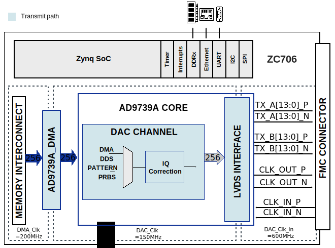
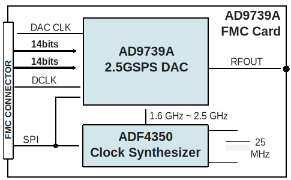

.. _ad9739a_fmc:

AD9739A-FMC HDL project (OBSOLETE)
================================================================================

.. warning::

   The support for :git-hdl:`AD9739A_FMC <hdl_2021_r2:projects/ad9739a_fmc>` HDL
   project has been discontinued, the latest release branch where it can be found
   is ``hdl_2021_r2``. This page is left for legacy purposes only.

Overview
-------------------------------------------------------------------------------

The :adi:`AD9739A` is a 14-bit, 2.5 GSPS high performance RF DAC
capable of synthesizing wideband signals with up to 1.25GHz of bandwidth, from
DC up to 3 GHz.

This reference design includes a single tone sine generator (DDS) and allows
programming the device and monitoring its internal status registers. It also
programs the :adi:`ADF4350` clock chip which can generate a 1.6G Hz
to 2.5 GHz clock for the :adi:`AD9739A` from the on-board 25MHz
crystal. An alternate clock path using an :adi:`ADCLK914` is
available for driving the clock externally.

Supported boards
-------------------------------------------------------------------------------

- :adi:`EVAL-AD9739A`

Supported devices
-------------------------------------------------------------------------------

- :adi:`AD9739A`

Supported carriers
-------------------------------------------------------------------------------

- :xilinx:`ZC706` on FMC LPC slot

Block design
-------------------------------------------------------------------------------

Block diagram
~~~~~~~~~~~~~~~~~~~~~~~~~~~~~~~~~~~~~~~~~~~~~~~~~~~~~~~~~~~~~~~~~~~~~~~~~~~~~~~

The reference design consists of two functional modules, a DDS/LVDS interface
and a SPI interface. It is part of an AXI based microblaze system as shown in
the block diagram below. It is designed to support linux running on microblaze.
All other peripherals are available from Xilinx as IP cores.

The data path and clock domains are depicted in the below diagrams:

Xilinx block diagram
^^^^^^^^^^^^^^^^^^^^^^^^^^^^^^^^^^^^^^^^^^^^^^^^^^^^^^^^^^^^^^^^^^^^^^^^^^^^^^^

AD9739A FMC Card block diagram
^^^^^^^^^^^^^^^^^^^^^^^^^^^^^^^^^^^^^^^^^^^^^^^^^^^^^^^^^^^^^^^^^^^^^^^^^^^^^^^

The DDS consists of a Xilinx DDS IP core and a DDR based data generator. The
core generates 6 samples at every fDAC/3 clock cycles for each port of
:adi:`AD9739A`.

The SPI interface allows programming the :adi:`ADF4350` and/or
:adi:`AD9739A`. The provided SDK software shows the initial setup
required for both the devices for a 2.5GHz DAC clock with a 300MHz single tone
DDS.

Clock scheme
~~~~~~~~~~~~~~~~~~~~~~~~~~~~~~~~~~~~~~~~~~~~~~~~~~~~~~~~~~~~~~~~~~~~~~~~~~~~~~~

Two clock paths are available to drive the clock input on the
:adi:`AD9739A`:

- The factory default option connects the :adi:`ADF4350` to
  the :adi:`AD9739A`. The :adi:`ADF4350` is able to
  synthesize a clock over the entire specified range of
  the :adi:`AD9739A` (1.6GHz to 2.5GHz)

  - Jumper CLOCK SOURCE (S1) must be moved to the :adi:`ADF4350`
    position

- Alternatively, an external clock can be provided via the SMA CLKIN (J3) jack

  - Jumper CLOCK SOURCE (S1) must be moved to the :adi:`ADCLK914`
    position. C102 and C99 on the back of the board also need to be removed
    from their default position, and then soldered into the vertical position
    from the large square pad they were previously soldered to and the narrow
    pads closer to the :adi:`ADCLK914` (U3). Observe the
    orientation of the caps before removing them; they must be soldered with
    their narrow edge against the PCB, and not the wide side as is common
    with most components.

CPU/Memory interconnects addresses
~~~~~~~~~~~~~~~~~~~~~~~~~~~~~~~~~~~~~~~~~~~~~~~~~~~~~~~~~~~~~~~~~~~~~~~~~~~~~~~

The addresses are dependent on the architecture of the FPGA, having an offset
added to the base address from HDL (see more at :ref:`architecture cpu-intercon-addr`).

==================== ===============
Instance             Zynq/Microblaze
==================== ===============
axi_ad9739a          0x7420_0000
axi_ad9739a_dma      0x7C42_0000
==================== ===============

SPI connections
~~~~~~~~~~~~~~~~~~~~~~~~~~~~~~~~~~~~~~~~~~~~~~~~~~~~~~~~~~~~~~~~~~~~~~~~~~~~~~~

.. list-table::
   :widths: 25 25 25 25
   :header-rows: 1

   * - SPI type
     - SPI manager instance
     - SPI subordinate
     - CS
   * - PS
     - SPI 0
     - ADF4350
     - 0
   * - PS
     - SPI 0
     - ADCLK914
     - 0

Building the HDL project
-------------------------------------------------------------------------------

The design is built upon ADI's generic HDL reference design framework.
ADI distributed the bit/elf files of this project as part of the
:dokuwiki:`ADI Kuiper Linux <resources/tools-software/linux-software/kuiper-linux>`
until the 2021_R2 release. The prebuilt files can be found in the previous link.
Afterwards, it was discontinued.

But, if you want to build the sources, ADI makes them available on the
:git-hdl:`HDL repository </>`. To get the source you must
`clone <https://git-scm.com/book/en/v2/Git-Basics-Getting-a-Git-Repository>`__
the HDL repository and checkout the last release branch where this project
still exists, ``hdl_2021_r2``.

Then go to the hdl/projects/ad9739a_fmc/$zc706 location and run the make
command.

.. shell::

   /hdl
   $git checkout hdl_2021_r2
   $cd projects/ad9739a_fmc/zc706
   $make

A more comprehensive build guide can be found in the :ref:`build_hdl` user
guide.

Resources
-------------------------------------------------------------------------------

Systems related
~~~~~~~~~~~~~~~~~~~~~~~~~~~~~~~~~~~~~~~~~~~~~~~~~~~~~~~~~~~~~~~~~~~~~~~~~~~~~~~

- :dokuwiki:`[Wiki] AD9737A-EBZ/AD9739A-EBZ Quick Start Guide <resources/eval/dpg/ad9739a-ebz>`
  (with ACE)
- :dokuwiki:`[Wiki] AD9739A Native FMC Card/Xilinx Reference Designs <resources/fpga/xilinx/fmc/ad9739a>`

Hardware related
~~~~~~~~~~~~~~~~~~~~~~~~~~~~~~~~~~~~~~~~~~~~~~~~~~~~~~~~~~~~~~~~~~~~~~~~~~~~~~~

- Product datasheets: :adi:`AD9739A`

HDL related
~~~~~~~~~~~~~~~~~~~~~~~~~~~~~~~~~~~~~~~~~~~~~~~~~~~~~~~~~~~~~~~~~~~~~~~~~~~~~~~

- :git-hdl:`AD9739A-FMC HDL project source code <hdl_2021_r2:projects/ad9739a_fmc>`

.. list-table::
   :widths: 30 35 35
   :header-rows: 1

   * - IP name
     - Source code link
     - Documentation link
   * - AXI_AD9739A
     - :git-hdl:`hdl_2021_r2:library/axi_ad9739a`
     - —
   * - AXI_DMAC
     - :git-hdl:`hdl_2021_r2:library/axi_dmac`
     - :ref:`axi_dmac`
   * - AXI_CLKGEN
     - :git-hdl:`hdl_2021_r2:library/axi_clkgen`
     - :ref:`axi_clkgen`
   * - AXI_SYSID
     - :git-hdl:`hdl_2021_r2:library/axi_sysid`
     - :ref:`axi_sysid`
   * - AXI_HDMI_TX
     - :git-hdl:`hdl_2021_r2:library/axi_hdmi_tx`
     - :ref:`axi_hdmi_tx`
   * - AXI_SPDIF_TX
     - :git-hdl:`hdl_2021_r2:library/axi_spdif_tx`
     - 	—
   * - SYSID_ROM
     - :git-hdl:`hdl_2021_r2:library/sysid_rom`
     - :ref:`axi_sysid`

Software related
~~~~~~~~~~~~~~~~~~~~~~~~~~~~~~~~~~~~~~~~~~~~~~~~~~~~~~~~~~~~~~~~~~~~~~~~~~~~~~~

- :git-linux:`AD9739A-FMC Linux driver <2021_R2:drivers/iio/frequency/ad9739a.c>`
- :git-linux:`AD9739A-FMC Linux device tree <2021_R2:arch/arm/boot/dts/zynq-zc706-adv7511-ad9739a-fmc.dts>`
- :git-no-os:`AD9739A-FMC No-Os project <2021_R2:drivers/dac/ad9739a>`
- :git-no-os:`AD9739A-FMC No-Os driver <2021_R2:drivers/dac/ad9739a/ad9739a.c>`

.. include:: ../common/more_information.rst

.. include:: ../common/support.rst
