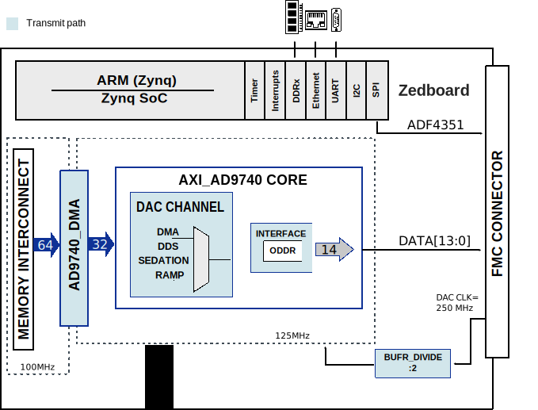

.. _ad9740_fmc:

AD9740-FMC HDL project
================================================================================

Overview
-------------------------------------------------------------------------------

The :adi:`AD9740`, :adi:`AD9742`, :adi:`AD9744` and :adi:`AD9748` are wideband,
3G members of the TxDAC® series of high performance, low power CMOS,
digital-to-analog converters (DACs). The TxDAC family, consisting of
pin-compatible 14-, 12-, 10-, and 8-bit DACs, is specifically optimized for the
transmit signal path of communication systems. All the devices share the same
interface options, small outline package, and pinout. The :adi:`AD9740`,
:adi:`AD9742`, :adi:`AD9744` and :adi:`AD9748` also provide an upward or
downward component selection path based on performance, resolution and
financial cost, offering exceptional AC and DC performance while supporting
update rates up to 210 MSPS.

The :adi:`EVAL-AD9740`, :adi:`EVAL-AD9742`, :adi:`EVAL-AD9744` and
:adi:`EVAL-AD9748` evaluation boards are FMC form-factor boards with FMC
connector that is compatible to the Vita 57.1 standard. This board provides the
user with the flexibility to operate the :adi:`AD9740`, :adi:`AD9742`,
:adi:`AD9744` and :adi:`AD9748` in various configurations.

Output configurations include transformer-coupled, resistor terminated, and
single and differential outputs. The digital inputs are designed to be driven
from various word generators with the onboard option to add a resistor network
for proper load termination. Provisions are also made to operate the
:adi:`AD9740`, :adi:`AD9742`, :adi:`AD9744` and :adi:`AD9748` with either the 
onboard clock source (:adi:`ADF4351`) or with external clock configuration.

Supported boards
-------------------------------------------------------------------------------

- :adi:`EVAL-AD9740`
- :adi:`EVAL-AD9742`
- :adi:`EVAL-AD9744`
- :adi:`EVAL-AD9748` 

Supported devices
-------------------------------------------------------------------------------

-  :adi:`AD9740`
-  :adi:`AD9742`
-  :adi:`AD9744`
-  :adi:`AD9748`

Supported carriers
-------------------------------------------------------------------------------

.. list-table::
   :widths: 35 35 30
   :header-rows: 1

   * - Evaluation board
     - Carrier
     - FMC slot
   * - :adi:`EVAL-AD9740`
     - `ZedBoard <https://digilent.com/shop/zedboard-zynq-7000-arm-fpga-soc-development-board>`__
     - FMC-LPC
   * - :adi:`EVAL-AD9742`
     - `ZedBoard <https://digilent.com/shop/zedboard-zynq-7000-arm-fpga-soc-development-board>`__
     - FMC-LPC
   * - :adi:`EVAL-AD9744`
     - `ZedBoard <https://digilent.com/shop/zedboard-zynq-7000-arm-fpga-soc-development-board>`__
     - FMC-LPC
   * - :adi:`EVAL-AD9748`
     - `ZedBoard <https://digilent.com/shop/zedboard-zynq-7000-arm-fpga-soc-development-board>`__
     - FMC-LPC

Block design
-------------------------------------------------------------------------------

.. warning::

    The VADJ for Zedboard must be set to 3.3V.

Block diagram
~~~~~~~~~~~~~~~~~~~~~~~~~~~~~~~~~~~~~~~~~~~~~~~~~~~~~~~~~~~~~~~~~~~~~~~~~~~~~~~

The data path and clock domains are depicted in the below diagram:

CPU/Memory interconnects addresses
~~~~~~~~~~~~~~~~~~~~~~~~~~~~~~~~~~~~~~~~~~~~~~~~~~~~~~~~~~~~~~~~~~~~~~~~~~~~~~~

The addresses are dependent on the architecture of the FPGA, having an offset
added to the base address from HDL (see more at :ref:`architecture cpu-intercon-addr`).

====================  ===============
Instance              Zynq
====================  ===============
ad9740_dac            0x44A7_0000
ad9740_dma            0x44A4_0000
====================  ===============

Interrupts
~~~~~~~~~~~~~~~~~~~~~~~~~~~~~~~~~~~~~~~~~~~~~~~~~~~~~~~~~~~~~~~~~~~~~~~~~~~~~~~

Below are the Programmable Logic interrupts used in this project.

================ === ========== ===========
Instance name    HDL Linux Zynq Actual Zynq
================ === ========== ===========
ad9740_dma       13  57         89
================ === ========== ===========

Building the HDL project
-------------------------------------------------------------------------------

The design is built upon ADI's generic HDL reference design framework.
ADI distributes the bit/elf files of these projects as part of the
:dokuwiki:`ADI Kuiper Linux <resources/tools-software/linux-software/kuiper-linux>`.
If you want to build the sources, ADI makes them available on the
:git-hdl:`HDL repository </>`. To get the source you must
`clone <https://git-scm.com/book/en/v2/Git-Basics-Getting-a-Git-Repository>`__
the HDL repository, and then build the project as follows:

**Linux/Cygwin/WSL**

.. shell:: bash
  :user: user
  :group: analog

  $cd hdl/projects/ad9740_fmc/zed
  $make

A more comprehensive build guide can be found in the :ref:`build_hdl` user guide.

Resources
-------------------------------------------------------------------------------

Systems related
~~~~~~~~~~~~~~~~~~~~~~~~~~~~~~~~~~~~~~~~~~~~~~~~~~~~~~~~~~~~~~~~~~~~~~~~~~~~~~~

- :dokuwiki:`[Wiki] Evaluating the AD9740/AD9742/AD9744/AD9748 Digital-to-Analog Converters <resources/eval/dpg/eval-ad9744>`

Hardware related
~~~~~~~~~~~~~~~~~~~~~~~~~~~~~~~~~~~~~~~~~~~~~~~~~~~~~~~~~~~~~~~~~~~~~~~~~~~~~~~

- Product datasheets:

   -  :adi:`AD9740`
   -  :adi:`AD9742`
   -  :adi:`AD9744`
   -  :adi:`AD9748`

HDL related
~~~~~~~~~~~~~~~~~~~~~~~~~~~~~~~~~~~~~~~~~~~~~~~~~~~~~~~~~~~~~~~~~~~~~~~~~~~~~~~

- :git-hdl:`EVAL-AD9740-FMC HDL project source code <projects/ad9740_fmc>`

.. list-table::
   :widths: 30 35 35
   :header-rows: 1

   * - IP name
     - Source code link
     - Documentation link

   * - AXI_AD9740
     - :git-hdl:`library/axi_ad9740`
     - :ref:`axi_ad9740`
   * - AXI_DMAC
     - :git-hdl:`library/axi_dmac`
     - :ref:`axi_dmac`
   * - AXI_HDMI_TX
     - :git-hdl:`library/axi_hdmi_tx`
     - :ref:`axi_hdmi_tx`
   * - AXI_I2S_ADI
     - :git-hdl:`library/axi_i2s_adi`
     - —
   * - AXI_SPDIF_TX
     - :git-hdl:`library/axi_spdif_tx`
     - 	—
   * - AXI_SYSID
     - :git-hdl:`library/axi_sysid`
     - :ref:`axi_sysid`
   * - SYSID_ROM
     - :git-hdl:`library/sysid_rom`
     - :ref:`axi_sysid`
   * - UTIL_I2C_MIXER
     - :git-hdl:`library/util_i2c_mixer`
     - 	—

Software related
~~~~~~~~~~~~~~~~~~~~~~~~~~~~~~~~~~~~~~~~~~~~~~~~~~~~~~~~~~~~~~~~~~~~~~~~~~~~~~

.. include:: ../common/more_information.rst

.. include:: ../common/support.rst
