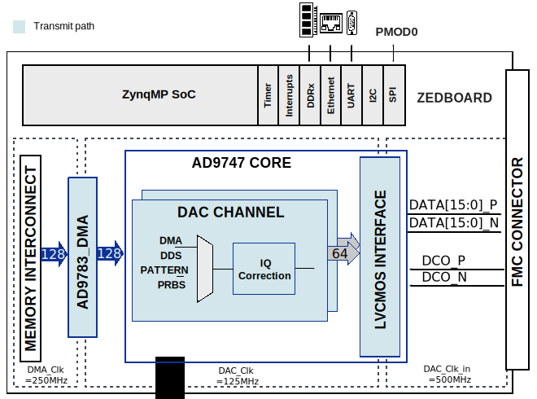

.. _ad9747_ebz_hdl:

AD9747-EBZ HDL project
================================================================================

Overview
-------------------------------------------------------------------------------

The :adi:`AD9747` is a pin-compatible, high dynamic range, dual
digital-to-analog converter (DAC) with 16-bit resolution and sample rates of up 
to 250 MSPS. The device includes specific features for direct conversion 
transmit applications, including gain and offset compensation, and it interfaces
seamlessly with analog quadrature modulators, such as the ADL5370. Low noise and 
intermodulation distortion (IMD) enables high quality synthesis of wideband 
signals. Proprietary switching output for enhanced dynamic performance. 
Programmable current outputs and dual auxiliary DACs provide flexibility and 
system enhancements.

Supported boards
-------------------------------------------------------------------------------

- :adi:`EVAL-AD9747`

Supported devices
-------------------------------------------------------------------------------

- :adi:`AD9747`

Supported carriers
-------------------------------------------------------------------------------

.. list-table::
   :widths: 35 35 30
   :header-rows: 1

   * - Evaluation board
     - Carrier
     - FMC slot
   * - :adi:`EVAL-AD9747`
     - :xilinx:`ZedBoard <products/boards-and-kits/1-8dyf-11.html>`
     - FMC LPC

Block design
-------------------------------------------------------------------------------

Block diagram
~~~~~~~~~~~~~~~~~~~~~~~~~~~~~~~~~~~~~~~~~~~~~~~~~~~~~~~~~~~~~~~~~~~~~~~~~~~~~~~

Clock scheme
~~~~~~~~~~~~~~~~~~~~~~~~~~~~~~~~~~~~~~~~~~~~~~~~~~~~~~~~~~~~~~~~~~~~~~~~~~~~~~~

.. SECTION IN PROGRESS

There are multiple ways to configure the clock source for :adi:`AD9747`.
In this section is presented a guide on how to rework the board to the desired
user clock circuitry. Below is a table on what components are needed to install
or uninstall on the evaluation board.

==================== ======================================== ================
Clock Configuration  Install                                  Uninstall
==================== ======================================== ================
t.b.a                t.b.a                                    t.b.a
==================== ======================================== ================

CPU/Memory interconnects addresses
~~~~~~~~~~~~~~~~~~~~~~~~~~~~~~~~~~~~~~~~~~~~~~~~~~~~~~~~~~~~~~~~~~~~~~~~~~~~~~~

.. SECTION IN PROGRESS

The addresses are dependent on the architecture of the FPGA, having an offset
added to the base address from HDL(see more at :ref:`architecture`).

==================== ===============
Instance             Zynq/Microblaze
==================== ===============
t.b.a                t.b.a
==================== ===============

SPI connections
~~~~~~~~~~~~~~~~~~~~~~~~~~~~~~~~~~~~~~~~~~~~~~~~~~~~~~~~~~~~~~~~~~~~~~~~~~~~~~~

.. SECTION IN PROGRESS

.. list-table::
   :widths: 25 25 25 25
   :header-rows: 1

   * - SPI type
     - SPI manager instance
     - SPI subordinate
     - CS
   * - ---
     - ---
     - ---
     - ---

Interrupts
~~~~~~~~~~~~~~~~~~~~~~~~~~~~~~~~~~~~~~~~~~~~~~~~~~~~~~~~~~~~~~~~~~~~~~~~~~~~~~~

.. SECTION IN PROGRESS

Below are the Programmable Logic interrupts used in this project.

================ === ========== ===========
Instance name    HDL Linux Zynq Actual Zynq
================ === ========== ===========
t.b.a            -1  -1         -1
================ === ========== ===========

These are the board-specific interrupts
(found in :git-hdl:`here <projects/ad9747_fmc/common/ad9747_bd.tcl>`).

Building the HDL project
-------------------------------------------------------------------------------

The design is built upon ADI's generic HDL reference design framework.
ADI does not distribute the bit/elf files of these projects so they
must be built from the sources available :git-hdl:`here </>`. To get
the source you must
`clone <https://git-scm.com/book/en/v2/Git-Basics-Getting-a-Git-Repository>`__
the HDL repository.

Then go to the project location (**projects/ad9747_ebz/carrier**) and run the
make command by typing in your command prompt (this example is for
:xilinx:`ZedBoard <products/boards-and-kits/1-8dyf-11.html>`):

**Linux/Cygwin/WSL**

.. code-block::

   user@analog:~$ cd hdl/projects/ad9747_ebz/zed
   user@analog:~/hdl/projects/ad9747_ebz/zed$ make

A more comprehensive build guide can be found in the :ref:`build_hdl` user
guide.

Resources
-------------------------------------------------------------------------------

Systems related
~~~~~~~~~~~~~~~~~~~~~~~~~~~~~~~~~~~~~~~~~~~~~~~~~~~~~~~~~~~~~~~~~~~~~~~~~~~~~~~

.. SECTION IN PROGRESS

Here you can find the quick start guides available for these evaluation boards:

.. list-table::
   :widths: 20 10
   :header-rows: 1

   * - Evaluation board
     - Zynq-7000
   * - AD9747-EBZ
     - :dokuwiki:`ZedBoard <resources/fpga/xilinx/fmc/ad9747>`

Hardware related
~~~~~~~~~~~~~~~~~~~~~~~~~~~~~~~~~~~~~~~~~~~~~~~~~~~~~~~~~~~~~~~~~~~~~~~~~~~~~~~

- Product datasheets: :adi:`AD9747`
- :dokuwiki:`EVAL-AD9747 user guide <resources/eval/ad9747fmc>`

HDL related
~~~~~~~~~~~~~~~~~~~~~~~~~~~~~~~~~~~~~~~~~~~~~~~~~~~~~~~~~~~~~~~~~~~~~~~~~~~~~~~

-  :git-hdl:`AD9747-FMC HDL project source code <projects/ad9747_fmc>`

.. list-table::
   :widths: 30 35 35
   :header-rows: 1

   * - IP name
     - Source code link
     - Documentation link
   * - AXI_AD9747
     - :git-hdl:`library/axi_ad9747 <library/axi_ad9747>`
     - ---
   * - AXI_DMAC
     - :git-hdl:`library/axi_dmac <library/axi_dmac>`
     - :ref:`here <axi_dmac>`
   * - AXI_CLKGEN
     - :git-hdl:`library/axi_clkgen <library/axi_clkgen>`
     - :dokuwiki:`[Wiki] <resources/fpga/docs/axi_clkgen>`
   * - AXI_HDMI_TX
     - :git-hdl:`library/axi_hdmi_tx <library/axi_hdmi_tx>`
     - :dokuwiki:`[Wiki] <resources/fpga/docs/axi_hdmi_tx>`
   * - AXI_SPDIF_TX
     - :git-hdl:`library/axi_spdif_tx <library/axi_spdif_tx>`
     - ---
   * - AXI_SYSID
     - :git-hdl:`library/axi_sysid <library/axi_sysid>`
     - :dokuwiki:`[Wiki] <resources/fpga/docs/axi_sysid>`
   * - SYSID_ROM
     - :git-hdl:`library/sysid_rom <library/sysid_rom>`
     - :dokuwiki:`[Wiki] <resources/fpga/docs/axi_sysid>`

Software related
~~~~~~~~~~~~~~~~~~~~~~~~~~~~~~~~~~~~~~~~~~~~~~~~~~~~~~~~~~~~~~~~~~~~~~~~~~~~~~~

- (t.b.a. Linux device tree)
- (t.b.a. Linux driver)

.. include:: ../common/more_information.rst

.. include:: ../common/support.rst