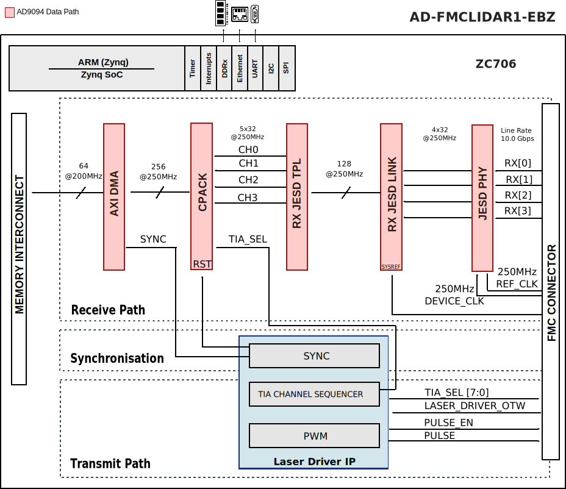

.. _ad_fmclidar1_ebz:

AD-FMCLIDAR1-EBZ HDL project (OBSOLETE)
================================================================================

.. warning::

   The support for :git-hdl:`AD-FMCLIDAR1-EBZ <hdl_2019_r1:projects/ad_fmclidar1_ebz>`
   HDL project has been discontinued, the latest release branch where it can be found
   is ``hdl_2019_r1``. This page is left for legacy purposes only.

Overview
-------------------------------------------------------------------------------

The :adi:`AD-FMCLIDAR1-EBZ` is a prototyping platform for
LiDAR applications that can be used on FPGA development boards enabled with FMC
HPC connector and JESD204B support capability. It offers developers a
working-out-of-box platform that can be used for developing software and
algorithms for a broad range of applications.

The full system hardware includes Data Acquisition(DAQ) Board, Laser Transmitter
Board, and the AFE Receiver Board.

Supported boards
-------------------------------------------------------------------------------

- :adi:`AD-FMCLIDAR1-EBZ`

Supported carriers
-------------------------------------------------------------------------------

- :xilinx:`ZC706` on FMC HPC
- :xilinx:`ZCU102` on on FMC HPC0
- :intel:`A10SoC <content/www/us/en/products/details/fpga/development-kits/arria/10-sx.html>` on FMC HPC

.. important::

   The Arria10SOC carrier requires a hardware rework to function correctly.
   The rework connects FMC_A header pins directly to the FPGA so that they
   can be accessed by the fabric.

   Changes required:

   - REMOVE: R575, R576, R621, R633, R612, R613
   - POPULATE: R574, R577, R620, R632, R610, R611

Block design
-------------------------------------------------------------------------------

Block diagram
~~~~~~~~~~~~~~~~~~~~~~~~~~~~~~~~~~~~~~~~~~~~~~~~~~~~~~~~~~~~~~~~~~~~~~~~~~~~~~~

The main scope of the HDL design is to provide all the required digital
interfaces for the data acquisition board of the prototyping system.

The following block diagram presents the simplified system architecture:

AXI Laser Driver IP
~~~~~~~~~~~~~~~~~~~~~~~~~~~~~~~~~~~~~~~~~~~~~~~~~~~~~~~~~~~~~~~~~~~~~~~~~~~~~~~

The axi_laser_driver IP is responsible to generate a narrow pulse for the laser
driver circuit, to control the TIA channel selection on the analog front end (AFE)
board, and to synchronize the data acquisition to the generated pulses.

More information about the IP can be found at :ref:`axi_laser_driver`.

Control interfaces
~~~~~~~~~~~~~~~~~~~~~~~~~~~~~~~~~~~~~~~~~~~~~~~~~~~~~~~~~~~~~~~~~~~~~~~~~~~~~~~

============================ ============ ============================================================================================
Name                         Type         Details
============================ ============ ============================================================================================
adc_fd*                      GPIO         Monitors the AD9094 Fast detect output lines
adc_pwdn                     GPIO         Controls the AD9094 Power-Down input line
spi_adc_*                    4-wire SPI   AD9094 configuration interface
spi_vco_*                    3-wire SPI   ADF436-7 configuration interface
spi_clkgen_*                 4-wire SPI   AD9528 configuration interface
laser_driver_p\n             LVDS output  It controls the laser driver circuit, it is generated by the axi_laser_driver IP instance
laser_gpio[13:0]             GPIO         Unused GPIO line on the lase board
tia_chsel[7:0]               CMOS output  TIA channel selection lines, it is controlled by the axi_laser_driver instance
afe_dac_sda\scl\load\clr_n   I2C/GPIO     AD5627 configuration interface
rx_ref_clk_p\n               LVDS         JESD204B reference clock for the high-speed gigabit transceivers; runs at 250MHz
rx_device_clk_p\n            LVDS         JESD204B device clock for the transport layer and additional data processing; runs at 250MHz
rx_data_p\n[3:0]             CML          JESD204B high-speed serial lanes; runs at 10Gbps
rx_sync_p\n[1:0]             LVDS         JESD204B SYNC signals for interface synchronization
rx_sysref_p\n                LVDS         JESD204B SYSREF signal for deterministic latency
============================ ============ ============================================================================================

JESD204B interface
~~~~~~~~~~~~~~~~~~~~~~~~~~~~~~~~~~~~~~~~~~~~~~~~~~~~~~~~~~~~~~~~~~~~~~~~~~~~~~~

The JESD204B interface runs in Subclass 1 mode to ensure the deterministic
latency of the link. The following tables are summarizing the JESD204B important
configuration parameter and attributes.

=============================== ============ =====
Parameter name                  Abbreviation Value
=============================== ============ =====
Number of lanes                 L            4
Number of converter             M            4
Converter resolution            NP           8
Total number of Bits per Sample NP           8
Samples per frame               S            1
Octets per frame                F            1
Frames per Multiframe           K            32
Number of control bits          CS           0
=============================== ============ =====

================== =======
Rates and Clocks   Value
================== =======
Sample rate        1 GSPS
Lane rate          10 Gbps
GT reference clock 250 MHz
Device clock       250 MHz
================== =======

CPU/Memory interconnects addresses
~~~~~~~~~~~~~~~~~~~~~~~~~~~~~~~~~~~~~~~~~~~~~~~~~~~~~~~~~~~~~~~~~~~~~~~~~~~~~~~

The addresses are dependent on the architecture of the FPGA, having an offset
added to the base address from HDL (see more at :ref:`architecture cpu-intercon-addr`).

================== ========== ==========
Instance           ZCU102     ZC706     
================== ========== ==========
afe_dac_iic        0x7c800000 ---       
axi_ad9694_xcvr    0x44A50000 0x44A50000
ad9694_tpl_core    0x44A10000 0x44A10000
ad9694_jesd        0x44AA0000 0x44AA0000
ad9694_dma         0x7c400000 0x7c400000
axi_spi_vco        0x7c500000 0x7c500000
axi_spi_afe_adc    0x7c600000 0x7c600000
axi_laser_driver_0 0x7c700000 0x7c700000
================== ========== ==========

================================ ==========
Instance                         A10SoC
================================ ==========
sys_spi_clockgen                 0x00000060
sys_spi_vco                      0x00000080
sys_spi_afe_adc                  0x000000A0
ad9694_jesd204.link_reconfig     0x00040000 
ad9694_jesd204.link_management   0x00044000 
ad9694_jesd204.link_pll_reconfig 0x00045000 
ad9694_jesd204.phy_reconfig_0    0x00048000 
ad9694_jesd204.phy_reconfig_1    0x00049000 
ad9694_jesd204.phy_reconfig_2    0x0004a000 
ad9694_jesd204.phy_reconfig_3    0x0004b000
axi_ad9694_dma                   0x0004c000
axi_ad9694                       0x00050000
axi_laser_driver_0               0x00060000
avl_laser_gpio                   0x00070000
================================ ==========

SPI connections
~~~~~~~~~~~~~~~~~~~~~~~~~~~~~~~~~~~~~~~~~~~~~~~~~~~~~~~~~~~~~~~~~~~~~~~~~~~~~~~

+------------------------------+---------------------------------+------------------+----+
|           SPI type           | SPI manager instance            | SPI subordinate  | CS |
+--------------+---------------+--------------+------------------+------------------+----+
| ZC706/ZCU102 | A10SoC        | ZC706/ZCU102 | A10SoC           |                  |    |
+==============+===============+==============+==================+==================+====+
| PS           | PL            | SPI 0        | ---              | AD9094           | 0  |
+--------------+---------------+--------------+------------------+------------------+----+
| PS           | PL            | SPI 1        | SYS_SPI/AXI_SPI  | AD9528           | 0  |
+--------------+---------------+--------------+------------------+------------------+----+
| PL           | PL            | AXI_QUAD_SPI | SYS_SPI/AXI_SPI  | ADF4360-7        | 0  |
+--------------+---------------+--------------+------------------+------------------+----+
| PL           | ---           | AXI_QUAD_SPI | SYS_SPI/AXI_SPI  | AD5627           | 0  |
+--------------+---------------+--------------+------------------+------------------+----+

GPIOs
~~~~~~~~~~~~~~~~~~~~~~~~~~~~~~~~~~~~~~~~~~~~~~~~~~~~~~~~~~~~~~~~~~~~~~~~~~~~~~~

+-------------------+-----------------+----------------+---------------+---------------+---------------+
|  GPIO signal      | Direction       | HDL GPIO EMIO  | Software GPIO | Software GPIO | Software GPIO |
|                   | (from FPGA      +--------+-------+ Zynq MP       | Zynq          | Arria 10      |
|                   | view)           | Xilinx | Intel |               |               |               |
+===================+=================+========+=======+===============+===============+===============+
| laser_gpio[13:0]  | INOUT           | 51-38  | ---   | 129-116       | 105-92        | ---           |
+-------------------+-----------------+--------+-------+---------------+---------------+---------------+
| afe_adc_convst    | OUTPUT          | 37     | 37    | 115           | 91            | 5             |
+-------------------+-----------------+--------+-------+---------------+---------------+---------------+
| afe_dac_load      | OUTPUT          | 36     | 36    | 114           | 90            | 4             |
+-------------------+-----------------+--------+-------+---------------+---------------+---------------+
| afe_dac_clr_n     | OUTPUT          | 35     | 35    | 113           | 89            | 3             |
+-------------------+-----------------+--------+-------+---------------+---------------+---------------+
| adc_pdwn          | INOUT           | 34     | 34    | 112           | 88            | 2             |
+-------------------+-----------------+--------+-------+---------------+---------------+---------------+
| adc_fdb           | INOUT           | 33     | 33    | 111           | 87            | 1             |
+-------------------+-----------------+--------+-------+---------------+---------------+---------------+
| adc_fda           | INOUT           | 32     | 32    | 110           | 86            | 0             |
+-------------------+-----------------+--------+-------+---------------+---------------+---------------+

Interrupts
~~~~~~~~~~~~~~~~~~~~~~~~~~~~~~~~~~~~~~~~~~~~~~~~~~~~~~~~~~~~~~~~~~~~~~~~~~~~~~~

Below are the Programmable Logic interrupts used in this project.

================== === ========== ============ =============
Instance name      HDL Microblaze Linux ZynqMP Actual ZynqMP
================== === ========== ============ =============
ad9694_jesd        11  14         109          141          
afe_dac_iic        12  14         109          141          
ad9694_dma         13  12         107          139          
axi_spi_vco        10  15         110          142          
axi_spi_afe_adc    9   8          103          135          
axi_laser_driver_0 8   7          102          134          
================== === ========== ============ =============

================== === ======
Instance name      HDL A10SoC
================== === ======
sys_spi_clockgen   8   27
sys_spi_vco        9   28
sys_spi_afe_adc    10  29
ad9694_jesd204     11  30
axi_ad9694_dma     12  31
axi_laser_driver_0 13  32
avl_laser_gpio.irq 14  33
================== === ======

Known issues
~~~~~~~~~~~~~~~~~~~~~~~~~~~~~~~~~~~~~~~~~~~~~~~~~~~~~~~~~~~~~~~~~~~~~~~~~~~~~~~

If the Lidar board do not power up.

**Problem:** The Lidar boards do not power up because the PG_C2M pull-up
resistor value on the carrier (Arria 10) is too high.

**Solution:** On Arria 10 - place a 4k7 ohms resistor in parallel with R5517.

**Note:**

The PG_C2M can no longer be software controlled. As soon as there is an
auxiliary 3V3 on the carrier, the Lidar platform receives the power up command.
This problem only affects Lidar Rev B.

Building the HDL project
-------------------------------------------------------------------------------

The design is built upon ADI's generic HDL reference design framework.
ADI distributed the bit/elf files of this project as part of the
:dokuwiki:`ADI Kuiper Linux <resources/tools-software/linux-software/kuiper-linux>`
until the 2019_R1 release. The prebuilt files can be found in the previous link.
Afterwards, it was discontinued.

But, if you want to build the sources, ADI makes them available on the
:git-hdl:`HDL repository </>`. To get the source you must
`clone <https://git-scm.com/book/en/v2/Git-Basics-Getting-a-Git-Repository>`__
the HDL repository and checkout the last release branch where this project
still exists, ``hdl_2019_r1``.

Then go to the hdl/projects/ad_fmclidar1_ebz/$zc706 location and run the make
command. You can also go to the other folder for different carriers.

.. shell::

   /hdl
   $git checkout hdl_2019_r1
   $cd projects/ad_fmclidar1_ebz/zc706
   $make

A more comprehensive build guide can be found in the :ref:`build_hdl` user
guide.

Resources
-------------------------------------------------------------------------------

Parts
~~~~~~~~~~~~~~~~~~~~~~~~~~~~~~~~~~~~~~~~~~~~~~~~~~~~~~~~~~~~~~~~~~~~~~~~~~~~~~~

Laser Board

- :adi:`3.3 V, 200 Mbps, Half-Duplex, High Speed M-LVDS Transceiver with Type 1 Receiver <ADN4691E>`
- :adi:`High Speed, Dual, 4 A MOSFET Driver, non-inverting A/B input pins, 9.5V < VIN < 18V <ADP3634>`
- :adi:`Ultralow Noise Drivers for Low Voltage ADCs <ADA4930-1>`

DAQ Board

- :adi:`8-Bit, 1 GSPS, JESD204B, Quad Analog-to-Digital Converter <AD9094>`
- :adi:`Integrated Synthesizer and VCO <ADF4360-7>`
- :adi:`JESD204B/JESD204C Clock Generator with 14 LVDS/HSTL Outputs <AD9528>`
- :adi:`1.2 A, Ultralow Noise, High PSRR, Fixed Output, RF Linear Regulator <aADP7156>`
- :adi:`2 A, Ultralow Noise, High PSRR, Adjustable Output, RF Linear Regulator <ADP7159>`

AFE Board

- :adi:`Four-Channel Multiplexed Transimpedance Amplifier with Output Multiplexing <LTC6561>`
- :adi:`Low Power Selectable Gain Differential ADC Driver <ADA4950-1>`
- :adi:`Dual 3.2MHz, 0.8V/μs Low Power, Over-The-Top Precision Op Amp <LT6016>`
- :adi:`Micropower, Precision, Auto Qualified 2.5V Voltage Reference <ADR3525>`
- :adi:`Low IQ Boost/SEPIC/Flyback/Inverting Converter with 0.5A, 140V Switch <LT8331>`

Systems related
~~~~~~~~~~~~~~~~~~~~~~~~~~~~~~~~~~~~~~~~~~~~~~~~~~~~~~~~~~~~~~~~~~~~~~~~~~~~~~~

- :dokuwiki:`[Wiki] AD-FMCLIDAR1-EBZ <resources/eval/user-guides/ad-fmclidar1-ebz>`

Hardware related
~~~~~~~~~~~~~~~~~~~~~~~~~~~~~~~~~~~~~~~~~~~~~~~~~~~~~~~~~~~~~~~~~~~~~~~~~~~~~~~

- Product datasheets: :adi:`AD-FMCLIDAR1-EBZ`

HDL related
~~~~~~~~~~~~~~~~~~~~~~~~~~~~~~~~~~~~~~~~~~~~~~~~~~~~~~~~~~~~~~~~~~~~~~~~~~~~~~~

- :git-hdl:`AD-FMCLIDAR1-EBZ HDL project source code <hdl_2019_r1:projects/ad_fmclidar1_ebz>`

.. list-table::
   :widths: 30 35 35
   :header-rows: 1

   * - IP name
     - Source code link
     - Documentation link
   * - AXI_AD9739A
     - :git-hdl:`hdl_2019_r1:library/axi_ad9739a`
     - ---
   * - AXI_DMAC
     - :git-hdl:`hdl_2019_r1:library/axi_dmac`
     - :ref:`axi_dmac`
   * - AXI_CLKGEN
     - :git-hdl:`hdl_2019_r1:library/axi_clkgen`
     - :ref:`axi_clkgen`
   * - AXI_SYSID
     - :git-hdl:`hdl_2019_r1:library/axi_sysid`
     - :ref:`axi_sysid`
   * - AXI_HDMI_TX
     - :git-hdl:`hdl_2019_r1:library/axi_hdmi_tx`
     - :ref:`axi_hdmi_tx`
   * - AXI_SPDIF_TX
     - :git-hdl:`hdl_2019_r1:library/axi_spdif_tx`
     - ---
   * - SYSID_ROM
     - :git-hdl:`hdl_2019_r1:library/sysid_rom`
     - :ref:`axi_sysid`
   * - UTIL_CPACK2
     - :git-hdl:`hdl_2019_r1:library/util_cpack2`
     - :ref:`util_cpack2`
   * - JESD204_RX
     - :git-hdl:`hdl_2019_r1:library/jesd204/jesd204_rx`
     - :ref:`axi_jesd204_rx`
   * - AXI_JESD204_RX
     - :git-hdl:`hdl_2019_r1:library/jesd204/axi_jesd204_rx`
     - :ref:`axi_jesd204_rx`
   * - AD_IP_JESD204_TPL_ADC
     - :git-hdl:`hdl_2019_r1:library/jesd204/ad_ip_jesd204_tpl_adc`
     - :ref:`ad_ip_jesd204_tpl_adc`

Software related
~~~~~~~~~~~~~~~~~~~~~~~~~~~~~~~~~~~~~~~~~~~~~~~~~~~~~~~~~~~~~~~~~~~~~~~~~~~~~~~

- :git-linux:`AD-FMCLIDAR1-EBZ/A10SoC Linux device tree <2019_R2:arch/arm/boot/dts/socfpga_arria10_socdk_fmclidar1.dts>`
- :git-linux:`AD-FMCLIDAR1-EBZ/ZC706 Linux device tree <2019_R2:arch/arm/boot/dts/zynq-zc706-adv7511-fmclidar1.dts>`
- :git-linux:`AD-FMCLIDAR1-EBZ/ZCU102 Linux device tree <2019_R2:arch/arm64/boot/dts/xilinx/zynqmp-zcu102-rev10-fmclidar1.dts>`

.. include:: ../common/more_information.rst

.. include:: ../common/support.rst
