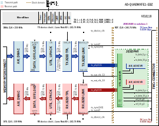

.. _ad_quadmxfe1_ebz:

AD-QUADMXFE1-EBZ HDL project
===============================================================================

Overview
-------------------------------------------------------------------------------

The :git-hdl:`AD-QUADMXFE1-EBZ <projects/ad_quadmxfe1_ebz>` reference design
is a processor based (e.g. Microblaze) embedded system, which showcases the
:adi:`QUAD-MXFE` evaluation board.

The Quad-MxFE System Development Platform contains four MxFE
(Mixed-signal Front End) software defined, direct RF sampling transceivers,
as well as associated RF front-ends, clocking, and power circuitry.
The target application is phased array radars, electronic warfare, and
ground-based SATCOM, specifically a 16 transmit/16 receive channel direct
sampling phased array at L/S/C band (0.1 GHz to ~5GHz).

- 16x RF receive (RX) channels (32x digital RX channels), with 16 ADCs going
  from 1.5 GSPS to 4 GSPS, and 48x Digital Down Converters (DDCs), each
  including complex Numerically-Controlled Oscillators (NCOs)
- 16x RF transmit (TX) channels (32x digital TX channels), with 16 DACs going
  from 3 GSPS to 12 GSPS, and 48x Digital Up Converters (DUCs), each
  including complex Numerically-Controlled Oscillators (NCOs)

Supported boards
-------------------------------------------------------------------------------

- :adi:`QUAD-MXFE`

Supported devices
-------------------------------------------------------------------------------

- :adi:`AD9081`
- :adi:`AD9082`

Supported carriers
-------------------------------------------------------------------------------

- :xilinx:`VCU118` on FMC+

Block design
-------------------------------------------------------------------------------

The design consists from a receive and a transmit chain.

The receive chain transports the captured samples from ADC to the system
memory (DDR). Before transferring the data to DDR the samples are stored
in a buffer implemented on block rams from the FPGA fabric
(:git-hdl:`util_adcfifo <library/util_adcfifo>`). The size of the buffer is
sized to store up to M x 16k samples per converter if a single channel is
selected or 16k samples per converter if all channels are selected.

The transmit chain transports samples from the system memory to the DAC
devices. Before streaming out the data to the DAC through the JESD link
the samples first are loaded into a buffer
(:git-hdl:`util_dacfifo <library/util_dacfifo>`) which will cyclically
stream the samples at the tx_device_clk data rate.

All cores from the receive and transmit chains are programmable through
an AXI-Lite interface.

The transmit and receive chains must operate at the same data rates having
a common device clock.

Block diagram
~~~~~~~~~~~~~~~~~~~~~~~~~~~~~~~~~~~~~~~~~~~~~~~~~~~~~~~~~~~~~~~~~~~~~~~~~~~~~~~

The data path and clock domains are depicted in the below diagrams.

Default configuration
^^^^^^^^^^^^^^^^^^^^^^^^^^^^^^^^^^^^^^^^^^^^^^^^^^^^^^^^^^^^^^^^^^^^^^^^^^^^^^^

The 4 MxFE RX and TX links are connected to a single transceiver block
(AMD Xilinx's JESD204 PHY IP) having 8 RX and 16 TX lanes in total.

The 4 RX links merge into a single receive Link Layer and a single Transport
Layer having a compatible configuration as described below.

Similarly to RX, the single transmit Link Layer and Transport Layer handle
the 4 TX links.

The number of lanes on RX is reduced to half to keep the same lane rate as
the TX link (which has double the number of channels of RX).

- JESD204C with lane rate 16.5Gbps
- REF_CLK_RATE=250 MHz
- RX: L=2, M=8, S=1, NP=16, PLL_SEL=2 (QPLL1)
- TX: L=4, M=16, S=1, NP=16, PLL_SEL=2 (QPLL1)

.. image:: ad_quadmxfe1_ebz_jesd204c_block_diagram.svg
   :width: 1000
   :align: center
   :alt: AD-QUADMXFE1-EBZ/VCU118 block diagram

.. important::

   This configuration was built with the following parameters, and it is
   equivalent to running only ``make``:

   .. shell:: bash

      /hdl/projects/ad_quadmxfe1_ebz/vcu118
      $make JESD_MODE=64B66B \
      $     RX_LANE_RATE=16.5 \
      $     TX_LANE_RATE=16.5 \
      $     REF_CLK_RATE=250 \
      $     RX_JESD_M=8 \
      $     RX_JESD_L=2 \
      $     TX_JESD_M=16 \
      $     TX_JESD_L=4

.. collapsible:: Click here for details on the block diagram modules

   .. list-table::
      :widths: 10 20 35 35
      :header-rows: 1

      * - Block name
        - IP name
        - Documentation
        - Additional info
      * - AXI_DMAC
        - :git-hdl:`axi_dmac <library/axi_dmac>`
        - :ref:`axi_dmac`
        - 2 instances, one for RX and one for TX
      * - DATA_OFFLOAD
        - :git-hdl:`data_offload <library/data_offload>`
        - :ref:`data_offload`
        - 2 instances, one for RX and one for TX
      * - RX JESD LINK
        - axi_mxfe_rx_jesd
        - :ref:`axi_jesd204_rx`
        - Instantiaded by ``adi_axi_jesd204_rx_create`` procedure
      * - RX JESD TPL
        - rx_mxfe_tpl_core
        - :ref:`ad_ip_jesd204_tpl_adc`
        - Instantiated by ``adi_tpl_jesd204_rx_create`` procedure
      * - TX JESD LINK
        - axi_mxfe_tx_jesd
        - :ref:`axi_jesd204_tx`
        - Instantiaded by ``adi_axi_jesd204_tx_create`` procedure
      * - TX JESD TPL
        - tx_mxfe_tpl_core
        - :ref:`ad_ip_jesd204_tpl_dac`
        - Instantiated by ``adi_tpl_jesd204_tx_create`` procedure
      * - UTIL_CPACK
        - :git-hdl:`util_cpack2 <library/util_pack/util_cpack2>`
        - :ref:`util_cpack2`
        - ---
      * - UTIL_UPACK
        - :git-hdl:`util_upack2 <library/util_pack/util_upack2>`
        - :ref:`util_upack2`
        - ---
      * - QUADS 121-122
        - jesd204_phy_121_122
        - `AMD PG198`_
        - AMD Xilinx JESD204 PHY IP
      * - QUADS 125-126
        - jesd204_phy_125_126
        - `AMD PG198`_
        - AMD Xilinx JESD204 PHY IP

Example block design with DAC & ADC {M=8 L=4}
^^^^^^^^^^^^^^^^^^^^^^^^^^^^^^^^^^^^^^^^^^^^^^^^^^^^^^^^^^^^^^^^^^^^^^^^^^^^^^^

The 4 MxFE RX and TX links are connected to a single transceiver block,
having 16x RX and 16x TX lanes in total (4 * L).

The 4 RX links merge into a single receive Link Layer, and a single
Transport Layer, having a compatible configuration as detailed below.
Similarly, the single transmit Link Layer and Transport Layer handle the
four TX links.

- JESD204B with lane rate 10Gbps
- RX, TX: L=4, M=8, S=1, NP=16, NUM_LINKS=4

.. important::

   This configuration was built using the ``make`` command with the following
   parameters:

   .. shell:: bash

      /hdl/projects/ad_quadmxfe1_ebz/vcu118
      $make JESD_MODE=8B10B \
      $     RX_JESD_L=4 \
      $     RX_JESD_M=8 \
      $     RX_JESD_NP=16 \
      $     RX_NUM_LINKS=4 \
      $     TX_JESD_L=4 \
      $     TX_JESD_M=8 \
      $     TX_JESD_NP=16 \
      $     TX_NUM_LINKS=4

.. collapsible:: Click here for details on the block diagram modules

   .. list-table::
      :widths: 10 20 35 35
      :header-rows: 1

      * - Block name
        - IP name
        - Documentation
        - Additional info
      * - AXI_ADXCVR
        - :git-hdl:`axi_adxcvr <library/xilinx/axi_adxcvr>`
        - :ref:`axi_adxcvr`
        - 2 instances, one for RX and one for TX
      * - AXI_DMAC
        - :git-hdl:`axi_dmac <library/axi_dmac>`
        - :ref:`axi_dmac`
        - 2 instances, one for RX and one for TX
      * - DATA_OFFLOAD
        - :git-hdl:`data_offload <library/data_offload>`
        - :ref:`data_offload`
        - 2 instances, one for RX and one for TX
      * - RX JESD LINK
        - axi_mxfe_rx_jesd
        - :ref:`axi_jesd204_rx`
        - Instantiaded by ``adi_axi_jesd204_rx_create`` procedure
      * - RX JESD TPL
        - rx_mxfe_tpl_core
        - :ref:`ad_ip_jesd204_tpl_adc`
        - Instantiated by ``adi_tpl_jesd204_rx_create`` procedure
      * - TX JESD LINK
        - axi_mxfe_tx_jesd
        - :ref:`axi_jesd204_tx`
        - Instantiaded by ``adi_axi_jesd204_tx_create`` procedure
      * - TX JESD TPL
        - tx_mxfe_tpl_core
        - :ref:`ad_ip_jesd204_tpl_dac`
        - Instantiated by ``adi_tpl_jesd204_tx_create`` procedure
      * - UTIL_ADXCVR
        - :git-hdl:`util_adxcvr <library/xilinx/util_adxcvr>`
        - :ref:`util_adxcvr`
        - Used for both AXI ADXCVR instances
      * - UTIL_CPACK
        - :git-hdl:`util_cpack2 <library/util_pack/util_cpack2>`
        - :ref:`util_cpack2`
        - ---
      * - UTIL_UPACK
        - :git-hdl:`util_upack2 <library/util_pack/util_upack2>`
        - :ref:`util_upack2`
        - ---

Configuration modes
~~~~~~~~~~~~~~~~~~~~~~~~~~~~~~~~~~~~~~~~~~~~~~~~~~~~~~~~~~~~~~~~~~~~~~~~~~~~~~~

The following are the parameters of this project that can be configured:

- JESD_MODE: used link layer encoder mode

  - 64B66B - 64b66b link layer defined in JESD204C, uses AMD IP as Physical Layer
  - 8B10B - 8b10b link layer defined in JESD204B, uses ADI IP as Physical Layer

- RX_LANE_RATE: lane rate of the RX link (MxFE to FPGA)
- TX_LANE_RATE: lane rate of the TX link (FPGA to MxFE)
- [RX/TX]_PLL_SEL: used only in 64B66B mode:
  
  - 0 - CPLL for lane rates 4-12.5 Gbps and integer sub-multiples
  - 1 - QPLL0 for lane rates 19.6-32.75 Gbps and integer sub-multiples (e.g. 9.8-16.375)
  - 2 - QPLL1 for lane rates 16.0-26.0 Gbps and integer sub-multiple (e.g. 8.0-13.0)
  - For more details, see JESD204 PHY v4.0 Product Guide (`AMD PG198`_) and
    UltraScale Architecture GTY Transceivers User Guide (`AMD UG578`_)

- REF_CLK_RATE: the rate of the reference clock, used only in 64B66B mode
- [RX/TX]_JESD_M: number of converters per link
- [RX/TX]_JESD_L: number of lanes per link
- [RX/TX]_JESD_S: number of samples per frame
- [RX/TX]_JESD_NP: number of bits per sample
- [RX/TX]_NUM_LINKS: number of links
- RX_KS_PER_CHANNEL: RX number of samples stored in internal buffers in
  kilosamples per converter (M), for each channel in a block RAM, for a
  contiguous capture
- TX_KS_PER_CHANNEL: TX number of samples loaded for each channel in a
  block RAM for a contiguous cyclic streaming
- DAC_TPL_XBAR_ENABLE: enable NxN crossbar functionality at the transport
  layer, where N is the number of channels

Clock scheme
~~~~~~~~~~~~~~~~~~~~~~~~~~~~~~~~~~~~~~~~~~~~~~~~~~~~~~~~~~~~~~~~~~~~~~~~~~~~~~~

.. image:: ad_quadmxfe1_ebz_clock_scheme.svg
   :width: 400
   :align: center
   :alt: AD-QUADMXFE1-EBZ/VCU118 clock scheme

Limitations
^^^^^^^^^^^^^^^^^^^^^^^^^^^^^^^^^^^^^^^^^^^^^^^^^^^^^^^^^^^^^^^^^^^^^^^^^^^^^^^

One :adi:`MxFE <AD9081>` has 8 lanes, with maximum lane rate supported in
JESD204C = 24.75Gbps.

Maximum data rate for one MxFE per direction
= 8 * 24.75Gbps * 64/66 = 192 Gbps = 24 GB/s.

The existing Quad board has half the lanes, so this gives us 12GB/s per MxFE
per direction. The bandwidth requirement per direction is
= 4 * 12GB/s = 48 GB/s.

By direction, we imply FPGA to DAC path or ADC to FPGA path.

The theoretical throughput of the DDR from the :xilinx:`VCU118` is 19.2 GB/s,
so far away from the exiting quad MxFE requirements, but an HBM FPGA would
solve that.

CPU/Memory interconnects addresses
~~~~~~~~~~~~~~~~~~~~~~~~~~~~~~~~~~~~~~~~~~~~~~~~~~~~~~~~~~~~~~~~~~~~~~~~~~~~~~~

The addresses are dependent on the architecture of the FPGA, having an offset
added to the base address from HDL (see more at :ref:`architecture cpu-intercon-addr`).

Depending on the value of the parameter $ADI_PHY_SEL, some IPs are instantiated
and some are not. If JESD204C is chosen, then the JESD physical layer used will
be the AMD Xilinx JESD204 PHY (see `AMD PG198`_), otherwise the ADI
:ref:`util_adxcvr`.

Check-out the table below to find out the conditions.

==================== ==================== ===============
Instance             Depends on parameter Zynq/Microblaze
==================== ==================== ===============
axi_mxfe_rx_xcvr     $ADI_PHY_SEL==1      0x44A6_0000    
jesd204_phy_121_122  $ADI_PHY_SEL==0      0x44A6_0000    
rx_mxfe_tpl_core                          0x44A1_0000    
axi_mxfe_rx_jesd                          0x44A9_0000    
axi_mxfe_rx_dma                           0x7C42_0000    
mxfe_rx_data_offload                      0x7C45_0000    
axi_mxfe_tx_xcvr     $ADI_PHY_SEL==1      0x44B6_0000    
jesd204_phy_125_126  $ADI_PHY_SEL==0      0x44B6_0000    
tx_mxfe_tpl_core                          0x44B1_0000    
axi_mxfe_tx_jesd                          0x44B9_0000    
axi_mxfe_tx_dma                           0x7C43_0000    
mxfe_tx_data_offload                      0x7C46_0000    
==================== ==================== ===============

SPI connections
~~~~~~~~~~~~~~~~~~~~~~~~~~~~~~~~~~~~~~~~~~~~~~~~~~~~~~~~~~~~~~~~~~~~~~~~~~~~~~~

The :adi:`AD9081` SPI interface is a 4-wire SPI by default, however the part
can be run in a 3-wire interface if desired. There is a separate SPI bus for
each of the AD9081s to allow for parallel operation if desired, but the FPGA
currently supports sequential operation.

The :adi:`HMC7043` and :adi:`ADF4371` are both wired for 3-wire SPI only. The
ADF4371s share a common SPI bus with 4 CS lines. The HMC7043 has a separate
dedicated SPI bus as well.

.. list-table::
   :widths: 25 25 25 25
   :header-rows: 1

   * - SPI type
     - SPI manager instance
     - SPI subordinate
     - CS
   * - PS
     - SPI 1
     - AD9081
     - 3:0
   * - PS
     - SPI 2
     - HMC7043
     - 4
   * - PS
     - SPI 2
     - ADF4371
     - 3:0

GPIOs
~~~~~~~~~~~~~~~~~~~~~~~~~~~~~~~~~~~~~~~~~~~~~~~~~~~~~~~~~~~~~~~~~~~~~~~~~~~~~~~

GPIO muxing enables multiple functions of gpio_0 pins, to have either the
NCO sync function or to be regular software-controllable GPIOs.

e.g. function selection for gpio[0] line of MxFE(0,1,2,3) done through GPIO[108].

==================  =========  =============  =============
GPIO signal         Direction  HDL GPIO EMIO  Software GPIO
==================  =========  =============  =============
mxfe0/1/2/3_gpio0   INOUT      64             118
mxfe0/1/2/3_gpio1   INOUT      65             119
mxfe0/1/2/3_gpio2   INOUT      66             120
mxfe0/1/2/3_gpio3   INOUT      67             121
mxfe0/1/2/3_gpio4   INOUT      68             122
mxfe0/1/2/3_gpio5   INOUT      69             123
mxfe0/1/2/3_gpio6   INOUT      70             124
mxfe0/1/2/3_gpio7   INOUT      71             125
mxfe0/1/2/3_gpio8   INOUT      72             126
mxfe0/1/2/3_gpio9   INOUT      73             127
mxfe0/1/2/3_gpio10  INOUT      74             128
==================  =========  =============  =============

Function selection for the first six GPIO lines is done with the following
control GPIOs:

- MxFE(0,1,2,3)_gpio[0] = GPIO[108] (see
  :git-hdl:`here <projects/ad_quadmxfe1_ebz/common/quad_mxfe_gpio_mux.v#L532>`)

**GPIO_0_MODE (GPIO[108]) = 0 -> Software-controlled GPIO**

=============  =============  =============
GPIO name      Pin direction  Pin data out
=============  =============  =============
MxFE0_gpio[0]  SW controlled  SW controlled
MxFE1_gpio[0]  SW controlled  SW controlled
MxFE2_gpio[0]  SW controlled  SW controlled
MxFE3_gpio[0]  SW controlled  SW controlled
=============  =============  =============

**GPIO_0_MODE (GPIO[108]) = 1 -> LMFC based Master-Slave NCO sync**

See :git-hdl:`here <projects/ad_quadmxfe1_ebz/common/quad_mxfe_gpio_mux.v#L397>`.

=============  =============  =============
GPIO name      Pin direction  Pin data out
=============  =============  =============
MxFE0_gpio[0]  OUT            MxFE3_gpio[0]
MxFE1_gpio[0]  OUT            MxFE3_gpio[0]
MxFE2_gpio[0]  OUT            MxFE3_gpio[0]
MxFE3_gpio[0]  IN             ---
=============  =============  =============

Interrupts
~~~~~~~~~~~~~~~~~~~~~~~~~~~~~~~~~~~~~~~~~~~~~~~~~~~~~~~~~~~~~~~~~~~~~~~~~~~~~~~

Below are the Programmable Logic interrupts used in this project.

================ === ================ =================
Instance name    HDL Linux MicroBlaze Actual MicroBlaze
================ === ================ =================
axi_mxfe_tx_jesd 15  59               91
axi_mxfe_rx_jesd 14  58               90
axi_mxfe_tx_dma  13  57               89
axi_mxfe_rx_dma  12  56               88
axi_gpio_2       8   52               84
================ === ================ =================

Building the HDL project
-------------------------------------------------------------------------------

The design is built upon ADI's generic HDL reference design framework.
ADI distributes the bit/elf files of these projects as part of the
:dokuwiki:`ADI Kuiper Linux <resources/tools-software/linux-software/kuiper-linux>`.
If you want to build the sources, ADI makes them available on the
:git-hdl:`HDL repository </>`. To get the source you must
`clone <https://git-scm.com/book/en/v2/Git-Basics-Getting-a-Git-Repository>`__
the HDL repository.

Then go to the hdl/projects/ad_quadmxfe1_ebz/vcu118 location and run the make
command.

**Linux/Cygwin/WSL**

Example of running the ``make`` command without parameters (using the default
configuration):

.. shell:: bash

   $cd hdl/projects/ad_quadmxfe1_ebz/vcu118
   $make

Example of running the ``make`` command with parameters:

.. shell:: bash

   $cd hdl/projects/ad_quadmxfe1_ebz/vcu118
   $make JESD_MODE=8B10B \
   $     RX_JESD_M=4 \
   $     RX_JESD_L=2 \
   $     TX_JESD_M=4 \
   $     TX_JESD_L=2

.. collapsible:: Example configurations

   Configuration names are encoded with ``[B/C]_[TX MODE]_[RX MODE]`` where
   [B/C]: B for 8B/10B (a.k.a. JESD204B) and C for 64B66B (a.k.a. JESD204C).

   If a value is not specified, then the default value applies.
   
   +---------------------+---------+-----------+-----------+---------+--------+---------+---------+---------+--------+
   |                     | default | B_9_10    | B_5_6     | C_10_11 | C_11_4 | C_23_25 | C_29_24 | C_12_13 | C_3_2  |
   +=====================+=========+===========+===========+=========+========+=========+=========+=========+========+
   | JESD_MODE           | 64B66B  | **8B10B** | **8B10B** | 64B66B  | 64B66B | 64B66B  | 64B66B  | 64B66B  | 64B66B |
   +---------------------+---------+-----------+-----------+---------+--------+---------+---------+---------+--------+
   | RX_LANE_RATE        | 16.5    | N/A       | N/A       | 16.5    | 16.5   | 24.75   | 24.75   | 24.75   | 16.5   |
   +---------------------+---------+-----------+-----------+---------+--------+---------+---------+---------+--------+
   | TX_LANE_RATE        | 16.5    | N/A       | N/A       | 16.5    | 16.5   | 24.75   | 24.75   | 24.75   | 16.5   |
   +---------------------+---------+-----------+-----------+---------+--------+---------+---------+---------+--------+
   | RX_PLL_SEL          | 2       | N/A       | N/A       |         |        | 1       | 1       | 1       |        |
   +---------------------+---------+-----------+-----------+---------+--------+---------+---------+---------+--------+
   | TX_PLL_SEL          | 2       | N/A       | N/A       |         |        | 1       | 1       | 1       |        |
   +---------------------+---------+-----------+-----------+---------+--------+---------+---------+---------+--------+
   | REF_CLK_RATE        | 250     | N/A       | N/A       | 250     | 250    | 250     | 250     | 250     | 250    |
   +---------------------+---------+-----------+-----------+---------+--------+---------+---------+---------+--------+
   | RX_JESD_M           | 8       | 8         | 4         | 4       | 8      | 4       | 8       | 2       | 4      |
   +---------------------+---------+-----------+-----------+---------+--------+---------+---------+---------+--------+
   | RX_JESD_L           | 2       | 4         | 2         | 4       | 2      | 4       | 4       | 4       | 1      |
   +---------------------+---------+-----------+-----------+---------+--------+---------+---------+---------+--------+
   | RX_JESD_S           | 1       | 1         | 1         | 1       | 1      | 2       | 1       | 1       | 1      |
   +---------------------+---------+-----------+-----------+---------+--------+---------+---------+---------+--------+
   | RX_JESD_NP          | 16      |           |           |         |        | 12      | 12      |         |        |
   +---------------------+---------+-----------+-----------+---------+--------+---------+---------+---------+--------+
   | RX_NUM_LINKS        | 4       |           |           |         |        |         |         |         |        |
   +---------------------+---------+-----------+-----------+---------+--------+---------+---------+---------+--------+
   | TX_JESD_M           | 16      | 8         | 4         | 4       | 16     | 4       | 8       | 2       | 8      |
   +---------------------+---------+-----------+-----------+---------+--------+---------+---------+---------+--------+
   | TX_JESD_L           | 4       | 4         | 2         | 4       | 4      | 4       | 4       | 4       | 2      |
   +---------------------+---------+-----------+-----------+---------+--------+---------+---------+---------+--------+
   | TX_JESD_S           | 1       | 1         | 1         | 1       | 1      | 2       | 1       | 1       | 1      |
   +---------------------+---------+-----------+-----------+---------+--------+---------+---------+---------+--------+
   | TX_JESD_NP          | 16      |           |           |         |        | 12      | 12      |         |        |
   +---------------------+---------+-----------+-----------+---------+--------+---------+---------+---------+--------+
   | TX_NUM_LINKS        | 4       |           |           |         |        |         |         |         |        |
   +---------------------+---------+-----------+-----------+---------+--------+---------+---------+---------+--------+
   | RX_KS_PER_CHANNEL   | 32      |           |           | 64      | 32     | 16      | 16      | 64      | 16     |
   +---------------------+---------+-----------+-----------+---------+--------+---------+---------+---------+--------+
   | TX_KS_PER_CHANNEL   | 16      |           |           | 16      | 16     | 16      | 16      | 64      | 16     |
   +---------------------+---------+-----------+-----------+---------+--------+---------+---------+---------+--------+
   | DAC_TPL_XBAR_ENABLE | 0       |           |           |         |        |         |         |         |        |
   +---------------------+---------+-----------+-----------+---------+--------+---------+---------+---------+--------+

The result of the build, if parameters were used, will be in a folder named
by the configuration used:

if the following command was run

``make JESD_MODE=8B10B RX_JESD_M=4 RX_JESD_L=2 TX_JESD_M=4 TX_JESD_L=2``

then the folder name will be:

``MODE8B10B_RXM4_RXL2_TXM4_TXL2``
because of truncation of some keywords so the name will not exceed the limits
of the Operating System (``JESD``, ``LANE``, etc. are removed) of 260
characters.

A more comprehensive build guide can be found in the :ref:`build_hdl` user guide.

.. important::

   Make sure you install the fans/heat sinks before powering on the setup!
   For more details, read
   :dokuwiki:`here <resources/eval/user-guides/quadmxfe/boardhardwaredetails#thermal_considerations>`.

Software considerations
-------------------------------------------------------------------------------

ADC - crossbar config
~~~~~~~~~~~~~~~~~~~~~~~~~~~~~~~~~~~~~~~~~~~~~~~~~~~~~~~~~~~~~~~~~~~~~~~~~~~~~~~

Due to physical constraints, RX lanes are reordered as described in the
following table.

For example, physical lane 2 from ADC connects to logical lane 7
from the FPGA. Therefore the crossbar from the device must be set
accordingly.

+---------------+----+----+----+----+----+----+----+----+----+----+----+----+----+----+----+----+
| logical lane  |  0 |  1 |  2 | 3  | 4  |  5 |  6 |  7 | 8  | 9  | 10 | 11 | 12 | 13 | 14 | 15 |
+===============+====+====+====+====+====+====+====+====+====+====+====+====+====+====+====+====+
| physical lane | 13 | 10 | 11 | 9  | 3  | 15 | 12 | 14 | 2  | 5  |  0 |  4 |  8 |  7 |  6 |  1 |
+---------------+----+----+----+----+----+----+----+----+----+----+----+----+----+----+----+----+

DAC - crossbar config
~~~~~~~~~~~~~~~~~~~~~~~~~~~~~~~~~~~~~~~~~~~~~~~~~~~~~~~~~~~~~~~~~~~~~~~~~~~~~~~

Due to physical constraints, TX lanes are reordered as described in the
following table:

For example, physical lane 2 from DAC connects to logical lane 10
from the FPGA. Therefore the crossbar from the device must be set
accordingly.

+---------------+----+----+----+----+----+----+----+----+----+----+----+----+----+----+----+----+
| logical lane  | 0  | 1  | 2  | 3  | 4  | 5  | 6  | 7  | 8  | 9  | 10 | 11 | 12 | 13 | 14 | 15 |
+===============+====+====+====+====+====+====+====+====+====+====+====+====+====+====+====+====+
| physical lane | 13 | 8  | 9  | 7  | 3  | 15 | 12 | 14 | 6  | 5  | 2  | 4  | 0  | 10 | 1  | 11 |
+---------------+----+----+----+----+----+----+----+----+----+----+----+----+----+----+----+----+

Resources
-------------------------------------------------------------------------------

Systems related
~~~~~~~~~~~~~~~~~~~~~~~~~~~~~~~~~~~~~~~~~~~~~~~~~~~~~~~~~~~~~~~~~~~~~~~~~~~~~~~

- :dokuwiki:`Quad-MxFE Prototyping Platform User Guide <resources/eval/user-guides/quadmxfe>`
- :dokuwiki:`Multi-Chip Synchronization with the Quad-MxFE + Calibration Board <resources/eval/user-guides/quadmxfe/multichipsynchronization>`
- :dokuwiki:`Quad MxFE Calibration Board <resources/eval/user-guides/quadmxfe/calboard>`
- :dokuwiki:`Quad-MxFE Quick Start Guide with High Speed Converter Toolbox <resources/eval/user-guides/quadmxfe/quickbringup>`

Hardware related
~~~~~~~~~~~~~~~~~~~~~~~~~~~~~~~~~~~~~~~~~~~~~~~~~~~~~~~~~~~~~~~~~~~~~~~~~~~~~~~

- Product datasheets:

  - :adi:`AD9081`
  - :adi:`AD9082`

- :dokuwiki:`Quad-MxFE Board Hardware Details <resources/eval/user-guides/quadmxfe/boardhardwaredetails>`
- `AD9081 UG-1578, Device User Guide <https://www.analog.com/media/en/technical-documentation/user-guides/ad9081-ad9082-ug-1578.pdf>`__

HDL related
~~~~~~~~~~~~~~~~~~~~~~~~~~~~~~~~~~~~~~~~~~~~~~~~~~~~~~~~~~~~~~~~~~~~~~~~~~~~~~~

- :git-hdl:`AD_QUADMXFE1_EBZ HDL project source code <projects/ad_quadmxfe1_ebz>`

.. list-table::
   :widths: 30 35 35
   :header-rows: 1

   * - IP name
     - Source code link
     - Documentation link
   * - AXI_ADXCVR for AMD
     - :git-hdl:`library/xilinx/axi_adxcvr`
     - :ref:`axi_adxcvr amd`
   * - AXI_DMAC
     - :git-hdl:`library/axi_dmac`
     - :ref:`axi_dmac`
   * - AXI_JESD204_RX
     - :git-hdl:`library/jesd204/axi_jesd204_rx`
     - :ref:`axi_jesd204_rx`
   * - AXI_JESD204_TX
     - :git-hdl:`library/jesd204/axi_jesd204_tx`
     - :ref:`axi_jesd204_tx`
   * - AXI_SYSID
     - :git-hdl:`library/axi_sysid`
     - :ref:`axi_sysid`
   * - DATA_OFFLOAD
     - :git-hdl:`library/data_offload`
     - :ref:`data_offload`
   * - JESD204_TPL_ADC
     - :git-hdl:`library/jesd204/ad_ip_jesd204_tpl_adc`
     - :ref:`ad_ip_jesd204_tpl_adc`
   * - JESD204_TPL_DAC
     - :git-hdl:`library/jesd204/ad_ip_jesd204_tpl_dac`
     - :ref:`ad_ip_jesd204_tpl_dac`
   * - UTIL_ADXCVR for AMD
     - :git-hdl:`library/xilinx/util_adxcvr`
     - :ref:`util_adxcvr`
   * - UTIL_CPACK2
     - :git-hdl:`library/util_pack/util_cpack2`
     - :ref:`util_cpack2`
   * - UTIL_PAD
     - :git-hdl:`library/util_pad`
     - ---
   * - UTIL_UPACK2
     - :git-hdl:`library/util_pack/util_upack2`
     - :ref:`util_upack2`
   * - SYSID_ROM
     - :git-hdl:`library/sysid_rom`
     - :ref:`axi_sysid`

- :dokuwiki:`[Wiki] Generic JESD204B block designs <resources/fpga/docs/hdl/generic_jesd_bds>`
- :ref:`jesd204`

Software related
~~~~~~~~~~~~~~~~~~~~~~~~~~~~~~~~~~~~~~~~~~~~~~~~~~~~~~~~~~~~~~~~~~~~~~~~~~~~~~~

- :dokuwiki:`Quad-MxFE Software Quick Start Guide <resources/eval/user-guides/quadmxfe/quick-start>`

.. collapsible:: Click here to see a list of all the Linux device trees available.

   - AD9081 TX mode 11, RX mode 4:

     - :git-linux:`vcu118_quad_ad9081_204c_txmode_11_rxmode_4.dts <arch/microblaze/boot/dts/vcu118_quad_ad9081_204c_txmode_11_rxmode_4.dts>`
     - for Quad MxFE rev. C: :git-linux:`vcu118_quad_ad9081_204c_txmode_11_rxmode_4_revc.dts <arch/microblaze/boot/dts/vcu118_quad_ad9081_204c_txmode_11_rxmode_4_revc.dts>`
     - for direct 6 GHz: :git-linux:`vcu118_quad_ad9081_204c_txmode_11_rxmode_4_direct_6g.dts <arch/microblaze/boot/dts/vcu118_quad_ad9081_204c_txmode_11_rxmode_4_direct_6g.dts>`

   - AD9081 TX mode 5, RX mode 6:
   
     - :git-linux:`vcu118_quad_ad9081_204b_txmode_5_rxmode_6.dts <arch/microblaze/boot/dts/vcu118_quad_ad9081_204b_txmode_5_rxmode_6.dts>`
     - for Quad MxFE rev. C: :git-linux:`vcu118_quad_ad9081_204b_txmode_5_rxmode_6_revc.dts <arch/microblaze/boot/dts/vcu118_quad_ad9081_204b_txmode_5_rxmode_6_revc.dts>`

   - AD9081 TX mode 9, RX mode 10:

     - :git-linux:`vcu118_quad_ad9081_204b_txmode_9_rxmode_10.dts <arch/microblaze/boot/dts/vcu118_quad_ad9081_204b_txmode_9_rxmode_10.dts>`
     - for Quad MxFE rev. C: :git-linux:`vcu118_quad_ad9081_204b_txmode_9_rxmode_10_revc.dts <arch/microblaze/boot/dts/vcu118_quad_ad9081_204b_txmode_9_rxmode_10_revc.dts>`

   - AD9081 TX mode 10, RX mode 11:

     - :git-linux:`vcu118_quad_ad9081_204c_txmode_10_rxmode_11.dts <arch/microblaze/boot/dts/vcu118_quad_ad9081_204c_txmode_10_rxmode_11.dts>`
     - for Quad MxFE rev. C: :git-linux:`vcu118_quad_ad9081_204c_txmode_10_rxmode_11_revc.dts <arch/microblaze/boot/dts/vcu118_quad_ad9081_204c_txmode_10_rxmode_11_revc.dts>`

   - AD9081 TX mode 29, RX mode 24:

     - (for Quad MxFE rev. C): :git-linux:`vcu118_quad_ad9081_204c_txmode_29_rxmode_24_revc.dts <arch/microblaze/boot/dts/vcu118_quad_ad9081_204c_txmode_29_rxmode_24_revc.dts>`

   - AD9082 TX mode 3, RX mode 2:

     - :git-linux:`vcu118_quad_ad9082_204c_txmode_3_rxmode_2.dts <arch/microblaze/boot/dts/vcu118_quad_ad9082_204c_txmode_3_rxmode_2.dts>`
     - with on-chip PLL: :git-linux:`vcu118_quad_ad9082_204c_txmode_3_rxmode_2_onchip_pll.dts <arch/microblaze/boot/dts/vcu118_quad_ad9082_204c_txmode_3_rxmode_2_onchip_pll.dts>` (check the comments in the dts for hardware changes)

   - AD9082 TX mode 12, RX mode 13:

     - :git-linux:`vcu118_quad_ad9082_204c_txmode_12_rxmode_13.dts <arch/microblaze/boot/dts/vcu118_quad_ad9082_204c_txmode_12_rxmode_13.dts>`
     - with on-chip PLL: :git-linux:`vcu118_quad_ad9082_204c_txmode_12_rxmode_13_onchip_pll.dts <arch/microblaze/boot/dts/vcu118_quad_ad9082_204c_txmode_12_rxmode_13_onchip_pll.dts>` (check the comments in the dts for hardware changes)

   - AD9082 TX mode 23, RX mode 25:

     - :git-linux:`vcu118_quad_ad9082_204c_txmode_23_rxmode_25.dts <arch/microblaze/boot/dts/vcu118_quad_ad9082_204c_txmode_23_rxmode_25.dts>`
     - for Quad MxFE rev. C: :git-linux:`vcu118_quad_ad9081_204c_txmode_23_rxmode_25_revc.dts <arch/microblaze/boot/dts/vcu118_quad_ad9081_204c_txmode_23_rxmode_25_revc.dts>`
     - with on-chip PLL: :git-linux:`vcu118_quad_ad9082_204c_txmode_23_rxmode_25_onchip_pll.dts <arch/microblaze/boot/dts/vcu118_quad_ad9082_204c_txmode_23_rxmode_25_onchip_pll.dts>` (check the comments in the dts for hardware changes)

.. include:: ../common/more_information.rst

.. include:: ../common/support.rst

.. _AMD PG198: https://docs.amd.com/v/u/en-US/pg198-jesd204-phy
.. _AMD UG578: https://docs.amd.com/v/u/en-US/ug578-ultrascale-gty-transceivers
