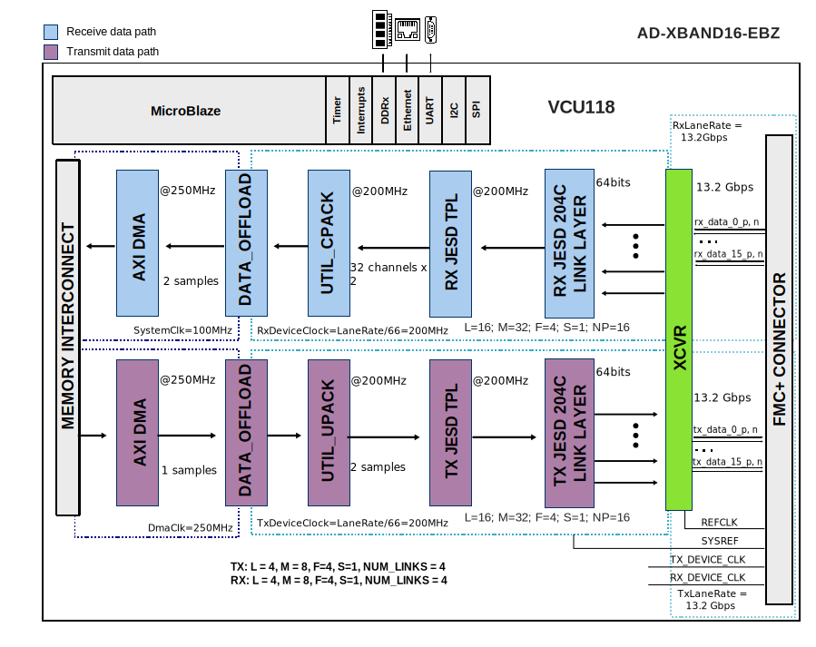
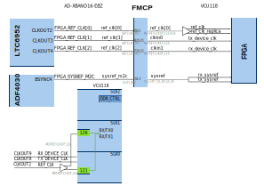

.. _ad_xband16_ebz:

AD-XBAND16-EBZ HDL project
===============================================================================

Overview
-------------------------------------------------------------------------------

The :git-hdl:`AD-XBAND16-EBZ <projects/ad_xband16_ebz>` reference design
(also known as Quad-Apollo) is a processor based (e.g. Microblaze) embedded
system, which showcases the :adi:`ADXBAND16EBZ` evaluation board.

The ADXBAND16EBZ System Development Platform contains four Apollo (AD9084)
MxFE (Mixed-signal Front End) software defined, direct RF sampling transceivers,
as well as associated RF front-ends, clocking, and power circuitry.
The target application is X-band phased array radars, electronic warfare, and
ground-based SATCOM, specifically a 16 transmit/16 receive channel direct
sampling phased array.

- 16x RF receive (RX) channels (32x digital RX channels), with 16 ADCs,
  and Digital Down Converters (DDCs), each including complex
  Numerically-Controlled Oscillators (NCOs)
- 16x RF transmit (TX) channels (32x digital TX channels), with 16 DACs,
  and Digital Up Converters (DUCs), each including complex
  Numerically-Controlled Oscillators (NCOs)

The design supports Multi-Chip Synchronization (MCS) for synchronizing
multiple boards in phased array applications using the ADF4030 BSYNC interface.

Supported boards
-------------------------------------------------------------------------------

- :adi:`ADXBAND16EBZ`

Supported devices
-------------------------------------------------------------------------------

- :adi:`AD9084`

Supported carriers
-------------------------------------------------------------------------------

- :xilinx:`VCU118` on FMC+

Block design
-------------------------------------------------------------------------------

The design consists of a receive and a transmit chain.

The **receive chain** transports the captured samples from ADC to the system
memory (DDR). Before transferring the data to DDR, the samples are stored
in a buffer implemented on BRAMs from the FPGA fabric
(:git-hdl:`util_adcfifo <library/util_adcfifo>`).
The space allocated in the buffer for each channel
depends on the number of currently active channels.

The **transmit chain** transports samples from the system memory to the DAC
devices. Before streaming out the data to the DAC through the JESD link,
the samples first are loaded into a buffer
(:git-hdl:`util_dacfifo <library/util_dacfifo>`) which will
cyclically stream the samples at the ``tx_device_clk`` data rate.

All cores from the receive and transmit chains are programmable through
an AXI-Lite interface.

The transmit and receive chains can operate at different data rates
having separate ``rx_device_clk``/``tx_device_clk`` and corresponding lane rates
but must share the same reference clock.

Block diagram
~~~~~~~~~~~~~~~~~~~~~~~~~~~~~~~~~~~~~~~~~~~~~~~~~~~~~~~~~~~~~~~~~~~~~~~~~~~~~~~

The data path and clock domains are depicted in the below diagram.

Default configuration (13.2 Gbps)
^^^^^^^^^^^^^^^^^^^^^^^^^^^^^^^^^^^^^^^^^^^^^^^^^^^^^^^^^^^^^^^^^^^^^^^^^^^^^^^

The 4 Apollo RX and TX links are connected to a single transceiver block
(ADI's util_adxcvr) having 16 RX and 16 TX lanes in total (4 lanes x 4 links).

The 4 RX links merge into a single receive Link Layer and a single Transport
Layer having a compatible configuration as described below.

Similarly, the single transmit Link Layer and Transport Layer handle
the 4 TX links.

- JESD204C with lane rate 13.2 Gbps
- RX: L=4, M=8, S=1, NP=16, NUM_LINKS=4
- TX: L=4, M=8, S=1, NP=16, NUM_LINKS=4

.. important::

   This configuration was built with the following parameters, and it is
   equivalent to running only ``make``:

   .. shell:: bash

      /hdl/projects/ad_xband16_ebz/vcu118
      $make JESD_MODE=64B66B \
      $     RX_LANE_RATE=13.2 \
      $     TX_LANE_RATE=13.2 \
      $     RX_JESD_M=8 \
      $     RX_JESD_L=4 \
      $     RX_JESD_S=1 \
      $     RX_JESD_NP=16 \
      $     RX_NUM_LINKS=4 \
      $     TX_JESD_M=8 \
      $     TX_JESD_L=4 \
      $     TX_JESD_S=1 \
      $     TX_JESD_NP=16 \
      $     TX_NUM_LINKS=4

High-speed configuration (26.4 Gbps)
^^^^^^^^^^^^^^^^^^^^^^^^^^^^^^^^^^^^^^^^^^^^^^^^^^^^^^^^^^^^^^^^^^^^^^^^^^^^^^^

This configuration doubles the lane rate to 26.4 Gbps for higher throughput:

- JESD204C with lane rate 26.4 Gbps
- RX: L=4, M=8, S=1, NP=16, NUM_LINKS=4
- TX: L=4, M=8, S=1, NP=16, NUM_LINKS=4

.. important::

   This configuration is built with the following parameters:

   .. shell:: bash

      /hdl/projects/ad_xband16_ebz/vcu118
      $make JESD_MODE=64B66B \
      $     RX_LANE_RATE=26.4 \
      $     TX_LANE_RATE=26.4 \
      $     RX_JESD_M=8 \
      $     RX_JESD_L=4 \
      $     RX_JESD_S=1 \
      $     RX_JESD_NP=16 \
      $     RX_NUM_LINKS=4 \
      $     TX_JESD_M=8 \
      $     TX_JESD_L=4 \
      $     TX_JESD_S=1 \
      $     TX_JESD_NP=16 \
      $     TX_NUM_LINKS=4

.. collapsible:: Click here for details on the block diagram modules

   .. list-table::
      :widths: 10 20 35 35
      :header-rows: 1

      * - Block name
        - IP name
        - Documentation
        - Additional info
      * - AXI_ADXCVR (RX)
        - :git-hdl:`axi_adxcvr <library/xilinx/axi_adxcvr>`
        - :ref:`axi_adxcvr`
        - RX transceiver control
      * - AXI_ADXCVR (TX)
        - :git-hdl:`axi_adxcvr <library/xilinx/axi_adxcvr>`
        - :ref:`axi_adxcvr`
        - TX transceiver control
      * - UTIL_ADXCVR
        - :git-hdl:`util_adxcvr <library/xilinx/util_adxcvr>`
        - :ref:`util_adxcvr`
        - Shared transceiver utilities for RX and TX
      * - AXI_DMAC (RX)
        - :git-hdl:`axi_dmac <library/axi_dmac>`
        - :ref:`axi_dmac`
        - RX DMA controller
      * - AXI_DMAC (TX)
        - :git-hdl:`axi_dmac <library/axi_dmac>`
        - :ref:`axi_dmac`
        - TX DMA controller
      * - DATA_OFFLOAD (RX)
        - :git-hdl:`data_offload <library/data_offload>`
        - :ref:`data_offload`
        - RX data offload buffer
      * - DATA_OFFLOAD (TX)
        - :git-hdl:`data_offload <library/data_offload>`
        - :ref:`data_offload`
        - TX data offload buffer
      * - RX JESD LINK
        - axi_apollo_rx_jesd
        - :ref:`axi_jesd204_rx`
        - Instantiated by ``adi_axi_jesd204_rx_create`` procedure
      * - RX JESD TPL
        - rx_apollo_tpl_core
        - :ref:`ad_ip_jesd204_tpl_adc`
        - Instantiated by ``adi_tpl_jesd204_rx_create`` procedure
      * - TX JESD LINK
        - axi_apollo_tx_jesd
        - :ref:`axi_jesd204_tx`
        - Instantiated by ``adi_axi_jesd204_tx_create`` procedure
      * - TX JESD TPL
        - tx_apollo_tpl_core
        - :ref:`ad_ip_jesd204_tpl_dac`
        - Instantiated by ``adi_tpl_jesd204_tx_create`` procedure
      * - UTIL_CPACK
        - :git-hdl:`util_cpack2 <library/util_pack/util_cpack2>`
        - :ref:`util_cpack2`
        - Channel packer for RX
      * - UTIL_UPACK
        - :git-hdl:`util_upack2 <library/util_pack/util_upack2>`
        - :ref:`util_upack2`
        - Channel unpacker for TX
      * - AXI_ADF4030
        - :git-hdl:`axi_adf4030 <library/axi_adf4030>`
        - ---
        - BSYNC interface for multi-chip synchronization
      * - AXI_HSCI
        - :git-hdl:`axi_hsci <library/axi_hsci>`
        - ---
        - High-Speed Chip Interconnect for board synchronization

Configuration modes
~~~~~~~~~~~~~~~~~~~~~~~~~~~~~~~~~~~~~~~~~~~~~~~~~~~~~~~~~~~~~~~~~~~~~~~~~~~~~~~

The following are the parameters of this project that can be configured:

- **MCS_MODE**: Multi-Chip Synchronization mode

  - MASTER - Builds the master design that generates reference triggers for sync
  - SLAVE - Builds the slave design that receives the trigger

- **JESD_MODE**: Used link layer encoder mode

  - 64B66B - 64b66b link layer defined in JESD204C, uses ADI IP as Physical Layer

- **RX_LANE_RATE**: Lane rate of the RX link (Apollo to FPGA)
- **TX_LANE_RATE**: Lane rate of the TX link (FPGA to Apollo)
- **[RX/TX]_JESD_M**: Number of converters per link
- **[RX/TX]_JESD_L**: Number of lanes per link
- **[RX/TX]_JESD_S**: Number of samples per frame
- **[RX/TX]_JESD_NP**: Number of bits per sample
- **[RX/TX]_NUM_LINKS**: Number of links (this project has 4 Apollos so 4 is the default)
- **[RX/TX]_KS_PER_CHANNEL**: Number of samples stored in internal buffers in
  kilosamples per converter (M)
- **HSCI_BYPASS**: Bypass the HSCI interface (0=enabled, 1=bypassed)
- **TDD_SUPPORT**: Enable TDD (Time Division Duplex) support
- **SHARED_DEVCLK**: Use shared device clock for RX and TX (required for TDD)
- **DO_HAS_BYPASS**: Enable data offload bypass mode

.. important::

   For JESD204C:

   .. math::

      Lane Rate = \frac{IQ Sample Rate * M * NP * \frac{66}{64}}{L}

Clock scheme
~~~~~~~~~~~~~~~~~~~~~~~~~~~~~~~~~~~~~~~~~~~~~~~~~~~~~~~~~~~~~~~~~~~~~~~~~~~~~~~

The clock sources for this design include:

- Reference clock for transceivers (ref_clk)
- Reference clock replica for additional quads
- TX device clock (tx_device_clk)
- RX device clock (rx_device_clk)
- SYSREF for JESD204C synchronization (from ADF4030 BSYNC)

Limitations
^^^^^^^^^^^^^^^^^^^^^^^^^^^^^^^^^^^^^^^^^^^^^^^^^^^^^^^^^^^^^^^^^^^^^^^^^^^^^^^

One :adi:`Apollo (AD9084) <AD9084>` has 4 lanes per link in this design, with
maximum lane rate supported in JESD204C = 26.4 Gbps.

The board has 4 Apollo devices with 4 lanes each = 16 total lanes per direction.

CPU/Memory interconnects addresses
~~~~~~~~~~~~~~~~~~~~~~~~~~~~~~~~~~~~~~~~~~~~~~~~~~~~~~~~~~~~~~~~~~~~~~~~~~~~~~~

The addresses are dependent on the architecture of the FPGA, having an offset
added to the base address from HDL (see more at :ref:`architecture cpu-intercon-addr`).

Depending on the value of the parameter $HSCI_BYPASS, some IPs are instantiated
and some are not.

Check-out the table below to find out the conditions.

========================== ==================== ===============
Instance                   Depends on parameter Microblaze
========================== ==================== ===============
axi_apollo_rx_xcvr                              0x44A6_0000
axi_apollo_tx_xcvr                              0x44B6_0000
rx_apollo_tpl_core                              0x44A1_0000
tx_apollo_tpl_core                              0x44B1_0000
axi_apollo_rx_jesd                              0x44A9_0000
axi_apollo_tx_jesd                              0x44B9_0000
axi_apollo_rx_dma                               0x7C42_0000
axi_apollo_tx_dma                               0x7C43_0000
apollo_tx_data_offload                          0x7C44_0000
apollo_rx_data_offload                          0x7C45_0000
axi_gpio_2                                      0x7C47_0000
axi_hsci_clkgen            $HSCI_BYPASS==0      0x44AD_0000
axi_hsci_0                 $HSCI_BYPASS==0      0x7C50_0000
axi_hsci_1                 $HSCI_BYPASS==0      0x7C60_0000
axi_hsci_2                 $HSCI_BYPASS==0      0x7C70_0000
axi_hsci_3                 $HSCI_BYPASS==0      0x7C80_0000
axi_adf4030_0                                   0x7C90_0000
axi_tdd_0                  $TDD_SUPPORT==1      0x7C46_0000
========================== ==================== ===============

SPI connections
~~~~~~~~~~~~~~~~~~~~~~~~~~~~~~~~~~~~~~~~~~~~~~~~~~~~~~~~~~~~~~~~~~~~~~~~~~~~~~~

The :adi:`AD9084` SPI interface is directly connected through dedicated ports.
There are separate SPI buses for:

- Apollo devices (4x AD9084) via apollo_sclk/sdi/sdo/csb
- Clock devices (ART, LTC6952, LTC6953, ADF4030, VCO) via spi_2 bus
- Calibration board (PMOD1) via spi_3 bus

.. list-table::
   :widths: 25 25 25 25
   :header-rows: 1

   * - SPI type
     - SPI manager instance
     - SPI subordinate
     - CS
   * - PL
     - spi_0
     - AD9084 (Apollo 0-3)
     - 3:0
   * - PL
     - spi_2
     - ART (AD9545)
     - 3:0
   * - PL
     - spi_2
     - AD4030
     - 4
   * - PL
     - spi_2
     - VCO
     - 5
   * - PL
     - spi_2
     - LTC6952
     - 6
   * - PL
     - spi_2
     - LTC6953
     - 7
   * - PL
     - spi_3
     - Calibration ADC (PMOD1)
     - 0

GPIOs
~~~~~~~~~~~~~~~~~~~~~~~~~~~~~~~~~~~~~~~~~~~~~~~~~~~~~~~~~~~~~~~~~~~~~~~~~~~~~~~

The following table lists the GPIO signals used in this project.

.. list-table::
   :widths: 25 15 20 40
   :header-rows: 1

   * - GPIO signal
     - Direction
     - HDL GPIO EMIO
     - Description
   * - gp4[3:0]
     - INOUT
     - 35:32
     - General purpose I/O bank 4
   * - gp5[3:0]
     - INOUT
     - 39:36
     - General purpose I/O bank 5
   * - irqa[3:0]
     - IN
     - 43:40
     - Apollo interrupt A (4x devices)
   * - irqb[3:0]
     - IN
     - 47:44
     - Apollo interrupt B (4x devices)
   * - resetb[3:0]
     - OUT
     - 67:64
     - Apollo reset (active low, 4x devices)
   * - txen[1:0]
     - OUT
     - 69:68
     - TX enable
   * - rxen[1:0]
     - OUT
     - 71:70
     - RX enable
   * - txrxn[1:0]
     - OUT
     - 73:72
     - TX/RX select
   * - slice[2:0]
     - OUT
     - 76:74
     - Slice select
   * - txrxwe
     - OUT
     - 77
     - TX/RX write enable
   * - fcnsel[2:0]
     - OUT
     - 80:78
     - Function select
   * - profile[4:0]
     - OUT
     - 85:81
     - Profile select
   * - hpf_b[3:0]
     - OUT
     - 89:86
     - High-pass filter control
   * - lpf_b[3:0]
     - OUT
     - 93:90
     - Low-pass filter control
   * - admv8913_cs_n
     - OUT
     - 94
     - ADMV8913 chip select
   * - art_5v_en
     - OUT
     - 95
     - ART 5V enable
   * - pdn_12v_pg
     - IN
     - 100
     - 12V power good
   * - vddd_0p8_pg
     - IN
     - 101
     - 0.8V digital power good
   * - vdda_1p0_pg
     - IN
     - 102
     - 1.0V analog power good
   * - vddd_1p8_pg
     - IN
     - 103
     - 1.8V digital power good
   * - vdda_1p8_pg
     - IN
     - 104
     - 1.8V analog power good
   * - vneg_m1p0_pg
     - IN
     - 105
     - -1.0V power good
   * - art_5v_pg
     - IN
     - 106
     - ART 5V power good
   * - art_stat
     - IN
     - 107
     - ART status
   * - clk_stat
     - IN
     - 108
     - Clock status

Interrupts
~~~~~~~~~~~~~~~~~~~~~~~~~~~~~~~~~~~~~~~~~~~~~~~~~~~~~~~~~~~~~~~~~~~~~~~~~~~~~~~

Below are the Programmable Logic interrupts used in this project.

==================== === ================
Instance name        HDL Linux Microblaze
==================== === ================
axi_apollo_rx_dma    13  12
axi_apollo_tx_dma    12  13
axi_apollo_rx_jesd   11  14
axi_apollo_tx_jesd   10  15
axi_gpio_2           14  8
==================== === ================

Building the HDL project
-------------------------------------------------------------------------------

The design is built upon ADI's generic HDL reference design framework.
ADI distributes the bit/elf files of these projects as part of the
:dokuwiki:`ADI Kuiper Linux <resources/tools-software/linux-software/kuiper-linux>`.
If you want to build the sources, ADI makes them available on the
:git-hdl:`HDL repository </>`. To get the source you must
`clone <https://git-scm.com/book/en/v2/Git-Basics-Getting-a-Git-Repository>`__
the HDL repository.

Then go to the hdl/projects/ad_xband16_ebz/vcu118 location and run the make
command.

**Linux/Cygwin/WSL**

Example of running the ``make`` command without parameters (using the default
configuration for MASTER mode):

.. shell:: bash

   $cd hdl/projects/ad_xband16_ebz/vcu118
   $make

Example of running the ``make`` command with custom parameters:

.. shell:: bash

   $cd hdl/projects/ad_xband16_ebz/vcu118
   $make JESD_MODE=64B66B \
   $     RX_LANE_RATE=26.4 \
   $     TX_LANE_RATE=26.4 \
   $     RX_JESD_M=8 \
   $     RX_JESD_L=4 \
   $     RX_JESD_S=1 \
   $     RX_JESD_NP=16 \
   $     RX_NUM_LINKS=4 \
   $     TX_JESD_M=8 \
   $     TX_JESD_L=4 \
   $     TX_JESD_S=1 \
   $     TX_JESD_NP=16 \
   $     TX_NUM_LINKS=4

Example of building the SLAVE design for multi-board sync:

.. shell:: bash

   $cd hdl/projects/ad_xband16_ebz/vcu118
   $make MCS_MODE=SLAVE

.. collapsible:: Default values of the make parameters for AD-XBAND16-EBZ

   +---------------------+---------+
   | Parameter           | VCU118  |
   +=====================+=========+
   | MCS_MODE            | MASTER  |
   +---------------------+---------+
   | JESD_MODE           | 64B66B  |
   +---------------------+---------+
   | RX_LANE_RATE        | 13.2    |
   +---------------------+---------+
   | TX_LANE_RATE        | 13.2    |
   +---------------------+---------+
   | RX_JESD_M           | 8       |
   +---------------------+---------+
   | RX_JESD_L           | 4       |
   +---------------------+---------+
   | RX_JESD_S           | 1       |
   +---------------------+---------+
   | RX_JESD_NP          | 16      |
   +---------------------+---------+
   | RX_NUM_LINKS        | 4       |
   +---------------------+---------+
   | TX_JESD_M           | 8       |
   +---------------------+---------+
   | TX_JESD_L           | 4       |
   +---------------------+---------+
   | TX_JESD_S           | 1       |
   +---------------------+---------+
   | TX_JESD_NP          | 16      |
   +---------------------+---------+
   | TX_NUM_LINKS        | 4       |
   +---------------------+---------+
   | RX_KS_PER_CHANNEL   | 16      |
   +---------------------+---------+
   | TX_KS_PER_CHANNEL   | 16      |
   +---------------------+---------+
   | DO_HAS_BYPASS       | 0       |
   +---------------------+---------+
   | HSCI_BYPASS         | 0       |
   +---------------------+---------+
   | TDD_SUPPORT         | 0       |
   +---------------------+---------+

A more comprehensive build guide can be found in the :ref:`build_hdl` user guide.

Software considerations
-------------------------------------------------------------------------------

ADC - crossbar config
~~~~~~~~~~~~~~~~~~~~~~~~~~~~~~~~~~~~~~~~~~~~~~~~~~~~~~~~~~~~~~~~~~~~~~~~~~~~~~~

Due to physical constraints, RX lanes are reordered as described in the
following table.

For example, physical lane 2 from ADC connects to logical lane 1
from the FPGA. Therefore the crossbar from the device must be set
accordingly.

The lane mapping follows this pattern for 16 lanes across 4 quads:

+---------------+----+----+----+----+----+----+----+----+----+----+----+----+----+----+----+----+
| logical lane  |  0 |  1 |  2 |  3 |  4 |  5 |  6 |  7 |  8 |  9 | 10 | 11 | 12 | 13 | 14 | 15 |
+===============+====+====+====+====+====+====+====+====+====+====+====+====+====+====+====+====+
| physical lane |  3 |  2 |  1 |  0 |  7 |  6 |  5 |  4 | 11 | 10 |  8 |  9 | 12 | 13 | 14 | 15 |
+---------------+----+----+----+----+----+----+----+----+----+----+----+----+----+----+----+----+

DAC - crossbar config
~~~~~~~~~~~~~~~~~~~~~~~~~~~~~~~~~~~~~~~~~~~~~~~~~~~~~~~~~~~~~~~~~~~~~~~~~~~~~~~

Due to physical constraints, TX lanes are reordered as described in the
following table:

+---------------+----+----+----+----+----+----+----+----+----+----+----+----+----+----+----+----+
| logical lane  |  0 |  1 |  2 |  3 |  4 |  5 |  6 |  7 |  8 |  9 | 10 | 11 | 12 | 13 | 14 | 15 |
+===============+====+====+====+====+====+====+====+====+====+====+====+====+====+====+====+====+
| physical lane |  3 |  2 |  1 |  0 |  5 |  4 |  7 |  6 |  8 | 11 | 10 |  9 | 12 | 13 | 14 | 15 |
+---------------+----+----+----+----+----+----+----+----+----+----+----+----+----+----+----+----+

Multi-Chip Synchronization (MCS)
~~~~~~~~~~~~~~~~~~~~~~~~~~~~~~~~~~~~~~~~~~~~~~~~~~~~~~~~~~~~~~~~~~~~~~~~~~~~~~~

The AD-XBAND16-EBZ supports multi-board synchronization using the ADF4030
BSYNC interface. The design can be built in two modes:

- **MASTER**: Generates the reference triggers for synchronization
- **SLAVE**: Receives triggers from the master board

The HSCI (High-Speed Chip Interconnect) interface provides high-speed
communication between boards for synchronization purposes.

Resources
-------------------------------------------------------------------------------

Systems related
~~~~~~~~~~~~~~~~~~~~~~~~~~~~~~~~~~~~~~~~~~~~~~~~~~~~~~~~~~~~~~~~~~~~~~~~~~~~~~~

- :adi:`ADXBAND16EBZ Evaluation Board <ADXBAND16EBZ>`

Hardware related
~~~~~~~~~~~~~~~~~~~~~~~~~~~~~~~~~~~~~~~~~~~~~~~~~~~~~~~~~~~~~~~~~~~~~~~~~~~~~~~

- Product datasheets:

  - :adi:`AD9084`

- :adi:`UG-1578, AD9084/AD9088 Device User Guide <media/en/technical-documentation/user-guides/ad9084-ad9088-device-ug-2300.pdf>`

HDL related
~~~~~~~~~~~~~~~~~~~~~~~~~~~~~~~~~~~~~~~~~~~~~~~~~~~~~~~~~~~~~~~~~~~~~~~~~~~~~~~

- :git-hdl:`AD_XBAND16_EBZ HDL project source code <projects/ad_xband16_ebz>`

.. list-table::
   :widths: 30 35 35
   :header-rows: 1

   * - IP name
     - Source code link
     - Documentation link
   * - AXI_ADXCVR for AMD
     - :git-hdl:`library/xilinx/axi_adxcvr`
     - :ref:`axi_adxcvr amd`
   * - AXI_DMAC
     - :git-hdl:`library/axi_dmac`
     - :ref:`axi_dmac`
   * - AXI_JESD204_RX
     - :git-hdl:`library/jesd204/axi_jesd204_rx`
     - :ref:`axi_jesd204_rx`
   * - AXI_JESD204_TX
     - :git-hdl:`library/jesd204/axi_jesd204_tx`
     - :ref:`axi_jesd204_tx`
   * - AXI_SYSID
     - :git-hdl:`library/axi_sysid`
     - :ref:`axi_sysid`
   * - AXI_ADF4030
     - :git-hdl:`library/axi_adf4030`
     - ---
   * - AXI_HSCI
     - :git-hdl:`library/axi_hsci`
     - ---
   * - AXI_TDD
     - :git-hdl:`library/axi_tdd`
     - :ref:`axi_tdd`
   * - DATA_OFFLOAD
     - :git-hdl:`library/data_offload`
     - :ref:`data_offload`
   * - JESD204_TPL_ADC
     - :git-hdl:`library/jesd204/ad_ip_jesd204_tpl_adc`
     - :ref:`ad_ip_jesd204_tpl_adc`
   * - JESD204_TPL_DAC
     - :git-hdl:`library/jesd204/ad_ip_jesd204_tpl_dac`
     - :ref:`ad_ip_jesd204_tpl_dac`
   * - UTIL_ADXCVR for AMD
     - :git-hdl:`library/xilinx/util_adxcvr`
     - :ref:`util_adxcvr`
   * - UTIL_CPACK2
     - :git-hdl:`library/util_pack/util_cpack2`
     - :ref:`util_cpack2`
   * - UTIL_UPACK2
     - :git-hdl:`library/util_pack/util_upack2`
     - :ref:`util_upack2`
   * - SYSID_ROM
     - :git-hdl:`library/sysid_rom`
     - :ref:`axi_sysid`

- :ref:`generic_jesd_bds`
- :ref:`jesd204`

Software related
~~~~~~~~~~~~~~~~~~~~~~~~~~~~~~~~~~~~~~~~~~~~~~~~~~~~~~~~~~~~~~~~~~~~~~~~~~~~~~~

- :dokuwiki:`[Wiki] AD9084 Linux driver wiki page <resources/tools-software/linux-drivers/ad9084>`
- Python support:

  - `AD9084 class documentation <https://analogdevicesinc.github.io/pyadi-iio/devices/adi.ad9084.html>`__
  - `PyADI-IIO documentation <https://analogdevicesinc.github.io/pyadi-iio/>`__

.. include:: ../common/more_information.rst

.. include:: ../common/support.rst
