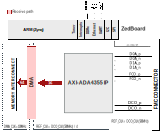

.. _ada4355_fmc:

ADA4355-FMC HDL project
================================================================================

Overview
-------------------------------------------------------------------------------

The :adi:`ADA4355` is a complete, high performance, current input µModule.
For space savings, the :adi:`ADA4355` includes all the  required active and
passive components to realize a complete current to bits data acquisition
solution, supporting a small form factor, optical modules as well as
multichannel systems.

The high speed transimpedance amplifier (TIA) of the device supports 10 ns pulse
widths, allowing high spatial resolution for Time of Flight (ToF) measurements.
Additionally, the :adi:`ADA4355` includes three TIA gain (TZ) settings to
maximize dynamic range. An internal, selectable, analog low-pass filter (LPF)
can limit the device bandwidth with a corner frequency of 100 MHz to minimize
broadband noise while also serving as an antialiasing filter for the 125 MSPS
ADC.

The 14-bit ADC converts the amplified voltage signal at a rate of up to 125 MSPS
and outputs the digitized signals through two serial, low voltage differential
signaling (LVDS) data lanes, operating at rates of up to 1 Gbps per lane. The
data clock output (DCO) operates at frequencies of up to 500 MHz and supports
double data rate (DDR) operation.

Supported boards
-------------------------------------------------------------------------------

- :adi:`EVAL-ADA4355`

Supported devices
-------------------------------------------------------------------------------

- :adi:`ADA4355`

Supported carriers
-------------------------------------------------------------------------------

.. list-table::
   :widths: 35 35 30
   :header-rows: 1

   * - Evaluation board
     - Carrier
     - FMC slot
   * - :adi:`EVAL-ADA4355`
     - `ZedBoard <https://digilent.com/shop/zedboard-zynq-7000-arm-fpga-soc-development-board>`__
     - FMC

Block design
-------------------------------------------------------------------------------

.. warning::
    The VADJ for the Zedboard must be set to 2.5V.

Block diagram
~~~~~~~~~~~~~~~~~~~~~~~~~~~~~~~~~~~~~~~~~~~~~~~~~~~~~~~~~~~~~~~~~~~~~~~~~~~~~~~

The data path and clock domains are depicted in the below diagram:

Configuration modes
~~~~~~~~~~~~~~~~~~~~~~~~~~~~~~~~~~~~~~~~~~~~~~~~~~~~~~~~~~~~~~~~~~~~~~~~~~~~~~~

The BUFMRCE_EN configuration parameter defines the pinout used which is
differentiated by how the frame clock signals are distributed.
For one pinout version, the XDC constraints are not optimized for ISERDES,
as the frame clock signals are located in a different I/O bank from the other
related signals. To address this, a BUFMRCE buffer is used to distribute the
frame clock to all ISERDES instances.

By default it is set to 0. Depending on the pinout, some hardware modifications
need to be done on the board and/or ``make`` command:

In case of the pinout with optimized constraints:

.. shell:: bash

   $make BUFMRCE_EN=0

In case of the pinout with non-optimized constraints:

.. shell:: bash

   $make BUFMRCE_EN=1

CPU/Memory interconnects addresses
~~~~~~~~~~~~~~~~~~~~~~~~~~~~~~~~~~~~~~~~~~~~~~~~~~~~~~~~~~~~~~~~~~~~~~~~~~~~~~~

The addresses are dependent on the architecture of the FPGA, having an offset
added to the base address from HDL (see more at :ref:`architecture`).

==================== ===============
Instance             Zynq/Microblaze
==================== ===============
axi_ada4355_adc      0x44A0_0000
axi_ada4355_dma      0x44A3_0000
==================== ===============

I2C connections
~~~~~~~~~~~~~~~~~~~~~~~~~~~~~~~~~~~~~~~~~~~~~~~~~~~~~~~~~~~~~~~~~~~~~~~~~~~~~~~

.. list-table::
   :widths: 20 20 20 20 20
   :header-rows: 1

   * - I2C type
     - I2C manager instance
     - Alias
     - Address
     - I2C subordinate
   * - PL
     - iic_fmc
     - axi_iic_fmc
     - 0x4162_0000
     - ---
   * - PL
     - iic_main
     - axi_iic_main
     - 0x4160_0000
     - ---

GPIOs
~~~~~~~~~~~~~~~~~~~~~~~~~~~~~~~~~~~~~~~~~~~~~~~~~~~~~~~~~~~~~~~~~~~~~~~~~~~~~~~

The Software GPIO number is calculated as follows:

- Zynq-7000: if PS7 is used, then offset is 54

.. list-table::
   :widths: 25 25 25 25
   :header-rows: 2

   * - GPIO signal
     - Direction
     - HDL GPIO EMIO
     - Software GPIO
   * -
     - (from FPGA view)
     -
     - Zynq-7000
   * - apd_supp_en **
     - INOUT
     - 42
     - 96
   * - trig_fmc_out **
     - OUT
     - 41
     - 95
   * - trig_fmc_in **
     - IN
     - 40
     - 94
   * - freq_sel1 **
     - INOUT
     - 39
     - 93
   * - gain_sel3 **
     - INOUT
     - 38
     - 92
   * - gpio_test **
     - INOUT
     - 37
     - 91
   * - gpio_1p8va_en *
     - IN
     - 37
     - 91
   * - gain_sel2 **
     - INOUT
     - 36
     - 90
   * - gain_sel2 *
     - IN
     - 36
     - 90
   * - gpio_vld_en **
     - INOUT
     - 35
     - 89
   * - gpio_1p8vd_en *
     - INOUT
     - 35
     - 89
   * - freq_sel0 **
     - INOUT
     - 34
     - 88
   * - fsel *
     - INOUT
     - 34
     - 88
   * - gain_sel1
     - INOUT
     - 33
     - 87
   * - gain_sel0
     - INOUT
     - 32
     - 86

.. admonition:: Legend
   :class: note

   - ``*`` instantiated only for BUFMRCE_EN=1
   - ``**`` instantiated only for BUFMRCE_EN=0

Interrupts
~~~~~~~~~~~~~~~~~~~~~~~~~~~~~~~~~~~~~~~~~~~~~~~~~~~~~~~~~~~~~~~~~~~~~~~~~~~~~~~

Below are the Programmable Logic interrupts used in this project.

================ === ========== ===========
Instance name    HDL Linux Zynq Actual Zynq
================ === ========== ===========
axi_ada4355_dma  13  57         89
================ === ========== ===========

SPI connections
~~~~~~~~~~~~~~~~~~~~~~~~~~~~~~~~~~~~~~~~~~~~~~~~~~~~~~~~~~~~~~~~~~~~~~~~~~~~~~~

.. list-table::
   :widths: 25 25 25 25
   :header-rows: 1

   * - SPI type
     - SPI manager instance
     - SPI subordinate
     - CS
   * - PS
     - SPI 0
     - ADA4355
     - 0
   * - PS
     - SPI 1
     - AD5142
     - 1

Building the HDL project
-------------------------------------------------------------------------------

The design is built upon ADI's generic HDL reference design framework.
ADI distributes the bit/elf files of these projects as part of the
:dokuwiki:`ADI Kuiper Linux <resources/tools-software/linux-software/kuiper-linux>`.
If you want to build the sources, ADI makes them available on the
:git-hdl:`HDL repository </>`. To get the source you must
`clone <https://git-scm.com/book/en/v2/Git-Basics-Getting-a-Git-Repository>`__
the HDL repository.

**Linux/Cygwin/WSL**

Example for building with the default configuration (BUFMRCE_EN=0):

.. shell::

   $cd hdl/projects/ada4355_fmc/zed
   $make

Example for building with parameters:

.. shell::

   ~/hdl/projects/ada4355_fmc/zed
   $make BUFMRCE_EN=1

The result of the build, if parameters were used, will be in a folder named
by the configuration used.

If the following command was run

``make BUFMRCE_EN=1``

then the folder name will be: ``BUFMRCEEN1``.

Check `Configuration modes`_ for more details.

A more comprehensive build guide can be found in the :ref:`build_hdl` user guide.

Resources
-------------------------------------------------------------------------------

Hardware related
~~~~~~~~~~~~~~~~~~~~~~~~~~~~~~~~~~~~~~~~~~~~~~~~~~~~~~~~~~~~~~~~~~~~~~~~~~~~~~~

-  Product datasheet: :adi:`ADA4355`

HDL related
~~~~~~~~~~~~~~~~~~~~~~~~~~~~~~~~~~~~~~~~~~~~~~~~~~~~~~~~~~~~~~~~~~~~~~~~~~~~~~~

-  :git-hdl:`ADA4355-FMC HDL project source code <projects/ada4355_fmc>`

.. list-table::
   :widths: 30 35 35
   :header-rows: 1

   * - IP name
     - Source code link
     - Documentation link
   * - AXI_ADA4355
     - :git-hdl:`library/axi_ada4355`
     - :ref:`axi_ada4355`
   * - AXI_CLOCK_MONITOR
     - :git-hdl:`library/axi_clock_monitor`
     - :ref:`axi_clock_monitor`
   * - AXI_CLKGEN
     - :git-hdl:`library/axi_clkgen`
     - :ref:`axi_clkgen`
   * - AXI_DMAC
     - :git-hdl:`library/axi_dmac`
     - :ref:`axi_dmac`
   * - AXI_HDMI_TX
     - :git-hdl:`library/axi_hdmi_tx`
     - :ref:`axi_hdmi_tx`
   * - AXI_I2S_ADI
     - :git-hdl:`library/axi_i2s_adi`
     - ---
   * - AXI_SPDIF_TX
     - :git-hdl:`library/axi_spdif_tx`
     - ---
   * - AXI_SYSID
     - :git-hdl:`library/axi_sysid`
     - :ref:`axi_sysid`
   * - SYSID_ROM
     - :git-hdl:`library/sysid_rom`
     - :ref:`axi_sysid`
   * - UTIL_I2C_MIXER
     - :git-hdl:`library/util_i2c_mixer`
     - ---

.. include:: ../common/more_information.rst

.. include:: ../common/support.rst
