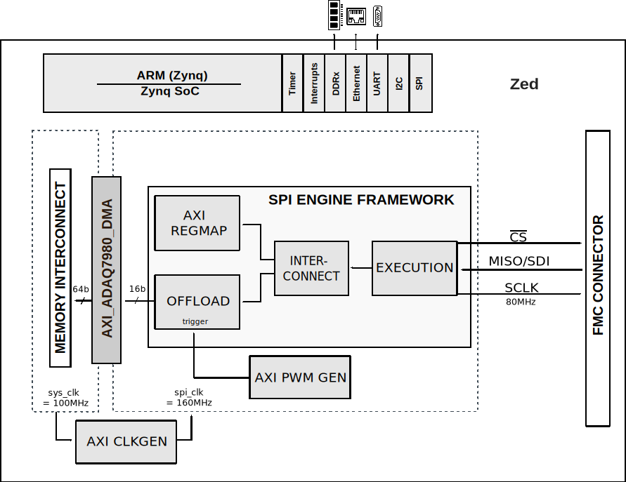

.. _adaq7980_sdz:

ADAQ7980-SDZ HDL project
===============================================================================

Overview
-------------------------------------------------------------------------------

The :adi:`ADAQ7980`/:adi:`ADAQ7988` are 16-bit analog-to-digital converter
(ADC) subsystems that integrate four common signal processing and conditioning
blocks into a system in package (SiP) design that supports a variety of
applications. These devices contain the most critical passive components,
eliminating many of the design challenges associated with traditional signal
chains that use successive approximation register (SAR) ADCs. These passive
components are crucial to achieving the specified device performance.

The :adi:`ADAQ7980`/:adi:`ADAQ7988` contain a high accuracy, low power,
16-bit SAR ADC, a low power, high bandwidth, high input impedance ADC driver,
a low power, stable reference buffer, and an efficient power management block.
Housed within a tiny, 5 mm × 4 mm LGA package, these systems simplify the
design process for data acquisition systems. The level of system integration
of the :adi:`ADAQ7980`/:adi:`ADAQ7988` solves many design challenges, while
the devices still provide the flexibility of a configurable ADC driver feedback
loop to allow gain and/or common-mode adjustments. A set of four device
supplies provides optimal system performance; however, single-supply operation
is possible with minimal impact on device operating specifications.

Using the SDI input, the SPI-compatible serial interface features the ability
to daisy-chain multiple devices on a single, 3-wire bus and provides an optional
busy indicator. The user interface is compatible with 1.8 V, 2.5 V, 3 V, or 5 V
logic. Specified operation of these devices is from −55°C to +125°C.

Applications:

* Automated test equipment (ATE)
* Battery powered instrumentation
* Communications
* Data acquisition
* Process control
* Medical instruments

Supported boards
-------------------------------------------------------------------------------

- :adi:`EVAL-ADAQ7980`

Supported devices
-------------------------------------------------------------------------------

- :adi:`ADAQ7980`
- :adi:`ADAQ7988`

Supported carriers
-------------------------------------------------------------------------------

- `ZedBoard <https://digilent.com/shop/zedboard-zynq-7000-arm-fpga-soc-development-board>`__ on FMC slot

Block design
-------------------------------------------------------------------------------

Block diagram
~~~~~~~~~~~~~~~~~~~~~~~~~~~~~~~~~~~~~~~~~~~~~~~~~~~~~~~~~~~~~~~~~~~~~~~~~~~~~~~

The data path and clock domains are depicted in the below diagram:

CPU/Memory interconnects addresses
~~~~~~~~~~~~~~~~~~~~~~~~~~~~~~~~~~~~~~~~~~~~~~~~~~~~~~~~~~~~~~~~~~~~~~~~~~~~~~~

The addresses are dependent on the architecture of the FPGA, having an offset
added to the base address from HDL (see more at :ref:`architecture cpu-intercon-addr`).

===========================  ===========
Instance                     Zynq
===========================  ===========
axi_adaq7980_dma             0x44A3_0000
spi_clkgen                   0x44A7_0000
spi_adaq7980_adc_axi_regmap  0x44A0_0000
spi_trigger_gen              0x44B0_0000
===========================  ===========

I2C connections
~~~~~~~~~~~~~~~~~~~~~~~~~~~~~~~~~~~~~~~~~~~~~~~~~~~~~~~~~~~~~~~~~~~~~~~~~~~~~~~

.. list-table::
   :widths: 20 20 20 20 20
   :header-rows: 1

   * - I2C type
     - I2C manager instance
     - Alias
     - Address
     - I2C subordinate
   * - PL
     - iic_fmc
     - axi_iic_fmc
     - 0x4162_0000
     - ---
   * - PL
     - iic_main
     - axi_iic_main
     - 0x4160_0000
     - ---

SPI connections
~~~~~~~~~~~~~~~~~~~~~~~~~~~~~~~~~~~~~~~~~~~~~~~~~~~~~~~~~~~~~~~~~~~~~~~~~~~~~~~

.. list-table::
   :widths: 25 25 25 25
   :header-rows: 1

   * - SPI type
     - SPI manager instance
     - SPI subordinate
     - CS
   * - PL
     - axi_spi_engine
     - adaq7980
     - 0

GPIOs
~~~~~~~~~~~~~~~~~~~~~~~~~~~~~~~~~~~~~~~~~~~~~~~~~~~~~~~~~~~~~~~~~~~~~~~~~~~~~~~

The Software GPIO number is calculated as follows:

- Zynq-7000: if PS7 is used, then offset is 54

.. list-table::
   :widths: 25 25 25 25
   :header-rows: 2

   * - GPIO signal
     - Direction
     - HDL GPIO EMIO
     - Software GPIO
   * -
     - (from FPGA view)
     -
     - Zynq-7000
   * - adaq7980_rbuf_pf
     - INOUT
     - 41
     - 95
   * - adaq7980_ref_pd
     - INOUT
     - 40
     - 94
   * - adaq7980_gpio[7:0]
     - INOUT
     - 39:32
     - 93:86

Interrupts
~~~~~~~~~~~~~~~~~~~~~~~~~~~~~~~~~~~~~~~~~~~~~~~~~~~~~~~~~~~~~~~~~~~~~~~~~~~~~~~

Below are the Programmable Logic interrupts used in this project.

================ === ========== ===========
Instance name    HDL Linux Zynq Actual Zynq
================ === ========== ===========
axi_adaq7980_dma 13  57         89
spi_adaq7980     12  56         88
================ === ========== ===========

Building the HDL project
-------------------------------------------------------------------------------

The design is built upon ADI's generic HDL reference design framework.
ADI distributes the bit/elf files of these projects as part of the
:dokuwiki:`ADI Kuiper Linux <resources/tools-software/linux-software/kuiper-linux>`.
If you want to build the sources, ADI makes them available on the
:git-hdl:`HDL repository </>`. To get the source you must
the HDL repository, and then build the project as follows:.

**Linux/Cygwin/WSL**

.. shell::

   $cd hdl/projects/adaq7980_sdz/zed
   $make

A more comprehensive build guide can be found in the :ref:`build_hdl` user guide.

Resources
-------------------------------------------------------------------------------

Hardware related
~~~~~~~~~~~~~~~~~~~~~~~~~~~~~~~~~~~~~~~~~~~~~~~~~~~~~~~~~~~~~~~~~~~~~~~~~~~~~~~

- Product datasheet: :adi:`ADAQ7980`/:adi:`ADAQ7988`
- `UG-1060, Evaluation Board User Guide <https://www.analog.com/media/en/technical-documentation/data-sheets/adaq7980-7988.pdf>`__

HDL related
~~~~~~~~~~~~~~~~~~~~~~~~~~~~~~~~~~~~~~~~~~~~~~~~~~~~~~~~~~~~~~~~~~~~~~~~~~~~~~~

- :git-hdl:`ADAQ7980_SDZ HDL project source code <projects/adaq7980_sdz>`

.. list-table::
   :widths: 30 35 35
   :header-rows: 1

   * - IP name
     - Source code link
     - Documentation link
   * - AXI_CLKGEN
     - :git-hdl:`library/axi_clkgen`
     - :ref:`axi_clkgen`
   * - AXI_DMAC
     - :git-hdl:`library/axi_dmac`
     - :ref:`axi_dmac`
   * - AXI_HDMI_TX
     - :git-hdl:`library/axi_hdmi_tx`
     - :ref:`axi_hdmi_tx`
   * - AXI_I2S_ADI
     - :git-hdl:`library/axi_i2s_adi`
     - ---
   * - AXI_PWM_GEN
     - :git-hdl:`library/axi_pwm_gen`
     - :ref:`axi_pwm_gen`
   * - AXI_SPDIF_TX
     - :git-hdl:`library/axi_spdif_tx`
     - ---
   * - AXI_SPI_ENGINE
     - :git-hdl:`library/spi_engine/axi_spi_engine`
     - :ref:`spi_engine axi`
   * - AXI_SYSID
     - :git-hdl:`library/axi_sysid`
     - :ref:`axi_sysid`
   * - SPI_ENGINE_EXECUTION
     - :git-hdl:`library/spi_engine/spi_engine_execution`
     - :ref:`spi_engine execution`
   * - SPI_ENGINE_INTERCONNECT
     - :git-hdl:`library/spi_engine/spi_engine_interconnect`
     - :ref:`spi_engine interconnect`
   * - SPI_ENGINE_OFFLOAD
     - :git-hdl:`library/spi_engine/spi_engine_offload`
     - :ref:`spi_engine offload`
   * - SYSID_ROM
     - :git-hdl:`library/sysid_rom`
     - :ref:`axi_sysid`
   * - UTIL_I2C_MIXER
     - :git-hdl:`library/util_i2c_mixer`
     - :ref:`spi_engine offload`

- :ref:`SPI Engine Framework documentation <spi_engine>`

Software related
~~~~~~~~~~~~~~~~~~~~~~~~~~~~~~~~~~~~~~~~~~~~~~~~~~~~~~~~~~~~~~~~~~~~~~~~~~~~~~~

- :git-no-os:`ADAQ7980_SDZ No-OS project <projects/adaq7980_sdz>`

.. include:: ../common/more_information.rst

.. include:: ../common/support.rst
