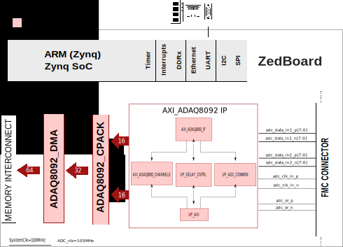
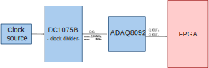

.. _adaq8092_fmc:

ADAQ8092-FMC HDL project
================================================================================

Overview
-------------------------------------------------------------------------------

The :adi:`EVAL-ADAQ8092` evaluates the :adi:`ADAQ8092`, a
14-bit, 105MSPS , high-speed dual-channel data acquisition uModule solution.
This device uses the System-in-Package (SiP) that integrates three common signal
processing and conditioning blocks.

This :adi:`EVAL-ADAQ8092` board does not need an external power
supply to operate and requires a very small jitter in the clock source. We
recommend to use the :adi:`DC1075B` to improve the clock signal source. For
full details on the  :adi:`ADAQ8092`, see the  :adi:`ADAQ8092` data sheet,
which must be consulted in conjunction with this user guide when using the
:adi:`EVAL-ADAQ8092`.

Supported boards
-------------------------------------------------------------------------------

- :adi:`EVAL-ADAQ8092`
- :adi:`DC1075B`

Supported devices
-------------------------------------------------------------------------------

- :adi:`ADAQ8092`

Supported carriers
-------------------------------------------------------------------------------

.. list-table::
   :widths: 35 35 30
   :header-rows: 1

   * - Evaluation board
     - Carrier
     - FMC slot
   * - :adi:`EVAL-ADAQ8092`
     - `ZedBoard <https://digilent.com/shop/zedboard-zynq-7000-arm-fpga-soc-development-board>`__
     - FMC-LPC

Block design
-------------------------------------------------------------------------------

.. warning::

    The VADJ for the Zedboard must be set to 2.5V.

Block diagram
~~~~~~~~~~~~~~~~~~~~~~~~~~~~~~~~~~~~~~~~~~~~~~~~~~~~~~~~~~~~~~~~~~~~~~~~~~~~~~~

Clock scheme
~~~~~~~~~~~~~~~~~~~~~~~~~~~~~~~~~~~~~~~~~~~~~~~~~~~~~~~~~~~~~~~~~~~~~~~~~~~~~~~

- External clock source

  - Rohde & Schwarz SMA100A (clock source) - Suggested
  - :adi:`DC1075B (Clock Divider) - Suggested <DC1075B>`

CPU/Memory interconnects addresses
~~~~~~~~~~~~~~~~~~~~~~~~~~~~~~~~~~~~~~~~~~~~~~~~~~~~~~~~~~~~~~~~~~~~~~~~~~~~~~~

The addresses are dependent on the architecture of the FPGA, having an offset
added to the base address from HDL (see more at :ref:`architecture cpu-intercon-addr`).

==================== ===============
Instance             Zynq/Microblaze
==================== ===============
axi_adaq8092         0x44A0_0000
axi_adaq8092_dma     0x44A3_0000
==================== ===============

SPI connections
~~~~~~~~~~~~~~~~~~~~~~~~~~~~~~~~~~~~~~~~~~~~~~~~~~~~~~~~~~~~~~~~~~~~~~~~~~~~~~

.. list-table::
   :widths: 25 25 25 25
   :header-rows: 1

   * - SPI type
     - SPI manager instance
     - SPI subordinate
     - CS
   * - PS
     - SPI 0
     - ADAQ8092
     - 0

GPIOs
~~~~~~~~~~~~~~~~~~~~~~~~~~~~~~~~~~~~~~~~~~~~~~~~~~~~~~~~~~~~~~~~~~~~~~~~~~~~~~~

.. list-table::
   :widths: 25 20 20 20 15
   :header-rows: 2

   * - GPIO signal
     - Direction
     - HDL GPIO EMIO
     - Software GPIO
     - Software GPIO
   * -
     - (from FPGA view)
     -
     - Zynq-7000
     - Zynq MP
   * - en_1p8
     - OUT
     - 35
     - 89
     - 113
   * - adc_pd2
     - OUT
     - 34
     - 88
     - 112
   * - adc_pd1
     - OUT
     - 33
     - 87
     - 111
   * - adc_par_ser
     - IN
     - 32
     - 86
     - 110

Interrupts
~~~~~~~~~~~~~~~~~~~~~~~~~~~~~~~~~~~~~~~~~~~~~~~~~~~~~~~~~~~~~~~~~~~~~~~~~~~~~~~

Below are the Programmable Logic interrupts used in this project.

================ === ========== ===========
Instance name    HDL Linux Zynq Actual Zynq
================ === ========== ===========
axi_adaq8092_dma 13  57         89
================ === ========== ===========

Building the HDL project
-------------------------------------------------------------------------------

The design is built upon ADI's generic HDL reference design framework.
ADI distributes the bit/elf files of these projects as part of the
:dokuwiki:`ADI Kuiper Linux <resources/tools-software/linux-software/kuiper-linux>`.
If you want to build the sources, ADI makes them available on the
:git-hdl:`HDL repository </>`. To get the source you must
`clone <https://git-scm.com/book/en/v2/Git-Basics-Getting-a-Git-Repository>`__
the HDL repository, and then build the project as follows:

**Linux/Cygwin/WSL**

.. shell::

   $cd hdl/projects/adaq8092_fmc/zed
   $make

A more comprehensive build guide can be found in the :ref:`build_hdl` user guide.

Resources
-------------------------------------------------------------------------------

Systems related
~~~~~~~~~~~~~~~~~~~~~~~~~~~~~~~~~~~~~~~~~~~~~~~~~~~~~~~~~~~~~~~~~~~~~~~~~~~~~~~

- :dokuwiki:`[Wiki] ADAQ8092 Evaluation Board User Guide </resources/eval/user-guide/adaq8092-eval-board>`

Hardware related
~~~~~~~~~~~~~~~~~~~~~~~~~~~~~~~~~~~~~~~~~~~~~~~~~~~~~~~~~~~~~~~~~~~~~~~~~~~~~~~

- Product datasheets: :adi:`ADAQ8092`

HDL related
~~~~~~~~~~~~~~~~~~~~~~~~~~~~~~~~~~~~~~~~~~~~~~~~~~~~~~~~~~~~~~~~~~~~~~~~~~~~~~~

- :git-hdl:`EVAL-ADAQ8092 HDL project source code <projects/adaq8092_fmc>`

.. list-table::
   :widths: 30 35 35
   :header-rows: 1

   * - IP name
     - Source code link
     - Documentation link
   * - AXI_ADAQ8092
     - :git-hdl:`library/axi_adaq8092`
     - :ref:`axi_adaq8092`
   * - AXI_CLKGEN
     - :git-hdl:`library/axi_clkgen`
     - :ref:`axi_clkgen`
   * - AXI_DMAC
     - :git-hdl:`library/axi_dmac`
     - :ref:`axi_dmac`
   * - AXI_HDMI_TX
     - :git-hdl:`library/axi_hdmi_tx`
     - :ref:`axi_hdmi_tx`
   * - AXI_I2S_ADI
     - :git-hdl:`library/axi_i2s_adi`
     - —
   * - AXI_SPDIF_TX
     - :git-hdl:`library/axi_spdif_tx`
     - 	—
   * - AXI_SYSID
     - :git-hdl:`library/axi_sysid`
     - :ref:`axi_sysid`
   * - SYSID_ROM
     - :git-hdl:`library/sysid_rom`
     - :ref:`axi_sysid`
   * - UTIL_I2C_MIXER
     - :git-hdl:`library/util_i2c_mixer`
     - 	—
   * - UTIL_CPACK2
     - :git-hdl:`library/util_pack/util_cpack2`
     - :ref:`util_cpack2`

Software related
~~~~~~~~~~~~~~~~~~~~~~~~~~~~~~~~~~~~~~~~~~~~~~~~~~~~~~~~~~~~~~~~~~~~~~~~~~~~~~~

- :dokuwiki:`[Wiki] ADAQ8092 14-Bit, 105 MSPS, μModule Linux device driver </resources/tools-software/linux-drivers/iio-adc/adaq8092>`
- :git-linux:`Linux driver adaq8092.c <drivers/iio/adc/adaq8092.c>`
- :git-linux:`Linux device tree zynq-zed-adv7511-adaq8092.dts <arch/arm/boot/dts/xilinx/zynq-zed-adv7511-adaq8092.dts>`
- :git-no-os:`No-Os device driver <drivers/adc/adaq8092>`
- :git-no-os:`No-Os project <projects/adaq8092_fmc>`

- Python support :

  - `ADAQ8092 Python class documentation <https://analogdevicesinc.github.io/pyadi-iio/devices/adi.adaq8092.html>`__
  - :git-pyadi-iio:`ADAQ8092 PyADI-IIO example <examples/adaq8092_example.py>`
  - :git-pyadi-iio:`PyADI-IIO documentation </>`

.. include:: ../common/more_information.rst

.. include:: ../common/support.rst
