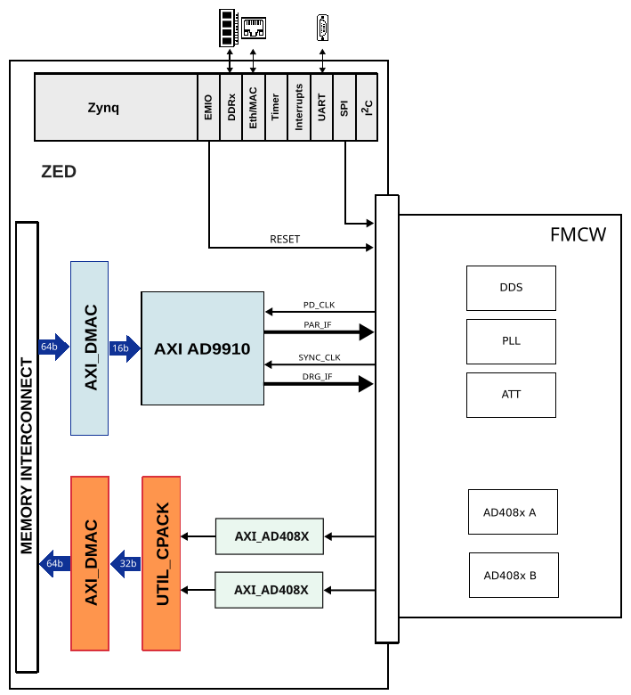

.. _admfm8000_evalz:

ADMFM8000-EVALZ/ZED HDL Project
===============================================================================

Overview
-------------------------------------------------------------------------------

The ADMFM8000-EVALZ/ZED reference design targets the Digilent ZedBoard.
The design has an AD9910 transmit/control subsystem and adds two
AD4080-compatible LVDS ADC interfaces, one capture DMA, and a single AXI Quad
SPI controller shared by both ADC devices (one chip-select per device, MISO
muxed by the active chip-select).

The DDS transmit path is driven by the :ref:`axi_ad9910` core:

- Control plane: AXI-Lite register map for ramp/profile/reset/update control
- Ramp plane: the digital ramp generator (DRG) interface
  (``sync_clk``/``drctl``/``drover``/``drhold``) sweeps the AD9910 tuning word
  to synthesize the chirp — see `Digital ramp (DRG) interface`_
- Data plane: a cyclic scatter-gather AXI DMAC streams 16-bit words from PS DDR
  to the AD9910 parallel interface for continuous waveform playout
- Function select: ``f_o[1:0]`` is driven from the ``axi_ad9910`` register map,
  not packed into the AXI stream. It selects whether ``dds_d[15:0]`` carries
  amplitude, phase, frequency-word slices, or combined amplitude/phase data.
  The 16-bit ``db_o[15:0]`` data and ``f_o[1:0]`` select are exported as
  separate top-level ports (``dds_d[15:0]`` and ``dds_f0``/``dds_f1``)

At a glance, the design has one transmit DMA channel (PS DDR → AD9910, on PS7
``HP0``) and one receive DMA channel (dual ADC → PS DDR, on PS7 ``HP1``), with
all control planes mapped on the ``0x44Axxxxx`` AXI-Lite region.

The receive path is built around two :ref:`axi_ad408x` cores. Each ADC uses one
LVDS data lane and its own data clock output. The two receive samples are packed
by ``util_cpack2`` and written to memory through ``axi_ad4880_dma``.

Supported boards
-------------------------------------------------------------------------------

- ADMFM8000-EVALZ

Supported devices
-------------------------------------------------------------------------------

- :ref:`axi_ad9910` (AD9910 DDS control + parallel data)
- :ref:`axi_ad408x` (AD4080-compatible LVDS ADC, two instances)
- AD9508 clock device (PS SPI1)

Supported carriers
-------------------------------------------------------------------------------

- ZedBoard on FMC slot

Build parameters
-------------------------------------------------------------------------------

The Zed project exposes the following Vivado parameter:

.. list-table::
   :widths: 25 15 60
   :header-rows: 1

   * - Parameter
     - Default
     - Description
   * - ``ADC_N_BITS``
     - 20
     - ADC sample width used by both ``axi_ad408x`` cores.

When ``ADC_N_BITS`` is greater than 16, the receive datapath uses 32-bit samples
per ADC channel and a 64-bit source width into ``axi_ad4880_dma``. For
``ADC_N_BITS`` values of 16 or lower, the packer uses 16-bit samples and a
32-bit DMA source width.

Block diagram
~~~~~~~~~~~~~~~~~~~~~~~~~~~~~~~~~~~~~~~~~~~~~~~~~~~~~~~~~~~~~~~~~~~~~~~~~~~~~~~

The data path keeps the Phase 1 DDS transmit/control subsystem and adds the
dual ADC receive capture chain:

Block design
-------------------------------------------------------------------------------

The design instantiates the standard ZedBoard base system and adds:

- HDMI video out (AXI HDMI TX)
- I2S audio and SPDIF TX
- I2C with external mux for FMC peripherals
- SPI0 routed to three chip-selects for DDS/PLL/ATT
- SPI1 routed to the AD9508 clock device chip-select
- AD9910 control core and a TX DMA for parallel DDS data
- One AXI Quad SPI controller shared between ADC A and ADC B register access
  (two chip-selects, shared SCLK/MOSI, MISO muxed in fabric)
- Two AD4080-compatible LVDS ADC cores
- A two-channel sample packer and RX DMA for ADC capture

Datapath topology
~~~~~~~~~~~~~~~~~~~~~~~~~~~~~~~~~~~~~~~~~~~~~~~~~~~~~~~~~~~~~~~~~~~~~~~~~~~~~~~

Transmit (DDS playout)::

  PS DDR --> axi_ad9910_dma --> axi_ad9910_0 --> db_o/dds_d
   (SG)      (cyclic, m_axis)   (parallel IF)

The transmit DMA (``axi_ad9910_dma``) is a cyclic scatter-gather channel: the
processor builds a descriptor chain in DDR, and the DMA replays it continuously
into the AD9910 parallel interface without further CPU intervention — the basis
for repeating chirp waveforms. Its master ports (``m_src_axi`` and
``m_sg_axi``) attach to PS7 ``HP0``.

Receive (ADC capture)::

  adca/adcb --> axi_ad4080_adc_a/_b --> util_ad4880_adc_pack --> axi_ad4880_dma
   (LVDS)        (deserialize)          (util_cpack2, 2 ch)       (S2MM)
                                                             --> PS DDR

Both ADC cores deserialize their LVDS lane into the ADC A receive-clock domain.
``util_ad4880_adc_pack`` (a ``util_cpack2`` instance, two channels) interleaves
channel A and channel B samples into a single packed stream, which
``axi_ad4880_dma`` (S2MM) writes to DDR through PS7 ``HP1``. The packer and RX
DMA both run on ``axi_ad4080_adc_a/adc_clk``; channel B's data is sampled into
that same domain.

Core configuration highlights
~~~~~~~~~~~~~~~~~~~~~~~~~~~~~~~~~~~~~~~~~~~~~~~~~~~~~~~~~~~~~~~~~~~~~~~~~~~~~~~

.. list-table::
   :widths: 30 70
   :header-rows: 1

   * - Core
     - Key parameters
   * - ``axi_ad9910_0``
     - ``FPGA_TECHNOLOGY=1``, ``DELAY_REFCLK_FREQ=200``,
       ``IODELAY_ENABLE=0``, ``ID=0``
   * - ``axi_ad9910_dma``
     - SRC=mem-mapped, DEST=stream, ``CYCLIC=1``, ``DMA_SG_TRANSFER=1``,
       SRC/SG width 64-bit, DEST width 16-bit
   * - ``axi_ad4880_dma``
     - SRC=stream, DEST=mem-mapped, ``SYNC_TRANSFER_START=1``,
       SRC width = ``DMA_DATA_WIDTH_SRC``, DEST width 64-bit
   * - ``axi_ad408x`` (adc_a/adc_b)
     - ``NUM_LANES=1`` each; ``ADC_N_BITS=ADC_N_BITS``; ADC B uses
       ``IO_DELAY_GROUP=adc_if_delay_group2``
   * - ``util_cpack2``
     - ``NUM_OF_CHANNELS=2``, ``SAMPLE_DATA_WIDTH=SAMPLE_DATA_WIDTH``
   * - ``ad4080_a_spi``
     - ``axi_quad_spi``: ``C_NUM_SS_BITS=2``, ``C_SCK_RATIO=8``,
       ``C_USE_STARTUP=0``

The ``SAMPLE_DATA_WIDTH`` and ``DMA_DATA_WIDTH_SRC`` values are derived from the
``ADC_N_BITS`` build parameter (see `Build parameters`_): 16/32-bit for
``ADC_N_BITS <= 16``, otherwise 32/64-bit.

SPI chip-select mapping
~~~~~~~~~~~~~~~~~~~~~~~~~~~~~~~~~~~~~~~~~~~~~~~~~~~~~~~~~~~~~~~~~~~~~~~~~~~~~~~

.. list-table::
   :widths: 25 20 55
   :header-rows: 1

   * - Interface
     - Chip-select
     - Target
   * - PS SPI0
     - CS0
     - DDS serial control (``dds_csb``)
   * - PS SPI0
     - CS1
     - PLL latch enable (``pll_le``)
   * - PS SPI0
     - CS2
     - Attenuator latch enable (``att_le``)
   * - PS SPI1
     - CS0
     - AD9508 clock device (``ad9508_csn``)
   * - AXI Quad SPI (shared)
     - SS0
     - ADC A SPI chip-select
   * - AXI Quad SPI (shared)
     - SS1
     - ADC B SPI chip-select

ADC A and ADC B are register-accessed through the single ``ad4080_a_spi``
core: SCLK and MOSI are shared between the two devices, and MISO is muxed in
fabric by which chip-select is currently active (asserting both chip-selects
at once is illegal). Because both channels sit on the same SPI bus and are
only distinguished by chip-select, the Linux driver now requires both AD4080
channels to be declared under the same SPI bus/controller node in the
devicetree, each with its own ``reg`` (chip-select) value, rather than as two
separate SPI controllers.

AD9910 Signals
~~~~~~~~~~~~~~~~~~~~~~~~~~~~~~~~~~~~~~~~~~~~~~~~~~~~~~~~~~~~~~~~~~~~~~~~~~~~~~~

The AD9910 control and parallel data signals are exported as top-level ports
and are driven/consumed by the :ref:`axi_ad9910` core.

.. list-table::
   :widths: 25 20 55
   :header-rows: 1

   * - Signal
     - Direction (from FPGA view)
     - Notes
   * - dds_sync_clk
     - IN
     - AD9910 control clock (buffered before BD)
   * - dds_pdclk
     - IN
     - AD9910 parallel clock
   * - dds_d[15:0]
     - OUT
     - AD9910 parallel data (``db_o[15:0]``)
   * - dds_f0
     - OUT
     - AD9910 function-select bit 0 (``f_o[0]``)
   * - dds_f1
     - OUT
     - AD9910 function-select bit 1 (``f_o[1]``): ``f_o`` = ``00`` amplitude,
       ``01`` phase, ``10`` frequency, ``11`` amp+phase
   * - dds_txenable
     - OUT
     - Parallel interface enable/strobe
   * - dds_drctrl
     - OUT
     - AD9910 DRCTL
   * - dds_drhold
     - OUT
     - AD9910 DRHOLD
   * - dds_io_update
     - OUT
     - AD9910 IO_UPDATE from GPIO 39, synchronized to ``dds_sync_clk``
   * - dds_io_reset
     - OUT
     - AD9910 IO_RESET from GPIO 36
   * - dds_osk
     - OUT
     - AD9910 OSK from GPIO 40, synchronized to ``dds_sync_clk``
   * - dds_profile0
     - OUT
     - AD9910 PROFILE[0]
   * - dds_profile1
     - OUT
     - AD9910 PROFILE[1]
   * - dds_profile2
     - OUT
     - AD9910 PROFILE[2]
   * - dds_main_reset
     - OUT
     - AD9910 MAIN_RESET from GPIO 37
   * - dds_ext_pwr_dwn
     - OUT
     - AD9910 power-down from GPIO 38
   * - dds_drover
     - IN
     - AD9910 drover feedback
   * - dds_ram_swp_ovr
     - IN
     - AD9910 RAM swap/overrange feedback

``drover`` and ``ram_swp_ovr`` are fed back into the AD9910 core.

Digital ramp (DRG) interface
~~~~~~~~~~~~~~~~~~~~~~~~~~~~~~~~~~~~~~~~~~~~~~~~~~~~~~~~~~~~~~~~~~~~~~~~~~~~~~~

The digital ramp generator (DRG) is the primary chirp-generation path: the
:ref:`axi_ad9910` core sweeps the AD9910 frequency tuning word between a
programmed lower and upper limit to synthesize the transmit chirp. Four
board-level signals form the ramp control loop, all referenced to the AD9910
serial-clock domain ``sync_clk``:

.. list-table::
   :widths: 18 12 70
   :header-rows: 1

   * - Signal
     - Direction (from FPGA view)
     - Role in the ramp loop
   * - ``dds_sync_clk``
     - IN
     - AD9910 serial/ramp clock. Buffered through an ``IBUFG`` in the top HDL
       and used as the timebase for the entire DRG state machine, its delay
       counters, and ``drover`` synchronization. All ramp timing is counted in
       ``sync_clk`` cycles.
   * - ``dds_drctrl``
     - OUT
     - DRCTL — selects the ramp direction. In simple/toggle modes it is
       level-sensitive (high = ramp up, low = ramp down); in no-dwell modes the
       AD9910 reacts to DRCTL *transitions* (edge) instead of the static level.
   * - ``dds_drover``
     - IN
     - DROVER — limit-reached feedback. The AD9910 drives it high when the ramp
       hits its programmed upper or lower limit. The core synchronizes it into
       ``sync_clk`` (2-stage) and uses the resulting edge to end a ramp period,
       toggle direction (toggle mode), and arm the next ramp/burst delay.
   * - ``dds_drhold``
     - OUT
     - DRHOLD — stalls the ramp accumulator in place. While asserted the AD9910
       freezes the current frequency; deasserting it resumes the ramp from where
       it stopped (used for dwell/pause within a chirp).

ADC receive path
~~~~~~~~~~~~~~~~~~~~~~~~~~~~~~~~~~~~~~~~~~~~~~~~~~~~~~~~~~~~~~~~~~~~~~~~~~~~~~~

The receive path contains two independent AD4080-compatible LVDS interfaces.
Both cores are configured with one data lane and the project-wide
``ADC_N_BITS`` setting.

.. list-table::
   :widths: 35 15 50
   :header-rows: 1

   * - Signal
     - Direction (from FPGA view)
     - Notes
   * - adca_dco_p/n
     - IN
     - ADC A LVDS data clock
   * - adca_da_p/n
     - IN
     - ADC A LVDS data lane A
   * - adca_sync_n
     - IN
     - From ``ad9508_sync`` in top HDL
   * - adca_filter_data_ready_n
     - IN
     - Tied low in top HDL
   * - adcb_dco_p/n
     - IN
     - ADC B LVDS data clock
   * - adcb_da_p/n
     - IN
     - ADC B LVDS data lane A
   * - adcb_sync_n
     - IN
     - From ``ad9508_sync`` in top HDL
   * - adcb_filter_data_ready_n
     - IN
     - Tied low in top HDL

ADC A provides the receive datapath clock for ``util_cpack2`` and
``axi_ad4880_dma``. The packer writes channel A and channel B samples into one
packed FIFO stream, and the DMA writes the packed data to memory through PS7
HP1.

Clock and power control
~~~~~~~~~~~~~~~~~~~~~~~~~~~~~~~~~~~~~~~~~~~~~~~~~~~~~~~~~~~~~~~~~~~~~~~~~~~~~~~

The ADMFM8000-EVALZ top-level HDL adds control for the ADC/clock mezzanine support
signals:

.. list-table::
   :widths: 25 20 55
   :header-rows: 1

   * - Signal
     - Direction (from FPGA view)
     - Notes
   * - pwrgd
     - IN
     - Power-good status; sampled on GPIO 44
   * - en_psu
     - OUT
     - Tied high
   * - pd_v33b
     - OUT
     - Tied high
   * - en_ifvga
     - OUT
     - Follows ``pwrgd``
   * - ad9508_sync
     - OUT
     - Inverted GPIO 41, shared by ADC A/B sync
   * - adca_gpio1_fmc
     - OUT
     - Driven by GPIO 43
   * - adcb_gpio1_fmc
     - OUT
     - Driven by GPIO 42
   * - adca_gp0_dir
     - OUT
     - Tied low
   * - adca_gp1_dir
     - OUT
     - Tied low
   * - pll_ce
     - INOUT
     - EMIO GPIO 32

AXI Address Map
~~~~~~~~~~~~~~~~~~~~~~~~~~~~~~~~~~~~~~~~~~~~~~~~~~~~~~~~~~~~~~~~~~~~~~~~~~~~~~~

.. list-table::
   :widths: 30 20 50
   :header-rows: 1

   * - Instance name
     - Address
     - Description
   * - axi_ad9910_0
     - 0x44A00000
     - AD9910 control register map
   * - axi_ad9910_dma
     - 0x44A10000
     - AD9910 TX DMA
   * - axi_ad4080_adc_a
     - 0x44A20000
     - ADC A LVDS interface core
   * - axi_ad4080_adc_b
     - 0x44A30000
     - ADC B LVDS interface core
   * - axi_ad4880_dma
     - 0x44A40000
     - Packed ADC RX DMA
   * - ad4080_a_spi
     - 0x44A60000
     - Shared AXI Quad SPI for ADC A and ADC B (SS0/SS1)

PS7 high-performance memory ports
~~~~~~~~~~~~~~~~~~~~~~~~~~~~~~~~~~~~~~~~~~~~~~~~~~~~~~~~~~~~~~~~~~~~~~~~~~~~~~~

The two DMA channels are isolated on separate PS7 high-performance AXI slave
ports so transmit playout and receive capture do not contend on the same
interconnect:

.. list-table::
   :widths: 15 55 30
   :header-rows: 1

   * - HP port
     - Master
     - Traffic
   * - ``HP0``
     - ``axi_ad9910_dma`` (``m_src_axi`` + ``m_sg_axi``)
     - TX: DDR → DDS
   * - ``HP1``
     - ``axi_ad4880_dma`` (``m_dest_axi``)
     - RX: ADC → DDR

GPIOs
~~~~~~~~~~~~~~~~~~~~~~~~~~~~~~~~~~~~~~~~~~~~~~~~~~~~~~~~~~~~~~~~~~~~~~~~~~~~~~~

.. list-table::
   :widths: 25 20 25 30
   :header-rows: 1

   * - GPIO signal
     - Direction (from FPGA view)
     - HDL EMIO GPIO
     - Software GPIO Zynq-7000
   * - pll_ce
     - INOUT
     - 32
     - 86
   * - gpio_bd[31:0]
     - INOUT
     - 31:0
     - 85:54
   * - pwrgd
     - IN
     - 44
     - 98
   * - dds_io_reset
     - OUT
     - 36,
     - 90
   * - dds_main_reset
     - OUT
     - 37,
     - 91
   * - dds_ext_pwr_dwn
     - OUT
     - 38,
     - 92
   * - dds_io_update
     - OUT
     - 39,
     - 93
   * - dds_osk
     - OUT
     - 40,
     - 94
   * - ad9508_sync
     - OUT
     - 41,
     - 95
   * - adcb_gpio1_fmc
     - OUT
     - 42,
     - 96
   * - adca_gpio1_fmc
     - OUT
     - 43,
     - 97

Interrupts
~~~~~~~~~~~~~~~~~~~~~~~~~~~~~~~~~~~~~~~~~~~~~~~~~~~~~~~~~~~~~~~~~~~~~~~~~~~~~~~

Below are the Programmable Logic interrupts used in the project.

.. list-table::
   :widths: 50 25 25
   :header-rows: 1

   * - Instance name
     - HDL
     - Linux Zynq
   * - axi_ad9910_dma
     - 0
     - 44
   * - axi_ad9910_0
     - 1
     - 45
   * - axi_ad4880_dma
     - 2
     - 46
   * - ad4080_a_spi
     - 3
     - 47

Clocks and sync
~~~~~~~~~~~~~~~~~~~~~~~~~~~~~~~~~~~~~~~~~~~~~~~~~~~~~~~~~~~~~~~~~~~~~~~~~~~~~~~

- ``dds_sync_clk``: external sync clock for the :ref:`axi_ad9910` control logic
- ``dds_pdclk``: external reference clock for the AD9910 parallel interface
- ``adca_dco_p/n``: ADC A receive data clock; drives the packed receive DMA path
- ``adcb_dco_p/n``: ADC B receive data clock; drives the ADC B LVDS core
- ``spi0_clk`` and ``spi1_clk``: PS EMIO SPI clocks

Both ``dds_sync_clk`` and ``dds_pdclk`` are derived from the AD9910 SYSCLK and
run at 1/4 of it. The constraint files pin concrete periods, but the absolute
rates track whatever SYSCLK the board is configured for.

Building the project
-------------------------------------------------------------------------------

The Zed project is named ``admfm8000_evalz_zed`` and is built with the standard ADI HDL
make flow:

.. code-block:: bash

   cd projects/admfm8000_evalz/zed
   make                       # build with default ADC_N_BITS=20
   make ADC_N_BITS=16         # rebuild with 16-bit ADC samples (32-bit RX DMA)

The build pulls in the library cores listed in the project ``Makefile``
(``axi_ad9910``, ``axi_ad408x``, ``axi_dmac``, ``util_pack/util_cpack2``,
``axi_clkgen``, plus the ZedBoard base-system cores ``axi_hdmi_tx``,
``axi_i2s_adi``, ``axi_spdif_tx``, ``axi_sysid``/``sysid_rom``, and
``util_i2c_mixer``). ``ADC_N_BITS`` may be set on the command line or via the
environment; it propagates to both ``axi_ad408x`` cores, the packer
``SAMPLE_DATA_WIDTH``, and the RX DMA source width.

Resources
-------------------------------------------------------------------------------

HDL related
~~~~~~~~~~~~~~~~~~~~~~~~~~~~~~~~~~~~~~~~~~~~~~~~~~~~~~~~~~~~~~~~~~~~~~~~~~~~~~~

The project instantiates the following library cores (see the project
``Makefile`` ``LIB_DEPS``):

.. list-table::
   :widths: 40 60
   :header-rows: 1

   * - IP
     - Documentation
   * - axi_ad9910
     - :ref:`axi_ad9910`
   * - axi_ad408x
     - :ref:`axi_ad408x`
   * - axi_dmac
     - :ref:`axi_dmac`
   * - util_cpack2
     - :ref:`util_cpack2`
   * - axi_clkgen
     - :ref:`axi_clkgen`
   * - axi_hdmi_tx
     - :ref:`axi_hdmi_tx`
   * - axi_i2s_adi
     - —
   * - axi_spdif_tx
     - —
   * - axi_sysid
     - :ref:`axi_sysid`
   * - sysid_rom
     - :ref:`axi_sysid`
   * - util_i2c_mixer
     - —

Related projects
~~~~~~~~~~~~~~~~~~~~~~~~~~~~~~~~~~~~~~~~~~~~~~~~~~~~~~~~~~~~~~~~~~~~~~~~~~~~~~~

  adds the dual ADC receive path)
- :ref:`ad4080_fmc_evb`, :ref:`ad4880_fmc_evb` — AD4080/AD4880 evaluation
  designs that exercise the same ``axi_ad408x`` receive core

.. include:: ../common/more_information.rst

.. include:: ../common/support.rst
