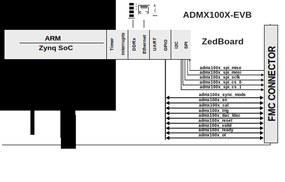

.. _admx100x_evb:

ADMX100X-EVB HDL project
===============================================================================

Overview
-------------------------------------------------------------------------------

The :adi:`EVAL-ADMX1001` and :adi:`EVAL-ADMX1002` modules are
ultra-low-distortion, low-noise signal generators. They support output
frequencies up to 40 kHz when the digital  pre-distortion (DPD) algorithm is
disabled, and up to 20 kHz with DPD enabled while maintaining a typical total
harmonic distortion (THD) of −130 dB at 1 kHz. The ADMX1001 includes a built-in
acquisition channel that enables simultaneous generation and capture of
differential signals, making it ideal for characterization and closed-loop
evaluation of high-performance ADCs, audio converters, and precision sensing
systems. The integrated DPD algorithm minimizes distortion typically introduced
by DAC and amplifier stages, enabling the generation of extremely clean test
signals for precision measurement applications. The ADMX1002 focuses solely on
high-fidelity signal generation, providing a streamlined solution for setups
where local signal acquisition is not required. Note that in the current HDL
release, only the TX path is implemented and supported.

Supported boards
-------------------------------------------------------------------------------

- :adi:`EVAL-ADMX1001`
- :adi:`EVAL-ADMX1002`

Supported devices
-------------------------------------------------------------------------------

- :adi:`AD5683R`

Supported carriers
-------------------------------------------------------------------------------

.. list-table::
   :widths: 35 35 30
   :header-rows: 1

   * - Evaluation board
     - Carrier
     - FMC slot
   * - EVAL-ADMX1001
     - `ZedBoard <https://digilent.com/shop/zedboard-zynq-7000-arm-fpga-soc-development-board>`__
     - FMC LPC
   * - EVAL-ADMX1002
     - `ZedBoard <https://digilent.com/shop/zedboard-zynq-7000-arm-fpga-soc-development-board>`__
     - FMC LPC

Block design
-------------------------------------------------------------------------------

.. warning::

    The VADJ for the Zedboard must be set to 3.3V.

Block diagram
~~~~~~~~~~~~~~~~~~~~~~~~~~~~~~~~~~~~~~~~~~~~~~~~~~~~~~~~~~~~~~~~~~~~~~~~~~~~~~~

The data path and clock domains are depicted in the below diagram:

SPI connections
~~~~~~~~~~~~~~~~~~~~~~~~~~~~~~~~~~~~~~~~~~~~~~~~~~~~~~~~~~~~~~~~~~~~~~~~~~~~~~~

.. list-table::
   :widths: 25 25 25 25
   :header-rows: 1

   * - SPI type
     - SPI manager instance
     - SPI subordinate
     - CS
   * - PS
     - SPI 0
     - CS_DAC
     - 0
   * - PS
     - SPI 0
     - CS_FPGA
     - 0

GPIOs
~~~~~~~~~~~~~~~~~~~~~~~~~~~~~~~~~~~~~~~~~~~~~~~~~~~~~~~~~~~~~~~~~~~~~~~~~~~~~~~

.. list-table::
   :widths: 25 25 25 25
   :header-rows: 2

   * - GPIO signal
     - Direction
     - HDL GPIO EMIO
     - Software GPIO
   * -
     - (from FPGA view)
     -
     - Zynq-7000
   * - ADMX100X_SYNC_MODE
     - OUT
     - 34
     - 88
   * - ADMX100X_EN
     - OUT
     - 35
     - 89
   * - ADMX100X_CAL
     - OUT
     - 38
     - 92
   * - ADMX100X_TRIG
     - OUT
     - 40
     - 94
   * - ADMX100X_DAC_LDAC
     - OUT
     - 39
     - 93
   * - ADMX100X_RESET
     - OUT
     - 33
     - 87
   * - ADMX100X_READY
     - IN
     - 36
     - 90
   * - ADMX100X_VALID
     - IN
     - 37
     - 91
   * - ADMX100X_OT
     - IN
     - 32
     - 86

Building the HDL project
-------------------------------------------------------------------------------

The design is built upon ADI's generic HDL reference design framework. ADI
distributes the bit/elf files of these projects as part of the :dokuwiki:`ADI
Kuiper Linux <resources/tools-software/linux-software/kuiper-linux>`. If you
want to build the sources, ADI makes them available on the :git-hdl:`HDL
repository </>`. To get the source you must `clone
<https://git-scm.com/book/en/v2/Git-Basics-Getting-a-Git-Repository>`__ the HDL
repository.

**Linux/Cygwin/WSL**

Building the ZedBoard project:

.. shell:: bash

   $cd hdl/projects/admx100xevb/zed
   $make

A more comprehensive build guide can be found in the :ref:`build_hdl` user guide.

Resources
-------------------------------------------------------------------------------

Hardware related
~~~~~~~~~~~~~~~~~~~~~~~~~~~~~~~~~~~~~~~~~~~~~~~~~~~~~~~~~~~~~~~~~~~~~~~~~~~~~~~

- Product datasheets:

  - :adi:`AD5683R`

HDL related
~~~~~~~~~~~~~~~~~~~~~~~~~~~~~~~~~~~~~~~~~~~~~~~~~~~~~~~~~~~~~~~~~~~~~~~~~~~~~~~

- :git-hdl:`ADMX100X-EVB HDL project source code <projects/admx100x_evb>`

.. list-table::
   :widths: 30 35 35
   :header-rows: 1

   * - IP name
     - Source code link
     - Documentation link
   * - AXI_CLKGEN
     - :git-hdl:`library/axi_clkgen`
     - :ref:`axi_clkgen`
   * - AXI_DMAC
     - :git-hdl:`library/axi_dmac`
     - :ref:`axi_dmac`
   * - AXI_HDMI_TX
     - :git-hdl:`library/axi_hdmi_tx`
     - :ref:`axi_hdmi_tx`
   * - AXI_I2S_ADI
     - :git-hdl:`library/axi_i2s_adi`
     - ---
   * - AXI_SPDIF_TX
     - :git-hdl:`library/axi_spdif_tx`
     - ---
   * - AXI_SYSID
     - :git-hdl:`library/axi_sysid`
     - :ref:`axi_sysid`
   * - SYSID_ROM
     - :git-hdl:`library/sysid_rom`
     - :ref:`axi_sysid`
   * - UTIL_I2C_MIXER
     - :git-hdl:`library/util_i2c_mixer`
     - ---

.. include:: ../common/more_information.rst

.. include:: ../common/support.rst
