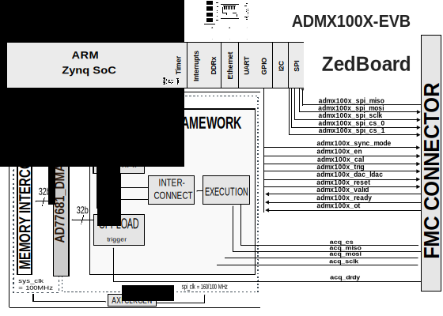

.. _admx100x_evb:

ADMX100X-EVB HDL project
===============================================================================

Overview
-------------------------------------------------------------------------------

The :adi:`EVAL-ADMX1001` and :adi:`EVAL-ADMX1002` modules are
ultra-low-distortion, low-noise signal generators. They support output
frequencies up to 40 kHz when the digital  pre-distortion (DPD) algorithm is
disabled, and up to 20 kHz with DPD enabled while maintaining a typical total
harmonic distortion (THD) of −130 dB at 1 kHz. The ADMX1001 includes a built-in
acquisition channel that enables simultaneous generation and capture of
differential signals, making it ideal for characterization and closed-loop
evaluation of high-performance ADCs, audio converters, and precision sensing
systems. The integrated DPD algorithm minimizes distortion typically introduced
by DAC and amplifier stages, enabling the generation of extremely clean test
signals for precision measurement applications. The ADMX1002 focuses solely on
high-fidelity signal generation, providing a streamlined solution for setups
where local signal acquisition is not required.

The HDL reference design implements both the TX signal generation path and the
RX acquisition path. The RX path uses an :adi:`ADAQ7768-1` precision ADC,
enabling simultaneous signal generation and capture on the ADMX1001.

This project has a :ref:`SPI Engine <spi_engine>` instance to control and
acquire data from the :adi:`ADAQ7768-1` 24-bit precision ADC. This instance
provides support for capturing continuous samples at the maximum sample rate
of 256 kSPS.

Supported boards
-------------------------------------------------------------------------------

- :adi:`EVAL-ADMX1001`
- :adi:`EVAL-ADMX1002`

Supported devices
-------------------------------------------------------------------------------

- :adi:`AD5683R`
- :adi:`ADAQ7768-1`

Supported carriers
-------------------------------------------------------------------------------

.. list-table::
   :widths: 35 35 30
   :header-rows: 1

   * - Evaluation board
     - Carrier
     - FMC slot
   * - EVAL-ADMX1001
     - `ZedBoard <https://digilent.com/shop/zedboard-zynq-7000-arm-fpga-soc-development-board>`__
     - FMC LPC
   * - EVAL-ADMX1002
     - `ZedBoard <https://digilent.com/shop/zedboard-zynq-7000-arm-fpga-soc-development-board>`__
     - FMC LPC

Block design
-------------------------------------------------------------------------------

The reference design uses the :ref:`SPI Engine Framework <spi_engine>` to
interface with the :adi:`ADAQ7768-1` precision ADC on the RX acquisition path.
The :ref:`SPI Engine Offload module <spi_engine offload>` is used to capture
continuous samples at the maximum sample rate of 256 kSPS, triggered by the
DRDY (data ready) signal of the :adi:`ADAQ7768-1`.

.. warning::

    The VADJ for the Zedboard must be set to 3.3V.

Block diagram
~~~~~~~~~~~~~~~~~~~~~~~~~~~~~~~~~~~~~~~~~~~~~~~~~~~~~~~~~~~~~~~~~~~~~~~~~~~~~~~

The data path and clock domains are depicted in the below diagram:

SPI connections
~~~~~~~~~~~~~~~~~~~~~~~~~~~~~~~~~~~~~~~~~~~~~~~~~~~~~~~~~~~~~~~~~~~~~~~~~~~~~~~

.. list-table::
   :widths: 25 25 25 25
   :header-rows: 1

   * - SPI type
     - SPI manager instance
     - SPI subordinate
     - CS
   * - PS
     - SPI 0
     - CS_FPGA
     - 0
   * - PS
     - SPI 0
     - CS_DAC
     - 1
   * - PL
     - axi_spi_engine
     - ADAQ7768-1
     - 0

GPIOs
~~~~~~~~~~~~~~~~~~~~~~~~~~~~~~~~~~~~~~~~~~~~~~~~~~~~~~~~~~~~~~~~~~~~~~~~~~~~~~~

The Software GPIO number is calculated as follows:

- Zynq-7000: if PS7 is used, then offset is 54

.. list-table::
   :widths: 25 25 25 25
   :header-rows: 2

   * - GPIO signal
     - Direction
     - HDL GPIO EMIO
     - Software GPIO
   * -
     - (from FPGA view)
     -
     - Zynq-7000
   * - ACQ_DRDY
     - IN
     - 43
     - 97
   * - ACQ_RESET
     - OUT
     - 42
     - 96
   * - ACQ_SYNQ_IN_FMC
     - OUT
     - 41
     - 95
   * - ADMX100X_TRIG
     - IN
     - 40
     - 94
   * - ADMX100X_DAC_LDAC
     - OUT
     - 39
     - 93
   * - ADMX100X_CAL
     - IN
     - 38
     - 92
   * - ADMX100X_VALID
     - OUT
     - 37
     - 91
   * - ADMX100X_READY
     - OUT
     - 36
     - 90
   * - ADMX100X_EN
     - OUT
     - 35
     - 89
   * - ADMX100X_SYNC_MODE
     - IN
     - 34
     - 88
   * - ADMX100X_RESET
     - OUT
     - 33
     - 87
   * - ADMX100X_OT
     - OUT
     - 32
     - 86

CPU/Memory interconnects addresses
~~~~~~~~~~~~~~~~~~~~~~~~~~~~~~~~~~~~~~~~~~~~~~~~~~~~~~~~~~~~~~~~~~~~~~~~~~~~~~~

The addresses are dependent on the architecture of the FPGA, having an offset
added to the base address from HDL(see more at :ref:`architecture cpu-intercon-addr`).

========================  ===========
Instance                  Zynq
========================  ===========
spi_adaq77681_axi_regmap  0x44A0_0000
axi_adaq77681_dma         0x44A3_0000
spi_clkgen                0x44A7_0000
========================  ===========

Interrupts
~~~~~~~~~~~~~~~~~~~~~~~~~~~~~~~~~~~~~~~~~~~~~~~~~~~~~~~~~~~~~~~~~~~~~~~~~~~~~~~

Below are the Programmable Logic interrupts used in this project.

=================== === ========== ===========
Instance name       HDL Linux Zynq Actual Zynq
=================== === ========== ===========
axi_adaq77681_dma   13  57         89
spi_adaq77681       12  56         88
=================== === ========== ===========

Building the HDL project
-------------------------------------------------------------------------------

The design is built upon ADI's generic HDL reference design framework. ADI
distributes the bit/elf files of these projects as part of the :dokuwiki:`ADI
Kuiper Linux <resources/tools-software/linux-software/kuiper-linux>`. If you
want to build the sources, ADI makes them available on the :git-hdl:`HDL
repository </>`. To get the source you must `clone
<https://git-scm.com/book/en/v2/Git-Basics-Getting-a-Git-Repository>`__ the HDL
repository.

**Linux/Cygwin/WSL**

Building the ZedBoard project:

.. shell:: bash

   $cd hdl/projects/admx100xevb/zed
   $make

A more comprehensive build guide can be found in the :ref:`build_hdl` user guide.

Resources
-------------------------------------------------------------------------------

Hardware related
~~~~~~~~~~~~~~~~~~~~~~~~~~~~~~~~~~~~~~~~~~~~~~~~~~~~~~~~~~~~~~~~~~~~~~~~~~~~~~~

- Product datasheets:

  - :adi:`AD5683R`
  - :adi:`ADAQ7768-1`

HDL related
~~~~~~~~~~~~~~~~~~~~~~~~~~~~~~~~~~~~~~~~~~~~~~~~~~~~~~~~~~~~~~~~~~~~~~~~~~~~~~~

- :git-hdl:`ADMX100X-EVB HDL project source code <projects/admx100x_evb>`

.. list-table::
   :widths: 30 35 35
   :header-rows: 1

   * - IP name
     - Source code link
     - Documentation link
   * - AXI_CLKGEN
     - :git-hdl:`library/axi_clkgen`
     - :ref:`axi_clkgen`
   * - AXI_DMAC
     - :git-hdl:`library/axi_dmac`
     - :ref:`axi_dmac`
   * - AXI_SPI_ENGINE
     - :git-hdl:`library/spi_engine/axi_spi_engine`
     - :ref:`spi_engine axi`
   * - SPI_ENGINE_EXECUTION
     - :git-hdl:`library/spi_engine/spi_engine_execution`
     - :ref:`spi_engine execution`
   * - SPI_ENGINE_INTERCONNECT
     - :git-hdl:`library/spi_engine/spi_engine_interconnect`
     - :ref:`spi_engine interconnect`
   * - SPI_ENGINE_OFFLOAD
     - :git-hdl:`library/spi_engine/spi_engine_offload`
     - :ref:`spi_engine offload`
   * - AXI_HDMI_TX
     - :git-hdl:`library/axi_hdmi_tx`
     - :ref:`axi_hdmi_tx`
   * - AXI_I2S_ADI
     - :git-hdl:`library/axi_i2s_adi`
     - ---
   * - AXI_SPDIF_TX
     - :git-hdl:`library/axi_spdif_tx`
     - ---
   * - AXI_SYSID
     - :git-hdl:`library/axi_sysid`
     - :ref:`axi_sysid`
   * - SYSID_ROM
     - :git-hdl:`library/sysid_rom`
     - :ref:`axi_sysid`
   * - UTIL_I2C_MIXER
     - :git-hdl:`library/util_i2c_mixer`
     - ---

- :ref:`SPI Engine Framework documentation <spi_engine>`

.. include:: ../common/more_information.rst

.. include:: ../common/support.rst
