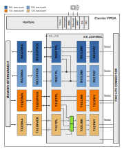

.. _adrv9001:

ADRV9001 HDL Project
===============================================================================

Overview
-------------------------------------------------------------------------------

This design allows controlling, receiving and transmitting sample stream
from/to an ADRV9001/ADRV9002 device through two independent source-synchronous
interface.
Supports both CMOS and LVDS interface, but not at the same time.
The selection of the I/O standard must be done by setting a parameter before
building the project.

The design supports SDR or DDR modes in CMOS mode with 1 or 4 lanes, and
in LVDS mode with 1 or 2 lanes. This is runtime configurable..
The complete list of supported modes can be consulted in the
:ref:`axi_adrv9001` Interface Core documentation.

Supported boards
-------------------------------------------------------------------------------

- :adi:`ADRV9002NP/W1/PCBZ <EVAL-ADRV9002>`
- :adi:`ADRV9002NP/W2/PCBZ <EVAL-ADRV9002>`

Supported devices
-------------------------------------------------------------------------------

- :adi:`ADRV9002`, in :adi:`ADRV9002NP/W2/PCBZ <EVAL-ADRV9002>`,

Supported carriers
-------------------------------------------------------------------------------

.. list-table::
   :widths: 35 35 30
   :header-rows: 1

   * - Evaluation board
     - Carrier
     - FMC slot
   * - ADRV9002
     - :xilinx:`ZC706`
     - FMC LPC
   * -
     - :xilinx:`ZCU102`
     - FMC HPC0
   * -
     - `ZedBoard <https://digilent.com/shop/zedboard-zynq-7000-arm-fpga-soc-development-board>`__
     - FMC LPC
   * -
     - :intel:`A10SoC <content/www/us/en/products/details/fpga/development-kits/arria/10-sx.html>`
     - FMC HPCA

Block design
-------------------------------------------------------------------------------

In the **receive** direction, each component of the delineated data is passed
to a PN monitor. The monitor validates the digital interface signal capture
and timing. The data then optionally DC-filtered, corrected for I/Q offset and
phase mismatches and is written to the DDR memory via DMA.

In the **transmit** direction, complex I and Q signals are generated for each
RF channel. The digital source could either be an internal DDS or from the DDR
via VDMA. The internal DDS phase and frequency are programmable.

Block diagram
~~~~~~~~~~~~~~~~~~~~~~~~~~~~~~~~~~~~~~~~~~~~~~~~~~~~~~~~~~~~~~~~~~~~~~~~~~~~~~~

The data path and clock domains are depicted in the below diagram.

Configuration modes
~~~~~~~~~~~~~~~~~~~~~~~~~~~~~~~~~~~~~~~~~~~~~~~~~~~~~~~~~~~~~~~~~~~~~~~~~~~~~~~

The :git-hdl:`AXI ADRV9001 IP <library/axi_adrv9001>` in this HDL project is
configured to work in LVDS and CMOS interface; it supports two configuration
modes:

- 2R2T - 2x Rx and 2x Tx independent control and DMAs for the two RF channels
- 1R1T - 1x Rx and 1x Tx common control and DMAs for the two RF channels also
  noted as R1_MODE

For any mode the number of RF channels(two) doesn't change only the controlling
instance and the DMAs.

The design has two receive paths and two transmit paths.
One of the receive paths (Rx12) has four channels and the other (Rx2) two
channels. These only work independently, not concomitantly.
One must chose between two active paths (2R2T), or just the Rx12 (1R1T) path,
which has four active channels, while Rx2 is disabled.
The same applies to the transmit path but in the other direction.

When only the Rx12 path is active with four channels mode, the core will take
ownership of both source synchronous interfaces. The requirement in this case
is that both interfaces run at the same rate.

Regarding the INDEPENDENT_1R1T_SUPPORT and COMMON_2R2T_SUPPORT parameters,
related to the above modes, their purpose is to remove the unused data paths,
reducing in this way the resource utilisation. By default all modes/paths are
available.

For more info see the parameter section of :ref:`axi_adrv9001`.

Clock scheme
~~~~~~~~~~~~~~~~~~~~~~~~~~~~~~~~~~~~~~~~~~~~~~~~~~~~~~~~~~~~~~~~~~~~~~~~~~~~~~~

The clocks are managed by the device and are software programmable. Please
refer to the device datasheet for the various clocks within the device.

The board provides a 38.4MHz crystal for the :adi:`ADRV9002`. It can also use
an external reference clock.

CPU/Memory interconnects addresses
~~~~~~~~~~~~~~~~~~~~~~~~~~~~~~~~~~~~~~~~~~~~~~~~~~~~~~~~~~~~~~~~~~~~~~~~~~~~~~~

The addresses are dependent on the architecture of the FPGA, having an offset
added to the base address from HDL (see more at :ref:`architecture cpu-intercon-addr`).

**AMD**

==================== =============== ============
Instance             Zynq/Microblaze ZynqMP
==================== =============== ============
axi_adrv9001         0x44A0_0000     0x84A00_0000
axi_adrv9001_rx1_dma 0x44A3_0000     0x84A30_0000
axi_adrv9001_rx2_dma 0x44A4_0000     0x84A40_0000
axi_adrv9001_tx1_dma 0x44A5_0000     0x84A50_0000
axi_adrv9001_tx2_dma 0x44A6_0000     0x84A60_0000
==================== =============== ============

**Intel**

==================   ===========
Instance             HPS
==================   ===========
axi_adrv9001         0x0002_0000
axi_adc_dma          0x0004_0000
axi_adc_dma2         0x0004_1000
axi_dac_dma          0x0004_4000
axi_dac_dma2         0x0004_5000
avl_adrv9001_gpio    0x0006_0000
==================   ===========

SPI connections
~~~~~~~~~~~~~~~~~~~~~~~~~~~~~~~~~~~~~~~~~~~~~~~~~~~~~~~~~~~~~~~~~~~~~~~~~~~~~~~

The SPI signals are controlled by a separate AXI based SPI core.

.. list-table::
   :widths: 25 25 25 25
   :header-rows: 1

   * - SPI type
     - SPI manager instance
     - SPI subordinate
     - CS
   * - PS
     - SPI 0
     - ADRV9002
     - 0

GPIOs
~~~~~~~~~~~~~~~~~~~~~~~~~~~~~~~~~~~~~~~~~~~~~~~~~~~~~~~~~~~~~~~~~~~~~~~~~~~~~~~

The device control and monitor signals are interfaced to a GPIO module.

====================== ================ ============== ==============
GPIO signal            Direction        HDL EMIOGPIO   Software GPIO
                       (from FPGA view)                Zynq MP
====================== ================ ============== ==============
tdd_sync_loc           OUT              56             134
vadj_err               IN               55             133
mssi_sync              INTERNAL         54             132
gpio_tx2_enable_in     OUT              51             129
gpio_tx1_enable_in     OUT              50             128
gpio_rx2_enable_in     OUT              49             127
gpio_rx1_enable_in     OUT              48             126
sm_fan_tach            INOUT            47             125
reset_trx              INOUT            46             124
mode                   INOUT            45             123
gp_int                 INOUT            44             122
dgpio_11               INOUT            43             121
dgpio_10               INOUT            42             120
dgpio_9                INOUT            41             119
dgpio_8                INOUT            40             118
dgpio_7                INOUT            39             117
dgpio_6                INOUT            38             116
dgpio_5                INOUT            37             115
dgpio_4                INOUT            36             114
dgpio_3                INOUT            35             113
dgpio_2                INOUT            34             112
dgpio_1                INOUT            33             111
dgpio_0                INOUT            32             110
====================== ================ ============== ==============

Interrupts
~~~~~~~~~~~~~~~~~~~~~~~~~~~~~~~~~~~~~~~~~~~~~~~~~~~~~~~~~~~~~~~~~~~~~~~~~~~~~~~

Below are the Programmable Logic interrupts used in the project.

=================== === ========== ============
Instance name       HDL Linux Zynq Linux ZynqMP
=================== === ========== ============
axi_ad9361_adc_dma  13  57         109
axi_ad9361_dac_dma  12  56         108
axi_ad9361_dac_dma  10  54         106
axi_ad9361_dac_dma  9   53         105
=================== === ========== ============

Building the HDL project
-------------------------------------------------------------------------------

The design is built upon ADI's generic HDL reference design framework.
ADI distributes the bit/elf files of these projects as part of the
:dokuwiki:`ADI Kuiper Linux <resources/tools-software/linux-software/kuiper-linux>`.
If you want to build the sources, ADI makes them available on the
:git-hdl:`HDL repository </>`. To get the source you must
`clone <https://git-scm.com/book/en/v2/Git-Basics-Getting-a-Git-Repository>`__
the HDL repository.

**Linux/Cygwin/WSL**

.. shell::

   $cd hdl/projects/adrv9001/zcu102
   $make

A more comprehensive build guide can be found in the :ref:`build_hdl` user guide.

Resources
-------------------------------------------------------------------------------

Systems related
~~~~~~~~~~~~~~~~~~~~~~~~~~~~~~~~~~~~~~~~~~~~~~~~~~~~~~~~~~~~~~~~~~~~~~~~~~~~~~~

Here you can find the quick start guides available for these evaluation boards:

- :dokuwiki:`[Wiki] ADRV9001/2 Quick Start Guides <resources/eval/user-guides/adrv9002/quickstart>`

  - :dokuwiki:`Zed <resources/eval/user-guides/adrv9002/quickstart/zed>`
  - :dokuwiki:`ZC706 <resources/eval/user-guides/adrv9002/quickstart/zynq>`
  - :dokuwiki:`ZCU102 <resources/eval/user-guides/adrv9002/quickstart/zynqmp>`
  - :dokuwiki:`A10SoC <resources/eval/user-guides/adrv9002/quickstart/a10soc>`

Other useful information:

- :dokuwiki:`[Wiki] ADRV9001/2 User Guide <resources/eval/user-guides/adrv9001>`

HDL related
~~~~~~~~~~~~~~~~~~~~~~~~~~~~~~~~~~~~~~~~~~~~~~~~~~~~~~~~~~~~~~~~~~~~~~~~~~~~~~~

- :git-hdl:`ADRV9001 HDL project source code <projects/adrv9001>`

.. list-table::
   :widths: 30 35 35
   :header-rows: 1

   * - IP name
     - Source code link
     - Documentation link
   * - AXI_ADRV9001
     - :git-hdl:`library/axi_adrv9001`
     - :ref:`axi_adrv9001`
   * - AXI_DMAC
     - :git-hdl:`library/axi_dmac`
     - :ref:`axi_dmac`
   * - AXI_SYSID
     - :git-hdl:`library/axi_sysid`
     - :ref:`axi_sysid`
   * - SYSID_ROM
     - :git-hdl:`library/sysid_rom`
     - :ref:`axi_sysid`
   * - UTIL_CPACK2
     - :git-hdl:`library/util_pack/util_cpack2`
     - :ref:`util_cpack2`
   * - UTIL_UPACK2
     - :git-hdl:`library/util_pack/util_upack2`
     - :ref:`util_upack2`
   * - UTIL_TDD_SYNC
     - :git-hdl:`library/util_tdd_sync`
     - ---

Software related
~~~~~~~~~~~~~~~~~~~~~~~~~~~~~~~~~~~~~~~~~~~~~~~~~~~~~~~~~~~~~~~~~~~~~~~~~~~~~~~

- :dokuwiki:`[Wiki] ADRV9002 Device Driver Customization <resources/tools-software/linux-drivers/iio-transceiver/adrv9002-customization>`
- :dokuwiki:`[Wiki] ADRV9002 Integrated Dual RF Transceiver Linux device driver <resources/tools-software/linux-drivers/iio-transceiver/adrv9002>`
- :dokuwiki:`[Wiki] ADRV9002 No-OS System Level Design <resources/eval/user-guides/adrv9002/no-os-setup>`

.. collapsible:: Click here to see the list of Linux device trees available.

   - :git-linux:`adrv9002 ZedBoard Linux device tree <arch/arm/boot/dts/xilinx/zynq-zed-adv7511-adrv9002.dts>`
   - :git-linux:`adrv9002 ZedBoard Linux device 2rx2tx tree <arch/arm/boot/dts/xilinx/zynq-zed-adv7511-adrv9002-rx2tx2.dts>`
   - :git-linux:`adrv9002 ZC706 Linux device tree  <arch/arm/boot/dts/xilinx/zynq-zc706-adv7511-adrv9002.dts>`
   - :git-linux:`adrv9002 ZC706 Linux device 2rx2tx tree <arch/arm/boot/dts/xilinx/zynq-zc706-adv7511-adrv9002-rx2tx2.dts>`
   - :git-linux:`adrv9002 ZCU102 (rev10) Linux device tree <arch/arm64/boot/dts/xilinx/zynqmp-zcu102-rev10-adrv9002.dts>`
   - :git-linux:`adrv9002 ZCU102 (rev10) Linux device 2rx2tx tree <arch/arm64/boot/dts/xilinx/zynqmp-zcu102-rev10-adrv9002-rx2tx2.dts>`
   - :git-linux:`adrv9002 A10SoC Linux device tree <arch/arm/boot/dts/intel/socfpga/socfpga_arria10_socdk_adrv9002.dts>`
   - :git-linux:`adrv9002 A10SoC Linux device 2rx2tx tree <arch/arm/boot/dts/intel/socfpga/socfpga_arria10_socdk_adrv9002_rx2tx2.dts>`

.. include:: ../common/more_information.rst

.. include:: ../common/support.rst
