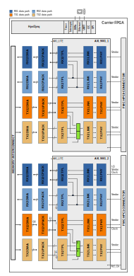

.. _adrv9001_dual:

ADRV9001-DUAL HDL Project
===============================================================================

Overview
-------------------------------------------------------------------------------

This design allows controlling, receiving and transmitting sample stream
from/to two ADRV9001/ADRV9002 devices(2x eval b) through four independent source
synchronous interfaces for each direction and for each device.
Supports both CMOS and LVDS interface, but not in the same time.
The selection of the I/O standard must be done with a parameter during build.

The design supports SDR or DDR modes in CMOS mode with one of four lanes, as
in LVDS mode one or two lane mode. This is runtime selectable.
The complete list of supported modes can be consulted in the
:ref:`axi_adrv9001` Interface Core documentation.

Supported boards
-------------------------------------------------------------------------------

- :adi:`ADRV9002NP/W1/PCBZ <EVAL-ADRV9002>`
- :adi:`ADRV9002NP/W2/PCBZ <EVAL-ADRV9002>`

Supported devices
-------------------------------------------------------------------------------

- :adi:`ADRV9002`, in :adi:`ADRV9002NP/W2/PCBZ <EVAL-ADRV9002>`

Supported carriers
-------------------------------------------------------------------------------

.. list-table::
   :widths: 35 35 30
   :header-rows: 1

   * - Evaluation board
     - Carrier
     - FMC slot
   * - 2x ADRV9002
     - :xilinx:`ZCU102`
     - FMC HPC0 FMC HPC1

Block design
-------------------------------------------------------------------------------

In the **receive** direction, each component of the delineated data is passed
to a PN monitor. The monitors validates the digital interface signal capture
and timing. The data then optionally DC-filtered, corrected for I/Q offset and
phase mismatches and is written to the DDR memory via DMA.

In the **transmit** direction, complex I and Q signals are generated for each
RF channel. The digital source could either be an internal DDS or from the DDR
via VDMA. The internal DDS phase and frequency are programmable.

Block diagram
~~~~~~~~~~~~~~~~~~~~~~~~~~~~~~~~~~~~~~~~~~~~~~~~~~~~~~~~~~~~~~~~~~~~~~~~~~~~~~~

The data path and clock domains are depicted in the below diagram.

Configuration modes
~~~~~~~~~~~~~~~~~~~~~~~~~~~~~~~~~~~~~~~~~~~~~~~~~~~~~~~~~~~~~~~~~~~~~~~~~~~~~~~

The :git-hdl:`AXI ADRV9001 IP <library/axi_adrv9001>` in this HDL project is
configured to work in LVDS and CMOS interface; it supports two configuration
modes:

- 2R2T - 2x RX and 2x TX independent control and DMAs for the two RF channels
- 1R1T - 1x RX and 1x TX common control and DMAs for the two RF channels also
  noted as R1_MODE

For any mode, the number of RF channels (two) doesn't change --- only the
controlling instance and the DMAs do.

The design has four receive paths and four transmit paths.

Two of the receive paths (RX12) have four channels and the other (RX2) two
channels. These only work independently, not concomitantly.

One must choose between two active paths (2R2T), or just the RX12 (1R1T) path,
which has four active channels, while RX2 is disabled.

The same applies to the transmit path, but in the other direction.

When only the RX12 path is active with four channels mode, the axi_adrv9001
core will take ownership of both of its source-synchronous interfaces.
The requirement in this case is that both interfaces, of an axi_adrv9001 core,
run at the same rate.

Regarding the ``INDEPENDENT_1R1T_SUPPORT`` and ``COMMON_2R2T_SUPPORT`` parameters
related to the above modes, their purpose is to remove the unused data paths,
reducing in this way the resource utilisation. By default all modes/paths are
available.

For more info, see the Parameter Description section of :ref:`axi_adrv9001`.

Clock scheme
~~~~~~~~~~~~~~~~~~~~~~~~~~~~~~~~~~~~~~~~~~~~~~~~~~~~~~~~~~~~~~~~~~~~~~~~~~~~~~~

The clocks are managed by the :adi:`ADRV9002` devices and are software-programmable.
Please refer to the device data sheet for the various clocks within the device.

Independently, a board provides a 38.4MHz crystal for the :adi:`ADRV9002`.
An external reference clock can also be used.

CPU/Memory interconnects addresses
~~~~~~~~~~~~~~~~~~~~~~~~~~~~~~~~~~~~~~~~~~~~~~~~~~~~~~~~~~~~~~~~~~~~~~~~~~~~~~~

====================== ============
Instance               ZynqMP
====================== ============
axi_adrv9001_1         0x84A00_0000
axi_adrv9001_1_rx1_dma 0x84A30_0000
axi_adrv9001_1_rx2_dma 0x84A40_0000
axi_adrv9001_1_tx1_dma 0x84A50_0000
axi_adrv9001_1_tx2_dma 0x84A60_0000
axi_adrv9001_2         0x84A70_0000
axi_adrv9001_2_rx1_dma 0x84A80_0000
axi_adrv9001_2_rx2_dma 0x84A90_0000
axi_adrv9001_2_tx1_dma 0x84AA0_0000
axi_adrv9001_2_tx2_dma 0x84AB0_0000
====================== ============

SPI connections
~~~~~~~~~~~~~~~~~~~~~~~~~~~~~~~~~~~~~~~~~~~~~~~~~~~~~~~~~~~~~~~~~~~~~~~~~~~~~~~

The SPI signals are controlled by a separate AXI based SPI core.

.. list-table::
   :widths: 25 25 25 25
   :header-rows: 1

   * - SPI type
     - SPI manager instance
     - SPI subordinate
     - CS
   * - PS
     - SPI 0
     - ADRV9002_1
     - 0
   * - PS
     - SPI 1
     - ADRV9002_2
     - 0

GPIOs
~~~~~~~~~~~~~~~~~~~~~~~~~~~~~~~~~~~~~~~~~~~~~~~~~~~~~~~~~~~~~~~~~~~~~~~~~~~~~~~

The device control and monitor signals are interfaced to a GPIO module.

========================== ================ ============== ============== =====
GPIO signal                Direction        HDL EMIOGPIO   Software GPIO  FMC
                           (from FPGA view)                Zynq MP
========================== ================ ============== ============== =====
adrv1_gpio_tx2_enable_in   OUT              76             154            HPC0
adrv1_gpio_tx1_enable_in   OUT              75             153            HPC0
adrv1_gpio_rx2_enable_in   OUT              74             152            HPC0
adrv1_gpio_rx1_enable_in   OUT              73             151            HPC0
adrv1_sm_fan_tach,         INOUT            72             150            HPC0
adrv1_reset_trx,           INOUT            71             149            HPC0
adrv1_mode,                INOUT            70             148            HPC0
adrv1_gp_int,              INOUT            69             147            HPC0
adrv1_dgpio_11,            INOUT            68             146            HPC0
adrv1_dgpio_10,            INOUT            67             145            HPC0
adrv1_dgpio_9,             INOUT            66             144            HPC0
adrv1_dgpio_8,             INOUT            65             143            HPC0
adrv1_dgpio_7,             INOUT            64             142            HPC0
adrv1_dgpio_6,             INOUT            63             141            HPC0
adrv1_dgpio_5,             INOUT            62             140            HPC0
adrv1_dgpio_4,             INOUT            61             139            HPC0
adrv1_dgpio_3,             INOUT            60             138            HPC0
adrv1_dgpio_2,             INOUT            59             137            HPC0
adrv1_dgpio_1,             INOUT            58             136            HPC0
adrv1_dgpio_0              INOUT            57             135            HPC0
adrv1_tdd_sync_loc         INTERNAL         56             134            HPC1
adrv1_vadj_err             IN               55             133            HPC1
adrv1_mssi_sync            INTERNAL         54             132            HPC1
adrv1_gpio_tx2_enable_in   OUT              51             129            HPC1
adrv1_gpio_tx1_enable_in   OUT              50             128            HPC1
adrv1_gpio_rx2_enable_in   OUT              49             127            HPC1
adrv1_gpio_rx1_enable_in   OUT              48             126            HPC1
adrv1_sm_fan_tach          INOUT            47             125            HPC1
adrv1_reset_trx            INOUT            46             124            HPC1
adrv1_mode                 INOUT            45             123            HPC1
adrv1_gp_int               INOUT            44             122            HPC1
adrv1_dgpio_11             INOUT            43             121            HPC1
adrv1_dgpio_10             INOUT            42             120            HPC1
adrv1_dgpio_9              INOUT            41             119            HPC1
adrv1_dgpio_8              INOUT            40             118            HPC1
adrv1_dgpio_7              INOUT            39             117            HPC1
adrv1_dgpio_6              INOUT            38             116            HPC1
adrv1_dgpio_5              INOUT            37             115            HPC1
adrv1_dgpio_4              INOUT            36             114            HPC1
adrv1_dgpio_3              INOUT            35             113            HPC1
adrv1_dgpio_2              INOUT            34             112            HPC1
adrv1_dgpio_1              INOUT            33             111            HPC1
adrv1_dgpio_0              INOUT            32             110            HPC1
========================== ================ ============== ============== =====

Interrupts
~~~~~~~~~~~~~~~~~~~~~~~~~~~~~~~~~~~~~~~~~~~~~~~~~~~~~~~~~~~~~~~~~~~~~~~~~~~~~~~

Below are the Programmable Logic interrupts used in the project.

======================= === ============
Instance name           HDL Linux ZynqMP
======================= === ============
axi_adrv9001_1_rx1_dma  15  111
axi_adrv9001_1_rx2_dma  14  110
axi_adrv9001_1_tx1_dma  13  109
axi_adrv9001_1_tx2_dma  12  108
axi_adrv9001_2_rx1_dma  11  107
axi_adrv9001_2_rx2_dma  10  106
axi_adrv9001_2_tx1_dma  9   105
axi_adrv9001_2_tx2_dma  8   104
======================= === ============

Building the HDL project
-------------------------------------------------------------------------------

The design is built upon ADI's generic HDL reference design framework.
ADI distributes the bit/elf files of these projects as part of the
:dokuwiki:`ADI Kuiper Linux <resources/tools-software/linux-software/kuiper-linux>`.
If you want to build the sources, ADI makes them available on the
:git-hdl:`HDL repository </>`. To get the source you must
`clone <https://git-scm.com/book/en/v2/Git-Basics-Getting-a-Git-Repository>`__
the HDL repository.

This project has the following `make` parameters:

- CMOS_LVDS_N - selects the interface type
  - 0 = LVDS (default)
  - 1 = CMOS
- USE_RX_CLK_FOR_TX1 - selects the clock to drive the TX1 SSI interface
  - 0 = TX1 dedicated clock (default)
  - 1 = RX1 SSI clock
  - 2 = RX2 SSI clock
- USE_RX_CLK_FOR_TX2 - selects the clock to drive the TX2 SSI interface
  - 0 = TX2 dedicated clock (default)
  - 1 = RX1 SSI clock
  - 2 = RX2 SSI clock

**Linux/Cygwin/WSL**

Building the default configuration (LVDS):

.. shell:: bash

   $cd hdl/projects/adrv9001_dual/zcu102
   $make

Example configuration with CMOS:

.. shell:: bash

   ~/hdl/projects/adrv9001_dual/zcu102
   $make CMOS_LVDS_N=1

The result of the build, if parameters were used, will be in a folder named
by the configuration used ``CMOSLVDSN1``.

A more comprehensive build guide can be found in the :ref:`build_hdl` user guide.

Resources
-------------------------------------------------------------------------------

Systems related
~~~~~~~~~~~~~~~~~~~~~~~~~~~~~~~~~~~~~~~~~~~~~~~~~~~~~~~~~~~~~~~~~~~~~~~~~~~~~~~

- :dokuwiki:`[Wiki] ADRV9001/2 User Guide <resources/eval/user-guides/adrv9001>`

HDL related
~~~~~~~~~~~~~~~~~~~~~~~~~~~~~~~~~~~~~~~~~~~~~~~~~~~~~~~~~~~~~~~~~~~~~~~~~~~~~~~

- :git-hdl:`ADRV9001_DUAL HDL project source code <projects/adrv9001_dual>`

.. list-table::
   :widths: 30 35 35
   :header-rows: 1

   * - IP name
     - Source code link
     - Documentation link
   * - AXI_ADRV9001
     - :git-hdl:`library/axi_adrv9001`
     - :ref:`axi_adrv9001`
   * - AXI_DMAC
     - :git-hdl:`library/axi_dmac`
     - :ref:`axi_dmac`
   * - AXI_SYSID
     - :git-hdl:`library/axi_sysid`
     - :ref:`axi_sysid`
   * - SYSID_ROM
     - :git-hdl:`library/sysid_rom`
     - :ref:`axi_sysid`
   * - UTIL_CPACK2
     - :git-hdl:`library/util_pack/util_cpack2`
     - :ref:`util_cpack2`
   * - UTIL_UPACK2
     - :git-hdl:`library/util_pack/util_upack2`
     - :ref:`util_upack2`
   * - UTIL_TDD_SYNC
     - :git-hdl:`library/util_tdd_sync`
     - ---

Software related
~~~~~~~~~~~~~~~~~~~~~~~~~~~~~~~~~~~~~~~~~~~~~~~~~~~~~~~~~~~~~~~~~~~~~~~~~~~~~~~

- :dokuwiki:`[Wiki] ADRV9002 Device Driver Customization <resources/tools-software/linux-drivers/iio-transceiver/adrv9002-customization>`
- :dokuwiki:`[Wiki] ADRV9002 Integrated Dual RF Transceiver Linux device driver <resources/tools-software/linux-drivers/iio-transceiver/adrv9002>`

.. include:: ../common/more_information.rst

.. include:: ../common/support.rst
