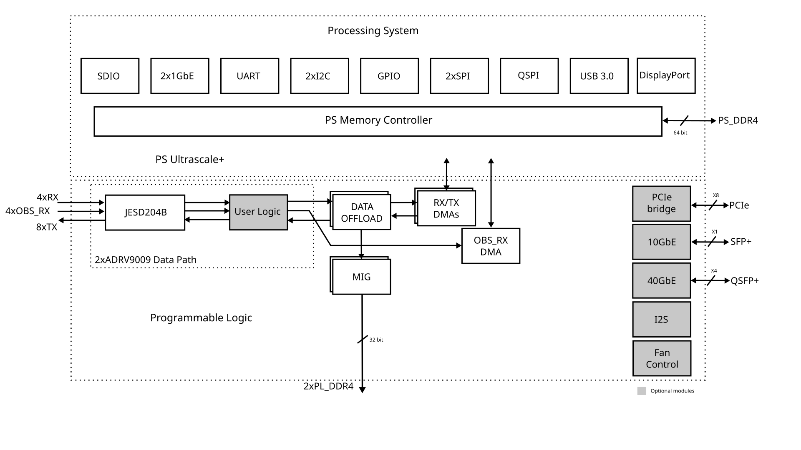
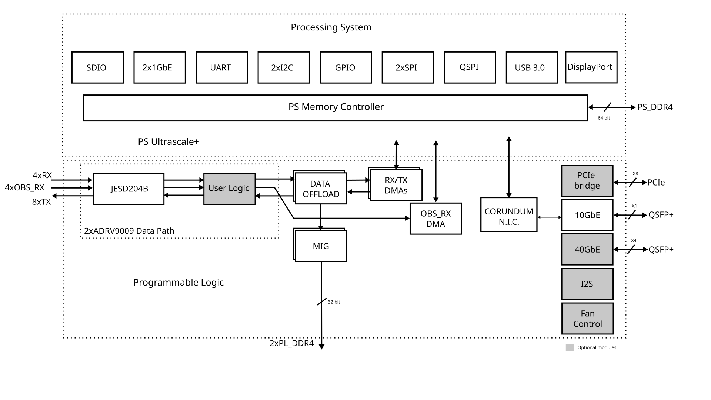
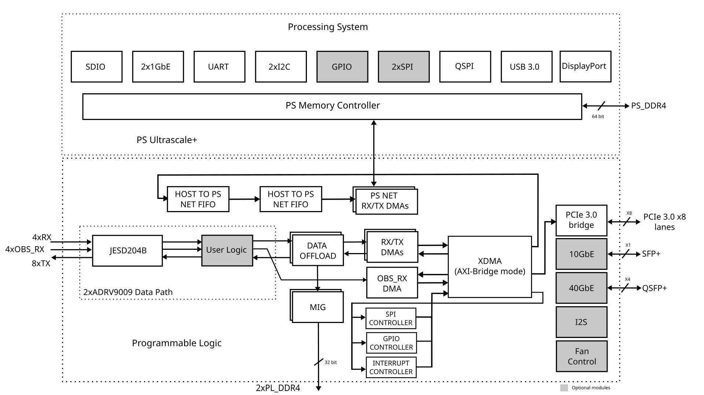
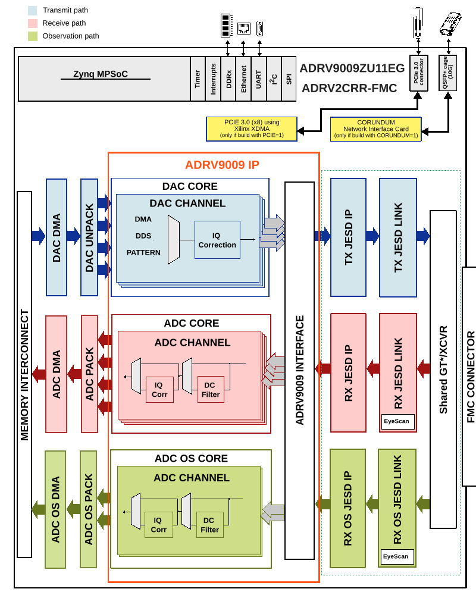

.. _adrv9009zu11eg:

ADRV9009ZU11EG HDL reference design
===============================================================================

The HDL reference design is built around the Zynq® Ultrascale+ four
Cortex™-A536 MPCore processors. A functional block diagram of the system is
shown below.

The PS8 provides a SDIO, UART, Ethernet, SPI, USB 3.0, QSPI and a Display Port
control modules.

The two ADRV9009's digital interface is handled by the JESD20B physical, data
link and transport layer IPs. The JESD204B lanes are shared among the
8 transmit, 4 receive and 4 observation/sniffer receive data paths by the same
set of transceivers within the IP. The cores are programmable through an
AXI-lite interface.

There are 2 PL DDR4 32 bit @1200MHz which can be used as OFFLOAD FIFOs in
the system.

There are additional transceiver lanes available that can be used to implement
PCIe Gen3 x8, 10Gb ethernet and 40Gb ethernet at the same time. On top of
those, another 10 transceiver lanes can be used to implement a full FMC HPC
connector, through which to extend the system with another two ADRV9009s.

Supported boards
-------------------------------------------------------------------------------

- :adi:`ADRV9009-ZU11EG RF-SOM <ADRV9009-ZU11EG>`

Supported carriers
-------------------------------------------------------------------------------

.. list-table::
   :widths: 35 35
   :header-rows: 1

   * - Evaluation board
     - Carrier
   * - :adi:`ADRV9009-ZU11EG RF-SOM <ADRV9009-ZU11EG>`
     - :adi:`ADRV2CRR-FMC`

Block design
-------------------------------------------------------------------------------

Block design - Corundum Network Interface Card integrated
~~~~~~~~~~~~~~~~~~~~~~~~~~~~~~~~~~~~~~~~~~~~~~~~~~~~~~~~~~~~~~~~~~~~~~~~~~~~~~~

This is available only if the project was build using the command
``make CORUNDUM=1``.

.. _pcie-block-design:

Block design - PCIe 3.0 x8 lanes using XDMA
~~~~~~~~~~~~~~~~~~~~~~~~~~~~~~~~~~~~~~~~~~~~~~~~~~~~~~~~~~~~~~~~~~~~~~~~~~~~~~~

This is available only if the project was build using the command
``make PCIE=1``.

Things which must be taken in consideration regarding this specific HDL design:

- The :adi:`ADRV9009-ZU11EG RF-SOM <ADRV9009-ZU11EG>` SoM supports max. PCIe 3.0
  and is enabled by the Xilinx
  `XDMA (DMA/Bridge Subsystem for PCI Express v4.2)
  <https://docs.amd.com/r/en-US/pg195-pcie-dma/Introduction>`__
  IP, implemented in the Programmable Logic (PL) of the FPGA
- The PCIe lanes are routed to the PL GTH transceivers (GT quads 224 and 225),
  not to the Zynq PS integrated PCIe block; the PS PCIe controller is not wired
  to the edge connector, which is why the link must be implemented in the PL
  through the XDMA IP
- Physically, the :adi:`ADRV2CRR-FMC` is needed, as it has the physical PCIe
  connector:

    - The 'PCIE PRSNT' jumper near the PCIe connector allows the selection of
      number of lanes: x1, x4 or x8 lanes
    - The project was tested only using the x8 lanes option and the XDMA IP
      configured properly for this setting

- The XDMA is configured in 'AXI Bridge' mode, meaning the XDMA IP doesn't use
  its internal DMA engines, it just acts as a PCIe transactions translation
  bridge between the FPGA and the host PC; below are other settings of the XDMA
  IP:

    - The XDMA acts as a PCIe endpoint, meaning the host PC is considered the
      PCIe root complex and the ADRV9009-ZU11EG/ADRV2CRR-FMC is regarded as a
      peripheral attached to the host PC
    - The PCIe interface is configured to have x8 lanes and support a maximum
      of 8.0 GT/s
    - The XDMA IP operates on a 100 MHz PCIe reference clock (sourced from the
      edge connector through an ``IBUFDS_GTE4`` buffer) and generates the
      250 MHz ``axi_aclk`` that clocks the entire PCIe AXI domain
    - MSI-X interrupts are enabled. A custom interrupt controller
      (:ref:`axi_pcie_intc`) aggregates the eleven peripheral interrupt lines
      (the three RF ``axi_dmac`` instances, the three JESD204 links, the two
      network-link ``axi_dmac`` instances, the SPI controller and the two GPIO
      controllers) onto the XDMA user interrupt request bus, so each source is
      delivered to the host as its own MSI-X vector and no Zynq PS interrupt
      line is consumed; the source-to-vector map is listed in the `Interrupts`_
      section below
    - The PCIe BARs are configured as follows:

        - BAR0 exposes the ``M_AXI_B`` (host → FPGA) window used to reach the
          peripheral register maps; it is 32 MB wide and maps to the AXI base
          address ``0x8400_0000`` (``pciebar2axibar_0 = 0x8400_0000``)
        - The ``S_AXI_B`` (FPGA → host) path is configured for 64-bit
          addressing (``axi_addr_width = 64``,
          ``axibar_highaddr_0 = 0x0000_000F_FFFF_FFFF``) so the ADI DMAs can
          reach host physical memory located above the 4 GB boundary; this is
          mandatory when the host IOMMU maps the DMA buffers to high addresses

- The base HDL design for ADRV9009-ZU11EG/ADRV2CRR-FMC suffered major changes:

  - The initial data path, which stored the samples coming from the JESD204 IPs
    in the Zynq PS DDR4 memory, is no longer present; the samples are streamed
    directly through the XDMA bridge (``S_AXI_B``) into the host PC's memory.
    The ADI ``axi_dmac`` instances act as the AXI masters and write/read the
    host buffers directly, after the host has programmed them over PCIe
  - In the previous design, all of the IPs were controlled by the Processing
    System (PS); in this design, their control was rerouted to the XDMA bridge,
    so they are configured by the host PC over PCIe. The peripherals moved onto
    the ``M_AXI_B`` (BAR0) bridge are: the three TPL cores (rx/tx/obs), the
    three JESD204 link layers (rx/tx/obs), the three transceiver (xcvr) cores
    (rx/tx/obs), the three ADI ``axi_dmac`` instances (rx/tx/obs), the SPI
    controller, the two GPIO controllers and the SYSID core
  - New IPs were introduced to allow the XDMA bridge to take on the control of
    the SPI, GPIO and interrupt signals (PL SPI controllers, GPIO controllers
    and a custom interrupt controller); the PS doesn't control these signals
    anymore
  - The two bridge ports are fanned out by AXI SmartConnects: one on the
    ``M_AXI_B`` side distributes the host register accesses to the peripheral
    IPs inside BAR0, and one on the ``S_AXI_B`` side aggregates the DMA master
    ports before they cross into host memory
  - The ADI ``axi_dmac`` instances are reconfigured for this data path:
    scatter-gather mode with 64-bit addressing is enabled and the memory-mapped
    data width is widened to 256 bits. At the 250 MHz PCIe AXI clock this yields
    8 GB/s of raw bandwidth per DMA channel, comfortably above the JESD204B
    sample-rate ceiling
  - A bidirectional network link between the host PC and the Zynq PS is carried
    over the same PCIe connection, using four ``axi_dmac`` instances and two
    asynchronous AXI-Stream FIFOs. It gives the host IP connectivity to the PS
    (SSH, remote IIO, firmware updates) without a separate Ethernet cable

Block diagram
~~~~~~~~~~~~~~~~~~~~~~~~~~~~~~~~~~~~~~~~~~~~~~~~~~~~~~~~~~~~~~~~~~~~~~~~~~~~~~~

The data path and clock domains are depicted in the below diagrams:

Example block design for Single link; M=8; L=8
^^^^^^^^^^^^^^^^^^^^^^^^^^^^^^^^^^^^^^^^^^^^^^^^^^^^^^^^^^^^^^^^^^^^^^^^^^^^^^^

The Rx links (ADC Path) operate with the following parameters:

- Rx Deframer parameters: L=4, M=8, F=4, S=1, NP=16, N=16
- Sample Rate: 245.76 MSPS
- Dual link: No
- RX_DEVICE_CLK: 245.76 MHz (Lane Rate/40)
- REF_CLK: 245.76 MHz (Lane Rate/40)
- JESD204B Lane Rate: 9.83 Gbps
- QPLL0 or CPLL

The ORx links (ADC Path) operate with the following parameters:

- ORx Deframer parameters: L=4, M=4, F=2, S=1, NP=16, N=16
- Sample Rate: 491.52 MSPS
- Dual link: No
- ORX_DEVICE_CLK: 245.76 MHz (Lane Rate/40)
- REF_CLK: 245.76 MHz (Lane Rate/40)
- JESD204B Lane Rate: 9.83 Gbps
- QPLL0 or CPLL

The Tx links (DAC Path) operate with the following parameters:

- Tx Framer parameters: L=8, M=8, F=4, S=1, NP=16, N=16
- Sample Rate: 491.52 MSPS
- Dual link: No
- TX_DEVICE_CLK: 245.76 MHz (Lane Rate/40)
- REF_CLK: 245.76 MHz (Lane Rate/40)
- JESD204B Lane Rate: 9.83 Gbps
- QPLL0 or CPLL

Digital Interface
~~~~~~~~~~~~~~~~~~~~~~~~~~~~~~~~~~~~~~~~~~~~~~~~~~~~~~~~~~~~~~~~~~~~~~~~~~~~~~~

The digital interface consists of 8 transmit, 4 receive and 4
observation/sniffer lanes running up to 9.8Gbps. The transceivers then
interface to the cores at 256bits @245.76MHz in the transmit and
128bits @245.76MHz for the receive and sniffer/observation rates. The data is
sent or received based on the configuration (programmable) from separate
transmit, receive and observation chains.

DAC Interface
~~~~~~~~~~~~~~~~~~~~~~~~~~~~~~~~~~~~~~~~~~~~~~~~~~~~~~~~~~~~~~~~~~~~~~~~~~~~~~~

The DAC data may be sourced from an internal data generator (DDS or pattern)
or from the external DDR via DMA. The internal DDS phase and frequency are
programmable. :git-hdl:`DAC unpack IP <library/util_pack/util_upack2>` allows
to a reduced number of channels, at a higher rate.

ADC Interface
~~~~~~~~~~~~~~~~~~~~~~~~~~~~~~~~~~~~~~~~~~~~~~~~~~~~~~~~~~~~~~~~~~~~~~~~~~~~~~~

The ADC data is sent to the DDR via DMA. The
:git-hdl:`ADC pack IP <library/util_pack/util_cpack2>` allows capturing only
part of the channels.

Control and SPI
~~~~~~~~~~~~~~~~~~~~~~~~~~~~~~~~~~~~~~~~~~~~~~~~~~~~~~~~~~~~~~~~~~~~~~~~~~~~~~~

The device control and monitor signals are interfaced to a GPIO module.
The SPI signals are controlled by a single PS8 SPI core.

Configuration modes
~~~~~~~~~~~~~~~~~~~~~~~~~~~~~~~~~~~~~~~~~~~~~~~~~~~~~~~~~~~~~~~~~~~~~~~~~~~~~~~

The block design supports configuration of parameters and scales.

We have listed a couple of examples at section
`Building the HDL project`_ and the default modes
for each project.

.. note::

   The parameters for Rx or Tx links can be changed from the
   **system_project.tcl** file, located in
   hdl/projects/adrv9009zu11eg/$CARRIER/system_project.tcl

.. math::
   Lane Rate = Sample Rate*\frac{M}{L}*N'* \frac{10}{8}

The following are the parameters of this project that can be configured:

- [RX/TX/RX_OS]_JESD_M: number of converters per link
- [RX/TX/RX_OS]_JESD_L: number of lanes per link
- [RX/TX/RX_OS]_JESD_S: number of samples per frame

CPU/Memory interconnects addresses
~~~~~~~~~~~~~~~~~~~~~~~~~~~~~~~~~~~~~~~~~~~~~~~~~~~~~~~~~~~~~~~~~~~~~~~~~~~~~~~

The addresses are dependent on the architecture of the FPGA, having an offset
added to the base address from HDL (see more at :ref:`architecture cpu-intercon-addr`).

========================= =========== ===========
Instance                  ZynqMP      XDMA*
========================= =========== ===========
rx_adrv9009_som_tpl_core  0x84A0_0000 0x84A0_0000
tx_adrv9009_som_tpl_core  0x84A0_4000 0x84A0_4000
obs_adrv9009_som_tpl_core 0x84A0_8000 0x84A0_8000
axi_adrv9009_som_rx_xcvr  0x84A4_0000 0x84A4_0000
axi_adrv9009_som_tx_xcvr  0x84A2_0000 0x84A2_0000
axi_adrv9009_som_obs_xcvr 0x84A6_0000 0x84A6_0000
axi_adrv9009_som_tx_jesd  0x84A3_0000 0x84A3_0000
axi_adrv9009_som_rx_jesd  0x84A5_0000 0x84A5_0000
axi_adrv9009_som_obs_jesd 0x84A7_0000 0x84A7_0000
axi_adrv9009_som_rx_dma   0x9C42_0000 0x84C1_0000
axi_adrv9009_som_tx_dma   0x9C40_0000 0x84C0_0000
axi_adrv9009_som_obs_dma  0x9C44_0000 0x84C2_0000
axi_sysid_0               0x8500_0000 0x8500_0000
========================= =========== ===========

In case of :adi:`ADRV2CRR-FMC`, additional interconnects may be present in
the system.

============================================ ===========
Instance                                     ZynqMP
============================================ ===========
corundum_hierarchy/corundum_core/s_axil_ctrl 0xA000_0000
axi_iic                                      0x4300_0000
axi_ps_net_tx_dma                            0x7c46_0000
axi_ps_net_rx_dma                            0x7c47_0000
pcie_intc*                                   0x8401_0000
axi_gpio1*                                   0x8402_0000
axi_gpio2*                                   0x8403_0000
axi_spi*                                     0x8404_0000
axi_host_net_tx_dma*                         0x84C3_0000
axi_host_net_rx_dma*                         0x84C4_0000
============================================ ===========

.. note::

  \* All the IPs are connected to the XDMA Bridge ``M_AXI_B`` port, via a
  SmartConnect IP. This is applicable if the project was build uisng ``make
  PCIE=1``, only for :adi:`ADRV2CRR-FMC` . For more details please check
  :ref:`pcie-block-design`.

SPI connections
~~~~~~~~~~~~~~~~~~~~~~~~~~~~~~~~~~~~~~~~~~~~~~~~~~~~~~~~~~~~~~~~~~~~~~~~~~~~~~~

.. list-table::
   :widths: 25 25 25 25
   :header-rows: 1

   * - SPI type
     - SPI manager instance
     - SPI subordinate
     - CS
   * - PS
     - spi0
     - ADRV9009-A
     - 0
   * -
     -
     - ADRV9009-B
     - 1
   * -
     -
     - HMC7044
     - 2
   * -
     -
     - HMC7044_CAR
     - 3

In case of :adi:`ADRV2CRR-FMC`, when PCIe is enabled, all of the SPI
subordinates listed above are controlled by an AXI SPI controller, which is
connected to the XDMA XDMA Bridge ``M_AXI_B`` port, via a SmartConnect IP. No
longer present on the MIO pins of the Processing System (PS).

GPIOs
~~~~~~~~~~~~~~~~~~~~~~~~~~~~~~~~~~~~~~~~~~~~~~~~~~~~~~~~~~~~~~~~~~~~~~~~~~~~~~~

.. list-table::
   :widths: 22 14 12 14 24
   :header-rows: 2

   * - GPIO signal
     - Direction
     - HDL GPIO EMIO
     - Software GPIO
     - Software GPIO
   * -
     - (from FPGA view)
     -
     - Zynq MP (PS)
     - XDMA*
   * - gpio_4_exp_n
     - INOUT
     - 92
     - 170
     - (axi_gpio2) 28
   * - gpio_3_exp_n
     - INOUT
     - 91
     - 169
     - (axi_gpio2) 27
   * - gpio_3_exp_p
     - INOUT
     - 90
     - 168
     - (axi_gpio2) 26
   * - hmc7044_gpio_4
     - INOUT
     - 89
     - 167
     - (axi_gpio2) 25
   * - hmc7044_gpio_3
     - INOUT
     - 88
     - 166
     - (axi_gpio2) 24
   * - hmc7044_gpio_1
     - INOUT
     - 87
     - 165
     - (axi_gpio2) 23
   * - hmc7044_gpio_2
     - INOUT
     - 86
     - 164
     - (axi_gpio2) 22
   * - hmc7044_sync
     - INOUT
     - 85
     - 163
     - (axi_gpio2) 21
   * - hmc7044_reset
     - INOUT
     - 84
     - 162
     - (axi_gpio2) 20
   * - adrv9009_tx2_enable_b
     - INOUT
     - 83
     - 161
     - (axi_gpio2) 19
   * - adrv9009_tx1_enable_b
     - INOUT
     - 82
     - 160
     - (axi_gpio2) 18
   * - adrv9009_rx2_enable_b
     - INOUT
     - 81
     - 159
     - (axi_gpio2) 17
   * - adrv9009_rx1_enable_b
     - INOUT
     - 80
     - 158
     - (axi_gpio2) 16
   * - adrv9009_test_b
     - INOUT
     - 79
     - 157
     - (axi_gpio2) 15
   * - adrv9009_reset_b_b
     - INOUT
     - 78
     - 156
     - (axi_gpio2) 14
   * - adrv9009_gpint_b
     - INOUT
     - 77
     - 155
     - (axi_gpio2) 13
   * - adrv9009_gpio_{18:00}_b
     - INOUT
     - 76:58
     - 154:136
     - (axi_gpio1) 63:58, (axi_gpio2) 12:00
   * - adrv9009_tx2_enable_a
     - INOUT
     - 57
     - 135
     - (axi_gpio1) 57
   * - adrv9009_tx1_enable_a
     - INOUT
     - 56
     - 134
     - (axi_gpio1) 56
   * - adrv9009_rx2_enable_a
     - INOUT
     - 55
     - 133
     - (axi_gpio1) 55
   * - adrv9009_rx1_enable_a
     - INOUT
     - 54
     - 132
     - (axi_gpio1) 54
   * - adrv9009_test_a
     - INOUT
     - 53
     - 131
     - (axi_gpio1) 53
   * - adrv9009_reset_b_a
     - INOUT
     - 52
     - 130
     - (axi_gpio1) 52
   * - adrv9009_gpint_a
     - INOUT
     - 51
     - 129
     - (axi_gpio1) 51
   * - adrv9009_gpio_{18:00}_a
     - INOUT
     - 50:32
     - 128:110
     - (axi_gpio1) 50:32

.. note::

  \* All of the GPIO signals are rerouted to XDMA via two AXI GPIO controllers
  (axi_gpio1 and axi_gpio2), which are connected to the XDMA XDMA Bridge
  ``M_AXI_B`` port, via a SmartConnect IP. No longer present on the EMIO pins of
  the Processing System (PS). This is applicable if the project was build uisng
  ``make PCIE=1``, only for :adi:`ADRV2CRR-FMC`. For more details please check
  :ref:`pcie-block-design`.

Interrupts
~~~~~~~~~~~~~~~~~~~~~~~~~~~~~~~~~~~~~~~~~~~~~~~~~~~~~~~~~~~~~~~~~~~~~~~~~~~~~~~

Below are the Programmable Logic interrupts used in this project.

========================== === ============ =============
Instance name              HDL Linux ZynqMP Actual ZynqMP
========================== === ============ =============
axi_adrv9009_fmc_obs_dma   8   104          136
axi_adrv9009_fmc_tx_dma    9   105          137
axi_adrv9009_fmc_rx_dma    10  106          138
axi_adrv9009_fmc_obs_jesd  11  107          139
axi_adrv9009_fmc_tx_jesd   12  108          140
axi_adrv9009_fmc_rx_jesd   13  109          141
========================== === ============ =============

In case of :adi:`ADRV2CRR-FMC`, additional interrupts may be present in the
system.

======================= === ============ =============
Instance name           HDL Linux ZynqMP Actual ZynqMP
======================= === ============ =============
corundum_hierarcy/irq   4   93           125
axi_iic                 14  110          142
======================= === ============ =============

In case of :adi:`ADRV2CRR-FMC` with PCIe enabled (``make PCIE=1``), the
interrupts are no longer routed to the Zynq PS GIC. Instead, a custom interrupt
controller (:ref:`axi_pcie_intc`) collects every peripheral interrupt line and
forwards it to the host as an MSI-X vector through the XDMA user interrupt
request bus. In the table below, the single index is at the same time the
``intr_<n>`` input on the :ref:`axi_pcie_intc`, the MSI-X vector number seen by
the host, and the value programmed in the ``interrupts`` property of the
matching device-tree node.

========================= ===========================
Instance name             axi_pcie_intc line / vector
========================= ===========================
axi_spi                   0
axi_gpio1                 1
axi_gpio2                 2
axi_adrv9009_som_obs_dma  3
axi_adrv9009_som_tx_dma   4
axi_adrv9009_som_rx_dma   5
axi_adrv9009_som_obs_jesd 6
axi_adrv9009_som_tx_jesd  7
axi_adrv9009_som_rx_jesd  8
axi_host_net_tx_dma       9
axi_host_net_rx_dma       10
========================= ===========================

.. note::

  The interrupt order follows the sequence of ``ad_pcie_interrupt`` calls in
  ``system_bd_pcie.tcl``: the SPI and GPIO controllers first, then the RF
  ``axi_dmac`` and JESD204 links, and finally the two host/PS network-link
  ``axi_dmac`` instances. Adding or reordering those calls shifts every vector
  below it, so the device-tree ``interrupts`` cells must be kept in sync.

Building the HDL project
-------------------------------------------------------------------------------

The design is built upon ADI's generic HDL reference design framework.
ADI distributes the bit/elf files of these projects as part of the
:dokuwiki:`ADI Kuiper Linux <resources/tools-software/linux-software/kuiper-linux>`.
If you want to build the sources, ADI makes them available on the
:git-hdl:`HDL repository </>`. To get the source you must
`clone <https://git-scm.com/book/en/v2/Git-Basics-Getting-a-Git-Repository>`__
the HDL repository.

Then go to the project location, choose your carrier and run the make command
by typing in your command prompt:

**Linux/Cygwin/WSL**

.. shell::

   $cd hdl/projects/adrv9009zu11eg/adrv2crr_fmc
   $make

The adrv2crr_fmcomms8 and adrv2crr_fmcxmwbr1 carriers are designed for
attaching an extra evaluation board (fmcomms8/fmcxmwbr1) to the fmc of the same
carrier (adrv2crr_fmc).

The following dropdowns contain tables with the parameters that can be used to
configure this project, depending on the carrier used.

.. collapsible:: Default values of the make parameters for ADRV9009ZU11EG

   +-------------------+------------------------------------------------------+
   | Parameter         | Default value of the parameters depending on carrier |
   +-------------------+----------------------------------+-------------------+
   |                   | ADRV2CRR_FMC/ADRV2CRR_FMCXMWBR1  | ADRV2CRR_FMCOMMS8 |
   +===================+==================================+===================+
   | RX_JESD_M         |                8                 |         16        |
   +-------------------+----------------------------------+-------------------+
   | RX_JESD_L         |                4                 |          8        |
   +-------------------+----------------------------------+-------------------+
   | RX_JESD_S         |                1                 |          1        |
   +-------------------+----------------------------------+-------------------+
   | TX_JESD_M         |                8                 |         16        |
   +-------------------+----------------------------------+-------------------+
   | TX_JESD_L         |                8                 |         16        |
   +-------------------+----------------------------------+-------------------+
   | TX_JESD_S         |                1                 |          1        |
   +-------------------+----------------------------------+-------------------+
   | RX_OS_JESD_M      |                4                 |          8        |
   +-------------------+----------------------------------+-------------------+
   | RX_OS_JESD_L      |                4                 |          8        |
   +-------------------+----------------------------------+-------------------+
   | RX_OS_JESD_S      |                1                 |          1        |
   +-------------------+----------------------------------+-------------------+

Build the project with Corundum Network Stack support for ADRV9009-ZU11EG/ADRV2CRR-FMC
~~~~~~~~~~~~~~~~~~~~~~~~~~~~~~~~~~~~~~~~~~~~~~~~~~~~~~~~~~~~~~~~~~~~~~~~~~~~~~~~~~~~~~

For this configuration of the project only, the Corundum Network Stack can be
added. This configuration supports **10 Gbps** on the **QSFP+** connector.

`Corundum NIC <https://github.com/ucsdsysnet/corundum>`_ repository needs to
be cloned alongside HDL repository. Do a git checkout to the latest tested
version (commit - 37f2607). When the 10G-based implementation (e.g., in
this project) is used, apply the indicated patch. Then navigate back to the
location of the project, and build the project using the environment variable
**CORUNDUM**, by setting it to 1 (default it's 0).

**Linux/Cygwin/WSL**

.. shell::

   $git clone https://github.com/ucsdsysnet/corundum.git
   $cd corundum
   $git checkout 37f2607
   $git apply ../hdl/library/corundum/patch_axis_xgmii_rx_64.patch
   $cd ../hdl/projects/adrv9009_zu11eg/adrv2crr_fmc
   $make CORUNDUM=1

.. admonition:: Publications

   The following papers pertain to the Corundum source code:

   - J- A. Forencich, A. C. Snoeren, G. Porter, G. Papen, Corundum: An Open-Source 100-Gbps NIC, in FCCM'20.
     (`FCCM Paper`_, `FCCM Presentation`_)
   - J- A. Forencich, System-Level Considerations for Optical Switching in Data Center Networks. (`Thesis`_)

.. _FCCM Paper: https://www.cse.ucsd.edu/~snoeren/papers/corundum-fccm20.pdf
.. _FCCM Presentation: https://www.fccm.org/past/2020/forums/topic/corundum-an-open-source-100-gbps-nic/
.. _Thesis: https://escholarship.org/uc/item/3mc9070t

Build the project with PCIe 3.0 support for ADRV9009-ZU11EG/ADRV2CRR-FMC
~~~~~~~~~~~~~~~~~~~~~~~~~~~~~~~~~~~~~~~~~~~~~~~~~~~~~~~~~~~~~~~~~~~~~~~~

For this configuration of the project only, the PCIe 3.0 link is enabled using
Xilinx XDMA allowing the connection between a host PC and the ADRV9009-ZU11EG
SoM trough the physical connector present on ADRV2CRR-FMC. As mentioned
previously, the PCIe link it's configured to have 8 lanes (please see the jumper
called 'PCIE PRSNT' near the PCIe connector on the ADRV2CRR-FMC carrier card).
Based on XDMA configuration, the FPGA will act and PCIe endpoint, the host is
the root complex. For more details, please check :ref:`pcie-block-design`.

**Linux/Cygwin/WSL**

.. shell::

   $cd hdl/projects/adrv9009_zu11eg/adrv2crr_fmc
   $make PCIE=1

A more comprehensive build guide can be found in the :ref:`build_hdl` user guide.

Other considerations
-------------------------------------------------------------------------------

ADC - lane mapping
~~~~~~~~~~~~~~~~~~~~~~~~~~~~~~~~~~~~~~~~~~~~~~~~~~~~~~~~~~~~~~~~~~~~~~~~~~~~~~~

Due to physical constraints, Rx lanes are reordered as described in the
following table.

=============== ===========================
ADC phy Lane    FPGA Rx lane / Logical Lane
=============== ===========================
0               0
1               1
2               4
3               5
=============== ===========================

================ ===========================
ADC OBS phy Lane FPGA Rx lane / Logical Lane
================ ===========================
0                2
1                3
2                6
3                7
================ ===========================

DAC - lane mapping
~~~~~~~~~~~~~~~~~~~~~~~~~~~~~~~~~~~~~~~~~~~~~~~~~~~~~~~~~~~~~~~~~~~~~~~~~~~~~~~

Due to physical constraints, Tx lanes are reordered as described in the
following table.

============ ===========================
DAC phy lane FPGA Tx lane / Logical lane
============ ===========================
0            0
1            1
2            2
3            3
4            4
5            5
6            6
7            7
============ ===========================

Resources
-------------------------------------------------------------------------------

Systems related
~~~~~~~~~~~~~~~~~~~~~~~~~~~~~~~~~~~~~~~~~~~~~~~~~~~~~~~~~~~~~~~~~~~~~~~~~~~~~~~

- :dokuwiki:`[Wiki] ADRV9009ZU11EG Prototyping Platform User Guide <resources/eval/user-guides/adrv9009-zu11eg>`

Here you can find the quick start guides available for these evaluation boards:

.. list-table::
   :widths: 20 10
   :header-rows: 1

   * - Evaluation board
     - Zynq UltraScale+ MP
   * - ADRV9009ZU11EG
     - :dokuwiki:`ADRV2CRR-FMC <resources/eval/user-guides/adrv9009-zu11eg/quick-start-guide>`

Hardware related
~~~~~~~~~~~~~~~~~~~~~~~~~~~~~~~~~~~~~~~~~~~~~~~~~~~~~~~~~~~~~~~~~~~~~~~~~~~~~~~

- Product datasheet: :adi:`ADRV9009`

HDL related
~~~~~~~~~~~~~~~~~~~~~~~~~~~~~~~~~~~~~~~~~~~~~~~~~~~~~~~~~~~~~~~~~~~~~~~~~~~~~~~

- :git-hdl:`ADRV9009ZU11EG HDL project source code <projects/adrv9009zu11eg>`

.. list-table::
   :widths: 30 40 35
   :header-rows: 1

   * - IP name
     - Source code link
     - Documentation link
   * - AXI_DMAC
     - :git-hdl:`library/axi_dmac`
     - :ref:`axi_dmac`
   * - AXI_SYSID
     - :git-hdl:`library/axi_sysid`
     - :ref:`axi_sysid`
   * - SYSID_ROM
     - :git-hdl:`library/sysid_rom`
     - :ref:`axi_sysid`
   * - UTIL_UPACK2
     - :git-hdl:`library/util_pack/util_upack2`
     - :ref:`util_upack2`
   * - UTIL_CPACK2
     - :git-hdl:`library/util_pack/util_cpack2`
     - :ref:`util_upack2`
   * - DATA_OFFLOAD
     - :git-hdl:`library/data_offload`
     - :ref:`data_offload`
   * - UTIL_DO_RAM
     - :git-hdl:`library/util_do_ram`
     - :ref:`data_offload`
   * - AXI_CLKGEN
     - :git-hdl:`library/axi_clkgen`
     - :ref:`axi_clkgen`
   * - UTIL_ADXCVR for AMD
     - :git-hdl:`library/xilinx/util_adxcvr`
     - :ref:`util_adxcvr`
   * - AXI_ADXCVR for Intel
     - :git-hdl:`library/intel/axi_adxcvr`
     - :ref:`axi_adxcvr intel`
   * - AXI_ADXCVR for AMD
     - :git-hdl:`library/xilinx/axi_adxcvr`
     - :ref:`axi_adxcvr amd`
   * - AXI_JESD204_RX
     - :git-hdl:`library/jesd204/axi_jesd204_rx`
     - :ref:`axi_jesd204_rx`
   * - AXI_JESD204_TX
     - :git-hdl:`library/jesd204/axi_jesd204_tx`
     - :ref:`axi_jesd204_tx`
   * - JESD204_TPL_ADC
     - :git-hdl:`library/jesd204/ad_ip_jesd204_tpl_adc`
     - :ref:`ad_ip_jesd204_tpl_adc`
   * - JESD204_TPL_DAC
     - :git-hdl:`library/jesd204/ad_ip_jesd204_tpl_dac`
     - :ref:`ad_ip_jesd204_tpl_dac`
   * - CORUNDUM_CORE
     - :git-hdl:`library/corundum/corundum_core`
     - :ref:`corundum_core`
   * - ETHERNET_CORE
     - :git-hdl:`library/corundum/ethernet`
     - :ref:`corundum_ethernet_core`
   * - AXI_PCIE_INTC
     - :git-hdl:`library/axi_pcie_intc`
     - :ref:`axi_pcie_intc`

- :dokuwiki:`[Wiki] Generic JESD204B block designs <resources/fpga/docs/hdl/generic_jesd_bds>`
- :ref:`jesd204`

Software related
~~~~~~~~~~~~~~~~~~~~~~~~~~~~~~~~~~~~~~~~~~~~~~~~~~~~~~~~~~~~~~~~~~~~~~~~~~~~~~~

- :dokuwiki:`[Wiki] ADRV9009 Linux driver wiki page <resources/tools-software/linux-drivers/iio-transceiver/adrv9009>`

- :git-linux:`ADRV9009ZU11EG device tree <arch/arm64/boot/dts/xilinx/zynqmp-adrv9009-zu11eg-revb-adrv2crr-fmc-revb-jesd204-fsm.dts>`
- :git-linux:`ADRV9009ZU11EG + FMCOMMS8 device tree <arch/arm64/boot/dts/xilinx/zynqmp-adrv9009-zu11eg-revb-adrv2crr-fmc-revb-sync-fmcomms8-jesd204-fsm.dts>`
- :git-linux:`ADRV9009ZU11EG + FMCXMWBR1 device tree <arch/arm64/boot/dts/xilinx/zynqmp-adrv9009-zu11eg-revb-adrv2crr-fmc-revb-jesd204-fsm-xmicrowave.dts>`
- :git-linux:`ADRV9009ZU11EG + ADRV2CRR-FMC CORUNDUM device tree <arch/arm64/boot/dts/xilinx/zynqmp-adrv9009-zu11eg-revb-adrv2crr-fmc-revb-jesd204-fsm-100-qsfp.dts>`
- :git-no-os:`ADRV9009ZU11EG NO-OS PROJECT <projects/adrv9009>`

.. include:: ../common/more_information.rst

.. include:: ../common/support.rst
