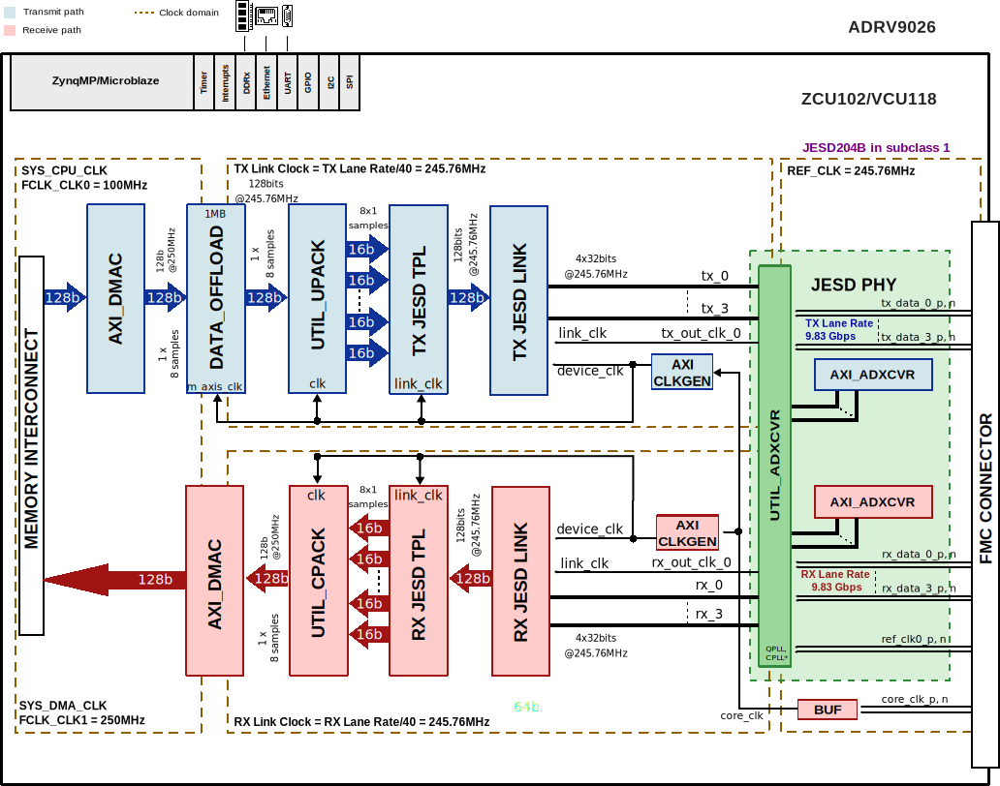
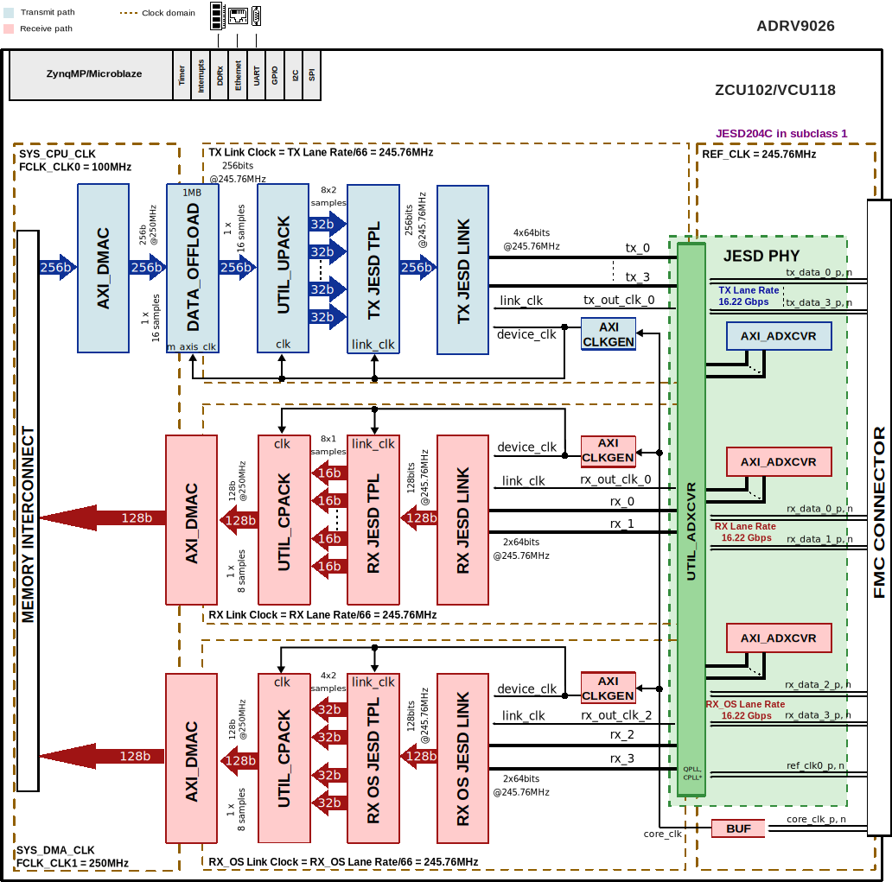

.. _adrv9026:

ADRV9026 HDL reference design
===============================================================================

The ADRV9026 is a highly integrated, radio frequency (RF) agile transceiver
offering four independently controlled transmitters, dedicated observation
receiver inputs for monitoring each transmitter channel, four independently
controlled receivers, integrated synthesizers, and digital signal processing
functions providing a complete transceiver solution. The device provides the
performance demanded by cellular infrastructure applications, such as small
cell base station radios, macro 3G/4G/5G systems, and massive multiple
in/multiple out (MIMO) base stations.

Supported boards
-------------------------------------------------------------------------------

- :adi:`ADRV9026/ADRV9029 <EVAL-ADRV9026>`

Supported devices
-------------------------------------------------------------------------------

- :adi:`ADRV9026`
- :adi:`ADRV9029`
- ADRV9025 (OBSOLETE)

Supported carriers
-------------------------------------------------------------------------------

.. list-table::
   :widths: 35 35 30
   :header-rows: 1

   * - Evaluation board
     - Carrier
     - FMC slot
   * - :adi:`ADRV9026/ADRV9029 <EVAL-ADRV9026>`
     - :intel:`A10SoC <content/www/us/en/products/details/fpga/development-kits/arria/10-sx.html>`
     - FMCA
   * -
     - :xilinx:`VCU118`
     - FMCP
   * -
     - :xilinx:`ZCU102`
     - FMC HPC1

Block design
-------------------------------------------------------------------------------

Block diagram
~~~~~~~~~~~~~~~~~~~~~~~~~~~~~~~~~~~~~~~~~~~~~~~~~~~~~~~~~~~~~~~~~~~~~~~~~~~~~~~

The data path and clock domains are depicted in the below diagrams:

Example block design for Single link and RX OBS disabled
^^^^^^^^^^^^^^^^^^^^^^^^^^^^^^^^^^^^^^^^^^^^^^^^^^^^^^^^^^^^^^^^^^^^^^^^^^^^^^^

.. collapsible:: Click here for details on the block diagram modules

   .. list-table::
      :widths: 10 20 35 35
      :header-rows: 1

      * - Block name
        - IP name
        - Documentation
        - Additional info
      * - AXI_ADXCVR
        - :git-hdl:`axi_adxcvr <library/xilinx/axi_adxcvr>`
        - :ref:`axi_adxcvr`
        - 2 instances, one for Rx and one for Tx
      * - AXI_CLKGEN
        - :git-hdl:`axi_clkgen <library/axi_clkgen>`
        - :ref:`axi_clkgen`
        - 2 instances, one for Rx and one for Tx
      * - AXI_DMAC
        - :git-hdl:`axi_dmac <library/axi_dmac>`
        - :ref:`axi_dmac`
        - 2 instances, one for Rx and one for Tx
      * - DATA_OFFLOAD
        - :git-hdl:`data_offload <library/data_offload>`
        - :ref:`data_offload`
        - 1 instance for Tx
      * - RX JESD LINK
        - axi_adrv9026_rx_jesd
        - :ref:`axi_jesd204_rx`
        - Instantiaded by ``adi_axi_jesd204_rx_create`` procedure
      * - RX JESD TPL
        - rx_adrv9026_tpl_core
        - :ref:`ad_ip_jesd204_tpl_adc`
        - Instantiated by ``adi_tpl_jesd204_rx_create`` procedure
      * - TX JESD LINK
        - axi_adrv9026_tx_jesd
        - :ref:`axi_jesd204_tx`
        - Instantiaded by ``adi_axi_jesd204_tx_create`` procedure
      * - TX JESD TPL
        - tx_adrv9026_tpl_core
        - :ref:`ad_ip_jesd204_tpl_dac`
        - Instantiated by ``adi_tpl_jesd204_tx_create`` procedure
      * - UTIL_UPACK
        - :git-hdl:`util_upack2 <library/util_pack/util_upack2>`
        - :ref:`util_upack2`
        - ---
      * - UTIL_CPACK
        - :git-hdl:`util_cpack2 <library/util_pack/util_cpack2>`
        - :ref:`util_cpack2`
        - ---

The Rx links (ADC Path) operate with the following parameters:

- Rx Framer parameters: L=4, M=8, F=4, S=1, NP=16, N=16
- Sample Rate: 245.76 MSPS
- Dual link: No
- RX_DEVICE_CLK: 245.76 MHz (Lane Rate/40)
- REF_CLK: 245.76 MHz (Lane Rate/40)
- JESD204B Lane Rate: 9.83 Gbps
- CPLL

The Tx links (DAC Path) operate with the following parameters:

- Tx Deramer parameters: L=4, M=8, F=4, S=1, NP=16, N=16
- Sample Rate: 245.76 MSPS
- Dual link: No
- TX_DEVICE_CLK: 245.76 MHz (Lane Rate/40)
- REF_CLK: 245.76 MHz (Lane Rate/40)
- JESD204B Lane Rate: 9.83 Gbps
- QPLL0

Example block design for Single link and RX OBS in Non-LinkSharing mode
^^^^^^^^^^^^^^^^^^^^^^^^^^^^^^^^^^^^^^^^^^^^^^^^^^^^^^^^^^^^^^^^^^^^^^^^^^^^^^^

.. collapsible:: Click here for details on the block diagram modules

   .. list-table::
      :widths: 10 20 35 35
      :header-rows: 1

      * - Block name
        - IP name
        - Documentation
        - Additional info
      * - AXI_ADXCVR
        - :git-hdl:`axi_adxcvr <library/xilinx/axi_adxcvr>`
        - :ref:`axi_adxcvr`
        - 3 instances, one for Rx, one for Rx-os and one for Tx
      * - AXI_CLKGEN
        - :git-hdl:`axi_clkgen <library/axi_clkgen>`
        - :ref:`axi_clkgen`
        - 3 instances, one for Rx, one for Rx-os and one for Tx
      * - AXI_DMAC
        - :git-hdl:`axi_dmac <library/axi_dmac>`
        - :ref:`axi_dmac`
        - 3 instances, one for Rx, one for Rx-os and one for Tx
      * - DATA_OFFLOAD
        - :git-hdl:`data_offload <library/data_offload>`
        - :ref:`data_offload`
        - 1 instance for Tx
      * - RX JESD LINK
        - axi_adrv9026_rx_jesd
        - :ref:`axi_jesd204_rx`
        - Instantiaded by ``adi_axi_jesd204_rx_create`` procedure
      * - RX JESD TPL
        - rx_adrv9026_tpl_core
        - :ref:`ad_ip_jesd204_tpl_adc`
        - Instantiated by ``adi_tpl_jesd204_rx_create`` procedure
      * - RX OS JESD LINK
        - axi_adrv9026_rx_os_jesd
        - :ref:`axi_jesd204_rx`
        - Instantiaded by ``adi_axi_jesd204_rx_create`` procedure
      * - RX OS JESD TPL
        - rx_os_adrv9026_tpl_core
        - :ref:`ad_ip_jesd204_tpl_adc`
        - Instantiated by ``adi_tpl_jesd204_rx_create`` procedure
      * - TX JESD LINK
        - axi_adrv9026_tx_jesd
        - :ref:`axi_jesd204_tx`
        - Instantiaded by ``adi_axi_jesd204_tx_create`` procedure
      * - TX JESD TPL
        - tx_adrv9026_tpl_core
        - :ref:`ad_ip_jesd204_tpl_dac`
        - Instantiated by ``adi_tpl_jesd204_tx_create`` procedure
      * - UTIL_UPACK
        - :git-hdl:`util_upack2 <library/util_pack/util_upack2>`
        - :ref:`util_upack2`
        - ---
      * - UTIL_CPACK
        - :git-hdl:`util_cpack2 <library/util_pack/util_cpack2>`
        - :ref:`util_cpack2`
        - 2 instances one for Rx and one for Rx-os

The Rx links (ADC Path) operate with the following parameters:

- Rx Framer parameters: L=2, M=4, F=4, S=1, NP=16, N=16
- Sample Rate: 245.76 MSPS
- Dual link: No
- RX_DEVICE_CLK: 245.76 MHz (Lane Rate/40)
- REF_CLK: 245.76 MHz (Lane Rate/40)
- JESD204B Lane Rate: 9.83 Gbps
- CPLL

The ORx links (ADC Obs Path) operate with the following parameters:

- Rx Obs Framer parameters: L=2, M=4, F=4, S=1, NP=16, N=16
- Sample Rate: 245.76 MSPS
- Dual link: No
- RX_OS_DEVICE_CLK: 245.76 MHz (Lane Rate/40)
- REF_CLK: 245.76 MHz (Lane Rate/40)
- JESD204B Lane Rate: 9.83 Gbps
- CPLL

The Tx links (DAC Path) operate with the following parameters:

- Tx Deramer parameters: L=4, M=8, F=4, S=1, NP=16, N=16
- Sample Rate: 245.76 MSPS
- Dual link: No
- TX_DEVICE_CLK: 245.76 MHz (Lane Rate/40)
- REF_CLK: 245.76 MHz (Lane Rate/40)
- JESD204B Lane Rate: 9.83 Gbps
- QPLL0

Example block design for JESD204C and RX OBS in Non-LinkSharing mode
^^^^^^^^^^^^^^^^^^^^^^^^^^^^^^^^^^^^^^^^^^^^^^^^^^^^^^^^^^^^^^^^^^^^^^^^^^^^^^^

.. caution::

   For ZCU102 with JESD204C: REF_CLK --> 491.52 MHz (link_clk is connected to
   out_clk_div2 outputs of the util_adxcvr).

.. collapsible:: Click here for details on the block diagram modules

   .. list-table::
      :widths: 10 20 35 35
      :header-rows: 1

      * - Block name
        - IP name
        - Documentation
        - Additional info
      * - AXI_ADXCVR
        - :git-hdl:`axi_adxcvr <library/xilinx/axi_adxcvr>`
        - :ref:`axi_adxcvr`
        - 3 instances, one for Rx, one for Rx-os and one for Tx
      * - AXI_CLKGEN
        - :git-hdl:`axi_clkgen <library/axi_clkgen>`
        - :ref:`axi_clkgen`
        - 3 instances, one for Rx, one for Rx-os and one for Tx
      * - AXI_DMAC
        - :git-hdl:`axi_dmac <library/axi_dmac>`
        - :ref:`axi_dmac`
        - 3 instances, one for Rx, one for Rx-os and one for Tx
      * - DATA_OFFLOAD
        - :git-hdl:`data_offload <library/data_offload>`
        - :ref:`data_offload`
        - 1 instance for Tx
      * - RX JESD LINK
        - axi_adrv9026_rx_jesd
        - :ref:`axi_jesd204_rx`
        - Instantiaded by ``adi_axi_jesd204_rx_create`` procedure
      * - RX JESD TPL
        - rx_adrv9026_tpl_core
        - :ref:`ad_ip_jesd204_tpl_adc`
        - Instantiated by ``adi_tpl_jesd204_rx_create`` procedure
      * - RX OS JESD LINK
        - axi_adrv9026_rx_os_jesd
        - :ref:`axi_jesd204_rx`
        - Instantiaded by ``adi_axi_jesd204_rx_create`` procedure
      * - RX OS JESD TPL
        - rx_os_adrv9026_tpl_core
        - :ref:`ad_ip_jesd204_tpl_adc`
        - Instantiated by ``adi_tpl_jesd204_rx_create`` procedure
      * - TX JESD LINK
        - axi_adrv9026_tx_jesd
        - :ref:`axi_jesd204_tx`
        - Instantiaded by ``adi_axi_jesd204_tx_create`` procedure
      * - TX JESD TPL
        - tx_adrv9026_tpl_core
        - :ref:`ad_ip_jesd204_tpl_dac`
        - Instantiated by ``adi_tpl_jesd204_tx_create`` procedure
      * - UTIL_CPACK
        - :git-hdl:`util_cpack2 <library/util_pack/util_cpack2>`
        - :ref:`util_cpack2`
        - 2 instances one for Rx and one for Rx-os
      * - UTIL_UPACK
        - :git-hdl:`util_upack2 <library/util_pack/util_upack2>`
        - :ref:`util_upack2`
        - ---

The Rx links (ADC Path) operate with the following parameters:

- Rx Framer parameters: L=2, M=8, F=8, S=1, NP=16, E=1, K=32
- Sample Rate: 245.76 MSPS
- Dual link: No
- RX_DEVICE_CLK: 245.76 MHz (Lane Rate/66)
- REF_CLK: 245.76 MHz (Lane Rate/66)
- JESD204C Lane Rate: 16.22 Gbps
- QPLL0

The ORx links (ADC Obs Path) operate with the following parameters:

- Rx Obs Framer parameters: L=2, M=4, F=4, S=1, NP=16, E=1, K=64
- Sample Rate: 491.52 MSPS
- Dual link: No
- RX_OS_DEVICE_CLK: 245.76 MHz (Lane Rate/66)
- REF_CLK: 245.76 MHz (Lane Rate/66)
- JESD204C Lane Rate: 16.22 Gbps
- QPLL0

The Tx links (DAC Path) operate with the following parameters:

- Tx Deramer parameters: L=4, M=8, F=4, S=1, NP=16, E=1, K=64
- Sample Rate: 491.52 MSPS
- Dual link: No
- TX_DEVICE_CLK: 245.76 MHz (Lane Rate/66)
- REF_CLK: 245.76 MHz (Lane Rate/66)
- JESD204C Lane Rate: 16.22 Gbps
- QPLL0

.. caution::

   ONLY for the ZCU102 design:
     - Cache coherency is available and enabled.
     - The DMA is connected to the Memory via HPC interface which is limited
       to 128 bits.
     - SYS_DMA_CLK = 333 MHz

Configuration modes
~~~~~~~~~~~~~~~~~~~~~~~~~~~~~~~~~~~~~~~~~~~~~~~~~~~~~~~~~~~~~~~~~~~~~~~~~~~~~~~

The block design supports configuration of parameters and scales.

We have listed a couple of examples at section
`Building the HDL project`_ and the default modes
for each project.

.. note::

   The parameters for Rx or Tx links can be changed from the
   **system_project.tcl** file, located in
   hdl/projects/adrv9026/$CARRIER/system_project.tcl

.. math::
   Lane Rate = Sample Rate*\frac{M}{L}*N'* \frac{10}{8}

The following are the parameters of this project that can be configured:

- JESD_MODE: used link layer encoder mode

  - 64B66B - 64b66b link layer defined in JESD204C
  - 8B10B  - 8b10b link layer defined in JESD204B

- ORX_ENABLE: Additional data path for RX-OS

  - 0 - Disabled (used for profiles with RX-OS disabled)
  - 1 - Enabled (used for profiles with RX-OS enabled)

- TX_LANE_RATE: Transceiver line rate of the TX link
- RX_LANE_RATE: Transceiver line rate of the RX link
- [RX/TX/RX_OS]_JESD_M: number of converters per link
- [RX/TX/RX_OS]_JESD_L: number of lanes per link
- [RX/TX/RX_OS]_JESD_S: number of samples per frame
- [RX/TX/RX_OS]_JESD_NP: number of bits per sample
- [RX/TX/RX_OS]_NUM_LINKS: number of links

Clock scheme
~~~~~~~~~~~~~~~~~~~~~~~~~~~~~~~~~~~~~~~~~~~~~~~~~~~~~~~~~~~~~~~~~~~~~~~~~~~~~~~

.. image:: adrv9026_zcu102_clocking.svg
   :width: 500
   :align: center
   :alt: ADRV9026 ZCU102 clock scheme

CPU/Memory interconnects addresses
~~~~~~~~~~~~~~~~~~~~~~~~~~~~~~~~~~~~~~~~~~~~~~~~~~~~~~~~~~~~~~~~~~~~~~~~~~~~~~~

The addresses are dependent on the architecture of the FPGA, having an offset
added to the base address from HDL (see more at :ref:`architecture cpu-intercon-addr`).

========================= =============== ===========
Instance                  Zynq/Microblaze ZynqMP
========================= =============== ===========
rx_adrv9026_tpl_core      0x44A0_0000     0x84A0_0000
tx_adrv9026_tpl_core      0x44A0_4000     0x84A0_4000
rx_os_adrv9026_tpl_core   0x44A0_8000     0x84A0_8000
axi_adrv9026_rx_xcvr      0x44A6_0000     0x84A6_0000
axi_adrv9026_tx_xcvr      0x44A8_0000     0x84A8_0000
axi_adrv9026_rx_os_xcvr   0x45A6_0000     0x85A6_0000
axi_adrv9026_tx_jesd      0x44A9_0000     0x84A9_0000
axi_adrv9026_rx_jesd      0x44AA_0000     0x84AA_0000
axi_adrv9026_rx_os_jesd   0x45AA_0000     0x85AA_0000
axi_adrv9026_rx_dma       0x7C40_0000     0x9C40_0000
axi_adrv9026_tx_dma       0x7C42_0000     0x9C42_0000
axi_adrv9026_rx_os_dma    0x7C80_0000     0x9C80_0000
axi_adrv9026_tx_clkgen    0x43C0_0000     0x83C0_0000
axi_adrv9026_rx_clkgen    0x43C1_0000     0x83C1_0000
axi_adrv9026_rx_os_clkgen 0x43C2_0000     0x83C2_0000
adrv9026_data_offload     0x7C43_0000     0x9C43_0000
========================= =============== ===========

SPI connections
~~~~~~~~~~~~~~~~~~~~~~~~~~~~~~~~~~~~~~~~~~~~~~~~~~~~~~~~~~~~~~~~~~~~~~~~~~~~~~~

.. list-table::
   :widths: 25 25 25 25
   :header-rows: 1

   * - SPI type
     - SPI manager instance
     - SPI subordinate
     - CS
   * - PS
     - spi0
     - ADRV9026
     - 0
   * -
     -
     - AD9528
     - 1

GPIOs
~~~~~~~~~~~~~~~~~~~~~~~~~~~~~~~~~~~~~~~~~~~~~~~~~~~~~~~~~~~~~~~~~~~~~~~~~~~~~~~

ZCU102
^^^^^^^^^^^^^^^^^^^^^^^^^^^^^^^^^^^^^^^^^^^^^^^^^^^^^^^^^^^^^^^^^^^^^^^^^^^^^^^

.. list-table::
   :widths: 25 20 20 15
   :header-rows: 2

   * - GPIO signal
     - Direction
     - HDL GPIO EMIO
     - Software GPIO
   * -
     - (from FPGA view)
     -
     - Zynq MP
   * - ad9528_reset_b
     - INOUT
     - 68
     - 146
   * - ad9528_sysref_req
     - INOUT
     - 67
     - 145
   * - adrv9026_tx1_enable
     - INOUT
     - 66
     - 144
   * - adrv9026_tx2_enable
     - INOUT
     - 65
     - 143
   * - adrv9026_tx3_enable
     - INOUT
     - 64
     - 142
   * - adrv9026_tx4_enable
     - INOUT
     - 63
     - 141
   * - adrv9026_rx1_enable
     - INOUT
     - 62
     - 140
   * - adrv9026_rx2_enable
     - INOUT
     - 61
     - 139
   * - adrv9026_rx3_enable
     - INOUT
     - 60
     - 138
   * - adrv9026_rx4_enable
     - INOUT
     - 59
     - 137
   * - adrv9026_test
     - INOUT
     - 58
     - 136
   * - adrv9026_reset_b
     - INOUT
     - 57
     - 135
   * - adrv9026_gpint1
     - INOUT
     - 56
     - 134
   * - adrv9026_gpint2
     - INOUT
     - 55
     - 133
   * - adrv9026_orx_ctrl_a
     - INOUT
     - 54
     - 132
   * - adrv9026_orx_ctrl_b
     - INOUT
     - 53
     - 131
   * - adrv9026_orx_ctrl_c
     - INOUT
     - 52
     - 130
   * - adrv9026_orx_ctrl_d
     - INOUT
     - 51
     - 129
   * - adrv9026_gpio[0:18]
     - INOUT
     - 50:32
     - 128:110

VCU118
^^^^^^^^^^^^^^^^^^^^^^^^^^^^^^^^^^^^^^^^^^^^^^^^^^^^^^^^^^^^^^^^^^^^^^^^^^^^^^^

.. list-table::
   :widths: 25 20 20 15
   :header-rows: 2

   * - GPIO signal
     - Direction
     - HDL GPIO EMIO
     - Software GPIO
   * -
     - (from FPGA view)
     -
     - Microblaze
   * - ad9528_reset_b
     - INOUT
     - 62
     - 62
   * - ad9528_reset_b
     - INOUT
     - 61
     - 61
   * - adrv9026_tx1_enable
     - INOUT
     - 60
     - 60
   * - adrv9026_tx2_enable
     - INOUT
     - 59
     - 59
   * - adrv9026_tx3_enable
     - INOUT
     - 58
     - 58
   * - adrv9026_tx4_enable
     - INOUT
     - 57
     - 57
   * - adrv9026_rx1_enable
     - INOUT
     - 56
     - 56
   * - adrv9026_rx2_enable
     - INOUT
     - 55
     - 55
   * - adrv9026_rx3_enable
     - INOUT
     - 54
     - 54
   * - adrv9026_rx4_enable
     - INOUT
     - 53
     - 53
   * - adrv9026_test
     - INOUT
     - 52
     - 52
   * - adrv9026_reset_b
     - INOUT
     - 51
     - 51
   * - adrv9026_gpint1
     - INOUT
     - 50
     - 50
   * - adrv9026_gpint2
     - INOUT
     - 49
     - 49
   * - adrv9026_orx_ctrl_a
     - INOUT
     - 48
     - 48
   * - adrv9026_orx_ctrl_b
     - INOUT
     - 47
     - 47
   * - adrv9026_orx_ctrl_c
     - INOUT
     - 46
     - 46
   * - adrv9026_orx_ctrl_d
     - INOUT
     - 45
     - 45
   * - adrv9026_gpio[0:18]
     - INOUT
     - 44:26
     - 44:26

Interrupts
~~~~~~~~~~~~~~~~~~~~~~~~~~~~~~~~~~~~~~~~~~~~~~~~~~~~~~~~~~~~~~~~~~~~~~~~~~~~~~~

Below are the Programmable Logic interrupts used in this project.

======================= === ============ =============
Instance name           HDL Linux ZynqMP Actual ZynqMP
======================= === ============ =============
axi_adrv9026_tx_jesd    10  106          138
axi_adrv9026_rx_jesd    11  107          139
axi_adrv9026_rx_os_jesd 12  108          140
axi_adrv9026_tx_dma     13  109          141
axi_adrv9026_rx_dma     14  110          142
axi_adrv9026_rx_os_dma  15  111          143
======================= === ============ =============

Microblaze
~~~~~~~~~~~~~~~~~~~~~~~~~~~~~~~~~~~~~~~~~~~~~~~~~~~~~~~~~~~~~~~~~~~~~~~~~~~~~~~

======================= === ============
Instance name           HDL Microblaze
======================= === ============
axi_adrv9026_tx_jesd    7   7
axi_adrv9026_rx_jesd    8   8
axi_adrv9026_rx_os_jesd 15  15
axi_adrv9026_tx_dma     12  12
axi_adrv9026_rx_dma     13  13
axi_adrv9026_rx_os_dma  14  14
======================= === ============

Building the HDL project
-------------------------------------------------------------------------------

The design is built upon ADI's generic HDL reference design framework.
ADI distributes the bit/elf files of these projects as part of the
:dokuwiki:`ADI Kuiper Linux <resources/tools-software/linux-software/kuiper-linux>`.
If you want to build the sources, ADI makes them available on the
:git-hdl:`HDL repository </>`. To get the source you must
`clone <https://git-scm.com/book/en/v2/Git-Basics-Getting-a-Git-Repository>`__
the HDL repository.

Then go to the project location, choose your carrier and run the make command
by typing in your command prompt:

**Linux/Cygwin/WSL**

.. shell::

   $cd hdl/projects/adrv9026/zcu102
   $make

The following dropdowns contain tables with the parameters that can be used to
configure this project, depending on the carrier used.

.. collapsible:: Default values of the make parameters for ADRV9026

   +-------------------+------------------------------------------------------+
   | Parameter         | Default value of the parameters depending on carrier |
   +-------------------+---------------------------+--------------------------+
   |                   |       ZCU102/VCU118       |          A10SoC          |
   +===================+===========================+==========================+
   | JESD_MODE         |          8B10B            |           8B10B          |
   +-------------------+---------------------------+--------------------------+
   | ORX_ENABLE        |             0             |            ---           |
   +-------------------+---------------------------+--------------------------+
   | RX_LANE_RATE      |           9.83            |            9.83          |
   +-------------------+---------------------------+--------------------------+
   | TX_LANE_RATE      |           9.83            |            9.83          |
   +-------------------+---------------------------+--------------------------+
   | TX_NUM_LINKS      |             1             |             1            |
   +-------------------+---------------------------+--------------------------+
   | RX_NUM_LINKS      |             1             |             1            |
   +-------------------+---------------------------+--------------------------+
   | RX_OS_NUM_LINKS   |             1             |            ---           |
   +-------------------+---------------------------+--------------------------+
   | RX_JESD_M         |             8             |             8            |
   +-------------------+---------------------------+--------------------------+
   | RX_JESD_L         |             4             |             4            |
   +-------------------+---------------------------+--------------------------+
   | RX_JESD_S         |             1             |             1            |
   +-------------------+---------------------------+--------------------------+
   | RX_JESD_NP        |            16             |            ---           |
   +-------------------+---------------------------+--------------------------+
   | TX_JESD_M         |             8             |             8            |
   +-------------------+---------------------------+--------------------------+
   | TX_JESD_L         |             4             |             4            |
   +-------------------+---------------------------+--------------------------+
   | TX_JESD_S         |             1             |             1            |
   +-------------------+---------------------------+--------------------------+
   | TX_JESD_NP        |            16             |            ---           |
   +-------------------+---------------------------+--------------------------+
   | RX_OS_JESD_M      |             0             |            ---           |
   +-------------------+---------------------------+--------------------------+
   | RX_OS_JESD_L      |             0             |            ---           |
   +-------------------+---------------------------+--------------------------+
   | RX_OS_JESD_S      |             0             |            ---           |
   +-------------------+---------------------------+--------------------------+
   | RX_JESD_NP        |             0             |            ---           |
   +-------------------+---------------------------+--------------------------+

A more comprehensive build guide can be found in the :ref:`build_hdl` user guide.

Other considerations
-------------------------------------------------------------------------------

ADC - lane mapping
~~~~~~~~~~~~~~~~~~~~~~~~~~~~~~~~~~~~~~~~~~~~~~~~~~~~~~~~~~~~~~~~~~~~~~~~~~~~~~~

Due to physical constraints, Rx lanes are reordered as described in the
following table.

============ ===========================
ADC phy Lane FPGA Rx lane / Logical Lane
============ ===========================
0            0
1            1
2            2
3            3
============ ===========================

DAC - lane mapping
~~~~~~~~~~~~~~~~~~~~~~~~~~~~~~~~~~~~~~~~~~~~~~~~~~~~~~~~~~~~~~~~~~~~~~~~~~~~~~~

Due to physical constraints, Tx lanes are reordered as described in the
following table.

============ ===========================
DAC phy lane FPGA Tx lane / Logical lane
============ ===========================
0            3
1            2
2            0
3            1
============ ===========================

Resources
-------------------------------------------------------------------------------

Systems related
~~~~~~~~~~~~~~~~~~~~~~~~~~~~~~~~~~~~~~~~~~~~~~~~~~~~~~~~~~~~~~~~~~~~~~~~~~~~~~~

- :dokuwiki:`[Wiki] ADRV9026 & ADRV9029 Prototyping Platform User Guide <resources/eval/user-guides/adrv9025>`

Here you can find the quick start guides available for these evaluation boards:

.. list-table::
   :widths: 20 10
   :header-rows: 1

   * - Evaluation board
     - Zynq UltraScale+ MP
   * - ADRV9026/ADRV9029
     - :dokuwiki:`ZCU102 <resources/eval/user-guides/adrv9026/quickstart/zynqmp>`

Hardware related
~~~~~~~~~~~~~~~~~~~~~~~~~~~~~~~~~~~~~~~~~~~~~~~~~~~~~~~~~~~~~~~~~~~~~~~~~~~~~~~

- Product datasheet: :adi:`ADRV9026`
- `UG-1578, Device User Guide <https://www.analog.com/media/radioverse-adrv9026/adrv9026-system-development-user-guide-ug-1727.pdf>`__

HDL related
~~~~~~~~~~~~~~~~~~~~~~~~~~~~~~~~~~~~~~~~~~~~~~~~~~~~~~~~~~~~~~~~~~~~~~~~~~~~~~~

- :git-hdl:`ADRV9026 HDL project source code <projects/adrv9026>`

.. list-table::
   :widths: 30 40 35
   :header-rows: 1

   * - IP name
     - Source code link
     - Documentation link
   * - AXI_CLKGEN
     - :git-hdl:`library/axi_clkgen`
     - :ref:`axi_clkgen`
   * - AXI_DMAC
     - :git-hdl:`library/axi_dmac`
     - :ref:`axi_dmac`
   * - DATA_OFFLOAD
     - :git-hdl:`library/data_offload`
     - :ref:`data_offload`
   * - AXI_SYSID
     - :git-hdl:`library/axi_sysid`
     - :ref:`axi_sysid`
   * - SYSID_ROM
     - :git-hdl:`library/sysid_rom`
     - :ref:`axi_sysid`
   * - UTIL_UPACK2
     - :git-hdl:`library/util_pack/util_upack2`
     - :ref:`util_upack2`
   * - UTIL_CPACK2
     - :git-hdl:`library/util_pack/util_cpack2`
     - :ref:`util_upack2`
   * - UTIL_ADXCVR for AMD
     - :git-hdl:`library/xilinx/util_adxcvr`
     - :ref:`util_adxcvr`
   * - AXI_ADXCVR for Intel
     - :git-hdl:`library/intel/axi_adxcvr`
     - :ref:`axi_adxcvr intel`
   * - AXI_ADXCVR for AMD
     - :git-hdl:`library/xilinx/axi_adxcvr`
     - :ref:`axi_adxcvr amd`
   * - AXI_JESD204_RX
     - :git-hdl:`library/jesd204/axi_jesd204_rx`
     - :ref:`axi_jesd204_rx`
   * - AXI_JESD204_TX
     - :git-hdl:`library/jesd204/axi_jesd204_tx`
     - :ref:`axi_jesd204_tx`
   * - JESD204_TPL_ADC
     - :git-hdl:`library/jesd204/ad_ip_jesd204_tpl_adc`
     - :ref:`ad_ip_jesd204_tpl_adc`
   * - JESD204_TPL_DAC
     - :git-hdl:`library/jesd204/ad_ip_jesd204_tpl_dac`
     - :ref:`ad_ip_jesd204_tpl_dac`

- :dokuwiki:`[Wiki] Generic JESD204B block designs <resources/fpga/docs/hdl/generic_jesd_bds>`
- :ref:`jesd204`

Software related
~~~~~~~~~~~~~~~~~~~~~~~~~~~~~~~~~~~~~~~~~~~~~~~~~~~~~~~~~~~~~~~~~~~~~~~~~~~~~~~

- :dokuwiki:`[Wiki] ADRV9026 Linux driver wiki page <resources/tools-software/linux-drivers/iio-transceiver/adrv9025>`

.. include:: ../common/more_information.rst

.. include:: ../common/support.rst
