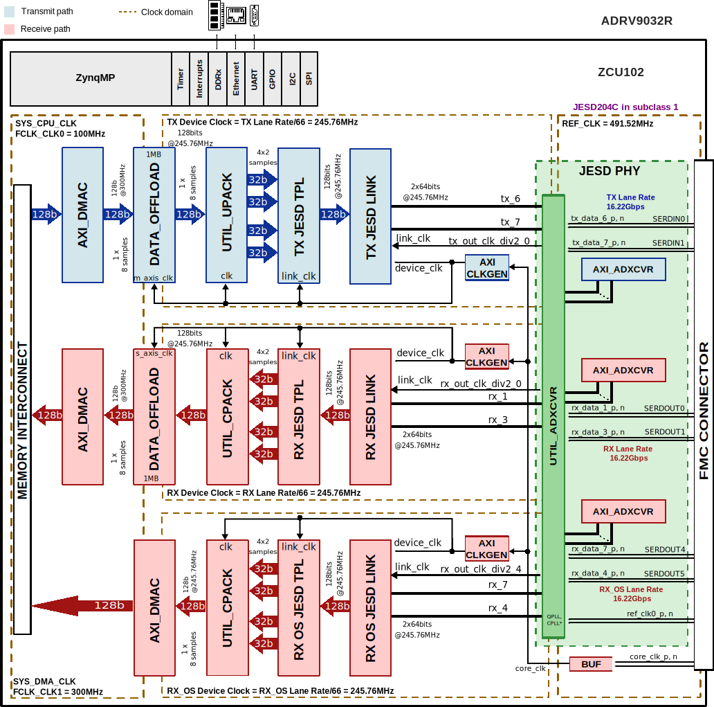

.. _adrv903x:

ADRV903x HDL reference design
===============================================================================

The ADRV903x is a highly integrated, system on chip (SoC) radio frequency (RF)
agile transceiver with integrated digital front end (DFE). The SoC contains
eight transmitters, two observation receivers for monitoring transmitter
channels, eight receivers, integrated LO and clock synthesizers, and digital
signal processing functions. The SoC meets the high radio performance and low
power consumption demanded by cellular infrastructure applications, such as
software-definded radios, portable instrumentation and military communications.

Supported devices
-------------------------------------------------------------------------------

- :adi:`ADRV9032R`

Supported boards
-------------------------------------------------------------------------------

- :adi:`EVAL-ADRV903x`

Supported carriers
-------------------------------------------------------------------------------

.. list-table::
   :widths: 35 35 30
   :header-rows: 1

   * - Evaluation board
     - Carrier
     - FMC slot
   * - EVAL-ADRV903x
     - :xilinx:`ZCU102`
     - FMC HPC0

Block design
-------------------------------------------------------------------------------

Block diagram
~~~~~~~~~~~~~~~~~~~~~~~~~~~~~~~~~~~~~~~~~~~~~~~~~~~~~~~~~~~~~~~~~~~~~~~~~~~~~~~

The data path and clock domains are depicted in the below diagrams:

Example block design for Single link
^^^^^^^^^^^^^^^^^^^^^^^^^^^^^^^^^^^^^^^^^^^^^^^^^^^^^^^^^^^^^^^^^^^^^^^^^^^^^^^

The Rx links (ADC Path) operate with the following parameters:

- Rx Deframer parameters: L=2, M=4, F=4, S=1, NP=16, N=16
- Sample Rate: 491.52 MSPS
- Dual link: No
- RX_DEVICE_CLK: 245.76 MHz (Lane Rate/66)
- REF_CLK: 491.52 MHz
- JESD204C Lane Rate: 16.22 Gbps
- QPLL0

The Tx links (DAC Path) operate with the following parameters:

- Tx Deframer parameters: L=2, M=4, F=4, S=1, NP=16, N=16
- Sample Rate: 491.52 MSPS
- Dual link: No
- TX_DEVICE_CLK: 245.76 MHz (Lane Rate/66)
- REF_CLK: 491.52 MHz
- JESD204C Lane Rate: 16.22 Gbps
- QPLL0

The ORx links (ADC Obs Path) operate with the following parameters:

- ORx Deframer parameters: L=2, M=4, F=4, S=1, NP=16, N=16
- Sample Rate: 491.52 MSPS
- Dual link: No
- ORX_DEVICE_CLK: 245.76 MHz (Lane Rate/66)
- REF_CLK: 491.52 MHz
- JESD204C Lane Rate: 16.22 Gbps
- QPLL0

Configuration modes
~~~~~~~~~~~~~~~~~~~~~~~~~~~~~~~~~~~~~~~~~~~~~~~~~~~~~~~~~~~~~~~~~~~~~~~~~~~~~~~

The block design supports configuration of parameters and scales.

We have listed a couple of examples at section
`Building the HDL project`_ and the default modes
for each project.

.. note::

   The parameters for Rx or Tx links can be changed from the
   **system_project.tcl** file, located in
   hdl/projects/adrv903x/$CARRIER/system_project.tcl

.. math::
   Lane Rate = Sample Rate*\frac{M}{L}*N'* \frac{66}{64}

The following are the parameters of this project that can be configured:

- JESD_MODE: used link layer encoder mode

  - 64B66B - 64b66b link layer defined in JESD204C
  - 8B10B  - 8b10b link layer defined in JESD204B

- ORX_ENABLE : Additional data path for RX-OS

  - 0 - Disabled (used for profiles with RX-OS disabled)
  - 1 - Enabled (used for profiles with RX-OS enabled)

- RX_LANE_RATE: Transceiver lane rate of the Rx link
- TX_LANE_RATE: Transceiver lane rate of the Tx link
- [RX/TX/RX_OS]_JESD_M: number of converters per link
- [RX/TX/RX_OS]_JESD_L: number of lanes per link
- [RX/TX/RX_OS]_JESD_S: number of samples per frame
- [RX/TX/RX_OS]_JESD_NP: number of bits per sample
- [RX/TX/RX_OS]_TPL_WIDTH : TPL data path width in bits
- [RX/TX/RX_OS]_NUM_LINKS: number of links

Clock scheme
~~~~~~~~~~~~~~~~~~~~~~~~~~~~~~~~~~~~~~~~~~~~~~~~~~~~~~~~~~~~~~~~~~~~~~~~~~~~~~~

.. image:: adrv903x_zcu102_clocking.svg
   :width: 500
   :align: center
   :alt: ADRV903x ZCU102 clock scheme

CPU/Memory interconnects addresses
~~~~~~~~~~~~~~~~~~~~~~~~~~~~~~~~~~~~~~~~~~~~~~~~~~~~~~~~~~~~~~~~~~~~~~~~~~~~~~~

The addresses are dependent on the architecture of the FPGA, having an offset
added to the base address from HDL (see more at :ref:`architecture cpu-intercon-addr`).

========================= ===========
Instance                  ZynqMP
========================= ===========
axi_adrv903x_tx_jesd      0x84A9_0000
axi_adrv903x_rx_jesd      0x84AA_0000
axi_adrv903x_rx_os_jesd   0x85AA_0000
axi_adrv903x_tx_dma       0x9C42_0000
axi_adrv903x_rx_dma       0x9C40_0000
axi_adrv903x_rx_os_dma    0x9C80_0000
tx_adrv903x_tpl_core      0x84A0_4000
rx_adrv903x_tpl_core      0x84A0_0000
rx_os_adrv903x_tpl_core   0x84A0_8000
axi_adrv903x_tx_xcvr      0x84A8_0000
axi_adrv903x_rx_xcvr      0x84A6_0000
axi_adrv903x_rx_os_xcvr   0x85A6_0000
axi_adrv903x_tx_clkgen    0x83C0_0000
axi_adrv903x_rx_clkgen    0x83C1_0000
axi_adrv903x_rx_os_clkgen 0x83C2_0000
adrv903x_tx_data_offload  0x9c44_0000
adrv903x_rx_data_offload  0x9c45_0000
========================= ===========

SPI connections
~~~~~~~~~~~~~~~~~~~~~~~~~~~~~~~~~~~~~~~~~~~~~~~~~~~~~~~~~~~~~~~~~~~~~~~~~~~~~~~

.. list-table::
   :widths: 25 25 25 25
   :header-rows: 1

   * - SPI type
     - SPI manager instance
     - SPI subordinate
     - CS
   * - PS
     - spi0
     - ADRV903x
     - 0
   * -
     -
     - AD9528
     - 1

GPIOs
~~~~~~~~~~~~~~~~~~~~~~~~~~~~~~~~~~~~~~~~~~~~~~~~~~~~~~~~~~~~~~~~~~~~~~~~~~~~~~~

.. list-table::
   :widths: 25 20 20 15
   :header-rows: 2

   * - GPIO signal
     - Direction
     - HDL GPIO EMIO
     - Software GPIO
   * -
     - (from FPGA view)
     -
     - Zynq MP
   * - ad9528_reset_b
     - INOUT
     - 69
     - 147
   * - ad9528_sysref_req
     - INOUT
     - 68
     - 146
   * - adrv903x_trx0_enable
     - INOUT
     - 67
     - 145
   * - adrv903x_trx1_enable
     - INOUT
     - 66
     - 144
   * - adrv903x_trx2_enable
     - INOUT
     - 65
     - 143
   * - adrv903x_trx3_enable
     - INOUT
     - 64
     - 142
   * - adrv903x_trx4_enable
     - INOUT
     - 63
     - 141
   * - adrv903x_trx5_enable
     - INOUT
     - 62
     - 140
   * - adrv903x_trx6_enable
     - INOUT
     - 61
     - 139
   * - adrv903x_trx7_enable
     - INOUT
     - 60
     - 138
   * - adrv903x_orx0_enable
     - INOUT
     - 59
     - 137
   * - adrv903x_orx1_enable
     - INOUT
     - 58
     - 136
   * - adrv903x_test
     - INOUT
     - 57
     - 135
   * - adrv903x_reset_b
     - INOUT
     - 56
     - 134
   * - adrv903x_gpio[0:23]
     - INOUT
     - 55:32
     - 133:110

Interrupts
~~~~~~~~~~~~~~~~~~~~~~~~~~~~~~~~~~~~~~~~~~~~~~~~~~~~~~~~~~~~~~~~~~~~~~~~~~~~~~~

Below are the Programmable Logic interrupts used in this project.

======================= === ============ =============
Instance name           HDL Linux ZynqMP Actual ZynqMP
======================= === ============ =============
axi_adrv903x_tx_jesd    10  106          138
axi_adrv903x_rx_jesd    11  107          139
axi_adrv903x_rx_os_jesd 12  108          140
axi_adrv903x_tx_dma     13  109          141
axi_adrv903x_rx_dma     14  110          142
axi_adrv903x_rx_os_dma  15  111          143
======================= === ============ =============

Building the HDL project
-------------------------------------------------------------------------------

The design is built upon ADI's generic HDL reference design framework.
ADI distributes the bit/elf files of these projects as part of the
:dokuwiki:`ADI Kuiper Linux <resources/tools-software/linux-software/kuiper-linux>`.
If you want to build the sources, ADI makes them available on the
:git-hdl:`HDL repository </>`. To get the source you must
`clone <https://git-scm.com/book/en/v2/Git-Basics-Getting-a-Git-Repository>`__
the HDL repository.

Then go to the :git-hdl:`projects/adrv903x <projects/adrv903x>`
location and run the make command by typing in your command prompt:

**Linux/Cygwin/WSL**

.. shell::

   $cd hdl/projects/adrv903x/zcu102
   $make

The following dropdowns contain tables with the parameters that can be used to
configure this project, depending on the carrier used.
Where a cell contains a --- (dash) it means that the parameter doesn't exist
for that project (adrv903x/carrier or adrv903x/carrier).

.. collapsible:: Default values of the ``make`` parameters for ADRV903x

   +----------------------+------------------------------------------------------+
   | Parameter            | Default value of the parameters depending on carrier |
   +----------------------+------------------------------------------------------+
   |                      |                         ZCU102                       |
   +======================+======================================================+
   | JESD_MODE            |                         64B66B                       |
   +----------------------+------------------------------------------------------+
   | ORX_ENABLE           |                           1                          |
   +----------------------+------------------------------------------------------+
   | RX_LANE_RATE         |                         16.22                        |
   +----------------------+------------------------------------------------------+
   | TX_LANE_RATE         |                         16.22                        |
   +----------------------+------------------------------------------------------+
   | TX_NUM_LINKS         |                           1                          |
   +----------------------+------------------------------------------------------+
   | RX_NUM_LINKS         |                           1                          |
   +----------------------+------------------------------------------------------+
   | RX_OS_NUM_LINKS      |                           1                          |
   +----------------------+------------------------------------------------------+
   | RX_JESD_M            |                           4                          |
   +----------------------+------------------------------------------------------+
   | RX_JESD_L            |                           2                          |
   +----------------------+------------------------------------------------------+
   | RX_JESD_S            |                           1                          |
   +----------------------+------------------------------------------------------+
   | RX_JESD_NP           |                          16                          |
   +----------------------+------------------------------------------------------+
   | RX_JESD_TPL_WIDTH    |                          {}                          |
   +----------------------+------------------------------------------------------+
   | TX_JESD_M            |                           4                          |
   +----------------------+------------------------------------------------------+
   | TX_JESD_L            |                           2                          |
   +----------------------+------------------------------------------------------+
   | TX_JESD_S            |                           1                          |
   +----------------------+------------------------------------------------------+
   | TX_JESD_NP           |                          16                          |
   +----------------------+------------------------------------------------------+
   | TX_JESD_TPL_WIDTH    |                          {}                          |
   +----------------------+------------------------------------------------------+
   | RX_OS_JESD_M         |                           4                          |
   +----------------------+------------------------------------------------------+
   | RX_OS_JESD_L         |                           2                          |
   +----------------------+------------------------------------------------------+
   | RX_OS_JESD_S         |                           1                          |
   +----------------------+------------------------------------------------------+
   | RX_OS_JESD_NP        |                          16                          |
   +----------------------+------------------------------------------------------+
   | RX_OS_JESD_TPL_WIDTH |                          {}                          |
   +----------------------+------------------------------------------------------+

A more comprehensive build guide can be found in the :ref:`build_hdl` user guide.

Other considerations
-------------------------------------------------------------------------------

ADC - lane mapping
~~~~~~~~~~~~~~~~~~~~~~~~~~~~~~~~~~~~~~~~~~~~~~~~~~~~~~~~~~~~~~~~~~~~~~~~~~~~~~~

Due to physical constraints, Rx lanes are reordered as described in the
following table.

======== ====== =========================== ====================
ADC Lane FMC DP FPGA Rx lane / Logical Lane PHY lane / XCVR Lane
======== ====== =========================== ====================
SERDOUT0 DP5    rx_data_p/n[0]              rx_data_1_p/n
SERDOUT1 DP4    rx_data_p/n[1]              rx_data_3_p/n
SERDOUT2 DP6    rx_data_p/n[2]              rx_data_0_p/n
SERDOUT3 DP7    rx_data_p/n[3]              rx_data_2_p/n
SERDOUT4 DP2    rx_data_p/n[4]              rx_data_7_p/n
SERDOUT5 DP3    rx_data_p/n[5]              rx_data_4_p/n
SERDOUT6 DP1    rx_data_p/n[6]              rx_data_5_p/n
SERDOUT7 DP0    rx_data_p/n[7]              rx_data_6_p/n
======== ====== =========================== ====================

DAC - lane mapping
~~~~~~~~~~~~~~~~~~~~~~~~~~~~~~~~~~~~~~~~~~~~~~~~~~~~~~~~~~~~~~~~~~~~~~~~~~~~~~~

Due to physical constraints, Tx lanes are reordered as described in the
following table.

======== ====== =========================== ====================
DAC Lane FMC DP FPGA Tx lane / Logical Lane PHY lane / XCVR Lane
======== ====== =========================== ====================
SERDIN0  DP0    tx_data_p/n[0]              tx_data_6_p/n
SERDIN1  DP2    tx_data_p/n[1]              tx_data_7_p/n
SERDIN2  DP1    tx_data_p/n[2]              tx_data_5_p/n
SERDIN3  DP3    tx_data_p/n[3]              tx_data_4_p/n
SERDIN4  DP7    tx_data_p/n[4]              tx_data_2_p/n
SERDIN5  DP6    tx_data_p/n[5]              tx_data_0_p/n
SERDIN6  DP5    tx_data_p/n[6]              tx_data_1_p/n
SERDIN7  DP4    tx_data_p/n[7]              tx_data_3_p/n
======== ====== =========================== ====================

Resources
-------------------------------------------------------------------------------

Hardware related
~~~~~~~~~~~~~~~~~~~~~~~~~~~~~~~~~~~~~~~~~~~~~~~~~~~~~~~~~~~~~~~~~~~~~~~~~~~~~~~

- Product datasheets: :adi:`ADRV9032R`

HDL related
~~~~~~~~~~~~~~~~~~~~~~~~~~~~~~~~~~~~~~~~~~~~~~~~~~~~~~~~~~~~~~~~~~~~~~~~~~~~~~~

- :git-hdl:`ADRV903x HDL project source code <projects/adrv903x>`

.. list-table::
   :widths: 30 40 35
   :header-rows: 1

   * - IP name
     - Source code link
     - Documentation link
   * - AXI_CLKGEN
     - :git-hdl:`library/axi_clkgen`
     - :ref:`axi_clkgen`
   * - AXI_DMAC
     - :git-hdl:`library/axi_dmac`
     - :ref:`axi_dmac`
   * - AXI_SYSID
     - :git-hdl:`library/axi_sysid`
     - :ref:`axi_sysid`
   * - SYSID_ROM
     - :git-hdl:`library/sysid_rom`
     - :ref:`axi_sysid`
   * - UTIL_CPACK2
     - :git-hdl:`library/util_pack/util_cpack2`
     - :ref:`util_cpack2`
   * - UTIL_UPACK2
     - :git-hdl:`library/util_pack/util_upack2`
     - :ref:`util_upack2`
   * - DATA_OFFLOAD
     - :git-hdl:`library/data_offload`
     - :ref:`data_offload`
   * - UTIL_DO_RAM
     - :git-hdl:`library/util_do_ram`
     - :ref:`data_offload`
   * - UTIL_ADXCVR for AMD
     - :git-hdl:`library/xilinx/util_adxcvr`
     - :ref:`util_adxcvr`
   * - AXI_ADXCVR for AMD
     - :git-hdl:`library/xilinx/axi_adxcvr`
     - :ref:`axi_adxcvr amd`
   * - AXI_JESD204_RX
     - :git-hdl:`library/jesd204/axi_jesd204_rx`
     - :ref:`axi_jesd204_rx`
   * - AXI_JESD204_TX
     - :git-hdl:`library/jesd204/axi_jesd204_tx`
     - :ref:`axi_jesd204_tx`
   * - JESD204_TPL_ADC
     - :git-hdl:`library/jesd204/ad_ip_jesd204_tpl_adc`
     - :ref:`ad_ip_jesd204_tpl_dac`
   * - JESD204_TPL_DAC
     - :git-hdl:`library/jesd204/ad_ip_jesd204_tpl_dac`
     - :ref:`ad_ip_jesd204_tpl_dac`

- :ref:`jesd204`

.. include:: ../common/more_information.rst

.. include:: ../common/support.rst

