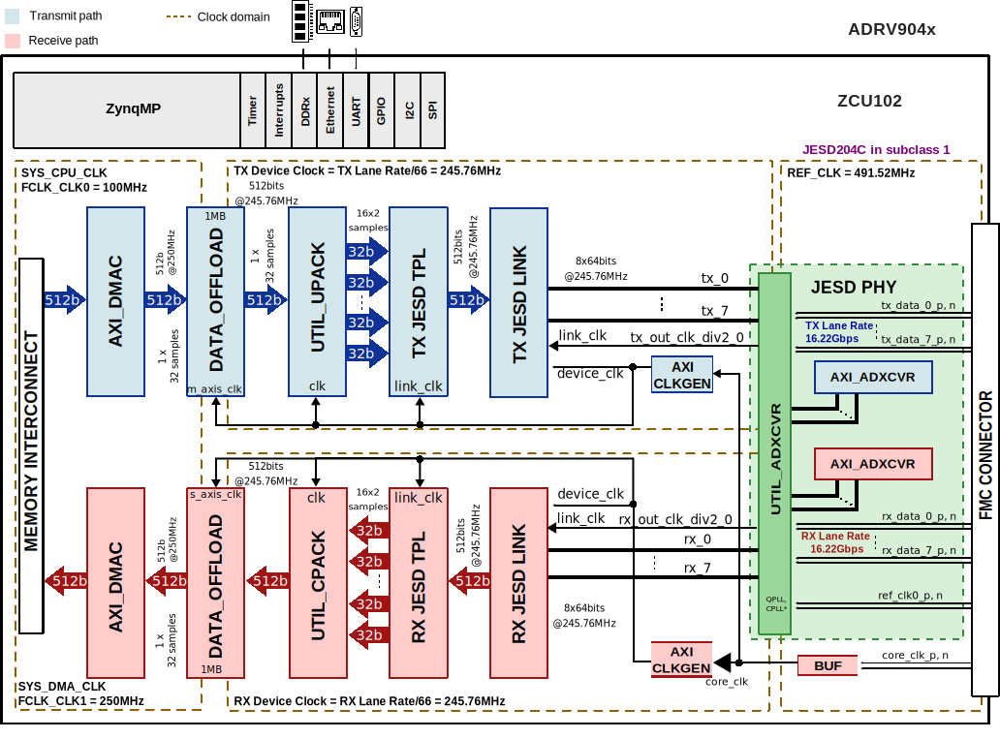
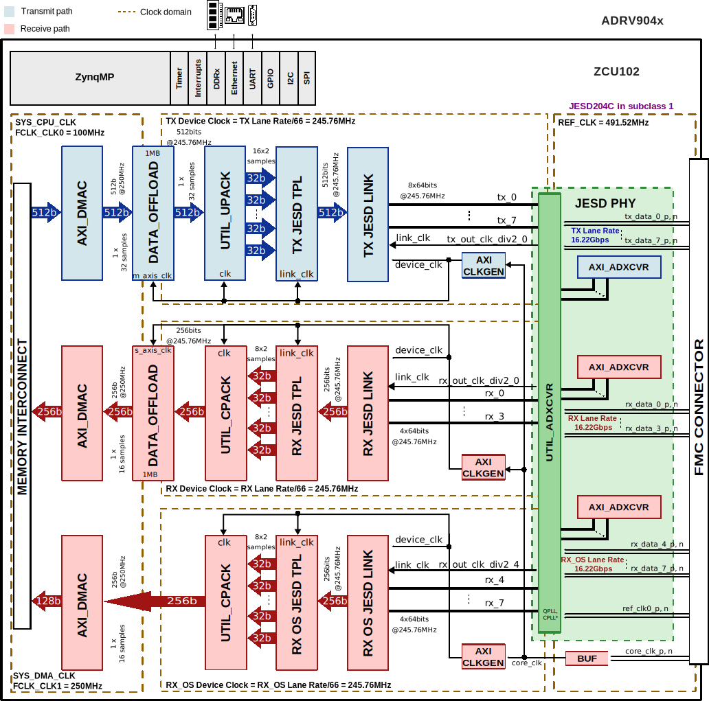

.. _adrv904x:

ADRV904x HDL reference design
===============================================================================

The ADRV904x is a highly integrated, system on chip (SoC) radio frequency (RF)
agile transceiver with integrated digital front end (DFE). The SoC contains
eight transmitters, two observation receivers for monitoring transmitter
channels, eight receivers, integrated LO and clock synthesizers, and digital
signal processing functions. The SoC meets the high radio performance and low
power consumption demanded by cellular infrastructure applications including
small cell basestation radios, macro 3G/4G/5G systems, and massive MIMO base
stations.

Supported devices
-------------------------------------------------------------------------------

- :adi:`ADRV9040`

Supported boards
-------------------------------------------------------------------------------

- :adi:`EVAL-ADRV904x`

Supported carriers
-------------------------------------------------------------------------------

.. list-table::
   :widths: 35 35 30
   :header-rows: 1

   * - Evaluation board
     - Carrier
     - FMC slot
   * - EVAL-ADRV904x
     - :xilinx:`ZCU102`
     - FMC HPC0

Block design
-------------------------------------------------------------------------------

Block diagram
~~~~~~~~~~~~~~~~~~~~~~~~~~~~~~~~~~~~~~~~~~~~~~~~~~~~~~~~~~~~~~~~~~~~~~~~~~~~~~~

The data path and clock domains are depicted in the below diagrams:

Example block design for Single link and RX OBS disabled
^^^^^^^^^^^^^^^^^^^^^^^^^^^^^^^^^^^^^^^^^^^^^^^^^^^^^^^^^^^^^^^^^^^^^^^^^^^^^^^

.. collapsible:: Click here for details on the block diagram modules

   .. list-table::
      :widths: 10 20 35 35
      :header-rows: 1

      * - Block name
        - IP name
        - Documentation
        - Additional info
      * - AXI_ADXCVR
        - :git-hdl:`axi_adxcvr <library/xilinx/axi_adxcvr>`
        - :ref:`axi_adxcvr`
        - 2 instances, one for Rx and one for Tx
      * - AXI_CLKGEN
        - :git-hdl:`axi_clkgen <library/axi_clkgen>`
        - :ref:`axi_clkgen`
        - 2 instances, one for Rx and one for Tx
      * - AXI_DMAC
        - :git-hdl:`axi_dmac <library/axi_dmac>`
        - :ref:`axi_dmac`
        - 2 instances, one for Rx and one for Tx
      * - DATA_OFFLOAD
        - :git-hdl:`data_offload <library/data_offload>`
        - :ref:`data_offload`
        - 2 instances, one for Rx and one for Tx
      * - RX JESD LINK
        - axi_adrv904x_rx_jesd
        - :ref:`axi_jesd204_rx`
        - Instantiaded by ``adi_axi_jesd204_rx_create`` procedure
      * - RX JESD TPL
        - rx_adrv904x_tpl_core
        - :ref:`ad_ip_jesd204_tpl_adc`
        - Instantiated by ``adi_tpl_jesd204_rx_create`` procedure
      * - TX JESD LINK
        - axi_adrv904x_tx_jesd
        - :ref:`axi_jesd204_tx`
        - Instantiaded by ``adi_axi_jesd204_tx_create`` procedure
      * - TX JESD TPL
        - tx_adrv904x_tpl_core
        - :ref:`ad_ip_jesd204_tpl_dac`
        - Instantiated by ``adi_tpl_jesd204_tx_create`` procedure
      * - UTIL_UPACK
        - :git-hdl:`util_upack2 <library/util_pack/util_upack2>`
        - :ref:`util_upack2`
        - ---
      * - UTIL_CPACK
        - :git-hdl:`util_cpack2 <library/util_pack/util_cpack2>`
        - :ref:`util_cpack2`
        - ---

The Rx links (ADC Path) operate with the following parameters:

- Rx Deframer parameters: L=8, M=16, F=4, S=1, NP=16, N=16
- Sample Rate: 491.52 MSPS
- Dual link: No
- RX_DEVICE_CLK: 245.76 MHz (Lane Rate/66)
- REF_CLK: 491.52 MHz (Lane Rate/33)
- JESD204C Lane Rate: 16.22 Gbps
- QPLL0

The Tx links (DAC Path) operate with the following parameters:

- Tx Deframer parameters: L=8, M=16, F=4, S=1, NP=16, N=16
- Sample Rate: 491.52 MSPS
- Dual link: No
- TX_DEVICE_CLK: 245.76 MHz (Lane Rate/66)
- REF_CLK: 491.52 MHz (Lane Rate/33)
- JESD204C Lane Rate: 16.22 Gbps
- QPLL0

Example block design for Single link and RX OBS in Non-LinkSharing mode
^^^^^^^^^^^^^^^^^^^^^^^^^^^^^^^^^^^^^^^^^^^^^^^^^^^^^^^^^^^^^^^^^^^^^^^^^^^^^^^

.. collapsible:: Click here for details on the block diagram modules

   .. list-table::
      :widths: 10 20 35 35
      :header-rows: 1

      * - Block name
        - IP name
        - Documentation
        - Additional info
      * - AXI_ADXCVR
        - :git-hdl:`axi_adxcvr <library/xilinx/axi_adxcvr>`
        - :ref:`axi_adxcvr`
        - 3 instances, one for Rx, one for Rx-os and one for Tx
      * - AXI_CLKGEN
        - :git-hdl:`axi_clkgen <library/axi_clkgen>`
        - :ref:`axi_clkgen`
        - 3 instances, one for Rx, one for Rx-os and one for Tx
      * - AXI_DMAC
        - :git-hdl:`axi_dmac <library/axi_dmac>`
        - :ref:`axi_dmac`
        - 3 instances, one for Rx, one for Rx-os and one for Tx
      * - DATA_OFFLOAD
        - :git-hdl:`data_offload <library/data_offload>`
        - :ref:`data_offload`
        - 3 instances, one for Rx, one for Rx-os and one for Tx
      * - RX JESD LINK
        - axi_adrv904x_rx_jesd
        - :ref:`axi_jesd204_rx`
        - Instantiaded by ``adi_axi_jesd204_rx_create`` procedure
      * - RX JESD TPL
        - rx_adrv904x_tpl_core
        - :ref:`ad_ip_jesd204_tpl_adc`
        - Instantiated by ``adi_tpl_jesd204_rx_create`` procedure
      * - RX OS JESD LINK
        - axi_adrv904x_rx_os_jesd
        - :ref:`axi_jesd204_rx`
        - Instantiaded by ``adi_axi_jesd204_rx_create`` procedure
      * - RX OS JESD TPL
        - rx_os_adrv904x_tpl_core
        - :ref:`ad_ip_jesd204_tpl_adc`
        - Instantiated by ``adi_tpl_jesd204_rx_create`` procedure
      * - TX JESD LINK
        - axi_adrv904x_tx_jesd
        - :ref:`axi_jesd204_tx`
        - Instantiaded by ``adi_axi_jesd204_tx_create`` procedure
      * - TX JESD TPL
        - tx_adrv904x_tpl_core
        - :ref:`ad_ip_jesd204_tpl_dac`
        - Instantiated by ``adi_tpl_jesd204_tx_create`` procedure
      * - UTIL_UPACK
        - :git-hdl:`util_upack2 <library/util_pack/util_upack2>`
        - :ref:`util_upack2`
        - ---
      * - UTIL_CPACK
        - :git-hdl:`util_cpack2 <library/util_pack/util_cpack2>`
        - :ref:`util_cpack2`
        - 2 instances one for Rx and one for Rx-os

The Rx links (ADC Path) operate with the following parameters:

- Rx Deframer parameters: L=4, M=8, F=4, S=1, NP=16, N=16
- Sample Rate: 491.52 MSPS
- Dual link: No
- RX_DEVICE_CLK: 245.76 MHz (Lane Rate/66)
- REF_CLK: 491.52 MHz
- JESD204C Lane Rate: 16.22 Gbps
- QPLL0

The Tx links (DAC Path) operate with the following parameters:

- Tx Deframer parameters: L=8, M=16, F=4, S=1, NP=16, N=16
- Sample Rate: 491.52 MSPS
- Dual link: No
- TX_DEVICE_CLK: 245.76 MHz (Lane Rate/66)
- REF_CLK: 491.52 MHz
- JESD204C Lane Rate: 16.22 Gbps
- QPLL0

The ORx links (ADC Obs Path) operate with the following parameters:

- ORx Deframer parameters: L=4, M=8, F=4, S=1, NP=16, N=16
- Sample Rate: 491.52 MSPS
- Dual link: No
- ORX_DEVICE_CLK: 245.76 MHz (Lane Rate/66)
- REF_CLK: 491.52 MHz
- JESD204C Lane Rate: 16.22 Gbps
- QPLL0

Configuration modes
~~~~~~~~~~~~~~~~~~~~~~~~~~~~~~~~~~~~~~~~~~~~~~~~~~~~~~~~~~~~~~~~~~~~~~~~~~~~~~~

The block design supports configuration of parameters and scales.

We have listed a couple of examples at section
`Building the HDL project`_ and the default modes
for each project.

.. note::

   The parameters for Rx or Tx links can be changed from the
   **system_project.tcl** file, located in
   hdl/projects/adrv904x/$CARRIER/system_project.tcl

.. math::
   Lane Rate = Sample Rate*\frac{M}{L}*N'* \frac{66}{64}

The following are the parameters of this project that can be configured:

- JESD_MODE: used link layer encoder mode

  - 64B66B - 64b66b link layer defined in JESD204C
  - 8B10B  - 8b10b link layer defined in JESD204B

- ORX_ENABLE: Additional data path for RX-OS

  - 0 - Disabled (used for profiles with RX-OS disabled)
  - 1 - Enabled (used for profiles with RX-OS enabled)

- RX_LANE_RATE: lane rate of the Rx link
- TX_LANE_RATE: lane rate of the Tx link
- [RX/TX/RX_OS]_JESD_M: number of converters per link
- [RX/TX/RX_OS]_JESD_L: number of lanes per link
- [RX/TX/RX_OS]_JESD_S: number of samples per frame
- [RX/TX/RX_OS]_JESD_NP: number of bits per sample
- [RX/TX/RX_OS]_NUM_LINKS: number of links

Clock scheme
~~~~~~~~~~~~~~~~~~~~~~~~~~~~~~~~~~~~~~~~~~~~~~~~~~~~~~~~~~~~~~~~~~~~~~~~~~~~~~~

.. image:: adrv904x_zcu102_clocking.svg
   :width: 500
   :align: center
   :alt: ADRV904x ZCU102 clock scheme

CPU/Memory interconnects addresses
~~~~~~~~~~~~~~~~~~~~~~~~~~~~~~~~~~~~~~~~~~~~~~~~~~~~~~~~~~~~~~~~~~~~~~~~~~~~~~~

The addresses are dependent on the architecture of the FPGA, having an offset
added to the base address from HDL (see more at :ref:`architecture cpu-intercon-addr`).

========================= ===========
Instance                  ZynqMP
========================= ===========
axi_adrv904x_tx_jesd      0x84A9_0000
axi_adrv904x_rx_jesd      0x84AA_0000
axi_adrv904x_rx_os_jesd   0x85AA_0000
axi_adrv904x_tx_dma       0x9C42_0000
axi_adrv904x_rx_dma       0x9C40_0000
axi_adrv904x_rx_os_dma    0x9C80_0000
tx_adrv904x_tpl_core      0x84A0_4000
rx_adrv904x_tpl_core      0x84A0_0000
rx_os_adrv904x_tpl_core   0x84A0_8000
axi_adrv904x_tx_xcvr      0x84A8_0000
axi_adrv904x_rx_xcvr      0x84A6_0000
axi_adrv904x_rx_os_xcvr   0x85A6_0000
axi_adrv904x_tx_clkgen    0x83C0_0000
axi_adrv904x_rx_clkgen    0x83C1_0000
axi_adrv904x_rx_os_clkgen 0x83C2_0000
adrv904x_tx_data_offload  0x9C44_0000
adrv904x_rx_data_offload  0x9C45_0000
========================= ===========

SPI connections
~~~~~~~~~~~~~~~~~~~~~~~~~~~~~~~~~~~~~~~~~~~~~~~~~~~~~~~~~~~~~~~~~~~~~~~~~~~~~~~

.. list-table::
   :widths: 25 25 25 25
   :header-rows: 1

   * - SPI type
     - SPI manager instance
     - SPI subordinate
     - CS
   * - PS
     - spi0
     - ADRV904x
     - 0
   * -
     -
     - AD9528
     - 1

GPIOs
~~~~~~~~~~~~~~~~~~~~~~~~~~~~~~~~~~~~~~~~~~~~~~~~~~~~~~~~~~~~~~~~~~~~~~~~~~~~~~~

.. list-table::
   :widths: 25 20 20 15
   :header-rows: 2

   * - GPIO signal
     - Direction
     - HDL GPIO EMIO
     - Software GPIO
   * -
     - (from FPGA view)
     -
     - Zynq MP
   * - ad9528_reset_b
     - INOUT
     - 69
     - 147
   * - ad9528_sysref_req
     - INOUT
     - 68
     - 146
   * - adrv904x_trx0_enable
     - INOUT
     - 67
     - 145
   * - adrv904x_trx1_enable
     - INOUT
     - 66
     - 144
   * - adrv904x_trx2_enable
     - INOUT
     - 65
     - 143
   * - adrv904x_trx3_enable
     - INOUT
     - 64
     - 142
   * - adrv904x_trx4_enable
     - INOUT
     - 63
     - 141
   * - adrv904x_trx5_enable
     - INOUT
     - 62
     - 140
   * - adrv904x_trx6_enable
     - INOUT
     - 61
     - 139
   * - adrv904x_trx7_enable
     - INOUT
     - 60
     - 138
   * - adrv904x_orx0_enable
     - INOUT
     - 59
     - 137
   * - adrv904x_orx1_enable
     - INOUT
     - 58
     - 136
   * - adrv904x_test
     - INOUT
     - 57
     - 135
   * - adrv904x_reset_b
     - INOUT
     - 56
     - 134
   * - adrv904x_gpio[0:23]
     - INOUT
     - 55:32
     - 133:110

Interrupts
~~~~~~~~~~~~~~~~~~~~~~~~~~~~~~~~~~~~~~~~~~~~~~~~~~~~~~~~~~~~~~~~~~~~~~~~~~~~~~~

Below are the Programmable Logic interrupts used in this project.

======================== === ============ =============
Instance name            HDL Linux ZynqMP Actual ZynqMP
======================== === ============ =============
axi_adrv904x_tx_jesd     10  106          138
axi_adrv904x_rx_jesd     11  107          139
axi_adrv904x_rx_os_jesd  12  108          140
axi_adrv904x_tx_dma      13  109          141
axi_adrv904x_rx_dma      14  110          142
axi_adrv904x_rx_os_dma   15  111          143
======================== === ============ =============

Building the HDL project
-------------------------------------------------------------------------------

The design is built upon ADI's generic HDL reference design framework.
ADI distributes the bit/elf files of these projects as part of the
:dokuwiki:`ADI Kuiper Linux <resources/tools-software/linux-software/kuiper-linux>`.
If you want to build the sources, ADI makes them available on the
:git-hdl:`HDL repository </>`. To get the source you must
`clone <https://git-scm.com/book/en/v2/Git-Basics-Getting-a-Git-Repository>`__
the HDL repository.

Then go to the :git-hdl:`projects/adrv904x <projects/adrv904x>`
location and run the make command by typing in your command prompt:

**Linux/Cygwin/WSL**

.. shell::

   $cd hdl/projects/adrv904x/zcu102
   $make

The following dropdowns contain tables with the parameters that can be used to
configure this project, depending on the carrier used.
Where a cell contains a --- (dash) it means that the parameter doesn't exist
for that project (adrv904x/carrier or adrv904x/carrier).

.. collapsible:: Default values of the ``make`` parameters for ADRV904x

   +-------------------+------------------------------------------------------+
   | Parameter         | Default value of the parameters depending on carrier |
   +-------------------+------------------------------------------------------+
   |                   |                         ZCU102                       |
   +===================+======================================================+
   | JESD_MODE         |                         64B66B                       |
   +-------------------+------------------------------------------------------+
   | ORX_ENABLE        |                           0                          |
   +-------------------+------------------------------------------------------+
   | RX_LANE_RATE      |                         16.22                        |
   +-------------------+------------------------------------------------------+
   | TX_LANE_RATE      |                         16.22                        |
   +-------------------+------------------------------------------------------+
   | TX_NUM_LINKS      |                           1                          |
   +-------------------+------------------------------------------------------+
   | RX_NUM_LINKS      |                           1                          |
   +-------------------+------------------------------------------------------+
   | RX_OS_NUM_LINKS   |                           1                          |
   +-------------------+------------------------------------------------------+
   | RX_JESD_M         |                          16                          |
   +-------------------+------------------------------------------------------+
   | RX_JESD_L         |                           8                          |
   +-------------------+------------------------------------------------------+
   | RX_JESD_S         |                           1                          |
   +-------------------+------------------------------------------------------+
   | TX_JESD_M         |                          16                          |
   +-------------------+------------------------------------------------------+
   | TX_JESD_L         |                           8                          |
   +-------------------+------------------------------------------------------+
   | TX_JESD_S         |                           1                          |
   +-------------------+------------------------------------------------------+
   | RX_OS_JESD_M      |                           0                          |
   +-------------------+------------------------------------------------------+
   | RX_OS_JESD_L      |                           0                          |
   +-------------------+------------------------------------------------------+
   | RX_OS_JESD_S      |                           0                          |
   +-------------------+------------------------------------------------------+

A more comprehensive build guide can be found in the :ref:`build_hdl` user guide.

Other considerations
-------------------------------------------------------------------------------

ADC - lane mapping
~~~~~~~~~~~~~~~~~~~~~~~~~~~~~~~~~~~~~~~~~~~~~~~~~~~~~~~~~~~~~~~~~~~~~~~~~~~~~~~

Due to physical constraints, Rx lanes are reordered as described in the
following table.

============ ===========================
ADC phy Lane FPGA Rx lane / Logical Lane
============ ===========================
0            0
1            1
2            2
3            3
4            4
5            5
6            6
7            7
============ ===========================

DAC - lane mapping
~~~~~~~~~~~~~~~~~~~~~~~~~~~~~~~~~~~~~~~~~~~~~~~~~~~~~~~~~~~~~~~~~~~~~~~~~~~~~~~

Due to physical constraints, Tx lanes are reordered as described in the
following table.

============ ===========================
DAC phy lane FPGA Tx lane / Logical lane
============ ===========================
0            7
1            6
2            4
3            5
4            3
5            1
6            0
7            2
============ ===========================

Resources
-------------------------------------------------------------------------------

Systems related
~~~~~~~~~~~~~~~~~~~~~~~~~~~~~~~~~~~~~~~~~~~~~~~~~~~~~~~~~~~~~~~~~~~~~~~~~~~~~~~

- :dokuwiki:`[Wiki] ADRV904x Prototyping Platform User Guide <resources/eval/user-guides/adrv904x>`

Here you can find the quick start guides available for these evaluation boards:

.. list-table::
   :widths: 10 10
   :header-rows: 1

   * - Evaluation board
     - Zynq UltraScale+ MP
   * - ADRV904x
     - :dokuwiki:`ZCU102 <resources/eval/user-guides/adrv904x/quickstart/zynqmp>`

Hardware related
~~~~~~~~~~~~~~~~~~~~~~~~~~~~~~~~~~~~~~~~~~~~~~~~~~~~~~~~~~~~~~~~~~~~~~~~~~~~~~~

- Product datasheets: :adi:`ADRV9040`

HDL related
~~~~~~~~~~~~~~~~~~~~~~~~~~~~~~~~~~~~~~~~~~~~~~~~~~~~~~~~~~~~~~~~~~~~~~~~~~~~~~~

- :git-hdl:`ADRV904x HDL project source code <projects/adrv904x>`

.. list-table::
   :widths: 30 40 35
   :header-rows: 1

   * - IP name
     - Source code link
     - Documentation link
   * - AXI_CLKGEN
     - :git-hdl:`library/axi_clkgen`
     - :ref:`axi_clkgen`
   * - AXI_DMAC
     - :git-hdl:`library/axi_dmac`
     - :ref:`axi_dmac`
   * - AXI_SYSID
     - :git-hdl:`library/axi_sysid`
     - :ref:`axi_sysid`
   * - SYSID_ROM
     - :git-hdl:`library/sysid_rom`
     - :ref:`axi_sysid`
   * - UTIL_CPACK2
     - :git-hdl:`library/util_pack/util_cpack2`
     - :ref:`util_cpack2`
   * - UTIL_UPACK2
     - :git-hdl:`library/util_pack/util_upack2`
     - :ref:`util_upack2`
   * - DATA_OFFLOAD
     - :git-hdl:`library/data_offload`
     - :ref:`data_offload`
   * - UTIL_DO_RAM
     - :git-hdl:`library/util_do_ram`
     - :ref:`data_offload`
   * - UTIL_ADXCVR for AMD
     - :git-hdl:`library/xilinx/util_adxcvr`
     - :ref:`util_adxcvr`
   * - AXI_ADXCVR for AMD
     - :git-hdl:`library/xilinx/axi_adxcvr`
     - :ref:`axi_adxcvr amd`
   * - AXI_JESD204_RX
     - :git-hdl:`library/jesd204/axi_jesd204_rx`
     - :ref:`axi_jesd204_rx`
   * - AXI_JESD204_TX
     - :git-hdl:`library/jesd204/axi_jesd204_tx`
     - :ref:`axi_jesd204_tx`
   * - JESD204_TPL_ADC
     - :git-hdl:`library/jesd204/ad_ip_jesd204_tpl_adc`
     - :ref:`ad_ip_jesd204_tpl_dac`
   * - JESD204_TPL_DAC
     - :git-hdl:`library/jesd204/ad_ip_jesd204_tpl_dac`
     - :ref:`ad_ip_jesd204_tpl_dac`

- :ref:`jesd204`

Software related
~~~~~~~~~~~~~~~~~~~~~~~~~~~~~~~~~~~~~~~~~~~~~~~~~~~~~~~~~~~~~~~~~~~~~~~~~~~~~~~

- :dokuwiki:`[Wiki] ADRV904x Linux driver wiki page <resources/tools-software/linux-drivers/iio-transceiver/adrv904x>`

.. include:: ../common/more_information.rst

.. include:: ../common/support.rst

