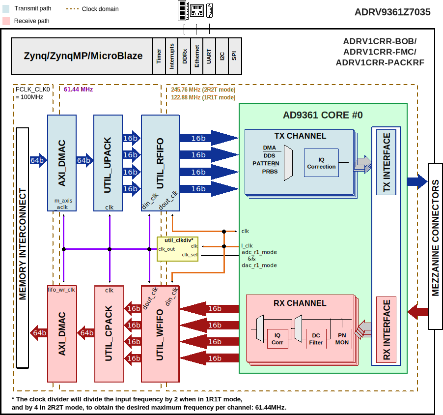

.. _adrv9361z7035:

ADRV9361Z7035 HDL Project
===============================================================================

Overview
-------------------------------------------------------------------------------

The :adi:`ADRV9361-Z7035` is built on a portfolio of highly integrated
System-On-Module (SOMs) based on the Xilinx Zynq-7000 All Programmable (AP) SoC.
Starting with the :adi:`AD9361`, it is schematically & HDL similar to the
:ref:`fmcomms2`.

The purpose of the :adi:`ADRV9361-Z7035` RF SOM is to provide an RF platform to
software developers, system architects, product developers, etc, who want a
single platform operating over a wide tuning range (70 MHz - 6 GHz) that is
capable of being used for prototype, evaluation and reference design to help
with production volume.

Supported boards
-------------------------------------------------------------------------------

- :adi:`ADRV9361-Z7035`

Supported devices
-------------------------------------------------------------------------------

- :adi:`AD9361`

Supported carriers
-------------------------------------------------------------------------------

- :adi:`ADRV1CRR-BOB`
- :dokuwiki:`ADRV1CRR-FMC <resources/eval/user-guides/pzsdr/carriers/packrf>`
- :adi:`ADRV1CRR-FMC`
- ADRV1CRR-PCI (OBSOLETE)
- ADRV1CRR-USB (OBSOLETE)

Block design
-------------------------------------------------------------------------------

The block design is very similar to :ref:`fmcomms2`.

Block diagram
~~~~~~~~~~~~~~~~~~~~~~~~~~~~~~~~~~~~~~~~~~~~~~~~~~~~~~~~~~~~~~~~~~~~~~~~~~~~~~~

The data path and clock domains are depicted in the below diagram.

Configuration modes
~~~~~~~~~~~~~~~~~~~~~~~~~~~~~~~~~~~~~~~~~~~~~~~~~~~~~~~~~~~~~~~~~~~~~~~~~~~~~~~

The :git-hdl:`AD9361 IP <library/axi_ad9361>` in this HDL project is configured
to work in both CMOS and LVDS interfaces; it supports two configuration modes:

- 2R2T - 2x receive and 2x transmit RF channels
- 1R1T - 1x receive and 1x transmit RF channel

Both support only the **dual port half duplex** operating mode. The maximum
data rate (for combined I and Q words) is 61.44MSPS in DDR. For more details
about these modes, check the `AD9361 Reference Manual`_, Table 48 "Maximum Data
Rates and Signal Bandwidths".

CPU/Memory interconnects addresses
~~~~~~~~~~~~~~~~~~~~~~~~~~~~~~~~~~~~~~~~~~~~~~~~~~~~~~~~~~~~~~~~~~~~~~~~~~~~~~~

The addresses are dependent on the architecture of the FPGA, having an offset
added to the base address from HDL (see more at :ref:`architecture cpu-intercon-addr`).

================== ===========
Instance           Zynq
================== ===========
axi_iic_main       0x4160_0000
axi_sysid_0        0x4500_0000
axi_ad9361_adc_dma 0x7C40_0000
axi_ad9361_dac_dma 0x7C42_0000
axi_ad9361         0x7902_0000
================== ===========

I2C connections
~~~~~~~~~~~~~~~~~~~~~~~~~~~~~~~~~~~~~~~~~~~~~~~~~~~~~~~~~~~~~~~~~~~~~~~~~~~~~~~

.. list-table::
   :widths: 20 20 20 20 20
   :header-rows: 1

   * - I2C type
     - I2C manager instance
     - Alias
     - Address
     - I2C subordinate
   * - PL
     - iic_main
     - axi_iic_main
     - 0x4160_0000
     - ---

SPI connections
~~~~~~~~~~~~~~~~~~~~~~~~~~~~~~~~~~~~~~~~~~~~~~~~~~~~~~~~~~~~~~~~~~~~~~~~~~~~~~~

The SPI signals are controlled by a separate AXI based SPI core.

.. list-table::
   :widths: 25 25 25 25
   :header-rows: 1

   * - SPI type
     - SPI manager instance
     - SPI subordinate
     - CS
   * - HPS
     - SPI 0
     - AD9361
     - 0

GPIOs
~~~~~~~~~~~~~~~~~~~~~~~~~~~~~~~~~~~~~~~~~~~~~~~~~~~~~~~~~~~~~~~~~~~~~~~~~~~~~~~

The Software GPIO number is calculated as follows:

- Zynq-7000: if PS7 is used, then offset is 54

.. list-table::
   :widths: 25 25 25 25
   :header-rows: 2

   * - GPIO signal
     - Direction
     - HDL GPIO EMIO
     - Software GPIO
   * -
     - (from FPGA view)
     -
     - Zynq-7000
   * - gpio_clksel
     - INOUT
     - 51
     - 105
   * - gpio_resetb
     - INOUT
     - 46
     - 100
   * - gpio_sync
     - INOUT
     - 45
     - 99
   * - gpio_en_agc
     - INOUT
     - 44
     - 98
   * - gpio_ctl[3:0]
     - INOUT
     - 43:40
     - 97:94
   * - gpio_status[7:0]
     - INOUT
     - 39:32
     - 93:86

Interrupts
~~~~~~~~~~~~~~~~~~~~~~~~~~~~~~~~~~~~~~~~~~~~~~~~~~~~~~~~~~~~~~~~~~~~~~~~~~~~~~~

Below are the Programmable Logic interrupts used in the project.

================== === ========== ===========
Instance name      HDL Linux Zynq Actual Zynq
================== === ========== ===========
axi_ad9361_adc_dma 13  57         89
axi_ad9361_dac_dma 12  56         88
axi_ad9361         11  55         87
================== === ========== ===========

Building the HDL project
-------------------------------------------------------------------------------

The design is built upon ADI's generic HDL reference design framework.
ADI distributes the bit/elf files of these projects as part of the
:dokuwiki:`ADI Kuiper Linux <resources/tools-software/linux-software/kuiper-linux>`.
If you want to build the sources, ADI makes them available on the
:git-hdl:`HDL repository </>`. To get the source you must
`clone <https://git-scm.com/book/en/v2/Git-Basics-Getting-a-Git-Repository>`__
the HDL repository.

Go to the hdl/projects/**adrv9361z7035**/$carrier location and run the make
command.

**Linux/Cygwin/WSL**

.. shell::

   $cd hdl/projects/adrv9361z7035/ccbob_cmos
   $make

.. collapsible:: Supported SOM & Carriers

   ============= ================================================
   Directory     Description
   ============= ================================================
   ccbob_cmos    ADRV9361Z7035-SOM (CMOS Mode) + ADRV1CRR-BOB
   ccbob_lvds    ADRV9361Z7035-SOM (LVDS Mode) + ADRV1CRR-BOB
   ccpackrf_lvds ADRV9361Z7035-SOM (LVDS Mode) + ADRV1CRR-PACKRF*
   ccfmc_lvds    ADRV9361Z7035-SOM (LVDS Mode) + ADRV1CRR-FMC
   ccpci_lvds    ADRV9361Z7035-SOM (LVDS Mode) + ADRV1CRR-PCI
   ccusb_lvds    ADRV9361Z7035-SOM (LVDS Mode) + ADRV1CRR-USB
   ============= ================================================

   .. admonition:: Legend
      :class: note

      - ``*`` removed; last release that supported the project is
        :git-hdl:`hdl_2021_r2 <hdl_2021_r2:projects/adrv9361z7035/ccpackrf_lvds>`

.. collapsible:: Board Design Files (Vivado IPI)

   =========================== =====================================
   Directory/File              Description
   =========================== =====================================
   common/adrv9361z7035_bd.tcl ADRV9361Z7035-SOM board design file.
   common/ccbob_bd.tcl         carrier, break out board design file.
   common/ccfmc_bd.tcl         carrier, fmc board design file.
   common/ccpci_bd.tcl         carrier, pci-e board design file.
   common/ccusb_bd.tcl         carrier, usb board design file.
   =========================== =====================================

   .. note::

      FMC & BOB carrier designs include loopback daughtercards for connectivity
      testing.

.. collapsible:: Board Constraint Files (pin-out & io-standard)

   +-------------------------------+--------------------------------------+
   | Directory/File                | Description                          |
   +===============================+======================================+
   | common/                       | ADRV9361Z7035-SOM base constraints   |
   | adrv9361z7035_constr.xdc      | file.                                |
   +-------------------------------+--------------------------------------+
   | common/                       | ADRV9361Z7035-SOM CMOS mode          |
   | adrv9361z7035_constr_cmos.xdc | constraints file.                    |
   +-------------------------------+--------------------------------------+
   | common/                       | ADRV9361Z7035-SOM LVDS mode          |
   | adrv9361z7035_constr_lvds.xdc | constraints file.                    |
   +-------------------------------+--------------------------------------+
   | common/ccbob_constr.xdc       | carrier, break out board constraints |
   |                               | file.                                |
   +-------------------------------+--------------------------------------+
   | common/ccfmc_constr.xdc       | carrier, fmc board constraints file. |
   +-------------------------------+--------------------------------------+
   | common/ccpci_constr.xdc       | carrier, pci-e board constraints     |
   |                               | file.                                |
   +-------------------------------+--------------------------------------+
   | common/ccusb_constr.xdc       | carrier, usb board constraints file. |
   +-------------------------------+--------------------------------------+

   .. note::

      FMC & BOB carrier designs include loopback daughtercards for connectivity
      testing.

A more comprehensive build guide can be found in the :ref:`build_hdl` user guide.

Resources
-------------------------------------------------------------------------------

Systems related
~~~~~~~~~~~~~~~~~~~~~~~~~~~~~~~~~~~~~~~~~~~~~~~~~~~~~~~~~~~~~~~~~~~~~~~~~~~~~~~

- :dokuwiki:`ADRV9361-Z7035 quick start guide<resources/eval/user-guides/adrv9361-z7035>`

Hardware related
~~~~~~~~~~~~~~~~~~~~~~~~~~~~~~~~~~~~~~~~~~~~~~~~~~~~~~~~~~~~~~~~~~~~~~~~~~~~~~~

- `AD9361 reference manual <https://ez.analog.com/cfs-file/__key/telligent-evolution-components-attachments/00-441-00-00-00-07-91-97/AD9361_5F00_Reference_5F00_Manual_5F00_UG_2D00_570.pdf>`__
- Product datasheet :adi:`AD9361`

HDL related
~~~~~~~~~~~~~~~~~~~~~~~~~~~~~~~~~~~~~~~~~~~~~~~~~~~~~~~~~~~~~~~~~~~~~~~~~~~~~~~

- :git-hdl:`ADRV9361-Z7035 HDL project source code <projects/adrv9361z7035>`

.. list-table::
   :widths: 30 35 35
   :header-rows: 1

   * - IP name
     - Source code link
     - Documentation link
   * - AXI_AD9361
     - :git-hdl:`library/axi_ad9361`
     - :ref:`axi_ad9361`
   * - AXI_CLKGEN
     - :git-hdl:`library/axi_clkgen` *
     - :ref:`axi_clkgen`
   * - AXI_DMAC
     - :git-hdl:`library/axi_dmac`
     - :ref:`axi_dmac`
   * - AXI_GPREG
     - :git-hdl:`library/axi_gpreg` **
     - ---
   * - AXI_HDMI_TX
     - :git-hdl:`library/axi_hdmi_tx` *
     - :ref:`axi_hdmi_tx`
   * - AXI_I2S_ADI
     - :git-hdl:`library/axi_i2s_adi` *
     - ---
   * - AXI_SPDIF_TX
     - :git-hdl:`library/axi_spdif_tx` *
     - ---
   * - AXI_SYSID
     - :git-hdl:`library/axi_sysid`
     - :ref:`axi_sysid`
   * - SYSID_ROM
     - :git-hdl:`library/sysid_rom`
     - :ref:`axi_sysid`
   * - UTIL_CPACK2
     - :git-hdl:`library/util_pack/util_cpack2`
     - :ref:`util_cpack2`
   * - UTIL_RFIFO
     - :git-hdl:`library/util_rfifo`
     - :ref:`util_rfifo`
   * - UTIL_TDD_SYNC
     - :git-hdl:`library/util_tdd_sync`
     - ---
   * - UTIL_UPACK2
     - :git-hdl:`library/util_pack/util_upack2`
     - :ref:`util_upack2`
   * - UTIL_WFIFO
     - :git-hdl:`library/util_wfifo`
     - :ref:`util_wfifo`
   * - AXI_XCVRLB
     - :git-hdl:`library/xilinx/axi_xcvrlb` **
     - ---
   * - UTIL_CLKDIV
     - :git-hdl:`library/xilinx/util_clkdiv`
     - ---

.. admonition:: Legend
   :class: note

   - ``*`` only used for ccfmc_lvds (ADRV1CRR-FMC)
   - ``**`` only used for ccbob_cmos (ADRV1CRR-BOB), ccbob_lvds (ADRV1CRR-BOB), ccfmc_lvds (ADRV1CRR-FMC)

Software related
~~~~~~~~~~~~~~~~~~~~~~~~~~~~~~~~~~~~~~~~~~~~~~~~~~~~~~~~~~~~~~~~~~~~~~~~~~~~~~~

- :git-linux:`ADRV9361-Z7035 ccbob_cmos Linux device tree <arch/arm/boot/dts/xilinx/zynq-adrv9361-z7035-bob-cmos.dts>`
- :git-linux:`ADRV9361-Z7035 ccbob_lvds Linux device tree <arch/arm/boot/dts/xilinx/zynq-adrv9361-z7035-bob.dts>`
- :git-linux:`ADRV9361-Z7035 ccfmc_lvds Linux device tree <arch/arm/boot/dts/xilinx/zynq-adrv9361-z7035-fmc.dts>`
- :git-linux:`ADRV9361-Z7035 ccfmc_lvds Linux device tree <arch/arm/boot/dts/xilinx/zynq-adrv9361-z7035-userspace.dts>`
- :git-linux:`ADRV9361-Z7035 ccfmc_lvds Linux device tree - TDD mode <arch/arm/boot/dts/xilinx/zynq-adrv9361-z7035-fmc-rfcard-tdd.dts>`

- :dokuwiki:`[Wiki] ADRV9361-Z7035 User Guide - Software documentation<resources/eval/user-guides/adrv936x_rfsom/user-guide/software>`
- :dokuwiki:`[Wiki] AD9361 Linux device driver documentation <resources/tools-software/linux-drivers/iio-transceiver/ad9361>`

.. include:: ../common/more_information.rst

.. include:: ../common/support.rst

.. _AD9361 Reference Manual: https://ez.analog.com/cfs-file/__key/telligent-evolution-components-attachments/00-441-00-00-00-07-91-97/AD9361_5F00_Reference_5F00_Manual_5F00_UG_2D00_570.pdf
