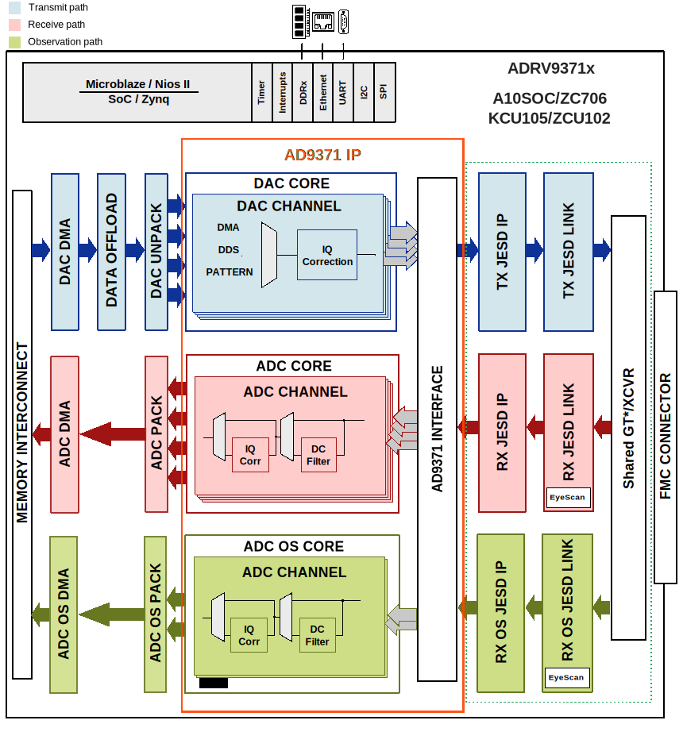

.. _adrv9371x:

ADRV9371x HDL reference design
===============================================================================

The ADRV371x HDL reference design is an embedded system built around a
processor core either ARM, NIOS-II or MicroBlaze. The device digital interface
is handled by the transceiver IP followed by the JESD204B and device specific
cores. The JESD204B lanes are shared among the 4 transmit, 4 receive and
2 observation/sniffer receive data paths by the same set of transceivers within
the IP. The cores are programmable through an AXI-lite interface. The
delineated data is then passed on to independent DMA cores for the transmit,
receive and observation/sniffer paths.

Supported boards
-------------------------------------------------------------------------------

- :adi:`ADRV9371 <EVAL-ADRV9371>`

Supported devices
-------------------------------------------------------------------------------

- :adi:`AD9371`

Supported carriers
-------------------------------------------------------------------------------

.. list-table::
   :widths: 35 35 30
   :header-rows: 1

   * - Evaluation board
     - Carrier
     - FMC slot
   * - :adi:`ADRV9371 <EVAL-ADRV9371>`
     - :intel:`A10SoC <content/www/us/en/products/details/fpga/development-kits/arria/10-sx.html>`
     - FMCA
   * -
     - :xilinx:`KCU105`
     - FMC_HPC
   * -
     - :xilinx:`ZC706`
     - FMC_HPC
   * -
     - :xilinx:`ZCU102`
     - FMC HPC0

Block design
-------------------------------------------------------------------------------

Block diagram
~~~~~~~~~~~~~~~~~~~~~~~~~~~~~~~~~~~~~~~~~~~~~~~~~~~~~~~~~~~~~~~~~~~~~~~~~~~~~~~

The data path and clock domains are depicted in the below diagrams:

Example block design for Single link; M=4; L=4
^^^^^^^^^^^^^^^^^^^^^^^^^^^^^^^^^^^^^^^^^^^^^^^^^^^^^^^^^^^^^^^^^^^^^^^^^^^^^^^

The Rx links (ADC Path) operate with the following parameters:

- Rx Deframer parameters: L=2, M=4, F=4, S=1, NP=16, N=16
- Sample Rate: 122.88 MSPS
- Dual link: No
- RX_DEVICE_CLK: 122.88 MHz (Lane Rate/40)
- REF_CLK: 122.88 MHz (Lane Rate/40)
- JESD204B Lane Rate: 4.915 Gbps
- QPLL0 or CPLL

The ORx links (ADC Path) operate with the following parameters:

- ORx Deframer parameters: L=2, M=2, F=2, S=1, NP=16, N=16
- Sample Rate: 245.76 MSPS
- Dual link: No
- ORX_DEVICE_CLK: 122.88 MHz (Lane Rate/40)
- REF_CLK: 122.88 MHz (Lane Rate/40)
- JESD204B Lane Rate: 4.915 Gbps
- QPLL0 or CPLL

The Tx links (DAC Path) operate with the following parameters:

- Tx Framer parameters: L=4, M=4, F=4, S=1, NP=16, N=16
- Sample Rate: 245.76 MSPS
- Dual link: No
- TX_DEVICE_CLK: 122.88 MHz (Lane Rate/40)
- REF_CLK: 122.88 MHz (Lane Rate/40)
- JESD204B Lane Rate: 4.915 Gbps
- QPLL0 or CPLL

Digital Interface
~~~~~~~~~~~~~~~~~~~~~~~~~~~~~~~~~~~~~~~~~~~~~~~~~~~~~~~~~~~~~~~~~~~~~~~~~~~~~~~

The digital interface consists of 4 transmit, 2 receive and 2
observation/sniffer lanes running up to 6Gbps (default is 4Gbps). The
transceivers then interfaces to the cores at 128bits @122MHz in the transmit
and 64bits @122MHz for the receive channels. The sniffer/observation rates
depends on the mode selected. The data is sent or received based on the
configuration (programmable) from separate transmit and receive chains.

DAC Interface
~~~~~~~~~~~~~~~~~~~~~~~~~~~~~~~~~~~~~~~~~~~~~~~~~~~~~~~~~~~~~~~~~~~~~~~~~~~~~~~

The DAC data may be sourced from an internal data generator (DDS or pattern)
or from the external DDR via DMA. The internal DDS phase and frequency are
programmable. :git-hdl:`DAC unpack IP <library/util_pack/util_upack2>` allows
transfering data from the DMA to a reduced number of channels, at a higher
rate.

ADC Interface
~~~~~~~~~~~~~~~~~~~~~~~~~~~~~~~~~~~~~~~~~~~~~~~~~~~~~~~~~~~~~~~~~~~~~~~~~~~~~~~

The ADC data is sent to the DDR via DMA. The
:git-hdl:`ADC pack IP <library/util_pack/util_cpack2>` allows capturing only
part of the channels.

Control and SPI
~~~~~~~~~~~~~~~~~~~~~~~~~~~~~~~~~~~~~~~~~~~~~~~~~~~~~~~~~~~~~~~~~~~~~~~~~~~~~~~

The device control and monitor signals are interfaced to a GPIO module. The SPI
signals are controlled by a separate AXI based SPI core.

Configuration modes
~~~~~~~~~~~~~~~~~~~~~~~~~~~~~~~~~~~~~~~~~~~~~~~~~~~~~~~~~~~~~~~~~~~~~~~~~~~~~~~

The block design supports configuration of parameters and scales.

We have listed a couple of examples at section
`Building the HDL project`_ and the default modes
for each project.

.. note::

   The parameters for Rx or Tx links can be changed from the
   **system_project.tcl** file, located in
   hdl/projects/adrv9371x/$CARRIER/system_project.tcl

.. math::
   Lane Rate = Sample Rate*\frac{M}{L}*N'* \frac{10}{8}

The following are the parameters of this project that can be configured:

- [RX/TX/RX_OS]_JESD_M: number of converters per link
- [RX/TX/RX_OS]_JESD_L: number of lanes per link
- [RX/TX/RX_OS]_JESD_S: number of samples per frame

CPU/Memory interconnects addresses
~~~~~~~~~~~~~~~~~~~~~~~~~~~~~~~~~~~~~~~~~~~~~~~~~~~~~~~~~~~~~~~~~~~~~~~~~~~~~~~

The addresses are dependent on the architecture of the FPGA, having an offset
added to the base address from HDL (see more at :ref:`architecture cpu-intercon-addr`).

========================= =============== ===========
Instance                  Zynq/Microblaze ZynqMP
========================= =============== ===========
rx_adrv9009_tpl_core      0x44A0_0000     0x84A0_0000
tx_adrv9009_tpl_core      0x44A0_4000     0x84A0_4000
rx_os_adrv9009_tpl_core   0x44A0_8000     0x84A0_8000
axi_adrv9009_rx_xcvr      0x44A6_0000     0x84A6_0000
axi_adrv9009_tx_xcvr      0x44A8_0000     0x84A8_0000
axi_adrv9009_rx_os_xcvr   0x44A5_0000     0x84A5_0000
axi_adrv9009_tx_jesd      0x44A9_0000     0x84A9_0000
axi_adrv9009_rx_jesd      0x44AA_0000     0x84AA_0000
axi_adrv9009_rx_os_jesd   0x44AB_0000     0x84AB_0000
axi_adrv9009_rx_dma       0x7C40_0000     0x9C40_0000
axi_adrv9009_tx_dma       0x7C42_0000     0x9C42_0000
axi_adrv9009_rx_os_dma    0x7C44_0000     0x9C44_0000
axi_adrv9009_rx_clkgen    0x43C1_0000     0x83C1_0000
axi_adrv9009_tx_clkgen    0x43C0_0000     0x83C0_0000
axi_adrv9009_rx_os_clkgen 0x43C2_0000     0x83C2_0000
========================= =============== ===========

SPI connections
~~~~~~~~~~~~~~~~~~~~~~~~~~~~~~~~~~~~~~~~~~~~~~~~~~~~~~~~~~~~~~~~~~~~~~~~~~~~~~~

.. list-table::
   :widths: 25 25 25 25
   :header-rows: 1

   * - SPI type
     - SPI manager instance
     - SPI subordinate
     - CS
   * - PS
     - spi0
     - AD9528
     - 0
   * -
     -
     - ADRV9371
     - 1

GPIOs
~~~~~~~~~~~~~~~~~~~~~~~~~~~~~~~~~~~~~~~~~~~~~~~~~~~~~~~~~~~~~~~~~~~~~~~~~~~~~~~

.. list-table::
   :widths: 25 20 20 15
   :header-rows: 2

   * - GPIO signal
     - Direction
     - HDL GPIO EMIO
     - Software GPIO
   * -
     - (from FPGA view)
     -
     - Zynq MP
   * - ad9528_reset_b
     - INOUT
     - 59
     - 137
   * - ad9528_sysref_req
     - INOUT
     - 58
     - 136
   * - adrv9371_tx1_enable
     - INOUT
     - 57
     - 135
   * - adrv9371_tx2_enable
     - INOUT
     - 56
     - 134
   * - adrv9371_rx1_enable
     - INOUT
     - 55
     - 133
   * - adrv9371_rx2_enable
     - INOUT
     - 54
     - 132
   * - adrv9371_test
     - INOUT
     - 53
     - 131
   * - adrv9371_reset_b
     - INOUT
     - 52
     - 130
   * - adrv9371_gpint
     - INOUT
     - 51
     - 129
   * - adrv9371_gpio_{00:18}
     - INOUT
     - 50:32
     - 128:110

Interrupts
~~~~~~~~~~~~~~~~~~~~~~~~~~~~~~~~~~~~~~~~~~~~~~~~~~~~~~~~~~~~~~~~~~~~~~~~~~~~~~~

Below are the Programmable Logic interrupts used in this project.

======================= === ========== =========== ============ =============
Instance name           HDL Linux Zynq Actual Zynq Linux ZynqMP Actual ZynqMP
======================= === ========== =========== ============ =============
axi_adrv9371_rx_os_jesd 8   52         84          104          136
axi_adrv9371_tx_jesd    9   53         85          105          137
axi_adrv9371_rx_jesd    10  54         86          106          138
axi_adrv9371_rx_os_dma  11  55         87          107          139
axi_adrv9371_tx_dma     12  56         88          108          140
axi_adrv9371_rx_dma     13  57         89          109          141
======================= === ========== =========== ============ =============

Microblaze
~~~~~~~~~~~~~~~~~~~~~~~~~~~~~~~~~~~~~~~~~~~~~~~~~~~~~~~~~~~~~~~~~~~~~~~~~~~~~~~

======================= === ==========
Instance name           HDL Microblaze
======================= === ==========
axi_adrv9371_rx_os_jesd 8   8
axi_adrv9371_tx_jesd    7   7
axi_adrv9371_rx_jesd    15  15
axi_adrv9371_rx_os_dma  14  14
axi_adrv9371_tx_dma     13  13
axi_adrv9371_rx_dma     12  12
======================= === ==========

Building the HDL project
-------------------------------------------------------------------------------

The design is built upon ADI's generic HDL reference design framework.
ADI distributes the bit/elf files of these projects as part of the
:dokuwiki:`ADI Kuiper Linux <resources/tools-software/linux-software/kuiper-linux>`.
If you want to build the sources, ADI makes them available on the
:git-hdl:`HDL repository </>`. To get the source you must
`clone <https://git-scm.com/book/en/v2/Git-Basics-Getting-a-Git-Repository>`__
the HDL repository.

Then go to the project location, choose your carrier and run the make command
by typing in your command prompt:

**Linux/Cygwin/WSL**

.. shell::

   $cd hdl/projects/adrv9371x/zcu102
   $make

The following dropdowns contain tables with the parameters that can be used to
configure this project, depending on the carrier used.

.. collapsible:: Default values of the make parameters for ADRV9371

   +-------------------+------------------------------------------------------+
   | Parameter         | Default value of the parameters depending on carrier |
   +-------------------+------------------------------------------------------+
   |                   |             A10SoC/KCU105/ZC706/ZCU102               |
   +===================+======================================================+
   | RX_JESD_M         |                          4                           |
   +-------------------+------------------------------------------------------+
   | RX_JESD_L         |                          2                           |
   +-------------------+------------------------------------------------------+
   | RX_JESD_S         |                          1                           |
   +-------------------+------------------------------------------------------+
   | TX_JESD_M         |                          4                           |
   +-------------------+------------------------------------------------------+
   | TX_JESD_L         |                          4                           |
   +-------------------+------------------------------------------------------+
   | TX_JESD_S         |                          1                           |
   +-------------------+------------------------------------------------------+
   | RX_OS_JESD_M      |                          2                           |
   +-------------------+------------------------------------------------------+
   | RX_OS_JESD_L      |                          2                           |
   +-------------------+------------------------------------------------------+
   | RX_OS_JESD_S      |                          1                           |
   +-------------------+------------------------------------------------------+

A more comprehensive build guide can be found in the :ref:`build_hdl` user guide.

Other considerations
-------------------------------------------------------------------------------

ADC - lane mapping
~~~~~~~~~~~~~~~~~~~~~~~~~~~~~~~~~~~~~~~~~~~~~~~~~~~~~~~~~~~~~~~~~~~~~~~~~~~~~~~

Due to physical constraints, Rx lanes are reordered as described in the
following table.

=============== ===========================
ADC phy Lane    FPGA Rx lane / Logical Lane
=============== ===========================
0               0
1               1
=============== ===========================

================ ===========================
ADC OBS phy Lane FPGA Rx lane / Logical Lane
================ ===========================
0                2
1                3
================ ===========================

DAC - lane mapping
~~~~~~~~~~~~~~~~~~~~~~~~~~~~~~~~~~~~~~~~~~~~~~~~~~~~~~~~~~~~~~~~~~~~~~~~~~~~~~~

Due to physical constraints, Tx lanes are reordered as described in the
following table.

============ ===========================
DAC phy lane FPGA Tx lane / Logical lane
============ ===========================
0            1
1            2
2            3
3            0
============ ===========================

Resources
-------------------------------------------------------------------------------

Systems related
~~~~~~~~~~~~~~~~~~~~~~~~~~~~~~~~~~~~~~~~~~~~~~~~~~~~~~~~~~~~~~~~~~~~~~~~~~~~~~~

- :dokuwiki:`[Wiki] ADRV9371 Prototyping Platform User Guide <resources/eval/user-guides/mykonos>`

Here you can find the quick start guides available for these evaluation boards:

.. list-table::
   :widths: 20 10
   :header-rows: 1

   * - Evaluation board
     - Zynq
   * - ADRV9371
     - :dokuwiki:`ZC706 <resources/eval/user-guides/mykonos/quickstart/zynq>`

Hardware related
~~~~~~~~~~~~~~~~~~~~~~~~~~~~~~~~~~~~~~~~~~~~~~~~~~~~~~~~~~~~~~~~~~~~~~~~~~~~~~~

- Product datasheet: :adi:`AD9371`
- `UG-1578, System Development User Guide <https://www.analog.com/media/en/technical-documentation/user-guides/ug-992.pdf>`__

HDL related
~~~~~~~~~~~~~~~~~~~~~~~~~~~~~~~~~~~~~~~~~~~~~~~~~~~~~~~~~~~~~~~~~~~~~~~~~~~~~~~

- :git-hdl:`ADRV9371x HDL project source code <projects/adrv9371x>`

.. list-table::
   :widths: 30 40 35
   :header-rows: 1

   * - IP name
     - Source code link
     - Documentation link
   * - AXI_DMAC
     - :git-hdl:`library/axi_dmac`
     - :ref:`axi_dmac`
   * - AXI_SYSID
     - :git-hdl:`library/axi_sysid`
     - :ref:`axi_sysid`
   * - SYSID_ROM
     - :git-hdl:`library/sysid_rom`
     - :ref:`axi_sysid`
   * - UTIL_UPACK2
     - :git-hdl:`library/util_pack/util_upack2`
     - :ref:`util_upack2`
   * - UTIL_CPACK2
     - :git-hdl:`library/util_pack/util_cpack2`
     - :ref:`util_upack2`
   * - AXI_DACFIFO
     - :git-hdl:`library/xilinx/axi_dacfifo`
     - :ref:`util_axis_fifo`
   * - UTIL_DACFIFO
     - :git-hdl:`library/util_dacfifo`
     - :ref:`util_rfifo`
   * - AXI_CLKGEN
     - :git-hdl:`library/axi_clkgen`
     - :ref:`axi_clkgen`
   * - UTIL_ADXCVR for AMD
     - :git-hdl:`library/xilinx/util_adxcvr`
     - :ref:`util_adxcvr`
   * - AXI_ADXCVR for Intel
     - :git-hdl:`library/intel/axi_adxcvr`
     - :ref:`axi_adxcvr intel`
   * - AXI_ADXCVR for AMD
     - :git-hdl:`library/xilinx/axi_adxcvr`
     - :ref:`axi_adxcvr amd`
   * - AXI_JESD204_RX
     - :git-hdl:`library/jesd204/axi_jesd204_rx`
     - :ref:`axi_jesd204_rx`
   * - AXI_JESD204_TX
     - :git-hdl:`library/jesd204/axi_jesd204_tx`
     - :ref:`axi_jesd204_tx`
   * - JESD204_TPL_ADC
     - :git-hdl:`library/jesd204/ad_ip_jesd204_tpl_adc`
     - :ref:`ad_ip_jesd204_tpl_adc`
   * - JESD204_TPL_DAC
     - :git-hdl:`library/jesd204/ad_ip_jesd204_tpl_dac`
     - :ref:`ad_ip_jesd204_tpl_dac`

- :dokuwiki:`[Wiki] Generic JESD204B block designs <resources/fpga/docs/hdl/generic_jesd_bds>`
- :ref:`jesd204`

Software related
~~~~~~~~~~~~~~~~~~~~~~~~~~~~~~~~~~~~~~~~~~~~~~~~~~~~~~~~~~~~~~~~~~~~~~~~~~~~~~~

- :dokuwiki:`[Wiki] ADRV9371x Linux driver wiki page <resources/tools-software/linux-drivers/iio-transceiver/ad9371>`

- :git-linux:`ADRV9371x + ZCU102 device tree <arch/arm64/boot/dts/xilinx/zynqmp-zcu102-rev10-adrv9371-jesd204-fsm.dts>`
- :git-linux:`ADRV9371x + ZC706 device tree <arch/arm/boot/dts/xilinx/zynq-zc706-adv7511-adrv9371-jesd204-fsm.dts>`
- :git-linux:`ADRV9371x + KCU105 device tree <arch/microblaze/boot/dts/kcu105_adrv9371x.dts>`
- :git-linux:`ADRV9371x + A10SoC device tree <arch/arm/boot/dts/intel/socfpga/socfpga_arria10_socdk_adrv9371.dts>`
- :git-no-os:`ADRV9371x NO-OS PROJECT <projects/ad9371>`

.. include:: ../common/more_information.rst

.. include:: ../common/support.rst
