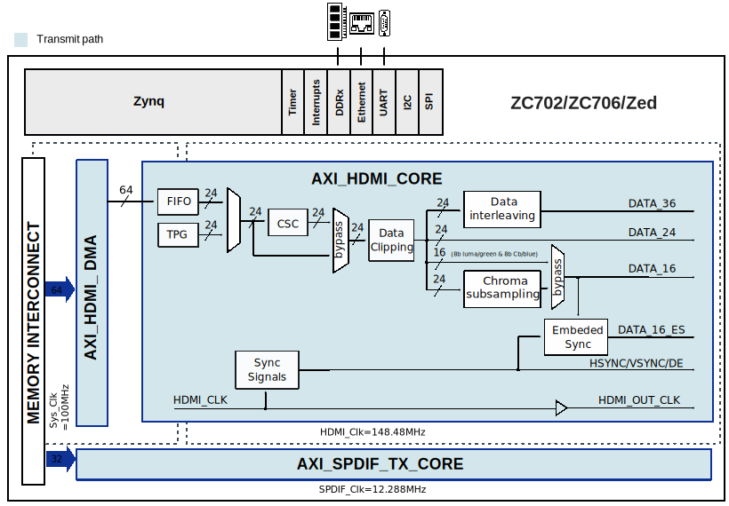
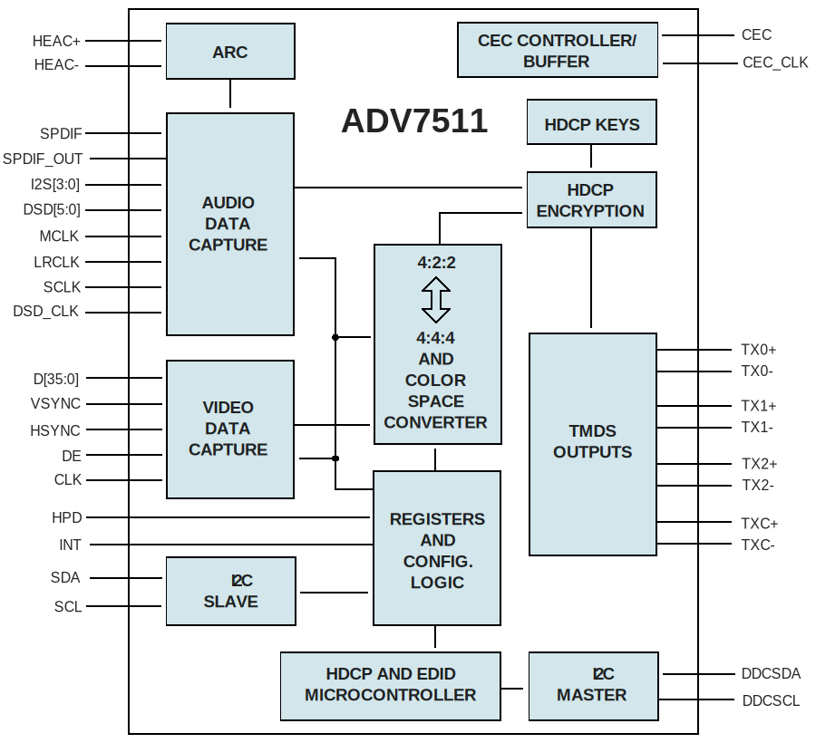

.. _adv7511:

ADV7511 HDL project
===============================================================================

Overview
-------------------------------------------------------------------------------

The :adi:`ADV7511` is a 225 MHz High-Definition Multimedia Interface (HDMI) transmitter,
which is ideal for home entertainment products including DVD players/recorders, digital
set top boxes, A/V receivers, gaming consoles, and PCs.

The digital video interface contains an HDMI 1.4- and a DVI 1.0-compatible transmitter,
and supports all HDTV formats (including 1080p with 12-bit Deep Color). The :adi:`ADV7511`
supports the HDMI 1.4-specific features, HEAC (ARC), and 3D video. In addition to these features,
the :adi:`ADV7511` supports x.v.Color™, high bit rate audio, and programmable AVI InfoFrames.
With the inclusion of HDCP, the :adi:`ADV7511` allows the secure transmission of protected content
as specified by the HDCP 1.4 protocol.

The :adi:`ADV7511` supports both S/PDIF and 8-channel I2S audio. Its high fidelity 8-channel I2S
can transmit either stereo or 7.1 surround audio up to 768 kHz. The S/PDIF can carry compressed
audio including Dolby® Digital, DTS®, and THX®. Fabricated in an advanced CMOS process, the :adi:`ADV7511`
is provided in a 100-lead LQFP surface-mount plastic package and is specified over the 0°C to
+70°C temperature range.

Supported devices
-------------------------------------------------------------------------------

- :adi:`ADV7511`

Supported carriers
-------------------------------------------------------------------------------

- :xilinx:`ZC702`
- :xilinx:`ZC706`
- `ZedBoard <https://digilent.com/shop/zedboard-zynq-7000-arm-fpga-soc-development-board>`__

Block design
-------------------------------------------------------------------------------

The reference design uses HDL-related HDMI cores in order to interface the :adi:`ADV7511`
IC into the ZC702/ZC706/Zed evaluation kits.

Block diagram
~~~~~~~~~~~~~~~~~~~~~~~~~~~~~~~~~~~~~~~~~~~~~~~~~~~~~~~~~~~~~~~~~~~~~~~~~~~~~~~

The data path and clock domains when interfacing the :adi:`ADV7511` IC with the FPGA SoCs,
and the internal HDL-related components are illustrated below:

ADV7511 Block Diagram
^^^^^^^^^^^^^^^^^^^^^^^^^^^^^^^^^^^^^^^^^^^^^^^^^^^^^^^^^^^^^^^^^^^^^^^^^^^^^^^

ADV7511 internal components
^^^^^^^^^^^^^^^^^^^^^^^^^^^^^^^^^^^^^^^^^^^^^^^^^^^^^^^^^^^^^^^^^^^^^^^^^^^^^^^

CPU/Memory interconnects addresses
~~~~~~~~~~~~~~~~~~~~~~~~~~~~~~~~~~~~~~~~~~~~~~~~~~~~~~~~~~~~~~~~~~~~~~~~~~~~~~~

The addresses are dependent on the architecture of the FPGA, having an offset
added to the base address from HDL(see more at :ref:`architecture cpu-intercon-addr`).

========================  ===========
Instance                  Zynq
========================  ===========
axi_iic_main              0x4160_0000
axi_sysid_0               0x4500_0000
axi_hdmi_clkgen           0x7900_0000
axi_hdmi_dma              0x4300_0000
axi_hdmi_core             0x70E0_0000
axi_spdif_tx_core         0x75C0_0000
axi_i2s_adi*              0x7760_0000
axi_iic_fmc*              0x4162_0000
========================  ===========

.. admonition:: Legend
   :class: note

   - ``*``  instantiated only for Zed carrier

GPIO
~~~~~~~~~~~~~~~~~~~~~~~~~~~~~~~~~~~~~~~~~~~~~~~~~~~~~~~~~~~~~~~~~~~~~~~~~~~~~~~

The Software GPIO number is calculated as follows:

- Zynq-7000: if PS7 EMIOs are used, then offset is 54

.. list-table::
   :widths: 25 25 25 25
   :header-rows: 2

   * - GPIO signal
     - Direction
     - HDL GPIO EMIO
     - Software GPIO
   * -
     - (from FPGA view)
     -
     - Zynq-7000
   * - gpio_bd[31:0] *
     - INOUT
     - 31:0
     - 85:54
   * - gpio_bd[14:0] **
     - INOUT
     - 14:0
     - 68:54
   * - gpio_bd[15:0] \***
     - INOUT
     - 15:0
     - 69:54

.. admonition:: Legend
   :class: note

   - ``*``  instantiated only for Zed carrier
   - ``**`` instantiated only for ZC706 carrier
   - ``***`` instantiated only for ZC702 carrier

Interrupts
~~~~~~~~~~~~~~~~~~~~~~~~~~~~~~~~~~~~~~~~~~~~~~~~~~~~~~~~~~~~~~~~~~~~~~~~~~~~~~~

Below are the Programmable Logic interrupts used in this project.

=========================== === ============ =============
Instance name               HDL Linux Zynq   Actual Zynq
=========================== === ============ =============
axi_hdmi_dma/irq            15  59           91
axi_iic_main/iic2intc_irpt  14  58           90
axi_iic_fmc/iic2intc_irpt*  11  55           87
=========================== === ============ =============

.. admonition:: Legend
   :class: note

   - ``*``  instantiated only for Zed carrier

Building the HDL project
-------------------------------------------------------------------------------

The design is built upon ADI's generic HDL reference design framework.
ADI distributes the bit/elf files of these projects as part of the
:dokuwiki:`ADI Kuiper Linux <resources/tools-software/linux-software/kuiper-linux>`.
If you want to build the sources, ADI makes them available on the
:git-hdl:`HDL repository </>`. To get the source you must
`clone <https://git-scm.com/book/en/v2/Git-Basics-Getting-a-Git-Repository>`__
the HDL repository, and then build the project as follows:.

**Linux/Cygwin/WSL**

.. shell::

   $cd hdl/projects/adv7511/zed
   $make

A more comprehensive build guide can be found in the :ref:`build_hdl`
user guide.

Resources
-------------------------------------------------------------------------------

Hardware related
~~~~~~~~~~~~~~~~~~~~~~~~~~~~~~~~~~~~~~~~~~~~~~~~~~~~~~~~~~~~~~~~~~~~~~~~~~~~~~~

- Product datasheet: :adi:`ADV7511`

HDL related
~~~~~~~~~~~~~~~~~~~~~~~~~~~~~~~~~~~~~~~~~~~~~~~~~~~~~~~~~~~~~~~~~~~~~~~~~~~~~~~

- :git-hdl:`ADV7511 HDL project source code <projects/adv7511>`

.. list-table::
   :widths: 30 35 35
   :header-rows: 1

   * - IP name
     - Source code link
     - Documentation link
   * - AXI_CLKGEN
     - :git-hdl:`library/axi_clkgen`
     - :ref:`axi_clkgen`
   * - AXI_HDMI_TX
     - :git-hdl:`library/axi_hdmi_tx`
     - :ref:`axi_hdmi_tx`
   * - AXI_I2S_ADI *
     - :git-hdl:`library/axi_i2s_adi`
     - ---
   * - AXI_SYSID
     - :git-hdl:`library/axi_sysid`
     - :ref:`axi_sysid`
   * - SYSID_ROM
     - :git-hdl:`library/sysid_rom`
     - :ref:`axi_sysid`
   * - AXI_SDDIF_TX
     - :git-hdl:`library/axi_spdif_tx`
     - ---
   * - UTIL_I2C_MIXER *
     - :git-hdl:`library/util_i2c_mixer`
     - ---
.. admonition:: Legend
   :class: note

   - ``*``  instantiated only for Zed carrier

Software related
~~~~~~~~~~~~~~~~~~~~~~~~~~~~~~~~~~~~~~~~~~~~~~~~~~~~~~~~~~~~~~~~~~~~~~~~~~~~~~~

- :git-linux:`ADV7511 driver source code <drivers/gpu/drm/bridge/adv7511>`
- :git-linux:`ADV7511 - ZED dts source code <arch/arm/boot/dts/xilinx/zynq-zed-adv7511.dts>`
- :git-linux:`ADV7511 - ZC706 dts source code <arch/arm/boot/dts/xilinx/zynq-zc706-adv7511.dts>`
- :git-linux:`ADV7511 - ZC702 dts source code <arch/arm/boot/dts/xilinx/zynq-zc702-adv7511.dts>`
- :dokuwiki:`ADV7511 driver docs <resources/tools-software/linux-drivers/drm/adv7511>`
- :git-no-OS:`ADV7511 no-OS project source code <projects/adv7511>`

.. include:: ../common/more_information.rst

.. include:: ../common/support.rst
