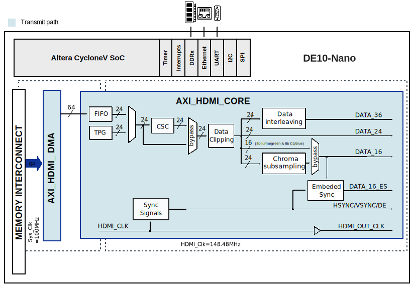

.. _adv7513:

ADV7513 HDL project
===============================================================================

Overview
-------------------------------------------------------------------------------

The :adi:`ADV7513` is a 165 MHz, High-Definition Multimedia Interface (HDMI®)
transmitter that is ideal for DVD players/ recorders, digital set-top boxes,
A/V receivers, gaming consoles, and PCs.

The digital video interface contains an HDMI v1.4/DVI v1.0-compatible transmitter
and supports all HDTV formats. The :adi:`ADV7513` supports HDMI v1.4-specific
features, including 3D video. The :adi:`ADV7513` also supports x.v.Color™,
high bit rate (HBR) audio, and the programmable auxiliary video information
(AVI) InfoFrame features. With the inclusion of HDCP, the :adi:`ADV7513` allows
the secure transmission of protected content as specified by the HDCP v1.4 protocol.

The :adi:`ADV7513` supports both S/PDIF and 8-channel I2S audio. Its high
fidelity 8-channel I2S interface can transmit either stereo or 7.1 surround
audio up to 768 kHz. The S/PDIF interface can carry compressed audio, including
Dolby® Digital, DTS®, and THX®. Fabricated in an advanced CMOS process, the
:adi:`ADV7513` is provided in a 64-lead LQFP surface-mount plastic package
with exposed pad and is specified over the −25°C to +85°C temperature range.

Supported devices
-------------------------------------------------------------------------------

- :adi:`ADV7513`

Supported carriers
-------------------------------------------------------------------------------

- Internal component of :intel:`De10-Nano <content/www/us/en/developer/topic-technology/edge-5g/hardware/fpga-de10-nano.html>`

Block design
-------------------------------------------------------------------------------

The reference design uses HDL-related HDMI cores in order to interface the :adi:`ADV7513`
IC into the De10-Nano evaluation kit.

Block diagram
~~~~~~~~~~~~~~~~~~~~~~~~~~~~~~~~~~~~~~~~~~~~~~~~~~~~~~~~~~~~~~~~~~~~~~~~~~~~~~~

CPU/Memory interconnects addresses
~~~~~~~~~~~~~~~~~~~~~~~~~~~~~~~~~~~~~~~~~~~~~~~~~~~~~~~~~~~~~~~~~~~~~~~~~~~~~~~

The addresses are dependent on the architecture of the FPGA, having an offset
added to the base address from HDL (see more at :ref:`architecture cpu-intercon-addr`).

========================  ===========
Instance                  DE10-Nano
========================  ===========
sys_spi                   0x0108_0000
sys_id                    0x0001_0000
sys_gpio_bd               0x0001_0080
sys_gpio_in               0x0001_0100
video_dmac                0x0008_0000
axi_hdmi_tx               0x0009_0000
pixel_clk_pll_reconfig    0x0010_0000
sys_gpio_out              0x0010_9000
ltc2308_spi               0x0010_A000
axi_sysid                 0x0001_8000
========================  ===========

GPIO
~~~~~~~~~~~~~~~~~~~~~~~~~~~~~~~~~~~~~~~~~~~~~~~~~~~~~~~~~~~~~~~~~~~~~~~~~~~~~~~

.. list-table::
   :widths: 40 30 30
   :header-rows: 2

   * - GPIO signal
     - Direction
     - HDL GPIO EMIO
   * -
     - (from FPGA view)
     - DE10-Nano
   * - ltc2308_cs
     - OUT
     - 41
   * - gpio_bd[5:0]
     - IN
     - 13:8
   * - gpio_bd_o[7:0]
     - OUT
     - 7:0

Interrupts
~~~~~~~~~~~~~~~~~~~~~~~~~~~~~~~~~~~~~~~~~~~~~~~~~~~~~~~~~~~~~~~~~~~~~~~~~~~~~~~

Below are the Programmable Logic interrupts used in this project.

=========================== === =====
Instance name               HDL Linux
=========================== === =====
sys_gpio_bd/irq             0   40
sys_spi/irq                 1   41
sys_gpio_in/irq             2   42
ltc2308_spi/irq             3   43
video_dmac/interrupt_sender 7   47
=========================== === =====

Building the HDL project
-------------------------------------------------------------------------------

The design is built upon ADI's generic HDL reference design framework.
ADI distributes the bit/elf files of these projects as part of the
:dokuwiki:`ADI Kuiper Linux <resources/tools-software/linux-software/kuiper-linux>`.
If you want to build the sources, ADI makes them available on the
:git-hdl:`HDL repository </>`. To get the source you must
`clone <https://git-scm.com/book/en/v2/Git-Basics-Getting-a-Git-Repository>`__
the HDL repository, and then build the project as follows:

**Linux/Cygwin/WSL**

.. shell::

   $cd hdl/projects/adv7513/de10nano
   $make

A more comprehensive build guide can be found in the :ref:`build_hdl` user guide.

Resources
-------------------------------------------------------------------------------

Hardware related
~~~~~~~~~~~~~~~~~~~~~~~~~~~~~~~~~~~~~~~~~~~~~~~~~~~~~~~~~~~~~~~~~~~~~~~~~~~~~~~

- Product datasheet: :adi:`ADV7513`

HDL related
~~~~~~~~~~~~~~~~~~~~~~~~~~~~~~~~~~~~~~~~~~~~~~~~~~~~~~~~~~~~~~~~~~~~~~~~~~~~~~~

- :git-hdl:`ADV7513 HDL project source code <projects/adv7513>`

.. list-table::
   :widths: 30 35 35
   :header-rows: 1

   * - IP name
     - Source code link
     - Documentation link
   * - AXI_DMAC
     - :git-hdl:`library/axi_dmac`
     - :ref:`axi_dmac`
   * - AXI_HDMI_TX
     - :git-hdl:`library/axi_hdmi_tx`
     - :ref:`axi_hdmi_tx`
   * - AXI_SYSID
     - :git-hdl:`library/axi_sysid`
     - :ref:`axi_sysid`
   * - SYSID_ROM
     - :git-hdl:`library/sysid_rom`
     - :ref:`axi_sysid`

Software related
~~~~~~~~~~~~~~~~~~~~~~~~~~~~~~~~~~~~~~~~~~~~~~~~~~~~~~~~~~~~~~~~~~~~~~~~~~~~~~~

- :git-linux:`ADV7513 driver source code <drivers/gpu/drm/bridge/adv7511>`
- :dokuwiki:`ADV7511 driver docs <resources/tools-software/linux-drivers/drm/adv7511>`

.. include:: ../common/more_information.rst

.. include:: ../common/support.rst
