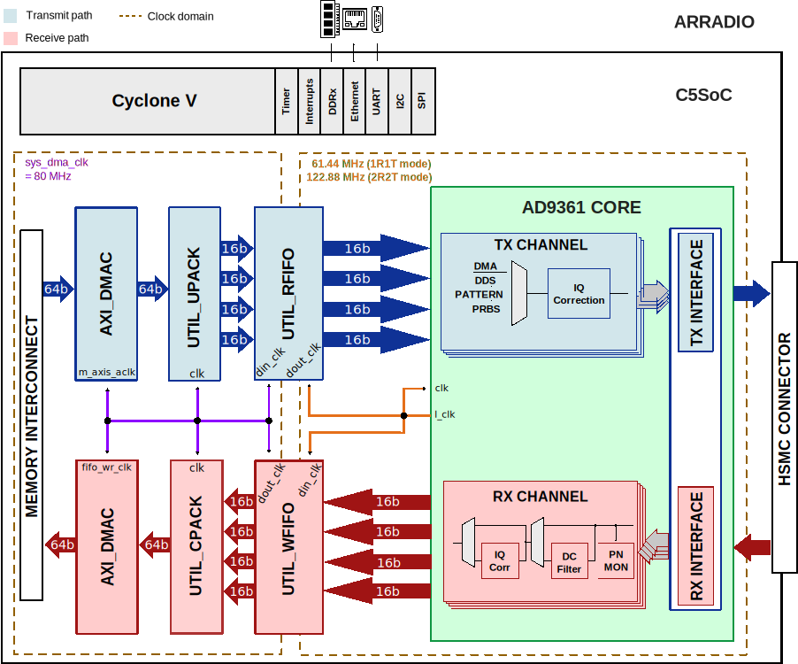

.. _arradio:

ARRADIO HDL Project
===============================================================================

Overview
-------------------------------------------------------------------------------

The `ARRADIO <https://www.terasic.com.tw/cgi-bin/page/archive.pl?No=946>`__
board is an `HSMC <http://www.altera.com/literature/ds/hsmc_spec.pdf>`__ 
board by `Arrow <https://www.arrow.com/en/manufacturers/analog-devices>`__ & 
`Terasic <http://arradio.terasic.com/>`_ for the :adi:`AD9361`, a highly
integrated RF Agile Transceiver. The complete chip level design package can be
found on the ADI web site :adi:`ad9361_design_files`. Information on the card,
and how to use it, the design package that surrounds it, and the software
which can make it work, can be found on this page.

.. caution::

   The ARRADIO board is not a product of Analog Devices, and questions about
   purchase, or returns should go to Arrow. You can purchase the board from
   `Arrow's web site <https://www.arrow.com/en/products/arradio/terasic-technologies>`__ .

The purpose of the ARRADIO board is to provide an RF platform which shows the
maximum performance of the :adi:`AD9361`. It's expected that the RF performance
of this platform can meet the datasheet specifications without issues at 2.4 GHz.
This is due to the external Johanson Technology's
`2450BL15B050E <https://www.johansontechnology.com/datasheets/baluns/JTI_Balun-2450BL15B050_12-03.pdf>`__ 
2.45 GHz Balun that is on the board. This balun is rated for an operating
frequency of 2400~2500 MHz.

This platform is primarily for hardware/RF investigation and bring-up of various
waveforms from a RF team before their custom hardware is complete. Take a look at the
:dokuwiki:`Configuration options<resources/eval/user-guides/ad-fmcomms2-ebz/hardware/configuration_options>`
section).

The ARRADIO board is very similar to the :adi:`AD-ARRADIO-EBZ`, except it utilizes
the HSMC connector which connects to the `Arrow SoCKit <https://www.arrow.com/en/products/sockit/arrow-development-tools>`__ .

Supported boards
-------------------------------------------------------------------------------

- `ARRADIO <https://www.terasic.com.tw/cgi-bin/page/archive.pl?No=946>`__

Supported devices
-------------------------------------------------------------------------------

- :adi:`AD9361`

Supported carriers
-------------------------------------------------------------------------------

- :intel:`C5SoC <content/www/us/en/products/details/fpga/development-kits/cyclone/v-sx.html>`
  (Cyclone V SoC) on HSMC
 
Block design
-------------------------------------------------------------------------------

The block design is very similar to :ref:`fmcomms2`.

Block diagram
~~~~~~~~~~~~~~~~~~~~~~~~~~~~~~~~~~~~~~~~~~~~~~~~~~~~~~~~~~~~~~~~~~~~~~~~~~~~~~~

The data path and clock domains are depicted in the below diagram.

Configuration modes
~~~~~~~~~~~~~~~~~~~~~~~~~~~~~~~~~~~~~~~~~~~~~~~~~~~~~~~~~~~~~~~~~~~~~~~~~~~~~~~

The :git-hdl:`AD9361 IP <library/axi_ad9361>` in this HDL project is configured
to work only in LVDS interface; it supports two configuration modes:

- 2R2T - 2x receive and 2x transmit RF channels
- 1R1T - 1x receive and 1x transmit RF channel

Both support only the **dual port half duplex** operating mode. The maximum
data rate (for combined I and Q words) is 61.44MSPS in DDR. For more details
about these modes, check the `AD9361 Reference Manual`_, Table 48 "Maximum Data
Rates and Signal Bandwidths".

CPU/Memory interconnects addresses
~~~~~~~~~~~~~~~~~~~~~~~~~~~~~~~~~~~~~~~~~~~~~~~~~~~~~~~~~~~~~~~~~~~~~~~~~~~~~~~

The addresses are dependent on the architecture of the FPGA, having an offset
added to the base address from HDL (see more at :ref:`architecture cpu-intercon-addr`).

================== ===========
Instance           Cyclone V
================== ===========
axi_ad9361_adc_dma 0x0010_0000
axi_ad9361_dac_dma 0x0010_4000
axi_ad9361         0x0012_0000
================== ===========

SPI connections
~~~~~~~~~~~~~~~~~~~~~~~~~~~~~~~~~~~~~~~~~~~~~~~~~~~~~~~~~~~~~~~~~~~~~~~~~~~~~~~

The SPI signals are controlled by a separate AXI based SPI core.

.. list-table::
   :widths: 25 25 25 25
   :header-rows: 1

   * - SPI type
     - SPI manager instance
     - SPI subordinate
     - CS
   * - HPS
     - SPI 0
     - AD9361
     - 0

GPIOs
~~~~~~~~~~~~~~~~~~~~~~~~~~~~~~~~~~~~~~~~~~~~~~~~~~~~~~~~~~~~~~~~~~~~~~~~~~~~~~~

The device control and monitor signals are interfaced to a GPIO module.

.. list-table::
   :widths: 25 25 25 25
   :header-rows: 2

   * - GPIO signal
     - Direction
     - HDL GPIO EMIO
     - Software GPIO
   * -
     - (from FPGA view)
     -
     - Linux Cyclone V
   * - gpio_status[7:0]
     - IN
     - 23:16
     - 23:16
   * - gpio_ctl[3:0]
     - OUT
     - 11:8
     - 11:8
   * - ad9361_resetb
     - OUT
     - 4
     - 4
   * - ad9361_en_agc
     - OUT
     - 3
     - 3
   * - ad9361_sync
     - OUT
     - 2
     - 2

Interrupts
~~~~~~~~~~~~~~~~~~~~~~~~~~~~~~~~~~~~~~~~~~~~~~~~~~~~~~~~~~~~~~~~~~~~~~~~~~~~~~~

Below are the Programmable Logic interrupts used in the project.

=================== === =============== ================
Instance name       HDL Linux Cyclone V Actual Cyclone V
=================== === =============== ================
video_dmac          4   44              76
axi_ad9361_dac_dma  3   43              75
axi_ad9361_adc_dma  2   42              74
sys_spi             1   41              73
sys_gpio_bd         0   40              72
=================== === =============== ================

Building the HDL project
-------------------------------------------------------------------------------

The design is built upon ADI's generic HDL reference design framework.
ADI distributes the bit/elf files of these projects as part of the
:dokuwiki:`ADI Kuiper Linux <resources/tools-software/linux-software/kuiper-linux>`.
If you want to build the sources, ADI makes them available on the
:git-hdl:`HDL repository </>`. To get the source you must
`clone <https://git-scm.com/book/en/v2/Git-Basics-Getting-a-Git-Repository>`__
the HDL repository.

Go to the hdl/projects/**arradio**/c5soc location and run the make
command.

**Linux/Cygwin/WSL**

.. shell::

   $cd hdl/projects/arradio/c5soc
   $make

A more comprehensive build guide can be found in the :ref:`build_hdl` user guide.

Resources
-------------------------------------------------------------------------------

Systems related
~~~~~~~~~~~~~~~~~~~~~~~~~~~~~~~~~~~~~~~~~~~~~~~~~~~~~~~~~~~~~~~~~~~~~~~~~~~~~~~

Here you can find the quick start guides available for this evaluation board:

- :dokuwiki:`ARRADIO <resources/eval/user-guides/arradio>`
- :dokuwiki:`ARRADIO Terasic C5 SoCkit Quick Start Guide <resources/eval/user-guides/arradio/quickstart/alterasockit>`

Hardware related
~~~~~~~~~~~~~~~~~~~~~~~~~~~~~~~~~~~~~~~~~~~~~~~~~~~~~~~~~~~~~~~~~~~~~~~~~~~~~~~

- `AD9361 Reference Manual`_
- Product datasheet :adi:`AD9361`

HDL related
~~~~~~~~~~~~~~~~~~~~~~~~~~~~~~~~~~~~~~~~~~~~~~~~~~~~~~~~~~~~~~~~~~~~~~~~~~~~~~~

- :git-hdl:`ARRADIO HDL project source code <projects/arradio>`

.. list-table::
   :widths: 30 35 35
   :header-rows: 1

   * - IP name
     - Source code link
     - Documentation link
   * - AXI_AD9361
     - :git-hdl:`library/axi_ad9361`
     - :ref:`axi_ad9361`
   * - AXI_DMAC
     - :git-hdl:`library/axi_dmac`
     - :ref:`axi_dmac`
   * - AXI_HDMI_TX
     - :git-hdl:`library/axi_hdmi_tx`
     - :ref:`axi_hdmi_tx`
   * - AXI_SYSID
     - :git-hdl:`library/axi_sysid`
     - :ref:`axi_sysid`
   * - SYSID_ROM
     - :git-hdl:`library/sysid_rom`
     - :ref:`axi_sysid`
   * - UTIL_CPACK2
     - :git-hdl:`library/util_pack/util_cpack2`
     - :ref:`util_cpack2`
   * - UTIL_UPACK2
     - :git-hdl:`library/util_pack/util_upack2`
     - :ref:`util_upack2`
   * - UTIL_RFIFO
     - :git-hdl:`library/util_rfifo`
     - :ref:`util_rfifo`
   * - UTIL_WFIFO
     - :git-hdl:`library/util_wfifo`
     - :ref:`util_wfifo`

Software related
~~~~~~~~~~~~~~~~~~~~~~~~~~~~~~~~~~~~~~~~~~~~~~~~~~~~~~~~~~~~~~~~~~~~~~~~~~~~~~~

- :git-linux:`ARRADIO C5SOC Linux device tree <arch/arm/boot/dts/intel/socfpga/socfpga_cyclone5_sockit_arradio.dts>`

- :dokuwiki:`[Wiki] ARRadio No-OS Quick Start Guide <resources/eval/user-guides/ad-fmcomms2-ebz/software/baremetal/arradio_noos>`

.. include:: ../common/more_information.rst

.. include:: ../common/support.rst

.. _AD9361 Reference Manual: https://ez.analog.com/cfs-file/__key/telligent-evolution-components-attachments/00-441-00-00-00-07-91-97/AD9361_5F00_Reference_5F00_Manual_5F00_UG_2D00_570.pdf
