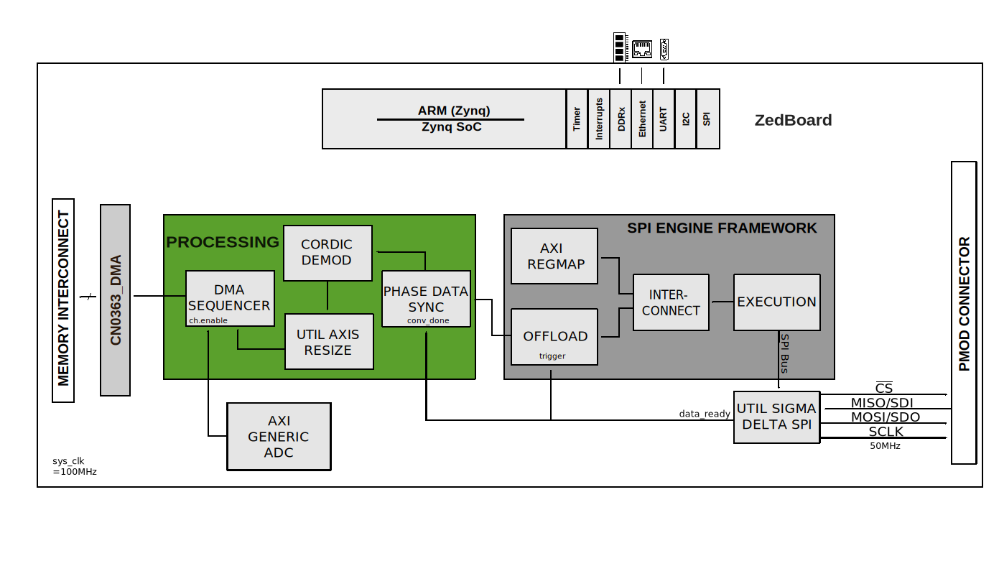

.. _cn0363:

CN0363 HDL project
==================================================================================

Overview
----------------------------------------------------------------------------------

The :adi:`EVAL-CN0363-PMDZ <CN0363>` is a dual channel colorimeter featuring a
modulated light source transmitter, programmable gain transimpedance amplifiers
on each channel, and a very low noise, 24-bit sigma delta ADC. The output of the
ADC connects via a standard PMOD connector to a FPGA. The FPGA takes the sampled
data from the ADC and implements a synchronous detection algorithm. By using
modulated light and digital synchronous detection, rather than a constant (dc)
source, the system strongly rejects any noise sources at frequencies other than
the modulation frequency, providing excellent accuracy.

The dual channel circuit measures the ratio of light absorbed by the liquids in
the sample and reference containers at three different wavelengths. This forms
the basis of many chemical analysis and environmental monitoring instruments
used to measure concentrations and characterize materials through absorption
spectroscopy.

The :adi:`EVAL-CN0363-PMDZ <CN0363>` HDL reference design is based on the Analog
Devices base reference design for the ZED board. In addition to the base reference
design :adi:`EVAL-CN0363-PMDZ <CN0363>` HDL reference design implements function
blocks to communicate over a SPI bus with the :adi:`AD7175-2` Sigma-Delta ADC to
configure it and receive the raw ADC data as well a configure the :adi:`AD5201`
digital potentiometer. The data received from the ADC is passed to a processing
pipeline which performs a digital synchronous detector and finally write the data
to system memory using a DMA. The HDL reference design is also responsible for
generating the LED excitation signal. A simplified functional block diagram of
the system is given below.

Supported boards
-------------------------------------------------------------------------------

-  :adi:`EVAL-CN0363-PMDZ <CN0363>`

Supported devices
-------------------------------------------------------------------------------

-  :adi:`CN0363`
-  :adi:`AD7175-2`
-  :adi:`AD5201`

Supported carriers
---------------------------------------------------------------------------------

-  `ZedBoard <https://digilent.com/shop/zedboard-zynq-7000-arm-fpga-soc-development-board>`__ on PMOD connector

Block design
-------------------------------------------------------------------------------

Block diagram
~~~~~~~~~~~~~~~~~~~~~~~~~~~~~~~~~~~~~~~~~~~~~~~~~~~~~~~~~~~~~~~~~~~~~~~~~~~~~~~

The data path and clock domains are depicted in the below diagram:

CPU/Memory interconnects addresses
~~~~~~~~~~~~~~~~~~~~~~~~~~~~~~~~~~~~~~~~~~~~~~~~~~~~~~~~~~~~~~~~~~~~~~~~~~~~~~~

The addresses are dependent on the architecture of the FPGA, having an offset
added to the base address from HDL (see more at :ref:`architecture cpu-intercon-addr`).

========================  ===========
Instance                  Zynq
========================  ===========
axi_adc                   0x43C0_0000
spi_cn0363_axi_regmap     0x44A0_0000
axi_dma                   0x44A3_0000
========================  ===========

I2C connections
~~~~~~~~~~~~~~~~~~~~~~~~~~~~~~~~~~~~~~~~~~~~~~~~~~~~~~~~~~~~~~~~~~~~~~~~~~~~~~~

.. list-table::
   :widths: 20 20 20 20 20
   :header-rows: 1

   * - I2C type
     - I2C manager instance
     - Alias
     - Address
     - I2C subordinate
   * - PL
     - iic_fmc
     - axi_iic_fmc
     - 0x4162_0000
     - ---
   * - PL
     - iic_main
     - axi_iic_main
     - 0x4160_0000
     - ---

SPI connections
~~~~~~~~~~~~~~~~~~~~~~~~~~~~~~~~~~~~~~~~~~~~~~~~~~~~~~~~~~~~~~~~~~~~~~~~~~~~~~~

.. list-table::
   :widths: 25 25 25 25
   :header-rows: 1

   * - SPI type
     - SPI manager instance
     - SPI subordinate
     - CS
   * - PL
     - axi_spi_engine
     - cn0363
     - 0

GPIOs
~~~~~~~~~~~~~~~~~~~~~~~~~~~~~~~~~~~~~~~~~~~~~~~~~~~~~~~~~~~~~~~~~~~~~~~~~~~~~~~

The Software GPIO number is calculated as follows:

-  Zynq-7000: if PS7 is used, then offset is 54

.. list-table::
   :widths: 25 25 25 25
   :header-rows: 2

   * - GPIO signal
     - Direction
     - HDL GPIO EMIO
     - Software GPIO
   * -
     - (from FPGA view)
     -
     - Zynq-7000
   * - spi_sdi
     - IN
     - 34
     - 88
   * - gain1_o
     - OUT
     - 33
     - 87
   * - gain0_o
     - OUT
     - 32
     - 86

Interrupts
~~~~~~~~~~~~~~~~~~~~~~~~~~~~~~~~~~~~~~~~~~~~~~~~~~~~~~~~~~~~~~~~~~~~~~~~~~~~~~~

Below are the Programmable Logic interrupts used in this project.

=================== === ========== ===========
Instance name       HDL Linux Zynq Actual Zynq
=================== === ========== ===========
axi_dma             13  57         89
spi                 12  56         88
=================== === ========== ===========

Building the HDL project
-------------------------------------------------------------------------------

The design is built upon ADI's generic HDL reference design framework.
ADI distributes the bit/elf files of these projects as part of the
:dokuwiki:`ADI Kuiper Linux <resources/tools-software/linux-software/kuiper-linux>`.
If you want to build the sources, ADI makes them available on the
:git-hdl:`HDL repository </>`. To get the source you must
`clone <https://git-scm.com/book/en/v2/Git-Basics-Getting-a-Git-Repository>`__
the HDL repository, and then build the project as follows:

**Linux/Cygwin/WSL**

.. shell::

   $cd hdl/projects/cn0363/zed
   $make

A more comprehensive build guide can be found in the :ref:`build_hdl` user guide.

Resources
-------------------------------------------------------------------------------

Systems related
~~~~~~~~~~~~~~~~~~~~~~~~~~~~~~~~~~~~~~~~~~~~~~~~~~~~~~~~~~~~~~~~~~~~~~~~~~~~~~~

Here you can find the quick start guides available for these evaluation boards:

- :dokuwiki:`[Wiki] EVAL-CN0363-PMDZ user guide <resources/eval/user-guides/eval-cn0363-pmdz>`
- :dokuwiki:`[Wiki] EVAL-CN0363-PMDZ Zed quick start guide <resources/eval/user-guides/eval-cn0363-pmdz/quickstart/zynq>`
- :dokuwiki:`[Wiki] CN0363 Colorimeter Application user guide <resources/tools-software/linux-software/colorimeter>`

Hardware related
~~~~~~~~~~~~~~~~~~~~~~~~~~~~~~~~~~~~~~~~~~~~~~~~~~~~~~~~~~~~~~~~~~~~~~~~~~~~~~~

- Product datasheets:

  - :adi:`CN0363`
  - :adi:`AD7175-2`
  - :adi:`AD5201`
  - :adi:`AD8615`
  - :adi:`ADG819`
  - :adi:`ADA4528-1`

- :dokuwiki:`EVAL-CN0363-PMDZ Introduction <resources/eval/user-guides/eval-cn0363-pmdz/introduction>`
- :dokuwiki:`EVAL-CN0363-PMDZ Hardware <resources/eval/user-guides/eval-cn0363-pmdz/hardware>`
- :dokuwiki:`EVAL-CN0363-PMDZ Hardware Setup <resources/eval/user-guides/eval-cn0363-pmdz/prerequisites>`

HDL related
~~~~~~~~~~~~~~~~~~~~~~~~~~~~~~~~~~~~~~~~~~~~~~~~~~~~~~~~~~~~~~~~~~~~~~~~~~~~~~~

-  :git-hdl:`CN0363_PMDZ HDL project source code <projects/cn0363>`
-  :dokuwiki:`[Wiki] CN0363 HDL project documentation <resources/eval/user-guides/eval-cn0363-pmdz/reference_hdl>`

.. list-table::
   :widths: 30 35 35
   :header-rows: 1

   * - IP name
     - Source code link
     - Documentation link
   * - AXI_DMAC
     - :git-hdl:`library/axi_dmac`
     - :ref:`axi_dmac`
   * - AXI_GENERIC_ADC
     - :git-hdl:`library/axi_generic_adc`
     - ---
   * - AXI_HDMI_TX
     - :git-hdl:`library/axi_hdmi_tx`
     - :ref:`axi_hdmi_tx`
   * - AXI_I2S_ADI
     - :git-hdl:`library/axi_i2s_adi`
     - ---
   * - AXI_SPDIF_TX
     - :git-hdl:`library/axi_spdif_tx`
     - ---
   * - AXI_SYSID
     - :git-hdl:`library/axi_sysid`
     - :ref:`axi_sysid`
   * - CN0363_DMA_SEQUENCER
     - :git-hdl:`library/cn0363/cn0363_dma_sequencer`
     - :ref:`cn0363_dma_sequencer`
   * - CN0363_PHASE_DATA_SYNC
     - :git-hdl:`library/cn0363/cn0363_phase_data_sync`
     - :ref:`cn0363_phase_data_sync`
   * - CORDIC_DEMOD
     - :git-hdl:`library/cordic_demod`
     - ---
   * - AXI_SPI_ENGINE
     - :git-hdl:`library/spi_engine/axi_spi_engine`
     - :ref:`spi_engine axi`
   * - SPI_ENGINE_EXECUTION
     - :git-hdl:`library/spi_engine/spi_engine_execution`
     - :ref:`spi_engine execution`
   * - SPI_ENGINE_INTERCONNECT
     - :git-hdl:`library/spi_engine/spi_engine_interconnect`
     - :ref:`spi_engine interconnect`
   * - SPI_ENGINE_OFFLOAD
     - :git-hdl:`library/spi_engine/spi_engine_offload`
     - :ref:`spi_engine offload`
   * - SYSID_ROM
     - :git-hdl:`library/sysid_rom`
     - :ref:`axi_sysid`
   * - UTIL_AXIS_RESIZE
     - :git-hdl:`library/util_axis_resize`
     - ---
   * - UTIL_I2C-MIXER
     - :git-hdl:`library/util_i2c_mixer`
     - ---
   * - UTIL_SIGMA_DELTA_SPI
     - :git-hdl:`library/util_sigma_delta_spi`
     - :ref:`util_sigma_delta_spi`

-  :ref:`SPI Engine Framework documentation <spi_engine>`

Software related
~~~~~~~~~~~~~~~~~~~~~~~~~~~~~~~~~~~~~~~~~~~~~~~~~~~~~~~~~~~~~~~~~~~~~~~~~~~~~~~

- :git-linux:`CN0363 Linux driver source code <drivers/iio/adc/ad_adc.c>`
- :dokuwiki:`CN0363 Linux Driver [Wiki] <resources/eval/user-guides/eval-cn0363-pmdz/software/linux/drivers>`

.. include:: ../common/more_information.rst

.. include:: ../common/support.rst
