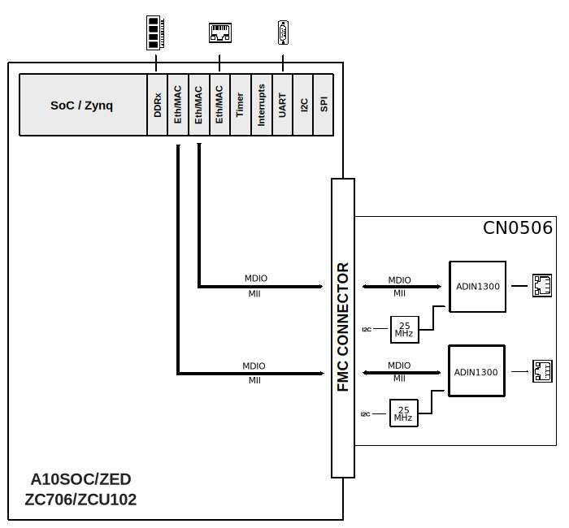
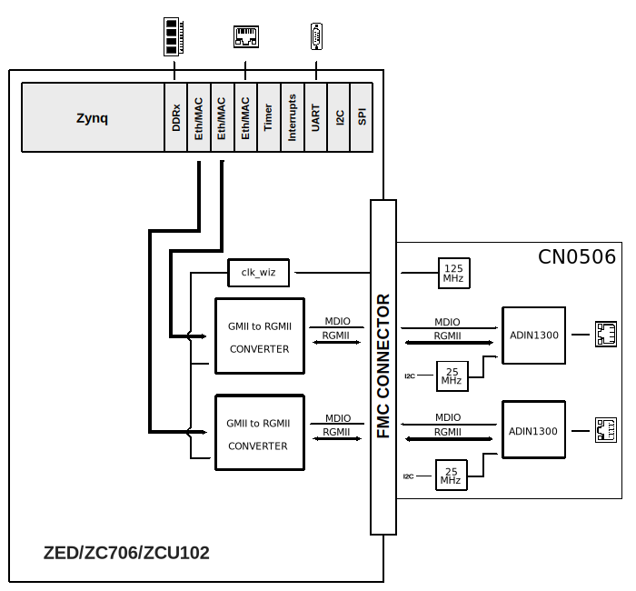
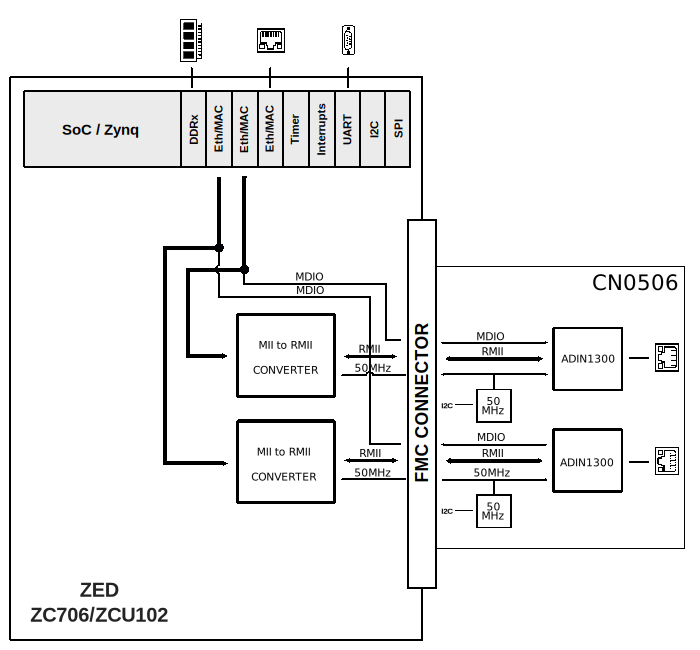

.. _cn0506:

CN0506 HDL project
===============================================================================

Overview
-------------------------------------------------------------------------------

The :adi:`CN0506` is a dual channel, low latency, low power Ethernet PHY card supporting
speeds of 10/100/1000 Mbps for Industrial Ethernet applications. The circuit consists of two
indivudual, independent 10/100/1000Mb :adi:`ADIN1300` PHYs, each with an energy efficient
Ethernet (EEE) physical layer device (PHY) core with all associated common analog circuitry,
input and output clock buffering, management interface, subsystem registers, MAC interface
and control logic.

The design is powered from the host field programmable gate array (FPGA) mezzanine card (FMC)
development board, eliminating the need for an external power supply. A software programmable
clock enables media independent interface (MII), reduced MII (RMII), and reduced Gigabit MII (RGMII)
MAC interface modes. RJ45 ports with integrated magnetics keep the solution as compact as possible.
The solution supports cable lengths up to 150 meters at gigabit speeds and up to 180 meters
at 100 Mbps or 10 Mbps.

Supported boards
-------------------------------------------------------------------------------

- :adi:`EVAL-CN0506 <design-center/reference-designs/circuits-from-the-lab/cn0506>`

Supported devices
-------------------------------------------------------------------------------

- :adi:`ADIN1300`
- :adi:`LTC4316 <media/en/technical-documentation/data-sheets/4316fa.pdf>`
- :adi:`LTC3502 <media/en/technical-documentation/data-sheets/3502fd.pdf>`

Supported carriers
-------------------------------------------------------------------------------

- :intel:`A10SOC <content/www/us/en/products/details/fpga/arria/10/sx.html>` on FMC_A HPC *
- :xilinx:`ZCU102` on FMC HPC1
- :xilinx:`ZC706` on FMC LPC
- `ZedBoard <https://digilent.com/shop/zedboard-zynq-7000-arm-fpga-soc-development-board>`__ on FMC slot

.. admonition:: Legend
   :class: note

   - ``*``  only the MII interface is supported to be connected to A10SoC

Block design
-------------------------------------------------------------------------------

The reference design uses :ref:`util_mii_to_rmii` converter to interface the MII
option of the CN0506's ethernet PHYs and Xilinx's GMII to RGMII converter for the
RGMII option of the kit with Xilinx's Zynq7000 or ZynqMP SoC implementations.

Block diagram
~~~~~~~~~~~~~~~~~~~~~~~~~~~~~~~~~~~~~~~~~~~~~~~~~~~~~~~~~~~~~~~~~~~~~~~~~~~~~~~

The data path and clock domains for all the three MII interface types are depicted
in the below diagrams:

CN0506_MII interface
^^^^^^^^^^^^^^^^^^^^^^^^^^^^^^^^^^^^^^^^^^^^^^^^^^^^^^^^^^^^^^^^^^^^^^^^^^^^^^^

CN0506_RGMII interface
^^^^^^^^^^^^^^^^^^^^^^^^^^^^^^^^^^^^^^^^^^^^^^^^^^^^^^^^^^^^^^^^^^^^^^^^^^^^^^^

CN0506_RMII interface
^^^^^^^^^^^^^^^^^^^^^^^^^^^^^^^^^^^^^^^^^^^^^^^^^^^^^^^^^^^^^^^^^^^^^^^^^^^^^^^

Resistor-based setup
~~~~~~~~~~~~~~~~~~~~~~~~~~~~~~~~~~~~~~~~~~~~~~~~~~~~~~~~~~~~~~~~~~~~~~~~~~~~~~~

.. list-table::
   :widths: 15 15 20
   :header-rows: 1

   * - MAC interface selection
     - MACIF_SEL1(PHY A/PHY B)
     - MACIF_SEL0(PHY A/PHY B)
   * - RGMII RXC/TXC 2ns delay
     - R12/R78
     - R9/R75
   * - RGMII RXC/TXC 2ns delay
     - R11/R77
     - R9/R75
   * - MII
     - R17/R78
     - R8/R74
   * - RMII
     - R11/R77
     - R8/R74

MDI-related resistor-based setup
~~~~~~~~~~~~~~~~~~~~~~~~~~~~~~~~~~~~~~~~~~~~~~~~~~~~~~~~~~~~~~~~~~~~~~~~~~~~~~~

.. list-table::
   :widths: 45 10 20 10
   :header-rows: 1

   * - Configuration
     - MODE
     - R_LO
     - R_HI
   * - Manual MDI
     - MODE_1
     - 10k
     - Open
   * - Manual MDIX
     - MODE_2
     - 10k
     - 56k
   * - Auto MDIX - Prefer MDIX
     - MODE_3
     - 56k
     - 10k
   * - Auto MDIX - Prefer MDI
     - MODE_4
     - Open
     - 10k

CPU/Memory interconnects addresses
~~~~~~~~~~~~~~~~~~~~~~~~~~~~~~~~~~~~~~~~~~~~~~~~~~~~~~~~~~~~~~~~~~~~~~~~~~~~~~~

The addresses are dependent on the architecture of the FPGA, having an offset
added to the base address from HDL(see more at :ref:`architecture cpu-intercon-addr`).

========================  ===========
Instance                  Zynq
========================  ===========
axi_iic_main *            0x4160_0000
axi_sysid_0               0x4500_0000
axi_hdmi_clkgen *         0x7900_0000
axi_hdmi_dma *            0x4300_0000
axi_hdmi_core *           0x70E0_0000
axi_spdif_tx_core *       0x75C0_0000
axi_i2s_adi **            0x7760_0000
axi_iic_fmc **            0x4162_0000
========================  ===========

.. admonition:: Legend
   :class: note

   - ``*``  instantiated only for Zed and ZC706 carriers
   - ``**`` instantiated only for Zed carrier

GPIO
~~~~~~~~~~~~~~~~~~~~~~~~~~~~~~~~~~~~~~~~~~~~~~~~~~~~~~~~~~~~~~~~~~~~~~~~~~~~~~~

The Software GPIO number is calculated as follows:

- Zynq-7000: if PS7 EMIOs are used, then offset is 54
- ZynqMP: if PS8 EMIOs are used, then offset is 78

.. list-table::
   :widths: 25 25 25 25
   :header-rows: 2

   * - GPIO signal
     - Direction
     - HDL GPIO EMIO
     - Software GPIO
   * -
     - (from FPGA view)
     -
     - Zynq-7000/ZynqMP
   * - link_st_a
     - IN
     - 35
     - 89
   * - link_st_b
     - IN
     - 34
     - 88
   * - int_n_a
     - IN
     - 33
     - 87
   * - int_n_b
     - IN
     - 32
     - 86
   * - gpio_bd[31:0] *
     - INOUT
     - 31:0
     - 85:54
   * - gpio_bd[14:0] **
     - INOUT
     - 14:0
     - 68:54
   * - gpio_bd_i[20:8] \***
     - IN
     - 20:8
     - 98:86
   * - gpio_bd_o[7:0] \***
     - OUT
     - 7:0
     - 85:78

- Intel FPGAs - Altera Arria 10 SoC

.. list-table::
   :widths: 25 25 25
   :header-rows: 2

   * - GPIO signal
     - Direction
     - HDL GPIO EMIO
   * -
     - (from FPGA view)
     - Arria10SoC
   * - link_st_a
     - IN
     - 35
   * - link_st_b
     - IN
     - 34
   * - mii_crs_a
     - IN
     - 33
   * - mii_crs_b
     - IN
     - 32
   * - gpio_bd_i[11:4]
     - IN
     - 11:4
   * - gpio_bd_o
     - OUT
     - 3:0

.. admonition:: Legend
   :class: note

   - ``*``  instantiated only for Zed carrier
   - ``**`` instantiated only for ZC706 carrier
   - ``***`` instantiated only for ZCU102 carrier

Interrupts
~~~~~~~~~~~~~~~~~~~~~~~~~~~~~~~~~~~~~~~~~~~~~~~~~~~~~~~~~~~~~~~~~~~~~~~~~~~~~~~

Below are the Programmable Logic interrupts used in this project.

=========================== === ============ =============
Instance name               HDL Linux Zynq   Actual Zynq
=========================== === ============ =============
axi_hdmi_dma/irq*           15  59           91
axi_iic_main/iic2intc_irpt* 14  58           90
axi_iic_fmc/iic2intc_irpt*  11  55           87
=========================== === ============ =============

.. admonition:: Legend
   :class: note

   - ``*``  instantiated only for Zed and ZC706 carriers
   - ``**`` instantiated only for Zed carrier

Building the HDL project
-------------------------------------------------------------------------------

The design is built upon ADI's generic HDL reference design framework.
ADI distributes the bit/elf files of these projects as part of the
:dokuwiki:`ADI Kuiper Linux <resources/tools-software/linux-software/kuiper-linux>`.
If you want to build the sources, ADI makes them available on the
:git-hdl:`HDL repository </>`. To get the source you must
`clone <https://git-scm.com/book/en/v2/Git-Basics-Getting-a-Git-Repository>`__
the HDL repository, and then build the project as follows:.

**Linux/Cygwin/WSL**

.. shell::

   $cd hdl/projects/cn0506/zed
   $make INTF_CFG=MII

The result of the build, if parameters were used, will be in a folder named
by the configuration used:

if the following command was run

``make INTF_CFG=MII``

then the folder name will be:

``INTF_CFGMII``

A more comprehensive build guide can be found in the :ref:`build_hdl`
user guide.

Resources
-------------------------------------------------------------------------------

Hardware related
~~~~~~~~~~~~~~~~~~~~~~~~~~~~~~~~~~~~~~~~~~~~~~~~~~~~~~~~~~~~~~~~~~~~~~~~~~~~~~~

- Product datasheet: :adi:`CN0506`
- ADIN1300 datasheet: :adi:`ADIN1300`

HDL related
~~~~~~~~~~~~~~~~~~~~~~~~~~~~~~~~~~~~~~~~~~~~~~~~~~~~~~~~~~~~~~~~~~~~~~~~~~~~~~~

- :git-hdl:`CN0506 HDL project source code <projects/cn0506>`

.. list-table::
   :widths: 30 35 35
   :header-rows: 1

   * - IP name
     - Source code link
     - Documentation link
   * - AXI_CLKGEN *
     - :git-hdl:`library/axi_clkgen`
     - :ref:`axi_clkgen`
   * - AXI_HDMI_TX *
     - :git-hdl:`library/axi_hdmi_tx`
     - :ref:`axi_hdmi_tx`
   * - AXI_I2S_ADI **
     - :git-hdl:`library/axi_i2s_adi`
     - ---
   * - AXI_SYSID
     - :git-hdl:`library/axi_sysid`
     - :ref:`axi_sysid`
   * - SYSID_ROM
     - :git-hdl:`library/sysid_rom`
     - :ref:`axi_sysid`
   * - AXI_SDDIF_TX *
     - :git-hdl:`library/axi_spdif_tx`
     - ---
   * - UTIL_I2C_MIXER **
     - :git-hdl:`library/util_i2c_mixer`
     - ---
   * - UTIL_MII_TO_RMII \***
     - :git-hdl:`library/util_mii_to_rmii`
     - :ref:`util_mii_to_rmii`

.. admonition:: Legend
   :class: note

   - ``*``  instantiated only for Zed and ZC706 carriers
   - ``**`` instantiated only for Zed carrier
   - ``***`` instantiated only for Zed, ZC706 and ZCU102 carriers

Software related
~~~~~~~~~~~~~~~~~~~~~~~~~~~~~~~~~~~~~~~~~~~~~~~~~~~~~~~~~~~~~~~~~~~~~~~~~~~~~~~

- :git-linux:`CN0506 MII - A10SOC dts source code (arm32) <arch/arm/boot/dts/intel/socfpga/socfpga_arria10_socdk_cn0506_mii.dts>`
- :git-linux:`CN0506 RGMII - A10SOC dts source code (arm32) <arch/arm/boot/dts/intel/socfpga/socfpga_arria10_socdk_cn0506_rgmii.dts>`
- :git-linux:`CN0506 MII - ZCU102 dts source code (arm64) <arch/arm64/boot/dts/xilinx/zynqmp-zcu102-rev10-cn0506-mii.dts>`
- :git-linux:`CN0506 RGMII - ZCU102 dts source code (arm64) <arch/arm64/boot/dts/xilinx/zynqmp-zcu102-rev10-cn0506-rgmii.dts>`
- :git-linux:`CN0506 RMII - ZCU102 dts source code (arm64) <arch/arm64/boot/dts/xilinx/zynqmp-zcu102-rev10-cn0506-rmii.dts>`
- :git-linux:`CN0506 MII - ZC706 dts source code (arm32) <arch/arm/boot/dts/xilinx/zynq-zc706-adv7511-cn0506-mii.dts>`
- :git-linux:`CN0506 RGMII - ZC706 dts source code (arm32) <arch/arm/boot/dts/xilinx/zynq-zc706-adv7511-cn0506-rgmii.dts>`
- :git-linux:`CN0506 RMII - ZC706 dts source code (arm32) <arch/arm/boot/dts/xilinx/zynq-zc706-adv7511-cn0506-rmii.dts>`
- :git-linux:`CN0506 MII - ZED dts source code (arm32) <arch/arm/boot/dts/xilinx/zynq-zed-adv7511-cn0506-mii.dts>`
- :git-linux:`CN0506 RGMII - ZED dts source code (arm32) <arch/arm/boot/dts/xilinx/zynq-zed-adv7511-cn0506-rgmii.dts>`
- :git-linux:`CN0506 RMII - ZED dts source code (arm32) <arch/arm/boot/dts/xilinx/zynq-zed-adv7511-cn0506-rmii.dts>`
- :dokuwiki:`ADIN1300 driver docs <resources/tools-software/linux-drivers/net-phy/adin>`

.. include:: ../common/more_information.rst

.. include:: ../common/support.rst
