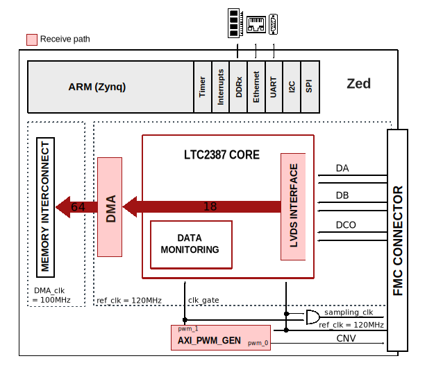

.. _cn0577:

CN0577 HDL project
================================================================================

Overview
-------------------------------------------------------------------------------

The :adi:`CN0577` provides an analog front-end and an FMC
digital interface for :adi:`LTC2387-18`/ :adi:`LTC2387-16` its core. It is a low
noise, high speed successive approximation register (SAR) ADC with a resolution
of 18/16 bits and sampling rate up to 15MSPS.

:adi:`CN0577` includes an on-board reference oscillator and a
retiming circuit to minimize signal-to-noise ratio (SNR) degradation due to the
FPGA additive jitter.

In order to support high speed operations while minimizing the number of data
lines, a serial LVDS digital interface is used. It has a one-lane and two-lane
output modes, allowing the user to optimize the interface data rate for each
application, through setting a parameter.

Supported boards
-------------------------------------------------------------------------------

- :adi:`CN0577`

Supported devices
-------------------------------------------------------------------------------

- :adi:`ADAQ23876`
- :adi:`LTC2387-18`
- :adi:`LTC2387-16`

Supported carriers
-------------------------------------------------------------------------------

- `ZedBoard <https://digilent.com/shop/zedboard-zynq-7000-arm-fpga-soc-development-board>`__ on FMC slot

Block design
-------------------------------------------------------------------------------

.. warning::
    The VADJ for the Zedboard must be set to 2.5V.

Block diagram
~~~~~~~~~~~~~~~~~~~~~~~~~~~~~~~~~~~~~~~~~~~~~~~~~~~~~~~~~~~~~~~~~~~~~~~~~~~~~~~

The data path and clock domains are depicted in the below diagram:

Configuration modes
~~~~~~~~~~~~~~~~~~~~~~~~~~~~~~~~~~~~~~~~~~~~~~~~~~~~~~~~~~~~~~~~~~~~~~~~~~~~~~~

- TWOLANES: specifies the number of lanes used

  - 1 - two-lane output mode (default)
  - 0 - one-lane output mode

- ADC_RES: resolution in bits

  - 18 - 18 bits ADC resolution (default)
  - 16 - 16 bits ADC resoluton

Jumper setup
~~~~~~~~~~~~~~~~~~~~~~~~~~~~~~~~~~~~~~~~~~~~~~~~~~~~~~~~~~~~~~~~~~~~~~~~~~~~~~~

Depending on what configuration of pins is chosen on the jumpers P1, P2 and P3,
the device can act in different modes, as described below. Of course, the PD
jumper overrides the PD signal from the FPGA. It is controlled by a
one-bit-adc-dac, in software.

- P1 - configures PD_N

  - Shorting pins 1 and 2 → PD_N = 1, device is not powered down
  - Shorting pins 2 and 3 → PD_N = 0, device is powered down

- P2 - configures TESTPAT

  - Shorting pins 1 and 2 → TESTPAT = 1, pattern testing is active
  - Shorting pins 2 and 3 → TESTPAT = 0, pattern testing is inactive

- P3 - configures TWOLANES parameter

  - Shorting pins 1 and 2 → TWOLANES = 1 (TWO LANES mode)
  - Shorting pins 2 and 3 → TWOLANES = 0 (ONE LANE mode)

Clock scheme
~~~~~~~~~~~~~~~~~~~~~~~~~~~~~~~~~~~~~~~~~~~~~~~~~~~~~~~~~~~~~~~~~~~~~~~~~~~~~~~

- The clock architecture of the :adi:`CN0577` is designed
  with careful consideration to ensure low jitter and low phase noise
- An on-board 120 MHz voltage controlled crystal oscillator (VCXO) is used to
  provide the clock for the :adi:`CN0577` board and the FPGA.
  It is further named as reference clock. This clock is gated and fed back to
  the device as the sampling clock, on which the data was sampled
- The DMA runs on the ZynqPS clock FCLK_CLK0 which has a frequency of 100MHz

CPU/Memory interconnects addresses
~~~~~~~~~~~~~~~~~~~~~~~~~~~~~~~~~~~~~~~~~~~~~~~~~~~~~~~~~~~~~~~~~~~~~~~~~~~~~~~

The addresses are dependent on the architecture of the FPGA, having an offset
added to the base address from HDL (see more at :ref:`architecture cpu-intercon-addr`).

==================== ===============
Instance             Zynq/Microblaze
==================== ===============
axi_ltc2387          0x44A0_0000
axi_ltc2387_dma      0x44A3_0000
axi_pwm_gen          0x44A6_0000
==================== ===============

GPIOs
~~~~~~~~~~~~~~~~~~~~~~~~~~~~~~~~~~~~~~~~~~~~~~~~~~~~~~~~~~~~~~~~~~~~~~~~~~~~~~~

.. list-table::
   :widths: 25 20 20 20 15
   :header-rows: 2

   * - GPIO signal
     - Direction
     - HDL GPIO EMIO
     - Software GPIO
     - Software GPIO
   * -
     - (from FPGA view)
     -
     - Zynq-7000
     - Zynq MP
   * - testpat_cntrl
     - IN
     - 32
     - 86
     - 110
   * - pd_cntrl
     - IN
     - 33
     - 87
     - 111

Interrupts
~~~~~~~~~~~~~~~~~~~~~~~~~~~~~~~~~~~~~~~~~~~~~~~~~~~~~~~~~~~~~~~~~~~~~~~~~~~~~~~

Below are the Programmable Logic interrupts used in this project.

================ === ========== ===========
Instance name    HDL Linux Zynq Actual Zynq
================ === ========== ===========
axi_ltc2387_dma  13  57         89
================ === ========== ===========

Building the HDL project
-------------------------------------------------------------------------------

The design is built upon ADI's generic HDL reference design framework.
ADI distributes the bit/elf files of these projects as part of the
:dokuwiki:`ADI Kuiper Linux <resources/tools-software/linux-software/kuiper-linux>`.
If you want to build the sources, ADI makes them available on the
:git-hdl:`HDL repository </>`. To get the source you must
`clone <https://git-scm.com/book/en/v2/Git-Basics-Getting-a-Git-Repository>`__
the HDL repository.

Default (two-lane mode):

.. shell::

   $cd hdl/projects/cn0577/zed
   $make

A more comprehensive build guide can be found in the :ref:`build_hdl` user
guide.

Resources
-------------------------------------------------------------------------------

Systems related
~~~~~~~~~~~~~~~~~~~~~~~~~~~~~~~~~~~~~~~~~~~~~~~~~~~~~~~~~~~~~~~~~~~~~~~~~~~~~~~

- :dokuwiki:`[Wiki] EVAL-CN0577-FMCZ User Guide <resources/eval/user-guides/circuits-from-the-lab/cn0577>`
- :dokuwiki:`[Wiki] CN0577 HDL Reference Design <resources/eval/user-guides/circuits-from-the-lab/cn0577/hdl>`

Hardware related
~~~~~~~~~~~~~~~~~~~~~~~~~~~~~~~~~~~~~~~~~~~~~~~~~~~~~~~~~~~~~~~~~~~~~~~~~~~~~~~

- Product datasheets:

  - :adi:`LTC2387-18`
  - :adi:`LTC2387-16`

- `Circuit Note CN0577 <https://www.analog.com/media/en/reference-design-documentation/reference-designs/cn0577.pdf>`__

HDL related
~~~~~~~~~~~~~~~~~~~~~~~~~~~~~~~~~~~~~~~~~~~~~~~~~~~~~~~~~~~~~~~~~~~~~~~~~~~~~~~

- :git-hdl:`CN0577 HDL project source code <projects/cn0577>`

.. list-table::
   :widths: 30 35 35
   :header-rows: 1

   * - IP name
     - Source code link
     - Documentation link
   * - AXI_LTC2387
     - :git-hdl:`library/axi_ltc2387`
     - :ref:`axi_ltc2387`
   * - AXI_CLKGEN
     - :git-hdl:`library/axi_clkgen`
     - :ref:`axi_clkgen`
   * - AXI_DMAC
     - :git-hdl:`library/axi_dmac`
     - :ref:`axi_dmac`
   * - AXI_SYSID
     - :git-hdl:`library/axi_sysid`
     - :ref:`axi_sysid`
   * - AXI_PWM_GEN
     - :git-hdl:`library/axi_pwm_gen`
     - :ref:`axi_pwm_gen`
   * - AXI_HDMI_TX
     - :git-hdl:`library/axi_hdmi_tx`
     - :ref:`axi_hdmi_tx`
   * - AXI_I2S_ADI
     - :git-hdl:`library/axi_i2s_adi`
     - —
   * - AXI_SPDIF_TX
     - :git-hdl:`library/axi_spdif_tx`
     - 	—
   * - SYSID_ROM
     - :git-hdl:`library/sysid_rom`
     - :ref:`axi_sysid`
   * - UTIL_I2C_MIXER
     - :git-hdl:`library/util_i2c_mixer`
     - 	—

Software related
~~~~~~~~~~~~~~~~~~~~~~~~~~~~~~~~~~~~~~~~~~~~~~~~~~~~~~~~~~~~~~~~~~~~~~~~~~~~~~~

- :dokuwiki:`[Wiki] LTC2387 SAR ADC IIO Linux driver page <resources/tools-software/linux-drivers/iio-adc/ltc2387>`
- :git-linux:`CN0577 Linux device tree <arch/arm/boot/dts/xilinx/zynq-zed-adv7511-cn0577.dts>`
- :git-linux:`LTC2387 Linux driver <drivers/iio/adc/ltc2387.c>`

.. include:: ../common/more_information.rst

.. include:: ../common/support.rst
