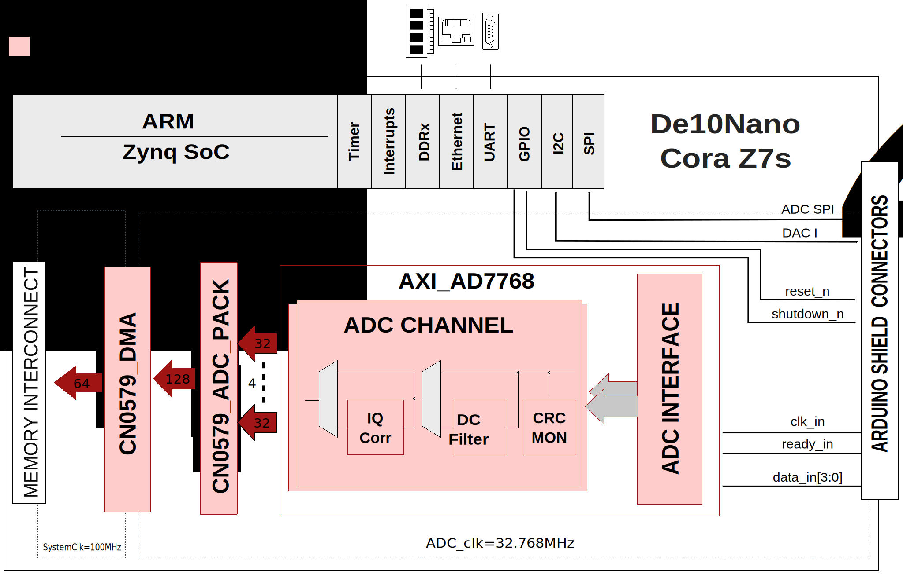
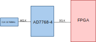

.. _cn0579:

CN0579 HDL project
===============================================================================

Overview
-------------------------------------------------------------------------------

The :adi:`CN0579` is a 4-channel, high resolution, wide bandwidth,
high dynamic range, integrated electronics piezoelectric (IEPE)-compatible
interface data acquisition (DAQ) system that interfaces with IC piezoelectric
(ICP®)/IEPE sensors. The solution provides flexible sensor interfacing to
either piezoelectric or micro-electromechanical systems (MEMS) sensor with
measurement capabilities that extend the frequency response to DC.

The design provides four channels of full bandwidth, synchronized vibration
data to the processor, where data analysis can be done locally or on a remote
host over Ethernet via standard IIO framework. Large buffers of continuous
data can be streamed and analyzed using standard fast Fourier transform (FFT)
techniques for system characterization and machine learning algorithms.

Supported boards
-------------------------------------------------------------------------------

- :adi:`CN0579`

Supported devices
-------------------------------------------------------------------------------

- :adi:`AD7768-4`
- :adi:`AD5696R`
- :adi:`ADA4945-1`
- :adi:`ADG5421F`

Supported carriers
-------------------------------------------------------------------------------

.. list-table::
   :widths: 35 35 30
   :header-rows: 1

   * - Evaluation board
     - Carrier
     - FMC slot
   * - :adi:`CN0579`
     - `Cora Z7S <https://digilent.com/shop/cora-z7-zynq-7000-single-core-for-arm-fpga-soc-development>`__
     - Arduino headers
   * -
     - :intel:`DE10-Nano <content/www/us/en/developer/topic-technology/edge-5g/hardware/fpga-de10-nano.html>`
     - Arduino headers

Block design
-------------------------------------------------------------------------------

Block diagram
~~~~~~~~~~~~~~~~~~~~~~~~~~~~~~~~~~~~~~~~~~~~~~~~~~~~~~~~~~~~~~~~~~~~~~~~~~~~~~~

The data path and clock domains are depicted in the below diagram:

Clock scheme
~~~~~~~~~~~~~~~~~~~~~~~~~~~~~~~~~~~~~~~~~~~~~~~~~~~~~~~~~~~~~~~~~~~~~~~~~~~~~~~

CPU/Memory interconnects addresses
~~~~~~~~~~~~~~~~~~~~~~~~~~~~~~~~~~~~~~~~~~~~~~~~~~~~~~~~~~~~~~~~~~~~~~~~~~~~~~~

The addresses are dependent on the architecture of the FPGA, having an offset
added to the base address from HDL (see more at :ref:`architecture cpu-intercon-addr`).

=============== =========== ===========
Instance        Zynq        Cyclone V
=============== =========== ===========
axi_ad77684_adc 0x44A0_0000 0x0002_8000
cn0579_dma      0x44A3_0000 0x0003_0000
axi_iic_dac*    0x44A4_0000 ---
=============== =========== ===========

.. admonition:: Legend
   :class: note

    ``*`` instantiated only for Cora Z7S

I2C connections
~~~~~~~~~~~~~~~~~~~~~~~~~~~~~~~~~~~~~~~~~~~~~~~~~~~~~~~~~~~~~~~~~~~~~~~~~~~~~~~

.. list-table::
   :widths: 20 20 20 20 20
   :header-rows: 1

   * - I2C type
     - I2C manager instance
     - Alias
     - Address
     - I2C subordinate
   * - PL*
     - axi_iic
     - axi_iic_dac
     - 0x0C
     - AD5696R
   * - PS**
     - I2C1
     -
     - 0x0C
     - AD5696R

.. admonition:: Legend
   :class: note

   - ``*`` only for Cora Z7S
   - ``**`` only for DE10-Nano

SPI connections
~~~~~~~~~~~~~~~~~~~~~~~~~~~~~~~~~~~~~~~~~~~~~~~~~~~~~~~~~~~~~~~~~~~~~~~~~~~~~~~

.. list-table::
   :widths: 25 25 25 25
   :header-rows: 1

   * - SPI type
     - SPI manager instance
     - SPI subordinate
     - CS
   * - PS*
     - SPI 0
     - AD7786-4
     - 0
   * - PL**
     - SYS_SPI
     - AD7786-4
     - 0

.. admonition:: Legend
   :class: note

   - ``*`` only for Cora Z7S
   - ``**`` only for DE10-Nano

GPIOs
~~~~~~~~~~~~~~~~~~~~~~~~~~~~~~~~~~~~~~~~~~~~~~~~~~~~~~~~~~~~~~~~~~~~~~~~~~~~~~~

.. list-table::
   :widths: 25 20 20 20 15
   :header-rows: 2

   * - GPIO signal
     - Direction
     - HDL GPIO EMIO
     - Software GPIO
     - Software GPIO
   * -
     - (from FPGA view)
     -
     - Zynq-7000
     - Cyclone V
   * - RESET_N
     - OUT
     - 32
     - 86
     - 0

Interrupts
~~~~~~~~~~~~~~~~~~~~~~~~~~~~~~~~~~~~~~~~~~~~~~~~~~~~~~~~~~~~~~~~~~~~~~~~~~~~~~~

Below are the Programmable Logic interrupts used in this project.

============= === ========== =========== =============== ================
Instance name HDL Linux Zynq Actual Zynq Linux Cyclone V Actual Cyclone V
============= === ========== =========== =============== ================
cn0579_dma*   12  56         88          ---             ---
axi_iic_ard*  11  55         87          ---             ---
cn0579_dma**  5   ---        ---         45              77
============= === ========== =========== =============== ================

.. admonition:: Legend
   :class: note

   - ``*`` only for Cora Z7S
   - ``**`` only for DE10-Nano

Building the HDL project
-------------------------------------------------------------------------------

The design is built upon ADI's generic HDL reference design framework.
ADI distributes the bit/elf files of these projects as part of the
:dokuwiki:`ADI Kuiper Linux <resources/tools-software/linux-software/kuiper-linux>`.
If you want to build the sources, ADI makes them available on the
:git-hdl:`HDL repository </>`. To get the source you must
`clone <https://git-scm.com/book/en/v2/Git-Basics-Getting-a-Git-Repository>`__
the HDL repository, and then build the project as follows:

**Linux/Cygwin/WSL**

Building the CoraZ7S project:

.. shell::

   $cd hdl/projects/cn0579/coraz7s
   $make

Building the DE-10Nano project:

.. shell::

   $cd hdl/projects/cn0579/de10nano
   $make

A more comprehensive build guide can be found in the :ref:`build_hdl` user guide.

Resources
-------------------------------------------------------------------------------

Systems related
~~~~~~~~~~~~~~~~~~~~~~~~~~~~~~~~~~~~~~~~~~~~~~~~~~~~~~~~~~~~~~~~~~~~~~~~~~~~~~~

- :dokuwiki:`[Wiki] EVAL-CN0579-ARDZ User Guide </resources/eval/user-guides/circuits-from-the-lab/cn0579>`
- :adi:`Circuit Note CN0579 <media/en/reference-design-documentation/reference-designs/cn0579.pdf>`

Hardware related
~~~~~~~~~~~~~~~~~~~~~~~~~~~~~~~~~~~~~~~~~~~~~~~~~~~~~~~~~~~~~~~~~~~~~~~~~~~~~~~

- Product datasheets:

   - :adi:`AD7768-4`
   - :adi:`AD5696R`
   - :adi:`ADA4945-1`
   - :adi:`ADG5421F`

HDL related
~~~~~~~~~~~~~~~~~~~~~~~~~~~~~~~~~~~~~~~~~~~~~~~~~~~~~~~~~~~~~~~~~~~~~~~~~~~~~~~

- :git-hdl:`CN0579 HDL project source code <projects/cn0579>`

.. list-table::
   :widths: 30 35 35
   :header-rows: 1

   * - IP name
     - Source code link
     - Documentation link
   * - AXI_AD7768
     - :git-hdl:`library/axi_ad7768`
     - :ref:`axi_ad7768`
   * - AXI_DMAC
     - :git-hdl:`library/axi_dmac`
     - :ref:`axi_dmac`
   * - AXI_SYSID
     - :git-hdl:`library/axi_sysid`
     - :ref:`axi_sysid`
   * - SYSID_ROM
     - :git-hdl:`library/sysid_rom`
     - :ref:`axi_sysid`
   * - UTIL_CPACK2
     - :git-hdl:`library/util_pack/util_cpack2`
     - :ref:`util_cpack2`

Software related
~~~~~~~~~~~~~~~~~~~~~~~~~~~~~~~~~~~~~~~~~~~~~~~~~~~~~~~~~~~~~~~~~~~~~~~~~~~~~~~

- :dokuwiki:`[Wiki] AD7768 IIO Precision ADC Linux Driver <resources/tools-software/linux-drivers/iio-adc/ad7768>`

- Python support:

   - :git-pyadi-iio:`PyADI-IIO documentation </>`
   - :git-pyadi-iio:`PyADI-IIO CN0579 class <adi/cn0579.py>`
   - :git-pyadi-iio:`PyADI-IIO CN0579 example <examples/cn0579/cn0579_example.py>`

- CN0579 on Cora Z7s Linux device tree
   :git-linux:`arch/arm/boot/dts/dts/xilinx/zynq-coraz7s-cn0579_i2c.dts`
- CN0579 on DE-10Nano Linux device tree
   :git-linux:`arch/arm/boot/dts/intel/socfpga/socfpga_cyclone5_de10_nano_cn0579_i2c.dts`
- AD7768 Linux driver :git-linux:`ad7768.c <drivers/iio/adc/ad7768.c>`

.. include:: ../common/more_information.rst

.. include:: ../common/support.rst
