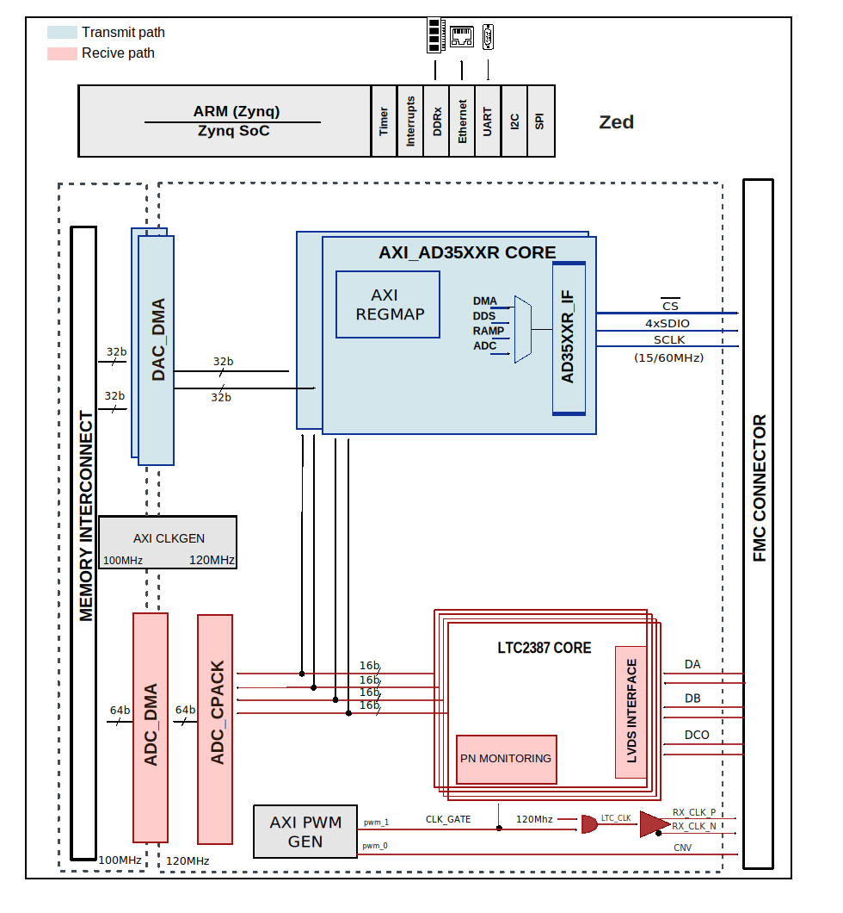

.. _cn0585:

CN0585 HDL project
================================================================================

Overview
-------------------------------------------------------------------------------

The :adi:`EVAL-CN0585-FMCZ <CN0585>` Low Latency Development Kit (LLDK) board
is a development board consisting of 4 x 16-bit ADC channels and 4 x 16-bit
DAC channels that are interfaced with an FPGA through the FMC Low Pin Count
(LPC) Connector.
Current revision of :adi:`EVAL-CN0585-FMCZ <CN0585>` is Rev B.
:adi:`EVAL-CN0585-FMCZ <CN0585>`, :adi:`EVAL-CN0585-FMCZ <CN0584>` and
- `ZedBoard <https://digilent.com/shop/zedboard-zynq-7000-arm-fpga-soc-development-board>`__ are connected
together to build a development system setup.

Supported boards
-------------------------------------------------------------------------------

- :adi:`CN0585`
- :adi:`CN0584`

Supported devices
-------------------------------------------------------------------------------

- :adi:`AD3552R`
- :adi:`ADAQ23876`
- :adi:`AD7291`
- :adi:`ADG5421F`
- :adi:`MAX7301`

Supported carriers
-------------------------------------------------------------------------------

.. list-table::
   :widths: 35 35 30
   :header-rows: 1

   * - Evaluation board
     - Carrier
     - FMC slot
   * - :adi:`CN0585` + :adi:`CN0584`
     - `ZedBoard <https://digilent.com/shop/zedboard-zynq-7000-arm-fpga-soc-development-board>`__
     - FMC-LPC

Block design
-------------------------------------------------------------------------------

The architecture is composed of two :adi:`AD3552R` digital-to-analog converter
interface IPs and four :adi:`LTC2387-16` analog-to-digital converter interface
IPs. All these IPs utilize an 120MHz reference clock, which is produced by
an axi_clkgen IP.

Block diagram
~~~~~~~~~~~~~~~~~~~~~~~~~~~~~~~~~~~~~~~~~~~~~~~~~~~~~~~~~~~~~~~~~~~~~~~~~~~~~~~

The data path and clock domains are depicted in the below diagram:

CPU/Memory interconnects addresses
~~~~~~~~~~~~~~~~~~~~~~~~~~~~~~~~~~~~~~~~~~~~~~~~~~~~~~~~~~~~~~~~~~~~~~~~~~~~~~~

The addresses are dependent on the architecture of the FPGA, having an offset
added to the base address from HDL (see more at :ref:`architecture cpu-intercon-addr`).

================ ===============
Instance         Zynq/Microblaze
================ ===============
axi_ltc2387_0    0X44A0_0000
axi_ltc2387_1    0X44A1_0000
axi_ltc2387_2    0X44A2_0000
axi_ltc2387_3    0X44A3_0000
axi_ltc2387_dma  0X44A4_0000
axi_clkgen       0X44B0_0000
axi_pwm_gen      0X44B1_0000
max_spi          0X44B2_0000
axi_ad35xxr_0    0X44D0_0000
axi_dac_0_dma    0X44D3_0000
axi_ad35xxr_1    0X44E0_0000
axi_dac_1_dma    0X44E3_0000
================ ===============

I2C connections
~~~~~~~~~~~~~~~~~~~~~~~~~~~~~~~~~~~~~~~~~~~~~~~~~~~~~~~~~~~~~~~~~~~~~~~~~~~~~~~

.. list-table::
   :widths: 20 20 20 20 20
   :header-rows: 1

   * - I2C type
     - I2C manager instance
     - Alias
     - Address
     - I2C subordinate
   * - PL
     - iic_fmc
     - axi_iic_fmc
     - 0x4162_0000
     - ---
   * - PL
     - iic_main
     - axi_iic_main
     - 0x4160_0000
     - ---

SPI connections
~~~~~~~~~~~~~~~~~~~~~~~~~~~~~~~~~~~~~~~~~~~~~~~~~~~~~~~~~~~~~~~~~~~~~~~~~~~~~~

.. list-table::
   :widths: 25 25 25 25
   :header-rows: 1

   * - SPI type
     - SPI manager instance
     - SPI subordinate
     - CS
   * - PL
     - max_spi
     - MAX7301
     - 0

GPIOs
~~~~~~~~~~~~~~~~~~~~~~~~~~~~~~~~~~~~~~~~~~~~~~~~~~~~~~~~~~~~~~~~~~~~~~~~~~~~~~~

.. list-table::
   :widths: 25 20 20 20 15
   :header-rows: 2

   * - GPIO signal
     - Direction
     - HDL GPIO EMIO
     - Software GPIO
     - Software GPIO
   * -
     - (from FPGA view)
     -
     - Zynq-7000
     - Zynq MP
   * - reset
     - INOUT
     - 36
     - 90
     - 114
   * - dac_0_ldac
     - INOUT
     - 35
     - 89
     - 113
   * - dac_1_ldac
     - INOUT
     - 34
     - 88
     - 112
   * - dac_1_alert
     - IN
     - 33
     - 87
     - 111
   * - dac_0_alert
     - IN
     - 32
     - 86
     - 110

Interrupts
~~~~~~~~~~~~~~~~~~~~~~~~~~~~~~~~~~~~~~~~~~~~~~~~~~~~~~~~~~~~~~~~~~~~~~~~~~~~~~~

Below are the Programmable Logic interrupts used in this project.

================ === ========== ===========
Instance name    HDL Linux Zynq Actual Zynq
================ === ========== ===========
axi_ltc2387_dma  13  57         89
max_spi          8   52         84
axi_dac_0_dma    5   34         66
axi_dac_1_dma    4   33         65
================ === ========== ===========

Building the HDL project
-------------------------------------------------------------------------------

The design is built upon ADI's generic HDL reference design framework.
ADI distributes the bit/elf files of these projects as part of the
:dokuwiki:`ADI Kuiper Linux <resources/tools-software/linux-software/kuiper-linux>`.
If you want to build the sources, ADI makes them available on the
:git-hdl:`HDL repository </>`. To get the source you must
`clone <https://git-scm.com/book/en/v2/Git-Basics-Getting-a-Git-Repository>`__
the HDL repository.

.. shell::

   $cd hdl/projects/cn0585/zed
   $make

A more comprehensive build guide can be found in the :ref:`build_hdl` user
guide.

Resources
-------------------------------------------------------------------------------

Systems related
~~~~~~~~~~~~~~~~~~~~~~~~~~~~~~~~~~~~~~~~~~~~~~~~~~~~~~~~~~~~~~~~~~~~~~~~~~~~~~~

- :dokuwiki:`[Wiki] EVAL-CN0585-FMCZ User Guide <resources/eval/user-guides/circuits-from-the-lab/cn0585>`
- :dokuwiki:`[Wiki] CN0584 User Guide <resources/eval/user-guides/circuits-from-the-lab/cn0584>`

Hardware related
~~~~~~~~~~~~~~~~~~~~~~~~~~~~~~~~~~~~~~~~~~~~~~~~~~~~~~~~~~~~~~~~~~~~~~~~~~~~~~~

- Product datasheets:

  - :adi:`ADAQ23876`
  - :adi:`AD3552R`
  - :adi:`AD7291`
  - :adi:`MAX7301`
- `Circuit Note CN-0585 <https://www.analog.com/media/en/reference-design-documentation/reference-designs/cn0585.pdf>`__
- `Circuit Note CN-0584 <https://www.analog.com/media/en/reference-design-documentation/reference-designs/cn0584.pdf>`__

HDL related
~~~~~~~~~~~~~~~~~~~~~~~~~~~~~~~~~~~~~~~~~~~~~~~~~~~~~~~~~~~~~~~~~~~~~~~~~~~~~~~

- :git-hdl:`CN0585 HDL project source code <projects/cn0585>`

.. list-table::
   :widths: 30 35 35
   :header-rows: 1

   * - IP name
     - Source code link
     - Documentation link
   * - AXI_AD35XXR
     - :git-hdl:`library/axi_ad35xxr`
     - :ref:`axi_ad35xxr`
   * - AXI_LTC2387
     - :git-hdl:`library/axi_ltc2387`
     - :ref:`axi_ltc2387`
   * - AXI_DMAC
     - :git-hdl:`library/axi_dmac`
     - :ref:`axi_dmac`
   * - AXI_SYSID
     - :git-hdl:`library/axi_sysid`
     - :ref:`axi_sysid`
   * - SYSID_ROM
     - :git-hdl:`library/sysid_rom`
     - :ref:`axi_sysid`
   * - AXI_CLKGEN
     - :git-hdl:`library/axi_clkgen`
     - :ref:`axi_clkgen`
   * - AXI_PWM_GEN
     - :git-hdl:`library/axi_pwm_gen`
     - :ref:`axi_pwm_gen`
   * - AXI_HDMI_TX
     - :git-hdl:`library/axi_hdmi_tx`
     - :ref:`axi_hdmi_tx`
   * - AXI_I2S_ADI
     - :git-hdl:`library/axi_i2s_adi`
     - —
   * - AXI_SPDIF_TX
     - :git-hdl:`library/axi_spdif_tx`
     - 	—
   * - UTIL_I2C_MIXER
     - :git-hdl:`library/util_i2c_mixer`
     - 	—
   * - UTIL_PACK/UTIL_CPACK2
     - :git-hdl:`library/util_pack/util_cpack2`
     - :ref:`util_cpack2`

Software related
~~~~~~~~~~~~~~~~~~~~~~~~~~~~~~~~~~~~~~~~~~~~~~~~~~~~~~~~~~~~~~~~~~~~~~~~~~~~~~~

- :dokuwiki:`[Wiki] AD3552R Dual Channel, 16-Bit, 33 MUPS, Multispan, Multi-IO SPI DAC Linux device driver page <resources/tools-software/linux-drivers/iio-dac/axi-ad3552r>`
- :dokuwiki:`[Wiki] LTC2387 SAR ADC IIO Linux driver page <resources/tools-software/linux-drivers/iio-adc/ltc2387>`

- Python support:

   - `PyADI-IIO documentation <https://analogdevicesinc.github.io/pyadi-iio/>`__

.. include:: ../common/more_information.rst

.. include:: ../common/support.rst
