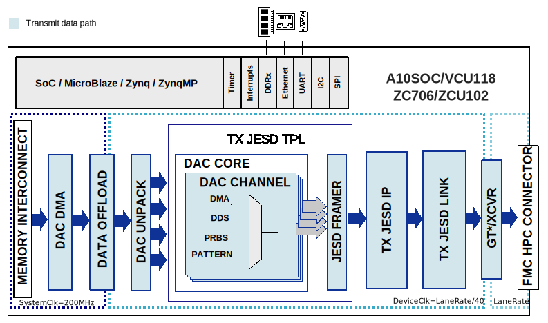

.. _dac_fmc_ebz:

DAC-FMC-EBZ HDL project
===============================================================================

Overview
-------------------------------------------------------------------------------

The DAC-FMC-EBZ HDL project is a wrapper for many DAC-based evaluation boards,
all having similar interfaces, which are listed below.
Each evaluation board has its particularities, which are supported in this
design and can be selected by changing some parameters before building the
project.

Supported boards
-------------------------------------------------------------------------------

- :adi:`AD9135-FMC-EBZ <EVAL-AD9135>`
- :adi:`AD9136-FMC-EBZ <EVAL-AD9136>`
- :adi:`AD9144-FMC-EBZ <EVAL-AD9144>`
- :adi:`AD9152-FMC-EBZ <EVAL-AD9152>`
- :adi:`AD9154-FMC-EBZ <EVAL-AD9154>`
- :adi:`AD917x-FMC-EBZ <EVAL-AD917x>`

Supported devices
-------------------------------------------------------------------------------

- :adi:`AD9135`
- :adi:`AD9136`
- :adi:`AD9144`
- :adi:`AD9152`
- :adi:`AD9154`
- :adi:`AD9171`
- :adi:`AD9172`
- :adi:`AD9173`

Supported carriers
-------------------------------------------------------------------------------

+-------------------------------------+------------------+----------+
| Evaluation board                    | Carrier          | FMC slot |
+=====================================+==================+==========+
| :adi:`AD9135-FMC-EBZ <EVAL-AD9135>` | `A10SoC`_        | FMCA     |
| :adi:`AD9136-FMC-EBZ <EVAL-AD9136>` +------------------+----------+
| :adi:`AD9144-FMC-EBZ <EVAL-AD9144>` | :xilinx:`VCU118` | FMC+     |
| :adi:`AD9152-FMC-EBZ <EVAL-AD9152>` +------------------+----------+
| :adi:`AD9154-FMC-EBZ <EVAL-AD9154>` | :xilinx:`ZC706`  | FMC HPC  |
| :adi:`AD917x-FMC-EBZ <EVAL-AD917x>` +------------------+----------+
|                                     | :xilinx:`ZCU102` | FMC HPC0 |
+-------------------------------------+------------------+----------+

Block design
-------------------------------------------------------------------------------

Block diagram
~~~~~~~~~~~~~~~~~~~~~~~~~~~~~~~~~~~~~~~~~~~~~~~~~~~~~~~~~~~~~~~~~~~~~~~~~~~~~~~

The data path and clock domains are depicted in the below diagram:

The data to be sent to DAC can have multiple sources:

DMA source
^^^^^^^^^^^^^^^^^^^^^^^^^^^^^^^^^^^^^^^^^^^^^^^^^^^^^^^^^^^^^^^^^^^^^^^^^^^^^^^

In cases of high sample rates where the required data rate exceeds the PS-PL
interface's available throughput, the data is transmitted in a loop from a
local buffer (:git-hdl:`dac_fifo <projects/dac_fmc_ebz/common/dac_fmc_ebz_bd.tcl#L57>`)
which is loaded once with the DMA from the PS DDR.

For lower sample rates, the :git-hdl:`DAC FIFO <library/util_dacfifo>`
can be placed in bypass mode, in which case the DMA must stream the data
from the PS memory.

DDS source
^^^^^^^^^^^^^^^^^^^^^^^^^^^^^^^^^^^^^^^^^^^^^^^^^^^^^^^^^^^^^^^^^^^^^^^^^^^^^^^

For each DAC channel a tone is generated by a
:dokuwiki:`DDS core <resources/fpga/docs/hdl/regmap#dac_channel_axi_ad>`.

PRBS source
^^^^^^^^^^^^^^^^^^^^^^^^^^^^^^^^^^^^^^^^^^^^^^^^^^^^^^^^^^^^^^^^^^^^^^^^^^^^^^^

For each DAC channel, one of the following PN sequences can be selected: PN7,
PN15, inverted PN7, inverted PN15.

Software-defined pattern source
^^^^^^^^^^^^^^^^^^^^^^^^^^^^^^^^^^^^^^^^^^^^^^^^^^^^^^^^^^^^^^^^^^^^^^^^^^^^^^^

For each DAC channel, software can set the values that will be driven to the DAC.

Configuration modes
~~~~~~~~~~~~~~~~~~~~~~~~~~~~~~~~~~~~~~~~~~~~~~~~~~~~~~~~~~~~~~~~~~~~~~~~~~~~~~~

The configuration parameters that can be set along with the **make** command
are:

- **ADI_DAC_DEVICE**: specifies the DAC device

  - **AD9172 (default)**
  - AD9135
  - AD9136
  - AD9144
  - AD9154
  - AD9152
  - AD9171
  - AD9173

- **ADI_DAC_MODE**: specifies the JESD operation mode

  - **04 (default)**
  - can vary from 00 to 21 depending on the selected device (ADI_DAC_DEVICE)

If the desired parameters are not listed in any of the supported modes the user can
configure them trough ``make`` parameters:

- **M**:  number of converters per link

  - **the value set by the ADI_DAC_MODE (default)**
  - according to the datasheet

- **L**:  number of lanes per link

  - **the value set by the ADI_DAC_MODE (default)**
  - according to the datasheet

- **S**:  number of samples per frame

  - **the value set by the ADI_DAC_MODE (default)**
  - according to the datasheet

- **F**:  number of octets per frame

  - **the value set by the ADI_DAC_MODE (default)**
  - according to the datasheet

- **HD**: high-density

  - **the value set by the ADI_DAC_MODE (default)**
  - according to the datasheet

- **N**:  converter resolution

  - **the value set by the ADI_DAC_MODE (default)**
  - according to the datasheet

- **NP**: number of bits per sample

  - **the value set by the ADI_DAC_MODE (default)**
  - according to the datasheet

.. collapsible:: AD9135/AD9136 supported modes

   +------+----------------------------------+
   |      | JESD parameters                  |
   |      +----+----+----+----+----+----+----+
   | Mode | M  | L  | S  | F  | HD | N  | NP |
   +======+====+====+====+====+====+====+====+
   | 08   | 1  | 4  | 2  | 1  | 1  | 16 | 16 |
   +------+----+----+----+----+----+----+----+
   | 09   | 1  | 2  | 1  | 1  | 1  | 16 | 16 |
   +------+----+----+----+----+----+----+----+
   | 10   | 1  | 1  | 1  | 2  | 0  | 16 | 16 |
   +------+----+----+----+----+----+----+----+
   | 11   | 2  | 8  | 2  | 1  | 1  | 16 | 16 |
   +------+----+----+----+----+----+----+----+
   | 12   | 2  | 4  | 1  | 1  | 1  | 16 | 16 |
   +------+----+----+----+----+----+----+----+
   | 13   | 2  | 2  | 1  | 2  | 0  | 16 | 16 |
   +------+----+----+----+----+----+----+----+

.. collapsible:: AD9144/AD9154 supported modes

   +------+----------------------------------+
   |      | JESD parameters                  |
   |      +----+----+----+----+----+----+----+
   | Mode | M  | L  | S  | F  | HD | N  | NP |
   +======+====+====+====+====+====+====+====+
   | 00   | 4  | 8  | 1  | 1  | 1  | 16 | 16 |
   +------+----+----+----+----+----+----+----+
   | 01   | 4  | 8  | 2  | 2  | 0  | 16 | 16 |
   +------+----+----+----+----+----+----+----+
   | 02   | 4  | 4  | 1  | 2  | 0  | 16 | 16 |
   +------+----+----+----+----+----+----+----+
   | 03   | 4  | 2  | 1  | 4  | 0  | 16 | 16 |
   +------+----+----+----+----+----+----+----+
   | 04   | 2  | 4  | 1  | 1  | 1  | 16 | 16 |
   +------+----+----+----+----+----+----+----+
   | 05   | 2  | 4  | 2  | 2  | 0  | 16 | 16 |
   +------+----+----+----+----+----+----+----+
   | 06   | 2  | 2  | 1  | 2  | 0  | 16 | 16 |
   +------+----+----+----+----+----+----+----+
   | 07   | 2  | 1  | 1  | 4  | 0  | 16 | 16 |
   +------+----+----+----+----+----+----+----+
   | 09   | 1  | 2  | 1  | 1  | 1  | 16 | 16 |
   +------+----+----+----+----+----+----+----+
   | 10   | 1  | 1  | 1  | 2  | 0  | 16 | 16 |
   +------+----+----+----+----+----+----+----+

.. collapsible:: AD9152 supported modes

   +------+----------------------------------+
   |      | JESD parameters                  |
   |      +----+----+----+----+----+----+----+
   | Mode | M  | L  | S  | F  | HD | N  | NP |
   +======+====+====+====+====+====+====+====+
   | 04   | 2  | 4  | 1  | 1  | 1  | 16 | 16 |
   +------+----+----+----+----+----+----+----+
   | 05   | 2  | 4  | 2  | 2  | 0  | 16 | 16 |
   +------+----+----+----+----+----+----+----+
   | 06   | 2  | 2  | 1  | 2  | 0  | 16 | 16 |
   +------+----+----+----+----+----+----+----+
   | 07   | 2  | 1  | 1  | 4  | 0  | 16 | 16 |
   +------+----+----+----+----+----+----+----+
   | 09   | 1  | 2  | 1  | 1  | 1  | 16 | 16 |
   +------+----+----+----+----+----+----+----+
   | 10   | 1  | 1  | 1  | 2  | 0  | 16 | 16 |
   +------+----+----+----+----+----+----+----+

.. collapsible:: AD9171 supported modes

   +------+----------------------------------+
   |      | JESD parameters                  |
   |      +----+----+----+----+----+----+----+
   | Mode | M  | L  | S  | F  | HD | N  | NP |
   +======+====+====+====+====+====+====+====+
   | 00   | 2  | 1  | 1  | 4  | 1  | 16 | 16 |
   +------+----+----+----+----+----+----+----+
   | 03   | 2  | 2  | 1  | 2  | 1  | 16 | 16 |
   +------+----+----+----+----+----+----+----+

.. collapsible:: AD9172/4/6 supported modes

   +------+----------------------------------+
   |      | JESD parameters                  |
   |      +----+----+----+----+----+----+----+
   | Mode | M  | L  | S  | F  | HD | N  | NP |
   +======+====+====+====+====+====+====+====+
   | 00   | 2  | 1  | 1  | 4  | 1  | 16 | 16 |
   +------+----+----+----+----+----+----+----+
   | 01   | 4  | 2  | 1  | 4  | 1  | 16 | 16 |
   +------+----+----+----+----+----+----+----+
   | 02   | 6  | 3  | 1  | 4  | 1  | 16 | 16 |
   +------+----+----+----+----+----+----+----+
   | 03   | 2  | 2  | 1  | 2  | 1  | 16 | 16 |
   +------+----+----+----+----+----+----+----+
   | 04   | 4  | 4  | 1  | 2  | 1  | 16 | 16 |
   +------+----+----+----+----+----+----+----+
   | 08   | 2  | 4  | 1  | 1  | 1  | 16 | 16 |
   +------+----+----+----+----+----+----+----+
   | 09   | 2  | 4  | 2  | 2  | 1  | 16 | 16 |
   +------+----+----+----+----+----+----+----+
   | 10   | 2  | 8  | 2  | 1  | 1  | 16 | 16 |
   +------+----+----+----+----+----+----+----+
   | 11   | 2  | 8  | 4  | 2  | 1  | 16 | 16 |
   +------+----+----+----+----+----+----+----+
   | 18   | 1  | 4  | 2  | 1  | 1  | 16 | 16 |
   +------+----+----+----+----+----+----+----+
   | 19   | 1  | 4  | 4  | 2  | 1  | 16 | 16 |
   +------+----+----+----+----+----+----+----+
   | 20   | 1  | 8  | 4  | 1  | 1  | 16 | 16 |
   +------+----+----+----+----+----+----+----+
   | 21   | 1  | 8  | 8  | 2  | 1  | 16 | 16 |
   +------+----+----+----+----+----+----+----+

.. collapsible:: AD9173/5 supported modes

   +------+----------------------------------+
   |      | JESD parameters                  |
   |      +----+----+----+----+----+----+----+
   | Mode | M  | L  | S  | F  | HD | N  | NP |
   +======+====+====+====+====+====+====+====+
   | 00   | 2  | 1  | 1  | 4  | 1  | 16 | 16 |
   +------+----+----+----+----+----+----+----+
   | 01   | 4  | 2  | 1  | 4  | 1  | 16 | 16 |
   +------+----+----+----+----+----+----+----+
   | 02   | 6  | 3  | 1  | 4  | 1  | 16 | 16 |
   +------+----+----+----+----+----+----+----+
   | 03   | 2  | 2  | 1  | 2  | 1  | 16 | 16 |
   +------+----+----+----+----+----+----+----+
   | 04   | 4  | 4  | 1  | 2  | 1  | 16 | 16 |
   +------+----+----+----+----+----+----+----+
   | 08   | 2  | 4  | 1  | 1  | 1  | 16 | 16 |
   +------+----+----+----+----+----+----+----+
   | 09   | 2  | 4  | 2  | 2  | 1  | 16 | 16 |
   +------+----+----+----+----+----+----+----+
   | 13   | 2  | 4  | 1  | 1  | 1  | 16 | 16 |
   +------+----+----+----+----+----+----+----+
   | 14   | 2  | 4  | 2  | 2  | 1  | 16 | 16 |
   +------+----+----+----+----+----+----+----+
   | 15   | 2  | 8  | 2  | 1  | 1  | 16 | 16 |
   +------+----+----+----+----+----+----+----+
   | 16   | 2  | 8  | 4  | 2  | 1  | 16 | 16 |
   +------+----+----+----+----+----+----+----+

CPU/Memory interconnects addresses
~~~~~~~~~~~~~~~~~~~~~~~~~~~~~~~~~~~~~~~~~~~~~~~~~~~~~~~~~~~~~~~~~~~~~~~~~~~~~~~

The addresses are dependent on the architecture of the FPGA, having an offset
added to the base address from HDL (see more at :ref:`architecture`).

===================================  ===============  ===========
Instance                             Zynq/Microblaze  ZynqMP
===================================  ===============  ===========
dac_jesd204_xcvr                     0x44A6_0000      0x84A6_0000
dac_jesd204_transport                0x44A0_4000      0x84A0_4000
dac_jesd204_link                     0x44A9_0000      0x84A9_0000
dac_dma                              0x7C42_0000      0x9C42_0000
===================================  ===============  ===========

=================================== ===========
Instance                            A10SoC
=================================== ===========
dac_jesd204_transport               0x0003_0000
dac_dma                             0x0004_0000
dac_jesd204_link.link_reconfig      0x0002_0000
dac_jesd204_link.link_management    0x0002_4000
dac_jesd204_link.link_pll_reconfig  0x0002_5000
dac_jesd204_link.lane_pll_reconfig  0x0002_6000
dac_jesd204_link.phy_reconfig_0*    0x0002_8000
dac_jesd204_link.phy_reconfig_1*    0x0002_9000
dac_jesd204_link.phy_reconfig_2*    0x0002_A000
dac_jesd204_link.phy_reconfig_3*    0x0002_B000
dac_jesd204_link.phy_reconfig_4*    0x0002_C000
dac_jesd204_link.phy_reconfig_5*    0x0002_D000
dac_jesd204_link.phy_reconfig_6*    0x0002_E000
dac_jesd204_link.phy_reconfig_7*    0x0002_F000
=================================== ===========

.. note::

   - \* - one for each lane, depends on the number of lanes; if L=4,
     then only _0->_3 will exist.

SPI connections
~~~~~~~~~~~~~~~~~~~~~~~~~~~~~~~~~~~~~~~~~~~~~~~~~~~~~~~~~~~~~~~~~~~~~~~~~~~~~~~

.. important::

   ``spi_en`` is:

    - **active HIGH** for AD913X, AD91X4, and AD915X evaluation boards
    - **active LOW**  for AD917X evaluation boards

+------------------------------+---------------------------------+------------------------------------+----+
|           SPI type           | SPI manager instance            | SPI subordinate                    | CS |
+--------------+---------------+--------------+------------------+------------------------------------+----+
| ZC706/ZCU102 | A10SoC/VCU118 | ZC706/ZCU102 | A10SoC/VCU118    |                                    |    |
+==============+===============+==============+==================+====================================+====+
| PS           | PL            | SPI 0        | SYS_SPI/AXI_SPI  | HMC7044                            | 0  |
+--------------+---------------+--------------+------------------+------------------------------------+----+
| PS           | PL            | SPI 0        | SYS_SPI/AXI_SPI  | AD913x/AD91x4/AD915x/AD917x        | 1  |
+--------------+---------------+--------------+------------------+------------------------------------+----+
| PS           | ---           | SPI 1        | ---              | PMOD*                              | 0  |
+--------------+---------------+--------------+------------------+------------------------------------+----+

.. note::

   - \* - only on the ZC706/ZCU102 carriers

GPIOs
~~~~~~~~~~~~~~~~~~~~~~~~~~~~~~~~~~~~~~~~~~~~~~~~~~~~~~~~~~~~~~~~~~~~~~~~~~~~~~

+-----------------+-----------------+----------------+---------------+---------------+---------------+
|  GPIO signal    | Direction       | HDL GPIO EMIO  | Software GPIO | Software GPIO | Software GPIO |
|                 | (from FPGA      +--------+-------+ Zynq MP       | Microblaze    | Arria 10      |
|                 | view)           | Xilinx | Intel |               |               |               |
+=================+=================+========+=======+===============+===============+===============+
| pmod_gpio[3:0]* | INOUT           | 51-48  | ---   | 128-125       | 51-48         | ---           |
+-----------------+-----------------+--------+-------+---------------+---------------+---------------+
| dac_fifo_bypass | OUTPUT          | 40     | 40    | 117           | 40            | 8             |
+-----------------+-----------------+--------+-------+---------------+---------------+---------------+
| dac_ctrl[4]     | INOUT           | 25     | ---   | 102           | 25            | ---           |
+-----------------+-----------------+--------+-------+---------------+---------------+---------------+
| dac_ctrl[3]     | INOUT           | 24     | 35    | 101           | 24            | 3             |
+-----------------+-----------------+--------+-------+---------------+---------------+---------------+
| dac_ctrl[2]     | INOUT           | 23     | 34    | 100           | 23            | 2             |
+-----------------+-----------------+--------+-------+---------------+---------------+---------------+
| dac_ctrl[1]     | INOUT           | 22     | 33    | 99            | 22            | 1             |
+-----------------+-----------------+--------+-------+---------------+---------------+---------------+
| dac_ctrl[0]     | INOUT           | 21     | 32    | 98            | 21            | 0             |
+-----------------+-----------------+--------+-------+---------------+---------------+---------------+

.. note::

   - \* - only on the ZC706/ZCU102 carriers

+-------------+------------------------------------+
| GPIO signal | Function                           |
+-------------+----------------------+-------------+
|             | AD91X4/AD915X/AD913X | AD917X      |
+=============+======================+=============+
| dac_ctrl[4] | NC                   | NC          |
+-------------+----------------------+-------------+
| dac_ctrl[3] | FMC_TXEN_1           | NC          |
+-------------+----------------------+-------------+
| dac_ctrl[2] | NC                   | FMC_TXEN_1  |
+-------------+----------------------+-------------+
| dac_ctrl[1] | NC                   | FMC_TXEN_0  |
+-------------+----------------------+-------------+
| dac_ctrl[0] | FMC_TXEN_0           | FMC_PE_CTRL |
+-------------+----------------------+-------------+

.. note::

   NC - not connected

Interrupts
~~~~~~~~~~~~~~~~~~~~~~~~~~~~~~~~~~~~~~~~~~~~~~~~~~~~~~~~~~~~~~~~~~~~~~~~~~~~~~~

Below are the Programmable Logic interrupts used in this project.

================= === ========== ============ ============= ======
Instance name     HDL Microblaze Linux ZynqMP Actual ZynqMP A10SoC
================= === ========== ============ ============= ======
dac_dma           12  13         108          140           ---
dac_dma*          11  ---        ---          ---           30
dac_jesd204_link  10  15         106          138           ---
dac_jesd204_link* 9   ---        ---          ---           28
================= === ========== ============ ============= ======

.. note::

   - \* - only on the A10SoC carrier

Building the HDL project
-------------------------------------------------------------------------------

The design is built upon ADI's generic HDL reference design framework.
ADI distributes the bit/elf files of these projects as part of the
:dokuwiki:`ADI Kuiper Linux <resources/tools-software/linux-software/kuiper-linux>`.
If you want to build the sources, ADI makes them available on the
:git-hdl:`HDL repository </>`. To get the source you must
`clone <https://git-scm.com/book/en/v2/Git-Basics-Getting-a-Git-Repository>`__
the HDL repository.

Then go to the **hdl/projects/dac_fmc_ebz** location, choose the desired
carrier and run the make command by typing in your command prompt:

The **default configuration**, regardless of the carrier, is
**ADI_DAC_DEVICE=AD9172 ADI_DAC_MODE=04**.

.. shell:: bash

   $cd hdl/projects/dac_fmc_ebz/zcu102
   $make

Example: if the AD9152 device is needed and the mode should be 09, the following
command should be run:

.. shell:: bash

   $cd hdl/projects/dac_fmc_ebz/zcu102
   $make ADI_DAC_DEVICE=AD9152 ADI_DAC_MODE=09

Based on the parameters used above, the build will be in a folder named
after the configuration called: ``ADIDACDEVICEAD9152_ADIDACMODE09``.

A more comprehensive build guide can be found in the :ref:`build_hdl` user guide.

Software considerations
-------------------------------------------------------------------------------

DAC - crossbar config
~~~~~~~~~~~~~~~~~~~~~~~~~~~~~~~~~~~~~~~~~~~~~~~~~~~~~~~~~~~~~~~~~~~~~~~~~~~~~~~

Due to physical constraints, Tx lanes are reordered as described in the
following table:

============ ===========================
DAC phy Lane FPGA Tx lane / Logical Lane
============ ===========================
0            0
1            1
2            2
3            3
4            7
5            4
6            6
7            5
============ ===========================

Resources
-------------------------------------------------------------------------------

Hardware related
~~~~~~~~~~~~~~~~~~~~~~~~~~~~~~~~~~~~~~~~~~~~~~~~~~~~~~~~~~~~~~~~~~~~~~~~~~~~~~~

- Product datasheets:

  - :adi:`AD9135`
  - :adi:`AD9136`
  - :adi:`AD9144`
  - :adi:`AD9152`
  - :adi:`AD9154`
  - :adi:`AD9171`
  - :adi:`AD9172`
  - :adi:`AD9173`

- :dokuwiki:`[Wiki] AD9171/AD9172/AD9173/AD9174/AD9175/AD9176 Evaluation Board <resources/eval/dpg/eval-ad9172>`

HDL related
~~~~~~~~~~~~~~~~~~~~~~~~~~~~~~~~~~~~~~~~~~~~~~~~~~~~~~~~~~~~~~~~~~~~~~~~~~~~~~~

- :git-hdl:`DAC_FMC_EBZ HDL HDL project source code <projects/dac_fmc_ebz>`

.. list-table::
   :widths: 30 35 35
   :header-rows: 1

   * - IP name
     - Source code link
     - Documentation link
   * - AXI_DMAC
     - :git-hdl:`library/axi_dmac`
     - :ref:`axi_dmac`
   * - AXI_SYSID
     - :git-hdl:`library/axi_sysid`
     - :ref:`axi_sysid`
   * - ADI_JESD204 for Intel
     - :git-hdl:`library/intel/adi_jesd204`
     - ---
   * - JESD204_TPL_DAC
     - :git-hdl:`library/jesd204/ad_ip_jesd204_tpl_dac`
     - :ref:`ad_ip_jesd204_tpl_dac`
   * - AXI_JESD204_TX
     - :git-hdl:`library/jesd204/axi_jesd204_tx`
     - :ref:`axi_jesd204_tx`
   * - JESD204_TX
     - :git-hdl:`library/jesd204/jesd204_tx`
     - ---
   * - SYSID_ROM
     - :git-hdl:`library/sysid_rom`
     - :ref:`axi_sysid`
   * - UTIL_DACFIFO
     - :git-hdl:`library/util_dacfifo`
     - ---
   * - UTIL_UPACK2
     - :git-hdl:`library/util_pack/util_upack2`
     - :ref:`util_cpack2`
   * - AXI_ADXCVR for Intel
     - :git-hdl:`library/intel/axi_adxcvr`
     - :ref:`axi_adxcvr intel`
   * - AXI_ADXCVR for AMD
     - :git-hdl:`library/xilinx/axi_adxcvr`
     - :ref:`axi_adxcvr amd`
   * - UTIL_ADXCVR for AMD
     - :git-hdl:`library/xilinx/util_adxcvr`
     - :ref:`util_adxcvr`

- :dokuwiki:`[Wiki] Generic JESD204B block designs <resources/fpga/docs/hdl/generic_jesd_bds>`
- :ref:`jesd204`

Software related
~~~~~~~~~~~~~~~~~~~~~~~~~~~~~~~~~~~~~~~~~~~~~~~~~~~~~~~~~~~~~~~~~~~~~~~~~~~~~~~

- :dokuwiki:`[Wiki] AD917X DAC Linux Driver wiki page <resources/tools-software/linux-drivers/iio-dds/ad9172>`
- :dokuwiki:`[Wiki] AXI DAC HDL Linux Driver wiki page <resources/tools-software/linux-drivers/iio-dds/axi-dac-dds-hdl>`

.. include:: ../common/more_information.rst

.. include:: ../common/support.rst

.. _A10SoC: https://www.intel.com/content/www/us/en/products/details/fpga/development-kits/arria/10-sx.html
