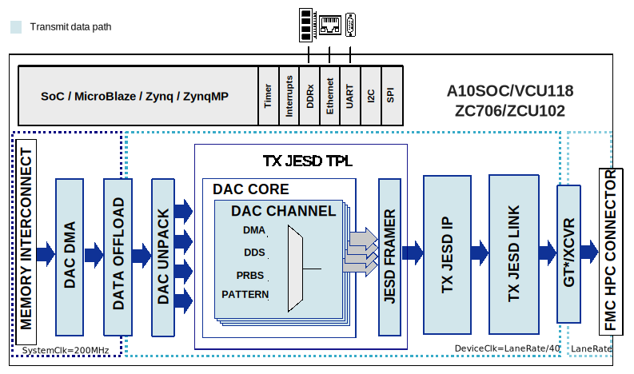

.. _dac_fmc_ebz:

DAC-FMC-EBZ HDL project
===============================================================================

Overview
-------------------------------------------------------------------------------

DAC-FMC-EBZ HDL project is a wrapper over many DAC-based evaluation boards,
all having similar interfaces, which will be listed below.
Each evaluation board has its particularities, which are supported in this
design and can be selected by changing some parameters before building the
project.

Supported boards
-------------------------------------------------------------------------------

- :adi:`AD9135-FMC-EBZ <EVAL-AD9135>`
- :adi:`AD9136-FMC-EBZ <EVAL-AD9136>`
- :adi:`AD9144-FMC-EBZ <EVAL-AD9144>`
- :adi:`AD9152-FMC-EBZ <EVAL-AD9152>`
- :adi:`AD9154-FMC-EBZ <EVAL-AD9154>`
- :adi:`AD916x-FMC-EBZ <EVAL-AD916x>`
- :adi:`AD917x-FMC-EBZ <EVAL-AD917x>`

Supported devices
-------------------------------------------------------------------------------

- :adi:`AD9135`
- :adi:`AD9136`
- :adi:`AD9144`
- :adi:`AD9152`
- :adi:`AD9154`
- :adi:`AD9161`
- :adi:`AD9162`
- :adi:`AD9163`
- :adi:`AD9164`
- :adi:`AD9171`
- :adi:`AD9172`
- :adi:`AD9173`

Supported carriers
-------------------------------------------------------------------------------

.. list-table::
   :widths: 35 35 30
   :header-rows: 1

   * - Evaluation board
     - Carrier
     - FMC slot
   * - All from :ref:`dac_fmc_ebz supported-devices`
     - :intel:`A10SoC <content/www/us/en/products/details/fpga/arria/10/sx/products.html>`
     - FMCA
   * -
     - :xilinx:`VCU118`
     - FMC+
   * -
     - :xilinx:`ZC706`
     - FMC HPC
   * -
     - :xilinx:`ZCU102`
     - FMC HPC0

Block design
-------------------------------------------------------------------------------

Block diagram
~~~~~~~~~~~~~~~~~~~~~~~~~~~~~~~~~~~~~~~~~~~~~~~~~~~~~~~~~~~~~~~~~~~~~~~~~~~~~~~

The data path and clock domains are depicted in the below diagram:

The data to be sent to DAC can have multiple sources:

DMA source
^^^^^^^^^^^^^^^^^^^^^^^^^^^^^^^^^^^^^^^^^^^^^^^^^^^^^^^^^^^^^^^^^^^^^^^^^^^^^^^
In case of high sample rates where the required data rate exceeds the PS-PL
interface available throughput, the data is transmitted in a loop from a
local buffer (dac_fifo) which is loaded once with the DMA from the PS DDR.
For lower sample rates, the DAC FIFO can be placed in bypass mode, which in
this case, the DMA must stream the data from the PS memory.

DDS source
^^^^^^^^^^^^^^^^^^^^^^^^^^^^^^^^^^^^^^^^^^^^^^^^^^^^^^^^^^^^^^^^^^^^^^^^^^^^^^^
For each DAC channel a tone is generated by a
:dokuwiki:`DDS core <resources/fpga/docs/hdl/regmap#dac_channel_axi_ad>`.

PRBS source
^^^^^^^^^^^^^^^^^^^^^^^^^^^^^^^^^^^^^^^^^^^^^^^^^^^^^^^^^^^^^^^^^^^^^^^^^^^^^^^
For each DAC channel one of the following PN sequence can be selected: PN7,
PN15, inverted PN7, inverted PN15.

Software-defined pattern source
^^^^^^^^^^^^^^^^^^^^^^^^^^^^^^^^^^^^^^^^^^^^^^^^^^^^^^^^^^^^^^^^^^^^^^^^^^^^^^^
For each channel software can set the values which will be driven to the DAC.

Configuration modes
~~~~~~~~~~~~~~~~~~~~~~~~~~~~~~~~~~~~~~~~~~~~~~~~~~~~~~~~~~~~~~~~~~~~~~~~~~~~~~~

Before building the reference design,
the :git-hdl:`projects/dac_fmc_ebz/common/config.tcl` file should be updated
with the desired DAC device and JESD operation mode, or these parameters can be
given at build time, when running ``make``.

The block design will scale according to the selected mode.

.. collapsible:: AD9135/AD9136 supported modes

   +------+----------------------------------+
   |      | JESD parameters                  |
   |      +----+----+----+----+----+----+----+
   | Mode | M  | L  | S  | F  | HD | N  | NP |
   +======+====+====+====+====+====+====+====+
   | 08   | 1  | 4  | 2  | 1  | 1  | 16 | 16 |
   +------+----+----+----+----+----+----+----+
   | 09   | 1  | 2  | 1  | 1  | 1  | 16 | 16 |
   +------+----+----+----+----+----+----+----+
   | 10   | 1  | 1  | 1  | 2  | 0  | 16 | 16 |
   +------+----+----+----+----+----+----+----+
   | 11   | 2  | 8  | 2  | 1  | 1  | 16 | 16 |
   +------+----+----+----+----+----+----+----+
   | 12   | 2  | 4  | 1  | 1  | 1  | 16 | 16 |
   +------+----+----+----+----+----+----+----+
   | 13   | 2  | 2  | 1  | 2  | 0  | 16 | 16 |
   +------+----+----+----+----+----+----+----+

.. collapsible:: AD9144/AD9154 supported modes

   +------+----------------------------------+
   |      | JESD parameters                  |
   |      +----+----+----+----+----+----+----+
   | Mode | M  | L  | S  | F  | HD | N  | NP |
   +======+====+====+====+====+====+====+====+
   | 00   | 4  | 8  | 1  | 1  | 1  | 16 | 16 |
   +------+----+----+----+----+----+----+----+
   | 01   | 4  | 8  | 2  | 2  | 0  | 16 | 16 |
   +------+----+----+----+----+----+----+----+
   | 02   | 4  | 4  | 1  | 2  | 0  | 16 | 16 |
   +------+----+----+----+----+----+----+----+
   | 03   | 4  | 2  | 1  | 4  | 0  | 16 | 16 |
   +------+----+----+----+----+----+----+----+
   | 04   | 2  | 4  | 1  | 1  | 1  | 16 | 16 |
   +------+----+----+----+----+----+----+----+
   | 05   | 2  | 4  | 2  | 2  | 0  | 16 | 16 |
   +------+----+----+----+----+----+----+----+
   | 06   | 2  | 2  | 1  | 2  | 0  | 16 | 16 |
   +------+----+----+----+----+----+----+----+
   | 07   | 2  | 1  | 1  | 4  | 0  | 16 | 16 |
   +------+----+----+----+----+----+----+----+
   | 09   | 1  | 2  | 1  | 1  | 1  | 16 | 16 |
   +------+----+----+----+----+----+----+----+
   | 10   | 1  | 1  | 1  | 2  | 0  | 16 | 16 |
   +------+----+----+----+----+----+----+----+

.. collapsible:: AD9152 supported modes

   +------+----------------------------------+
   |      | JESD parameters                  |
   |      +----+----+----+----+----+----+----+
   | Mode | M  | L  | S  | F  | HD | N  | NP |
   +======+====+====+====+====+====+====+====+
   | 04   | 2  | 4  | 1  | 1  | 1  | 16 | 16 |
   +------+----+----+----+----+----+----+----+
   | 05   | 2  | 4  | 2  | 2  | 0  | 16 | 16 |
   +------+----+----+----+----+----+----+----+
   | 06   | 2  | 2  | 1  | 2  | 0  | 16 | 16 |
   +------+----+----+----+----+----+----+----+
   | 07   | 2  | 1  | 1  | 4  | 0  | 16 | 16 |
   +------+----+----+----+----+----+----+----+
   | 09   | 1  | 2  | 1  | 1  | 1  | 16 | 16 |
   +------+----+----+----+----+----+----+----+
   | 10   | 1  | 1  | 1  | 2  | 0  | 16 | 16 |
   +------+----+----+----+----+----+----+----+

.. collapsible:: AD9161/2/3/4 supported modes

   +------+----------------------------------+
   |      | JESD parameters                  |
   |      +----+----+----+----+----+----+----+
   | Mode | M  | L  | S  | F  | HD | N  | NP |
   +======+====+====+====+====+====+====+====+
   | 01   | 2  | 1  | 1  | 4  | 1  | 16 | 16 |
   +------+----+----+----+----+----+----+----+
   | 02   | 2  | 2  | 2  | 2  | 1  | 16 | 16 |
   +------+----+----+----+----+----+----+----+
   | 03   | 2  | 3  | 3  | 4  | 1  | 16 | 16 |
   +------+----+----+----+----+----+----+----+
   | 04   | 2  | 4  | 1  | 1  | 1  | 16 | 16 |
   +------+----+----+----+----+----+----+----+
   | 06   | 2  | 6  | 3  | 2  | 1  | 16 | 16 |
   +------+----+----+----+----+----+----+----+
   | 08   | 2  | 8  | 2  | 1  | 1  | 16 | 16 |
   +------+----+----+----+----+----+----+----+

.. collapsible:: AD9171 supported modes

   +------+----------------------------------+
   |      | JESD parameters                  |
   |      +----+----+----+----+----+----+----+
   | Mode | M  | L  | S  | F  | HD | N  | NP |
   +======+====+====+====+====+====+====+====+
   | 00   | 2  | 1  | 1  | 4  | 1  | 16 | 16 |
   +------+----+----+----+----+----+----+----+
   | 03   | 2  | 2  | 1  | 2  | 1  | 16 | 16 |
   +------+----+----+----+----+----+----+----+

.. collapsible:: AD9172/4/6 supported modes

   +------+----------------------------------+
   |      | JESD parameters                  |
   |      +----+----+----+----+----+----+----+
   | Mode | M  | L  | S  | F  | HD | N  | NP |
   +======+====+====+====+====+====+====+====+
   | 00   | 2  | 1  | 1  | 4  | 1  | 16 | 16 |
   +------+----+----+----+----+----+----+----+
   | 01   | 4  | 2  | 1  | 4  | 1  | 16 | 16 |
   +------+----+----+----+----+----+----+----+
   | 02   | 6  | 3  | 1  | 4  | 1  | 16 | 16 |
   +------+----+----+----+----+----+----+----+
   | 03   | 2  | 2  | 1  | 2  | 1  | 16 | 16 |
   +------+----+----+----+----+----+----+----+
   | 04   | 4  | 4  | 1  | 2  | 1  | 16 | 16 |
   +------+----+----+----+----+----+----+----+
   | 08   | 2  | 4  | 1  | 1  | 1  | 16 | 16 |
   +------+----+----+----+----+----+----+----+
   | 09   | 2  | 4  | 2  | 2  | 1  | 16 | 16 |
   +------+----+----+----+----+----+----+----+
   | 10   | 2  | 8  | 2  | 1  | 1  | 16 | 16 |
   +------+----+----+----+----+----+----+----+
   | 11   | 2  | 8  | 4  | 2  | 1  | 16 | 16 |
   +------+----+----+----+----+----+----+----+
   | 18   | 1  | 4  | 2  | 1  | 1  | 16 | 16 |
   +------+----+----+----+----+----+----+----+
   | 19   | 1  | 4  | 4  | 2  | 1  | 16 | 16 |
   +------+----+----+----+----+----+----+----+
   | 20   | 1  | 8  | 4  | 1  | 1  | 16 | 16 |
   +------+----+----+----+----+----+----+----+
   | 21   | 1  | 8  | 8  | 2  | 1  | 16 | 16 |
   +------+----+----+----+----+----+----+----+

.. collapsible:: AD9173/5 supported modes

   +------+----------------------------------+
   |      | JESD parameters                  |
   |      +----+----+----+----+----+----+----+
   | Mode | M  | L  | S  | F  | HD | N  | NP |
   +======+====+====+====+====+====+====+====+
   | 00   | 2  | 1  | 1  | 4  | 1  | 16 | 16 |
   +------+----+----+----+----+----+----+----+
   | 01   | 4  | 2  | 1  | 4  | 1  | 16 | 16 |
   +------+----+----+----+----+----+----+----+
   | 02   | 6  | 3  | 1  | 4  | 1  | 16 | 16 |
   +------+----+----+----+----+----+----+----+
   | 03   | 2  | 2  | 1  | 2  | 1  | 16 | 16 |
   +------+----+----+----+----+----+----+----+
   | 04   | 4  | 4  | 1  | 2  | 1  | 16 | 16 |
   +------+----+----+----+----+----+----+----+
   | 08   | 2  | 4  | 1  | 1  | 1  | 16 | 16 |
   +------+----+----+----+----+----+----+----+
   | 09   | 2  | 4  | 2  | 2  | 1  | 16 | 16 |
   +------+----+----+----+----+----+----+----+
   | 13   | 2  | 4  | 1  | 1  | 1  | 16 | 16 |
   +------+----+----+----+----+----+----+----+
   | 14   | 2  | 4  | 2  | 2  | 1  | 16 | 16 |
   +------+----+----+----+----+----+----+----+
   | 15   | 2  | 8  | 2  | 1  | 1  | 16 | 16 |
   +------+----+----+----+----+----+----+----+
   | 16   | 2  | 8  | 4  | 2  | 1  | 16 | 16 |
   +------+----+----+----+----+----+----+----+

Clock scheme
~~~~~~~~~~~~~~~~~~~~~~~~~~~~~~~~~~~~~~~~~~~~~~~~~~~~~~~~~~~~~~~~~~~~~~~~~~~~~~~

CPU/Memory interconnects addresses
~~~~~~~~~~~~~~~~~~~~~~~~~~~~~~~~~~~~~~~~~~~~~~~~~~~~~~~~~~~~~~~~~~~~~~~~~~~~~~~

The addresses are dependent on the architecture of the FPGA, having an offset
added to the base address from HDL (see more at :ref:`architecture`).

===================================  ===============  ===========  ===========
Instance                             Zynq/Microblaze  ZynqMP       A10SoC
===================================  ===============  ===========  ===========
dac_jesd204_xcvr                     0x44A6_0000      0x84A6_0000  ---
dac_jesd204_transport                0x44A0_4000      0x84A0_4000  0x0003_0000
dac_jesd204_link                     0x44A9_0000      0x84A9_0000
dac_dma                              0x7C42_0000      0x9C42_0000  0x0004_0000
dac_jesd204_link.link_reconfig*                                    0x0002_0000
dac_jesd204_link.link_management*                                  0x0002_4000
dac_jesd204_link.link_pll_reconfig*                                0x0002_5000
dac_jesd204_link.lane_pll_reconfig*                                0x0002_6000
dac_jesd204_link.phy_reconfig_0**                                  0x0002_8000
dac_jesd204_link.phy_reconfig_1**                                  0x0002_9000
dac_jesd204_link.phy_reconfig_2**                                  0x0002_A000
dac_jesd204_link.phy_reconfig_3**                                  0x0002_B000
dac_jesd204_link.phy_reconfig_4**                                  0x0002_C000
dac_jesd204_link.phy_reconfig_5**                                  0x0002_D000
dac_jesd204_link.phy_reconfig_6**                                  0x0002_E000
dac_jesd204_link.phy_reconfig_7**                                  0x0002_F000
===================================  ===============  ===========  ===========

.. note::

   - \* - only in the case of Arria10SoC
   - \** - one for each lane, depends on the number of lanes; if L=4,
     then only _0->_3 will exist.

SPI connections
~~~~~~~~~~~~~~~~~~~~~~~~~~~~~~~~~~~~~~~~~~~~~~~~~~~~~~~~~~~~~~~~~~~~~~~~~~~~~~~

.. important::

   ``spi_en`` is **active HIGH** for AD9135-, AD9136- and AD9144-FMC-EBZ
   and **active LOW** for AD9171-, AD9172-, and AD9173-FMC-EBZ.

A10SoC
^^^^^^^^^^^^^^^^^^^^^^^^^^^^^^^^^^^^^^^^^^^^^^^^^^^^^^^^^^^^^^^^^^^^^^^^^^^^^^^

VCU118
^^^^^^^^^^^^^^^^^^^^^^^^^^^^^^^^^^^^^^^^^^^^^^^^^^^^^^^^^^^^^^^^^^^^^^^^^^^^^^^

ZC706
^^^^^^^^^^^^^^^^^^^^^^^^^^^^^^^^^^^^^^^^^^^^^^^^^^^^^^^^^^^^^^^^^^^^^^^^^^^^^^^

ZCU102
^^^^^^^^^^^^^^^^^^^^^^^^^^^^^^^^^^^^^^^^^^^^^^^^^^^^^^^^^^^^^^^^^^^^^^^^^^^^^^^

For AD9135/AD9144/AD9172:

.. list-table::
   :widths: 25 25 25 25
   :header-rows: 1

   * - SPI type
     - SPI manager instance
     - SPI subordinate
     - CS
   * - PS
     - SPI 0
     - HMC7044
     - 0
   * - PS
     - SPI 0
     -
     - 1
   * - PS
     - SPI 0
     - Not connected
     - 2
   * - PS
     - SPI 1
     - PMOD
     - 0

For AD916(1,2,3,4):

.. list-table::
   :widths: 25 25 25 25
   :header-rows: 1

   * - SPI type
     - SPI manager instance
     - SPI subordinate
     - CS
   * - PS
     - SPI 0
     - AD9508
     - 0
   * - PS
     - SPI 0
     -
     - 1
   * - PS
     - SPI 0
     - ADF4355
     - 2
   * - PS
     - SPI 1
     - PMOD
     - 0

GPIOs
~~~~~~~~~~~~~~~~~~~~~~~~~~~~~~~~~~~~~~~~~~~~~~~~~~~~~~~~~~~~~~~~~~~~~~~~~~~~~~~

ZCU102
^^^^^^^^^^^^^^^^^^^^^^^^^^^^^^^^^^^^^^^^^^^^^^^^^^^^^^^^^^^^^^^^^^^^^^^^^^^^^^^

.. list-table::
   :widths: 25 20 20 20 15
   :header-rows: 2

   * - GPIO signal
     - Direction
     - HDL GPIO EMIO
     - Software GPIO
     - Software GPIO
   * -
     - (from FPGA view)
     -
     - Zynq-7000
     - Zynq MP
     - A10SoC
   * - dac_ctrl[4:0]
     - INOUT
     - 25:21
     - 79:75
     - 103:99
   * - pmod_gpio[3:0]
     - INOUT
     - 51:48
     - 105:102
     - 129:126
