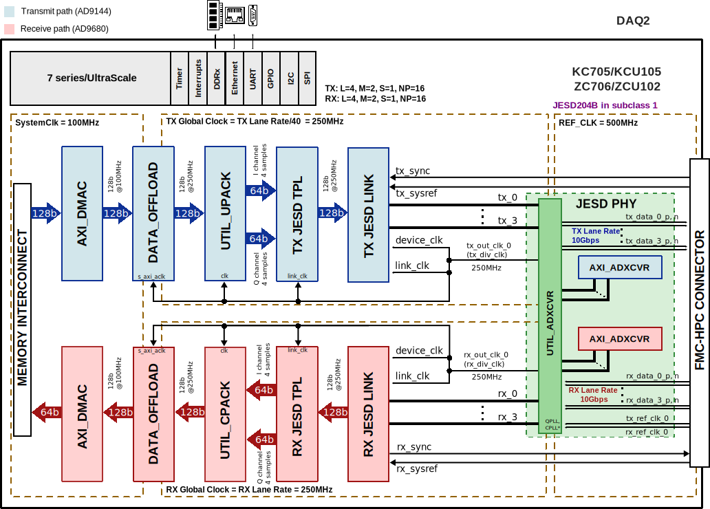

.. _daq2:

DAQ2 HDL Project
===============================================================================

Overview
-------------------------------------------------------------------------------

The :adi:`AD-FMCDAQ2-EBZ <EVAL-AD-FMCDAQ2-EBZ>` module is comprised of the
:adi:`AD9680` dual, 14-bit, 1.0 GSPS, JESD204B ADC, the :adi:`AD9144` quad,
16-bit, 2.8 GSPS, JESD204B DAC, the :adi:`AD9523-1` clock, and power management
components.  It is clocked by an internally generated carrier platform via the
FMC connector, comprising a completely self contained data acquisition and
signal synthesis prototyping platform. In an FMC footprint, the module's
combination of wideband data conversion, clocking, and power closely
approximates real-world hardware and software for system prototyping and design,
with no compromise in signal chain performance.

The HDL reference design is an embedded system built around a processor core
either ARM, NIOS-II or Microblaze. The high speed digital interface of the
converters is handled by the :ref:`JESD204B framework <jesd204>`.

Supported boards
-------------------------------------------------------------------------------

- :adi:`AD-FMCDAQ2-EBZ <EVAL-AD-FMCDAQ2-EBZ>`

Supported devices
-------------------------------------------------------------------------------

- :adi:`AD9680`
- :adi:`AD9144`

Supported carriers
-------------------------------------------------------------------------------

.. list-table::
   :widths: 35 35 30
   :header-rows: 1

   * - Evaluation board
     - Carrier
     - FMC slot
   * - :adi:`AD-FMCDAQ2-EBZ <EVAL-AD-FMCDAQ2-EBZ>`
     - :xilinx:`KC705` *
     - FMC HPC
   * -
     - :xilinx:`KCU105`
     - FMC HPC
   * -
     - :xilinx:`ZC706`
     - FMC HPC
   * -
     - :xilinx:`ZCU102`
     - FMC HPC0

.. admonition:: Legend
   :class: note

   - ``*`` removed; last release that supports this project on this carrier is
     :git-hdl:`hdl_2023_r2 <hdl_2023_r2:projects/daq2/kc705>`

Block design
-------------------------------------------------------------------------------

Block diagram
~~~~~~~~~~~~~~~~~~~~~~~~~~~~~~~~~~~~~~~~~~~~~~~~~~~~~~~~~~~~~~~~~~~~~~~~~~~~~~~

The data path and clock domains are depicted in the below diagram:

.. collapsible:: Click here for details on the block diagram modules

   .. list-table::
      :widths: 10 20 35 35
      :header-rows: 1

      * - Block name
        - IP name
        - Documentation
        - Additional info
      * - AXI_ADXCVR
        - :git-hdl:`axi_adxcvr <library/xilinx/axi_adxcvr>`
        - :ref:`axi_adxcvr`
        - 2 instances, one for Rx and one for Tx
      * - AXI_DMAC
        - :git-hdl:`axi_dmac <library/axi_dmac>`
        - :ref:`axi_dmac`
        - 2 instances, one for Rx and one for Tx
      * - RX JESD LINK
        - axi_ad9680_jesd
        - :ref:`axi_jesd204_rx`
        - Instantiated by ``adi_axi_jesd204_rx_create`` procedure
      * - RX JESD TPL
        - axi_ad9680_core
        - :ref:`ad_ip_jesd204_tpl_adc`
        - Instantiated by ``adi_tpl_jesd204_rx_create`` procedure
      * - TX JESD LINK
        - axi_ad9144_jesd
        - :ref:`axi_jesd204_tx`
        - Instantiaded by ``adi_axi_jesd204_tx_create`` procedure
      * - TX JESD TPL
        - axi_ad9144_core
        - :ref:`ad_ip_jesd204_tpl_dac`
        - Instantiated by ``adi_tpl_jesd204_tx_create`` procedure
      * - UTIL_UPACK
        - :git-hdl:`util_upack2 <library/util_pack/util_upack2>`
        - :ref:`util_upack2`
        - ---
      * - UTIL_CPACK
        - :git-hdl:`util_upack2 <library/util_pack/util_cpack2>`
        - :ref:`util_cpack2`
        - ---
      * - UTIL_ADXCVR
        - :git-hdl:`util_adxcvr <library/xilinx/util_adxcvr>`
        - :ref:`util_adxcvr`
        - ---
      * - DATA_OFFLOAD
        - :git-hdl:`data_offload <library/data_offload>`
        - :ref:`data_offload`
        - 2 instances, one for Rx and one for Tx

The reference design is a processor based (ARM or Microblaze) embedded system. A
functional block diagram of the system is given above. The shared transceivers
are followed by the individual JESD204B and ADC/DAC IP cores. The cores are
programmable through an AXI-lite interface.

The digital interface consists of 4 transmit and 4 receive lanes running at
10Gbps, by default. The transceivers interface the ADC/DAC cores at
128bits @250MHz. The data is sent or received based on the configuration of
separate transmit and receive chains.

Evaluation Board Block diagram
~~~~~~~~~~~~~~~~~~~~~~~~~~~~~~~~~~~~~~~~~~~~~~~~~~~~~~~~~~~~~~~~~~~~~~~~~~~~~~~
The data path and associated clock domains of the evaluation board are shown in
the diagram below.

Configuration modes
~~~~~~~~~~~~~~~~~~~~~~~~~~~~~~~~~~~~~~~~~~~~~~~~~~~~~~~~~~~~~~~~~~~~~~~~~~~~~~~

The following are the parameters of this project that can be configured:

- [RX/TX]_JESD_M: number of converters per link
- [RX/TX]_JESD_L: number of lanes per link
- [RX/TX]_JESD_S: number of samples per frame

Clock scheme
~~~~~~~~~~~~~~~~~~~~~~~~~~~~~~~~~~~~~~~~~~~~~~~~~~~~~~~~~~~~~~~~~~~~~~~~~~~~~~~

The :adi:`AD9523-1` is responsible for generating and distributing all clock
signals used on the AD-FMCDAQ2-EBZ platform.

The :adi:`AD-FMCDAQ2-EBZ <EVAL-AD-FMCDAQ2-EBZ>` platform only uses the second
PLL of the :adi:`AD9523-1` with the reference for the PLL being sourced from an
external 125 MHz crystal. 

This is the default AD-FMCDAQ2-EBZ configuration with both converters running at
the maximum supported samplerate of 1 GSPS.

========================= ================== =================
Clock                     Frequency          Divider Setting
========================= ================== =================
Master Clock              1000 MHz           3
ADC converter clock       1000 MHz           1
ADC FPGA Reference lock   500 MHz            2
ADC SYSREF clock          7.8125 MHz         128
ADC FPGA SYSREF clock     7.8125 MHz         128
ADC JESD204 lane rate     10 Gbps
DAC converter clock       1000 MHz           1
DAC FPGA reference clock  500 MHz            2
DAC SYSREF clock          7.8125 MHz         128
DAC FPGA SYSREF clock     7.8125 MHz         128
DAC JESD204 lane rate     10 Gbps
========================= ================== =================

Limitations
^^^^^^^^^^^^^^^^^^^^^^^^^^^^^^^^^^^^^^^^^^^^^^^^^^^^^^^^^^^^^^^^^^^^^^^^^^^^^^^

The design has one JESD receive chain and one JESD transmit chain each with 4
lanes at the rate of 10Gbps. The JESD receive chain consists of a physical layer
represented by an XCVR module, a link layer represented by an RX JESD LINK
module and transport layer represented by a RX JESD TPL module. The link
operates in Subclass 1.

The link is set for full bandwidth mode and operate with the following
parameters:

Deframer paramaters: L=4, M=2, S=1, NP = 16

- RX/TX Device Clock - 250 MHz
- JESD204B Lane Rate - 10Gbps

CPU/Memory interconnects addresses
~~~~~~~~~~~~~~~~~~~~~~~~~~~~~~~~~~~~~~~~~~~~~~~~~~~~~~~~~~~~~~~~~~~~~~~~~~~~~~~

The addresses are dependent on the architecture of the FPGA, having an offset
added to the base address from HDL (see more at :ref:`architecture cpu-intercon-addr`).

==================== =============== ===========
Instance             Zynq/Microblaze ZynqMP     
==================== =============== ===========
axi_ad9144_xcvr      0x44A6_0000     0x84A6_0000
axi_ad9144_tpl       0x44A0_4000     0x84A0_4000
axi_ad9144_jesd      0x44A9_0000     0x84A9_0000
axi_ad9144_dma       0x7C42_0000     0x9C42_0000
axi_ad9144_offload   0x7C44_0000     0x9C44_0000
axi_ad9680_xcvr      0x44A5_0000     0x84A5_0000
axi_ad9680_tpl       0x44A1_0000     0x84A1_0000
axi_ad9680_jesd      0x44AA_0000     0x84AA_0000
axi_ad9680_dma       0x7C40_0000     0x9C40_0000
axi_ad9680_offload   0x7C46_0000     0x9C46_0000
==================== =============== ===========

================================= ===========
Instance                          A10SoC
================================= ===========
ad9144_jesd204.link_reconfig      0x0002_0000
ad9144_jesd204.link_management    0x0002_4000
ad9144_jesd204.link_pll_reconfig  0x0002_5000
ad9144_jesd204.lane_pll_reconfig  0x0002_6000
avl_adxcfg_0.rcfg_s0              0x0002_8000
avl_adxcfg_1.rcfg_s0              0x0002_9000
avl_adxcfg_2.rcfg_s0              0x0002_A000
avl_adxcfg_3.rcfg_s0              0x0002_B000
axi_ad9144_dma.s_axi              0x0002_C000
axi_ad9144.s_axi                  0x0003_4000
ad9680_jesd204.link_reconfig      0x0004_0000
ad9680_jesd204.link_management    0x0004_4000
ad9680_jesd204.link_pll_reconfig  0x0004_5000
avl_adxcfg_0.rcfg_s1              0x0004_8000
avl_adxcfg_1.rcfg_s1              0x0004_9000
avl_adxcfg_2.rcfg_s1              0x0004_A000
avl_adxcfg_3.rcfg_s1              0x0004_B000
axi_ad9680_dma.s_axi              0x0004_C000
axi_ad9680.s_axi                  0x0005_0000
================================= ===========

SPI connections
~~~~~~~~~~~~~~~~~~~~~~~~~~~~~~~~~~~~~~~~~~~~~~~~~~~~~~~~~~~~~~~~~~~~~~~~~~~~~~~

.. list-table::
   :widths: 25 25 25 25
   :header-rows: 1

   * - SPI type
     - SPI manager instance
     - SPI subordinate
     - CS
   * - PS
     - SPI 0
     - AD9523-1
     - 0
   * - PS
     - SPI 0
     - AD9144
     - 1
   * - PS
     - SPI 0
     - AD9680
     - 2

GPIOs
~~~~~~~~~~~~~~~~~~~~~~~~~~~~~~~~~~~~~~~~~~~~~~~~~~~~~~~~~~~~~~~~~~~~~~~~~~~~~~~

The Software GPIO number is calculated as follows:

- ZynqMP: the offset is 78
- A10SoC: the offset is 0

.. list-table::
   :widths: 25 20 20 20 15
   :header-rows: 2

   * - GPIO signal
     - Direction
     - HDL GPIO EMIO
     - Software GPIO
     - Software GPIO
   * -
     - (from FPGA view)
     -
     - Zynq MP
     - A10SoC
   * - trig
     - IN
     - 43
     - 121
     - 43
   * - adc_pd
     - OUT
     - 42
     - 120
     - 42
   * - adac_txen
     - OUT
     - 41
     - 119
     - 41
   * - dac_reset
     - OUT
     - 40
     - 118
     - 40
   * - clk_sync
     - OUT
     - 38
     - 116
     - 38
   * - adc_fdb
     - IN
     - 36
     - 114
     - 36
   * - adc_fda
     - IN
     - 35
     - 113
     - 35
   * - dac_irq
     - IN
     - 34
     - 112
     - 34
   * - clkd_status
     - IN
     - 33:32
     - 111:110
     - 33:32

- Zynq-7000: the offset is 54

.. list-table::
   :widths: 25 20 20 20
   :header-rows: 2

   * - GPIO signal
     - Direction
     - HDL GPIO EMIO
     - Software GPIO
   * -
     - (from FPGA view)
     -
     - Zynq MP
   * - trig
     - IN
     - 43
     - 97
   * - adc_pd
     - OUT
     - 42
     - 96
   * - adac_txen
     - OUT
     - 41
     - 95
   * - dac_reset
     - OUT
     - 40
     - 94
   * -  clk_sync
     - OUT
     - 38
     - 92
   * - adc_fdb
     - IN
     - 36
     - 90
   * - adc_fda
     - IN
     - 35
     - 89
   * - dac_irq
     - IN
     - 34
     - 88
   * - clkd_status
     - IN
     - 33:32
     - 87:86

Interrupts
~~~~~~~~~~~~~~~~~~~~~~~~~~~~~~~~~~~~~~~~~~~~~~~~~~~~~~~~~~~~~~~~~~~~~~~~~~~~~~~

Below are the Programmable Logic interrupts used in this project.

.. list-table::
   :widths: 30 10 15 15 15 15
   :header-rows: 1

   * - Instance name
     - HDL
     - Linux Zynq
     - Actual Zynq
     - Linux ZynqMP
     - Actual ZynqMP
   * - axi_ad9144_jesd
     - 10
     - 54
     - 86
     - 106
     - 138
   * - axi_ad9680_jesd
     - 11
     - 55
     - 87
     - 107
     - 139
   * - axi_ad9144_dma
     - 12
     - 56
     - 88
     - 108
     - 140
   * - axi_ad9680_dma
     - 13
     - 57
     - 89
     - 109
     - 141

Building the HDL project
-------------------------------------------------------------------------------

The design is built upon ADI's generic HDL reference design framework.
ADI distributes the bit/elf files of these projects as part of the
:dokuwiki:`ADI Kuiper Linux <resources/tools-software/linux-software/kuiper-linux>`.
If you want to build the sources, ADI makes them available on the
:git-hdl:`HDL repository </>`. To get the source you must
`clone <https://git-scm.com/book/en/v2/Git-Basics-Getting-a-Git-Repository>`__
the HDL repository.

Then go to the hdl/projects/daq2/$carrier location and run the make
command.

**Linux/Cygwin/WSL**
Example of running the ``make`` command without parameters (using the default
configuration):

.. shell::

   $cd hdl/projects/daq2/zcu102
   $make

Example of running the ``make`` command with parameters:

.. shell::

   $cd hdl/projects/daq2/zcu102
   $make RX_JESD_M=4 RX_JESD_L=4 RX_JESD_S=1 TX_JESD_M=4 TX_JESD_L=4 RX_JESD_S=1 

The result of the build, if parameters were used, will be in a folder named
by the configuration used:

if the following command was run

``make RX_JESD_M=4 RX_JESD_L=4 RX_JESD_S=1 TX_JESD_M=4 TX_JESD_L=4 RX_JESD_S=1``

then the folder name will be:

``RXM4_RXL4_RXS1_TXM4_TX_L4_TXS1``
because of truncation of some keywords so the name will not exceed the limits
of the Operating System (``JESD``, ``LANE``, etc. are removed) of 260
characters.

A more comprehensive build guide can be found in the :ref:`build_hdl` user guide.

Software considerations
-------------------------------------------------------------------------------

Given that the IP uses the same QUAD as the DAC, performing channel
reconfiguration may affect the DAC and vice versa. When using the JESD204B
framework, this is taken into consideration by software.

To relax the constraints for PCB design, the n-th physical lane it is not
connected to the n-th logical lane, therefore there is a remapping scheme
between the physical and link layer to reorder the data streams.

============ ======================= =======================
DAC phy Lane FPGA Tx lane for Xilinx FPGA Tx lane for Altera
============ ======================= =======================
0            0                       0
1            2                       3
2            1                       1
3            3                       2
============ ======================= =======================

Resources
-------------------------------------------------------------------------------

Hardware related
~~~~~~~~~~~~~~~~~~~~~~~~~~~~~~~~~~~~~~~~~~~~~~~~~~~~~~~~~~~~~~~~~~~~~~~~~~~~~~~

- Product datasheets:

  - :adi:`AD9680`
  - :adi:`AD9144`

HDL related
~~~~~~~~~~~~~~~~~~~~~~~~~~~~~~~~~~~~~~~~~~~~~~~~~~~~~~~~~~~~~~~~~~~~~~~~~~~~~~~

- :git-hdl:`DAQ2 HDL project source code <projects/daq2>`

.. list-table::
   :widths: 30 35 35
   :header-rows: 1

   * - IP name
     - Source code link
     - Documentation link
   * - AXI_DMAC
     - :git-hdl:`library/axi_dmac`
     - :ref:`axi_dmac`
   * - AXI_SYSID
     - :git-hdl:`library/axi_sysid`
     - :ref:`axi_sysid`
   * - SYSID_ROM
     - :git-hdl:`library/sysid_rom`
     - :ref:`axi_sysid`
   * - UTIL_CPACK2
     - :git-hdl:`library/util_pack/util_cpack2`
     - :ref:`util_cpack2`
   * - UTIL_UPACK2
     - :git-hdl:`library/util_pack/util_upack2`
     - :ref:`util_upack2`
   * - UTIL_ADXCVR for AMD
     - :git-hdl:`library/xilinx/util_adxcvr`
     - :ref:`util_adxcvr`
   * - AXI_ADXCVR for Intel
     - :git-hdl:`library/intel/axi_adxcvr`
     - :ref:`axi_adxcvr intel`
   * - AXI_ADXCVR for AMD
     - :git-hdl:`library/xilinx/axi_adxcvr`
     - :ref:`axi_adxcvr amd`
   * - AXI_JESD204_RX
     - :git-hdl:`library/jesd204/axi_jesd204_rx`
     - :ref:`axi_jesd204_rx`
   * - AXI_JESD204_TX
     - :git-hdl:`library/jesd204/axi_jesd204_tx`
     - :ref:`axi_jesd204_tx`
   * - JESD204_TPL_ADC
     - :git-hdl:`library/jesd204/ad_ip_jesd204_tpl_adc`
     - :ref:`ad_ip_jesd204_tpl_adc`
   * - JESD204_TPL_DAC
     - :git-hdl:`library/jesd204/ad_ip_jesd204_tpl_dac`
     - :ref:`ad_ip_jesd204_tpl_dac`
   * - DATA_OFFLOAD
     - :git-hdl:`library/data_offload`
     - 	:ref:`data_offload`

- :dokuwiki:`[Wiki] Generic JESD204B block designs <resources/fpga/docs/hdl/generic_jesd_bds>`
- :ref:`jesd204`

Software related
~~~~~~~~~~~~~~~~~~~~~~~~~~~~~~~~~~~~~~~~~~~~~~~~~~~~~~~~~~~~~~~~~~~~~~~~~~~~~~~

- :git-linux:`DAQ2 KC705 Linux Device Tree <arch/microblaze/boot/dts/kc705_fmcdaq2.dts>`
- :git-linux:`DAQ2 VC707 Device Tree <arch/microblaze/boot/dts/vc707_fmcdaq2.dts>`
- :git-linux:`DAQ2 KCU105 Device Tree <arch/microblaze/boot/dts/kcu105_fmcdaq2.dts>`
- :git-linux:`DAQ2 ZC706 Device Tree <arch/arm/boot/dts/xilinx/zynq-zc706-adv7511-fmcdaq2.dts>`
- :git-linux:`DAQ2 ZCU102 Device Tree <arch/arm64/boot/dts/xilinx/zynqmp-zcu102-rev10-fmcdaq2.dts>`
- :git-linux:`DAQ2 ZCU102 (M=4, L=4) Device Tree <arch/arm64/boot/dts/xilinx/zynqmp-zcu102-rev10-fmcdaq2_m4_l4.dts>`
- :dokuwiki:`[Wiki] DAQ2/3 IIO Oscilloscope plugin wiki page <resources/tools-software/linux-software/fmcdaq2_plugin>`

.. include:: ../common/more_information.rst

.. include:: ../common/support.rst
