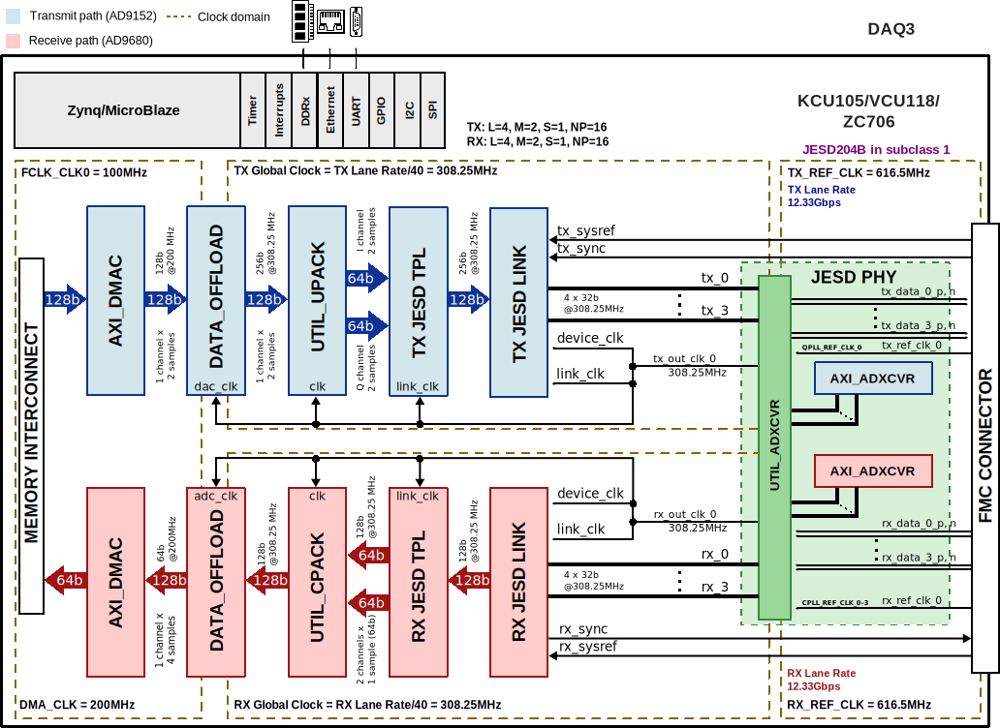
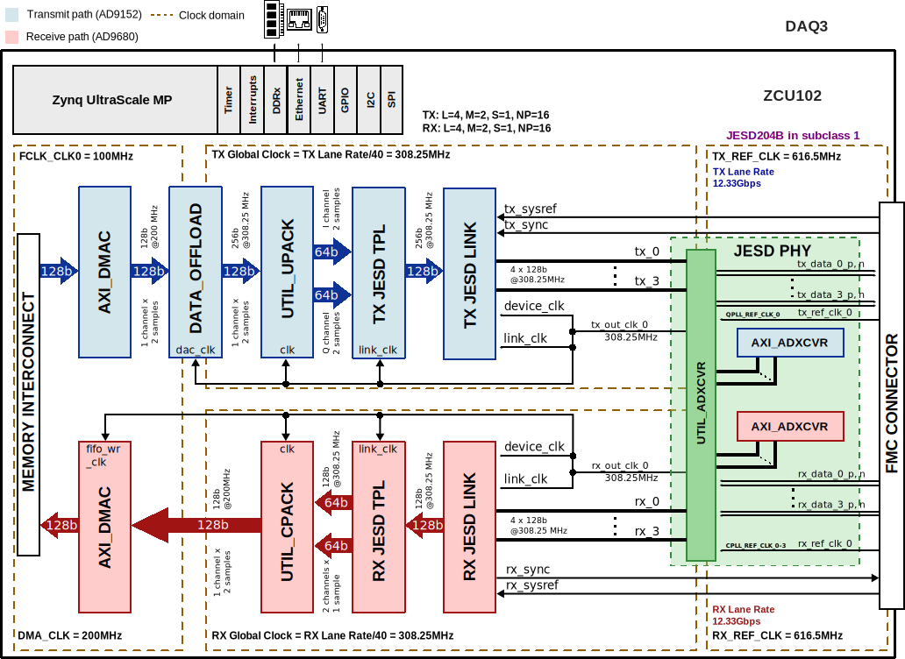

.. _daq3:

DAQ3 HDL Project
===============================================================================

Overview
-------------------------------------------------------------------------------

The :git-hdl:`DAQ3 <projects/daq3>` reference design showcases the
:adi:`EVAL-FMCDAQ3-EBZ` evaluation board, which is comprised of the
:adi:`AD9680` dual, 14-bit, 1.25 GSPS, JESD204B (subclass 1) ADC, the
:adi:`AD9152` dual, 16-bit, 2.5 GSPS, JESD204B (subclass 1) DAC, and the
:adi:`AD9528` JESD204B/C clock generator, and some power management
components. It is clocked by an internally generated carrier platform via the
FMC connector, comprising a completely self contained data acquisition and
signal synthesis prototyping platform.

Supported boards
-------------------------------------------------------------------------------

- :adi:`EVAL-FMCDAQ3-EBZ`

Supported devices
-------------------------------------------------------------------------------

- :adi:`AD9152`
- :adi:`AD9680`

Supported carriers
-------------------------------------------------------------------------------

.. list-table::
   :widths: 35 35 30
   :header-rows: 1

   * - Evaluation board
     - Carrier
     - FMC slot
   * - :adi:`EVAL-FMCDAQ3-EBZ`
     - :xilinx:`KCU105`
     - FMC HPC
   * -
     - :xilinx:`VCU118`
     - FMC+
   * -
     - :xilinx:`ZCU102`
     - FMC HPC0
   * -
     - :xilinx:`ZC706`
     - FMC HPC

Block design
-------------------------------------------------------------------------------

The difference between the KCU105/VCU118/ZC706 designs and the ZCU102 one, is
the use of :git-hdl:`AXI_ADCFIFO <library/xilinx/axi_adcfifo>`:
in the Zynq UltraScale-based designs, it is not instantiated.

Block diagram
~~~~~~~~~~~~~~~~~~~~~~~~~~~~~~~~~~~~~~~~~~~~~~~~~~~~~~~~~~~~~~~~~~~~~~~~~~~~~~~

KCU105/VCU118/ZC706
^^^^^^^^^^^^^^^^^^^^^^^^^^^^^^^^^^^^^^^^^^^^^^^^^^^^^^^^^^^^^^^^^^^^^^^^^^^^^^^

The data path and clock domains are depicted in the below diagram:

This configuration was built using the ``make`` command with the following
parameters:

.. shell:: bash

   /hdl/projects/daq3/zc706
   $make RX_JESD_M=2 \
   $     RX_JESD_L=4 \
   $     RX_JESD_S=1 \
   $     TX_JESD_M=2 \
   $     TX_JESD_L=4 \
   $     TX_JESD_S=1

.. collapsible:: Click here for details on the block diagram modules

   .. list-table::
      :widths: 10 20 35 35
      :header-rows: 1

      * - Block name
        - IP name
        - Documentation
        - Additional info
      * - AXI_ADCFIFO
        - :git-hdl:`axi_adcfifo <library/xilinx/axi_adcfifo>`
        - ---
        - ---
      * - AXI_ADXCVR
        - :git-hdl:`axi_adxcvr <library/xilinx/axi_adxcvr>`
        - :ref:`axi_adxcvr`
        - 2 instances, one for RX and one for TX
      * - AXI_DMAC
        - :git-hdl:`axi_dmac <library/axi_dmac>`
        - :ref:`axi_dmac`
        - 2 instances, one for RX and one for TX
      * - RX JESD LINK
        - axi_mxfe_rx_jesd
        - :ref:`axi_jesd204_rx`
        - Instantiaded by ``adi_axi_jesd204_rx_create`` procedure
      * - RX JESD TPL
        - axi_ad9680_tpl_core
        - :ref:`ad_ip_jesd204_tpl_adc`
        - Instantiated by ``adi_tpl_jesd204_rx_create`` procedure
      * - TX JESD LINK
        - axi_mxfe_tx_jesd
        - :ref:`axi_jesd204_tx`
        - Instantiaded by ``adi_axi_jesd204_tx_create`` procedure
      * - TX JESD TPL
        - axi_ad9152_tpl_core
        - :ref:`ad_ip_jesd204_tpl_dac`
        - Instantiated by ``adi_tpl_jesd204_tx_create`` procedure
      * - UTIL_ADXCVR
        - :git-hdl:`util_daq3_xcvr <library/xilinx/util_adxcvr>`
        - :ref:`util_adxcvr`
        - Used for both AXI ADXCVR instances
      * - UTIL_CPACK
        - :git-hdl:`axi_ad9680_cpack <library/util_pack/util_cpack2>`
        - :ref:`util_cpack2`
        - ---
      * - UTIL_DACFIFO
        - :git-hdl:`util_dacfifo <library/util_dacfifo>`
        - ---
        - ---
      * - UTIL_UPACK
        - :git-hdl:`axi_ad9152_upack <library/util_pack/util_upack2>`
        - :ref:`util_upack2`
        - ---

ZCU102
^^^^^^^^^^^^^^^^^^^^^^^^^^^^^^^^^^^^^^^^^^^^^^^^^^^^^^^^^^^^^^^^^^^^^^^^^^^^^^^

The data path and clock domains are depicted in the below diagram.

This configuration was built using the ``make`` command with the following
parameters:

.. shell:: bash

   /hdl/projects/daq3/zcu102
   $make RX_JESD_M=2 \
   $     RX_JESD_L=4 \
   $     RX_JESD_S=1 \
   $     TX_JESD_M=2 \
   $     TX_JESD_L=4 \
   $     TX_JESD_S=1

.. collapsible:: Click here for details on the block diagram modules

   .. list-table::
      :widths: 10 20 35 35
      :header-rows: 1

      * - Block name
        - IP name
        - Documentation
        - Additional info
      * - AXI_ADXCVR
        - :git-hdl:`axi_adxcvr <library/xilinx/axi_adxcvr>`
        - :ref:`axi_adxcvr`
        - 2 instances, one for RX and one for TX
      * - AXI_DMAC
        - :git-hdl:`axi_dmac <library/axi_dmac>`
        - :ref:`axi_dmac`
        - 2 instances, one for RX and one for TX
      * - RX JESD LINK
        - axi_mxfe_rx_jesd
        - :ref:`axi_jesd204_rx`
        - Instantiaded by ``adi_axi_jesd204_rx_create`` procedure
      * - RX JESD TPL
        - axi_ad9680_tpl_core
        - :ref:`ad_ip_jesd204_tpl_adc`
        - Instantiated by ``adi_tpl_jesd204_rx_create`` procedure
      * - TX JESD LINK
        - axi_mxfe_tx_jesd
        - :ref:`axi_jesd204_tx`
        - Instantiaded by ``adi_axi_jesd204_tx_create`` procedure
      * - TX JESD TPL
        - axi_ad9152_tpl_core
        - :ref:`ad_ip_jesd204_tpl_dac`
        - Instantiated by ``adi_tpl_jesd204_tx_create`` procedure
      * - UTIL_ADXCVR
        - :git-hdl:`util_daq3_xcvr <library/xilinx/util_adxcvr>`
        - :ref:`util_adxcvr`
        - Used for both AXI ADXCVR instances
      * - UTIL_CPACK
        - :git-hdl:`axi_ad9680_cpack <library/util_pack/util_cpack2>`
        - :ref:`util_cpack2`
        - ---
      * - UTIL_DACFIFO
        - :git-hdl:`util_dacfifo <library/util_dacfifo>`
        - ---
        - ---
      * - UTIL_UPACK
        - :git-hdl:`axi_ad9152_upack <library/util_pack/util_upack2>`
        - :ref:`util_upack2`
        - ---

Clock scheme
~~~~~~~~~~~~~~~~~~~~~~~~~~~~~~~~~~~~~~~~~~~~~~~~~~~~~~~~~~~~~~~~~~~~~~~~~~~~~~~

- Internal clock sources for both the ADC and the DAC, coming from :adi:`AD9528`
  clock-generator chip (device clocks and reference clocks)
- External trigger coming from J1 SMA connector

Configuration modes
~~~~~~~~~~~~~~~~~~~~~~~~~~~~~~~~~~~~~~~~~~~~~~~~~~~~~~~~~~~~~~~~~~~~~~~~~~~~~~~

The design has one JESD204B receive chain and one transmit chain, each with
4 lanes.

Each chain consists of a transport layer represented by a JESD TPL module,
a link layer represented by a JESD LINK module, and a physical layer shared
among chains, represented by an XCVR module.

The HDL project in its current state, has the link operating in subclass 1.

- Rx/Tx device clock - 308.25 MHz
- Reference clock - 616.5 MHz
- JESD204B Rx/Tx lane rate - 12.33 Gbps

The following are the parameters of this project that can be configured:

- [RX/TX]_JESD_M: number of converters per link
- [RX/TX]_JESD_L: number of lanes per link
- [RX/TX]_JESD_S: number of samples per frame

Detailed description
~~~~~~~~~~~~~~~~~~~~~~~~~~~~~~~~~~~~~~~~~~~~~~~~~~~~~~~~~~~~~~~~~~~~~~~~~~~~~~~

The digital interface consists of 4 transmit and 4 receive lanes running at
12.33 Gbps (default).

The devices' interfaces are shared by the same set of transceivers, followed
by the individual JESD204B and ADC/DAC pcores. The transceivers then interface
to the cores at 128 bits at 308.25MHz. The cores are programmable through
an AXI-lite interface.

The data path consists of independent :ref:`DMA <axi_dmac>` interfaces for
the transmit and receive paths. The data is sent or received based on the
configuration (programmable) from separate transmit and receive chains.

The DAC data may be sourced from an internal data generator (DDS, pattern or
PRBS) or from the external DDR via DMA. The internal DDS phase and frequency
are programmable.

The ADC data is sent to the DDR via DMA. The core also supports PN monitoring
at the sample level. This is different from the JESD204B-specific PN sequence
(though they both claim to be from the same equation).

The device control and monitor signals are interfaced to a GPIO module.
The SPI signals are controlled by a separate AXI based SPI core.

- JESD204B in subclass 1 with lane rate 12.33 Gbps
- Rx, Tx: L=2, M=4, S=1, NP=16

CPU/Memory interconnects addresses
~~~~~~~~~~~~~~~~~~~~~~~~~~~~~~~~~~~~~~~~~~~~~~~~~~~~~~~~~~~~~~~~~~~~~~~~~~~~~~~

The addresses are dependent on the architecture of the FPGA, having an offset
added to the base address from HDL (see more at :ref:`architecture cpu-intercon-addr`).

==================== =============== ===========
Instance             Zynq/Microblaze ZynqMP
==================== =============== ===========
axi_ad9152_tpl_core  0x44A0_4000     0x84A0_4000
axi_ad9152_xcvr      0x44A6_0000     0x84A6_0000
axi_ad9152_jesd      0x44A9_0000     0x84A9_0000
axi_ad9152_dma       0x7C42_0000     0x9C42_0000
axi_ad9680_tpl_core  0x44A1_0000     0x84A1_0000
axi_ad9680_xcvr      0x44A5_0000     0x84A5_0000
axi_ad9680_jesd      0x44AA_0000     0x84AA_0000
axi_ad9680_dma       0x7C40_0000     0x9C40_0000
==================== =============== ===========

SPI connections
~~~~~~~~~~~~~~~~~~~~~~~~~~~~~~~~~~~~~~~~~~~~~~~~~~~~~~~~~~~~~~~~~~~~~~~~~~~~~~~

.. list-table::
   :widths: 25 25 25 25
   :header-rows: 1

   * - SPI type
     - SPI manager instance
     - SPI subordinate
     - CS
   * - PS
     - SPI 0
     - AD9528
     - 0
   * - PS
     - SPI 0
     - AD9152
     - 1
   * - PS
     - SPI 0
     - AD9680
     - 2

GPIOs
~~~~~~~~~~~~~~~~~~~~~~~~~~~~~~~~~~~~~~~~~~~~~~~~~~~~~~~~~~~~~~~~~~~~~~~~~~~~~~~

.. list-table::
   :widths: 25 20 20 20 15
   :header-rows: 2

   * - GPIO signal
     - Direction
     - HDL GPIO EMIO
     - Software GPIO
     - Software GPIO
   * -
     - (from FPGA view)
     -
     - Zynq-7000
     - Zynq MP
   * - adc_pd
     - INOUT
     - 38
     - 92
     - 116
   * - dac_txen
     - INOUT
     - 37
     - 91
     - 115
   * - adc_fdb
     - INOUT
     - 36
     - 90
     - 114
   * - adc_fda
     - INOUT
     - 35
     - 89
     - 113
   * - dac_irq
     - INOUT
     - 34
     - 88
     - 112
   * - clkd_status
     - INOUT
     - 32
     - 86
     - 110

Interrupts
~~~~~~~~~~~~~~~~~~~~~~~~~~~~~~~~~~~~~~~~~~~~~~~~~~~~~~~~~~~~~~~~~~~~~~~~~~~~~~~

Below are the Programmable Logic interrupts used in this project.

================ ====== ====== ========== =========== ============ =============
Instance name    HDL PS HDL MB Linux Zynq Actual Zynq Linux ZynqMP Actual ZynqMP
================ ====== ====== ========== =========== ============ =============
axi_ad9680_dma   13     12     57         89          109          141
axi_ad9152_dma   12     13     56         88          108          140
axi_ad9680_jesd  11     14     55         87          107          139
axi_ad9152_jesd  10     15     54         86          106          138
================ ====== ====== ========== =========== ============ =============

Building the HDL project
-------------------------------------------------------------------------------

The design is built upon ADI's generic HDL reference design framework.
ADI distributes the bit/elf files of these projects as part of the
:dokuwiki:`ADI Kuiper Linux <resources/tools-software/linux-software/kuiper-linux>`.
If you want to build the sources, ADI makes them available on the
:git-hdl:`HDL repository </>`. To get the source you must
`clone <https://git-scm.com/book/en/v2/Git-Basics-Getting-a-Git-Repository>`__
the HDL repository.

Then go to the hdl/projects/**daq3**/$carrier location and run the make
command.

**Linux/Cygwin/WSL**

Example of running the ``make`` command without parameters (using the default
configuration):

.. shell:: bash

   $cd hdl/projects/daq3/zcu102
   $make

Example of running the ``make`` command with parameters:

.. shell:: bash

   $cd hdl/projects/daq3/zcu102
   $make RX_JESD_M=4 RX_JESD_L=2 TX_JESD_M=4 TX_JESD_L=2

The result of the build, if parameters were used, will be in a folder named
by the configuration used: ``RXM4_RXL2_TXM4_TXL2``.

A more comprehensive build guide can be found in the :ref:`build_hdl` user guide.

Software considerations
-------------------------------------------------------------------------------

ADC - crossbar config
~~~~~~~~~~~~~~~~~~~~~~~~~~~~~~~~~~~~~~~~~~~~~~~~~~~~~~~~~~~~~~~~~~~~~~~~~~~~~~~

RX lanes are not reordered, they are the same as the physical lanes.

DAC - crossbar config
~~~~~~~~~~~~~~~~~~~~~~~~~~~~~~~~~~~~~~~~~~~~~~~~~~~~~~~~~~~~~~~~~~~~~~~~~~~~~~~

Due to physical constraints, TX lanes are reordered as described in the
following table:

For example, physical lane 2 from DAC connects to logical lane 1
from the FPGA. Therefore the crossbar from the device must be set
accordingly.

+---------------+---+---+---+---+
| logical lane  | 0 | 1 | 2 | 3 |
+===============+===+===+===+===+
| physical lane | 0 | 2 | 3 | 1 |
+---------------+---+---+---+---+

Resources
-------------------------------------------------------------------------------

Systems related
~~~~~~~~~~~~~~~~~~~~~~~~~~~~~~~~~~~~~~~~~~~~~~~~~~~~~~~~~~~~~~~~~~~~~~~~~~~~~~~

- :dokuwiki:`AD-FMCDAQ3-EBZ on Kintex KCU105 quick start guide <resources/eval/user-guides/ad-fmcdaq3-ebz/quickstart/kcu105>`
- :dokuwiki:`AD-FMCDAQ3-EBZ on Virtex UltraScale+ VCU118 quick start guide <resources/eval/user-guides/ad-fmcdaq3-ebz/quickstart/vcu118>`
- :dokuwiki:`AD-FMCDAQ3-EBZ on Zynq ZC706 quick start guide <resources/eval/user-guides/ad-fmcdaq3-ebz/quickstart/zynq>`
- :dokuwiki:`AD-FMCDAQ3-EBZ on Zynq UltraScale MP ZCU102 quick start guide <resources/eval/user-guides/ad-fmcdaq3-ebz/quickstart/zcu102>`
- :dokuwiki:`AD-FMCDAQ3-EBZ on Arria 10 Gx (OBSOLETE) quick start guide <resources/eval/user-guides/ad-fmcdaq3-ebz/quickstart/a10gx>`
- :dokuwiki:`AD-FMCDAQ3-EBZ on MicroBlaze quick start guide <resources/eval/user-guides/ad-fmcdaq2-ebz/quickstart/microblaze>`
  (:dokuwiki:`here <resources/tools-software/linux-drivers/platforms/nios2>`
  you can find prebuilt images for this setup;
  **these are not maintained anymore!**)

Hardware related
~~~~~~~~~~~~~~~~~~~~~~~~~~~~~~~~~~~~~~~~~~~~~~~~~~~~~~~~~~~~~~~~~~~~~~~~~~~~~~~

- Product datasheets:

  - :adi:`AD9680`
  - :adi:`AD9152`

- The schematic can be downloaded from
  :adi:`here <media/en/reference-design-documentation/design-integration-files/ad-fmcdaq3-ebz-designsupport.zip>`
- :dokuwiki:`AD-FMCDAQ3-EBZ hardware overview <resources/eval/user-guides/ad-fmcdaq3-ebz/hardware>`

HDL related
~~~~~~~~~~~~~~~~~~~~~~~~~~~~~~~~~~~~~~~~~~~~~~~~~~~~~~~~~~~~~~~~~~~~~~~~~~~~~~~

- :git-hdl:`DAQ3 HDL project source code <projects/daq3>`

.. list-table::
   :widths: 30 35 35
   :header-rows: 1

   * - IP name
     - Source code link
     - Documentation link
   * - AXI_DMAC
     - :git-hdl:`library/axi_dmac`
     - :ref:`axi_dmac`
   * - AXI_CLKGEN *
     - :git-hdl:`library/axi_clkgen`
     - :ref:`axi_clkgen`
   * - AXI_HDMI_TX *
     - :git-hdl:`library/axi_hdmi_tx`
     - ---
   * - AXI_SPDIF_TX *
     - :git-hdl:`library/axi_spdif_tx`
     - ---
   * - AXI_SYSID
     - :git-hdl:`library/axi_sysid`
     - :ref:`axi_sysid`
   * - JESD204_TPL_ADC
     - :git-hdl:`library/jesd204/ad_ip_jesd204_tpl_adc`
     - :ref:`ad_ip_jesd204_tpl_adc`
   * - JESD204_TPL_DAC
     - :git-hdl:`library/jesd204/ad_ip_jesd204_tpl_dac`
     - :ref:`ad_ip_jesd204_tpl_dac`
   * - AXI_JESD204_RX
     - :git-hdl:`library/jesd204/axi_jesd204_rx`
     - :ref:`axi_jesd204_rx`
   * - AXI_JESD204_TX
     - :git-hdl:`library/jesd204/axi_jesd204_tx`
     - :ref:`axi_jesd204_tx`
   * - SYSID_ROM
     - :git-hdl:`library/sysid_rom`
     - :ref:`axi_sysid`
   * - UTIL_CPACK2
     - :git-hdl:`library/util_pack/util_cpack2`
     - :ref:`util_cpack2`
   * - UTIL_UPACK2
     - :git-hdl:`library/util_pack/util_upack2`
     - :ref:`util_upack2`
   * - AXI_ADCFIFO *
     - :git-hdl:`library/xilinx/axi_adcfifo`
     - ---
   * - UTIL_ADCFIFO **
     - :git-hdl:`library/util_adcfifo`
     - ---
   * - UTIL_DACFIFO
     - :git-hdl:`library/util_dacfifo`
     - ---
   * - AXI_ADXCVR for AMD
     - :git-hdl:`library/xilinx/axi_adxcvr`
     - :ref:`axi_adxcvr amd`
   * - UTIL_ADXCVR
     - :git-hdl:`library/xilinx/util_adxcvr`
     - :ref:`util_adxcvr`

.. note::

   - ``*`` - instantiated only for ZC706
   - ``**`` - instantiated only for KCU105 and VCU118

- :dokuwiki:`[Wiki] Generic JESD204B block designs <resources/fpga/docs/hdl/generic_jesd_bds>`
- :ref:`jesd204`

Software related
~~~~~~~~~~~~~~~~~~~~~~~~~~~~~~~~~~~~~~~~~~~~~~~~~~~~~~~~~~~~~~~~~~~~~~~~~~~~~~~

- DAQ3/KCU105 Linux device tree :git-linux:`kcu105_fmcdaq3.dts <arch/microblaze/boot/dts/kcu105_fmcdaq3.dts>`
- DAQ3/VCU118 Linux device tree :git-linux:`vcu118_fmcdaq3.dts <arch/microblaze/boot/dts/vcu118_fmcdaq3.dts>`
- DAQ3/ZC706 Linux device tree :git-linux:`zynq-zc706-adv7511-fmcdaq3.dts <arch/arm/boot/dts/xilinx/zynq-zc706-adv7511-fmcdaq3.dts>`
- DAQ3/ZCU102 Linux device tree :git-linux:`zynqmp-zcu102-rev10-fmcdaq3.dts <arch/arm64/boot/dts/xilinx/zynqmp-zcu102-rev10-fmcdaq3.dts>`
- :dokuwiki:`AD-FMCDAQ3-EBZ on Zynq ZC706 Linux quick start guide <resources/eval/user-guides/ad-fmcdaq2-ebz/software/linux/zynq>`
- :dokuwiki:`AD-FMCDAQ3-EBZ on Zynq ZC706 no-OS quick start guide <resources/eval/user-guides/ad-fmcdaq3-ebz/software/baremetal>`
- :dokuwiki:`AD-FMCDAQ3-EBZ on MicroBlaze no-OS quick start guide <resources/eval/user-guides/ad-fmcdaq2-ebz/software/linux/microblaze>`
- :dokuwiki:`AD-FMCDAQ3-EBZ IIO Oscilloscope plugin <resources/eval/user-guides/ad-fmcdaq2-ebz/software/linux/applications/iio_scope>`
- :dokuwiki:`FRU EEPROM (fru_dump) utility used on AD-FMCDAQ3-EBZ <resources/eval/user-guides/ad-fmcdaq2-ebz/software/linux/applications/fru_dump>`

.. include:: ../common/more_information.rst

.. include:: ../common/support.rst
