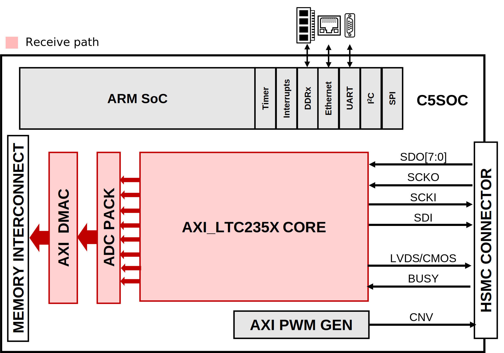

.. _dc2677a:

DC2677A HDL project
================================================================================

Overview
--------------------------------------------------------------------------------

Demonstration circuit 2677A (:adi:`DC2677A`) is a reference design for robust
industrial data acquisition applications for the LTC2358-18. The LTC2358-18 is
capable of high voltage measurements with a large input common range; however,
the :adi:`DC2677A` implements input protection that allows up to 400V of continuous
input protection. Combined with gas discharge tubes, which provide protection from
surges, the :adi:`DC2677A` is capable of surviving extreme abuse.

This reference design includes the LTC2358-18 SAR ADC, :adi:`ADA4522-2` dual zero-drift
operational amplifier, and an :adi:`LT6658` dual-output, high current reference for
sensor excitation.

The digital interface is an HSMC (high-speed mezzanine connector), which is
compatible with Altera Cyclone V SoCkit and other Altera FPGA evaluation boards
that support 3.3V CMOS I/O.

Applications:

- Programmable Logic Controllers
- Industrial Process Control
- Power Line Monitoring
- Test and Measurement

Supported boards
-------------------------------------------------------------------------------

- :adi:`DC2677A`

Supported devices
-------------------------------------------------------------------------------

- :adi:`LTC2358-18`

Supported carriers
-------------------------------------------------------------------------------

- :intel:`C5SoC <content/www/us/en/products/details/fpga/development-kits/cyclone/v-sx.html>` (Cyclone V SoC)
  HSMC

Block design
-------------------------------------------------------------------------------

Block diagram
~~~~~~~~~~~~~~~~~~~~~~~~~~~~~~~~~~~~~~~~~~~~~~~~~~~~~~~~~~~~~~~~~~~~~~~~~~~~~~~

The data path and clock domains are depicted in the below diagram:

Jumper setup
~~~~~~~~~~~~~~~~~~~~~~~~~~~~~~~~~~~~~~~~~~~~~~~~~~~~~~~~~~~~~~~~~~~~~~~~~~~~~~~

==================== ================== =============================================
Jumper/Solder link   Position           Description
==================== ================== =============================================
J15                  Short Pin 2-3      CLKSEL0 - Default for clock connection on HPS
J16                  Short Pin 2-3      CLKSEL1 - Default for clock connection on HPS
J17                  Short Pin 1-2      BOOTSEL0 - Needed for SD card boot
J19                  Short Pin 2-3      BOOTSEL1 - Needed for SD card boot
J18                  Short Pin 1-2      BOOTSEL2 - Needed for SD card boot
JP2                  Short Pin 7-8      HSMC Voltage level setting. Set to 3.3V
SW6[4:0]             10010              MSEL - Sets configuration scheme to default
                                        ASx4 mode. (1 = OFF, 0 = ON).
==================== ================== =============================================

Hardware setup
~~~~~~~~~~~~~~~~~~~~~~~~~~~~~~~~~~~~~~~~~~~~~~~~~~~~~~~~~~~~~~~~~~~~~~~~~~~~~~~~~~

============ =================== ==============================================
Signal       DC2677A Testpoint   Cyclone V SoCKit HSMC LTC2358/LTC2357/LTC2353
============ =================== ==============================================
sdo[0]       SDO0                lvds_rxn1/lvds_rxn2/lvds_rxp3
sdo[1]       ---                 lvds_rxp2/lvds_rxp3/lvds_rxn4
sdo[2]       ---                 lvds_rxn2/lvds_rxn4
sdo[3]       ---                 lvds_rxp3/lvds_rxp5
sdo[4]       ---                 lvds_rxn4
sdo[5]       ---                 lvds_rxp5
sdo[6]       ---                 lvds_rxn5
sdo[7]       SDO7                lvds_rxp6
sdi          SDI                 lvds_rxn6
scki         ---                 lvds_rxn3
scko         ---                 lvds_rxp4
lvds_cmos_n  LVDS/CMOS           lvds_rxp1
cnv          CNV                 lvds_rxp0
busy         BUSY                lvds_rxp7
cs_n         CSL                 lvds_rxn7
pd           PD                  lvds_rxn0
============ =================== ==============================================

CPU/Memory interconnects addresses
~~~~~~~~~~~~~~~~~~~~~~~~~~~~~~~~~~~~~~~~~~~~~~~~~~~~~~~~~~~~~~~~~~~~~~~~~~~~~~~

The addresses are dependent on the architecture of the FPGA, having an offset
added to the base address from HDL (see more at :ref:`architecture cpu-intercon-addr`).

============ ==========
Instance     Cyclone V
============ ==========
axi_ltc235x  0xff320000
adc_pwm_gen  0xff340000
axi_adc_dma  0xff300000
============ ==========

GPIOs
~~~~~~~~~~~~~~~~~~~~~~~~~~~~~~~~~~~~~~~~~~~~~~~~~~~~~~~~~~~~~~~~~~~~~~~~~~~~~~~

.. list-table::
   :widths: 25 20 20 20
   :header-rows: 2

   * - GPIO signal
     - Direction
     - HDL GPIO EMIO
     - Software GPIO
   * -
     - (from FPGA view)
     -
     - Cyclone V
   * - cs_n
     - OUT
     - 1
     - 1
   * - pd
     - OUT
     - 0
     - 0

Interrupts
~~~~~~~~~~~~~~~~~~~~~~~~~~~~~~~~~~~~~~~~~~~~~~~~~~~~~~~~~~~~~~~~~~~~~~~~~~~~~~~

Below are the Programmable Logic interrupts used in this project.

================ === ================ =================
Instance name    HDL Linux Cyclone V  Actual Cyclone V
================ === ================ =================
video_dmac       4   44               76
axi_adc_dma      2   42               74
sys_spi          1   41               73
sys_gpio_bd      0   40               72
================ === ================ =================

Building the HDL project
-------------------------------------------------------------------------------

The design is built upon ADI's generic HDL reference design framework.
ADI distributes the bit/elf files of these projects as part of the
:dokuwiki:`ADI Kuiper Linux <resources/tools-software/linux-software/kuiper-linux>`.
If you want to build the sources, ADI makes them available on the
:git-hdl:`HDL repository </>`. To get the source you must
`clone <https://git-scm.com/book/en/v2/Git-Basics-Getting-a-Git-Repository>`__
the HDL repository, and then build the project as follows:

**Linux/Cygwin/WSL**

.. shell::

   $cd hdl/projects/dc2677a/c5soc
   $make

A more comprehensive build guide can be found in the :ref:`build_hdl` user guide.

Resources
-------------------------------------------------------------------------------

Hardware related
~~~~~~~~~~~~~~~~~~~~~~~~~~~~~~~~~~~~~~~~~~~~~~~~~~~~~~~~~~~~~~~~~~~~~~~~~~~~~~~

- Product datasheet: :adi:`DC2677A`
- `UG-1387: DEMO MANUAL DC2677A <https://www.analog.com/media/en/technical-documentation/user-guides/DC2677A_UG-1387.pdf>`__

HDL related
~~~~~~~~~~~~~~~~~~~~~~~~~~~~~~~~~~~~~~~~~~~~~~~~~~~~~~~~~~~~~~~~~~~~~~~~~~~~~~~

- :git-hdl:`DC2677A HDL project source code <projects/dc2677a>`

.. list-table::
   :widths: 30 35 35
   :header-rows: 1

   * - IP name
     - Source code link
     - Documentation link
   * - AXI_LTC235X
     - :git-hdl:`library/axi_ltc235x`
     - :ref:`axi_ltc235x`
   * - AXI_PWM_GEN
     - :git-hdl:`library/axi_pwm_gen`
     - :ref:`axi_pwm_gen`
   * - UTIL_CPACK2
     - :git-hdl:`library/util_cpack2`
     - :ref:`util_cpack2`
   * - AXI_DMAC
     - :git-hdl:`library/axi_dmac`
     - :ref:`axi_dmac`

Software related
~~~~~~~~~~~~~~~~~~~~~~~~~~~~~~~~~~~~~~~~~~~~~~~~~~~~~~~~~~~~~~~~~~~~~~~~~~~~~~~

- :git-linux:`Linux device tree socfpga_cyclone5_sockit_dc2677a.dts <arch/arm/boot/dts/intel/socfpga/socfpga_cyclone5_sockit_dc2677a.dts>`
- :git-linux:`LTC2358 Linux driver ltc2358.c <drivers/iio/adc/ltc2358.c>`

.. include:: ../common/more_information.rst

.. include:: ../common/support.rst
