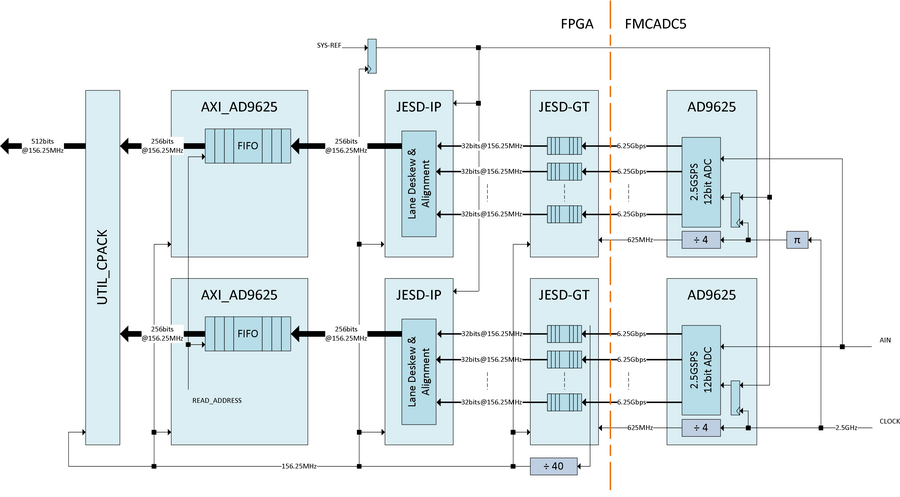

.. _fmcadc5:

FMCADC5 HDL Project (OBSOLETE)
===============================================================================

.. warning::

   The support for :git-hdl:`FMCADC5 <hdl_2021_r2:projects/fmcadc5>` HDL project
   has been discontinued, the latest release branch where it can be found is
   ``hdl_2021_r2``. This page is left for legacy purposes only.

Overview
-------------------------------------------------------------------------------

The :adi:`AD-FMCADC5-EBZ` is a high-speed single channel data acquisition board
featuring two :adi:`AD9625` ADCs. The board is provisioned to sample the
single input at an effective sampling rate of 5GSPS, with both the ADCs running
at 2.5GHz and sampling at both edges (the clocks are 180 out of phase to each
other).

The :adi:`AD-FMCADC5-EBZ` is a double FMC wide board and requires two fully
populated (transceivers mainly) FMC connectors on the carrier (such as
:xilinx:`VC707`).

The board's primary purpose is to demonstrate the capabilities of the devices
on board quickly and easily by providing a seamless interface to an FMC carrier
platform and running the reference design on the carrier FPGA. The board is
designed to self power and self clock when connected to the FMC carrier.
The analog signal is connected to J18.

Supported boards
-------------------------------------------------------------------------------

- :adi:`AD-FMCADC5-EBZ`

Supported devices
-------------------------------------------------------------------------------

- :adi:`AD9625`

Supported carriers
-------------------------------------------------------------------------------

- :xilinx:`VC707` on FMC HPC1 and HPC2

Block design
-------------------------------------------------------------------------------

A brief introduction to interleaving: there are two AD9625 devices running at
2.5Gbps, but the clocks to the devices are 180 degrees out of phase.
In other words, the input signal is sampled by the first ADC at the rising
edges of the 2.5GHz clock. The same signal is sampled by the second ADC at the
falling edges of the "conceptually same" clock. That is an effective sampling
rate of 5GSPS. All the user needs to do is interleave these two samples.

A word of caution (or disclaimer), this interleaving inherently has some
performance factors outside of what we are discussing here. There are two major
factors, first the jitter on the sampling clocks. Second, the gain and phase
variations at the input. The devices itself may also have encoding skew.
Some of these may be filtered or compensated by post processing the samples.

If we look at the data path of the devices independently (see block diagram
above), we can see that alignment and deskew happens at various stages.
The transceivers perform deskew and alignment of bits (comma character
alignment and 10B to 8B conversion), the JESD-IP then aligns individual lanes
and outputs data with a fixed latency using SYSREF. The SYSREF resets the LMFC,
thus the receiver knows from the time it receives the SYSREF pulse to the first
received ILA data the latency of the system. After this the samples hit the
:adi:`AD9625` core.

The cores receive two samples from each of the devices. Now it needs to know
which samples goes first (in time) and which one follows it. That is, the
samples are to be interleaved in the same order they were sampled in absolute
time. Ideally being a JESD204B subclass-1 devices using SYSREF should have been
sufficient to do this. The SYSREF is the "absolute" reference for all the
concerned transmit and receive devices.

However, for practical reasons, SYSREF is seldom used as a clock but as data
and is sampled by the concerned parties at their own clock. A robust method
is to identify, at the receiving device, the exact sample at which (or
immediately after) the device sampled SYSREF. So the AD9625 supports a mode
in which a time stamp is attached to the samples. The details of which are
in the data sheet. The FPGA design simply uses this time stamp and knows
the exact sample at which the devices sampled SYSREF. The design implements
this by aligning samples across the 16-sample data per device per clock.

After which, data is written to a small FIFO with the write pointer reset
by the SYSREF time stamp. A common read pointer is then used to read the
samples. The FIFO supports deskewing of up to 8 samples. The ADC pack simply
interleaves these samples assuming device-0 is first in order. The software
needs to make sure that device-0 always samples SYSREF half a clock ahead
of device-1. This is done with a calibration routine.

The :adi:`AD9625` supports time stamp insertion at the LSB of the sample (and
is the ONLY option in certain lane configurations). This changes the devices
to 11-bit converters. The HDL design does NOT support this. It supports time
stamp insertion in the CS bits ONLY. The converter resolution remains as
12-bit. If you would prefer the LSB option, you need to change both HDL
and software.

Block diagram
~~~~~~~~~~~~~~~~~~~~~~~~~~~~~~~~~~~~~~~~~~~~~~~~~~~~~~~~~~~~~~~~~~~~~~~~~~~~~~~

The data path and clock domains are depicted in the below diagram:

Clock configuration
~~~~~~~~~~~~~~~~~~~~~~~~~~~~~~~~~~~~~~~~~~~~~~~~~~~~~~~~~~~~~~~~~~~~~~~~~~~~~~~

The :adi:`AD-FMCADC5-EBZ` uses a 2.5GHz crystal. The two :adi:`AD9625` devices
are clocked from the same clock source, but 180 degrees out of phase.

CPU/Memory interconnects addresses
~~~~~~~~~~~~~~~~~~~~~~~~~~~~~~~~~~~~~~~~~~~~~~~~~~~~~~~~~~~~~~~~~~~~~~~~~~~~~~~

The addresses are dependent on the architecture of the FPGA, having an offset
added to the base address from HDL (see more at :ref:`architecture cpu-intercon-addr`).

==================== ===============
Instance             Zynq/Microblaze
==================== ===============
axi_ad9625_0_xcvr    0x44A6_0000
axi_ad9625_1_xcvr    0x44B6_0000
axi_ad9625_0_core    0x44A1_0000
axi_ad9625_1_core    0x44B1_0000
axi_ad9625_0_jesd    0x44A9_0000
axi_ad9625_1_jesd    0x44B9_0000
axi_ad9625_dma       0x7C42_0000
==================== ===============

SPI connections
~~~~~~~~~~~~~~~~~~~~~~~~~~~~~~~~~~~~~~~~~~~~~~~~~~~~~~~~~~~~~~~~~~~~~~~~~~~~~~~

.. list-table::
   :widths: 25 25 25 25
   :header-rows: 1

   * - SPI type
     - SPI manager instance
     - SPI subordinate
     - CS
   * - PS
     - SPI 0
     - AD9625
     - 0
   * - PS
     - SPI 1
     - ADF4355
     - 0

GPIOs
~~~~~~~~~~~~~~~~~~~~~~~~~~~~~~~~~~~~~~~~~~~~~~~~~~~~~~~~~~~~~~~~~~~~~~~~~~~~~~~

.. list-table::
   :widths: 25 20 20 20 15
   :header-rows: 2

   * - GPIO signal
     - Direction
     - HDL GPIO EMIO
     - Software GPIO
     - Software GPIO
   * -
     - (from FPGA view)
     -
     - Zynq-7000
     - Zynq MP
   * - pwr_good
     - INOUT
     - 44
     - 98
     - 122
   * - fd_1
     - INOUT
     - 43
     - 97
     - 121
   * - irq_1
     - INOUT
     - 42
     - 96
     - 120
   * - fd_0
     - INOUT
     - 41
     - 95
     - 119
   * - irq_0
     - INOUT
     - 40
     - 94
     - 118
   * - pwdn_1
     - INOUT
     - 39
     - 93
     - 117
   * - rst_1
     - INOUT
     - 38
     - 92
     - 116
   * - pwdn_0
     - INOUT
     - 35
     - 89
     - 113
   * - rst_0
     - INOUT
     - 34
     - 88
     - 112

Interrupts
~~~~~~~~~~~~~~~~~~~~~~~~~~~~~~~~~~~~~~~~~~~~~~~~~~~~~~~~~~~~~~~~~~~~~~~~~~~~~~~

Below are the Programmable Logic interrupts used in this project.

================= === ========== =========== ============ =============
Instance name     HDL Linux Zynq Actual Zynq Linux ZynqMP Actual ZynqMP
================= === ========== =========== ============ =============
axi_ad9625_1_jesd 14  58         90          110          142
axi_ad9625_0_jesd 13  57         89          100          141
axi_ad9625_dma    12  56         88          108          140
================= === ========== =========== ============ =============

Building the HDL project
-------------------------------------------------------------------------------

The design is built upon ADI's generic HDL reference design framework.
ADI distributed the bit/elf files of this project as part of the
:dokuwiki:`ADI Kuiper Linux <resources/tools-software/linux-software/kuiper-linux>`
until the 2021_R2 release. The prebuilt files can be found in the previous link.
Afterwards, it was discontinued.

But, if you want to build the sources, ADI makes them available on the
:git-hdl:`HDL repository </>`. To get the source you must
`clone <https://git-scm.com/book/en/v2/Git-Basics-Getting-a-Git-Repository>`__
the HDL repository and checkout the last release branch where this project
still exists, ``hdl_2021_r2``.

Then go to the hdl/projects/fmcadc5/vc707 location and run the make
command.

**Linux/Cygwin/WSL**

.. shell::

   /hdl
   $git checkout hdl_2021_r2
   $cd projects/fmcadc5/vc707
   $make

Resources
-------------------------------------------------------------------------------

Systems related
~~~~~~~~~~~~~~~~~~~~~~~~~~~~~~~~~~~~~~~~~~~~~~~~~~~~~~~~~~~~~~~~~~~~~~~~~~~~~~~

- :dokuwiki:`AD-FMCADC5 Microblaze Quick start guide <resources/eval/user-guides/ad-fmcadc5-ebz/quickstart/microblaze>`

Hardware related
~~~~~~~~~~~~~~~~~~~~~~~~~~~~~~~~~~~~~~~~~~~~~~~~~~~~~~~~~~~~~~~~~~~~~~~~~~~~~~~

- Product datasheet: :adi:`AD9625`

HDL related
~~~~~~~~~~~~~~~~~~~~~~~~~~~~~~~~~~~~~~~~~~~~~~~~~~~~~~~~~~~~~~~~~~~~~~~~~~~~~~~

- :git-hdl:`FMCADC5 HDL project source code <hdl_2021_r2:projects/fmcadc5>`

.. list-table::
   :widths: 30 35 35
   :header-rows: 1

   * - IP name
     - Source code link
     - Documentation link
   * - AXI_AD9625
     - :git-hdl:`hdl_2021_r2:library/axi_ad9625`
     - ---
   * - AXI_FMCADC5_SYNC
     - :git-hdl:`hdl_2021_r2:library/axi_fmcadc5_sync`
     - ---
   * - UTIL_MFIFO
     - :git-hdl:`hdl_2021_r2:library/util_mfifo`
     - ---
   * - AXI_DMAC
     - :git-hdl:`hdl_2021_r2:library/axi_dmac`
     - :ref:`axi_dmac`
   * - AXI_SYSID
     - :git-hdl:`hdl_2021_r2:library/axi_sysid`
     - :ref:`axi_sysid`
   * - SYSID_ROM
     - :git-hdl:`hdl_2021_r2:library/sysid_rom`
     - :ref:`axi_sysid`
   * - UTIL_ADCFIFO
     - :git-hdl:`hdl_2021_r2:library/util_adcfifo`
     - ---
   * - UTIL_ADXCVR for AMD
     - :git-hdl:`hdl_2021_r2:library/xilinx/util_adxcvr`
     - :ref:`util_adxcvr`
   * - AXI_ADXCVR for AMD
     - :git-hdl:`hdl_2021_r2:library/xilinx/axi_adxcvr`
     - :ref:`axi_adxcvr amd`
   * - AXI_JESD204_RX
     - :git-hdl:`hdl_2021_r2:library/jesd204/axi_jesd204_rx`
     - :ref:`axi_jesd204_rx`

- :dokuwiki:`[Wiki] Generic JESD204B block designs <resources/fpga/docs/hdl/generic_jesd_bds>`
- :ref:`jesd204`

Software related
~~~~~~~~~~~~~~~~~~~~~~~~~~~~~~~~~~~~~~~~~~~~~~~~~~~~~~~~~~~~~~~~~~~~~~~~~~~~~~~

- :git-linux:`FMCADC5/VC707 Linux device tree <2021_R2:arch/microblaze/boot/dts/vc707_fmcadc5.dts>`

.. include:: ../common/more_information.rst

.. include:: ../common/support.rst
