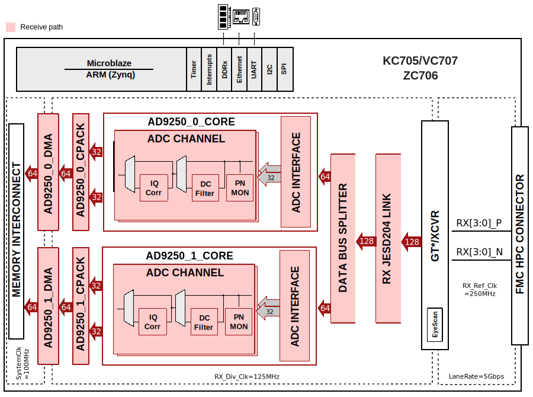
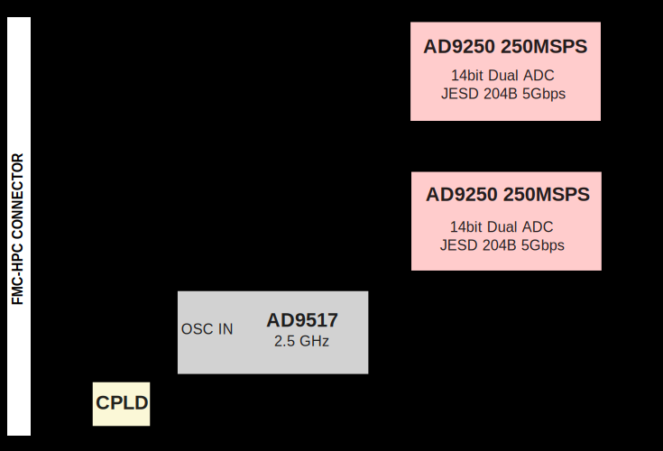

.. _fmcjesdadc1:

FMCJESDADC1 HDL Project (OBSOLETE)
===============================================================================

.. warning::

   The support for :git-hdl:`FMCJESDADC1 <hdl_2021_r2:projects/fmcjesdadc1>`
   HDL project has been discontinued, the latest release branch where it can
   be found is ``hdl_2021_r2``. This page is left for legacy purposes only.

Overview
-------------------------------------------------------------------------------

The :adi:`AD-FMCJESDADC1-EBZ <EVAL-AD-FMCJESDADC1-EBZ>` is a high speed data
acquisition (4 ADC channels at 250MSPS), in an FMC form factor, which has
two high speed JESD204B Analog to Digital converters (:adi:`AD9250`) on it.

The :adi:`AD9250` is a dual, 14-bit ADC with sampling speeds of up to 250MSPS.
It features a multistage, differential pipelined architecture with integrated
output error correction logic. It supports wide bandwidth inputs for a
variety of user-selectable input ranges. The :adi:`AD9250` features JESD204B
high-speed serial interface.

The boards also feature the :adi:`AD9517-1` for multi-output clock distribution
with sub-picosecond jitter performance, along with an on-chip PLL and VCO.
The devices may be clocked by either an internal clock source (optionally
locked to an external reference) or an externally supplied sample clock.

It also features an external trigger input for customized sampling control.
The card is mechanically and electrically compliant to the FMC standard
(ANSI/VITA 57.1).

The reference design includes the device data capture via the JESD204B
serial interface and the SPI interface. The samples are written to the
external DDR-DRAM. It allows programming the device and monitoring it's
internal registers via SPI.

Supported boards
-------------------------------------------------------------------------------

- :adi:`AD-FMCJESDADC1-EBZ <EVAL-AD-FMCJESDADC1-EBZ>`

Supported devices
-------------------------------------------------------------------------------

- :adi:`AD9250`

Supported carriers
-------------------------------------------------------------------------------

- :xilinx:`KC705` on FMC HPC
- :xilinx:`VC707` on FMC HPC1
- :xilinx:`ZC706` on FMC HPC

Block design
-------------------------------------------------------------------------------

The reference design consists of a single JESD204B core and two identical
instances of :adi:`AD9250` pcores.

The :adi:`AD9250`` core consists of three functional modules, the ADC interface,
a PN9/PN23 monitor and a DMA interface. The ADC interface captures and buffers
data from the JESD204B core. The DMA interface then transfers the samples to
the external DDR-DRAM. The capture is initiated by the software. The status
of capture (overflow, over the range) are reported back to the software.

All the pcores have an AXI lite interface that allows control and monitoring
of data generation and/or capture.

The reference design also includes HDMI cores for GTX eye scan.

The ADC sampling rate can vary from 40MHz to 250MHz. However, there are
limitations imposed by the FPGA that may lower this range. In some cases,
you may have to regenerate the cores for a different range. The reference
design uses GTX (channel PLL) primitives and Xilinx's JESD204B core IP.
The default design runs at 250MHz clock (5Gbps rate).

As of this writing, the GTX specification & switching characteristics may be
found at:

- `UG476: 7Series Transceivers <https://docs.amd.com/v/u/en-US/ug476_7Series_Transceivers>`__
- `DS182: Kintex 7 data sheet <https://docs.amd.com/v/u/en-US/ds182_Kintex_7_Data_Sheet>`__

The key switching characteristics are:

- The reference clock has a range of 60MHz to 670MHz (700MHz). This limits
  the minimum sampling clock to 60MHz. Though it is NOT recommended, it is
  possible to use AD9517 to generate a 40MHz sampling clock to AD9250 and
  a 80MHz reference clock to the FPGA.
- The line rate however, varies based on speed grade, package type and the
  use of CPLL vs QPLL. The CPLL supports rates between 0.5Gbps to 6.6Gbps
  (the core may have to be changed for rates less than 3.2Gbps (sampling
  rate 160MHz) - and the IP may not support all the combinations). Again,
  it is possible to run the device on a single lane at a higher rate (rather
  than 2 lanes each at a lower rate) to circumvent some of the troubles of
  line rate dependency on parametrization, package type and speed grade.

Block diagram
~~~~~~~~~~~~~~~~~~~~~~~~~~~~~~~~~~~~~~~~~~~~~~~~~~~~~~~~~~~~~~~~~~~~~~~~~~~~~~~

The data path and clock domains are depicted in the below diagram:

The FMC card is depicted in the below diagram:

CPU/Memory interconnects addresses
~~~~~~~~~~~~~~~~~~~~~~~~~~~~~~~~~~~~~~~~~~~~~~~~~~~~~~~~~~~~~~~~~~~~~~~~~~~~~~~

The addresses are dependent on the architecture of the FPGA, having an offset
added to the base address from HDL (see more at :ref:`architecture cpu-intercon-addr`).

==================== ===============
Instance             Zynq/Microblaze
==================== ===============
axi_ad9250_core      0x44A1_0000
axi_ad9250_xcvr      0x44A6_0000
axi_ad9250_jesd      0x44AA_0000
axi_ad9250_dma       0x7C42_0000
==================== ===============

SPI connections
~~~~~~~~~~~~~~~~~~~~~~~~~~~~~~~~~~~~~~~~~~~~~~~~~~~~~~~~~~~~~~~~~~~~~~~~~~~~~~~

.. list-table::
   :widths: 25 25 25 25
   :header-rows: 1

   * - SPI type
     - SPI manager instance
     - SPI subordinate
     - CS
   * - PS
     - SPI 0
     - AD9250
     - 0

Interrupts
~~~~~~~~~~~~~~~~~~~~~~~~~~~~~~~~~~~~~~~~~~~~~~~~~~~~~~~~~~~~~~~~~~~~~~~~~~~~~~~

Below are the Programmable Logic interrupts used in this project.

================ === ========== =========== ============ =============
Instance name    HDL Linux Zynq Actual Zynq Linux ZynqMP Actual ZynqMP
================ === ========== =========== ============ =============
axi_ad9250_dma   13  57         89          109          141
axi_ad9250_jesd  11  55         87          107          139
================ === ========== =========== ============ =============

Building the HDL project
-------------------------------------------------------------------------------

The design is built upon ADI's generic HDL reference design framework.
ADI distributed the bit/elf files of this project as part of the
:dokuwiki:`ADI Kuiper Linux <resources/tools-software/linux-software/kuiper-linux>`
until the 2021_R2 release. The prebuilt files can be found in the previous link.
Afterwards, it was discontinued.

But, if you want to build the sources, ADI makes them available on the
:git-hdl:`HDL repository </>`. To get the source you must
`clone <https://git-scm.com/book/en/v2/Git-Basics-Getting-a-Git-Repository>`__
the HDL repository and checkout the last release branch where this project
still exists, ``hdl_2021_r2``.

Then go to the hdl/projects/fmcjesdadc1/$carrier location and run the make
command.

**Linux/Cygwin/WSL**

.. shell::

   /hdl
   $git checkout hdl_2021_r2
   $cd projects/fmcjesdadc1/zc706
   $make

Resources
-------------------------------------------------------------------------------

Systems related
~~~~~~~~~~~~~~~~~~~~~~~~~~~~~~~~~~~~~~~~~~~~~~~~~~~~~~~~~~~~~~~~~~~~~~~~~~~~~~~

- :dokuwiki:`AD-FMCJESDADC1-EBZ Microblaze Quick start guide <resources/eval/user-guides/ad-fmcjesdadc1-ebz/quickstart/microblaze>`
- :dokuwiki:`AD-FMCJESDADC1-EBZ Zynq Quick start guide <resources/fpga/xilinx/fmc/ad-fmcjesdadc1-ebz/quickstart>``

Hardware related
~~~~~~~~~~~~~~~~~~~~~~~~~~~~~~~~~~~~~~~~~~~~~~~~~~~~~~~~~~~~~~~~~~~~~~~~~~~~~~~

- Product datasheets:

  - :adi:`AD9250`
  - :adi:`AD9517-1`

- Schematic `here <https://wiki.analog.com/_media/resources/eval/user-guides/ad-fmcjesdadc1-ebz/ad-fmcjesdadc1_r1.1.pdf>`__

HDL related
~~~~~~~~~~~~~~~~~~~~~~~~~~~~~~~~~~~~~~~~~~~~~~~~~~~~~~~~~~~~~~~~~~~~~~~~~~~~~~~

- :git-hdl:`FMCJESDADC1 HDL project source code <hdl_2021_r2:projects/fmcjesdadc1>`

.. list-table::
   :widths: 30 35 35
   :header-rows: 1

   * - IP name
     - Source code link
     - Documentation link
   * - AXI_DMAC
     - :git-hdl:`hdl_2021_r2:library/axi_dmac`
     - :ref:`axi_dmac`
   * - AXI_CLKGEN
     - :git-hdl:`hdl_2021_r2:library/axi_clkgen`
     - :ref:`axi_clkgen`
   * - AXI_HDMI_TX
     - :git-hdl:`hdl_2021_r2:library/axi_hdmi_tx`
     - :ref:`axi_hdmi_tx`
   * - AXI_SPDIF_TX
     - :git-hdl:`hdl_2021_r2:library/axi_spdif_tx`
     - ---
   * - AXI_SYSID
     - :git-hdl:`hdl_2021_r2:library/axi_sysid`
     - :ref:`axi_sysid`
   * - SYSID_ROM
     - :git-hdl:`hdl_2021_r2:library/sysid_rom`
     - :ref:`axi_sysid`
   * - UTIL_CPACK
     - :git-hdl:`hdl_2021_r2:library/util_pack/util_cpack2`
     - :ref:`util_cpack2`
   * - UTIL_ADXCVR for AMD
     - :git-hdl:`hdl_2021_r2:library/xilinx/util_adxcvr`
     - :ref:`util_adxcvr`
   * - AXI_ADXCVR for AMD
     - :git-hdl:`hdl_2021_r2:library/xilinx/axi_adxcvr`
     - :ref:`axi_adxcvr amd`
   * - AXI_JESD204_RX
     - :git-hdl:`hdl_2021_r2:library/jesd204/axi_jesd204_rx`
     - :ref:`axi_jesd204_rx`
   * - JESD204_TPL_ADC
     - :git-hdl:`hdl_2021_r2:library/jesd204/ad_ip_jesd204_tpl_adc`
     - :ref:`ad_ip_jesd204_tpl_adc`

- :dokuwiki:`[Wiki] Generic JESD204B block designs <resources/fpga/docs/hdl/generic_jesd_bds>`
- :ref:`jesd204`

Software related
~~~~~~~~~~~~~~~~~~~~~~~~~~~~~~~~~~~~~~~~~~~~~~~~~~~~~~~~~~~~~~~~~~~~~~~~~~~~~~~
- :git-linux:`FMCJESDADC1/KC705 Linux device tree <2021_R2:arch/microblaze/boot/dts/kc705_fmcjesdadc1.dts>`
- :git-linux:`FMCJESDADC1/VC707 Linux device tree <2021_R2:arch/microblaze/boot/dts/vc707_fmcjesdadc1.dts>`
- :git-linux:`FMCJESDADC1/ZC706 Linux device tree <2021_R2:arch/arm/boot/dts/xilinx/zynq-zc706-adv7511-fmcjesdadc1.dts>`

.. include:: ../common/more_information.rst

.. include:: ../common/support.rst
