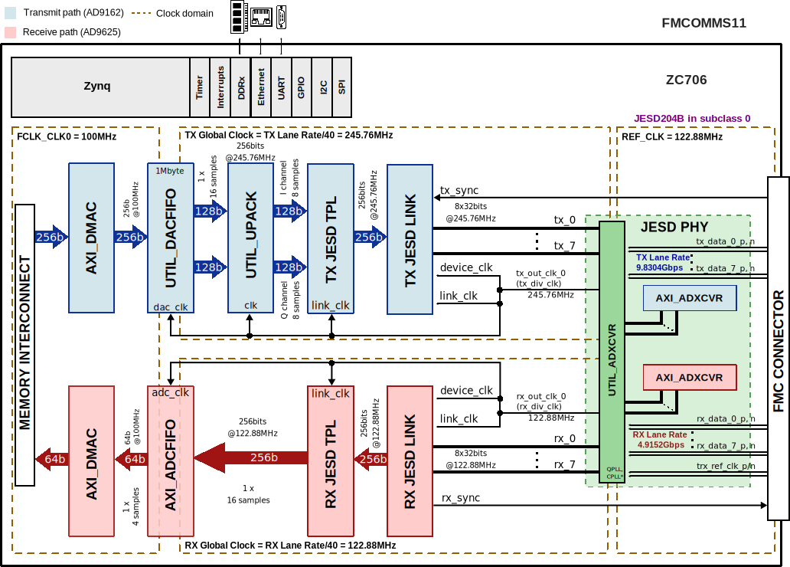

.. _fmcomms11:

FMCOMMS11 HDL project
===============================================================================

Overview
-------------------------------------------------------------------------------

The HDL reference design is an embedded system built around a processor core
either ARM, NIOS-II or Microblaze. The high speed digital interface of the
converters is handled by the :ref:`JESD204B framework <jesd204>`.
Due to the system's memory interface bandwidth limitation, there are
intermediary buffers in the both TX and RX data paths, in order to save and
push data using high data rates. In case of the ZC706 carrier board, the
RX buffer depth is 1Gbyte, and TX buffer depth is 1Mbyte. This depths can
be swapped if required.

By default, the :adi:`AD9162` is configured in complex mode with 8 lanes (see
`Table 16 <https://www.analog.com/media/en/technical-documentation/data-sheets/AD9161-9162.pdf>`__
in data sheet), and the :adi:`AD9625` is configured in generic operation mode
with 8 lanes (see
`Table 16 <https://www.analog.com/media/en/technical-documentation/data-sheets/AD9625.pdf>`__
in data sheet). Both JESD204 interfaces run in Subclass 0.

Other configurations can be used too, but the user needs to make sure that
all the parties (clock chip, converters and FPGA JESD204 IPs) of the interface
are reconfigured accordingly.

Supported boards
-------------------------------------------------------------------------------

- :adi:`AD-FMCOMMS11-EBZ`

Supported devices
-------------------------------------------------------------------------------

- :adi:`AD9162`
- :adi:`AD9625`

Supported carriers
-------------------------------------------------------------------------------

- :xilinx:`ZC706` on FMC HPC

Block design
-------------------------------------------------------------------------------

The data path consists of the shared transceivers, then are followed by the
individual JESD204B link and transport layer IP cores. The cores are
programmable through an AXI-lite interface. Both JESD204 interfaces run in
subclass 0.

The digital interface consists of 8 transmit and 8 receive lanes running at
9.8304Gbps and 4.9152Gbps respectively, by default. The transceivers interface
the DAC/ADC cores at 256bits @ 245.76MHz and 256bits @ 122.88MHz respectively.
The data is sent or received based on the configuration of separate transmit
and receive chains.

Block diagram
~~~~~~~~~~~~~~~~~~~~~~~~~~~~~~~~~~~~~~~~~~~~~~~~~~~~~~~~~~~~~~~~~~~~~~~~~~~~~~~

The data path and clock domains are depicted in the below diagram:

.. collapsible:: Click here for details on the block diagram modules

   .. list-table::
      :widths: 10 20 35 35
      :header-rows: 1

      * - Block name
        - IP name
        - Documentation
        - Additional info
      * - AXI_ADXCVR
        - :git-hdl:`axi_adxcvr <library/xilinx/axi_adxcvr>`
        - :ref:`axi_adxcvr`
        - 2 instances, one for Rx and one for Tx
      * - AXI_DMAC
        - :git-hdl:`axi_dmac <library/axi_dmac>`
        - :ref:`axi_dmac`
        - 2 instances, one for Rx and one for Tx
      * - DATA_OFFLOAD
        - :git-hdl:`data_offload <library/data_offload>`
        - :ref:`data_offload`
        - 2 instances, one for Rx and one for Tx
      * - RX JESD LINK
        - axi_ad9625_jesd
        - :ref:`axi_jesd204_rx`
        - Instantiaded by ``adi_axi_jesd204_rx_create`` procedure
      * - RX JESD TPL
        - axi_ad9625_core
        - :ref:`ad_ip_jesd204_tpl_adc`
        - Instantiated by ``adi_tpl_jesd204_rx_create`` procedure
      * - TX JESD LINK
        - axi_ad9162_jesd
        - :ref:`axi_jesd204_tx`
        - Instantiaded by ``adi_axi_jesd204_tx_create`` procedure
      * - TX JESD TPL
        - axi_ad9162_core
        - :ref:`ad_ip_jesd204_tpl_dac`
        - Instantiated by ``adi_tpl_jesd204_tx_create`` procedure
      * - UTIL_UPACK
        - :git-hdl:`util_upack2 <library/util_pack/util_upack2>`
        - :ref:`util_upack2`
        - ---

Clock scheme
~~~~~~~~~~~~~~~~~~~~~~~~~~~~~~~~~~~~~~~~~~~~~~~~~~~~~~~~~~~~~~~~~~~~~~~~~~~~~~~

By default, the board comes with the solders set to
**internal clock references**.

The on-board clock reference is provided by a 122.88MHz local oscillator.

To use external clock references, take a look at the section
*JP location and control* from below, where you have a table explaining the
connections.

Several GPO and GPIO pins are brought to the RF card through connector J2,
found on the bottom of the PCB. These pins allow configuration of the PA,
LNA and SPDT switch found on the PCB.

The schematic of the board can be found
:adi:`here <media/en/reference-design-documentation/design-integration-files/ad-fmcomms11-ebz-designsupport.zip>`.

The settings A, COM and B refer to solder positions: 1, 2, and 3 respectively.

.. collapsible:: JP location and control

   +----------+---------------------------------------------+-----------+------------------------------------+
   | Location |  Device Controlled                          | Settings  | Action                             |
   +==========+=============================================+===========+====================================+
   | JP1      | \+ Differential Clock Reference for ADF4355 | A and COM | Internal Clock Reference (default) |
   |          +---------------------------------------------+-----------+------------------------------------+
   |          | \+ Differential Clock Reference for ADF4355 | B and COM | External Clock Reference           |
   +----------+---------------------------------------------+-----------+------------------------------------+
   | JP2      | \- Differential Clock Reference for ADF4355 | A and COM | Internal Clock Reference (default) |
   |          +---------------------------------------------+-----------+------------------------------------+
   |          | \- Differential Clock Reference for ADF4355 | B and COM | External Clock Reference           |
   +----------+---------------------------------------------+-----------+------------------------------------+
   | JP22     | \+ Differential Clock Reference for DAC     | A and COM | ADF4355 Clock Reference (default)  |
   |          +---------------------------------------------+-----------+------------------------------------+
   |          | \+ Differential Clock Reference for DAC     | B and COM | External Clock Reference           |
   +----------+---------------------------------------------+-----------+------------------------------------+
   | JP5      | \- Differential Clock Reference for DAC     | A and COM | ADF4355 Clock Reference (default)  |
   |          +---------------------------------------------+-----------+------------------------------------+
   |          | \- Differential Clock Reference for DAC     | B and COM | External Clock Reference           |
   +----------+---------------------------------------------+-----------+------------------------------------+
   | JP3      | \+ Differential Clock Reference for ADC     | A and COM | External Clock Reference           |
   |          +---------------------------------------------+-----------+------------------------------------+
   |          | \+ Differential Clock Reference for ADC     | B and COM | HMC361 Clock Reference (default)   |
   +----------+---------------------------------------------+-----------+------------------------------------+
   | JP4      | \- Differential Clock Reference for ADC     | A and COM | External Clock Reference           |
   |          +---------------------------------------------+-----------+------------------------------------+
   |          | \- Differential Clock Reference for ADC     | B and COM | HMC361 Clock Reference (default)   |
   +----------+---------------------------------------------+-----------+------------------------------------+

Configuration modes
~~~~~~~~~~~~~~~~~~~~~~~~~~~~~~~~~~~~~~~~~~~~~~~~~~~~~~~~~~~~~~~~~~~~~~~~~~~~~~~

The current HDL project supports only the following configuration:

- JESD204B interfaces in subclass 0
- Rx/Tx number of lanes (L): 8
- Rx number of converters per device (M): 1
- Tx number of converters per device (M): 2
- Rx number of samples per frame (S): 4
- Tx number of samples per frame (S): 2
- Rx/Tx sample width (N, NP): 16
- Tx number of samples per channel: :math:`= \frac{L * 32}{M * N}`

.. caution::

   In case you have a **rev. A** :adi:`FMCOMMS11 <AD-FMCOMMS11-EBZ>`, the
   system will work only if you use the
   :git-linux:`rev. A device tree <arch/arm/boot/dts/xilinx/zynq-zc706-adv7511-fmcomms11-RevA.dts>`
   and the :git-hdl:`old HDL project <hdl_2023_r2:projects/fmcomms11>` (prior
   to adding the :ref:`data_offload`).

   In case you have a **rev. B** :adi:`FMCOMMS11 <AD-FMCOMMS11-EBZ>`, the
   system will work only if you do a hardware rework: solder a wire between
   TP19 and C89.

.. _fmcomms11 detailed-description:

Detailed description
~~~~~~~~~~~~~~~~~~~~~~~~~~~~~~~~~~~~~~~~~~~~~~~~~~~~~~~~~~~~~~~~~~~~~~~~~~~~~~~

The design has one JESD204B receive chain and one transmit chain, each with
8 lanes.

Each chain consists of a transport layer represented by a JESD TPL module,
a link layer represented by a JESD LINK module, and a shared among chains
physical layer, represented by an XCVR module. The HDL project in its current
state, has **the link operating in subclass 0**.

- Rx device clock - 122.88 MHz
- Tx device clock - 245.76 MHz
- JESD204B Rx Lane Rate - 4.9152 Gbps
- JESD204B Tx Lane Rate - 9.8304 Gbps

.. collapsible:: Project flow

   The entry point for project creation is *system_project.tcl*. Some support
   scripts are first loaded, then the project is created. Based on the suffix of
   the project, the carrier board is automatically detected. The constraint files
   and custom modules instantiated directly in the *system_top* module must be added
   to the project files list.

   These will be explained further on an example, :adi:`FMCOMMS11 <AD-FMCOMMS11-EBZ>`
   on :xilinx:`ZC706` FPGA carrier.

   .. code-block::

      source ../../scripts/adi_env.tcl
      source $ad_hdl_dir/projects/scripts/adi_project.tcl
      source $ad_hdl_dir/projects/scripts/adi_board.tcl

      adi_project_xilinx fmcomms11_zc706
      adi_project_files fmcomms11_zc706 [list \
        "../common/fmcomms11_spi.v" \
        "system_top.v" \
        "system_constr.xdc"\
        "$ad_hdl_dir/library/xilinx/common/ad_iobuf.v" \
        "$ad_hdl_dir/projects/common/zc706/zc706_plddr3_constr.xdc" \
        "$ad_hdl_dir/projects/common/zc706/zc706_system_constr.xdc" ]

      adi_project_run fmcomms11_zc706

   When the project is created, *system_bd.tcl* is sourced. *system_bd.tcl* will
   generate the IP Integrator system. The resulting system will be instantiated
   in the *system_top* module.

   The first step is to instantiate the ZC706 base design:

   .. code-block::

      source $ad_hdl_dir/projects/common/zc706/zc706_system_bd.tcl

   To use the PL DDR3 Data Offload FIFO, the corresponding Tcl file must be sourced:

   .. code-block::

      source $ad_hdl_dir/projects/common/zc706/zc706_plddr3_data_offload_bd.tcl

   The following parameters will define the Data Offload's type, size and the
   width of the PL DDR Offload. Note, if the FIFO is using the PL side DDR
   interface, the address width parameter can be ignored, and the FIFO will
   have an equal depth with the DDR memory. (e.g. in case of the
   :xilinx:`ZC706` board is 1Gbyte).

   .. code-block::

      ## Offload attributes
      set adc_offload_type 1                      ; ## PL_DDR
      set adc_offload_size [expr 1024*1024*1024]  ; ## 1 GB

      set dac_offload_type 0                   ; ## BRAM
      set dac_offload_size [expr 1*1024*1024]  ; ## 1 MB

      set plddr_offload_axi_data_width 512

   Then the ADC Data Offload instance will be created using the procedure
   ``ad_plddr_data_offload_create``.
   The next step is to source the :adi:`FMCOMMS11 <AD-FMCOMMS11-EBZ>` specific
   design as well as the common support script:

   .. code-block::

      source ../common/fmcomms11_bd.tcl
      source $ad_hdl_dir/projects/scripts/adi_pd.tcl

   When using the JESD204 Framework, we need to source the
   :git-hdl:`JESD204 support script <library/jesd204/scripts/jesd204.tcl>`.
   In this script, several procedures which simplify the design are defined:
   :code:`source $ad_hdl_dir/library/jesd204/scripts/jesd204.tcl`

   The main JESD204 configuration parameters are defined. These parameters are
   essential and need to respect the device side configuration in order to have
   a successful link bring up. For this, the data sheet of the devices needs to be
   checked.

   .. code-block::

      # JESD204 TX parameters
      set TX_NUM_OF_LANES 8      ; # L
      set TX_NUM_OF_CONVERTERS 2 ; # M
      set TX_SAMPLES_PER_FRAME 2 ; # S
      set TX_SAMPLE_WIDTH 16     ; # N/NP

      set TX_SAMPLES_PER_CHANNEL [expr [expr $TX_NUM_OF_LANES * 32 ] / \
                                       [expr $TX_NUM_OF_CONVERTERS * $TX_SAMPLE_WIDTH]] ; # L * 32 / (M * N)

      # JESD204 RX parameters
      set RX_NUM_OF_LANES 8      ; # L
      set RX_NUM_OF_CONVERTERS 1 ; # M
      set RX_SAMPLES_PER_FRAME 4 ; # S
      set RX_SAMPLE_WIDTH 16     ; # N/NP

   For a complete system, we use additional modules to transfer data.
   The transport layer transfers data continuously from/to the ADC/DAC. In the TX
   data path, :ref:`UPACK <util_upack2>` will only send the enabled channels to
   the transport layer.

   :ref:`Data offload FIFOs <data_offload>` are inserted between the transport layers
   and the DMAs to handle the devices' higher data rate in the newer version of
   the project, replacing the obsolete :git-hdl:`util_dacfifo <library/util_dacfifo>`
   /:git-hdl:`util_adcfifo <library/util_adcfifo>`.

   ADC Data Offload characteristics:

   - Type: PL DDR
   - Size: 1GB

   DAC Data Offload characteristics:

   - Type: BRAM
   - Size: 1MB

   But before instantiating them, first we need to source the script that contains
   the procedures used on the Data Offload instances:

   .. code-block:: tcl

      source $ad_hdl_dir/projects/common/xilinx/data_offload_bd.tcl

   When a FIFO is used, the DMA connection to the DDR can run at a lower speed,
   as data capture cannot be done continuously.

.. collapsible:: JESD204 Physical layer

   The physical layer is responsible for instantiating and configuring the
   high-speed serial transceivers in the FPGA. The physical layer is
   implemented with the use of two modules: :ref:`axi_adxcvr` and
   :ref:`util_adxcvr`.

   :ref:`axi_adxcvr` provides an AXI interface for performing DRP reads and
   writes to the transceivers, allowing for dynamic reconfiguration.

   Given that the hardware implements 8 data lines, that's how we'll configure
   the *NUM_OF_LANES* parameter. *QPLL_ENABLE* parameter gives control to
   this IP of the QPLL reconfiguration for the Transceiver QUAD.
   If the QUAD is shared with other RX IPs (as it is in this design), the
   second :ref:`axi_adxcvr` IP will need to have *QPLL_ENABLE* set to 0.

   .. tip::

      The actual transceiver blocks are instantiated in
      :git-hdl:`UTIL_ADXCVR <library/xilinx/util_adxcvr>`.

   These can be found instantiated in
   :git-hdl:`projects/fmcomms11/common/fmcomms11_bd.tcl`.

   .. note::

      `AMD Xilinx JESD204 PHY`_ IP can be used as an alternative to
      implementing the physical layer, as it's part of Vivado without
      additional licensing. We currently don't provide software support for
      the AMD Xilinx IP. The drawback when using the Xilinx IP is that it
      doesn't provide Eyescan functionality.

   **Clocking**

   Reference clocks are needed to be feed to the QPLL/CPLL. In this design, we
   are using a shared reference clock for both receive and transmit channels.
   What is important to note is that the reference clocks for the transceiver
   QUAD must be connected to the MGTREFCLK pins either for the QUAD or an
   adjacent QUAD.

   .. code-block:: tcl

      create_bd_port -dir I tx_ref_clk_0
      create_bd_port -dir I rx_ref_clk_0
      ad_xcvrpll  tx_ref_clk_0 util_fmcomms11_xcvr/qpll_ref_clk_*
      ad_xcvrpll  rx_ref_clk_0 util_fmcomms11_xcvr/cpll_ref_clk_*
      ad_xcvrpll  axi_ad9162_xcvr/up_pll_rst util_fmcomms11_xcvr/up_qpll_rst_*
      ad_xcvrpll  axi_ad9625_xcvr/up_pll_rst util_fmcomms11_xcvr/up_cpll_rst_*

   The below instructions assign an HP port to all AXI masters, through an
   interconnect. If there is a single master per interconnect, it will be
   bypassed in the interconnect. The HP3 connections allow the physical layer
   to transmit eyescan data to memory, without software interference.

   .. code-block:: tcl

      # gt uses hp3, and 100MHz clock for both DRP and AXI4

      ad_mem_hp3_interconnect sys_cpu_clk sys_ps7/S_AXI_HP3
      ad_mem_hp3_interconnect sys_cpu_clk axi_ad9625_xcvr/m_axi

      # interconnect (mem/dac)

      ad_mem_hp1_interconnect sys_cpu_clk sys_ps7/S_AXI_HP1
      ad_mem_hp1_interconnect sys_cpu_clk axi_ad9162_dma/m_src_axi
      ad_mem_hp2_interconnect sys_cpu_clk sys_ps7/S_AXI_HP2
      ad_mem_hp2_interconnect sys_cpu_clk axi_ad9625_dma/m_dest_axi

.. collapsible:: JESD204 Link layer

   The JESD204 data link layer is instantiated in the next lines, for both
   :ref:`TX <axi_jesd204_tx>` and :ref:`RX <axi_jesd204_rx>` type of peripheral
   paths. The Analog Devices JESD204 IPimplements the data link layer,
   supporting subclass 0 and run time reconfiguration through an AXI
   memory-mapped interface.

   .. code-block:: tcl

      adi_axi_jesd204_tx_create axi_ad9162_jesd 8
      adi_axi_jesd204_rx_create axi_ad9625_jesd 8

   The IP is equivalent with the AMD Xilinx licensed JESD204 IP.

   To relax the constraints for PCB design, the **n**-th physical lane it's
   not connected to the **n**-th logical lane, therefore there is a remapping
   scheme between the physical and link layer to reorder the data streams.
   In this case, both ADC and DAC sides are using the same remapping scheme.
   With the following remapping scheme: {0 1 2 3 7 4 6 5},
   where the **n**-th logical lane is mapped to the **list[n]** physical lane.

   .. code-block:: tcl

      ad_xcvrcon  util_fmcomms11_xcvr axi_ad9162_xcvr axi_ad9162_jesd {0 1 2 3 7 4 6 5}
      ad_xcvrcon  util_fmcomms11_xcvr axi_ad9625_xcvr axi_ad9625_jesd {0 1 2 3 7 4 6 5}

.. collapsible:: JESD204 Transport layer

   The transport layer is instantiated in the next lines, for both
   :ref:`TX <ad_ip_jesd204_tpl_dac>` and :ref:`RX <ad_ip_jesd204_tpl_adc>`.
   The TPL peripherals are responsible for converter specific data framing and
   de-framing and provide a generic FIFO interface to the rest of the system.

   .. code-block:: tcl

      ad_xcvrcon  util_fmcomms11_xcvr axi_ad9162_xcvr axi_ad9162_jesd
      ad_xcvrcon  util_fmcomms11_xcvr axi_ad9625_xcvr axi_ad9625_jesd

.. collapsible:: Top file

   The reference clock that is used for the transceivers (trx_ref_clk), must
   be captured by an IBUFDS_GTE2 block. Because UTIL_ADXCVR doesn't have
   the buffer instantiated, the best place to instantiate it is in
   :git-hdl:`system_top.v <projects/fmcomms11/zc706/system_top.v>`.

CPU/Memory interconnects addresses
~~~~~~~~~~~~~~~~~~~~~~~~~~~~~~~~~~~~~~~~~~~~~~~~~~~~~~~~~~~~~~~~~~~~~~~~~~~~~~~

The addresses are dependent on the architecture of the FPGA, having an offset
added to the base address from HDL (see more at :ref:`architecture cpu-intercon-addr`).

===================  ===============
Instance             Zynq/Microblaze
===================  ===============
axi_ad9162_xcvr      0x44A6_0000
axi_ad9162_core      0x44A0_0000
axi_ad9162_jesd      0x44A9_0000
axi_ad9162_dma       0x7C42_0000
ad9162_data_offload  0x7C43_0000
axi_ad9625_xcvr      0x44A5_0000
axi_ad9625_core      0x44A1_0000
axi_ad9625_jesd      0x44AA_0000
axi_ad9625_dma       0x7C40_0000
ad9625_data_offload  0x7C41_0000
===================  ===============

SPI connections
~~~~~~~~~~~~~~~~~~~~~~~~~~~~~~~~~~~~~~~~~~~~~~~~~~~~~~~~~~~~~~~~~~~~~~~~~~~~~~~

.. list-table::
   :widths: 25 25 25 25
   :header-rows: 1

   * - SPI type
     - SPI manager instance
     - SPI subordinate
     - CS
   * - PS
     - SPI 0
     - AD9625
     - 1
   * - PS
     - SPI 0
     - AD9162
     - 2
   * - PS
     - SPI 0
     - AD9508
     - 3
   * - PS
     - SPI 0
     - ADL5240
     - 4
   * - PS
     - SPI 0
     - ADF4355
     - 5
   * - PS
     - SPI 0
     - HMC1119
     - 6

The AD9508 chip select will be used only in the rev. A of the FMCOMMS11.

GPIOs
~~~~~~~~~~~~~~~~~~~~~~~~~~~~~~~~~~~~~~~~~~~~~~~~~~~~~~~~~~~~~~~~~~~~~~~~~~~~~~~

.. list-table::
   :widths: 25 20 20 20 15
   :header-rows: 2

   * - GPIO signal
     - Direction
     - HDL GPIO EMIO
     - Software GPIO
     - Software GPIO
   * -
     - (from FPGA view)
     -
     - Zynq-7000
     - Zynq MP
   * - adf4355_muxout
     - INOUT
     - 35
     - 89
     - 113
   * - ad9162_txen
     - INOUT
     - 34
     - 88
     - 112
   * - ad9625_irq
     - INOUT
     - 33
     - 87
     - 111
   * - ad9162_irq
     - INOUT
     - 32
     - 86
     - 110

Interrupts
~~~~~~~~~~~~~~~~~~~~~~~~~~~~~~~~~~~~~~~~~~~~~~~~~~~~~~~~~~~~~~~~~~~~~~~~~~~~~~~

Below are the Programmable Logic interrupts used in this project.

================ === ========== ===========
Instance name    HDL Linux Zynq Actual Zynq
================ === ========== ===========
axi_ad9625_dma   13  57         89
axi_ad9162_dma   12  56         88
axi_ad9625_jesd  11  55         87
axi_ad9162_jesd  10  54         86
================ === ========== ===========

Building the HDL project
-------------------------------------------------------------------------------

The design is built upon ADI's generic HDL reference design framework.
ADI distributes the bit/elf files of these projects as part of the
:dokuwiki:`ADI Kuiper Linux <resources/tools-software/linux-software/kuiper-linux>`.
If you want to build the sources, ADI makes them available on the
:git-hdl:`HDL repository </>`. To get the source you must
`clone <https://git-scm.com/book/en/v2/Git-Basics-Getting-a-Git-Repository>`__
the HDL repository.

**Linux/Cygwin/WSL**

.. shell::

   $cd hdl/projects/fmcomms11/zcu102
   $make

A more comprehensive build guide can be found in the :ref:`build_hdl` user guide.

Resources
-------------------------------------------------------------------------------

Systems related
~~~~~~~~~~~~~~~~~~~~~~~~~~~~~~~~~~~~~~~~~~~~~~~~~~~~~~~~~~~~~~~~~~~~~~~~~~~~~~~

- :dokuwiki:`[Wiki] AD-FMCOMMS11-EBZ quick start guide <resources/eval/user-guides/ad-fmcomms11-ebz/quickstart/zynq>`
- :dokuwiki:`[Wiki] AD-FMCOMMS11-EBZ user guide <resources/eval/user-guides/ad-fmcomms11-ebz>`
- :dokuwiki:`[Wiki] AD-FMCOMMS11-EBZ characteristics & performance <resources/eval/user-guides/ad-fmcomms11-ebz/hardware/card_specification>`

Hardware related
~~~~~~~~~~~~~~~~~~~~~~~~~~~~~~~~~~~~~~~~~~~~~~~~~~~~~~~~~~~~~~~~~~~~~~~~~~~~~~~

- Product datasheets:

  - :adi:`AD9162`
  - :adi:`AD9625`
- Board schematic and design files
  :adi:`here <media/en/reference-design-documentation/design-integration-files/ad-fmcomms11-ebz-designsupport.zip>`

HDL related
~~~~~~~~~~~~~~~~~~~~~~~~~~~~~~~~~~~~~~~~~~~~~~~~~~~~~~~~~~~~~~~~~~~~~~~~~~~~~~~

- :git-hdl:`FMCOMMS11 HDL project source code <projects/fmcomms11>`

.. list-table::
   :widths: 30 35 35
   :header-rows: 1

   * - IP name
     - Source code link
     - Documentation link
   * - AXI_DMAC
     - :git-hdl:`library/axi_dmac`
     - :ref:`axi_dmac`
   * - AXI_CLKGEN
     - :git-hdl:`library/axi_clkgen`
     - :ref:`axi_clkgen`
   * - AXI_HDMI_TX
     - :git-hdl:`library/axi_hdmi_tx`
     - :ref:`axi_hdmi_tx`
   * - AXI_SPDIF_TX
     - :git-hdl:`library/axi_spdif_tx`
     - ---
   * - AXI_SYSID
     - :git-hdl:`library/axi_sysid`
     - :ref:`axi_sysid`
   * - SYSID_ROM
     - :git-hdl:`library/sysid_rom`
     - :ref:`axi_sysid`
   * - UTIL_UPACK2
     - :git-hdl:`library/util_pack/util_upack2`
     - :ref:`util_upack2`
   * - DATA_OFFLOAD
     - :git-hdl:`library/data_offload`
     - :ref:`data_offload`
   * - UTIL_ADXCVR
     - :git-hdl:`library/xilinx/util_adxcvr`
     - :ref:`util_adxcvr`
   * - AXI_ADXCVR
     - :git-hdl:`library/xilinx/axi_adxcvr`
     - :ref:`axi_adxcvr amd`
   * - AXI_JESD204_RX
     - :git-hdl:`library/jesd204/axi_jesd204_rx`
     - :ref:`axi_jesd204_rx`
   * - AXI_JESD204_TX
     - :git-hdl:`library/jesd204/axi_jesd204_tx`
     - :ref:`axi_jesd204_tx`
   * - JESD204_TPL_ADC
     - :git-hdl:`library/jesd204/ad_ip_jesd204_tpl_adc`
     - :ref:`ad_ip_jesd204_tpl_adc`
   * - JESD204_TPL_DAC
     - :git-hdl:`library/jesd204/ad_ip_jesd204_tpl_dac`
     - :ref:`ad_ip_jesd204_tpl_dac`

- :dokuwiki:`[Wiki] Generic JESD204B block designs <resources/fpga/docs/hdl/generic_jesd_bds>`
- :ref:`jesd204`

Software related
~~~~~~~~~~~~~~~~~~~~~~~~~~~~~~~~~~~~~~~~~~~~~~~~~~~~~~~~~~~~~~~~~~~~~~~~~~~~~~~

- :git-linux:`FMCOMMS11/ZC706 Linux device tree <arch/arm/boot/dts/xilinx/zynq-zc706-adv7511-fmcomms11.dts>`
- :git-linux:`FMCOMMS11 rev. A/ZC706 Linux device tree <arch/arm/boot/dts/xilinx/zynq-zc706-adv7511-fmcomms11-RevA.dts>`
- :dokuwiki:`[Wiki] FMCOMMS11 IIO Oscilloscope plugin wiki page <resources/tools-software/linux-software/fmcomms11_plugin>`

.. include:: ../common/more_information.rst

.. include:: ../common/support.rst

.. _AMD Xilinx JESD204 PHY:  https://www.xilinx.com/products/intellectual-property/ef-di-jesd204-phy.html
