.. _fir_filter:

Integrate FIR filters into the FMCOMMS2 HDL design
===============================================================================

Overview
-------------------------------------------------------------------------------

This wiki page describes how to add a custom processing module into the FMCOMMS2's
TX and/or RX data path. In this example, the custom modules are going to be some
digital FIR filters, to decimate and interpolate the incoming and outcoming data stream.  

.. note::

    This example was build using 
    `FMCOMMS2_FIR_FILTERS <https://github.com/analogdevicesinc/hdl/releases/tag/eg_fmcomms2_fir_filter|fmcomms2_fir_filters>`__ 
    GitHub HDL branch, using Vivado 16.2 and 16.4 versions.

Let's presume we want to transmit a sinewave with the :adi:`AD9361` ADI Integrated RF transceiver, the sinewave frequency is
below 6 MHz, for this, we can use a lower system data rate than the reference design. But, by simply lowering the data rate 
of the system we will increase the equalization error. To avoid this issue we can add some interpolation filters for transmitting.
A similar problem is encountered on the ADC side when receiving a low-frequency signal. This can be solved with the use of decimation
filters. In our example, these filters were already implemented in :git-hdl:`util_fir_int <library/util_fir_int>` and
:git-hdl:`util_fir_dec <library/util_fir_dec>` HDL IP core, which are wrappers for the FIR Compiler Xilinx IP. The wrappers are used
to manage the data rates entering the filter and to facilitate the configuration  of the filter parameters for a specific application (Tx/Rx).

Choosing filter parameters and coefficients 
-------------------------------------------------------------------------------

The interpolation/decimation filters parameters and coefficients were calculated in **MatLab**.

Interpolation FIR filter:

- ``ast``: normalize stopband attenuation = 80
- ``tw``: normalized transition width = 0.1
- ``n``: number of coefficients = 128
- ``interp``: interpolation factor = 8

.. code-block::

   ast = 80;
   n = 128;
   tw = 0.1;
   interp = 8;
   f = fdesign.interpolator(interp,'Nyquist', interp,'N,Ast', n, ast);
   hf = design(f,'kaiserwin');
   
   hq = dfilt.dffir(hf.Numerator./interp);set(hq, 'Arithmetic',  'fixed');
   coewrite(hq, 10, 'coefile_int_8');
   
   fvtool(hq);

.. image:: fir_interpolation.png
   :width: 1000
   :align: center
   :alt: FIR_INTERPOLATION block diagram

Decimation FIR filter:

- ``ast``: normalize stopband attenuation = 80
- ``tw``: normalized transition width = 0.01
- ``n``: number of coefficients = 128
- ``interp``: interpolation factor = 8

.. code-block::

   ast = 80;
   n = 128;
   tw = 0.01;
   decim = 8;
   f = fdesign.decimator(decim, 'Nyquist', decim,'N, Ast', n, ast);
   hf = design(f);

   hq = dfilt.dffir(hf.Numerator);
   set(hq, 'Arithmetic',  'fixed', 'CoeffWordLength', 18);
   coewrite(hq, 10, 'coefile_dec');

   fvtool(hf);

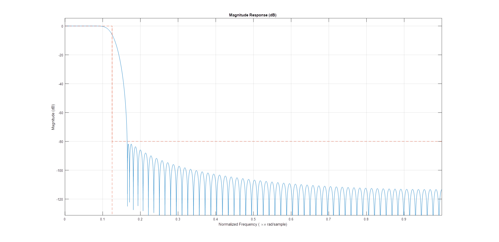

.. note::
   
   After running the above commands in MATLAB, you will obtain some *.coe* files, that will be processed by the Xilinx FIR Compiler IP.

Adding the filters in the data path 
-------------------------------------------------------------------------------

In the original fmcomms2 design the data comes from the DMA, goes to the util_upack core which transmits the individual channel data to a
dac_fifo core, from which the ad9361 core reads the data and transmits it to the AD9361 CHIP. The util_upack core is used to split the 
64-bit data containing 2 RF channels, each one having I/Q data. dac_fifo is used for clock domain crossing between the system clock and the AD9361 clock.

The data processing is done at lower clock frequencies. This is the reason for placing the interpolation filters in front of the dac_fifo module.
The required input data for the filter is I/Q data and the output is independent I and Q data. Because of this conditions, we still require the util_upack module, 
but we only need to split the DAC data into independent channel data, so we need one unpack module and two util_fir_int modules before the FIFO. The same approach
is implemented on the receive path. For more information about the reference design visit:

- :dokuwiki:`FMCOMMS2 user guide  </resources/eval/user-guides/ad-fmcomms2-ebz>`  
- :dokuwiki:`HDL user guide  </resources/fpga/docs/hdl>`   

Block diagram
-------------------------------------------------------------------------------

The modified reference design block diagram containing now **Interpolation** and **Decimation** filters is presented below.

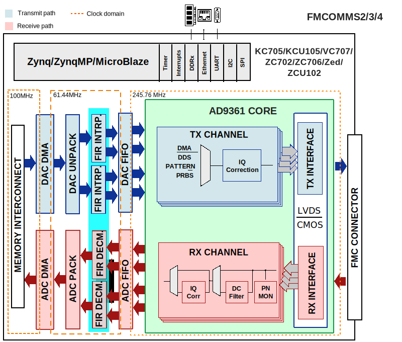

Understanding fmcomms2 clock routing
-------------------------------------------------------------------------------

.. image:: fmcomms234_clock_domains.svg
   :width: 1000
   :align: center
   :alt: FMCOMMS2_FIR_CLOCK_DOMAINS

Adding FIR filters in fmcomms2 design and building the HDL
-------------------------------------------------------------------------------

The design is obtain by simply sourcing the base fmcomms2 block design.

.. code-block::

   set project_dir [pwd]
   cd $ad_hdl_dir/projects/fmcomms2/zc706/
   source system_bd.tcl
   cd $project_dir

At this point fmcomms2 reference design's TX data path has the following components:

.. image:: fmcomms2_vivado_ref_tx.JPG
   :width: 1000
   :align: center
   :alt: FMCOMMS2_VIVADO_REF_TX

We need to remove the connections between util_upack and dac_fifo cores in order to add 
the FIR filter modules in the reference design. With the following commands, all the unwanted
connections will be removed and new ones will be created.

.. code-block:: tcl

   # delete reference design connections
   delete_bd_objs [get_bd_nets axi_ad9361_dac_fifo_din_valid_0] 
   delete_bd_objs [get_bd_nets axi_ad9361_dac_fifo_din_enable_*] 
   delete_bd_objs [get_bd_nets util_ad9361_dac_upack_fifo_rd_data_*] 
   delete_bd_objs [get_bd_nets util_ad9361_dac_upack_fifo_rd_underflow]  
   delete_bd_objs [get_bd_nets util_ad9361_dac_upack_fifo_rd_valid]  

We will disconnect/connect the Rx path in a similar manner.

.. code-block:: tcl

   delete_bd_objs [get_bd_nets util_ad9361_adc_fifo_dout_valid_0] 
   delete_bd_objs [get_bd_nets util_ad9361_adc_fifo_dout_enable_*] 
   delete_bd_objs [get_bd_nets util_ad9361_adc_fifo_dout_data_*]

Adding interpolation filters.

.. code-block:: tcl

   set fir_interpolator_0 [ create_bd_cell -type ip -vlnv analog.com:user:util_fir_int:1.0 fir_interpolator_0 ]
   set fir_interpolator_1 [ create_bd_cell -type ip -vlnv analog.com:user:util_fir_int:1.0 fir_interpolator_1 ]

Adding interpolation control. 

.. code-block:: tcl

   set interp_slice [ create_bd_cell -type ip -vlnv xilinx.com:ip:xlslice:1.0 interp_slice ]

Adding decimation filters.

.. code-block:: tcl

   set fir_decimator_0 [ create_bd_cell -type ip -vlnv analog.com:user:util_fir_dec:1.0 fir_decimator_0 ]
   set fir_decimator_1 [ create_bd_cell -type ip -vlnv analog.com:user:util_fir_dec:1.0 fir_decimator_1 ]

Adding decimation control.

.. code-block:: tcl

   set decim_slice [ create_bd_cell -type ip -vlnv xilinx.com:ip:xlslice:1.0 decim_slice ]

The interpolation filter has a 32-bit (I+Q) input data bus. In the base design, the unpack module is configured
to output 4 channels of 16-bit data. By changing the unpack number of channels to 2 and the width of the channels
to 32-bit will not work because of how the independent I/Q channel data is arranged in the 64-bit data bus coming
from the DMA see the figure below.

.. image:: ad9361_dma_data.svg
   :width: 1000
   :align: center
   :alt: AD9361_DMA_DATA

More information about the util_upack_core :dokuwiki:`util_upack_core  </resources/fpga/docs/util_upack>`   

As a fact the data transmuted/received through LVDS interface at DDR (Double Data Rate) is presented in the diagram below.

.. image:: ad9361_lvds_ddr_transmision.svg
   :width: 1000
   :align: center
   :alt: ad9361_lvds_ddr_transmision

At this point we have two options:

1. Delete the upack_core and split the data into some simple slices
2. Keep upack_core and the possibility to use half of the DMA bandwidth when one channel is not enabled.

For this example, the upack_core was kept. The core's proprieties remain unchanged, and a concatenate module was added,
in order to merge the data coming out from the unpack module, then feed it into the interpolation filter.
 
Adding concatenation modules
~~~~~~~~~~~~~~~~~~~~~~~~~~~~~~~~~~~~~~~~~~~~~~~~~~~~~~~~~~~~~~~~~~~~~~~~~~~~~~~

.. code-block:: tcl

   set concat_0 [ create_bd_cell -type ip -vlnv xilinx.com:ip:xlconcat:2.1 concat_0 ]
   set_property -dict [list CONFIG.IN1_WIDTH.VALUE_SRC USER CONFIG.IN0_WIDTH.VALUE_SRC USER] $concat_0
   set_property -dict [list CONFIG.IN0_WIDTH {16} CONFIG.IN1_WIDTH {16}] $concat_0

   set concat_1 [ create_bd_cell -type ip -vlnv xilinx.com:ip:xlconcat:2.1 concat_1 ]
   set_property -dict [list CONFIG.IN1_WIDTH.VALUE_SRC USER CONFIG.IN0_WIDTH.VALUE_SRC USER] $concat_1
   set_property -dict [list CONFIG.IN0_WIDTH {16} CONFIG.IN1_WIDTH {16}] $concat_1

The same principle is applied to the RX path for the pack_core. The difference is that we need to split the data outputted
by the decimation filters to obtain the independent I/Q channel data.

.. code-block:: tcl

   set pack0_slice_0 [ create_bd_cell -type ip -vlnv xilinx.com:ip:xlslice:1.0 pack0_slice_0 ]
   set_property -dict [list CONFIG.DIN_FROM {15}] $pack0_slice_0
   set_property -dict [list CONFIG.DIN_TO {0}] $pack0_slice_0
   set_property -dict [list CONFIG.DOUT_WIDTH {16}] $pack0_slice_0

   set pack0_slice_1 [ create_bd_cell -type ip -vlnv xilinx.com:ip:xlslice:1.0 pack0_slice_1 ]
   set_property -dict [list CONFIG.DIN_FROM {31}] $pack0_slice_1
   set_property -dict [list CONFIG.DIN_TO {16}] $pack0_slice_1
   set_property -dict [list CONFIG.DOUT_WIDTH {16}] $pack0_slice_1

   set pack1_slice_0 [ create_bd_cell -type ip -vlnv xilinx.com:ip:xlslice:1.0 pack1_slice_0 ]
   set_property -dict [list CONFIG.DIN_FROM {15}] $pack1_slice_0
   set_property -dict [list CONFIG.DIN_TO {0}] $pack1_slice_0
   set_property -dict [list CONFIG.DOUT_WIDTH {16}] $pack1_slice_0

   set pack1_slice_1 [ create_bd_cell -type ip -vlnv xilinx.com:ip:xlslice:1.0 pack1_slice_1 ]
   set_property -dict [list CONFIG.DIN_FROM {31}] $pack1_slice_1
   set_property -dict [list CONFIG.DIN_TO {16}] $pack1_slice_1
   set_property -dict [list CONFIG.DOUT_WIDTH {16}] $pack1_slice_1

Connecting the FIR interpolation filters on the Tx side.
~~~~~~~~~~~~~~~~~~~~~~~~~~~~~~~~~~~~~~~~~~~~~~~~~~~~~~~~~~~~~~~~~~~~~~~~~~~~~~~

.. code-block:: tcl

   # fir interpolator 0
   connect_bd_net [get_bd_pins util_ad9361_divclk/clk_out] [get_bd_pins fir_interpolator_0/aclk]
   connect_bd_net [get_bd_pins util_ad9361_dac_upack/enable_0] [get_bd_pins axi_ad9361_dac_fifo/din_enable_0]
   connect_bd_net [get_bd_pins util_ad9361_dac_upack/enable_1] [get_bd_pins axi_ad9361_dac_fifo/din_enable_1]
   connect_bd_net [get_bd_pins util_ad9361_dac_upack/fifo_rd_en] [get_bd_pins fir_interpolator_0/s_axis_data_tready] 
   connect_bd_net [get_bd_pins util_ad9361_dac_upack/fifo_rd_en] [get_bd_pins fir_interpolator_0/s_axis_data_tvalid] 
   connect_bd_net [get_bd_pins axi_ad9361_dac_fifo/din_data_0] [get_bd_pins fir_interpolator_0/channel_0]
   connect_bd_net [get_bd_pins axi_ad9361_dac_fifo/din_data_1] [get_bd_pins fir_interpolator_0/channel_1]
   connect_bd_net [get_bd_pins axi_ad9361_dac_fifo/din_valid_0] [get_bd_pins fir_interpolator_0/dac_read]

   connect_bd_net [get_bd_pins concat_0/In0 ] [get_bd_pins util_ad9361_dac_upack/fifo_rd_data_0]
   connect_bd_net [get_bd_pins concat_0/In1 ] [get_bd_pins util_ad9361_dac_upack/fifo_rd_data_1]
   connect_bd_net [get_bd_pins concat_0/dout ] [get_bd_pins fir_interpolator_0/s_axis_data_tdata]
 
   # fir interpolator 1
   connect_bd_net [get_bd_pins util_ad9361_divclk/clk_out] [get_bd_pins fir_interpolator_1/aclk]
   connect_bd_net [get_bd_pins util_ad9361_dac_upack/enable_2] [get_bd_pins axi_ad9361_dac_fifo/din_enable_2]
   connect_bd_net [get_bd_pins util_ad9361_dac_upack/enable_3] [get_bd_pins axi_ad9361_dac_fifo/din_enable_3]
   connect_bd_net [get_bd_pins util_ad9361_dac_upack/fifo_rd_en] [get_bd_pins fir_interpolator_1/s_axis_data_tvalid] 
   connect_bd_net [get_bd_pins axi_ad9361_dac_fifo/din_data_2] [get_bd_pins fir_interpolator_1/channel_0]
   connect_bd_net [get_bd_pins axi_ad9361_dac_fifo/din_data_3] [get_bd_pins fir_interpolator_0/channel_1]
   connect_bd_net [get_bd_pins axi_ad9361_dac_fifo/din_valid_2] [get_bd_pins fir_interpolator_1/dac_read]

   connect_bd_net [get_bd_pins concat_1/In0 ] [get_bd_pins util_ad9361_dac_upack/fifo_rd_data_2]
   connect_bd_net [get_bd_pins concat_1/In1 ] [get_bd_pins util_ad9361_dac_upack/fifo_rd_data_3]
   connect_bd_net [get_bd_pins concat_1/dout ] [get_bd_pins fir_interpolator_1/s_axis_data_tdata]
   
   # gpio controlled
   connect_bd_net [get_bd_pins axi_ad9361/up_dac_gpio_out] [get_bd_pins interp_slice/Din]
   connect_bd_net [get_bd_pins fir_interpolator_0/interpolate] [get_bd_pins interp_slice/Dout]
   connect_bd_net [get_bd_pins fir_interpolator_1/interpolate] [get_bd_pins interp_slice/Dout]

In this example, the TX data flow is controlled by the interpolation filter when interpolation is activated and
by the axi_ad9361_core when interpolation is not active. In the reference design, the data flow is controlled by the ad9631_core.

We must connect the unpack core's dma_xfer_in port to VCC so that the unpack may transmit the valid and enable signals from one entity to another.

.. code-block:: tcl

   ad_connect util_ad9361_dac_upack/dma_xfer_in VCC

At this moment the Interpolation filters are completely integrated into the design and the data path should look like the one in the figure below.

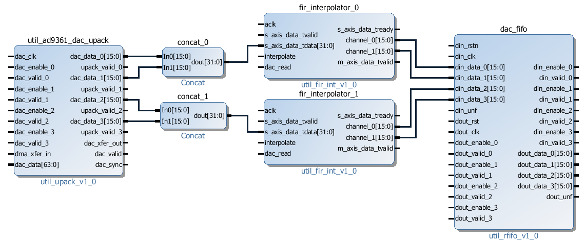

Connecting the FIR decimation filters on the Rx side
~~~~~~~~~~~~~~~~~~~~~~~~~~~~~~~~~~~~~~~~~~~~~~~~~~~~~~~~~~~~~~~~~~~~~~~~~~~~~~~

.. code-block:: tcl

   # fir decimator 0
   connect_bd_net [get_bd_pins util_ad9361_divclk/clk_out] [get_bd_pins fir_decimator_0/aclk]
   connect_bd_net [get_bd_pins util_ad9361_adc_fifo/dout_data_0] [get_bd_pins fir_decimator_0/channel_0]
   connect_bd_net [get_bd_pins util_ad9361_adc_fifo/dout_data_1] [get_bd_pins fir_decimator_0/channel_1]
   connect_bd_net [get_bd_pins util_ad9361_adc_fifo/dout_valid_0] [get_bd_pins fir_decimator_0/s_axis_data_tvalid]
   connect_bd_net [get_bd_pins util_ad9361_adc_pack/enable_0 ] [get_bd_pins util_ad9361_adc_fifo/dout_enable_0]
   connect_bd_net [get_bd_pins util_ad9361_adc_pack/enable_1 ] [get_bd_pins util_ad9361_adc_fifo/dout_enable_1]
   connect_bd_net [get_bd_pins pack0_slice_0/Din] [get_bd_pins fir_decimator_0/m_axis_data_tdata]
   connect_bd_net [get_bd_pins pack0_slice_1/Din] [get_bd_pins fir_decimator_0/m_axis_data_tdata]
   connect_bd_net [get_bd_pins util_ad9361_adc_pack/fifo_wr_data_0] [get_bd_pins pack0_slice_0/Dout]
   connect_bd_net [get_bd_pins util_ad9361_adc_pack/fifo_wr_data_1] [get_bd_pins pack0_slice_1/Dout]
   
   # fir decimator 1
   connect_bd_net [get_bd_pins util_ad9361_divclk/clk_out] [get_bd_pins fir_decimator_1/aclk]
   connect_bd_net [get_bd_pins util_ad9361_adc_fifo/dout_data_2] [get_bd_pins fir_decimator_1/channel_0]
   connect_bd_net [get_bd_pins util_ad9361_adc_fifo/dout_data_3] [get_bd_pins fir_decimator_1/channel_1]
   connect_bd_net [get_bd_pins util_ad9361_adc_fifo/dout_valid_2] [get_bd_pins fir_decimator_1/s_axis_data_tvalid]
   connect_bd_net [get_bd_pins util_ad9361_dac_pack/fifo_rd_en] [get_bd_pins fir_decimator_1/m_axis_data_tvalid] 
   connect_bd_net [get_bd_pins util_ad9361_adc_pack/enable_2 ] [get_bd_pins util_ad9361_adc_fifo/dout_enable_2]
   connect_bd_net [get_bd_pins util_ad9361_adc_pack/enable_3 ] [get_bd_pins util_ad9361_adc_fifo/dout_enable_3]
   connect_bd_net [get_bd_pins pack1_slice_0/Din] [get_bd_pins fir_decimator_1/m_axis_data_tdata]
   connect_bd_net [get_bd_pins pack1_slice_1/Din] [get_bd_pins fir_decimator_1/m_axis_data_tdata]
   connect_bd_net [get_bd_pins util_ad9361_adc_pack/fifo_wr_data_2] [get_bd_pins pack1_slice_0/Dout]
   connect_bd_net [get_bd_pins util_ad9361_adc_pack/fifo_wr_data_3] [get_bd_pins pack1_slice_1/Dout]

   #gpio controlled
   connect_bd_net [get_bd_pins axi_ad9361/up_dac_gpio_out] [get_bd_pins decim_slice/Din]
   connect_bd_net [get_bd_pins fir_decimator_0/decimate] [get_bd_pins decim_slice/Dout]
   connect_bd_net [get_bd_pins fir_decimator_1/decimate] [get_bd_pins decim_slice/Din]

Generating the programing files
~~~~~~~~~~~~~~~~~~~~~~~~~~~~~~~~~~~~~~~~~~~~~~~~~~~~~~~~~~~~~~~~~~~~~~~~~~~~~~~

.. note::  
   - Depending if you did your changes in **GUI**, you can click on **"Generate Bitstream"**.  
     After the bitstream generation is complete, click on **Files → Export → Export Hardware**,  
     select **Include Bitstream** option.  

   - If you did your changes directly in the **Tcl files**, you can use ``make`` to generate  
     the bitstream and HDF file.  

   - Now depending if your system is based on a **zynq architecture**, you will have to  
     generate the ``BOOT.BIN``. If you have a **MicroBlaze** soft processor in your system,  
     booting the Linux will is simpler.  

.. important::  
   
   More info on:

   - :dokuwiki:`Building the ADI HDL  </resources/fpga/docs/build>`  
   - :dokuwiki:`Building the ADI Linux  </resources/tools-software/linux-drivers-all>`  

Base system functionality
-------------------------------------------------------------------------------

For simply testing the fmcomms2 with filter design we loop-back the data from TX to RX for each channel with a SMA to SMA cable.

When first booting up the design none of the filters will be active. For the beginning make sure you have the same **LO frequency for RX and TX**, as in the picture below.
Configure the Transmit/DDS mode to DAC Buffer Output, and chose one of the .mat files there and press Load this will send data in the .mat file via DMA. This option was
chosen because the DDS data does not pass through the FIR interpolation filters. On the decimation side, data will always pass through decimation filters.

Below you can see the setting for fmcomms2 and the data plot in FFT and Time Domain for the "sinewave_0.6.mat". As a functionality example, only one of the 2 channels will be enabled.

**FFT Domain**

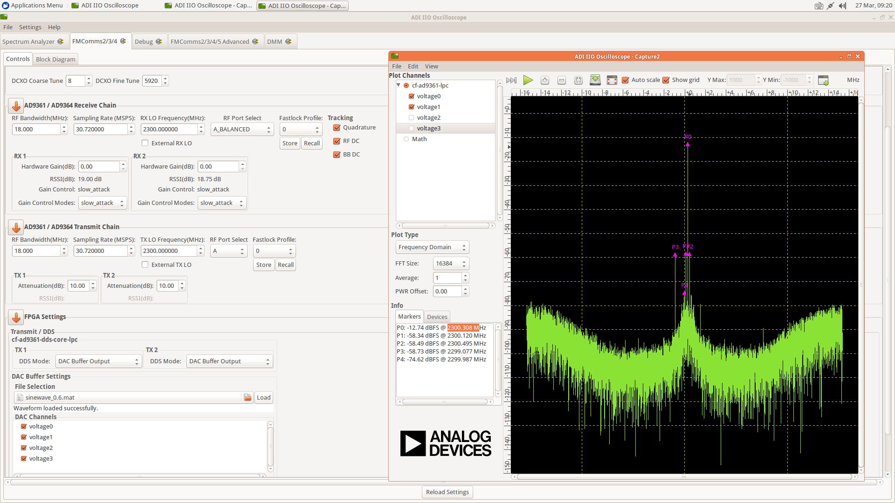

**Time Domain**

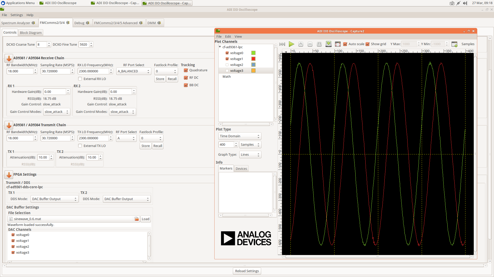

To better understand what is happening with the data inside the FPGA, 3 ILA (Integrated Logic Analyzer) modules were added to the HDL design.
The first ILA was connected to the control signals between the ad9361_core and the dac_fifo. Second ILA is monitoring the interpolation filters
and the third ILA the decimation filters. As previously discussed above none of the filters are active and only one of the channels is enabled at this point.

**AD9361_core control signals**

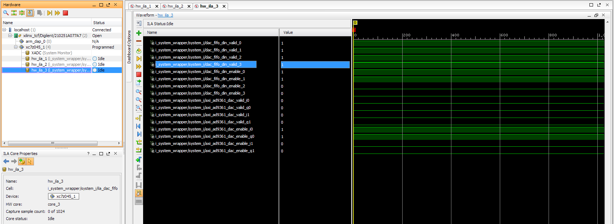

**Interpolation filters**

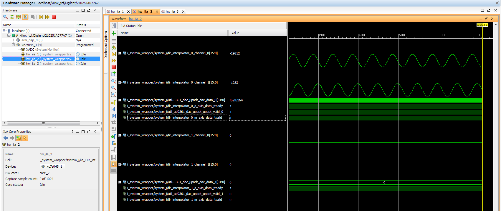

**Decimation filters**

.. image:: fir_inactive_decimators_ch1_active.png
   :width: 1000
   :align: center
   :alt: FIR_INACTIVE_DECIMATORS_CH1_ACTIVE

Activating Filters
-------------------------------------------------------------------------------

Interpolation filter
~~~~~~~~~~~~~~~~~~~~~~~~~~~~~~~~~~~~~~~~~~~~~~~~~~~~~~~~~~~~~~~~~~~~~~~~~~~~~~~

In the **Connecting the FIR interpolation filters on the Tx side** section above, we added a GPIO control.
The ad9361_core GPIO control register can be found in the register map at the address **0xBC**
:dokuwiki:`axi_ad9361_core  </resources/fpga/docs/axi_ad9361>`

To activate the interpolation filter one must go to the Debug mode.
   - At section Device selection chose **"cf-ad9361-dds-core-lpc"**
   - In the Register Map settings, select the source to be AXI_CORE
   - Read the 0xBC address then write 0x1 value at it, this will activate the filter.

**Activating TX interpolation filters**

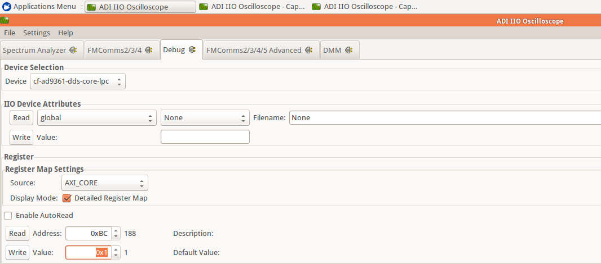

After activating the interpolation you can see in FFT domain a 1/8 smaller fundamental frequency than before (filter interpolation factor is 8).

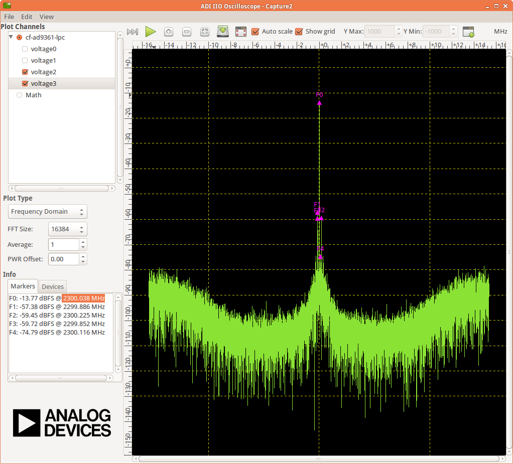

The data captured by the ILA connected to the interpolation filters shows the smaller frequency sine wave and the 1/8 valid/clock signals.

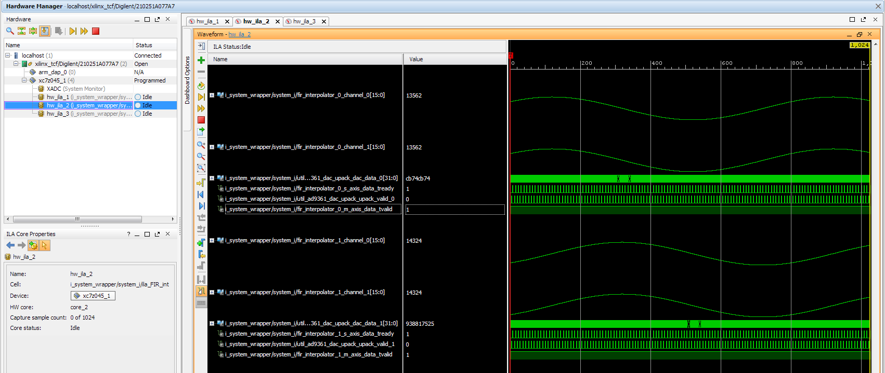

Decimation filters
~~~~~~~~~~~~~~~~~~~~~~~~~~~~~~~~~~~~~~~~~~~~~~~~~~~~~~~~~~~~~~~~~~~~~~~~~~~~~~~

At this point again all filters are disabled.

Similar to interpolation, to activate the decimation we must go to the Debug, but this time select the "cf-ad9361-lpc".
Select the "Register Map Settings" source to be "AXI_CORE" and at the same address **0xBC** 
:dokuwiki:`axi_ad9361_core  </resources/fpga/docs/axi_ad9361>` this time being the ADC side GPIO, write 0x1, as in the example below.

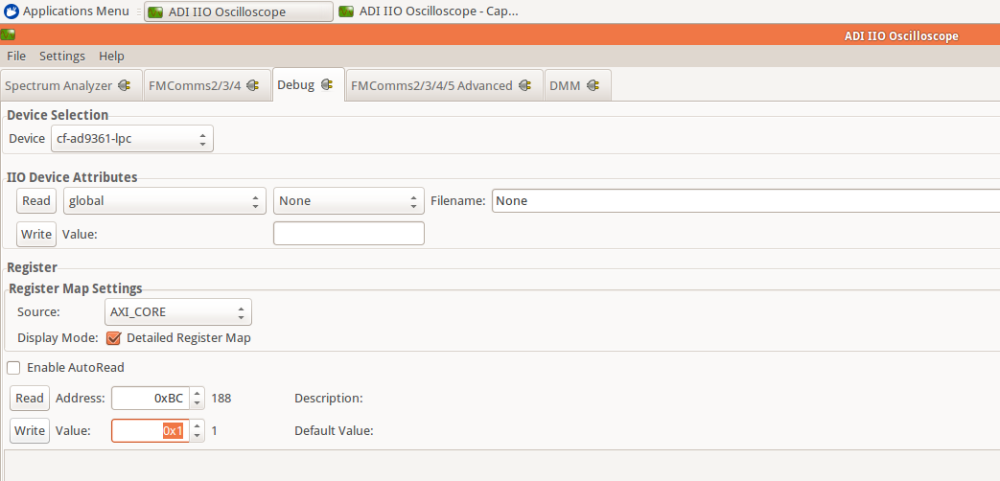

You will see in the FFT domain a frequency 8 times bigger than the one when the filters were inactive (decimation factor is 8).

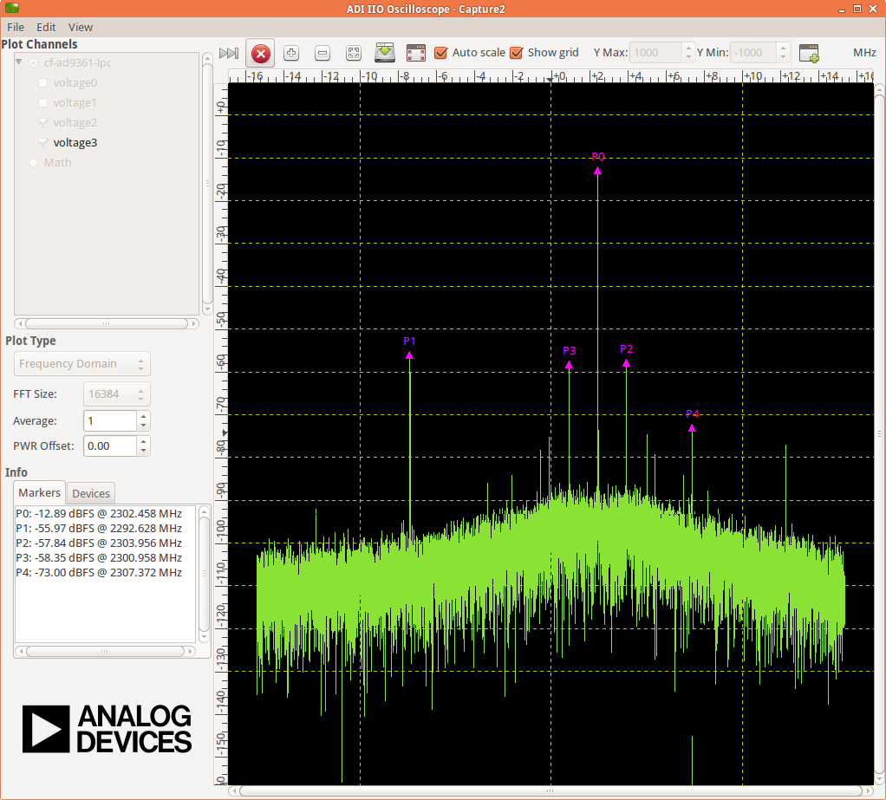

The signals captured by the ILA:

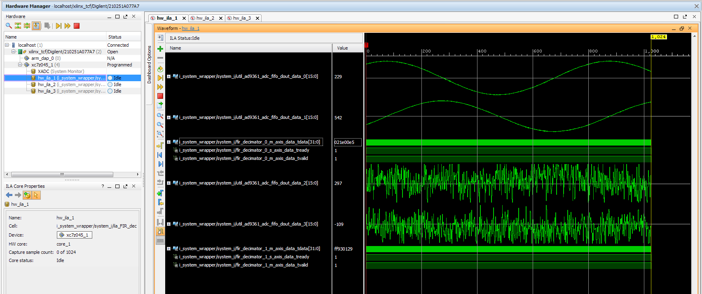

All filters active characteristic
~~~~~~~~~~~~~~~~~~~~~~~~~~~~~~~~~~~~~~~~~~~~~~~~~~~~~~~~~~~~~~~~~~~~~~~~~~~~~~~

**FFT characteristic**

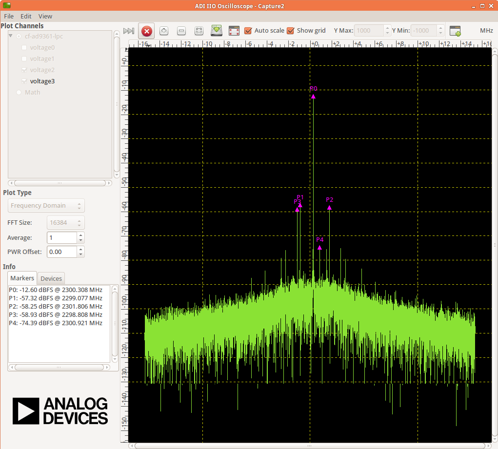

**Time Domain characteristic**

Download
-------------------------------------------------------------------------------

- `boot.zip <resources/fpga/docs/hdl/boot.zip>`_

- `HDL Release - FIR Filter <https://github.com/analogdevicesinc/hdl/releases/tag/eg_fmcomms2_fir_filter>`_

References
-------------------------------------------------------------------------------

- `MathWorks Interpolator <https://uk.mathworks.com/help/dsp/ref/fdesign.interpolator.html>`_

- :dokuwiki:`axi_ad9361  </resources/fpga/docs/axi_ad9361>`

- :dokuwiki:`ADI Reference Designs HDL User Guide  </resources/fpga/docs/hdl>`

- :dokuwiki:`AD-FMCOMMS2-EBZ User Guide  </resources/eval/user-guides/ad-fmcomms2-ebz>`

- :dokuwiki:`util_upack_core  </resources/fpga/docs/util_upack>`

- :dokuwiki:`util_pack_core  </resources/fpga/docs/util_cpack>` 

