.. _fir_filter:

Integrate FIR filters into the FMCOMMS2 HDL design
===============================================================================

Overview
-------------------------------------------------------------------------------

This wiki page describes how to add a custom processing module into the
:git-hdl:`FMCOMMS2 <projects/fmcomms2>`'s TX and/or RX data path.

In this example, the custom modules are going to be some digital FIR filters, to
decimate and interpolate the incoming and outcoming data stream.

.. important::

   This example was built using the hdl_2023_r2 release branch, using Vivado and
   Vitis 2023.2. Sources from older examples can be found under the tag
   `eg_fmcomms2_fir_filter`_ using Vivado 16.2 and 16.4 versions, andstatus
   **are not supported by us anymore**.

Assuming we want to transmit a sinewave with the :adi:`AD9361` ADI Integrated RF
transceiver: the sinewave frequency is below 6 MHz, so we can use a lower system
data rate than the reference design. But, by simply lowering the data rate of
the system we will increase the equalization error. To avoid this issue, we can
add some interpolation filters for transmitting.

A similar problem is encountered on the ADC side when receiving a low-frequency
signal. This can be solved with the use of decimation filters. In our example,
these filters were already implemented in :git-hdl:`util_fir_int
<library/util_fir_int>` and :git-hdl:`util_fir_dec <library/util_fir_dec>` HDL
IP core, which are wrappers for the FIR Compiler Xilinx IP. The wrappers are
used to manage the data rates entering the filter and to facilitate the
configuration of the filter parameters for a specific application (TX/RX).

Choosing filter parameters and coefficients
-------------------------------------------------------------------------------

The interpolation/decimation filters parameters and coefficients were calculated
in `MATLAB`_.

Interpolation FIR filter
~~~~~~~~~~~~~~~~~~~~~~~~~~~~~~~~~~~~~~~~~~~~~~~~~~~~~~~~~~~~~~~~~~~~~~~~~~~~~~~

- ``ast``: normalize stopband attenuation = 80
- ``tw``: normalized transition width = 0.1
- ``n``: number of coefficients = 128
- ``interp``: interpolation factor = 8

.. code-block::

   ast = 80;
   n = 128;
   tw = 0.1;
   interp = 8;
   f = fdesign.interpolator(interp,'Nyquist', interp,'N,Ast', n, ast);
   hf = design(f,'kaiserwin');

   hq = dfilt.dffir(hf.Numerator./interp);set(hq, 'Arithmetic',  'fixed');
   coewrite(hq, 10, 'coefile_int_8');

   fvtool(hq);

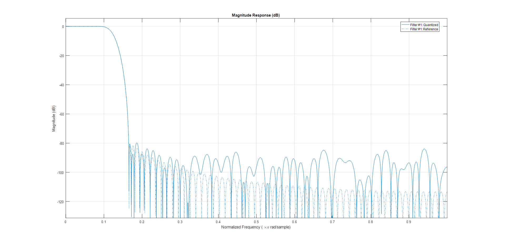

Decimation FIR filter
~~~~~~~~~~~~~~~~~~~~~~~~~~~~~~~~~~~~~~~~~~~~~~~~~~~~~~~~~~~~~~~~~~~~~~~~~~~~~~~

- ``ast``: normalize stopband attenuation = 80
- ``tw``: normalized transition width = 0.01
- ``n``: number of coefficients = 128
- ``interp``: interpolation factor = 8

.. code-block::

   ast = 80;
   n = 128;
   tw = 0.01;
   decim = 8;
   f = fdesign.decimator(decim, 'Nyquist', decim,'N, Ast', n, ast);
   hf = design(f);

   hq = dfilt.dffir(hf.Numerator);
   set(hq, 'Arithmetic',  'fixed', 'CoeffWordLength', 18);
   coewrite(hq, 10, 'coefile_dec');

   fvtool(hf);

.. note::

   After running the above commands in MATLAB, you will obtain some *.coe*
   files, that will be processed by the Xilinx FIR Compiler IP.

Adding the filters in the data path
-------------------------------------------------------------------------------

In the original :git-hdl:`fmcomms2 <projects/fmcomms2>` design, the data comes
from the :git-hdl:`DMA <library/axi_dmac>`, goes to the :git-hdl:`util_upack2
<library/util_pack/util_upack2>` core which transmits the individual channel
data to a :git-hdl:`dac_fifo <library/util_rfifo>` core, from which the
:git-hdl:`axi_ad9361 <library/axi_ad9361>` core reads the data and transmits it
to the :adi:`AD9361` chip. The util_upack2 core is used to split the 64-bit data
containing 2 RF channels, each one having I/Q data. dac_fifo is used for
clock-domain crossing between the system clock and the AD9361 clock.

The data processing is done at lower clock frequencies. This is the reason for
placing the interpolation filters in front of the dac_fifo module.

The required input data for the filter is I/Q data and the output is independent
I and Q data. Because of these conditions, we still require the util_upack2
module, but we only need to split the DAC data into independent channel data, so
we need one UPACK module and two **util_fir_int** modules before the FIFO. The
same approach is implemented on the receive path.

For more information about the reference design, visit :ref:`fmcomms2`
documentation.

Block diagram
-------------------------------------------------------------------------------

The modified reference design block diagram containing now **Interpolation** and
**Decimation** filters is presented below:

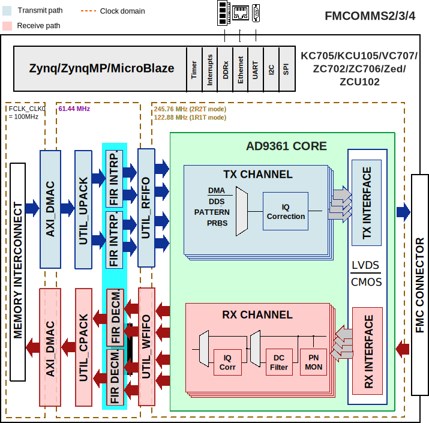

Understanding FMCOMMS2 clock routing
-------------------------------------------------------------------------------

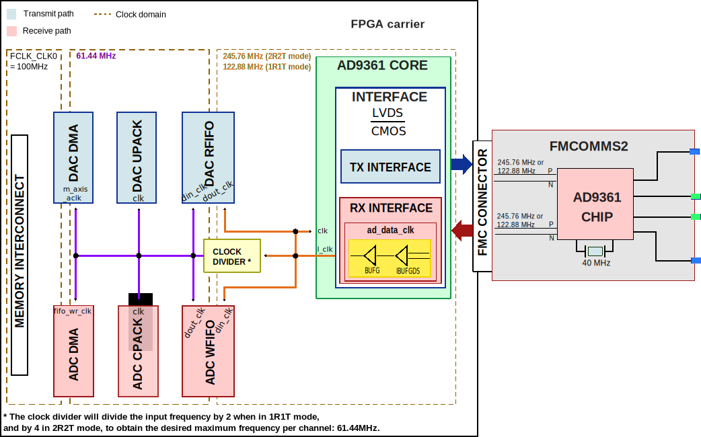

Adding FIR filters in FMCOMMS2 design and building the HDL
-------------------------------------------------------------------------------

The design is obtain by simply sourcing the base FMCOMMS2 block design.

.. code-block:: tcl

   set project_dir [pwd]
   cd $ad_hdl_dir/projects/fmcomms2/zc706/
   source system_project.tcl
   cd $project_dir

At this point, FMCOMMS2 reference design's TX data path has the following
components:

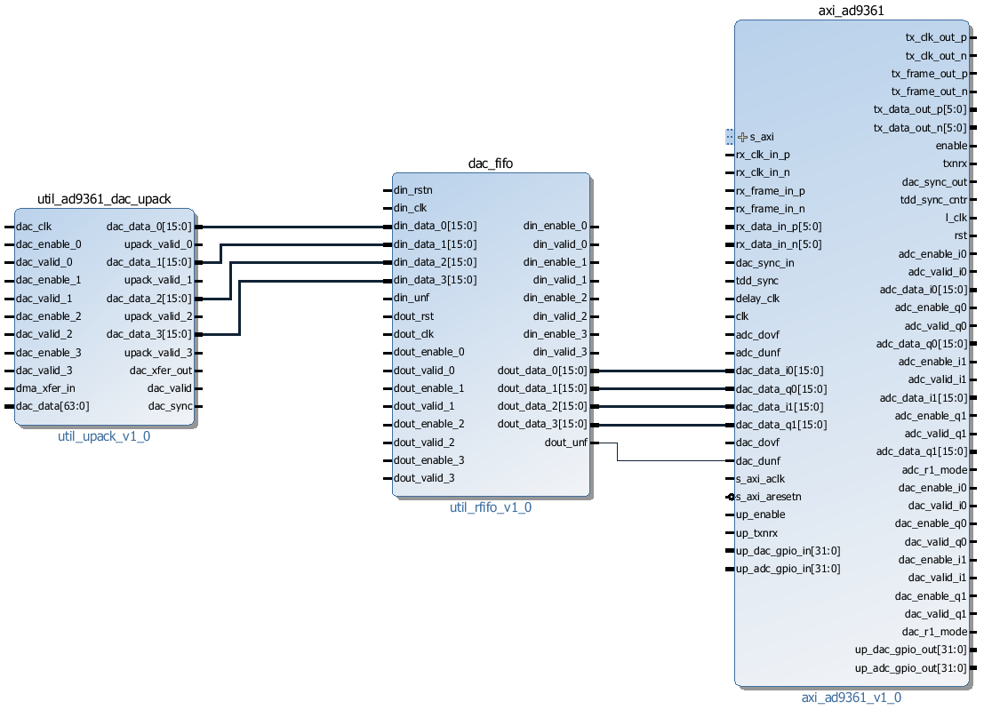

We need to remove the connections between util_upack2 and dac_fifo cores so we
can add the FIR filter modules in the reference design. With the following
commands, all the unwanted connections will be removed and new ones will be
created.

All the TCL commands from this page are available in the `fir_filter.tcl` script
located in `hdl/docs/projects/fmcomms2`.

.. code-block:: tcl

   # delete reference design connections
   delete_bd_objs [get_bd_nets axi_ad9361_dac_fifo_din_valid_0]
   delete_bd_objs [get_bd_nets axi_ad9361_dac_fifo_din_enable_*]
   delete_bd_objs [get_bd_nets util_ad9361_dac_upack_fifo_rd_data_*]
   delete_bd_objs [get_bd_nets util_ad9361_dac_upack_fifo_rd_underflow]
   delete_bd_objs [get_bd_nets util_ad9361_dac_upack_fifo_rd_valid]

We will disconnect/connect the Rx path in a similar manner.

.. code-block:: tcl

   delete_bd_objs [get_bd_nets util_ad9361_adc_fifo_dout_valid_0]
   delete_bd_objs [get_bd_nets util_ad9361_adc_fifo_dout_enable_*]
   delete_bd_objs [get_bd_nets util_ad9361_adc_fifo_dout_data_*]

Adding interpolation filters.

Add the two required IP cores to the Makefile: **LIB_DEPS += util_fir_int** and
**LIB_DEPS += util_fir_dec**.

.. code-block:: tcl

   set util_fir_int_0 [create_bd_cell -type ip -vlnv analog.com:user:util_fir_int:1.0 util_fir_int_0]
   set util_fir_int_1 [create_bd_cell -type ip -vlnv analog.com:user:util_fir_int:1.0 util_fir_int_1]

Adding interpolation control.

.. code-block:: tcl

   set interp_slice [create_bd_cell -type inline_hdl -vlnv xilinx.com:inline_hdl:ilslice:1.0 interp_slice]

Adding decimation filters.

.. code-block:: tcl

   set fir_decimator_0 [create_bd_cell -type ip -vlnv analog.com:user:util_fir_dec:1.0 fir_decimator_0]
   set fir_decimator_1 [create_bd_cell -type ip -vlnv analog.com:user:util_fir_dec:1.0 fir_decimator_1]

Adding decimation control.

.. code-block:: tcl

   set decim_slice [create_bd_cell -type inline_hdl -vlnv xilinx.com:inline_hdl:ilslice:1.0 decim_slice]

The interpolation filter has a 32-bit (I+Q) input data bus. In the base design,
the util_upack2 module is configured to output 4 channels of 16-bit data. By
changing the UPACK number of channels to 2 and the width of the channels to
32-bit, will not work because of how the independent I/Q channel data is
arranged in the 64-bit data bus coming from the DMA; see the figure below:

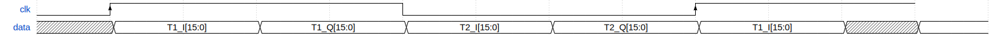

More information about the util_upack2 core at :ref:`util_upack2`.

As a fact, the data transmitted/received through LVDS interface at DDR (Double
Data Rate) is presented in the diagram below:

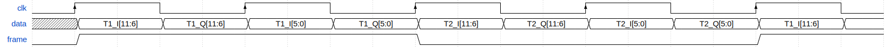

At this point, we have two options:

#. Delete the upack_core and split the data into some simple slices
#. Keep upack_core and the possibility to use half of the DMA bandwidth when
   one channel is not enabled.

For this example, the upack_core was kept. The core's proprieties remain
unchanged, and a concatenate module was added, in order to merge the data coming
out from the unpack module, then feed it into the interpolation filter.

Adding concatenation modules
~~~~~~~~~~~~~~~~~~~~~~~~~~~~~~~~~~~~~~~~~~~~~~~~~~~~~~~~~~~~~~~~~~~~~~~~~~~~~~~

.. code-block:: tcl

   set concat_0 [create_bd_cell -type inline_hdl -vlnv xilinx.com:inline_hdl:ilconcat:1.0 concat_0]
   set_property -dict [list CONFIG.IN1_WIDTH.VALUE_SRC USER CONFIG.IN0_WIDTH.VALUE_SRC USER] $concat_0
   set_property -dict [list CONFIG.IN0_WIDTH {16} CONFIG.IN1_WIDTH {16}] $concat_0
   set concat_1 [create_bd_cell -type inline_hdl -vlnv xilinx.com:inline_hdl:ilconcat:1.0 concat_1]
   set_property -dict [list CONFIG.IN1_WIDTH.VALUE_SRC USER CONFIG.IN0_WIDTH.VALUE_SRC USER] $concat_1
   set_property -dict [list CONFIG.IN0_WIDTH {16} CONFIG.IN1_WIDTH {16}] $concat_1

The same principle is applied to the RX path for the pack_core. The difference
is that we need to split the data outputted by the decimation filters to obtain
the independent I/Q channel data.

.. code-block:: tcl

   set pack0_slice_0 [create_bd_cell -type inline_hdl -vlnv xilinx.com:inline_hdl:ilslice:1.0 pack0_slice_0]
   set_property -dict [list CONFIG.DIN_FROM {15}] $pack0_slice_0
   set_property -dict [list CONFIG.DIN_TO {0}] $pack0_slice_0
   set_property -dict [list CONFIG.DOUT_WIDTH {16}] $pack0_slice_0
   set pack0_slice_1 [create_bd_cell -type inline_hdl -vlnv xilinx.com:inline_hdl:ilslice:1.0 pack0_slice_1]
   set_property -dict [list CONFIG.DIN_FROM {31}] $pack0_slice_1
   set_property -dict [list CONFIG.DIN_TO {16}] $pack0_slice_1
   set_property -dict [list CONFIG.DOUT_WIDTH {16}] $pack0_slice_1
   set pack1_slice_0 [create_bd_cell -type inline_hdl -vlnv xilinx.com:inline_hdl:ilslice:1.0 pack1_slice_0]
   set_property -dict [list CONFIG.DIN_FROM {15}] $pack1_slice_0
   set_property -dict [list CONFIG.DIN_TO {0}] $pack1_slice_0
   set_property -dict [list CONFIG.DOUT_WIDTH {16}] $pack1_slice_0
   set pack1_slice_1 [create_bd_cell -type inline_hdl -vlnv xilinx.com:inline_hdl:ilslice:1.0 pack1_slice_1]
   set_property -dict [list CONFIG.DIN_FROM {31}] $pack1_slice_1
   set_property -dict [list CONFIG.DIN_TO {16}] $pack1_slice_1
   set_property -dict [list CONFIG.DOUT_WIDTH {16}] $pack1_slice_1

Connecting the FIR interpolation filters on the Tx side
~~~~~~~~~~~~~~~~~~~~~~~~~~~~~~~~~~~~~~~~~~~~~~~~~~~~~~~~~~~~~~~~~~~~~~~~~~~~~~~

.. code-block:: tcl

   # fir interpolator 0
   connect_bd_net [get_bd_pins util_ad9361_divclk/clk_out] [get_bd_pins util_fir_int_0/aclk]
   connect_bd_net [get_bd_pins util_ad9361_dac_upack/enable_0] [get_bd_pins axi_ad9361_dac_fifo/din_enable_0]
   connect_bd_net [get_bd_pins util_ad9361_dac_upack/enable_1] [get_bd_pins axi_ad9361_dac_fifo/din_enable_1]
   connect_bd_net [get_bd_pins util_ad9361_dac_upack/fifo_rd_en] [get_bd_pins util_fir_int_0/s_axis_data_tready]
   connect_bd_net [get_bd_pins util_ad9361_dac_upack/fifo_rd_en] [get_bd_pins util_fir_int_0/s_axis_data_tvalid]
   connect_bd_net [get_bd_pins axi_ad9361_dac_fifo/din_data_0] [get_bd_pins util_fir_int_0/channel_0]
   connect_bd_net [get_bd_pins axi_ad9361_dac_fifo/din_data_1] [get_bd_pins util_fir_int_0/channel_1]
   connect_bd_net [get_bd_pins axi_ad9361_dac_fifo/din_valid_0] [get_bd_pins util_fir_int_0/dac_read]
   connect_bd_net [get_bd_pins concat_0/In0] [get_bd_pins util_ad9361_dac_upack/fifo_rd_data_0]
   connect_bd_net [get_bd_pins concat_0/In1] [get_bd_pins util_ad9361_dac_upack/fifo_rd_data_1]
   connect_bd_net [get_bd_pins concat_0/dout] [get_bd_pins util_fir_int_0/s_axis_data_tdata]

   # fir interpolator 1
   connect_bd_net [get_bd_pins util_ad9361_divclk/clk_out] [get_bd_pins util_fir_int_1/aclk]
   connect_bd_net [get_bd_pins util_ad9361_dac_upack/enable_2] [get_bd_pins axi_ad9361_dac_fifo/din_enable_2]
   connect_bd_net [get_bd_pins util_ad9361_dac_upack/enable_3] [get_bd_pins axi_ad9361_dac_fifo/din_enable_3]
   connect_bd_net [get_bd_pins util_ad9361_dac_upack/fifo_rd_en] [get_bd_pins util_fir_int_1/s_axis_data_tvalid]
   connect_bd_net [get_bd_pins axi_ad9361_dac_fifo/din_data_2] [get_bd_pins util_fir_int_1/channel_0]
   connect_bd_net [get_bd_pins axi_ad9361_dac_fifo/din_data_3] [get_bd_pins util_fir_int_0/channel_1]
   connect_bd_net [get_bd_pins axi_ad9361_dac_fifo/din_valid_2] [get_bd_pins util_fir_int_1/dac_read]
   connect_bd_net [get_bd_pins concat_1/In0] [get_bd_pins util_ad9361_dac_upack/fifo_rd_data_2]
   connect_bd_net [get_bd_pins concat_1/In1] [get_bd_pins util_ad9361_dac_upack/fifo_rd_data_3]
   connect_bd_net [get_bd_pins concat_1/dout] [get_bd_pins util_fir_int_1/s_axis_data_tdata]

   # gpio controlled
   connect_bd_net [get_bd_pins axi_ad9361/up_dac_gpio_out] [get_bd_pins interp_slice/Din]
   connect_bd_net [get_bd_pins util_fir_int_0/interpolate] [get_bd_pins interp_slice/Dout]
   connect_bd_net [get_bd_pins util_fir_int_1/interpolate] [get_bd_pins interp_slice/Dout]

In this example, the TX data flow is controlled by the interpolation filter when
interpolation is activated and by the axi_ad9361_core when interpolation is not
active. In the reference design, the data flow is controlled by the ad9631_core.

..
   We must connect the upack_core's dma_xfer_in port to VCC so that the UPACK may
   transmit the valid and enable signals from one entity to another.

   .. code-block:: tcl

      ad_connect util_ad9361_dac_upack/dma_xfer_in VCC

At this moment, the Interpolation filters are completely integrated into the
design and the data path should look like the one in the figure below.

Connecting the FIR decimation filters on the Rx side
~~~~~~~~~~~~~~~~~~~~~~~~~~~~~~~~~~~~~~~~~~~~~~~~~~~~~~~~~~~~~~~~~~~~~~~~~~~~~~~

.. code-block:: tcl

   # fir decimator 0
   connect_bd_net [get_bd_pins util_ad9361_divclk/clk_out] [get_bd_pins fir_decimator_0/aclk]
   connect_bd_net [get_bd_pins util_ad9361_adc_fifo/dout_data_0] [get_bd_pins fir_decimator_0/channel_0]
   connect_bd_net [get_bd_pins util_ad9361_adc_fifo/dout_data_1] [get_bd_pins fir_decimator_0/channel_1]
   connect_bd_net [get_bd_pins util_ad9361_adc_fifo/dout_valid_0] [get_bd_pins fir_decimator_0/s_axis_data_tvalid]
   connect_bd_net [get_bd_pins util_ad9361_adc_pack/enable_0 ] [get_bd_pins util_ad9361_adc_fifo/dout_enable_0]
   connect_bd_net [get_bd_pins util_ad9361_adc_pack/enable_1 ] [get_bd_pins util_ad9361_adc_fifo/dout_enable_1]
   connect_bd_net [get_bd_pins pack0_slice_0/Din] [get_bd_pins fir_decimator_0/m_axis_data_tdata]
   connect_bd_net [get_bd_pins pack0_slice_1/Din] [get_bd_pins fir_decimator_0/m_axis_data_tdata]
   connect_bd_net [get_bd_pins util_ad9361_adc_pack/fifo_wr_data_0] [get_bd_pins pack0_slice_0/Dout]
   connect_bd_net [get_bd_pins util_ad9361_adc_pack/fifo_wr_data_1] [get_bd_pins pack0_slice_1/Dout]

   # fir decimator 1
   connect_bd_net [get_bd_pins util_ad9361_divclk/clk_out] [get_bd_pins fir_decimator_1/aclk]
   connect_bd_net [get_bd_pins util_ad9361_adc_fifo/dout_data_2] [get_bd_pins fir_decimator_1/channel_0]
   connect_bd_net [get_bd_pins util_ad9361_adc_fifo/dout_data_3] [get_bd_pins fir_decimator_1/channel_1]
   connect_bd_net [get_bd_pins util_ad9361_adc_fifo/dout_valid_2] [get_bd_pins fir_decimator_1/s_axis_data_tvalid]
   connect_bd_net [get_bd_pins util_ad9361_adc_pack/fifo_wr_en] [get_bd_pins fir_decimator_1/m_axis_data_tvalid]
   connect_bd_net [get_bd_pins util_ad9361_adc_pack/enable_2 ] [get_bd_pins util_ad9361_adc_fifo/dout_enable_2]
   connect_bd_net [get_bd_pins util_ad9361_adc_pack/enable_3 ] [get_bd_pins util_ad9361_adc_fifo/dout_enable_3]
   connect_bd_net [get_bd_pins pack1_slice_0/Din] [get_bd_pins fir_decimator_1/m_axis_data_tdata]
   connect_bd_net [get_bd_pins pack1_slice_1/Din] [get_bd_pins fir_decimator_1/m_axis_data_tdata]
   connect_bd_net [get_bd_pins util_ad9361_adc_pack/fifo_wr_data_2] [get_bd_pins pack1_slice_0/Dout]
   connect_bd_net [get_bd_pins util_ad9361_adc_pack/fifo_wr_data_3] [get_bd_pins pack1_slice_1/Dout]

   #gpio controlled
   connect_bd_net [get_bd_pins axi_ad9361/up_dac_gpio_out] [get_bd_pins decim_slice/Din]
   connect_bd_net [get_bd_pins fir_decimator_0/decimate] [get_bd_pins decim_slice/Dout]
   connect_bd_net [get_bd_pins fir_decimator_1/decimate] [get_bd_pins decim_slice/Din]

Generating the programing files
~~~~~~~~~~~~~~~~~~~~~~~~~~~~~~~~~~~~~~~~~~~~~~~~~~~~~~~~~~~~~~~~~~~~~~~~~~~~~~~

.. note::

   - If you did your changes in **GUI**, you can click on **"Generate Bitstream"**.
     After the bitstream generation is complete, click on **Files -> Export ->
     Export Hardware**, then select **Include Bitstream** option.
   - If you did your changes directly in the **Tcl files**, you can use
     ``make`` to generate the bitstream and .xsa file.
   - Now, if your system is based on a **Zynq architecture**, you will have to
     generate the ``BOOT.BIN``. If you have a **MicroBlaze** soft processor
     in your system, booting the Linux will is simpler.

More information at:

- :ref:`build_hdl`
- :external+documentation:ref:`linux-kernel zynq`
- :external+documentation:ref:`linux-kernel microblaze`

Base system functionality
-------------------------------------------------------------------------------

For simply testing the FMCOMMS2 with filter design, we loop-back the data from
TX to RX for each channel with a SMA to SMA cable.

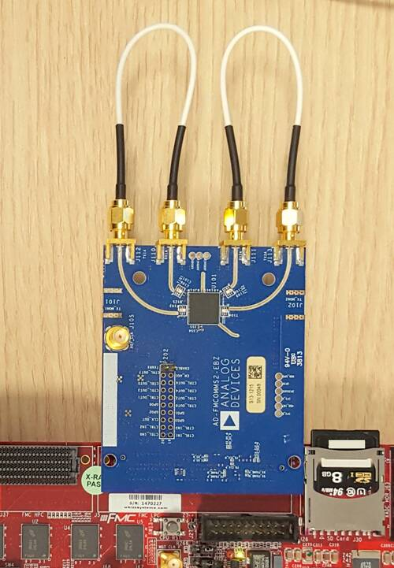

When first booting up the design, none of the filters will be active. For the
beginning make sure you have the same **LO frequency for RX and TX**, as in the
picture below.

Configure the Transmit/DDS mode to *DAC Buffer Output*, and chose one of the
*.mat* files from there and press *Load*. This will send data in the *.mat* file
via DMA. This option was chosen because the DDS data does not pass through the
FIR interpolation filters. On the decimation side, data will always pass through
decimation filters.

Below are the settings for FMCOMMS2 and the data plot in FFT and Time Domain for
the "sinewave_0.6.mat". The file "sinewave_0.6.mat" can be found under the
installation folder, in **lib\osc\waveforms**. As a functionality example, only
one of the two channels will be enabled.

**FFT Domain**

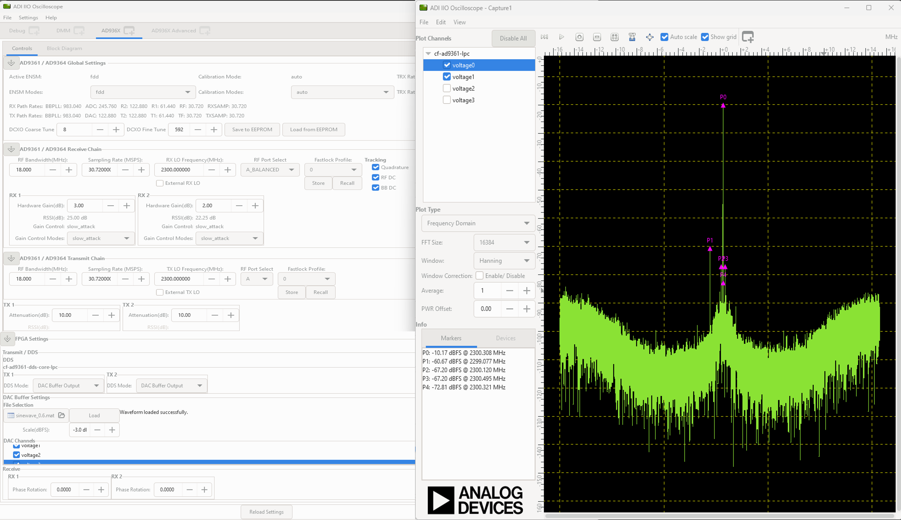

**Time Domain**

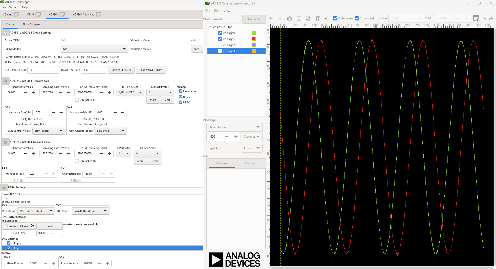

To better understand what is happening with the data inside the FPGA, 3 ILAs
(Integrated Logic Analyzer) modules were added in the HDL design.

The 1st ILA was connected to the control signals between the ad9361_core and the
dac_fifo. The 2nd ILA is monitoring the interpolation filters and the 3rd ILA
the decimation filters. As previously discussed above, **none of the filters are
active and only one of the channels is enabled at this point**.

**AD9361 core control signals**

**Interpolation filters**

**Decimation filters**

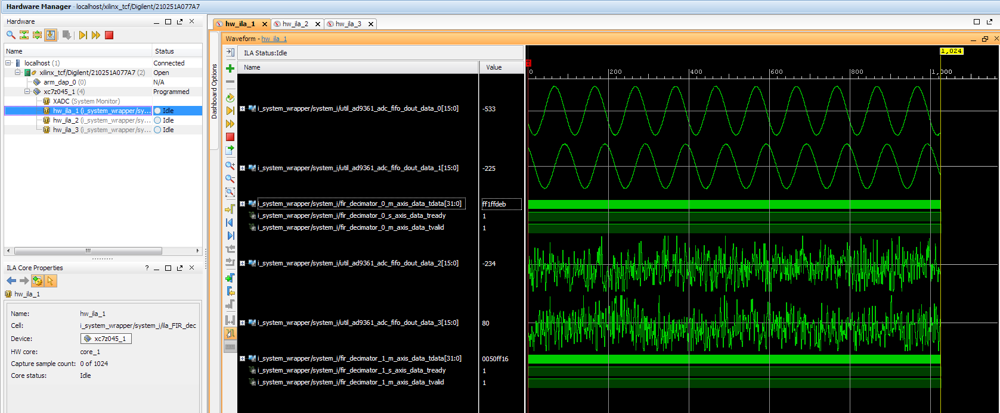

Activating Filters
-------------------------------------------------------------------------------

Interpolation filter
~~~~~~~~~~~~~~~~~~~~~~~~~~~~~~~~~~~~~~~~~~~~~~~~~~~~~~~~~~~~~~~~~~~~~~~~~~~~~~~

In the `Connecting the FIR interpolation filters on the Tx side`_ section above,
we added a GPIO control. The ad9361_core GPIO control register can be found in
the register map at the address **0xBC** `AXI AD9361`_.

To activate the interpolation filter, one must go to the Debug mode:

- At section Device selection chose **"cf-ad9361-dds-core-lpc"**
- In the Register Map settings, select the source to be AXI_CORE
- Read the 0xBC address then write 0x1 value at it, this will activate the
  filter.

**Activating TX interpolation filters**

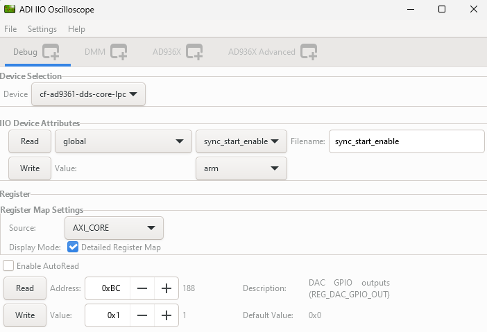

After activating the interpolation you can see in FFT domain a 1/8 smaller
fundamental frequency than before (filter interpolation factor is 8).

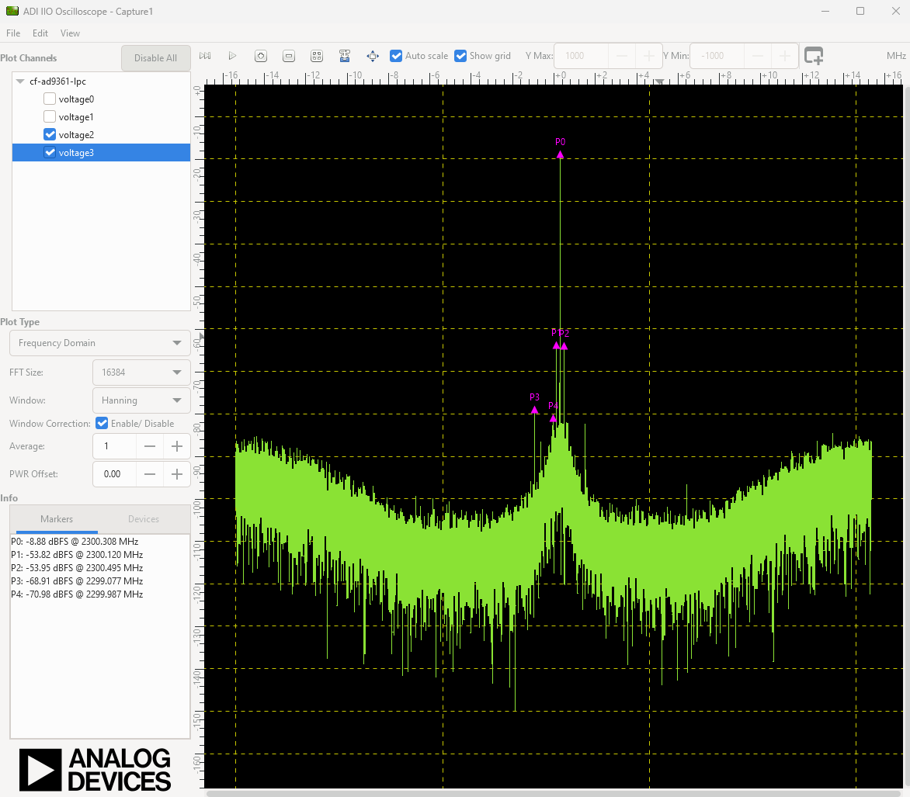

The data captured by the ILA connected to the interpolation filters shows the
smaller frequency sine wave and the 1/8 valid/clock signals.

Decimation filters
~~~~~~~~~~~~~~~~~~~~~~~~~~~~~~~~~~~~~~~~~~~~~~~~~~~~~~~~~~~~~~~~~~~~~~~~~~~~~~~

At this point, again all filters are disabled.

Similar to interpolation, to activate the decimation we must go to the Debug,
but this time select the "cf-ad9361-lpc".

Select the "Register Map Settings" source to be "AXI_CORE" and at the same
address **0xBC** `AXI AD9361`_. this time being the ADC side GPIO, write 0x1, as
in the example below:

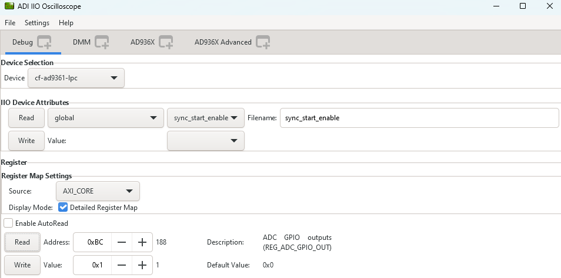

You will see in the FFT domain, a frequency 8 times bigger than the one when the
filters were inactive (decimation factor is 8):

The signals captured by the ILA:

All filters active characteristic
~~~~~~~~~~~~~~~~~~~~~~~~~~~~~~~~~~~~~~~~~~~~~~~~~~~~~~~~~~~~~~~~~~~~~~~~~~~~~~~

**FFT characteristic**

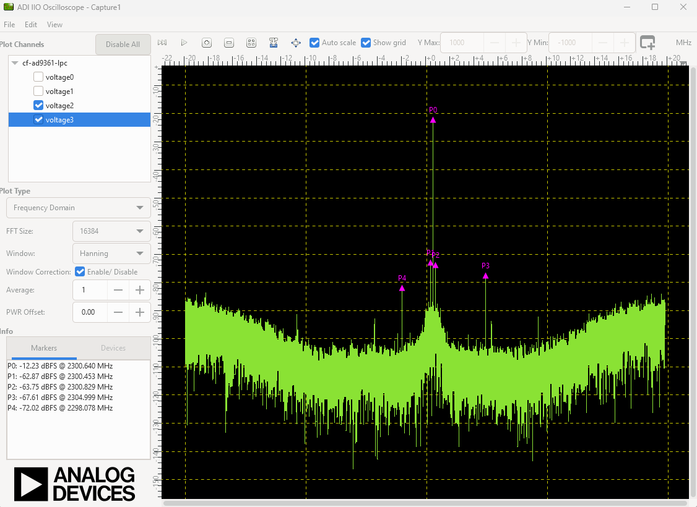

**Time Domain characteristic**

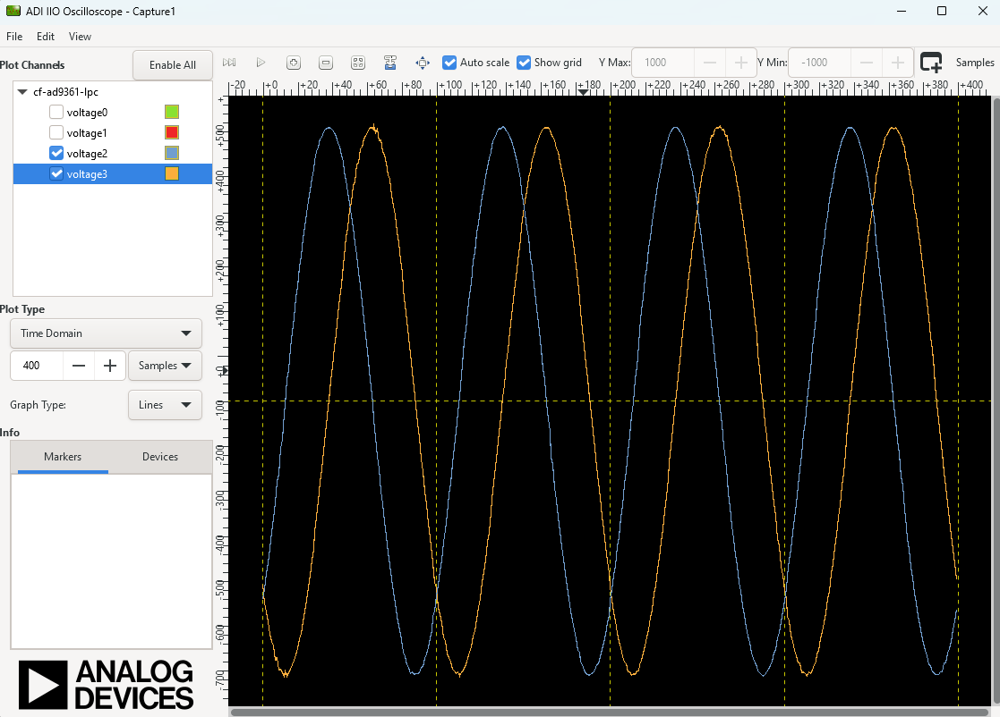

Download
-------------------------------------------------------------------------------

- :dokuwiki:`boot.zip <_media/resources/fpga/docs/hdl/boot.zip>`
- Sources from older examples can be found under the tag
  `eg_fmcomms2_fir_filter`_ using Vivado 16.2 and 16.4 versions, and
  **are not supported by us anymore**.

References
-------------------------------------------------------------------------------

- `MathWorks Interpolator <https://uk.mathworks.com/help/dsp/ref/fdesign.interpolator.html>`_
- :ref:`axi_ad9361`
- :ref:`build_hdl`
- :ref:`fmcomms2`
- :ref:`util_upack2`
- :ref:`util_cpack2`

.. _eg_fmcomms2_fir_filter: https://github.com/analogdevicesinc/hdl/releases/tag/eg_fmcomms2_fir_filter
.. _MATLAB: https://www.mathworks.com/products/matlab.html
.. _AXI AD9361: https://analogdevicesinc.github.io/hdl/library/axi_ad9361/index.html#register-map

.. code-block:: tcl

    # delete reference design connections
    delete_bd_objs [get_bd_nets axi_ad9361_dac_fifo_din_valid_0]
    delete_bd_objs [get_bd_nets axi_ad9361_dac_fifo_din_enable_*]
    delete_bd_objs [get_bd_nets util_ad9361_dac_upack_fifo_rd_data_*]
    delete_bd_objs [get_bd_nets util_ad9361_dac_upack_fifo_rd_underflow]
    delete_bd_objs [get_bd_nets util_ad9361_dac_upack_fifo_rd_valid]

    delete_bd_objs [get_bd_nets util_ad9361_adc_fifo_dout_valid_0]
    delete_bd_objs [get_bd_nets util_ad9361_adc_fifo_dout_enable_*]
    delete_bd_objs [get_bd_nets util_ad9361_adc_fifo_dout_data_*]

    set util_fir_int_0 [create_bd_cell -type ip -vlnv analog.com:user:util_fir_int:1.0 util_fir_int_0]
    set util_fir_int_1 [create_bd_cell -type ip -vlnv analog.com:user:util_fir_int:1.0 util_fir_int_1]

    set interp_slice [create_bd_cell -type inline_hdl -vlnv xilinx.com:inline_hdl:ilslice:1.0 interp_slice]

    set fir_decimator_0 [create_bd_cell -type ip -vlnv analog.com:user:util_fir_dec:1.0 fir_decimator_0]
    set fir_decimator_1 [create_bd_cell -type ip -vlnv analog.com:user:util_fir_dec:1.0 fir_decimator_1]

    set decim_slice [create_bd_cell -type inline_hdl -vlnv xilinx.com:inline_hdl:ilslice:1.0 decim_slice]

    set concat_0 [create_bd_cell -type inline_hdl -vlnv xilinx.com:inline_hdl:ilconcat:1.0 concat_0]
    set_property -dict [list CONFIG.IN1_WIDTH.VALUE_SRC USER CONFIG.IN0_WIDTH.VALUE_SRC USER] $concat_0
    set_property -dict [list CONFIG.IN0_WIDTH {16} CONFIG.IN1_WIDTH {16}] $concat_0
    set concat_1 [create_bd_cell -type inline_hdl -vlnv xilinx.com:inline_hdl:ilconcat:1.0 concat_1]
    set_property -dict [list CONFIG.IN1_WIDTH.VALUE_SRC USER CONFIG.IN0_WIDTH.VALUE_SRC USER] $concat_1
    set_property -dict [list CONFIG.IN0_WIDTH {16} CONFIG.IN1_WIDTH {16}] $concat_1
    set pack0_slice_0 [create_bd_cell -type inline_hdl -vlnv xilinx.com:inline_hdl:ilslice:1.0 pack0_slice_0]
    set_property -dict [list CONFIG.DIN_FROM {15}] $pack0_slice_0
    set_property -dict [list CONFIG.DIN_TO {0}] $pack0_slice_0
    set_property -dict [list CONFIG.DOUT_WIDTH {16}] $pack0_slice_0
    set pack0_slice_1 [create_bd_cell -type inline_hdl -vlnv xilinx.com:inline_hdl:ilslice:1.0 pack0_slice_1]
    set_property -dict [list CONFIG.DIN_FROM {31}] $pack0_slice_1
    set_property -dict [list CONFIG.DIN_TO {16}] $pack0_slice_1
    set_property -dict [list CONFIG.DOUT_WIDTH {16}] $pack0_slice_1
    set pack1_slice_0 [create_bd_cell -type inline_hdl -vlnv xilinx.com:inline_hdl:ilslice:1.0 pack1_slice_0]
    set_property -dict [list CONFIG.DIN_FROM {15}] $pack1_slice_0
    set_property -dict [list CONFIG.DIN_TO {0}] $pack1_slice_0
    set_property -dict [list CONFIG.DOUT_WIDTH {16}] $pack1_slice_0
    set pack1_slice_1 [create_bd_cell -type inline_hdl -vlnv xilinx.com:inline_hdl:ilslice:1.0 pack1_slice_1]
    set_property -dict [list CONFIG.DIN_FROM {31}] $pack1_slice_1
    set_property -dict [list CONFIG.DIN_TO {16}] $pack1_slice_1
    set_property -dict [list CONFIG.DOUT_WIDTH {16}] $pack1_slice_1

    # fir interpolator 0
    connect_bd_net [get_bd_pins util_ad9361_divclk/clk_out] [get_bd_pins util_fir_int_0/aclk]
    connect_bd_net [get_bd_pins util_ad9361_dac_upack/enable_0] [get_bd_pins axi_ad9361_dac_fifo/din_enable_0]
    connect_bd_net [get_bd_pins util_ad9361_dac_upack/enable_1] [get_bd_pins axi_ad9361_dac_fifo/din_enable_1]
    connect_bd_net [get_bd_pins util_ad9361_dac_upack/fifo_rd_en] [get_bd_pins util_fir_int_0/s_axis_data_tready]
    connect_bd_net [get_bd_pins util_ad9361_dac_upack/fifo_rd_en] [get_bd_pins util_fir_int_0/s_axis_data_tvalid]
    connect_bd_net [get_bd_pins axi_ad9361_dac_fifo/din_data_0] [get_bd_pins util_fir_int_0/channel_0]
    connect_bd_net [get_bd_pins axi_ad9361_dac_fifo/din_data_1] [get_bd_pins util_fir_int_0/channel_1]
    connect_bd_net [get_bd_pins axi_ad9361_dac_fifo/din_valid_0] [get_bd_pins util_fir_int_0/dac_read]
    connect_bd_net [get_bd_pins concat_0/In0] [get_bd_pins util_ad9361_dac_upack/fifo_rd_data_0]
    connect_bd_net [get_bd_pins concat_0/In1] [get_bd_pins util_ad9361_dac_upack/fifo_rd_data_1]
    connect_bd_net [get_bd_pins concat_0/dout] [get_bd_pins util_fir_int_0/s_axis_data_tdata]

    # fir interpolator 1
    connect_bd_net [get_bd_pins util_ad9361_divclk/clk_out] [get_bd_pins util_fir_int_1/aclk]
    connect_bd_net [get_bd_pins util_ad9361_dac_upack/enable_2] [get_bd_pins axi_ad9361_dac_fifo/din_enable_2]
    connect_bd_net [get_bd_pins util_ad9361_dac_upack/enable_3] [get_bd_pins axi_ad9361_dac_fifo/din_enable_3]
    connect_bd_net [get_bd_pins util_ad9361_dac_upack/fifo_rd_en] [get_bd_pins util_fir_int_1/s_axis_data_tvalid]
    connect_bd_net [get_bd_pins axi_ad9361_dac_fifo/din_data_2] [get_bd_pins util_fir_int_1/channel_0]
    connect_bd_net [get_bd_pins axi_ad9361_dac_fifo/din_data_3] [get_bd_pins util_fir_int_0/channel_1]
    connect_bd_net [get_bd_pins axi_ad9361_dac_fifo/din_valid_2] [get_bd_pins util_fir_int_1/dac_read]
    connect_bd_net [get_bd_pins concat_1/In0] [get_bd_pins util_ad9361_dac_upack/fifo_rd_data_2]
    connect_bd_net [get_bd_pins concat_1/In1] [get_bd_pins util_ad9361_dac_upack/fifo_rd_data_3]
    connect_bd_net [get_bd_pins concat_1/dout] [get_bd_pins util_fir_int_1/s_axis_data_tdata]

    # gpio controlled
    connect_bd_net [get_bd_pins axi_ad9361/up_dac_gpio_out] [get_bd_pins interp_slice/Din]
    connect_bd_net [get_bd_pins util_fir_int_0/interpolate] [get_bd_pins interp_slice/Dout]
    connect_bd_net [get_bd_pins util_fir_int_1/interpolate] [get_bd_pins interp_slice/Dout]

    # fir decimator 0
    connect_bd_net [get_bd_pins util_ad9361_divclk/clk_out] [get_bd_pins fir_decimator_0/aclk]
    connect_bd_net [get_bd_pins util_ad9361_adc_fifo/dout_data_0] [get_bd_pins fir_decimator_0/channel_0]
    connect_bd_net [get_bd_pins util_ad9361_adc_fifo/dout_data_1] [get_bd_pins fir_decimator_0/channel_1]
    connect_bd_net [get_bd_pins util_ad9361_adc_fifo/dout_valid_0] [get_bd_pins fir_decimator_0/s_axis_data_tvalid]
    connect_bd_net [get_bd_pins util_ad9361_adc_pack/enable_0 ] [get_bd_pins util_ad9361_adc_fifo/dout_enable_0]
    connect_bd_net [get_bd_pins util_ad9361_adc_pack/enable_1 ] [get_bd_pins util_ad9361_adc_fifo/dout_enable_1]
    connect_bd_net [get_bd_pins pack0_slice_0/Din] [get_bd_pins fir_decimator_0/m_axis_data_tdata]
    connect_bd_net [get_bd_pins pack0_slice_1/Din] [get_bd_pins fir_decimator_0/m_axis_data_tdata]
    connect_bd_net [get_bd_pins util_ad9361_adc_pack/fifo_wr_data_0] [get_bd_pins pack0_slice_0/Dout]
    connect_bd_net [get_bd_pins util_ad9361_adc_pack/fifo_wr_data_1] [get_bd_pins pack0_slice_1/Dout]

    # fir decimator 1
    connect_bd_net [get_bd_pins util_ad9361_divclk/clk_out] [get_bd_pins fir_decimator_1/aclk]
    connect_bd_net [get_bd_pins util_ad9361_adc_fifo/dout_data_2] [get_bd_pins fir_decimator_1/channel_0]
    connect_bd_net [get_bd_pins util_ad9361_adc_fifo/dout_data_3] [get_bd_pins fir_decimator_1/channel_1]
    connect_bd_net [get_bd_pins util_ad9361_adc_fifo/dout_valid_2] [get_bd_pins fir_decimator_1/s_axis_data_tvalid]
    connect_bd_net [get_bd_pins util_ad9361_adc_pack/fifo_wr_en] [get_bd_pins fir_decimator_1/m_axis_data_tvalid]
    connect_bd_net [get_bd_pins util_ad9361_adc_pack/enable_2 ] [get_bd_pins util_ad9361_adc_fifo/dout_enable_2]
    connect_bd_net [get_bd_pins util_ad9361_adc_pack/enable_3 ] [get_bd_pins util_ad9361_adc_fifo/dout_enable_3]
    connect_bd_net [get_bd_pins pack1_slice_0/Din] [get_bd_pins fir_decimator_1/m_axis_data_tdata]
    connect_bd_net [get_bd_pins pack1_slice_1/Din] [get_bd_pins fir_decimator_1/m_axis_data_tdata]
    connect_bd_net [get_bd_pins util_ad9361_adc_pack/fifo_wr_data_2] [get_bd_pins pack1_slice_0/Dout]
    connect_bd_net [get_bd_pins util_ad9361_adc_pack/fifo_wr_data_3] [get_bd_pins pack1_slice_1/Dout]

    #gpio controlled
    connect_bd_net [get_bd_pins axi_ad9361/up_dac_gpio_out] [get_bd_pins decim_slice/Din]
    connect_bd_net [get_bd_pins fir_decimator_0/decimate] [get_bd_pins decim_slice/Dout]
    connect_bd_net [get_bd_pins fir_decimator_1/decimate] [get_bd_pins decim_slice/Din]
