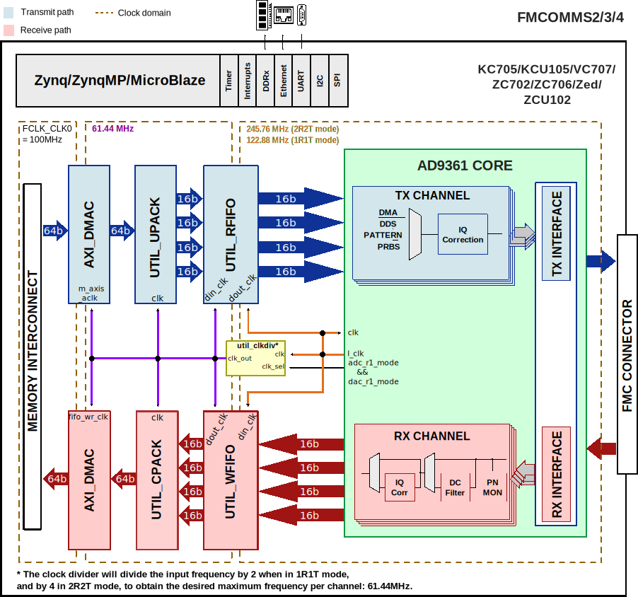

.. _fmcomms2:

FMCOMMS2/3/4 HDL Project
===============================================================================

Overview
-------------------------------------------------------------------------------

The AD-FMCOMMS2/3/4/5-EBZ are a high-speed analog modules designed to showcase
the :adi:`AD9361` or :adi:`AD9364`, a high performance, highly integrated RF
agile transceiver intended for use in RF applications.

.. tip::

   The :adi:`AD9361` consists of 2 receive and 2 transmit paths (2 Rx, 2 Tx).

   The only difference between :adi:`AD9361` and :adi:`AD9364` (1 Rx, 1 Tx) is
   the number of channels. Software, HDL, pinout, etc - is all the same.

The :adi:`AD9361` and :adi:`AD9364` chips operate in the 70MHz to 6GHz range,
covering most licensed and unlicensed bands. The boards, due to discrete
external components may have less performance on some of the RF input/output
connectors (for example - the :adi:`FMCOMMS2 <EVAL-AD-FMCOMMS2>` and specific
connectors on the :adi:`FMCOMMS5 <EVAL-AD-FMCOMMS5>` are specifically tuned
to 2.4GHz). The :adi:`AD9361` and :adi:`AD9364` both supports channel
bandwidths from less than 200kHz to 56MHz by both changing sample rate, and by
changing digital filters, and decimation inside the device itself.

The digital interface consists of 12 bits of DDR data and supports full duplex
operation in all configurations up to 2×2. The transmit and receive data paths
share a single clock. The data is sent or received based on the configuration
(programmable) from separate transmit and to separate receive chains.

Supported boards
-------------------------------------------------------------------------------

- :adi:`FMCOMMS2 <EVAL-AD-FMCOMMS2>`
- :adi:`FMCOMMS3 <EVAL-AD-FMCOMMS3>`
- :adi:`FMCOMMS4 <EVAL-AD-FMCOMMS4-EBZ>`

Supported devices
-------------------------------------------------------------------------------

- :adi:`AD9361`, in :adi:`FMCOMMS2 <EVAL-AD-FMCOMMS2>`,
  :adi:`FMCOMMS3 <EVAL-AD-FMCOMMS3>`
- :adi:`AD9364`, in :adi:`FMCOMMS4 <EVAL-AD-FMCOMMS4-EBZ>`

Supported carriers
-------------------------------------------------------------------------------

.. list-table::
   :widths: 35 35 30
   :header-rows: 1

   * - Evaluation board
     - Carrier
     - FMC slot
   * - FMCOMMS2/3/4
     - :xilinx:`KC705` *
     - FMC LPC
   * -
     - :xilinx:`KCU105`
     - FMC LPC
   * -
     - :xilinx:`VC707` *
     - FMC HPC1
   * -
     - :xilinx:`ZC702`
     - FMC LPC
   * -
     - :xilinx:`ZC706`
     - FMC LPC
   * -
     - :xilinx:`ZCU102`
     - FMC HPC0
   * -
     - `ZedBoard <https://digilent.com/shop/zedboard-zynq-7000-arm-fpga-soc-development-board>`__
     - FMC LPC

.. admonition:: Legend
   :class: note

   - ``*`` removed; last release that supports this project on this carrier is
     :git-hdl:`hdl_2023_r2 <hdl_2023_r2:projects/fmcomms2/kc705>`
     :git-hdl:`hdl_2023_r2 <hdl_2023_r2:projects/fmcomms2/vc707>`

Block design
-------------------------------------------------------------------------------

In the **receive** direction, each component of the delineated data is passed
to a PN monitor. The monitors validates the digital interface signal capture
and timing. The data then optionally DC-filtered, corrected for I/Q offset and
phase mismatches and is written to the external DDR memory via DMA.
An optional off-line FFT core may be used to generate a spectrum plot.

In the **transmit** direction, complex I and Q signals are generated for each
RF. The digital source could either be an internal DDS or from the external
DDR via VDMA. The internal DDS phase and frequency are programmable.

Block diagram
~~~~~~~~~~~~~~~~~~~~~~~~~~~~~~~~~~~~~~~~~~~~~~~~~~~~~~~~~~~~~~~~~~~~~~~~~~~~~~~

The data path and clock domains are depicted in the below diagram.

Clock scheme
~~~~~~~~~~~~~~~~~~~~~~~~~~~~~~~~~~~~~~~~~~~~~~~~~~~~~~~~~~~~~~~~~~~~~~~~~~~~~~~

The clocks are managed by the device and are software programmable. Please
refer to the device data sheet for the various clocks within the device.

The board provides a 40MHz crystal for the :adi:`AD9361`.

Please note that the clock divider module in this project does a divide-by 2
operation to get the desired clock for a single channel in case of mode 1R1T
(2x RF channels), and a divide-by 4 in case of 2R2T (4x RF channels).

.. image:: fmcomms234_clock_domains.svg
   :width: 1000
   :align: center
   :alt: FMCOMMS2/3/4 clock domains

Configuration modes
~~~~~~~~~~~~~~~~~~~~~~~~~~~~~~~~~~~~~~~~~~~~~~~~~~~~~~~~~~~~~~~~~~~~~~~~~~~~~~~

The :git-hdl:`AD9361 IP <library/axi_ad9361>` in this HDL project is configured
to work only in LVDS interface; it supports two configuration modes:

- 2R2T - 2x receive and 2x transmit RF channels
- 1R1T - 1x receive and 1x transmit RF channel

Both support only the **dual port half duplex** operating mode. The maximum
data rate (for combined I and Q words) is 61.44MSPS in DDR. For more details
about these modes, check the `AD9361 Reference Manual`_, Table 48 "Maximum Data
Rates and Signal Bandwidths".

CPU/Memory interconnects addresses
~~~~~~~~~~~~~~~~~~~~~~~~~~~~~~~~~~~~~~~~~~~~~~~~~~~~~~~~~~~~~~~~~~~~~~~~~~~~~~~

The addresses are dependent on the architecture of the FPGA, having an offset
added to the base address from HDL (see more at :ref:`architecture cpu-intercon-addr`).

================== =============== ===========
Instance           Zynq/Microblaze ZynqMP
================== =============== ===========
axi_ad9361_adc_dma 0x7C40_0000     0x9C40_0000
axi_ad9361_dac_dma 0x7C42_0000     0x9C42_0000
axi_ad9361         0x7902_0000     0x9902_0000
================== =============== ===========

SPI connections
~~~~~~~~~~~~~~~~~~~~~~~~~~~~~~~~~~~~~~~~~~~~~~~~~~~~~~~~~~~~~~~~~~~~~~~~~~~~~~~

The SPI signals are controlled by a separate AXI based SPI core.

.. list-table::
   :widths: 25 25 25 25
   :header-rows: 1

   * - SPI type
     - SPI manager instance
     - SPI subordinate
     - CS
   * - PS
     - SPI 0
     - AD9361
     - 0
   * - PMOD
     - SPI 1
     - spi_udc
     - 0

GPIOs
~~~~~~~~~~~~~~~~~~~~~~~~~~~~~~~~~~~~~~~~~~~~~~~~~~~~~~~~~~~~~~~~~~~~~~~~~~~~~~~

The device control and monitor signals are interfaced to a GPIO module.

.. list-table::
   :widths: 25 20 20 20 15
   :header-rows: 2

   * - GPIO signal
     - Direction
     - HDL GPIO EMIO
     - Software GPIO
     - Software GPIO
   * -
     - (from FPGA view)
     -
     - Zynq-7000
     - Zynq MP
   * - gpio_muxout_tx*
     - INOUT
     - 50
     - 104
     - 128
   * - gpio_muxout_rx*
     - INOUT
     - 49
     - 103
     - 127
   * - up_txnrx
     - IN
     - 48
     - 102
     - 126
   * - up_enable
     - IN
     - 47
     - 101
     - 125
   * - gpio_resetb
     - OUT
     - 46
     - 100
     - 124
   * - gpio_sync
     - OUT
     - 45
     - 99
     - 123
   * - gpio_en_agc
     - OUT
     - 44
     - 98
     - 122
   * - gpio_ctl[3:0]
     - OUT
     - 43:40
     - 97:94
     - 121:118
   * - gpio_status[7:0]
     - IN
     - 39:32
     - 93:86
     - 117:110

.. note::

  **\*** - used only in
  :git-hdl:`Zed <projects/fmcomms2/zed/system_top.v>` and
  :git-hdl:`ZC702 <projects/fmcomms2/zc702/system_top.v>` projects.

  ``gpio_muxout_tx`` is connected to PMOD JA1.3, used for LO PLL0 TX at ADF4351
  and ``gpio_muxout_rx`` is connected to PMOD JA1.9, used for LO PLL0 RX at
  ADF4351.

Interrupts
~~~~~~~~~~~~~~~~~~~~~~~~~~~~~~~~~~~~~~~~~~~~~~~~~~~~~~~~~~~~~~~~~~~~~~~~~~~~~~~

Below are the Programmable Logic interrupts used in the project.

=================== === ========== =========== ============ =============
Instance name       HDL Linux Zynq Actual Zynq Linux ZynqMP Actual ZynqMP
=================== === ========== =========== ============ =============
axi_ad9361_adc_dma  13  57         89          109          141
axi_ad9361_dac_dma  12  56         88          108          140
=================== === ========== =========== ============ =============

Building the HDL project
-------------------------------------------------------------------------------

The design is built upon ADI's generic HDL reference design framework.
ADI distributes the bit/elf files of these projects as part of the
:dokuwiki:`ADI Kuiper Linux <resources/tools-software/linux-software/kuiper-linux>`.
If you want to build the sources, ADI makes them available on the
:git-hdl:`HDL repository </>`. To get the source you must
`clone <https://git-scm.com/book/en/v2/Git-Basics-Getting-a-Git-Repository>`__
the HDL repository.

When building the project for FMCOMMS3/4, it is the same as for FMCOMMS2.
The only difference is in the Linux device tree, but in HDL there is no
difference. So go to the hdl/projects/**fmcomms2**/$carrier location and run the make
command.

**Linux/Cygwin/WSL**

.. shell::

   $cd hdl/projects/fmcomms2/zcu102
   $make

A more comprehensive build guide can be found in the :ref:`build_hdl` user guide.

Resources
-------------------------------------------------------------------------------

Systems related
~~~~~~~~~~~~~~~~~~~~~~~~~~~~~~~~~~~~~~~~~~~~~~~~~~~~~~~~~~~~~~~~~~~~~~~~~~~~~~~

Here you can find the quick start guides available for these evaluation boards:

- :dokuwiki:`ZC702/ZC706/Zed <resources/eval/user-guides/ad-fmcomms2-ebz/quickstart/zynq>`
- :dokuwiki:`ZCU102 <resources/eval/user-guides/ad-fmcomms2-ebz/quickstart/zynqmp>`
- :dokuwiki:`KC705/VC707 <resources/eval/user-guides/ad-fmcomms2-ebz/quickstart/microblaze>`

Other useful information:

- :dokuwiki:`[Wiki] FMCOMMS2 User Guide <resources/eval/user-guides/ad-fmcomms2-ebz>`
- :dokuwiki:`[Wiki] FMCOMMS2/3/4/5 basic IQ data files <resources/eval/user-guides/ad-fmcomms2-ebz/software/basic_iq_datafiles>`
- :dokuwiki:`[Wiki] FMCOMMS2/4/5 Specifications <resources/eval/user-guides/ad-fmcomms2-ebz/hardware/card_specification>`
- :dokuwiki:`[Wiki] Configuration options for AD9361/AD9364 <resources/eval/user-guides/ad-fmcomms2-ebz/hardware/configuration_options>`
- :dokuwiki:`[Wiki] AD9361 filter response <resources/eval/user-guides/ad-fmcomms2-ebz/software/baremetal-filter>`

Hardware related
~~~~~~~~~~~~~~~~~~~~~~~~~~~~~~~~~~~~~~~~~~~~~~~~~~~~~~~~~~~~~~~~~~~~~~~~~~~~~~~

- `AD9361 reference manual <https://ez.analog.com/cfs-file/__key/telligent-evolution-components-attachments/00-441-00-00-00-07-91-97/AD9361_5F00_Reference_5F00_Manual_5F00_UG_2D00_570.pdf>`__
- Product datasheets:

  - :adi:`AD9361`
  - :adi:`AD9364`

- :dokuwiki:`[Wiki] About AD9361/AD9363/AD9364 <resources/eval/user-guides/ad-fmcomms2-ebz/ad9361>`
- :dokuwiki:`[Wiki] About I/Q rotation <resources/eval/user-guides/ad-fmcomms2-ebz/iq_rotation>`
- :dokuwiki:`[Wiki] Configuration options for <resources/eval/user-guides/ad-fmcomms2-ebz/hardware/configuration_options>`
- :dokuwiki:`[Wiki] Tuning the AD9361/AD9364 <resources/eval/user-guides/ad-fmcomms2-ebz/hardware/tuning>`

HDL related
~~~~~~~~~~~~~~~~~~~~~~~~~~~~~~~~~~~~~~~~~~~~~~~~~~~~~~~~~~~~~~~~~~~~~~~~~~~~~~~

- :git-hdl:`FMCOMMS2/3/4 HDL project source code <projects/fmcomms2>`

.. list-table::
   :widths: 30 35 35
   :header-rows: 1

   * - IP name
     - Source code link
     - Documentation link
   * - AXI_AD9361
     - :git-hdl:`library/axi_ad9361`
     - :ref:`axi_ad9361`
   * - AXI_DMAC
     - :git-hdl:`library/axi_dmac`
     - :ref:`axi_dmac`
   * - AXI_SYSID
     - :git-hdl:`library/axi_sysid`
     - :ref:`axi_sysid`
   * - SYSID_ROM
     - :git-hdl:`library/sysid_rom`
     - :ref:`axi_sysid`
   * - UTIL_CPACK2
     - :git-hdl:`library/util_pack/util_cpack2`
     - :ref:`util_cpack2`
   * - UTIL_UPACK2
     - :git-hdl:`library/util_pack/util_upack2`
     - :ref:`util_upack2`
   * - UTIL_RFIFO
     - :git-hdl:`library/util_rfifo`
     - :ref:`util_rfifo`
   * - UTIL_WFIFO
     - :git-hdl:`library/util_wfifo`
     - :ref:`util_wfifo`
   * - UTIL_TDD_SYNC
     - :git-hdl:`library/util_tdd_sync`
     - ---
   * - UTIL_CLKDIV
     - :git-hdl:`library/xilinx/util_clkdiv`
     - ---

- :dokuwiki:`[Wiki] Integrate FIR filters into the FMCOMMS2 HDL design <resources/fpga/docs/hdl/fmcomms2_fir_filt>`
- :dokuwiki:`[Wiki] Partial reconfiguration with FMCOMMS2 <resources/fpga/docs/hdl/partial>`

Software related
~~~~~~~~~~~~~~~~~~~~~~~~~~~~~~~~~~~~~~~~~~~~~~~~~~~~~~~~~~~~~~~~~~~~~~~~~~~~~~~

.. collapsible:: Click here to see the list of Linux device trees available.

   - :git-linux:`FMCOMMS2/3 KC705 Linux device tree <arch/microblaze/boot/dts/kc705_fmcomms2-3.dts>`
   - :git-linux:`FMCOMMS2/3 VC707 Linux device tree <arch/microblaze/boot/dts/vc707_fmcomms2-3.dts>`
   - :git-linux:`FMCOMMS2/3 KCU105 Linux device tree <arch/microblaze/boot/dts/kcu105_fmcomms2-3.dts>`
   - :git-linux:`FMCOMMS2/3 ZedBoard Linux device tree <arch/arm/boot/dts/xilinx/zynq-zed-adv7511-ad9361-fmcomms2-3.dts>`
   - :git-linux:`FMCOMMS2/3 ZC702 Linux device tree <arch/arm/boot/dts/xilinx/zynq-zc702-adv7511-ad9361-fmcomms2-3.dts>`
   - :git-linux:`FMCOMMS2/3 ZC706 Linux device tree <arch/arm/boot/dts/xilinx/zynq-zc706-adv7511-ad9361-fmcomms2-3.dts>`
   - :git-linux:`FMCOMMS2/3 ZCU102 (rev10) Linux device tree <arch/arm64/boot/dts/xilinx/zynqmp-zcu102-rev10-ad9361-fmcomms2-3.dts>`
   - :git-linux:`FMCOMMS2/3 ZCU102 (revB) Linux device tree <arch/arm64/boot/dts/xilinx/zynqmp-zcu102-revB-ad9361-fmcomms2-3.dts>`
   - :git-linux:`FMCOMMS4 KC705 Linux device tree <arch/microblaze/boot/dts/kc705_fmcomms4.dts>`
   - :git-linux:`FMCOMMS4 VC707 Linux device tree <arch/microblaze/boot/dts/vc707_fmcomms4.dts>`
   - :git-linux:`FMCOMMS4 KCU105 Linux device tree <arch/microblaze/boot/dts/kcu105_fmcomms4.dts>`
   - :git-linux:`FMCOMMS4 ZedBoard Linux device tree <arch/arm/boot/dts/xilinx/zynq-zed-adv7511-ad9364-fmcomms4.dts>`
   - :git-linux:`FMCOMMS4 ZC702 Linux device tree <arch/arm/boot/dts/xilinx/zynq-zc702-adv7511-ad9364-fmcomms4.dts>`
   - :git-linux:`FMCOMMS4 ZC706 Linux device tree <arch/arm/boot/dts/xilinx/zynq-zc706-adv7511-ad9364-fmcomms4.dts>`
   - :git-linux:`FMCOMMS4 ZCU102 (revB) Linux device tree <arch/arm64/boot/dts/xilinx/zynqmp-zcu102-revB-ad9364-fmcomms4.dts>`
   - :git-linux:`FMCOMMS4 ZCU102 (rev10) Linux device tree <arch/arm64/boot/dts/xilinx/zynqmp-zcu102-rev10-ad9364-fmcomms4.dts>`

- :dokuwiki:`[Wiki] AD9361 no-OS software documentation <resources/eval/user-guides/ad-fmcomms2-ebz/software/baremetal>`
- :dokuwiki:`[Wiki] AD9361 Linux device driver documentation <resources/tools-software/linux-drivers/iio-transceiver/ad9361>`
- :dokuwiki:`[Wiki] FMCOMMS2/3/4/5 Linux support <resources/eval/user-guides/ad-fmcomms2-ebz/software/linux>`
- :dokuwiki:`[Wiki] AD936x IIO Oscilloscope plugin description <resources/tools-software/linux-software/fmcomms2_plugin>`

.. include:: ../common/more_information.rst

.. include:: ../common/support.rst

.. _AD9361 Reference Manual: https://ez.analog.com/cfs-file/__key/telligent-evolution-components-attachments/00-441-00-00-00-07-91-97/AD9361_5F00_Reference_5F00_Manual_5F00_UG_2D00_570.pdf
