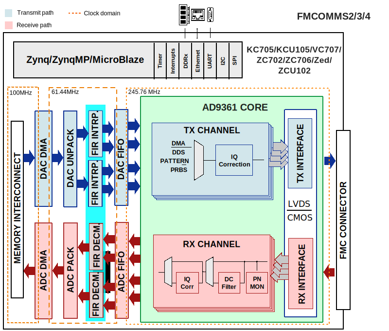

.. _fmcomms5:

FMCOMMS5 HDL Project
===============================================================================

Overview
-------------------------------------------------------------------------------

The digital interface consists of 12 bits of DDR data and supports full duplex
operation in all configurations up to 2×2. The transmit and receive data paths
share a single clock. The data is sent or received based on the configuration
(programmable) from separate transmit and to separate receive chains.

AD9361 features on receive path:

- Supports up to 2 direct conversion RF receive channels
- Fully integrated snythesizers (including loop filter)
- Data path consists of LNA, Demodulator, LPF, ADC and digital filters
- AGC, Quadrature calibration and DC offset calibration
- NF: 2.5dB @1GHz
- ADC: Continous time sigma-delta, 640MSPS
- Digital Filters: 128 complex taps, decimation between 2 and 48
- Gain: 1dB step size, 80dB analog range, 30dB digital range (post ADC scaling)
- On-chip sensor for temperature-corrected RSSI

AD9361 features on transmit path:

- Supports up to 2 direct conversion RF receive channels
- Fully integrated snythesizers (including loop filter)
- Data path consists of digital filters, DAC and Modulators
- Digital Filters: 128 complex taps, interpolation between 2 and 48
- Gain: 0.25dB step size, 86dB range.
- DAC: 320MSPS

Supported boards
-------------------------------------------------------------------------------

- :adi:`FMCOMMS5 <EVAL-AD-FMCOMMS5>`

Supported devices
-------------------------------------------------------------------------------

- :adi:`AD9361`

Supported carriers
-------------------------------------------------------------------------------

.. list-table::
   :widths: 35 35 30
   :header-rows: 1

   * - Evaluation board
     - Carrier
     - FMC slot
   * - FMCOMMS5
     - :xilinx:`ZC702`
     - FMC LPC
   * -
     - :xilinx:`ZC706`
     - FMC HPC
   * -
     - :xilinx:`ZCU102`
     - FMC HPC0

Block design
-------------------------------------------------------------------------------

In the **receive** direction, each component of the delineated data is passed
to a PN monitor. The monitors validates the digital interface signal capture
and timing. The data then optionally DC-filtered, corrected for I/Q offset and
phase mismatches and is written to the external DDR memory via DMA.
An optional off-line FFT core may be used to generate a spectrum plot.

In the **transmit** direction, complex I and Q signals are generated for each
RF. The digital source could either be an internal DDS or from the external
DDR via VDMA. The internal DDS phase and frequency are programmable.

Multi-cores operation
~~~~~~~~~~~~~~~~~~~~~~~~~~~~~~~~~~~~~~~~~~~~~~~~~~~~~~~~~~~~~~~~~~~~~~~~~~~~~~~

The core supports multiple instances of the same synchronized to a common
clock. The :adi:`FMCOMMS5 <EVAL-AD-FMCOMMS5>` uses two instances of this
core synchronized to a common clock. The data is recovered in each individual
clock domain and transfers the data to a single clock domain. The multiple
cores must all be using the same clock.

Block diagram
~~~~~~~~~~~~~~~~~~~~~~~~~~~~~~~~~~~~~~~~~~~~~~~~~~~~~~~~~~~~~~~~~~~~~~~~~~~~~~~

The data path and clock domains are depicted in the below diagrams.

Clock scheme
~~~~~~~~~~~~~~~~~~~~~~~~~~~~~~~~~~~~~~~~~~~~~~~~~~~~~~~~~~~~~~~~~~~~~~~~~~~~~~~

The clocks are managed by the device and are software programmable. Please
refer to the device data sheet for the various clocks within the device.

The board provides a 40MHz crystal for the :adi:`AD9361`.

CPU/Memory interconnects addresses
~~~~~~~~~~~~~~~~~~~~~~~~~~~~~~~~~~~~~~~~~~~~~~~~~~~~~~~~~~~~~~~~~~~~~~~~~~~~~~~

The addresses are dependent on the architecture of the FPGA, having an offset
added to the base address from HDL (see more at :ref:`architecture cpu-intercon-addr`).

================== =============== ===========
Instance           Zynq/Microblaze ZynqMP
================== =============== ===========
axi_ad9361_adc_dma 0x7C40_0000     0x9C40_0000
axi_ad9361_dac_dma 0x7C42_0000     0x9C42_0000
axi_ad9361_0       0x7902_0000     0x9902_0000
axi_ad9361_1       0x7904_0000     0x9904_0000
================== =============== ===========

SPI connections
~~~~~~~~~~~~~~~~~~~~~~~~~~~~~~~~~~~~~~~~~~~~~~~~~~~~~~~~~~~~~~~~~~~~~~~~~~~~~~~

The SPI signals are controlled by a separate AXI based SPI core.

.. list-table::
   :widths: 25 25 25 25
   :header-rows: 1

   * - SPI type
     - SPI manager instance
     - SPI subordinate
     - CS
   * - PS
     - SPI 0
     - first AD9361 instance
     - 0
   * - PS
     - SPI 1
     - second AD9361 instance
     - 0

GPIOs
~~~~~~~~~~~~~~~~~~~~~~~~~~~~~~~~~~~~~~~~~~~~~~~~~~~~~~~~~~~~~~~~~~~~~~~~~~~~~~~

The device control and monitor signals are interfaced to a GPIO module.

.. list-table::
   :widths: 25 20 20 20 15
   :header-rows: 2

   * - GPIO signal
     - Direction
     - HDL GPIO EMIO
     - Software GPIO
     - Software GPIO
   * -
     - (from FPGA view)
     -
     - Zynq-7000
     - Zynq MP
   * - gpio_muxout_tx*
     - INOUT
     - 50
     - 104
     - 128
   * - gpio_muxout_rx*
     - INOUT
     - 49
     - 103
     - 127
   * - up_txnrx
     - IN
     - 48
     - 102
     - 126
   * - up_enable
     - IN
     - 47
     - 101
     - 125
   * - gpio_resetb
     - OUT
     - 46
     - 100
     - 124
   * - gpio_sync
     - OUT
     - 45
     - 99
     - 123
   * - gpio_en_agc
     - OUT
     - 44
     - 98
     - 122
   * - gpio_ctl[3:0]
     - OUT
     - 43:40
     - 97:94
     - 121:118
   * - gpio_status[7:0]
     - IN
     - 39:32
     - 93:86
     - 117:110

.. note::

  **\*** - used only in
  :git-hdl:`Zed <projects/fmcomms2/zed/system_top.v>` and
  :git-hdl:`ZC702 <projects/fmcomms2/zc702/system_top.v>` projects.

  ``gpio_muxout_tx`` is connected to PMOD JA1.3, used for LO PLL0 TX at ADF4351
  and ``gpio_muxout_rx`` is connected to PMOD JA1.9, used for LO PLL0 RX at
  ADF4351.

Interrupts
~~~~~~~~~~~~~~~~~~~~~~~~~~~~~~~~~~~~~~~~~~~~~~~~~~~~~~~~~~~~~~~~~~~~~~~~~~~~~~~

Below are the Programmable Logic interrupts used in the project.

=================== === ========== =========== ============ =============
Instance name       HDL Linux Zynq Actual Zynq Linux ZynqMP Actual ZynqMP
=================== === ========== =========== ============ =============
axi_ad9361_adc_dma  13  57         89          109          141
axi_ad9361_dac_dma  12  56         88          108          140
=================== === ========== =========== ============ =============

Building the HDL project
-------------------------------------------------------------------------------

The design is built upon ADI's generic HDL reference design framework.
ADI distributes the bit/elf files of these projects as part of the
:dokuwiki:`ADI Kuiper Linux <resources/tools-software/linux-software/kuiper-linux>`.
If you want to build the sources, ADI makes them available on the
:git-hdl:`HDL repository </>`. To get the source you must
`clone <https://git-scm.com/book/en/v2/Git-Basics-Getting-a-Git-Repository>`__
the HDL repository.

Go to the hdl/projects/**fmcomms5**/$carrier location and run the make
command.

**Linux/Cygwin/WSL**

.. shell::

   $cd hdl/projects/fmcomms5/zc706
   $make

A more comprehensive build guide can be found in the :ref:`build_hdl` user guide.

Resources
-------------------------------------------------------------------------------

Systems related
~~~~~~~~~~~~~~~~~~~~~~~~~~~~~~~~~~~~~~~~~~~~~~~~~~~~~~~~~~~~~~~~~~~~~~~~~~~~~~~

Here you can find the quick start guides available for these evaluation boards:

- :dokuwiki:`ZC702/ZC706/Zed <resources/eval/user-guides/ad-fmcomms2-ebz/quickstart/zynq>`
- :dokuwiki:`ZCU102 <resources/eval/user-guides/ad-fmcomms2-ebz/quickstart/zynqmp>`
- :dokuwiki:`KC705/VC707 <resources/eval/user-guides/ad-fmcomms2-ebz/quickstart/microblaze>`

Other useful information:

- :dokuwiki:`[Wiki] FMCOMMS2 User Guide <resources/eval/user-guides/ad-fmcomms2-ebz>`
- :dokuwiki:`[Wiki] FMCOMMS2/3/4/5 basic IQ data files <resources/eval/user-guides/ad-fmcomms2-ebz/software/basic_iq_datafiles>`
- :dokuwiki:`[Wiki] FMCOMMS2/4/5 Specifications <resources/eval/user-guides/ad-fmcomms2-ebz/hardware/card_specification>`
- :dokuwiki:`[Wiki] Configuration options for AD9361/AD9364 <resources/eval/user-guides/ad-fmcomms2-ebz/hardware/configuration_options>`
- :dokuwiki:`[Wiki] AD9361 filter response <resources/eval/user-guides/ad-fmcomms2-ebz/software/baremetal-filter>`

Hardware related
~~~~~~~~~~~~~~~~~~~~~~~~~~~~~~~~~~~~~~~~~~~~~~~~~~~~~~~~~~~~~~~~~~~~~~~~~~~~~~~

- `AD9361 reference manual <https://ez.analog.com/cfs-file/__key/telligent-evolution-components-attachments/00-441-00-00-00-07-91-97/AD9361_5F00_Reference_5F00_Manual_5F00_UG_2D00_570.pdf>`__
- Product datasheet: :adi:`AD9361`

- :dokuwiki:`[Wiki] About AD9361/AD9363/AD9364 <resources/eval/user-guides/ad-fmcomms2-ebz/ad9361>`
- :dokuwiki:`[Wiki] About I/Q rotation <resources/eval/user-guides/ad-fmcomms2-ebz/iq_rotation>`
- :dokuwiki:`[Wiki] Configuration options for <resources/eval/user-guides/ad-fmcomms2-ebz/hardware/configuration_options>`
- :dokuwiki:`[Wiki] Tuning the AD9361/AD9364 <resources/eval/user-guides/ad-fmcomms2-ebz/hardware/tuning>`

HDL related
~~~~~~~~~~~~~~~~~~~~~~~~~~~~~~~~~~~~~~~~~~~~~~~~~~~~~~~~~~~~~~~~~~~~~~~~~~~~~~~

- :git-hdl:`FMCOMMS5 HDL project source code <projects/fmcomms5>`

.. list-table::
   :widths: 30 35 35
   :header-rows: 1

   * - IP name
     - Source code link
     - Documentation link
   * - AXI_AD9361
     - :git-hdl:`library/axi_ad9361`
     - :ref:`axi_ad9361`
   * - AXI_DMAC
     - :git-hdl:`library/axi_dmac`
     - :ref:`axi_dmac`
   * - AXI_SYSID
     - :git-hdl:`library/axi_sysid`
     - :ref:`axi_sysid`
   * - SYSID_ROM
     - :git-hdl:`library/sysid_rom`
     - :ref:`axi_sysid`
   * - UTIL_CPACK2
     - :git-hdl:`library/util_pack/util_cpack2`
     - :ref:`util_cpack2`
   * - UTIL_UPACK2
     - :git-hdl:`library/util_pack/util_upack2`
     - :ref:`util_upack2`
   * - UTIL_RFIFO
     - :git-hdl:`library/util_rfifo`
     - :ref:`util_rfifo`
   * - UTIL_WFIFO
     - :git-hdl:`library/util_wfifo`
     - :ref:`util_wfifo`
   * - UTIL_TDD_SYNC
     - :git-hdl:`library/util_tdd_sync`
     - ---
   * - UTIL_CLKDIV
     - :git-hdl:`library/xilinx/util_clkdiv`
     - ---

- :dokuwiki:`[Wiki] Integrate FIR filters into the FMCOMMS2 HDL design <resources/fpga/docs/hdl/fmcomms2_fir_filt>`
- :dokuwiki:`[Wiki] Partial reconfiguration with FMCOMMS2 <resources/fpga/docs/hdl/partial>`

Software related
~~~~~~~~~~~~~~~~~~~~~~~~~~~~~~~~~~~~~~~~~~~~~~~~~~~~~~~~~~~~~~~~~~~~~~~~~~~~~~~

.. collapsible:: Click here to see the list of Linux device trees available.

   - :git-linux:`FMCOMMS5 ZC702 Linux device tree <arch/arm/boot/dts/xilinx/zynq-zc702-adv7511-ad9361-fmcomms5.dts>`
   - :git-linux:`FMCOMMS5 ZC706 Linux device tree <arch/arm/boot/dts/xilinx/zynq-zc706-adv7511-ad9361-fmcomms5.dts>`
   - :git-linux:`FMCOMMS5 ZC706 with ext. LO ADF4355Linux device tree <arch/arm/boot/dts/xilinx/zynq-zc706-adv7511-ad9361-fmcomms5-ext-lo-adf5355.dts>`
   - :git-linux:`FMCOMMS5 ZCU102 Linux device tree <arch/arm64/boot/dts/xilinx/zynqmp-zcu102-rev10-ad9361-fmcomms5.dts>`
   - :git-linux:`FMCOMMS5 ZCU102 with ext. LO ADF4355 Linux device tree <arch/arm64/boot/dts/xilinx/zynqmp-zcu102-rev10-ad9361-fmcomms5-ext-lo-adf5355.dts>`

- :dokuwiki:`[Wiki] AD9361 no-OS software documentation <resources/eval/user-guides/ad-fmcomms2-ebz/software/baremetal>`
- :dokuwiki:`[Wiki] AD9361 Linux device driver documentation <resources/tools-software/linux-drivers/iio-transceiver/ad9361>`
- :dokuwiki:`[Wiki] FMCOMMS2/3/4/5 Linux support <resources/eval/user-guides/ad-fmcomms2-ebz/software/linux>`
- :dokuwiki:`[Wiki] AD936x IIO Oscilloscope plugin description <resources/tools-software/linux-software/fmcomms2_plugin>`

.. include:: ../common/more_information.rst

.. include:: ../common/support.rst
