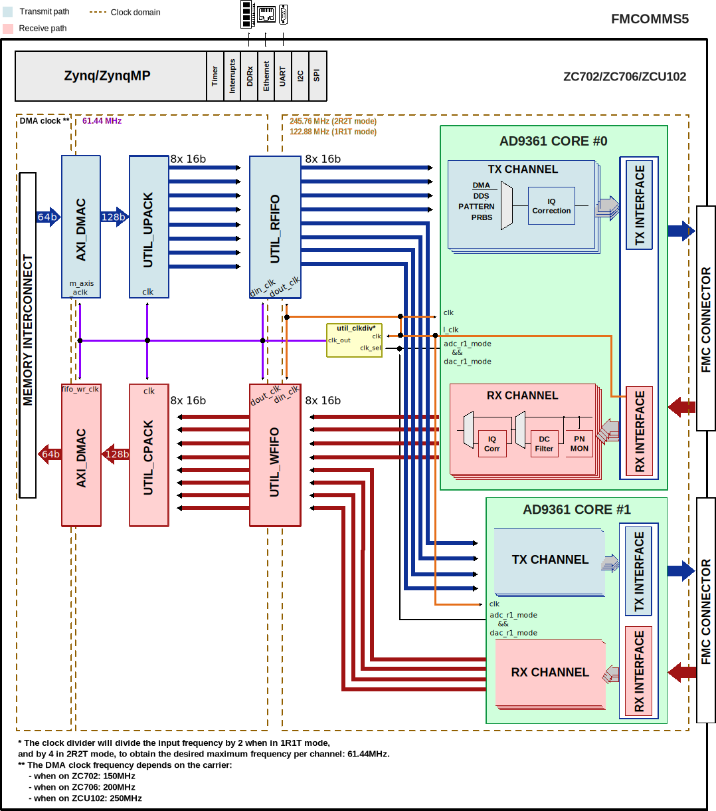

.. _fmcomms5:

FMCOMMS5 HDL Project
===============================================================================

Overview
-------------------------------------------------------------------------------

The :adi:`FMCOMMS5 <EVAL-AD-FMCOMMS5>` is a high-speed analog module designed
to showcase the :adi:`AD9361` in multiple-input, multiple-output (MIMO)
applications. The :adi:`AD9361`  is a high performance, highly integrated RF
transceiver that operates from 70 MHz to 6 GHz, and supports bandwidths from
less than 200 kHz to 56 MHz. The :adi:`FMCOMMS5 <EVAL-AD-FMCOMMS5>` supports
dual :adi:`AD9361` devices, allowing for the creation of a 4x4 MIMO system.
This platform is intended to enable the prototyping and development of many
software defined radio applications.

The :adi:`AD9361` consists of 2 receive and 2 transmit paths (2 Rx, 2 Tx).

The only difference between :adi:`AD9361` and :adi:`AD9364` (1 Rx, 1 Tx) is
the number of channels. Software, HDL, pinout, etc - is all the same.

The digital interface consists of 12 bits of DDR data and supports full duplex
operation in all configurations up to 4x4. The transmit and receive data paths
share a single clock. The data is sent or received based on the configuration
(programmable) from separate transmit and to separate receive chains.

Supported boards
-------------------------------------------------------------------------------

- :adi:`FMCOMMS5 <EVAL-AD-FMCOMMS5>`

Supported devices
-------------------------------------------------------------------------------

- :adi:`AD9361`

Supported carriers
-------------------------------------------------------------------------------

.. list-table::
   :widths: 35 35 30
   :header-rows: 1

   * - Evaluation board
     - Carrier
     - FMC slot
   * - FMCOMMS5
     - :xilinx:`ZC702`
     - On both FMC connectors
   * -
     - :xilinx:`ZC706`
     - On both FMC connectors
   * -
     - :xilinx:`ZCU102`
     - On both FMC connectors

Block design
-------------------------------------------------------------------------------

In the **receive** direction, each component of the delineated data is passed
to a PN monitor. The monitors validates the digital interface signal capture
and timing. The data then optionally DC-filtered, corrected for I/Q offset and
phase mismatches and is written to the external DDR memory via DMA.
An optional off-line FFT core may be used to generate a spectrum plot.

In the **transmit** direction, complex I and Q signals are generated for each
RF. The digital source could either be an internal DDS or from the external
DDR via VDMA. The internal DDS phase and frequency are programmable.

Multi-cores operation
~~~~~~~~~~~~~~~~~~~~~~~~~~~~~~~~~~~~~~~~~~~~~~~~~~~~~~~~~~~~~~~~~~~~~~~~~~~~~~~

The core supports multiple instances of the same synchronized to a common
clock. The :adi:`FMCOMMS5 <EVAL-AD-FMCOMMS5>` uses two instances of this
core synchronized to a common clock. The data is recovered in each individual
clock domain and transfers the data to a single clock domain. The multiple
cores must all be using the same clock.

Block diagram
~~~~~~~~~~~~~~~~~~~~~~~~~~~~~~~~~~~~~~~~~~~~~~~~~~~~~~~~~~~~~~~~~~~~~~~~~~~~~~~

The data path and clock domains are depicted in the below diagram.

Clock scheme
~~~~~~~~~~~~~~~~~~~~~~~~~~~~~~~~~~~~~~~~~~~~~~~~~~~~~~~~~~~~~~~~~~~~~~~~~~~~~~~

The clocks are managed by the device and are software programmable. Please
refer to the device data sheet for the various clocks within the device.

The board provides a 40MHz crystal for the :adi:`AD9361`.

The clock divider module will divide the input frequency by 2 when in 1R1T mode,
and by 4 in 2R2T mode, to obtain the desired maximum frequency per channel:
61.44MHz.

The DMA clock frequency depends on the carrier:

- when on ZC702: 150MHz
- when on ZC706: 200MHz
- when on ZCU102: 250MHz

Configuration modes
~~~~~~~~~~~~~~~~~~~~~~~~~~~~~~~~~~~~~~~~~~~~~~~~~~~~~~~~~~~~~~~~~~~~~~~~~~~~~~~

The :git-hdl:`AD9361 IP <library/axi_ad9361>` in this HDL project is configured
to work only in LVDS interface; it supports two configuration modes:

- 2R2T - 2x receive and 2x transmit RF channels
- 1R1T - 1x receive and 1x transmit RF channel

Both support only the **dual port half duplex** operating mode. The maximum
data rate (for combined I and Q words) is 61.44MSPS in DDR. For more details
about these modes, check the `AD9361 Reference Manual`_, Table 48 "Maximum Data
Rates and Signal Bandwidths".

CPU/Memory interconnects addresses
~~~~~~~~~~~~~~~~~~~~~~~~~~~~~~~~~~~~~~~~~~~~~~~~~~~~~~~~~~~~~~~~~~~~~~~~~~~~~~~

The addresses are dependent on the architecture of the FPGA, having an offset
added to the base address from HDL (see more at :ref:`architecture cpu-intercon-addr`).

================== =============== ===========
Instance           Zynq/Microblaze ZynqMP
================== =============== ===========
axi_ad9361_adc_dma 0x7C40_0000     0x9C40_0000
axi_ad9361_dac_dma 0x7C42_0000     0x9C42_0000
axi_ad9361_0       0x7902_0000     0x9902_0000
axi_ad9361_1       0x7904_0000     0x9904_0000
================== =============== ===========

SPI connections
~~~~~~~~~~~~~~~~~~~~~~~~~~~~~~~~~~~~~~~~~~~~~~~~~~~~~~~~~~~~~~~~~~~~~~~~~~~~~~~

The SPI signals are controlled by a separate AXI based SPI core.

.. list-table::
   :widths: 25 25 25 25
   :header-rows: 1

   * - SPI type
     - SPI manager instance
     - SPI subordinate
     - CS
   * - PS
     - SPI 0
     - first AD9361 instance
     - 0
   * - PS
     - SPI 0
     - second AD9361 instance
     - 1
   * - PS
     - SPI 0
     - AD5355
     - 2

GPIOs
~~~~~~~~~~~~~~~~~~~~~~~~~~~~~~~~~~~~~~~~~~~~~~~~~~~~~~~~~~~~~~~~~~~~~~~~~~~~~~~

The device control and monitor signals are interfaced to a GPIO module.

ZC706
^^^^^^^^^^^^^^^^^^^^^^^^^^^^^^^^^^^^^^^^^^^^^^^^^^^^^^^^^^^^^^^^^^^^^^^^^^^^^^^

================ ========= ============= =============
GPIO signal      Direction HDL GPIO EMIO Zynq-700 GPIO
================ ========= ============= =============
gpio_resetb_1    INOUT     59            113
gpio_ad5355_lock INOUT     58            112
gpio_ad5355_rfen INOUT     57            111
gpio_calsw_4_1   INOUT     56            110
gpio_calsw_3_1   INOUT     55            109
gpio_calsw_2_1   INOUT     54            108
gpio_calsw_1_1   INOUT     53            107
gpio_txnrx_1     OUT       52            106
gpio_enable_1    OUT       51            105
gpio_en_agc_1    INOUT     50            104
gpio_txnrx_0     INOUT     49            103
gpio_enable_0    INOUT     48            102
gpio_en_agc_0    INOUT     47            101
gpio_resetb_0    OUT       46            100
gpio_debug_4_1   INOUT     43            97
gpio_debug_3_1   INOUT     42            96
gpio_debug_2_1   INOUT     41            95
gpio_debug_1_1   INOUT     40            94
gpio_ctl_0[3:0]  INOUT     39:36         93:90
gpio_ctl_1[3:0]  INOUT     35:32         89:86
================ ========= ============= =============

ZCU102
^^^^^^^^^^^^^^^^^^^^^^^^^^^^^^^^^^^^^^^^^^^^^^^^^^^^^^^^^^^^^^^^^^^^^^^^^^^^^^^

================ ========= ============= ============
GPIO signal      Direction HDL GPIO EMIO Zynq MP GPIO
================ ========= ============= ============
gpio_resetb_1    OUT       65            143
gpio_ad5355_lock IN        64            142
gpio_ad5355_rfen OUT       63            141
gpio_calsw_4_1   OUT       62            140
gpio_calsw_3_1   OUT       61            139
gpio_calsw_2_0   OUT       60            138
gpio_calsw_1_0   OUT       59            137
gpio_txnrx_1     OUT       58            136
gpio_enable_1    OUT       57            135
gpio_en_agc_1    OUT       56            134
gpio_txnrx_0     OUT       55            133
gpio_enable_0    OUT       54            132
gpio_en_agc_0    OUT       53            131
gpio_resetb_0    OUT       52            130
gpio_sync        OUT       51            129
gpio_debug_4_0   OUT       49            127
gpio_debug_3_0   OUT       48            126
gpio_debug_2_0   OUT       47            125
gpio_debug_1_0   OUT       46            124
gpio_ctl_1       OUT       45:42         123:120
gpio_ctl_0       OUT       41:38         119:116
gpio_status_1    IN        37:30         115:108
================ ========= ============= ============

Interrupts
~~~~~~~~~~~~~~~~~~~~~~~~~~~~~~~~~~~~~~~~~~~~~~~~~~~~~~~~~~~~~~~~~~~~~~~~~~~~~~~

Below are the Programmable Logic interrupts used in the project.

=================== === ========== =========== ============ =============
Instance name       HDL Linux Zynq Actual Zynq Linux ZynqMP Actual ZynqMP
=================== === ========== =========== ============ =============
axi_ad9361_adc_dma  13  57         89          109          141
axi_ad9361_dac_dma  12  56         88          108          140
=================== === ========== =========== ============ =============

Building the HDL project
-------------------------------------------------------------------------------

The design is built upon ADI's generic HDL reference design framework.
ADI distributes the bit/elf files of these projects as part of the
:dokuwiki:`ADI Kuiper Linux <resources/tools-software/linux-software/kuiper-linux>`.
If you want to build the sources, ADI makes them available on the
:git-hdl:`HDL repository </>`. To get the source you must
`clone <https://git-scm.com/book/en/v2/Git-Basics-Getting-a-Git-Repository>`__
the HDL repository.

Go to the hdl/projects/**fmcomms5**/$carrier location and run the make
command.

**Linux/Cygwin/WSL**

.. shell::

   $cd hdl/projects/fmcomms5/zc706
   $make

A more comprehensive build guide can be found in the :ref:`build_hdl` user guide.

Resources
-------------------------------------------------------------------------------

Systems related
~~~~~~~~~~~~~~~~~~~~~~~~~~~~~~~~~~~~~~~~~~~~~~~~~~~~~~~~~~~~~~~~~~~~~~~~~~~~~~~

Here you can find the quick start guides available for these evaluation boards:

- :dokuwiki:`ZC702/ZC706/Zed <resources/eval/user-guides/ad-fmcomms2-ebz/quickstart/zynq>`
- :dokuwiki:`ZCU102 <resources/eval/user-guides/ad-fmcomms2-ebz/quickstart/zynqmp>`
- :dokuwiki:`KC705/VC707 <resources/eval/user-guides/ad-fmcomms2-ebz/quickstart/microblaze>`

Other useful information:

- :dokuwiki:`[Wiki] FMCOMMS5 User Guide <resources/eval/user-guides/ad-fmcomms5-ebz>`
- :dokuwiki:`[Wiki] FMCOMMS2/3/4/5 basic IQ data files <resources/eval/user-guides/ad-fmcomms2-ebz/software/basic_iq_datafiles>`
- :dokuwiki:`[Wiki] FMCOMMS2/4/5 Specifications <resources/eval/user-guides/ad-fmcomms2-ebz/hardware/card_specification>`
- :dokuwiki:`[Wiki] Configuration options for AD9361/AD9364 <resources/eval/user-guides/ad-fmcomms2-ebz/hardware/configuration_options>`
- :dokuwiki:`[Wiki] AD9361 filter response <resources/eval/user-guides/ad-fmcomms2-ebz/software/baremetal-filter>`

Hardware related
~~~~~~~~~~~~~~~~~~~~~~~~~~~~~~~~~~~~~~~~~~~~~~~~~~~~~~~~~~~~~~~~~~~~~~~~~~~~~~~

- `AD9361 reference manual <https://ez.analog.com/cfs-file/__key/telligent-evolution-components-attachments/00-441-00-00-00-07-91-97/AD9361_5F00_Reference_5F00_Manual_5F00_UG_2D00_570.pdf>`__
- Product datasheet: :adi:`AD9361`

- :dokuwiki:`[Wiki] About AD9361/AD9363/AD9364 <resources/eval/user-guides/ad-fmcomms2-ebz/ad9361>`
- :dokuwiki:`[Wiki] About I/Q rotation <resources/eval/user-guides/ad-fmcomms2-ebz/iq_rotation>`
- :dokuwiki:`[Wiki] Configuration options for <resources/eval/user-guides/ad-fmcomms2-ebz/hardware/configuration_options>`
- :dokuwiki:`[Wiki] Tuning the AD9361/AD9364 <resources/eval/user-guides/ad-fmcomms2-ebz/hardware/tuning>`

HDL related
~~~~~~~~~~~~~~~~~~~~~~~~~~~~~~~~~~~~~~~~~~~~~~~~~~~~~~~~~~~~~~~~~~~~~~~~~~~~~~~

- :git-hdl:`FMCOMMS5 HDL project source code <projects/fmcomms5>`

.. list-table::
   :widths: 30 35 35
   :header-rows: 1

   * - IP name
     - Source code link
     - Documentation link
   * - AXI_AD9361
     - :git-hdl:`library/axi_ad9361`
     - :ref:`axi_ad9361`
   * - AXI_DMAC
     - :git-hdl:`library/axi_dmac`
     - :ref:`axi_dmac`
   * - AXI_SYSID
     - :git-hdl:`library/axi_sysid`
     - :ref:`axi_sysid`
   * - SYSID_ROM
     - :git-hdl:`library/sysid_rom`
     - :ref:`axi_sysid`
   * - UTIL_CPACK2
     - :git-hdl:`library/util_pack/util_cpack2`
     - :ref:`util_cpack2`
   * - UTIL_UPACK2
     - :git-hdl:`library/util_pack/util_upack2`
     - :ref:`util_upack2`
   * - UTIL_RFIFO
     - :git-hdl:`library/util_rfifo`
     - :ref:`util_rfifo`
   * - UTIL_WFIFO
     - :git-hdl:`library/util_wfifo`
     - :ref:`util_wfifo`
   * - UTIL_TDD_SYNC
     - :git-hdl:`library/util_tdd_sync`
     - ---
   * - UTIL_CLKDIV
     - :git-hdl:`library/xilinx/util_clkdiv`
     - ---

- :dokuwiki:`[Wiki] Integrate FIR filters into the FMCOMMS2 HDL design <resources/fpga/docs/hdl/fmcomms2_fir_filt>`
- :dokuwiki:`[Wiki] Partial reconfiguration with FMCOMMS2 <resources/fpga/docs/hdl/partial>`

Software related
~~~~~~~~~~~~~~~~~~~~~~~~~~~~~~~~~~~~~~~~~~~~~~~~~~~~~~~~~~~~~~~~~~~~~~~~~~~~~~~

.. collapsible:: Click here to see the list of Linux device trees available.

   - :git-linux:`FMCOMMS5 ZC702 Linux device tree <arch/arm/boot/dts/xilinx/zynq-zc702-adv7511-ad9361-fmcomms5.dts>`
   - :git-linux:`FMCOMMS5 ZC706 Linux device tree <arch/arm/boot/dts/xilinx/zynq-zc706-adv7511-ad9361-fmcomms5.dts>`
   - :git-linux:`FMCOMMS5 ZC706 with ext. LO ADF4355Linux device tree <arch/arm/boot/dts/xilinx/zynq-zc706-adv7511-ad9361-fmcomms5-ext-lo-adf5355.dts>`
   - :git-linux:`FMCOMMS5 ZCU102 Linux device tree <arch/arm64/boot/dts/xilinx/zynqmp-zcu102-rev10-ad9361-fmcomms5.dts>`
   - :git-linux:`FMCOMMS5 ZCU102 with ext. LO ADF4355 Linux device tree <arch/arm64/boot/dts/xilinx/zynqmp-zcu102-rev10-ad9361-fmcomms5-ext-lo-adf5355.dts>`

- :dokuwiki:`[Wiki] AD9361 no-OS software documentation <resources/eval/user-guides/ad-fmcomms2-ebz/software/baremetal>`
- :dokuwiki:`[Wiki] AD9361 Linux device driver documentation <resources/tools-software/linux-drivers/iio-transceiver/ad9361>`
- :dokuwiki:`[Wiki] FMCOMMS2/3/4/5 Linux support <resources/eval/user-guides/ad-fmcomms2-ebz/software/linux>`
- :dokuwiki:`[Wiki] AD936x IIO Oscilloscope plugin description <resources/tools-software/linux-software/fmcomms2_plugin>`

.. include:: ../common/more_information.rst

.. include:: ../common/support.rst

.. _AD9361 Reference Manual: https://ez.analog.com/cfs-file/__key/telligent-evolution-components-attachments/00-441-00-00-00-07-91-97/AD9361_5F00_Reference_5F00_Manual_5F00_UG_2D00_570.pdf
