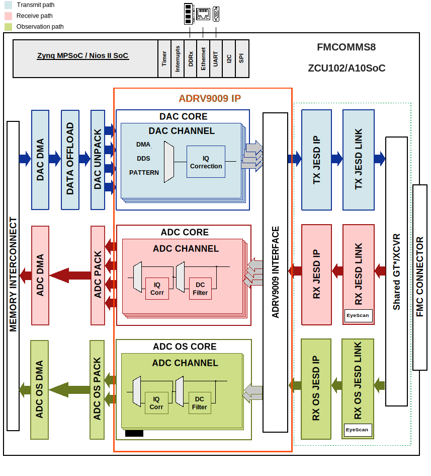

.. _fmcomms8:

FMCOMMS8 HDL reference design
===============================================================================

The HDL reference design is an embedded system built around a processor core
either ARM, NIOS-II or Microblaze. A functional block diagram of the system
is shown below. The two :adi:`ADRV9009's <ADRV9009>` digital interface is handled by the
transceiver IP followed by the JESD204B and device specific cores. The JESD204B
lanes are shared among the 8 transmit, 4 receive and 4 observation/sniffer
receive data paths by the same set of transceivers within the IP. The cores
are programmable through an AXI-lite interface. The delineated data is then
passed on to independent DMA cores for the transmit, receive and
observation/sniffer paths.

Supported boards
-------------------------------------------------------------------------------

- :adi:`AD-FMCOMMS8-EBZ <EVAL-AD-FMCOMMS8-EBZ>`

Supported devices
-------------------------------------------------------------------------------

- :adi:`ADRV9009`

Supported carriers
-------------------------------------------------------------------------------

.. list-table::
   :widths: 35 35 30
   :header-rows: 1

   * - Evaluation board
     - Carrier
     - FMC slot
   * - :adi:`AD-FMCOMMS8-EBZ`
     - :intel:`A10SoC <content/www/us/en/products/details/fpga/development-kits/arria/10-sx.html>`
     - FMCA
   * -
     - :xilinx:`ZCU102`
     - FMC HPC0

Block design
-------------------------------------------------------------------------------

Block diagram
~~~~~~~~~~~~~~~~~~~~~~~~~~~~~~~~~~~~~~~~~~~~~~~~~~~~~~~~~~~~~~~~~~~~~~~~~~~~~~~

The data path and clock domains are depicted in the below diagrams:

Example block design for Single link; M=8; L=8
^^^^^^^^^^^^^^^^^^^^^^^^^^^^^^^^^^^^^^^^^^^^^^^^^^^^^^^^^^^^^^^^^^^^^^^^^^^^^^^

The Rx links (ADC Path) operate with the following parameters:

- Rx Deframer parameters: L=4, M=8, F=4, S=1, NP=16, N=16
- Sample Rate: 245.76 MSPS
- Dual link: No
- RX_DEVICE_CLK: 245.76 MHz (Lane Rate/40)
- REF_CLK: 245.76 MHz (Lane Rate/40)
- JESD204B Lane Rate: 9.83 Gbps
- QPLL0 or CPLL

The ORx links (ADC Path) operate with the following parameters:

- ORx Deframer parameters: L=4, M=4, F=2, S=1, NP=16, N=16
- Sample Rate: 491.52 MSPS
- Dual link: No
- ORX_DEVICE_CLK: 245.76 MHz (Lane Rate/40)
- REF_CLK: 245.76 MHz (Lane Rate/40)
- JESD204B Lane Rate: 9.83 Gbps
- QPLL0 or CPLL

The Tx links (DAC Path) operate with the following parameters:

- Tx Framer parameters: L=8, M=8, F=4, S=1, NP=16, N=16
- Sample Rate: 491.52 MSPS
- Dual link: No
- TX_DEVICE_CLK: 245.76 MHz (Lane Rate/40)
- REF_CLK: 245.76 MHz (Lane Rate/40)
- JESD204B Lane Rate: 9.83 Gbps
- QPLL0 or CPLL

Digital Interface
~~~~~~~~~~~~~~~~~~~~~~~~~~~~~~~~~~~~~~~~~~~~~~~~~~~~~~~~~~~~~~~~~~~~~~~~~~~~~~~

The digital interface consists of 8 transmit, 4 receive and 4
observation/sniffer lanes running up to 9.8Gbps. The transceivers then
interface to the cores at 256bits @245.76MHz in the transmit and
128bits @245.76MHz for the receive channels. The sniffer/observation rates
depend on the mode selected. The data is sent or received based on the
configuration (programmable) from separate transmit and receive chains.

DAC Interface
~~~~~~~~~~~~~~~~~~~~~~~~~~~~~~~~~~~~~~~~~~~~~~~~~~~~~~~~~~~~~~~~~~~~~~~~~~~~~~~

The DAC data may be sourced from an internal data generator (DDS or pattern)
or from the external DDR via DMA. The internal DDS phase and frequency are
programmable. :git-hdl:`DAC unpack IP <library/util_pack/util_upack2>` allows
transfering data from the DMA to a reduced number of channels, at a higher
rate.

ADC Interface
~~~~~~~~~~~~~~~~~~~~~~~~~~~~~~~~~~~~~~~~~~~~~~~~~~~~~~~~~~~~~~~~~~~~~~~~~~~~~~~

The ADC data is sent to the DDR via DMA. The
:git-hdl:`ADC pack IP <library/util_pack/util_cpack2>` allowsc apturing only
part of the channels.

Control and SPI
~~~~~~~~~~~~~~~~~~~~~~~~~~~~~~~~~~~~~~~~~~~~~~~~~~~~~~~~~~~~~~~~~~~~~~~~~~~~~~~

The device control and monitor signals are interfaced to a GPIO module. The SPI
signals are controlled by a separate AXI based SPI core.

Configuration modes
~~~~~~~~~~~~~~~~~~~~~~~~~~~~~~~~~~~~~~~~~~~~~~~~~~~~~~~~~~~~~~~~~~~~~~~~~~~~~~~

The block design supports configuration of parameters and scales.

We have listed a couple of examples at section
`Building the HDL project`_ and the default modes
for each project.

.. note::

   The parameters for Rx or Tx links can be changed from the
   **system_project.tcl** file, located in
   hdl/projects/fmcomms8/$CARRIER/system_project.tcl

.. math::
   Lane Rate = Sample Rate*\frac{M}{L}*N'* \frac{10}{8}

The following are the parameters of this project that can be configured:

- [RX/TX/RX_OS]_JESD_M: number of converters per link
- [RX/TX/RX_OS]_JESD_L: number of lanes per link
- [RX/TX/RX_OS]_JESD_S: number of samples per frame

CPU/Memory interconnects addresses
~~~~~~~~~~~~~~~~~~~~~~~~~~~~~~~~~~~~~~~~~~~~~~~~~~~~~~~~~~~~~~~~~~~~~~~~~~~~~~~

The addresses are dependent on the architecture of the FPGA, having an offset
added to the base address from HDL (see more at :ref:`architecture cpu-intercon-addr`).

========================= ===========
Instance                  ZynqMP
========================= ===========
rx_adrv9009_fmc_tpl_core  0x85A0_0000
tx_adrv9009_fmc_tpl_core  0x85A0_4000
obs_adrv9009_fmc_tpl_core 0x85A0_8000
axi_adrv9009_fmc_rx_xcvr  0x85A4_0000
axi_adrv9009_fmc_tx_xcvr  0x85A2_0000
axi_adrv9009_fmc_obs_xcvr 0x85A6_0000
axi_adrv9009_fmc_tx_jesd  0x85A3_0000
axi_adrv9009_fmc_rx_jesd  0x85A5_0000
axi_adrv9009_fmc_obs_jesd 0x85A7_0000
axi_adrv9009_fmc_rx_dma   0x9D42_0000
axi_adrv9009_fmc_tx_dma   0x9D40_0000
adrv9009_fmc_data_offload 0x9D41_0000
axi_adrv9009_fmc_obs_dma  0x9D44_0000
========================= ===========

SPI connections
~~~~~~~~~~~~~~~~~~~~~~~~~~~~~~~~~~~~~~~~~~~~~~~~~~~~~~~~~~~~~~~~~~~~~~~~~~~~~~~

.. list-table::
   :widths: 25 25 25 25
   :header-rows: 1

   * - SPI type
     - SPI manager instance
     - SPI subordinate
     - CS
   * - PS
     - spi0
     - ADRV9009-C
     - 0
   * -
     -
     - ADRV9009-D
     - 1
   * -
     -
     - HMC7044
     - 2

GPIOs
~~~~~~~~~~~~~~~~~~~~~~~~~~~~~~~~~~~~~~~~~~~~~~~~~~~~~~~~~~~~~~~~~~~~~~~~~~~~~~~

.. list-table::
   :widths: 25 20 20 15
   :header-rows: 2

   * - GPIO signal
     - Direction
     - HDL GPIO EMIO
     - Software GPIO
   * -
     - (from FPGA view)
     -
     - Zynq MP
   * - hmc7044_gpio_4
     - INOUT
     - 67
     - 145
   * - hmc7044_gpio_3
     - INOUT
     - 66
     - 144
   * - hmc7044_gpio_2
     - INOUT
     - 65
     - 143
   * - hmc7044_gpio_1
     - INOUT
     - 64
     - 142
   * - hmc7044_sync
     - INOUT
     - 63
     - 141
   * - hmc7044_reset
     - INOUT
     - 62
     - 140
   * - adrv9009_tx2_enable_d
     - INOUT
     - 61
     - 139
   * - adrv9009_tx1_enable_d
     - INOUT
     - 60
     - 138
   * - adrv9009_rx2_enable_d
     - INOUT
     - 59
     - 137
   * - adrv9009_rx1_enable_d
     - INOUT
     - 58
     - 136
   * - adrv9009_reset_b_d
     - INOUT
     - 57
     - 135
   * - adrv9009_gpint_d
     - INOUT
     - 56
     - 134
   * - adrv9009_gpio_{08:00}_d
     - INOUT
     - 55:47
     - 133:125
   * - adrv9009_tx2_enable_c
     - INOUT
     - 46
     - 124
   * - adrv9009_tx1_enable_c
     - INOUT
     - 45
     - 123
   * - adrv9009_rx2_enable_c
     - INOUT
     - 44
     - 122
   * - adrv9009_rx1_enable_c
     - INOUT
     - 43
     - 121
   * - adrv9009_reset_b_c
     - INOUT
     - 42
     - 120
   * - adrv9009_gpint_c
     - INOUT
     - 41
     - 119
   * - adrv9009_gpio_{08:00}_c
     - INOUT
     - 40:32
     - 118:110

Interrupts
~~~~~~~~~~~~~~~~~~~~~~~~~~~~~~~~~~~~~~~~~~~~~~~~~~~~~~~~~~~~~~~~~~~~~~~~~~~~~~~

Below are the Programmable Logic interrupts used in this project.

========================== === ============ =============
Instance name              HDL Linux ZynqMP Actual ZynqMP
========================== === ============ =============
axi_adrv9009_fmc_obs_jesd  8   104          136
axi_adrv9009_fmc_tx_jesd   9   105          137
axi_adrv9009_fmc_rx_jesd   10  106          138
axi_adrv9009_fmc_obs_dma   11  107          139
axi_adrv9009_fmc_tx_dma    12  108          140
axi_adrv9009_fmc_rx_dma    13  109          141
========================== === ============ =============

Building the HDL project
-------------------------------------------------------------------------------

The design is built upon ADI's generic HDL reference design framework.
ADI distributes the bit/elf files of these projects as part of the
:dokuwiki:`ADI Kuiper Linux <resources/tools-software/linux-software/kuiper-linux>`.
If you want to build the sources, ADI makes them available on the
:git-hdl:`HDL repository </>`. To get the source you must
`clone <https://git-scm.com/book/en/v2/Git-Basics-Getting-a-Git-Repository>`__
the HDL repository.

Then go to the project location, choose your carrier and run the make command
by typing in your command prompt:

**Linux/Cygwin/WSL**

.. shell::

   $cd hdl/projects/fmcomms8/zcu102
   $make

The following dropdowns contain tables with the parameters that can be used to
configure this project, depending on the carrier used.

.. collapsible:: Default values of the make parameters for FMCOMMS8

   +-------------------+------------------------------------------------------+
   | Parameter         | Default value of the parameters depending on carrier |
   +-------------------+------------------------------------------------------+
   |                   |                    A10SoC/ZCU102                     |
   +===================+======================================================+
   | RX_JESD_M         |                          8                           |
   +-------------------+------------------------------------------------------+
   | RX_JESD_L         |                          4                           |
   +-------------------+------------------------------------------------------+
   | RX_JESD_S         |                          1                           |
   +-------------------+------------------------------------------------------+
   | TX_JESD_M         |                          8                           |
   +-------------------+------------------------------------------------------+
   | TX_JESD_L         |                          8                           |
   +-------------------+------------------------------------------------------+
   | TX_JESD_S         |                          1                           |
   +-------------------+------------------------------------------------------+
   | RX_OS_JESD_M      |                          4                           |
   +-------------------+------------------------------------------------------+
   | RX_OS_JESD_L      |                          4                           |
   +-------------------+------------------------------------------------------+
   | RX_OS_JESD_S      |                          1                           |
   +-------------------+------------------------------------------------------+

A more comprehensive build guide can be found in the :ref:`build_hdl` user guide.

Other considerations
-------------------------------------------------------------------------------

ADC - lane mapping
~~~~~~~~~~~~~~~~~~~~~~~~~~~~~~~~~~~~~~~~~~~~~~~~~~~~~~~~~~~~~~~~~~~~~~~~~~~~~~~

Due to physical constraints, Rx lanes are reordered as described in the
following table.

=============== ===========================
ADC phy Lane    FPGA Rx lane / Logical Lane
=============== ===========================
0               0
1               1
2               4
3               5
=============== ===========================

================ ===========================
ADC OBS phy Lane FPGA Rx lane / Logical Lane
================ ===========================
0                2
1                3
2                6
3                7
================ ===========================

DAC - lane mapping
~~~~~~~~~~~~~~~~~~~~~~~~~~~~~~~~~~~~~~~~~~~~~~~~~~~~~~~~~~~~~~~~~~~~~~~~~~~~~~~

Due to physical constraints, Tx lanes are reordered as described in the
following table.

============ ===========================
DAC phy lane FPGA Tx lane / Logical lane
============ ===========================
0            1
1            0
2            2
3            3
4            4
5            5
6            6
7            7
============ ===========================

Resources
-------------------------------------------------------------------------------

Systems related
~~~~~~~~~~~~~~~~~~~~~~~~~~~~~~~~~~~~~~~~~~~~~~~~~~~~~~~~~~~~~~~~~~~~~~~~~~~~~~~

- :dokuwiki:`[Wiki] FMCOMMS8 Prototyping Platform User Guide <resources/eval/user-guides/ad-fmcomms8-ebz>`

Here you can find the quick start guides available for these evaluation boards:

.. list-table::
   :widths: 20 10
   :header-rows: 1

   * - Evaluation board
     - Zynq UltraScale+ MP
   * - FMCOMMS8
     - :dokuwiki:`ZCU102 <resources/eval/user-guides/ad-fmcomms8-ebz/quick-start-guide>`

Hardware related
~~~~~~~~~~~~~~~~~~~~~~~~~~~~~~~~~~~~~~~~~~~~~~~~~~~~~~~~~~~~~~~~~~~~~~~~~~~~~~~

- Product datasheet: :adi:`ADRV9009`

HDL related
~~~~~~~~~~~~~~~~~~~~~~~~~~~~~~~~~~~~~~~~~~~~~~~~~~~~~~~~~~~~~~~~~~~~~~~~~~~~~~~

- :git-hdl:`FMCOMMS8 HDL project source code <projects/fmcomms8>`

.. list-table::
   :widths: 30 40 35
   :header-rows: 1

   * - IP name
     - Source code link
     - Documentation link
   * - AXI_DMAC
     - :git-hdl:`library/axi_dmac`
     - :ref:`axi_dmac`
   * - AXI_SYSID
     - :git-hdl:`library/axi_sysid`
     - :ref:`axi_sysid`
   * - SYSID_ROM
     - :git-hdl:`library/sysid_rom`
     - :ref:`axi_sysid`
   * - UTIL_UPACK2
     - :git-hdl:`library/util_pack/util_upack2`
     - :ref:`util_upack2`
   * - UTIL_CPACK2
     - :git-hdl:`library/util_pack/util_cpack2`
     - :ref:`util_upack2`
   * - DATA_OFFLOAD
     - :git-hdl:`library/data_offload`
     - :ref:`data_offload`
   * - UTIL_DO_RAM
     - :git-hdl:`library/util_do_ram`
     - :ref:`data_offload`
   * - AXI_CLKGEN
     - :git-hdl:`library/axi_clkgen`
     - :ref:`axi_clkgen`
   * - UTIL_ADXCVR for AMD
     - :git-hdl:`library/xilinx/util_adxcvr`
     - :ref:`util_adxcvr`
   * - AXI_ADXCVR for Intel
     - :git-hdl:`library/intel/axi_adxcvr`
     - :ref:`axi_adxcvr intel`
   * - AXI_ADXCVR for AMD
     - :git-hdl:`library/xilinx/axi_adxcvr`
     - :ref:`axi_adxcvr amd`
   * - AXI_JESD204_RX
     - :git-hdl:`library/jesd204/axi_jesd204_rx`
     - :ref:`axi_jesd204_rx`
   * - AXI_JESD204_TX
     - :git-hdl:`library/jesd204/axi_jesd204_tx`
     - :ref:`axi_jesd204_tx`
   * - JESD204_TPL_ADC
     - :git-hdl:`library/jesd204/ad_ip_jesd204_tpl_adc`
     - :ref:`ad_ip_jesd204_tpl_adc`
   * - JESD204_TPL_DAC
     - :git-hdl:`library/jesd204/ad_ip_jesd204_tpl_dac`
     - :ref:`ad_ip_jesd204_tpl_dac`

- :dokuwiki:`[Wiki] Generic JESD204B block designs <resources/fpga/docs/hdl/generic_jesd_bds>`
- :ref:`jesd204`

Software related
~~~~~~~~~~~~~~~~~~~~~~~~~~~~~~~~~~~~~~~~~~~~~~~~~~~~~~~~~~~~~~~~~~~~~~~~~~~~~~~

- :dokuwiki:`[Wiki] ADRV9009 Linux driver wiki page <resources/tools-software/linux-drivers/iio-transceiver/adrv9009>`

- :git-linux:`FMCOMMS8 + ZCU102 device tree <arch/arm64/boot/dts/xilinx/zynqmp-zcu102-rev10-adrv9009-fmcomms8-jesd204-fsm.dts>`
- :git-linux:`FMCOMMS8 + A10SoC device tree <arch/arm/boot/dts/intel/socfpga/socfpga_arria10_socdk_fmcomms8.dts>`
- :git-no-os:`FMCOMMS8 NO-OS PROJECT <projects/adrv9009>`

.. include:: ../common/more_information.rst

.. include:: ../common/support.rst
