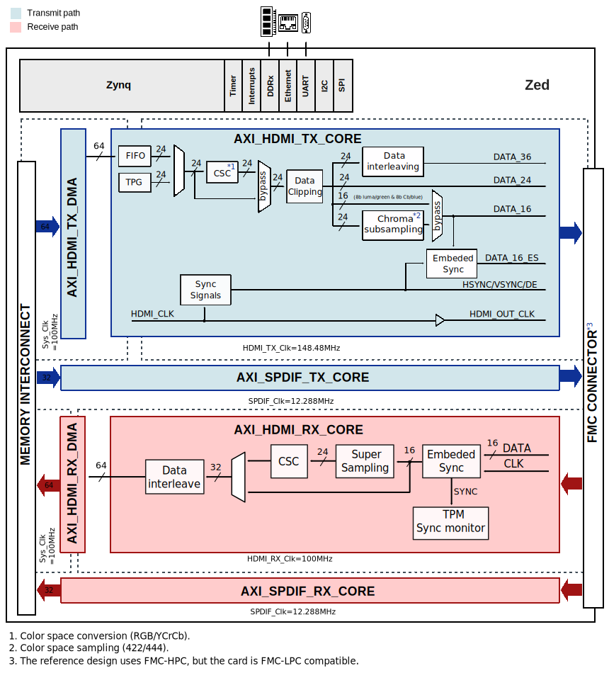
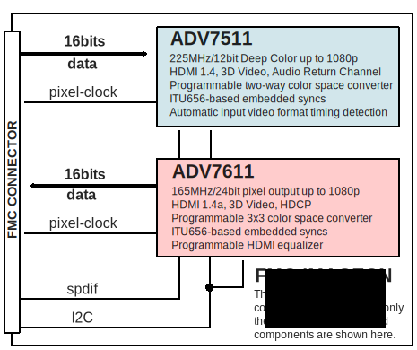

.. _imageon:

Imageon HDL project (OBSOLETE)
===============================================================================

Overview
-------------------------------------------------------------------------------

The :dokuwiki:`FMC-Imageon <resources/fpga/xilinx/fmc/fmc-imageon>` is a
HDMI input/output FMC card that provides high definition video interface for
Xilinx FPGAs. The HDMI input interface is implemented with the :adi:`ADV7611`,
a 165MHz, 24bit pixel output, HDCP capable HDMI 1.4a receiver.
The HDMI output interface is implemented with the :adi:`ADV7511`, a 225MHz,
36-bit deep color, HDMI 1.4 transmitter.

This reference design provides the video and audio interface between the FPGA
and ADV7511/ADV7611 on board. The video uses a 16bit 422 YCbCr interface and
the audio uses a single bit SPDIF interface in both directions.

Supported boards
-------------------------------------------------------------------------------

- FMC-IMAGEON

Supported devices
-------------------------------------------------------------------------------

- :adi:`ADV7611`
- :adi:`ADV7511`

Supported carriers
-------------------------------------------------------------------------------

- `ZedBoard <https://digilent.com/shop/zedboard-zynq-7000-arm-fpga-soc-development-board>`__ on FMC slot

Block design
-------------------------------------------------------------------------------

The reference design is divided in three parts as related to the functionalities
of the board. The first one, related to video transmission, uses the
axi_hdmi_tx module and the axi_dmac modules to read 24 bits of RGB data from
the SoC's DDR memory, and then performs the transmission using the
corresponding HDMI TX-related controller. On the receive side, the inverse
operation is done, by using the HDMI RX-related controller.

In terms of audio part, the axi_spdif module is used to manage the audio output
transmission on the HDMI connector. Additionally, a conversion from RGB to
YCbCr and a downsampling from 444 to 422 are done in the transmit and receive
(in reverse) datapaths as a default operation. To ensure the setup of the
:adi:`ADV7511` and :adi:`ADV75611` ICs, Xilinx's AXI IIC module is used.

Block diagram
~~~~~~~~~~~~~~~~~~~~~~~~~~~~~~~~~~~~~~~~~~~~~~~~~~~~~~~~~~~~~~~~~~~~~~~~~~~~~~~

The data and control paths, along with the corresponding clocks are depicted
in the first diagram. As related to the functional description of the HDL
modules, this is presented in the second diagram.

FMC-IMAGEON Block Diagram
^^^^^^^^^^^^^^^^^^^^^^^^^^^^^^^^^^^^^^^^^^^^^^^^^^^^^^^^^^^^^^^^^^^^^^^^^^^^^^^

FMC-IMAGEON Functional Description
^^^^^^^^^^^^^^^^^^^^^^^^^^^^^^^^^^^^^^^^^^^^^^^^^^^^^^^^^^^^^^^^^^^^^^^^^^^^^^^

CPU/Memory interconnects addresses
~~~~~~~~~~~~~~~~~~~~~~~~~~~~~~~~~~~~~~~~~~~~~~~~~~~~~~~~~~~~~~~~~~~~~~~~~~~~~~~

The addresses are dependent on the architecture of the FPGA, having an offset
added to the base address from HDL (see more at :ref:`architecture cpu-intercon-addr`).

========================  ===========
Instance                  Zynq
========================  ===========
axi_iic_main              0x4160_0000
axi_sysid_0               0x4500_0000
axi_hdmi_clkgen           0x7900_0000
axi_hdmi_dma              0x4300_0000
axi_hdmi_core             0x70E0_0000
axi_spdif_tx_core         0x75C0_0000
axi_i2s_adi               0x7760_0000
axi_iic_fmc               0x4162_0000
axi_hdmi_rx_core          0x4310_0000
axi_hdmi_rx_dma           0x43C2_0000
axi_spdif_rx_core         0x75C2_0000
axi_iic_imageon           0x43C4_0000
========================  ===========

GPIO
~~~~~~~~~~~~~~~~~~~~~~~~~~~~~~~~~~~~~~~~~~~~~~~~~~~~~~~~~~~~~~~~~~~~~~~~~~~~~~~

The Software GPIO number is calculated as follows:

- Zynq-7000: if PS7 EMIOs are used, then offset is 54

.. list-table::
   :widths: 25 25 25 25
   :header-rows: 2

   * - GPIO signal
     - Direction
     - HDL GPIO EMIO
     - Software GPIO
   * -
     - (from FPGA view)
     -
     - Zynq-7000
   * - hdmi_iic_rstn
     - INOUT
     - 33
     - 87
   * - hdmi_rx_int
     - INOUT
     - 32
     - 86
   * - gpio_bd[31:0]
     - INOUT
     - 31:0
     - 85:54

Interrupts
~~~~~~~~~~~~~~~~~~~~~~~~~~~~~~~~~~~~~~~~~~~~~~~~~~~~~~~~~~~~~~~~~~~~~~~~~~~~~~~

Below are the Programmable Logic interrupts used in this project.

=============================== === ============ =============
Instance name                   HDL Linux Zynq   Actual Zynq
=============================== === ============ =============
axi_hdmi_dma/irq                15  59           91
axi_hdmi_rx_dma/irq             14  58           90
axi_iic_imageon/iic2intc_irpt   11  55           87
=============================== === ============ =============

Building the HDL project
-------------------------------------------------------------------------------

The design is built upon ADI's generic HDL reference design framework.
ADI distributed the bit/elf files of this project as part of the
:dokuwiki:`ADI Kuiper Linux <resources/tools-software/linux-software/kuiper-linux>`
in the 2019_R1 release
If you want to build the sources, ADI makes them available on the
:git-hdl:`HDL repository </>`. But, since this is an obsolete project, you need
to check out the last release branch where it was tested (hdl_2019_r1).
To get the source you must
`clone <https://git-scm.com/book/en/v2/Git-Basics-Getting-a-Git-Repository>`__
the HDL repository, and then build the project as follows:

**Linux/Cygwin/WSL**

.. shell:: bash

   /hdl
   $git checkout hdl_2019_r1
   $cd projects/imageon/zed
   $ make

A more comprehensive build guide can be found in the :ref:`build_hdl` user guide.

Resources
-------------------------------------------------------------------------------

Hardware related
~~~~~~~~~~~~~~~~~~~~~~~~~~~~~~~~~~~~~~~~~~~~~~~~~~~~~~~~~~~~~~~~~~~~~~~~~~~~~~~

- ADV7511 datasheet: :adi:`ADV7511`
- ADV7611 datasheet: :adi:`ADV7611`

HDL related
~~~~~~~~~~~~~~~~~~~~~~~~~~~~~~~~~~~~~~~~~~~~~~~~~~~~~~~~~~~~~~~~~~~~~~~~~~~~~~~

- :git-hdl:`IMAGEON HDL project source code <hdl_2019_r1:projects/imageon>`

.. list-table::
   :widths: 30 35 35
   :header-rows: 1

   * - IP name
     - Source code link
     - Documentation link
   * - AXI_CLKGEN
     - :git-hdl:`hdl_2019_r1:library/axi_clkgen`
     - :ref:`axi_clkgen`
   * - AXI_DMAC
     - :git-hdl:`hdl_2019_r1:library/axi_dmac`
     - :ref:`axi_dmac`
   * - AXI_HDMI_RX
     - :git-hdl:`hdl_2019_r1:library/axi_hdmi_rx`
     - :ref:`axi_hdmi_rx`
   * - AXI_HDMI_TX
     - :git-hdl:`hdl_2019_r1:library/axi_hdmi_tx`
     - :ref:`axi_hdmi_tx`
   * - AXI_SYSID
     - :git-hdl:`hdl_2019_r1:library/axi_sysid`
     - :ref:`axi_sysid`
   * - SYSID_ROM
     - :git-hdl:`hdl_2019_r1:library/sysid_rom`
     - :ref:`axi_sysid`
   * - AXI_SDDIF_RX
     - :git-hdl:`hdl_2019_r1:library/axi_spdif_rx`
     - ---

Software related
~~~~~~~~~~~~~~~~~~~~~~~~~~~~~~~~~~~~~~~~~~~~~~~~~~~~~~~~~~~~~~~~~~~~~~~~~~~~~~~

- :git-linux:`IMAGEON dts source code (arm32) <arch/arm/boot/dts/zynq-zed-imageon.dts>`
- :git-linux:`ADV7604 Linux driver <drivers/media/i2c/adv7604.c>`
- :git-linux:`ADV7511 Linux driver <drivers/media/i2c/adv7511.c>`
- :dokuwiki:`ADV7511 driver docs <resources/tools-software/linux-drivers/drm/adv7511>`

.. include:: ../common/more_information.rst

.. include:: ../common/support.rst
