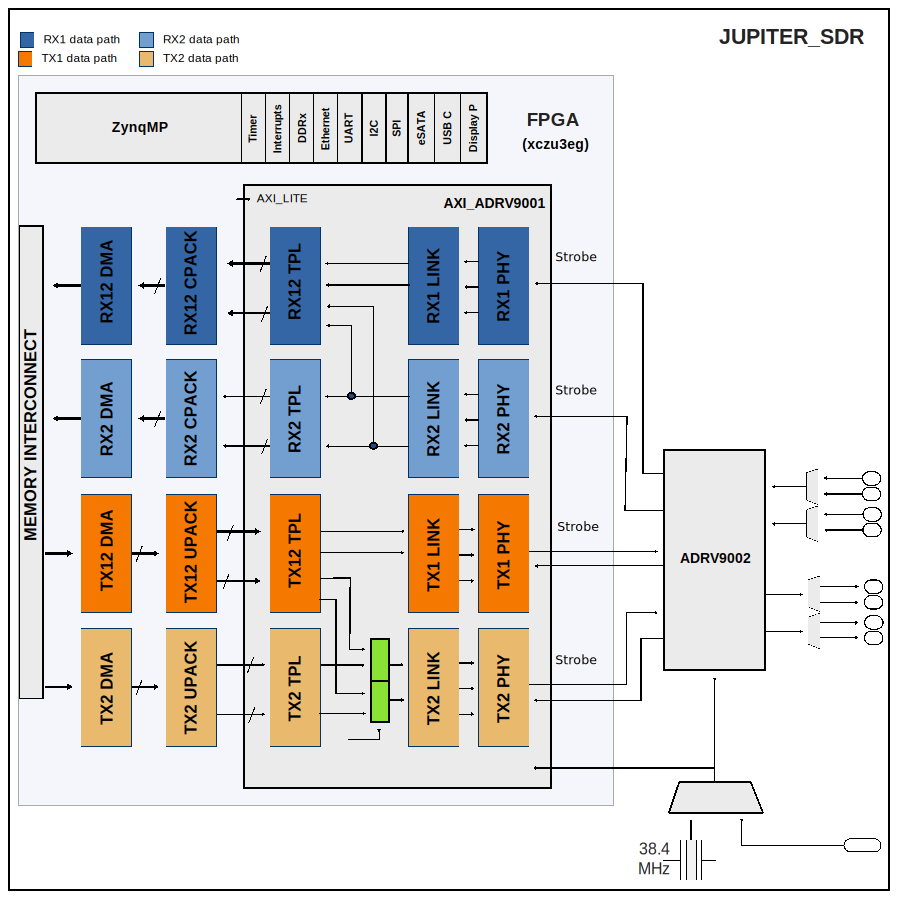

.. _jupiter_sdr:

JUPITER-SDR HDL Project
===============================================================================

Overview
-------------------------------------------------------------------------------

This design allows controlling, receiving and transmitting sample stream
from/to an :adi:`ADRV9002` device through two independent
source-synchronous interfaces.
Supports both CMOS and LVDS interface, but not at the same time.
The selection of the I/O standard must be done by setting a parameter before
building the project.

The design supports SDR or DDR modes in CMOS mode with 1 or 4 lanes, and
in LVDS mode with 1 or 2 lanes. This is runtime configurable.
The complete list of supported modes can be consulted in the
:ref:`axi_adrv9001` Interface Core documentation.

Supported boards
-------------------------------------------------------------------------------

- :adi:`JUPITER_SDR <AD-JUPITER-EBZ>`

Supported devices
-------------------------------------------------------------------------------

- :adi:`ADRV9002`

Block design
-------------------------------------------------------------------------------

The design has two receive paths and two transmit paths.
One of the receive paths (Rx12) has 4 usable channels (I1, Q1, I2, Q2) and the
other (Rx2) has two (I2,Q2) channels. These can work independently, each
having two active channels Rx12 - I1, Q1 and Rx2 - I2, Q2), or just the Rx12
(I1, Q1, I2, Q2) path having four active channels, while Rx2 is disabled.
The same applies to the transmit path but in the other direction.

When only the Rx12 path is active with four channels mode the core will take
ownership of both source synchronous interfaces. The requirement in this case
is that both interfaces run at the same rate.

In the **receive** direction, each component of the delineated data is passed
to a PN monitor. The monitor validates the digital interface signal capture
and timing. The data then optionally DC-filtered, corrected for I/Q offset and
phase mismatches and is written to the DDR memory via DMA.

In the **transmit** direction, complex I and Q signals are generated for each
RF channel. The digital source could either be an internal DDS or from the DDR
via VDMA. The internal DDS phase and frequency are programmable.

Block diagram
~~~~~~~~~~~~~~~~~~~~~~~~~~~~~~~~~~~~~~~~~~~~~~~~~~~~~~~~~~~~~~~~~~~~~~~~~~~~~~~

The data path and clock domains are depicted in the below diagram.

Configuration modes
~~~~~~~~~~~~~~~~~~~~~~~~~~~~~~~~~~~~~~~~~~~~~~~~~~~~~~~~~~~~~~~~~~~~~~~~~~~~~~~

The :git-hdl:`AXI ADRV9001 IP <library/axi_adrv9001>` in this HDL project is
configured to work in LVDS and CMOS interface; it supports two configuration
modes:

- 2R2T - 2x Rx and 2x Tx independent control and DMAs for the two RF channels
- 1R1T - 1x Rx and 1x Tx common control and DMAs for the two RF channels also
  noted as R1_MODE (R12 and T12 path).

For any mode the, number of RF channels doesn't change only the controlling
instance and the data-paths (DMAs), this is if all modes are supported through
at hdl build time through INDEPENDENT_1R1T_SUPPORT and COMMON_2R2T_SUPPORT.

Regarding the INDEPENDENT_1R1T_SUPPORT and COMMON_2R2T_SUPPORT parameters,
related to the above modes, their purpose is to remove the unused data paths,
reducing in this way the resource utilisation. By default all modes/paths are
available.

For more info see the parameter section of :ref:`axi_adrv9001`.

Clock scheme
~~~~~~~~~~~~~~~~~~~~~~~~~~~~~~~~~~~~~~~~~~~~~~~~~~~~~~~~~~~~~~~~~~~~~~~~~~~~~~~

The clocks are managed by the device and are software programmable. Please
refer to the device datasheet for the various clocks within the device.

The board provides a 38.4MHz crystal for the :adi:`ADRV9002`. It can also use
an external reference clock.

CPU/Memory interconnects addresses
~~~~~~~~~~~~~~~~~~~~~~~~~~~~~~~~~~~~~~~~~~~~~~~~~~~~~~~~~~~~~~~~~~~~~~~~~~~~~~~

==================== ============
Instance             ZynqMP
==================== ============
axi_adrv9001         0x84A0_0000
axi_adrv9001_rx1_dma 0x84A3_0000
axi_adrv9001_rx2_dma 0x84A4_0000
axi_adrv9001_tx1_dma 0x84A5_0000
axi_adrv9001_tx2_dma 0x84A6_0000
pl_sysmon            0x84A7_0000
axi_sysid_0          0x8500_0000
==================== ============

SPI connections
~~~~~~~~~~~~~~~~~~~~~~~~~~~~~~~~~~~~~~~~~~~~~~~~~~~~~~~~~~~~~~~~~~~~~~~~~~~~~~~

.. list-table::
   :widths: 25 25 25 25
   :header-rows: 1

   * - SPI type
     - SPI manager instance
     - SPI subordinate
     - CS
   * - PS
     - SPI 0
     - ADRV9002
     - 0

GPIOs
~~~~~~~~~~~~~~~~~~~~~~~~~~~~~~~~~~~~~~~~~~~~~~~~~~~~~~~~~~~~~~~~~~~~~~~~~~~~~~~

Zynq UltraScale PS EMIO GPIO signals translation from schematic to GPIO number.

PS8 EMIO offset = 78

===========================================  ======================  ============  ========  ======================
HW Signal                                    GPIO signal              Direction     HDL no.  Zynq UltraScale+ MP
===========================================  ======================  ============  ========  ======================
IO_L7N_66_FAN_CTL                            fan_ctl                 OUT           67        145
IO_66_USB_FLASH_PROG_EN                      usb_flash_prog_en       OUT           66        144
IO_L4N_64_ADRV9002_MCSSRC                    adrv9002_mcssrc         OUT           65        143
-- (internal)                                mcs_or_system_sync_n    OUT           64        142
IO_L1P_T0L_N0_DBC_64                         add_on_power            OUT           63        141
IO_L23N_T3U_N9_64                            add_on_gpio[14]         INOUT         62        140
IO_L23P_T3U_N8_64                            add_on_gpio[13]         INOUT         61        139
IO_L21N_T3L_N5_AD8N_64                       add_on_gpio[12]         INOUT         60        138
IO_L21P_T3L_N4_AD8P_64                       add_on_gpio[11]         INOUT         59        137
IO_L2N_T0L_N3_64                             add_on_gpio[10]         INOUT         58        136
IO_L2P_T0L_N2_64                             add_on_gpio[ 9]         INOUT         57        135
IO_L1N_T0L_N1_DBC_64                         add_on_gpio[ 8]         INOUT         56        134
IO_L12N_AD0N_26                              add_on_gpio[ 7]         INOUT         55        133
IO_L12P_AD0P_26                              add_on_gpio[ 6]         INOUT         54        132
IO_L11N_AD1N_26                              add_on_gpio[ 5]         INOUT         53        131
IO_L11P_AD1P_26                              add_on_gpio[ 4]         INOUT         52        130
IO_L10N_AD2N_26                              add_on_gpio[ 3]         INOUT         51        129
IO_L10P_AD2P_26                              add_on_gpio[ 2]         INOUT         50        128
IO_L9N_AD3N_26                               add_on_gpio[ 1]         INOUT         49        127
IO_L9P_AD3P_26                               add_on_gpio[ 0]         INOUT         48        126
-- (internal)                                gpio_rx1_enable_in      INOUT         47        126
-- (internal)                                gpio_rx2_enable_in      INOUT         46        126
-- (internal)                                gpio_tx1_enable_in      INOUT         45        126
-- (internal)                                gpio_tx2_enable_in      INOUT         44        126
IO_L18P_64_ADRV9002_DGPIO_11                 dgpio[11]               INOUT         43        121
IO_L18N_64_ADRV9002_DGPIO_10                 dgpio[10]               INOUT         42        120
IO_L9N_64_ADRV9002_DGPIO_9                   dgpio[ 9]               INOUT         41        119
IO_L9P_64_ADRV9002_DGPIO_8                   dgpio[ 8]               INOUT         40        118
IO_T2U_N12_64_ADRV9002_DGPIO_7               dgpio[ 7]               INOUT         39        117
IO_L14N_64_ADRV9002_DGPIO_6                  dgpio[ 6]               INOUT         38        116
IO_L7N_64_ADRV9002_DGPIO_5                   dgpio[ 5]               INOUT         37        115
IO_L7P_64_ADRV9002_DGPIO_4                   dgpio[ 4]               INOUT         36        114
IO_L6N_64_ADRV9002_DGPIO_3                   dgpio[ 3]               INOUT         35        113
IO_L6P_64_ADRV9002_DGPIO_2                   dgpio[ 2]               INOUT         34        112
IO_L5N_64_ADRV9002_DGPIO_1                   dgpio[ 1]               INOUT         33        111
IO_L5P_64_ADRV9002_DGPIO_0                   dgpio[ 0]               INOUT         32        110
IO_L8N_AD4N_26                               ext_gpio[15]            INOUT         31        109
IO_L8P_AD4P_26                               ext_gpio[14]            INOUT         30        108
IO_L7N_AD5N_26                               ext_gpio[13]            INOUT         29        107
IO_L7P_AD5P_26                               ext_gpio[12]            INOUT         28        106
IO_L6N_AD6N_26                               ext_gpio[11]            INOUT         27        105
IO_L6P_AD6P_26                               ext_gpio[10]            INOUT         26        104
IO_L5N_AD7N_26                               ext_gpio[ 9]            INOUT         25        103
IO_L5P_AD7P_26                               ext_gpio[ 8]            INOUT         24        102
IO_L4N_AD8N_26                               ext_gpio[ 7]            INOUT         23        101
IO_L4P_AD8P_26                               ext_gpio[ 6]            INOUT         22        100
IO_L3N_AD9N_26                               ext_gpio[ 5]            INOUT         21         99
IO_L3P_AD9P_26                               ext_gpio[ 4]            INOUT         20         98
IO_L2N_AD10N_26                              ext_gpio[ 3]            INOUT         19         97
IO_L2P_AD10P_26                              ext_gpio[ 2]            INOUT         18         96
IO_L1N_AD11N_26                              ext_gpio[ 1]            INOUT         17         95
IO_L1P_AD11P_26                              ext_gpio[ 0]            INOUT         16         94
IO_L17N_RF_TX2_MUX_CTL2                      rf_tx2_mux_ctl2         OUT           15         93
IO_L17P_RF_TX2_MUX_CTL1                      rf_tx2_mux_ctl1         OUT           14         92
IO_L16N_RF_TX1_MUX_CTL2                      rf_tx1_mux_ctl2         OUT           13         91
IO_L16P_RF_TX1_MUX_CTL1                      rf_tx1_mux_ctl1         OUT           12         90
IO_L13P_RF_RX2B_MUX_CTL                      rf_rx2b_mux_ctl         OUT           11         89
IO_L14P_RF_RX2A_MUX_CTL                      rf_rx2a_mux_ctl         OUT           10         88
IO_L15P_RF_RX1B_MUX_CTL                      rf_rx1b_mux_ctl         OUT            9         87
IO_L15N_RF_RX1A_MUX_CTL                      rf_rx1a_mux_ctl         OUT            8         86
-- (internal)                                mssi_sync               OUT            7         85
VIN_POE_VALID_N                              vin_poe_valid_n         IN             6         84
VIN_USB2_VALID_N                             vin_usb2_valid_n        IN             5         83
VIN_USB1_VALID_N                             vin_usb1_valid_n        IN             4         82
IO_66_ADRV9002_CLKSRC                        clksrc                  OUT            3         81
IO_65_ADRV9002_MODE                          mode                    OUT            2         80
IO_65_ADRV9002_RST                           resetb                  OUT            1         79
IO_L24P_65_ADRV9002_GP_INT                   gp_int                  IN             0         78
===========================================  ======================  ============  ========  ======================

.. admonition:: Legend
   :class: note

   - GPIO signal = name of the GPIO in the HDL project
   - Direction = from the FPGA point of view
   - HDL no. = HDL GPIO EMIO
   - Zynq UltraScale+ MP = Software GPIO to be used in device trees

Interrupts
~~~~~~~~~~~~~~~~~~~~~~~~~~~~~~~~~~~~~~~~~~~~~~~~~~~~~~~~~~~~~~~~~~~~~~~~~~~~~~~

Below are the Programmable Logic interrupts used in the project.

=================== === ============
Instance name       HDL Linux ZynqMP
=================== === ============
axi_ad9361_adc_dma  13  109
axi_ad9361_dac_dma  12  108
axi_ad9361_dac_dma  11  107
axi_ad9361_dac_dma  10  106
pl_sysmon           9   105
=================== === ============

Resource Utilization of xczu3eg-sfva625-2-e
~~~~~~~~~~~~~~~~~~~~~~~~~~~~~~~~~~~~~~~~~~~~~~~~~~~~~~~~~~~~~~~~~~~~~~~~~~~~~~~

========= =========== ========= =============
Resource  Utilization Available Utilization %
========= =========== ========= =============
LUT       25131       70560     35.62
LUTRAM    1812        28800     6.29
FF        34789       141120    24.65
BRAM      4           216       1.85
DSP       12          360       3.33
IO        136         180       75.56
BUFG      13          196       6.63
========= =========== ========= =============

Building the HDL project
-------------------------------------------------------------------------------

The design is built upon ADI's generic HDL reference design framework.
ADI distributes the bit/elf files of these projects as part of the
:dokuwiki:`ADI Kuiper Linux <resources/tools-software/linux-software/kuiper-linux>`.
If you want to build the sources, ADI makes them available on the
:git-hdl:`HDL repository </>`. To get the source you must
`clone <https://git-scm.com/book/en/v2/Git-Basics-Getting-a-Git-Repository>`__
the HDL repository.

**Linux/Cygwin/WSL**

.. shell::

   $cd hdl/projects/jupiter_sdr
   $make

A more comprehensive build guide can be found in the :ref:`build_hdl` user guide.

Resources
-------------------------------------------------------------------------------

Systems related
~~~~~~~~~~~~~~~~~~~~~~~~~~~~~~~~~~~~~~~~~~~~~~~~~~~~~~~~~~~~~~~~~~~~~~~~~~~~~~~

- :dokuwiki:`[Wiki] JUPITER SDR <resources/eval/user-guides/jupiter-sdr>`

HDL related
~~~~~~~~~~~~~~~~~~~~~~~~~~~~~~~~~~~~~~~~~~~~~~~~~~~~~~~~~~~~~~~~~~~~~~~~~~~~~~~

- :git-hdl:`JUPITER_SDR HDL project source code <projects/jupiter_sdr>`

.. list-table::
   :widths: 30 35 35
   :header-rows: 1

   * - IP name
     - Source code link
     - Documentation link
   * - AXI_ADRV9001
     - :git-hdl:`library/axi_adrv9001`
     - :ref:`axi_adrv9001`
   * - AXI_DMAC
     - :git-hdl:`library/axi_dmac`
     - :ref:`axi_dmac`
   * - AXI_SYSID
     - :git-hdl:`library/axi_sysid`
     - :ref:`axi_sysid`
   * - SYSID_ROM
     - :git-hdl:`library/sysid_rom`
     - :ref:`axi_sysid`
   * - UTIL_CPACK2
     - :git-hdl:`library/util_pack/util_cpack2`
     - :ref:`util_cpack2`
   * - UTIL_UPACK2
     - :git-hdl:`library/util_pack/util_upack2`
     - :ref:`util_upack2`
   * - UTIL_TDD_SYNC
     - :git-hdl:`library/util_tdd_sync`
     - ---

Software related
~~~~~~~~~~~~~~~~~~~~~~~~~~~~~~~~~~~~~~~~~~~~~~~~~~~~~~~~~~~~~~~~~~~~~~~~~~~~~~~

- :git-linux:`jupiter_sdr Linux device tree <arch/arm64/boot/dts/xilinx/zynqmp-jupiter-sdr.dts>`
- :git-linux:`jupiter_sdr Linux device 2rx2tx tree <arch/arm64/boot/dts/xilinx/zynqmp-jupiter-sdr-rx2tx2.dts>`

- :dokuwiki:`[Wiki] ADRV9002 Device Driver Customization <resources/tools-software/linux-drivers/iio-transceiver/adrv9002-customization>`
- :dokuwiki:`[Wiki] ADRV9002 Integrated Dual RF Transceiver Linux device driver <resources/tools-software/linux-drivers/iio-transceiver/adrv9002>`
- :dokuwiki:`[Wiki] ADRV9002 No-OS System Level Design <resources/eval/user-guides/adrv9002/no-os-setup>`

.. include:: ../common/more_information.rst

.. include:: ../common/support.rst
