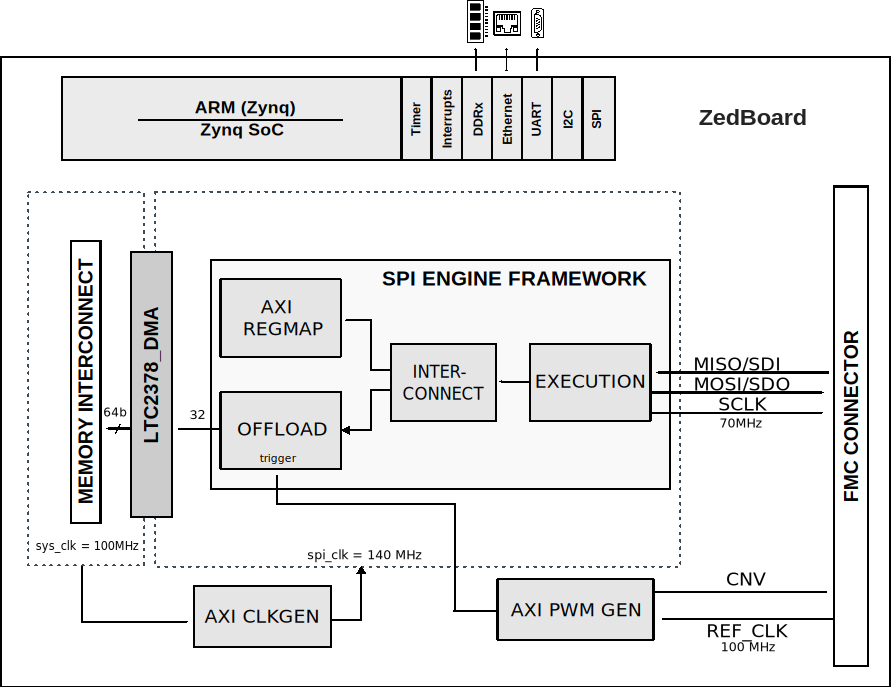

.. _ltc2378_fmc:

LTC2378-FMC HDL project
================================================================================

Overview
--------------------------------------------------------------------------------

The :adi:`LTC2378-20` is a low noise, low power, high speed 20-bit successive
approximation register (SAR) ADC. Operating from a 2.5V supply, the
:adi:`LTC2378-20` has a ±VREF fully differential input range with VREF ranging
from  2.5V to 5.1V. The :adi:`LTC2378-20` consumes only 21mW and achieves ±2ppm
INL maximum, no missing codes at 20 bits with 104dB SNR.

The :adi:`LTC2378-20` has a high speed SPI-compatible serial interface that
supports 1.8V, 2.5V, 3.3V and 5V logic while also featuring a daisy-chain mode.
The fast 1Msps throughput with no cycle latency makes the :adi:`LTC2378-20`
ideally suited for a wide variety of high speed applications. An internal
oscillator sets the conversion time, easing external timing considerations.
The :adi:`LTC2378-20` automatically  powers down between conversions, leading to
reduced power dissipation that scales with the sampling rate.

The :adi:`LTC2378-20` features a unique digital gain compression (DGC) function,
which eliminates the driver amplifier's negative supply while preserving the
full resolution of the ADC. When enabled, the ADC performs a digital scaling
function that maps zero-scale code from 0V to 0.1 x VREF and full-scale code
from VREF to 0.9 x VREF. For a typical reference voltage of 5V, the full-scale
input range is now 0.5V to 4.5V, which provides adequate headroom for powering
the driving amplifier from a single 5.5V supply.

Applications:

* Medical Imaging
* High Speed Data Acquisition
* Portable or Compact Instrumentation
* Industrial Process Control
* Low Power Battery-Operated Instrumentation
* ATE

Supported boards
-------------------------------------------------------------------------------

TO BE ADDED

Supported devices
-------------------------------------------------------------------------------

- :adi:`LTC2378-20`
- :adi:`LTC2377-20`
- :adi:`LTC2376-20`
- :adi:`LTC2370-16`
- :adi:`LTC2369-18`
- :adi:`LTC2368-16/18`
- :adi:`LTC2367-16/18`
- :adi:`LTC2364-16/18`
- :adi:`LTC2380-16`
- :adi:`LTC2379-18`
- :adi:`LTC2378-16/18`
- :adi:`LTC2377-16/18`
- :adi:`LTC2376-16/18`
- :adi:`LTC2338-18`

Supported carriers
-------------------------------------------------------------------------------

- :xilinx:`ZedBoard <products/boards-and-kits/1-8dyf-11.html>` on FMC slot

Block design
-------------------------------------------------------------------------------

Block diagram
~~~~~~~~~~~~~~~~~~~~~~~~~~~~~~~~~~~~~~~~~~~~~~~~~~~~~~~~~~~~~~~~~~~~~~~~~~~~~~~

The data path and clock domains are depicted in the below diagram:

CPU/Memory interconnects addresses
~~~~~~~~~~~~~~~~~~~~~~~~~~~~~~~~~~~~~~~~~~~~~~~~~~~~~~~~~~~~~~~~~~~~~~~~~~~~~~~

The addresses are dependent on the architecture of the FPGA, having an offset
added to the base address from HDL (see more at :ref:`architecture cpu-intercon-addr`).

=========================  ===========
Instance                   Zynq
=========================  ===========
spi_ltc2378_axi_regmap     0x44A0_0000
ltc2378_dma                0x44A3_0000
spi_clkgen                 0x44A7_0000
ltc2378_trigger_gen        0x44B0_0000
=========================  ===========

I2C connections
~~~~~~~~~~~~~~~~~~~~~~~~~~~~~~~~~~~~~~~~~~~~~~~~~~~~~~~~~~~~~~~~~~~~~~~~~~~~~~~

.. list-table::
   :widths: 20 20 20 20 20
   :header-rows: 1

   * - I2C type
     - I2C manager instance
     - Alias
     - Address
     - I2C subordinate
   * - PL
     - iic_fmc
     - axi_iic_fmc
     - 0x4162_0000
     - ---
   * - PL
     - iic_main
     - axi_iic_main
     - 0x4160_0000
     - ---

SPI connections
~~~~~~~~~~~~~~~~~~~~~~~~~~~~~~~~~~~~~~~~~~~~~~~~~~~~~~~~~~~~~~~~~~~~~~~~~~~~~~~

.. list-table::
   :widths: 25 25 25 25
   :header-rows: 1

   * - SPI type
     - SPI manager instance
     - SPI subordinate
     - CS
   * - PL
     - axi_spi_engine
     - ltc2378
     - 0

GPIOs
~~~~~~~~~~~~~~~~~~~~~~~~~~~~~~~~~~~~~~~~~~~~~~~~~~~~~~~~~~~~~~~~~~~~~~~~~~~~~~~

The Software GPIO number is calculated as follows:

- Zynq-7000: if PS7 is used, then offset is 54

.. list-table::
   :widths: 25 25 25 25
   :header-rows: 2

   * - GPIO signal
     - Direction
     - HDL GPIO EMIO
     - Software GPIO
   * -
     - (from FPGA view)
     -
     - Zynq-7000
   * - ltc2378_dcgn
     - INOUT
     - 33
     - 87
   * - ltc2378_chain
     - INOUT
     - 32
     - 86

Interrupts
~~~~~~~~~~~~~~~~~~~~~~~~~~~~~~~~~~~~~~~~~~~~~~~~~~~~~~~~~~~~~~~~~~~~~~~~~~~~~~~

Below are the Programmable Logic interrupts used in this project.

=================== === ========== ===========
Instance name       HDL Linux Zynq Actual Zynq
=================== === ========== ===========
ltc2378_dma         13  57         89
spi_ltc2378         12  56         88
=================== === ========== ===========

Building the HDL project
-------------------------------------------------------------------------------

The design is built upon ADI's generic HDL reference design framework.
ADI distributes the bit/elf files of these projects as part of the
:dokuwiki:`ADI Kuiper Linux <resources/tools-software/linux-software/kuiper-linux>`.
If you want to build the sources, ADI makes them available on the
:git-hdl:`HDL repository </>`. To get the source you must
`clone <https://git-scm.com/book/en/v2/Git-Basics-Getting-a-Git-Repository>`__
the HDL repository, and then build the project as follows:.

**Linux/Cygwin/WSL**

.. shell::

   $cd hdl/projects/ltc2378_fmc/zed
   $make

A more comprehensive build guide can be found in the :ref:`build_hdl`
user guide.

Resources
-------------------------------------------------------------------------------

Hardware related
~~~~~~~~~~~~~~~~~~~~~~~~~~~~~~~~~~~~~~~~~~~~~~~~~~~~~~~~~~~~~~~~~~~~~~~~~~~~~~~

- Product datasheets:

  - :adi:`LTC2378-20`
  - :adi:`LTC2377-20`
  - :adi:`LTC2376-20`
  - :adi:`LTC2370-16`
  - :adi:`LTC2369-18`
  - :adi:`LTC2368-16/18`
  - :adi:`LTC2367-16/18`
  - :adi:`LTC2364-16/18`
  - :adi:`LTC2380-16`
  - :adi:`LTC2379-18`
  - :adi:`LTC2378-16/18`
  - :adi:`LTC2377-16/18`
  - :adi:`LTC2376-16/18`
  - :adi:`LTC2338-18`

HDL related
~~~~~~~~~~~~~~~~~~~~~~~~~~~~~~~~~~~~~~~~~~~~~~~~~~~~~~~~~~~~~~~~~~~~~~~~~~~~~~~

- :git-hdl:`LTC2378_FMC HDL project source code <projects/ltc2378_fmc>`

.. list-table::
   :widths: 30 35 35
   :header-rows: 1

   * - IP name
     - Source code link
     - Documentation link
   * - AD_EDGE_DETECT
     - :git-hdl:`library/common/ad_edge_detect.v`
     - ---
   * - AXI_CLKGEN
     - :git-hdl:`library/axi_clkgen`
     - :ref:`axi_clkgen`
   * - AXI_DMAC
     - :git-hdl:`library/axi_dmac`
     - :ref:`axi_dmac`
   * - AXI_HDMI_TX
     - :git-hdl:`library/axi_hdmi_tx`
     - :ref:`axi_hdmi_tx`
   * - AXI_I2S_ADI
     - :git-hdl:`library/axi_i2s_adi`
     - ---
   * - AXI_PWM_GEN
     - :git-hdl:`library/axi_pwm_gen`
     - :ref:`axi_pwm_gen`
   * - AXI_SPDIF_TX
     - :git-hdl:`library/axi_spdif_tx`
     - ---
   * - AXI_SYSID
     - :git-hdl:`library/axi_sysid`
     - :ref:`axi_sysid`
   * - AXI_SPI_ENGINE
     - :git-hdl:`library/spi_engine/axi_spi_engine`
     - :ref:`spi_engine axi`
   * - SPI_ENGINE_EXECUTION
     - :git-hdl:`library/spi_engine/spi_engine_execution`
     - :ref:`spi_engine execution`
   * - SPI_ENGINE_INTERCONNECT
     - :git-hdl:`library/spi_engine/spi_engine_interconnect`
     - :ref:`spi_engine interconnect`
   * - SPI_ENGINE_OFFLOAD
     - :git-hdl:`library/spi_engine/spi_engine_offload`
     - :ref:`spi_engine offload`
   * - SYSID_ROM
     - :git-hdl:`library/sysid_rom`
     - :ref:`axi_sysid`
   * - UTIL_I2C-MIXER
     - :git-hdl:`library/util_i2c_mixer`
     - ---

- :ref:`SPI Engine Framework documentation <spi_engine>`

Software related
~~~~~~~~~~~~~~~~~~~~~~~~~~~~~~~~~~~~~~~~~~~~~~~~~~~~~~~~~~~~~~~~~~~~~~~~~~~~~~~

TO BE ADDED

.. include:: ../common/more_information.rst

.. include:: ../common/support.rst
