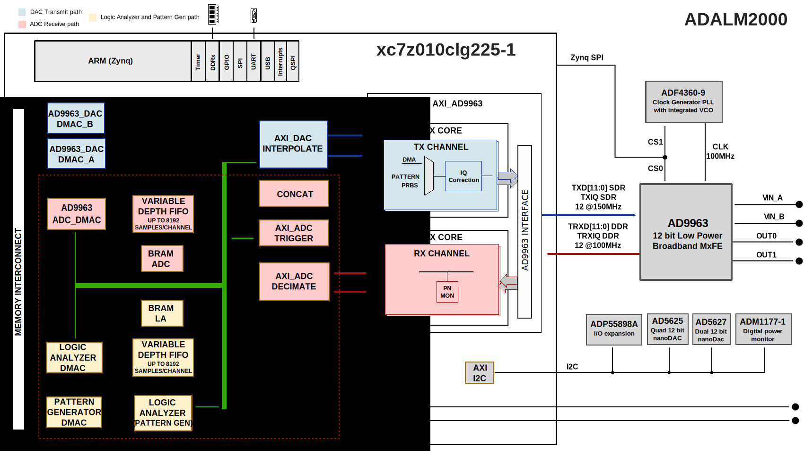

.. _m2k:

M2K HDL Project
===============================================================================

Overview
-------------------------------------------------------------------------------

The :adi:`ADALM2000` (M2K), is built around the XC7Z010 Xilinx Zynq FPGA.

Booting is done from a 32MB QSPI FLASH, connected directly to the PS7 block.

The system memory is 512MB RAM, which is also used for the file system. The DDR
interface is a 16 bits interface running at 500 MHz. The frequency was chosen so
that a single PLL runs inside of the PS7 block generating all the required PS7
clocks, consuming minimum power.

The FPGA drives 16 GPIOs for the logic analyzer, 2 GPIOs for triggers, a 14 pin
interface to the :adi:`AD9963`'s ADC and a 14 pin interface to the :adi:`AD9963`'s
DAC. It also has several generic GPIOs, an SPI and an I2C interface for
configuring the board.

The control GPIOs and the SPI are driven by the PS7 block in order to minimize
the PL resource usage.

The I2C is implemented by an AXI I2C IP because the PS7 I2C has several
limitations, which makes it not suitable for this project.

The oscilloscope related logic transfers data from the :adi:`AD9963` chip with
the :adi:`AD9963` TRX interface goes through the decimation block, the analog
triggering block, the history FIFO and streams data to memory using the DMA.

The analog waveform generator transfers data from the memory using two DMAs, then goes
through the interpolation block and ends with the :adi:`AD9963` TX interface,
which transfers data to the :adi:`AD9963` chip. Two DMAs are used in order to
have different orders of magnitude for the frequency of the two AWG channels,
without needing to transfer a very large number of samples.

The logic analyzer and pattern generator logic are mostly implemented in the
same IP to which a history FIFO and DMAs are added.

Supported boards
-------------------------------------------------------------------------------

- :adi:`ADALM2000`

Supported devices
-------------------------------------------------------------------------------

- :adi:`AD9363`

Block design
-------------------------------------------------------------------------------

Detailed description
~~~~~~~~~~~~~~~~~~~~~~~~~~~~~~~~~~~~~~~~~~~~~~~~~~~~~~~~~~~~~~~~~~~~~~~~~~~~~~~

.. collapsible:: PS7

   The PS7 hardware block is the main processing block of the system, having an
   ARM processor running at 500MHz. It is running a Linux operating system.

   To minimize the power utilization for the design, the PS7 block is
   the only block generating clocks in the system. The clock configuration is
   done in such a way that a single PLL is used to derive all the necessary
   clocks for the ARM processor, the DDR and the peripherals. It generates a
   27MHz clock (FCLK0) for the AXI interface and a 55MHz clock for the
   oscilloscope DMA and one of the two analog waveform generator DMAs.

   The PS7 has enabled SPI0, UART1 and USB0 peripherals. The QUAD SPI flash
   interface is enabled in Single SS 4 bit IO mode.

   The DDR interface is a 16 bit interface running at 500MHz.

   The HP ports have been assigned in a way to optimize the data throughput
   through each of the active ports, considering that HP0 and HP1 share the
   path to memory (same for HP2 and HP3).

   BANK 0 and BANK 1 are configured in LVCMOS 1.8V mode.

.. collapsible:: AXI_AD9963

   The :ref:`AXI_AD9963 <axi_ad9963>` IP is implementing the interfacing with
   the :adi:`AD9963` chip. It features a dual 12-bit ADC working up to
   100MSPS and a dual 12-bit DAC with up to 170MSPS. It also features a DLL,
   which can provide the clock for both the ADC and the DAC path.

   The TRX (ADC) interface is set at 100 MSPS, full duplex mode, double data
   rate (DDR), two channels. The clock comes from the :adi:`AD9963` chip. The
   IO standard is CMOS at 3.3V.

   The TX (DAC) interface works at 75 MSPS data rate with interpolation by 2 on
   the :adi:`AD9963` chip. The DAC path inside :adi:`AD9963` chip works at
   150MHz, pushing part of the spurs outside the 100MHz bandwidth. Given that
   the reference clock for AD9963 is 100MHz and DACs maximum sampling rate is
   170MSPS, this is the best option available. The 75MHz clock is not available
   in the FPGA. To reduce the number of PLL used in the FPGA, we are
   using AD9963 and a BUFR (divide by 2) to generate this clock. When the clock
   is generated by AD9963, DDR transfer is not available. The TX interface works
   at 150MHz, SDR. The IO standard is CMOS at 3.3V.

   More information at :ref:`axi_ad9963` documentation.

.. collapsible:: AXI_ADC_TRIGGER

   The :ref:`AXI_ADC_TRIGGER <axi_adc_trigger>` IP implements triggering for the
   ADC path and also controls the ``TRIGGER`` pins. It works on two clock
   domains, the ADC clock and the AXI interface clock.

   The configuration of the IP is done through the AXI interface.

   The data path runs at the ADC clock.

   Triggers based on the two trigger digital pins, trigger[0] for ADC A and
   trigger[1] for ADC B can be selected between high, low, any edge, rise edge,
   fall edge

   Triggers based on the analog data on a channel will be active if data is
   larger than a limit, smaller than a limit, passing through the limit,
   passing through high or passing through low. The data format must be 2's
   complement.

   The output of the core can embed the triggers in the data words, as only 12
   bits of the 16-bit word are used for data. These need to be extracted before
   being forwarded to the DMA. Embedding the trigger with the data allows for
   additional IPs with unknown pipeline length to be introduced in the path.

   More information at :ref:`axi_adc_trigger` documentation.

.. collapsible:: UTIL_VAR_FIFO

   The :ref:`UTIL_VAR_FIFO <util_var_fifo>` IP allows M2K to store and display
   data before the trigger.
   In the design, it has a length of 8192 samples and can easily be increased.
   The IP controls an external BRAM. If ``DEPTH`` is 0, the FIFO is bypassed.
   When the ``DEPTH`` is changed, the read and write pointers are reset,
   effectively resetting the FIFO. There is a 2 cycle clock latency, even if
   it's bypassed. If valid is not always asserted (decimation is active), the
   latency is one clock cycle instead of two.

   More information at :ref:`util_var_fifo` documentation.

.. collapsible:: SYSTEM TRIGGER OVERVIEW

   The data alignment as event history or alignment between instruments is done
   via triggers.

   The system has two external trigger ports, TI and TO. Both can be used as
   input or output. By default, TI is input and TO output. The in/out direction
   is controlled by axi_adc_trigger.

   Each instrument can be triggered by an external event or from ADC or LA.
   The :ref:`axi_adc_trigger` and :ref:`axi_logic_analyzer` can generate triggers on
   well-defined user scenarios.

   The instrument trigger of each instance is the same one with the trigger
   condition set data alignment.

.. collapsible:: UTIL_EXTRACT

   The :ref:`util_extract` IP will extract the trigger that was
   embedded in the data stream by the :ref:`axi_adc_trigger`
   IP. Not used in the lates design.

   More information at :ref:`util_extract` documentation.

.. collapsible:: AXI_ADC_DECIMATE

   The AD9963 RX interface clock has a set value of 100MHz, so the interface
   always runs at 100MSPS for each of the two channels. For some applications,
   100MSPS are not required and leads to lots of samples transferred to memory,
   which are redundant. For these cases, the decimation IP is used.

   The decimation block allows decimating the input data so that the sampling
   frequency to be reduced by 10, 100, 1000, 10000, 100000, with filtering. The
   filtering is implemented by a 6 sections CIC programmable rate filter, which
   allows decimation by 5/50/500/5000/50000 and a compensation FIR filter
   (decimation by 2).

   At the end of the filter chain, there is an arbitrary decimation block. The
   arbitrary decimation can be activated independently and it does not implement
   any type of filtering.

   More information at :ref:`axi_adc_decimate` documentation.

.. collapsible:: AXI_DAC_INTERPOLATE

   The TX interface is set at 75 MSPS. For some generated signals, this sampling
   rate is too high and leads to a bad utilization of the memory and the USB
   bandwidth. In order to avoid that, the interpolation IP can be used.

   The interpolation block allows interpolation by 10, 100, 1000, 10000,100000
   with filtering. The filtering is implemented using an FIR compensation filter
   (interpolation by 2) for the CIC and a 6 stage CIC interpolation filter,
   allowing interpolation by 5/50/500/5000/50000.

   At the end of the filter blocks, we have an arbitrary interpolation
   zero-order hold block which holds the value for a configurable number of
   samples.

   More information at :ref:`axi_dac_interpolate` documentation.

.. collapsible:: AXI_LOGIC_ANALYZER

   The :ref:`axi_logic_analyzer` IP implements both the
   logic analyzer and the pattern generator, as they share the same pins.

   There are 16-channel digital I/O pins running at 100 MSPS. All the pins can
   be configured either as inputs (logic analyzer) or outputs (pattern
   generator). The logic analyzer path allows a pre trigger history of 8192
   samples per channel.

   The pattern generator supports open drain outputs, configurable per pin.
   Additionally to the 16 data pins, there are two trigger pins, which can be
   configured as input or output. Because they can be used with either analog or
   digital instruments, they are controlled by the AXI_ADC_TRIGGER IP.

   The logic analyzer path can work at lower than the 100MSPS rate by
   configuring the down sampling block. The same thing is done for the pattern
   generator by configuring the up sampling block.

   Triggering for the logic analyzer is implemented in this IP. It can generate
   triggers based on the external trigger signals and the 16-bit input signals.
   For each of the 18 pins it can detect rise edge, fall edge, any edge, high or
   low.

   To provide data before triggering, a variable length FIFO is used
   with this IP. The depth of the FIFO is configured through the
   ``TRIGGER_OFFSET`` register. It can be bypassed if ``TRIGGER_OFFSET`` is 0.
   If the FIFO is active, it is filled before being read, not forwarding any
   data until it is full. The maximum size of the FIFO is 8192 samples. The FIFO
   is implemented using BRAM blocks configured for minimal power consumption.

   More information at :ref:`axi_logic_analyzer` documentation.

.. collapsible:: Pinout Table

   +-----------------+-----------------+----------------------------------------+
   | Location        | Name            | Notes                                  |
   +=================+=================+========================================+
   | **BANK 35, 3.3V. No pins available**                                       |
   +-----------------+-----------------+----------------------------------------+
   | F14             | IIC_SCL         | Enable pull-up                         |
   +-----------------+-----------------+----------------------------------------+
   | F13             | IIC_SDA         | Enable pull-up                         |
   +-----------------+-----------------+----------------------------------------+
   | E12             | AD9963_RESETN   | Reset for the AD9963 chip              |
   +-----------------+-----------------+----------------------------------------+
   | G15             | ADF4360_CS      | SPI interface, chip select for ADF4360 |
   +-----------------+-----------------+----------------------------------------+
   | E11             | AD9963_CSN      | SPI interface, chip select for AD9963  |
   +-----------------+-----------------+----------------------------------------+
   | E13             | SPI_CLK         | SPI interface, clock                   |
   +-----------------+-----------------+----------------------------------------+
   | F12             | SPI_SDIO        | SPI interface, data                    |
   +-----------------+-----------------+----------------------------------------+
   | F15             | EN_POWER_ANALOG | Power on analog path                   |
   +-----------------+-----------------+----------------------------------------+
   | **BANK 34, 3.3V. No pins available**                                       |
   +-----------------+-----------------+----------------------------------------+
   | M12             | TRIGGER[0]      | Trigger pin 0                          |
   +-----------------+-----------------+----------------------------------------+
   | N12             | TRIGGER[1]      | Trigger pin 1                          |
   +-----------------+-----------------+----------------------------------------+
   | K11             | DATA_BD[0]      | Data pin 0. SRCC                       |
   +-----------------+-----------------+----------------------------------------+
   | K12             | DATA_BD[1]      | Data pin 1                             |
   +-----------------+-----------------+----------------------------------------+
   | K13             | DATA_BD[2]      | Data pin 2                             |
   +-----------------+-----------------+----------------------------------------+
   | L13             | DATA_BD[3]      | Data pin 3                             |
   +-----------------+-----------------+----------------------------------------+
   | L14             | DATA_BD[4]      | Data pin 4                             |
   +-----------------+-----------------+----------------------------------------+
   | M14             | DATA_BD[5]      | Data pin 5                             |
   +-----------------+-----------------+----------------------------------------+
   | L15             | DATA_BD[6]      | Data pin 6                             |
   +-----------------+-----------------+----------------------------------------+
   | M15             | DATA_BD[7]      | Data pin 7                             |
   +-----------------+-----------------+----------------------------------------+
   | N13             | DATA_BD[8]      | Data pin 8                             |
   +-----------------+-----------------+----------------------------------------+
   | P14             | DATA_BD[9]      | Data pin 9                             |
   +-----------------+-----------------+----------------------------------------+
   | R12             | DATA_BD[10]     | Data pin 10                            |
   +-----------------+-----------------+----------------------------------------+
   | R13             | DATA_BD[11]     | Data pin 11                            |
   +-----------------+-----------------+----------------------------------------+
   | P11             | DATA_BD[12]     | Data pin 12                            |
   +-----------------+-----------------+----------------------------------------+
   | R11             | DATA_BD[13]     | Data pin 13                            |
   +-----------------+-----------------+----------------------------------------+
   | P15             | DATA_BD[14]     | Data pin 14                            |
   +-----------------+-----------------+----------------------------------------+
   | R15             | DATA_BD[15]     | Data pin 15                            |
   +-----------------+-----------------+----------------------------------------+
   | N11             | RX_CLK          | AD9963 RX interface clock. MRCC        |
   +-----------------+-----------------+----------------------------------------+
   | P13             | RX_IQ           | AD9963 RX IQ pin                       |
   +-----------------+-----------------+----------------------------------------+
   | P10             | RXD[0]          | AD9963 RX data pin 0                   |
   +-----------------+-----------------+----------------------------------------+
   | R10             | RXD[1]          | AD9963 RX data pin 1                   |
   +-----------------+-----------------+----------------------------------------+
   | P8              | RXD[2]          | AD9963 RX data pin 2                   |
   +-----------------+-----------------+----------------------------------------+
   | P9              | RXD[3]          | AD9963 RX data pin 3                   |
   +-----------------+-----------------+----------------------------------------+
   | N7              | RXD[4]          | AD9963 RX data pin 4                   |
   +-----------------+-----------------+----------------------------------------+
   | N8              | RXD[5]          | AD9963 RX data pin 5                   |
   +-----------------+-----------------+----------------------------------------+
   | M10             | RXD[6]          | AD9963 RX data pin 6                   |
   +-----------------+-----------------+----------------------------------------+
   | M11             | RXD[7]          | AD9963 RX data pin 7                   |
   +-----------------+-----------------+----------------------------------------+
   | R7              | RXD[8]          | AD9963 RX data pin 8                   |
   +-----------------+-----------------+----------------------------------------+
   | R8              | RXD[9]          | AD9963 RX data pin 9                   |
   +-----------------+-----------------+----------------------------------------+
   | M9              | RXD[10]         | AD9963 RX data pin 10                  |
   +-----------------+-----------------+----------------------------------------+
   | N9              | RXD[11]         | AD9963 RX data pin 11                  |
   +-----------------+-----------------+----------------------------------------+
   | L12             | TX_CLK          | AD9963 TX interface clock. MRCC        |
   +-----------------+-----------------+----------------------------------------+
   | N14             | TX_IQ           | AD9963 TX IQ pin                       |
   +-----------------+-----------------+----------------------------------------+
   | H12             | TXD[0]          | AD9963 TX data pin 0                   |
   +-----------------+-----------------+----------------------------------------+
   | G11             | TXD[1]          | AD9963 TX data pin 1                   |
   +-----------------+-----------------+----------------------------------------+
   | H13             | TXD[2]          | AD9963 TX data pin 2                   |
   +-----------------+-----------------+----------------------------------------+
   | G12             | TXD[3]          | AD9963 TX data pin 3                   |
   +-----------------+-----------------+----------------------------------------+
   | H14             | TXD[4]          | AD9963 TX data pin 4                   |
   +-----------------+-----------------+----------------------------------------+
   | G14             | TXD[5]          | AD9963 TX data pin 5                   |
   +-----------------+-----------------+----------------------------------------+
   | K15             | TXD[6]          | AD9963 TX data pin 6                   |
   +-----------------+-----------------+----------------------------------------+
   | J15             | TXD[7]          | AD9963 TX data pin 7                   |
   +-----------------+-----------------+----------------------------------------+
   | J14             | TXD[8]          | AD9963 TX data pin 8                   |
   +-----------------+-----------------+----------------------------------------+
   | J13             | TXD[9]          | AD9963 TX data pin 9                   |
   +-----------------+-----------------+----------------------------------------+
   | J11             | TXD[10]         | AD9963 TX data pin 10                  |
   +-----------------+-----------------+----------------------------------------+
   | H11             | TXD[11]         | AD9963 TX data pin 11                  |
   +-----------------+-----------------+----------------------------------------+
   | **BANK 500, 1.8V. 3 Available pins**                                       |
   +-----------------+-----------------+----------------------------------------+
   | PS_MIO1         | QSPI0_SS        | QSPI FLASH                             |
   +-----------------+-----------------+----------------------------------------+
   | PS_MIO2         | QSPI0_IO0       | QSPI FLASH                             |
   +-----------------+-----------------+----------------------------------------+
   | PS_MIO3         | QSPI0_IO1       | QSPI FLASH                             |
   +-----------------+-----------------+----------------------------------------+
   | PS_MIO4         | QSPI0_IO2       | QSPI FLASH                             |
   +-----------------+-----------------+----------------------------------------+
   | PS_MIO5         | QSPI0_IO3       | QSPI FLASH                             |
   +-----------------+-----------------+----------------------------------------+
   | PS_MIO6         | QSPI0_SCLK      | QSPI FLASH                             |
   +-----------------+-----------------+----------------------------------------+
   | PS_MIO7         | VDD (1.8)       |                                        |
   +-----------------+-----------------+----------------------------------------+
   | PS_MIO8         | VDD (1.8)       |                                        |
   +-----------------+-----------------+----------------------------------------+
   | PS_MIO12        | UART_TX         | Debug UART                             |
   +-----------------+-----------------+----------------------------------------+
   | PS_MIO13        | UART_RX         | Debug UART                             |
   +-----------------+-----------------+----------------------------------------+
   | PS_MIO14        | USR_BTN         | Button                                 |
   +-----------------+-----------------+----------------------------------------+
   | PS_MIO15        | USR_LED         | LED                                    |
   +-----------------+-----------------+----------------------------------------+
   | PS_MIO9         | ---             | Available                              |
   +-----------------+-----------------+----------------------------------------+
   | PS_MIO10        | ---             | Available                              |
   +-----------------+-----------------+----------------------------------------+
   | PS_MIO11        | ---             | Available                              |
   +-----------------+-----------------+----------------------------------------+
   | **BANK 501, 1.8V. 3 Available pins**                                       |
   +-----------------+-----------------+----------------------------------------+
   | PS_MIO28        | USB0_D4         | USB                                    |
   +-----------------+-----------------+----------------------------------------+
   | PS_MIO29        | USB0_DIR        | USB                                    |
   +-----------------+-----------------+----------------------------------------+
   | PS_MIO30        | USB0_STP        | USB                                    |
   +-----------------+-----------------+----------------------------------------+
   | PS_MIO31        | USB0_NXT        | USB                                    |
   +-----------------+-----------------+----------------------------------------+
   | PS_MIO32        | USB0_D0         | USB                                    |
   +-----------------+-----------------+----------------------------------------+
   | PS_MIO33        | USB0_D1         | USB                                    |
   +-----------------+-----------------+----------------------------------------+
   | PS_MIO34        | USB0_D2         | USB                                    |
   +-----------------+-----------------+----------------------------------------+
   | PS_MIO35        | USB0_D3         | USB                                    |
   +-----------------+-----------------+----------------------------------------+
   | PS_MIO36        | USB0_CLK        | USB                                    |
   +-----------------+-----------------+----------------------------------------+
   | PS_MIO37        | USB0_D5         | USB                                    |
   +-----------------+-----------------+----------------------------------------+
   | PS_MIO38        | USB0_D6         | USB                                    |
   +-----------------+-----------------+----------------------------------------+
   | PS_MIO39        | USB0_D7         | USB                                    |
   +-----------------+-----------------+----------------------------------------+
   | PS_MIO52        | USB_RESET_B     | USB                                    |
   +-----------------+-----------------+----------------------------------------+
   | PS_MIO48        | ---             | Available                              |
   +-----------------+-----------------+----------------------------------------+
   | PS_MIO49        | ---             | Available                              |
   +-----------------+-----------------+----------------------------------------+
   | PS_MIO53        | ---             | Available                              |
   +-----------------+-----------------+----------------------------------------+

Block diagram
~~~~~~~~~~~~~~~~~~~~~~~~~~~~~~~~~~~~~~~~~~~~~~~~~~~~~~~~~~~~~~~~~~~~~~~~~~~~~~~

The data path and clock domains are depicted in the below diagram.

CPU/Memory interconnects addresses
~~~~~~~~~~~~~~~~~~~~~~~~~~~~~~~~~~~~~~~~~~~~~~~~~~~~~~~~~~~~~~~~~~~~~~~~~~~~~~~

The addresses are dependent on the architecture of the FPGA, having an offset
added to the base address from HDL (see more at :ref:`architecture cpu-intercon-addr`).

====================== ===========
Instance               Zynq
====================== ===========
axi_iic_main           0x4160_0000
logic_analyzer         0x7010_0000
axi_ad9963             0x7020_0000
logic_analyzer_dmac    0x7C40_0000
pattern_generator_dmac 0x7C42_0000
ad9963_adc_dmac        0x7C44_0000
ad9963_dac_dmac_b      0x7C46_0000
ad9963_dac_dmac_a      0x7C48_0000
adc_trigger            0x7C4C_0000
axi_adc_decimate       0x7C50_0000
axi_dac_interpolate    0x7C5A_0000
====================== ===========

SPI connections
~~~~~~~~~~~~~~~~~~~~~~~~~~~~~~~~~~~~~~~~~~~~~~~~~~~~~~~~~~~~~~~~~~~~~~~~~~~~~~~

The SPI signals are controlled by a separate AXI based SPI core.

.. list-table::
   :widths: 25 25 25 25
   :header-rows: 1

   * - SPI type
     - SPI manager instance
     - SPI subordinate
     - CS
   * - PS
     - SPI 0
     - AD9963
     - 0

GPIOs
~~~~~~~~~~~~~~~~~~~~~~~~~~~~~~~~~~~~~~~~~~~~~~~~~~~~~~~~~~~~~~~~~~~~~~~~~~~~~~~

The device control and monitor signals are interfaced to a GPIO module.

.. list-table::
   :widths: 25 25 25 25
   :header-rows: 2

   * - GPIO signal
     - Direction
     - HDL GPIO EMIO
     - Software GPIO
   * -
     - (from FPGA view)
     -
     - Zynq-7000
   * - en_power_analog
     - OUTPUT
     - 1
     - 55
   * - ad9963_resetn
     - OUTPUT
     - 0
     - 54

Interrupts
~~~~~~~~~~~~~~~~~~~~~~~~~~~~~~~~~~~~~~~~~~~~~~~~~~~~~~~~~~~~~~~~~~~~~~~~~~~~~~~

Below are the Programmable Logic interrupts used in the project.

====================== === ========== ===========
Instance name          HDL Linux Zynq Actual Zynq
====================== === ========== ===========
axi_iic_main           14  58         90
logic_analyzer_dmac    13  57         89
pattern_generator_dmac 12  56         88
ad9963_adc_dmac        10  54         86
ad9963_dac_dmac_a      9   53         85
ad9963_dac_dmac_b      8   52         84
====================== === ========== ===========

Building the HDL project
-------------------------------------------------------------------------------

The design is built upon ADI's generic HDL reference design framework.
ADI distributes the bit/elf files of these projects as part of the
:dokuwiki:`ADI Kuiper Linux <resources/tools-software/linux-software/kuiper-linux>`.
If you want to build the sources, ADI makes them available on the
:git-hdl:`HDL repository </>`. To get the source you must
`clone <https://git-scm.com/book/en/v2/Git-Basics-Getting-a-Git-Repository>`__
the HDL repository.

Go to the hdl/projects/**m2k** location and run the make
command.

**Linux/Cygwin/WSL**

.. shell::

   $cd hdl/projects/m2k
   $make

A more comprehensive build guide can be found in the :ref:`build_hdl` user
guide.

Building the M2K firmware
-------------------------------------------------------------------------------

Check out the build section from the README.md: https://github.com/analogdevicesinc/m2k-fw.

Resources
-------------------------------------------------------------------------------

Systems related
~~~~~~~~~~~~~~~~~~~~~~~~~~~~~~~~~~~~~~~~~~~~~~~~~~~~~~~~~~~~~~~~~~~~~~~~~~~~~~~

Here you can find the quick start guides available for this evaluation board:

- :dokuwiki:`[Wiki] M2K Quick Start <university/tools/m2k/users/quick_start>`
- :dokuwiki:`[Wiki] M2K Reference Manual <university/tools/m2k/users/reference_manual>`

Other useful information:

- :dokuwiki:`[Wiki] ADALM2000 for Developers <university/tools/m2k/developers>`
- :dokuwiki:`[Wiki] ADALM2000 for End Users <university/tools/m2k/users>`

Hardware related
~~~~~~~~~~~~~~~~~~~~~~~~~~~~~~~~~~~~~~~~~~~~~~~~~~~~~~~~~~~~~~~~~~~~~~~~~~~~~~~

- Product datasheet: :adi:`AD9963`

HDL related
~~~~~~~~~~~~~~~~~~~~~~~~~~~~~~~~~~~~~~~~~~~~~~~~~~~~~~~~~~~~~~~~~~~~~~~~~~~~~~~

- :git-hdl:`M2K HDL project source code <projects/m2k>`

.. list-table::
   :widths: 30 35 35
   :header-rows: 1

   * - IP name
     - Source code link
     - Documentation link
   * - AXI_AD9963
     - :git-hdl:`library/axi_ad9963`
     - :ref:`axi_ad9963`
   * - AXI_ADC_DECIMATE
     - :git-hdl:`library/axi_adc_decimate`
     - :ref:`axi_adc_decimate`
   * - AXI_ADC_TRIGGER
     - :git-hdl:`library/axi_adc_trigger`
     - :ref:`axi_adc_trigger`
   * - AXI_DAC_INTERPOLATE
     - :git-hdl:`library/axi_dac_interpolate`
     - :ref:`axi_dac_interpolate`
   * - AXI_DMAC
     - :git-hdl:`library/axi_dmac`
     - :ref:`axi_dmac`
   * - AXI_LOGIC_ANALYZER
     - :git-hdl:`library/axi_logic_analyzer`
     - :ref:`axi_logic_analyzer`
   * - AXI_RD_WR_COMBINER
     - :git-hdl:`library/axi_rd_wr_combiner`
     - ---
   * - UTIL_VAR_FIFO
     - :git-hdl:`library/util_var_fifo`
     - :ref:`util_var_fifo`

Software related
~~~~~~~~~~~~~~~~~~~~~~~~~~~~~~~~~~~~~~~~~~~~~~~~~~~~~~~~~~~~~~~~~~~~~~~~~~~~~~~

- :git-linux:`M2K Rev.B Linux device tree <arch/arm/boot/dts/xilinx/zynq-m2k-revb.dts>`
- :git-linux:`M2K Rev.C Linux device tree <arch/arm/boot/dts/xilinx/zynq-m2k-revc.dts>`
- :git-linux:`M2K Rev.D Linux device tree <arch/arm/boot/dts/xilinx/zynq-m2k-revd.dts>`
- :git-linux:`M2K Rev.E Linux device tree <arch/arm/boot/dts/xilinx/zynq-m2k-reve.dts>`
- :git-linux:`M2K Rev.F Linux device tree <arch/arm/boot/dts/xilinx/zynq-m2k-revf.dts>`

.. include:: ../common/more_information.rst

.. include:: ../common/support.rst
