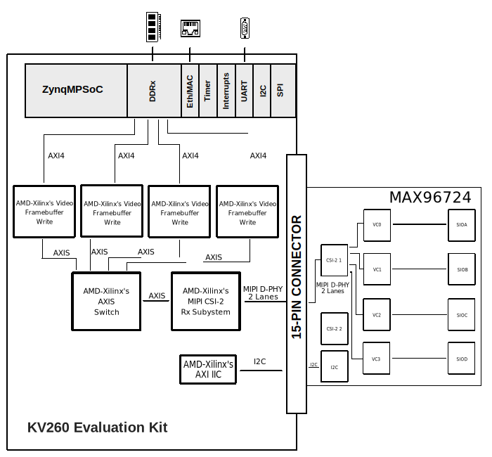

.. _max96724:

MAX96724 HDL project
===============================================================================

Overview
-------------------------------------------------------------------------------

The :adi:`MAX96724` deserializer converts four GMSL™2/1 inputs to 1, 2, or 4 MIPI D-PHY
or C-PHY outputs. The device allows simultaneous transmit bidirectional transmissions
over 50Ω coax or 100Ω STP cables that meet the GMSL channel specification.

Up to four remotely located sensors can be supported using industry-standard coax or
STP interconnects. Each GMSL2 serial link operates at a fixed rate of 3 Gbps or 6 Gbps
in the forward direction and 187.5Mbps in the reverse direction. The MAX96724/F/R
supports both aggregation and replication of video data, enabling streams from multiple
remotely located sensors to be combined and routed to one or more of the available CSI-2 outputs.

The :adi:`MAX96724 DPHY Evaluation Kit (EV Kit) <MAX96724F-BAK-EVK>` provides a
proven design and reliable platform to evaluate the :adi:`MAX96724` device using
standard FAKRA coaxial cables.

Supported boards
-------------------------------------------------------------------------------

- :adi:`MAX96724 DPHY Evaluation Kit (EV Kit) <MAX96724F-BAK-EVK>`

Supported devices
-------------------------------------------------------------------------------

- :adi:`MAX9724`

Supported carriers
-------------------------------------------------------------------------------

- :xilinx:`KV260 Vision Evaluation Kit <products/system-on-modules/kria/k26/kv260-vision-starter-kit.html>` using Raspberry Pi camera interface

Block design
-------------------------------------------------------------------------------

The data path designed in this reference design is as follows:

- the virtual channel inputs of one CSI-2 output port of the deserializer are
  captured using Xilinx's `MIPI CSI-2 Rx Subsystem IP <https://docs.amd.com/r/en-US/pg232-mipi-csi2-rx>`_
- data is written into memory by using a Xilinx video-related DMA implementation
  `Video Framebuffer Write <https://docs.amd.com/r/en-US/pg278-v-frmbuf>`_
- the control of the camera modules is realized through I2C using Xilinx's
  `AXI IIC logic <https://docs.amd.com/v/u/en-US/pg090-axi-iic>`_

Block diagram
~~~~~~~~~~~~~~~~~~~~~~~~~~~~~~~~~~~~~~~~~~~~~~~~~~~~~~~~~~~~~~~~~~~~~~~~~~~~~~~

The data path (through the deserializer) and the writing in memory are illustrated
in the block diagram.

CPU/Memory interconnects addresses
~~~~~~~~~~~~~~~~~~~~~~~~~~~~~~~~~~~~~~~~~~~~~~~~~~~~~~~~~~~~~~~~~~~~~~~~~~~~~~~~~

The addresses are dependent on the architecture of the FPGA, having an offset
added to the base address from HDL (see more at :ref:`architecture cpu-intercon-addr`).

========================  ===========
Instance                  Address
========================  ===========
mipi_csi2_rx_subsyst_0    0x84A0_0000
axi_iic_mipi              0x84A2_0000
v_frmbuf_wr_0             0x84A4_0000
v_frmbuf_wr_1             0x84A6_0000
v_frmbuf_wr_2             0x84A8_0000
v_frmbuf_wr_3             0x84AA_0000
axi_sysid_0               0x8500_0000
========================  ===========

I2C connections
~~~~~~~~~~~~~~~~~~~~~~~~~~~~~~~~~~~~~~~~~~~~~~~~~~~~~~~~~~~~~~~~~~~~~~~~~~~~~~~

.. list-table::
   :widths: 20 20 20 20 20
   :header-rows: 1

   * - I2C type
     - I2C manager instance
     - Alias
     - Address
     - I2C subordinate
   * - PL
     - iic_fmc
     - axi_iic_mipi
     - 0x84A2_0000
     - ---

GPIOs
~~~~~~~~~~~~~~~~~~~~~~~~~~~~~~~~~~~~~~~~~~~~~~~~~~~~~~~~~~~~~~~~~~~~~~~~~~~~~~~

The Software GPIO number is calculated as follows:

- ZynqMP: if PS8 EMIOs are used, then offset is 78

.. list-table::
   :widths: 25 25 25 25
   :header-rows: 2

   * - GPIO signal
     - Direction
     - HDL GPIO EMIO
     - Software GPIO
   * -
     - (from FPGA view)
     -
     - ZynqMP
   * - fan_en_b
     - OUT
     - 0
     - 78
   * - csirxss_rstn
     - OUT
     - 1
     - 79
   * - ap_rstn_frmbuf_0
     - OUT
     - 2
     - 80
   * - ap_rstn_frmbuf_1
     - OUT
     - 3
     - 81
   * - ap_rstn_frmbuf_2
     - OUT
     - 4
     - 82
   * - ap_rstn_frmbuf_3
     - OUT
     - 5
     - 83
   * - rpi_en
     - OUT
     - 6
     - 84

Interrupts
~~~~~~~~~~~~~~~~~~~~~~~~~~~~~~~~~~~~~~~~~~~~~~~~~~~~~~~~~~~~~~~~~~~~~~~~~~~~~~~

Below are the Programmable Logic interrupts used in this project.

====================== === ============ =============
Instance name          HDL Linux ZynqMP Actual ZynqMP
====================== === ============ =============
csirxss_irq            13  109          141
iic2intc_irpt          12  108          140
v_frmbuf_wr0/interrupt 11  107          139
v_frmbuf_wr1/interrupt 10  106          138
v_frmbuf_wr2/interrupt  9  105          137
v_frmbuf_wr3/interrupt  8  104          136
====================== === ============ =============

Building the HDL project
-------------------------------------------------------------------------------

The design is built upon ADI's generic HDL reference design framework.
ADI distributes the bit/elf files of these projects as part of the
:dokuwiki:`ADI Kuiper Linux <resources/tools-software/linux-software/kuiper-linux>`.
If you want to build the sources, ADI makes them available on the
:git-hdl:`HDL repository </>`. To get the source, you must
`clone <https://git-scm.com/book/en/v2/Git-Basics-Getting-a-Git-Repository>`_
the HDL repository, and then build the project as follows:

**Linux/Cygwin/WSL**

.. shell::

   $cd hdl/projects/max96724/kv260
   $make

A more comprehensive build guide can be found in the :ref:`build_hdl` user guide.

Resources
-------------------------------------------------------------------------------

Hardware related
~~~~~~~~~~~~~~~~~~~~~~~~~~~~~~~~~~~~~~~~~~~~~~~~~~~~~~~~~~~~~~~~~~~~~~~~~~~~~~~

- Product datasheets:

  - :adi:`MAX96724 <media/en/technical-documentation/data-sheets/max96724.pdf>`
  - :adi:`MAX96724 DPHY Evaluation Kit (EV Kit) <media/en/technical-documentation/data-sheets/max96724-bak-evk-max96724r-bak-evk.pdf>`

HDL related
~~~~~~~~~~~~~~~~~~~~~~~~~~~~~~~~~~~~~~~~~~~~~~~~~~~~~~~~~~~~~~~~~~~~~~~~~~~~~~~

- :git-hdl:`MAX96724 HDL project source code <projects/max96724>`

.. list-table::
   :widths: 30 35 35
   :header-rows: 1

   * - IP name
     - Source code link
     - Documentation link
   * - AXI_SYSID
     - :git-hdl:`library/axi_sysid`
     - :ref:`axi_sysid`

Software related
~~~~~~~~~~~~~~~~~~~~~~~~~~~~~~~~~~~~~~~~~~~~~~~~~~~~~~~~~~~~~~~~~~~~~~~~~~~~~~~
- `GMSL-related repository <https://github.com/analogdevicesinc/gmsl>`_
- The user guide that exemplify the system interfaced using
  :adi:`AD-GMSLCAMRPI-ADP adaptor <AD-GMSLCAMRPI-ADP>` is available at
  :dokuwiki:`wiki page <resources/eval/user-guides/ad-gmslcamrpi-adp/ug_amd_kria>`
- :git-linux:`GMSL drivers/dts <gmsl/xilinx_v6.1_LTS:/>`

.. include:: ../common/more_information.rst

.. include:: ../common/support.rst
