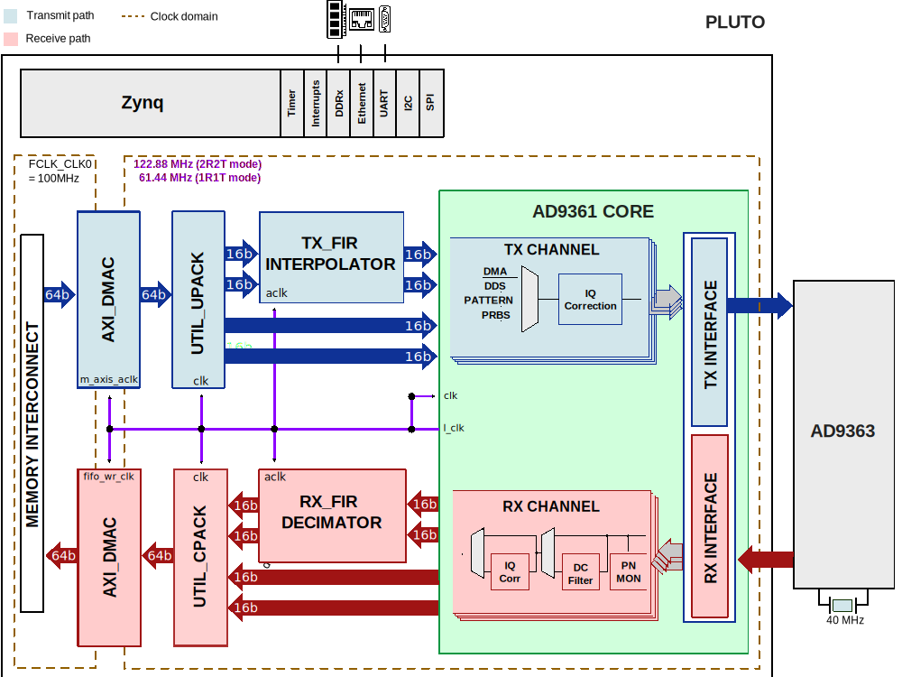

.. _pluto:

PLUTO HDL Project
===============================================================================

Overview
-------------------------------------------------------------------------------

The :adi:`ADALM-PLUTO` Active Learning Module (PlutoSDR) is an easy to use tool
available from Analog Devices Inc. (ADI) that can be used to introduce
fundamentals of `Software Defined Radio (SDR) <https://en.wikipedia.org/wiki/Software-defined_radio>`_ 
or `Radio Frequency (RF) <https://en.wikipedia.org/wiki/Radio_frequency>`_  
or `Communications <https://en.wikipedia.org/wiki/Communication_theory>`_ 
as advanced topics in electrical engineering in a self or instructor lead
setting.

Based on the :adi:`AD9363`, it offers one receive channel and one transmit
channel which can be operated in full duplex, capable of generating or
measuring RF analog signals from 325 to 3800 MHz, at up to 61.44 Mega Samples
per Second (MSPS) with a 20 MHz bandwidth. The PlutoSDR is completely
self-contained, fits nicely in a shirt pocket or backpack, and is entirely USB
powered with the default firmware. With support for OS X™, Windows™ and Linux™,
it allows exploration and understanding of RF systems no matter where the user
is or when.

The 2nd Rx/Tx channel internal to the rev D is not test during production test.
If it works - bonus! If it doesn't work, Pluto is only advertised as a 1 Rx,
1 Tx radio, and that is guaranteed/production tested on each unit - and that
is what you received.

Supported boards
-------------------------------------------------------------------------------

- :adi:`ADALM-PLUTO`

Supported devices
-------------------------------------------------------------------------------

- :adi:`AD9363`

Block design
-------------------------------------------------------------------------------

In both **receive** and **transmit** directions, complex I and Q signals are
generated for each RF.

Block diagram
~~~~~~~~~~~~~~~~~~~~~~~~~~~~~~~~~~~~~~~~~~~~~~~~~~~~~~~~~~~~~~~~~~~~~~~~~~~~~~~

The data path and clock domains are depicted in the below diagram.

Clock scheme
~~~~~~~~~~~~~~~~~~~~~~~~~~~~~~~~~~~~~~~~~~~~~~~~~~~~~~~~~~~~~~~~~~~~~~~~~~~~~~~

The clocks are managed by the device and are software programmable. Please
refer to the device data sheet for the various clocks within the device.

The board provides a 40MHz crystal for the :adi:`AD9363`. For more details
about the clocking, check the `AD9361 Reference Manual`_, page 14, "Reference
Clock Requirements".

Configuration modes
~~~~~~~~~~~~~~~~~~~~~~~~~~~~~~~~~~~~~~~~~~~~~~~~~~~~~~~~~~~~~~~~~~~~~~~~~~~~~~~

The :git-hdl:`AD9361 IP <library/axi_ad9361>` in this HDL project is configured
to work only in CMOS interface; it supports two configuration modes:

- 2R2T - 2x receive and 2x transmit RF channels
- 1R1T - 1x receive and 1x transmit RF channel

Both support only the **dual port half duplex** operating mode. The maximum
data rate (for combined I and Q words) is 61.44MSPS in DDR. For more details
about these modes, check the `AD9361 Reference Manual`_, Table 48 "Maximum Data
Rates and Signal Bandwidths".

The following are the parameters of this project that can be configured:

- TDD_SUPPORT: set to 1, adds the TDD; enables external synchronization through
  TDD. Must be set to 1 when SHARED_DEVCLK=1
- TDD_CHANNEL_CNT
- TDD_SYNC_WIDTH
- TDD_SYNC_INT
- TDD_SYNC_EXT
- TDD_SYNC_EXT_CDC: if enabled, the CDC circuitry for the external sync signal
  is added
- Check out this guide on more details regarding these parameters:
  :ref:`axi_tdd`

CPU/Memory interconnects addresses
~~~~~~~~~~~~~~~~~~~~~~~~~~~~~~~~~~~~~~~~~~~~~~~~~~~~~~~~~~~~~~~~~~~~~~~~~~~~~~~

The addresses are dependent on the architecture of the FPGA, having an offset
added to the base address from HDL (see more at :ref:`architecture cpu-intercon-addr`).

================== ===========
Instance           Zynq
================== ===========
axi_ad9361_adc_dma 0x7C40_0000
axi_ad9361_dac_dma 0x7C42_0000
axi_spi            0x7C43_0000
axi_tdd_0          0x7C44_0000
axi_ad9361         0x7902_0000
================== ===========

SPI connections
~~~~~~~~~~~~~~~~~~~~~~~~~~~~~~~~~~~~~~~~~~~~~~~~~~~~~~~~~~~~~~~~~~~~~~~~~~~~~~~

The SPI signals are controlled by a separate AXI based SPI core.

.. list-table::
   :widths: 25 25 25 25
   :header-rows: 1

   * - SPI type
     - SPI manager instance
     - SPI subordinate
     - CS
   * - PS
     - SPI 0
     - AD9361
     - 0

GPIOs
~~~~~~~~~~~~~~~~~~~~~~~~~~~~~~~~~~~~~~~~~~~~~~~~~~~~~~~~~~~~~~~~~~~~~~~~~~~~~~~

The device control and monitor signals are interfaced to a GPIO module.

.. list-table::
   :widths: 25 25 25 25
   :header-rows: 2

   * - GPIO signal
     - Direction
     - HDL GPIO EMIO
     - Software GPIO
   * -
     - (from FPGA view)
     -
     - Zynq-7000
   * - pl_muxout
     - OUT
     - 17
     - 71
   * - phaser_enable
     - IN
     - 14
     - 68
   * - gpio_resetb
     - INOUT
     - 13
     - 67
   * - gpio_en_agc
     - INOUT
     - 12
     - 66
   * - gpio_ctl[3:0]
     - INOUT
     - 11:8
     - 65:62
   * - gpio_status[7:0]
     - INOUT
     - 7:0
     - 61:54

.. note::	 

   The user can select the Programmable Logic GPIO operation through
   the **phaser_enable** software-controlled pin.

   The **phaser_enable** pin defaults to 0, selecting the Pluto
   functionality. If set to 1, the GPIOs switch to Phaser functionality.

.. collapsible:: Click here to see the list of PL and PS GPIOs available.

    Processor System (PS)

   +----------+----------+----------+----------+----------+----------+
   | Zynq     | Zynq Pin | S        | PCB Test | Pluto    | Phaser   |
   | 7010 Pin | Name     | chematic | Point    | Funct    | Funct    |
   |          |          | Net      |          | ionality | ionality |
   +==========+==========+==========+==========+==========+==========+
   | K13      | IO_L1    | PL_GPIO0 | L10P     | SPI MOSI | TXDATA   |
   |          | 0P_T1_34 |          |          |          |          |
   +----------+----------+----------+----------+----------+----------+
   | M12      | IO       | PL_GPIO1 | L12N     | SPI MISO | BURST    |
   |          | _L12N_T1 |          |          |          |          |
   |          | _MRCC_34 |          |          |          |          |
   +----------+----------+----------+----------+----------+----------+
   | R10      | IO_L2    | PL_GPIO2 | L24N     | SPI CLKO | MUXOUT   |
   |          | 4N_T3_34 |          |          |          |          |
   +----------+----------+----------+----------+----------+----------+
   | N14      | IO_L     | PL_GPIO3 | L7N      | IIC SDA  | IIC SDA  |
   |          | 7N_T1_34 |          |          |          |          |
   +----------+----------+----------+----------+----------+----------+
   | M14      | IO_L9N_T | PL_GPIO4 | L9N      | IIC SCL  | IIC SCL  |
   |          | 1_DQS_34 |          |          |          |          |
   +----------+----------+----------+----------+----------+----------+
   
   Processor System (PS)
   
   ============= ============= ============= ==============
   Zynq 7010 Pin Zynq Pin Name Schematic Net PCB Test Point
   ============= ============= ============= ==============
   D8            PS_MIO0_500   PS_GPIO0      MIO0
   B10           PS_MIO11_500  PS_GPIO1      MIO10
   D6            PS_MIO10_500  PS_GPIO2      MIO11
   B5            PS_MIO9_500   PS_GPIO3      MIO09
   C13           PS_MIO53_501  PS_GPIO4      MIO53
   D13           PS_MIO49_501  PS_GPIO5      MIO49
   B12           PS_MIO48_501  PS_GPIO6      MIO48
   ============= ============= ============= ==============

Interrupts
~~~~~~~~~~~~~~~~~~~~~~~~~~~~~~~~~~~~~~~~~~~~~~~~~~~~~~~~~~~~~~~~~~~~~~~~~~~~~~~

Below are the Programmable Logic interrupts used in the project.

=================== === ========== ===========
Instance name       HDL Linux Zynq Actual Zynq
=================== === ========== ===========
axi_ad9361_adc_dma  13  57         89         
axi_ad9361_dac_dma  12  56         88
axi_spi             11  55         87
=================== === ========== ===========

Building the HDL project
-------------------------------------------------------------------------------

The design is built upon ADI's generic HDL reference design framework.
ADI distributes the bit/elf files of these projects as part of the
:dokuwiki:`ADI Kuiper Linux <resources/tools-software/linux-software/kuiper-linux>`.
If you want to build the sources, ADI makes them available on the
:git-hdl:`HDL repository </>`. To get the source you must
`clone <https://git-scm.com/book/en/v2/Git-Basics-Getting-a-Git-Repository>`__
the HDL repository.

Go to the hdl/projects/**pluto** location and run the make
command.

**Linux/Cygwin/WSL**

.. shell::

   $cd hdl/projects/pluto
   $make

A more comprehensive build guide can be found in the :ref:`build_hdl` user
guide.

Resources
-------------------------------------------------------------------------------

Systems related
~~~~~~~~~~~~~~~~~~~~~~~~~~~~~~~~~~~~~~~~~~~~~~~~~~~~~~~~~~~~~~~~~~~~~~~~~~~~~~~

Here you can find the quick start guides available for this evaluation board:

- :dokuwiki:`[Wiki] PlutoSDR Quick Start <university/tools/pluto/users/quick_start>`

Other useful information:

- :dokuwiki:`[Wiki] ADALM-PLUTO Overview <university/tools/pluto>`
- :dokuwiki:`[Wiki] ADALM-PLUTO for End Users <university/tools/pluto/users>`

Hardware related
~~~~~~~~~~~~~~~~~~~~~~~~~~~~~~~~~~~~~~~~~~~~~~~~~~~~~~~~~~~~~~~~~~~~~~~~~~~~~~~

- `AD9361 reference manual <https://ez.analog.com/cfs-file/__key/telligent-evolution-components-attachments/00-441-00-00-00-07-91-97/AD9361_5F00_Reference_5F00_Manual_5F00_UG_2D00_570.pdf>`__
- Product datasheet: :adi:`AD9363`

- :dokuwiki:`[Wiki] About AD9361/AD9363/AD9364 <resources/eval/user-guides/ad-fmcomms2-ebz/ad9361>`
- :dokuwiki:`[Wiki] About I/Q rotation <resources/eval/user-guides/ad-fmcomms2-ebz/iq_rotation>`
- :dokuwiki:`[Wiki] Configuration options for <resources/eval/user-guides/ad-fmcomms2-ebz/hardware/configuration_options>`
- :dokuwiki:`[Wiki] Tuning the AD9361/AD9364 <resources/eval/user-guides/ad-fmcomms2-ebz/hardware/tuning>`

HDL related
~~~~~~~~~~~~~~~~~~~~~~~~~~~~~~~~~~~~~~~~~~~~~~~~~~~~~~~~~~~~~~~~~~~~~~~~~~~~~~~

- :git-hdl:`PLUTO HDL project source code <projects/pluto>`

.. list-table::
   :widths: 30 35 35
   :header-rows: 1

   * - IP name
     - Source code link
     - Documentation link
   * - AXI_AD9361
     - :git-hdl:`library/axi_ad9361`
     - :ref:`axi_ad9361`
   * - AXI_DMAC
     - :git-hdl:`library/axi_dmac`
     - :ref:`axi_dmac`
   * - AXI_TDD
     - :git-hdl:`library/axi_tdd`
     - :ref:`axi_tdd`	 
   * - UTIL_CPACK2
     - :git-hdl:`library/util_pack/util_cpack2`
     - :ref:`util_cpack2`
   * - UTIL_UPACK2
     - :git-hdl:`library/util_pack/util_upack2`
     - :ref:`util_upack2`
   * - UTIL_CLKDIV
     - :git-hdl:`library/xilinx/util_clkdiv`
     - ---

- :dokuwiki:`[Wiki] Accessing Pluto's FPGA Over JTAG <university/tools/pluto/devs/fpga>`

Software related
~~~~~~~~~~~~~~~~~~~~~~~~~~~~~~~~~~~~~~~~~~~~~~~~~~~~~~~~~~~~~~~~~~~~~~~~~~~~~~~

- :git-linux:`PLUTO SDR rev. B Linux device tree <arch/arm/boot/dts/xilinx/zynq-pluto-sdr-revb.dts>`
- :git-linux:`PLUTO SDR rev. C Linux device tree <arch/arm/boot/dts/xilinx/zynq-pluto-sdr-revc.dts>`

- :dokuwiki:`[Wiki] Linux Drivers <university/tools/pluto/drivers/linux>`
- :dokuwiki:`[Wiki] Windows Drivers <university/tools/pluto/drivers/linux>`
- :dokuwiki:`[Wiki] AD936x IIO Oscilloscope plugin description <resources/tools-software/linux-software/fmcomms2_plugin>`

- :dokuwiki:`[Wiki] Pluto Support <university/tools/pluto/help_support>`
- :dokuwiki:`[Wiki] ADALM-PLUTO Troubleshooting <university/tools/pluto/troubleshooting>`

.. include:: ../common/more_information.rst

.. include:: ../common/support.rst

.. _AD9361 Reference Manual: https://ez.analog.com/cfs-file/__key/telligent-evolution-components-attachments/00-441-00-00-00-07-91-97/AD9361_5F00_Reference_5F00_Manual_5F00_UG_2D00_570.pdf
