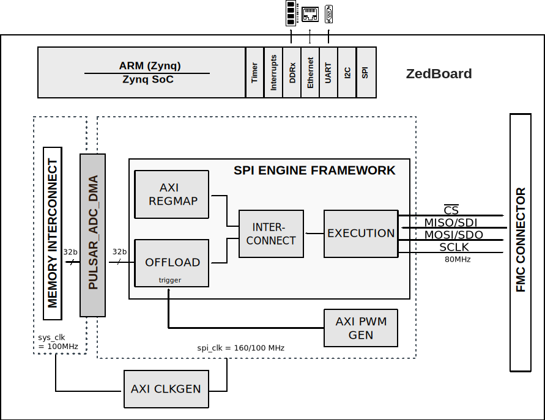

.. _pulsar_adc:

PULSAR-ADC HDL project
=================================================================================

Overview
---------------------------------------------------------------------------------
Depending on the type of connector it uses, the Pulsar family is divided into
the products which have **PMOD** connectors and **FMC** connectors.

PulSAR converters which have PMOD boards associated with them are low power ADCs
which offer very high performance from 14-bits up to 18-bits with throughputs
ranging from 100ksps to 1.3MSPS. The boards are designed to demonstrate the
ADC's performance and to provide an easy digital interface for a variety of
system applications. The PulSAR family share the same interface and the same PCB,
the differences being found in their performance.  A full description of these
products are available in their respective data sheets and should be consulted
when utilizing the boards.

ADAQ40xx families is also part of the family of pulsar converters with PMOD
connector. This type of boards come with the :adi:`EVAL-PMD-IB1Z` PMOD to
field programmable gate array (FPGA) mezzanine card (FMC) interposer board that
interfaces with the system demonstration controller board.
The :adi:`ADAQ4003` is an 18-bit precision data acquisition sub-system SiP
design on a laminate that includes the :adi:`AD4003` ADC with a fully
differential driver the :adi:`ADA4945-1`, a reference buffer
(the :adi:`ADA4807-1`), a precision resistor iPassive network on a separate die
along with discrete capacitors and resistors. The device solves many design
challenges for a wide range of applications similar to AD400x, yet it still
provides the flexibility. It offers over 75% area savings compared to discrete
design and reduces TTM.

PulSAR converters which have FMC boards associated with them are AD40xx family.
The :adi:`AD4003` / :adi:`AD4007` / :adi:`AD4011` / :adi:`AD4020` are low noise,
low power, high speed, 18-bit, precision successive approximation register (SAR)
analog-to-digital converters (ADCs). The :adi:`AD4003`, :adi:`AD4007`, and
:adi:`AD4011` offer 2 MSPS, 1 MSPS, and 500 kSPS throughputs, respectively.
They incorporate ease of use features that reduce signal chain power consumption,
reduce signal chain complexity, and enable higher channel density. The high-Z
mode, coupled with a long acquisition phase, eliminates the need for a dedicated
high power, high speed ADC driver, thus broadening the range of low power
precision amplifiers that can drive these ADCs directly while still achieving
optimum performance. The input span compression feature enables the ADC driver
amplifier and the ADC to operate off common supply rails without the need for a
negative supply while preserving the full ADC code range. The low serial
peripheral interface (SPI) clock rate requirement reduces the digital
input/output power consumption, broadens processor options, and simplifies the
task of sending data across digital isolation.

Applications:
  * Battery-powered equipment
  * Data acquisition
  * Instrumentation
  * Medical instruments
  * Process controls
  * Machine automation

Supported boards
-------------------------------------------------------------------------------

PulSAR with PMOD connector:

-  :adi:`EVAL-AD7942-PMDZ <EVAL-AD7942-PMDZ>`
-  :adi:`EVAL-AD7946-PMDZ <EVAL-AD7946-PMDZ>`
-  :adi:`EVAL-AD7988-1-PMDZ <EVAL-AD7988-1-PMDZ>`
-  :adi:`EVAL-AD7685-PMDZ <EVAL-AD7685-PMDZ>`
-  :adi:`EVAL-AD7687-PMDZ <EVAL-AD7687-PMDZ>`
-  :adi:`EVAL-AD7691-PMDZ <EVAL-AD7691-PMDZ>`
-  :adi:`EVAL-AD7686-PMDZ <EVAL-AD7686-PMDZ>`
-  :adi:`EVAL-AD7688-PMDZ <EVAL-AD7688-PMDZ>`
-  :adi:`EVAL-AD7693-PMDZ <EVAL-AD7693-PMDZ>`
-  :adi:`EVAL-AD7988-5-PMDZ <EVAL-AD7988-5-PMDZ>`
-  :adi:`EVAL-AD7980-PMDZ <EVAL-AD7980-PMDZ>`
-  :adi:`EVAL-AD7983-PMDZ <EVAL-AD7983-PMDZ>`
-  :adi:`EVAL-AD7690-PMDZ <EVAL-AD7690-PMDZ>`
-  :adi:`EVAL-AD7982-PMDZ <EVAL-AD7982-PMDZ>`
-  :adi:`EVAL-AD7984-PMDZ <EVAL-AD7984-PMDZ>`
-  :adi:`EVAL-ADAQ40xx <EVAL-ADAQ40xx>`

PulSAR with FMC connector:

-  :adi:`EVAL-AD400x-FMCZ <EVAL-AD400x-FMCZ>`

Supported devices
-------------------------------------------------------------------------------

PulSAR with PMOD connector:

-  :adi:`AD7942`
-  :adi:`AD7946`
-  :adi:`AD7988-1`
-  :adi:`AD7685`
-  :adi:`AD7687`
-  :adi:`AD7691`
-  :adi:`AD7686`
-  :adi:`AD7688`
-  :adi:`AD7693`
-  :adi:`AD7988-5`
-  :adi:`AD7980`
-  :adi:`AD7983`
-  :adi:`AD7690`
-  :adi:`AD7982`
-  :adi:`AD7984`
-  :adi:`ADAQ4003`

PulSAR with FMC connector:

-  :adi:`AD4003`
-  :adi:`AD4007`
-  :adi:`AD4011`
-  :adi:`AD4020`

Supported carriers
-------------------------------------------------------------------------------

-  :xilinx:`Cora Z7-07S <products/boards-and-kits/1-1qlaz7n.html>` PMOD connector
-  :xilinx:`ZedBoard <products/boards-and-kits/1-8dyf-11.html>` on FMC slot

Other required hardware
-------------------------------------------------------------------------------

-   :adi:`EVAL-PMD-IB1Z <EVAL-PMD-IB1Z>`

.. note::

  Only for ADAQ40xx

Block design
-------------------------------------------------------------------------------

Block diagram
~~~~~~~~~~~~~~~~~~~~~~~~~~~~~~~~~~~~~~~~~~~~~~~~~~~~~~~~~~~~~~~~~~~~~~~~~~~~~~~

The data path and clock domains are depicted in the below diagrams:

PulSAR_ADC_PMDZ 
^^^^^^^^^^^^^^^^^^^^^^^^^^^^^^^^^^^^^^^^^^^^^^^^^^^^^^^^^^^^^^^^^^^^^^^^^^^^^^^

.. image:: pulsar_adc_pmod_hdl.svg
   :width: 800
   :align: center
   :alt: PulSAR_ADC_PMOD block diagram

PulSAR_ADC_FMC 
^^^^^^^^^^^^^^^^^^^^^^^^^^^^^^^^^^^^^^^^^^^^^^^^^^^^^^^^^^^^^^^^^^^^^^^^^^^^^^^

Configuration modes
~~~~~~~~~~~~~~~~~~~~~~~~~~~~~~~~~~~~~~~~~~~~~~~~~~~~~~~~~~~~~~~~~~~~~~~~~~~~~~~

For AD40xx/ADAQ40xx projects the AD40XX_ADAQ400X_N parameter defines the type
of ADC (AD40xx or ADAQ40xx). By default is set to 1. Depending on the project,
some hardware modifications need to be done on the board and/or make command:

In case of the **ADAQ40xx** project:

.. code-block::

   make AD40XX_ADAQ400X_N=0

In case of the **AD40xx** project:

.. code-block::

   make AD40XX_ADAQ400X_N=1

CPU/Memory interconnects addresses
~~~~~~~~~~~~~~~~~~~~~~~~~~~~~~~~~~~~~~~~~~~~~~~~~~~~~~~~~~~~~~~~~~~~~~~~~~~~~~~

The addresses are dependent on the architecture of the FPGA, having an offset
added to the base address from HDL(see more at :ref:`architecture`).

=========================  ===========
Instance                   Address
=========================  ===========
spi_pulsar_adc_axi_regmap  0x44A0_0000
axi_pulsar_adc_dma         0x44A3_0000
spi_clkgen                 0x44A7_0000
pulsar_adc_trigger_gen     0x44B0_0000
=========================  ===========

I2C connections
~~~~~~~~~~~~~~~~~~~~~~~~~~~~~~~~~~~~~~~~~~~~~~~~~~~~~~~~~~~~~~~~~~~~~~~~~~~~~~~

.. list-table::
   :widths: 20 20 20 20 20
   :header-rows: 1

   * - I2C type
     - I2C manager instance
     - Alias
     - Address
     - I2C subordinate
   * - PL
     - iic_fmc
     - axi_iic_fmc
     - 0x4162_0000
     - ---
   * - PL
     - iic_main
     - axi_iic_main
     - 0x4160_0000
     - ---

.. note::

  Only for AD40xx/ADAQ40xx

SPI connections
~~~~~~~~~~~~~~~~~~~~~~~~~~~~~~~~~~~~~~~~~~~~~~~~~~~~~~~~~~~~~~~~~~~~~~~~~~~~~~~

.. list-table::
   :widths: 25 25 25 25
   :header-rows: 1

   * - SPI type
     - SPI manager instance
     - SPI subordinate
     - CS
   * - PL
     - axi_spi_engine
     - PulSAR_ADC
     - 0

GPIOs
~~~~~~~~~~~~~~~~~~~~~~~~~~~~~~~~~~~~~~~~~~~~~~~~~~~~~~~~~~~~~~~~~~~~~~~~~~~~~~~

The Software GPIO number is calculated as follows:

-  Zynq-7000: if PS7 is used, then offset is 54

.. list-table::
   :widths: 25 25 25 25
   :header-rows: 2

   * - GPIO signal
     - Direction
     - HDL GPIO EMIO
     - Software GPIO
   * -
     - (from FPGA view)
     -
     - Zynq-7000
   * - pulsar_adc_spi_pd *
     - OUT
     - 32
     - 86
   * - ad40xx_amp_pd **
     - INOUT
     - 32
     - 86

.. admonition:: Legend
   :class: note

   -   ``*`` instantiated only for PulSAR_ADC_PMDZ projects
   -   ``**`` instantiated only for AD40XX_ADAQ400X_N=1 (AD40xx)

Interrupts
~~~~~~~~~~~~~~~~~~~~~~~~~~~~~~~~~~~~~~~~~~~~~~~~~~~~~~~~~~~~~~~~~~~~~~~~~~~~~~~

Below are the Programmable Logic interrupts used in this project.

================== === ========== ===========
Instance name      HDL Linux Zynq Actual Zynq
================== === ========== ===========
axi_pulsar_adc_dma 13  57         89
spi_pulsar_adc     12  56         88
================== === ========== ===========

Building the HDL project
-------------------------------------------------------------------------------

The design is built upon ADI's generic HDL reference design framework.
ADI does not distribute the bit/elf files of these projects so they
must be built from the sources available :git-hdl:`here </>`. To get
the source you must
`clone <https://git-scm.com/book/en/v2/Git-Basics-Getting-a-Git-Repository>`__
the HDL repository, and then build the project as follows:.

**Linux/Cygwin/WSL**

.. code-block::
   :linenos:

   user@analog:~$ cd hdl/projects/pulsar_adc/zed
   user@analog:~/hdl/projects/pulsar_adc/zed$ make AD40XX_ADAQ400X_N=1

The result of the build, if parameters were used, will be in a folder named
by the configuration used:

if the following command was run

``make AD40XX_ADAQ400X_N=0``

then the folder name will be:

``AD40XX_ADAQ400X_N0``

For projects that have coraz7s as a carrier, the build is done without parameters.

A more comprehensive build guide can be found in the :ref:`build_hdl` user guide.

Resources
-------------------------------------------------------------------------------

Hardware related
~~~~~~~~~~~~~~~~~~~~~~~~~~~~~~~~~~~~~~~~~~~~~~~~~~~~~~~~~~~~~~~~~~~~~~~~~~~~~~~

PulSAR with PMOD connector:

-  Product datasheets:

-  :adi:`AD7942`
-  :adi:`AD7946`
-  :adi:`AD7988-1`
-  :adi:`AD7685`
-  :adi:`AD7687`
-  :adi:`AD7691`
-  :adi:`AD7686`
-  :adi:`AD7688`
-  :adi:`AD7693`
-  :adi:`AD7988-5`
-  :adi:`AD7980`
-  :adi:`AD7983`
-  :adi:`AD7690`
-  :adi:`AD7982`
-  :adi:`AD7984`
-  :adi:`UG-682, Evaluation Board User Guide <media/en/technical-documentation/user-guides/6-Lead_SOT-23_ADC_Driver_UG-682.pdf>`
-  :adi:`UG-340, Evaluation Board User Guide <media/en/technical-documentation/user-guides/UG-340.pdf>`

PulSAR with FMC connector:

-  :adi:`AD4003`
-  :adi:`AD4007`
-  :adi:`AD4011`
-  :adi:`AD4020`
-  :adi:`ADAQ4003`
-  :adi:`UG-1042, Evaluation Board User Guide <media/en/technical-documentation/user-guides/UG-1042.pdf>`
-  :adi:`UG-1042, Evaluation Board User Guide <media/en/technical-documentation/user-guides/eval-adaq4001fmcz_eval-adaq4003fmcz-ug-1533.pdf>`

HDL related
~~~~~~~~~~~~~~~~~~~~~~~~~~~~~~~~~~~~~~~~~~~~~~~~~~~~~~~~~~~~~~~~~~~~~~~~~~~~~~~

-  :git-hdl:`pulsar_adc HDL project source code <projects/pulsar_adc>`
-  :dokuwiki:`[Wiki] PulSAR ADC PMOD HDL start guide <resources/eval/user-guides/pulsar_adc_pmods_hdl>`
-  :dokuwiki:`[Wiki] PulSAR ADC PMOD quick start guide <resources/eval/user-guides/circuits-from-the-lab/pulsar-adc-pmods>`
-  :dokuwiki:`[Wiki] AD40xx/ADAQ40xx quick start guide <resources/eval/user-guides/circuits-from-the-lab/pulsar-adc-pmods>`

.. list-table::
   :widths: 30 35 35
   :header-rows: 1

   * - IP name
     - Source code link
     - Documentation link
   * - AXI_CLKGEN
     - :git-hdl:`library/axi_clkgen <library/axi_clkgen>`
     - :dokuwiki:`[Wiki] <resources/fpga/docs/axi_clkgen>`
   * - AXI_DMAC
     - :git-hdl:`library/axi_dmac <library/axi_dmac>`
     - :ref:`here <axi_dmac>`
   * - AXI_HDMI_TX
     - :git-hdl:`library/axi_hdmi_tx <library/axi_hdmi_tx>` *
     - :dokuwiki:`[Wiki] <resources/fpga/docs/axi_hdmi_tx>`
   * - AXI_I2S_ADI
     - :git-hdl:`library/axi_i2s_adi <library/axi_i2s_adi>` *
     - ---
   * - AXI_PWM_GEN
     - :git-hdl:`library/axi_pwm_gen`
     - :dokuwiki:`[Wiki] <resources/fpga/docs/axi_pwm_gen>` 
   * - AXI_SPDIF_TX
     - :git-hdl:`library/axi_spdif_tx <library/axi_spdif_tx>` *
     - ---
   * - AXI_SYSID
     - :git-hdl:`library/axi_sysid <library/axi_sysid>`
     - :dokuwiki:`[Wiki] <resources/fpga/docs/axi_sysid>`
   * - AXI_SPI_ENGINE
     - :git-hdl:`library/spi_engine/axi_spi_engine <library/spi_engine/axi_spi_engine>`
     - :ref:`here <spi_engine axi>`
   * - SPI_ENGINE_EXECUTION
     - :git-hdl:`library/spi_engine/spi_engine_execution <library/spi_engine/spi_engine_execution>`
     - :ref:`here <spi_engine execution>`
   * - SPI_ENGINE_INTERCONNECT
     - :git-hdl:`library/spi_engine/spi_engine_interconnect <library/spi_engine/spi_engine_interconnect>`
     - :ref:`here <spi_engine interconnect>`
   * - SPI_ENGINE_OFFLOAD
     - :git-hdl:`library/spi_engine/spi_engine_offload`
     - :ref:`here <spi_engine offload>`
   * - SYSID_ROM
     - :git-hdl:`library/sysid_rom <library/sysid_rom>`
     - :dokuwiki:`[Wiki] <resources/fpga/docs/axi_sysid>`
   * - UTIL_I2C_MIXER
     - :git-hdl:`library/util_i2c_mixer <library/util_i2c_mixer>` *
     - ---

.. admonition:: Legend
   :class: note

   -   ``*`` instantiated only for AD40xx/ADAQ40xx

-  :ref:`SPI Engine Framework documentation <spi_engine>`

Software related
~~~~~~~~~~~~~~~~~~~~~~~~~~~~~~~~~~~~~~~~~~~~~~~~~~~~~~~~~~~~~~~~~~~~~~~~~~~~~~~

- :git-linux:`PulSAR ADC PMDZ Linux driver source code <drivers/iio/adc/ad_pulsar.c>`
- :git-linux:`AD40xx/ADAQ40xx Linux driver source code <drivers/iio/adc/ad400x.c>`

.. include:: ../common/more_information.rst

.. include:: ../common/support.rst
